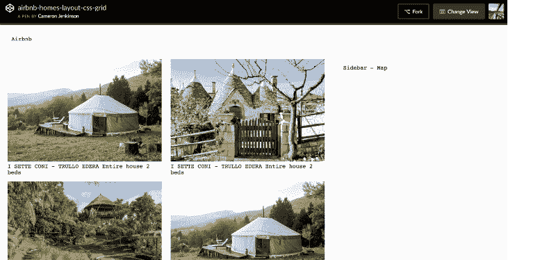

# 通过重新创建熟悉的布局来学习 CSS 网格:Airbnb、Youtube 等等

> 原文：<https://www.freecodecamp.org/news/learning-css-grid-through-recreating-airbnb-youtube-and-more-399c71377eaa/>

卡梅隆·简金森



# 通过重新创建熟悉的布局来学习 CSS 网格:Airbnb、Youtube 等等

我通过例子学得最好，我猜你来到这里是因为你也一样。我发现通过重新创建我所熟悉的产品和网站的布局，学习 CSS Grid 的特性要容易得多。

对于每个布局，我都使用了一个主视图作为理解如何使用 CSS 网格构建它的基础。

**注意:**我已经省略了大部分关于如何处理布局的复杂细节(动画、数据等)。)以便将重点放在探索布局和网格特性如何工作上。因此，请记住，布局可能不会完全按照他们的官方行为。

我这篇文章的目的是作为一个参考点和指南，用相对少的代码引导类似的布局(这就是为什么 CSS Grid 擅长它所做的)。

我计划添加额外的布局到这个职位超时。

最近更新:【2017 年 12 月 11 日

当前布局:

1.  Airbnb 首页
2.  YouTube 主页
3.  Pinterest 主页视图

接下来:

*   声音云
*   彭博
*   赫芬顿邮报

### CSS 网格

什么是 CSS 网格？

> ***CSS 网格布局*** *擅长将页面划分为主要区域，或者根据大小、位置和层来定义由 HTML 原语构建的控件各部分之间的关系。*

> 与表格一样，网格布局使作者能够将元素排列成列和行。然而，与表格相比，CSS Grid 可以实现更多的布局，或者更容易实现。例如，grid 容器的子元素可以自己定位，这样它们实际上是重叠和分层的，类似于 CSS 定位的元素。—[MDN](https://developer.mozilla.org/en-US/docs/Web/CSS/CSS_Grid_Layout)

简而言之，CSS Grid 提供了一组布局控件和工具，基于列和行的布局的现有实现使用宽度和浮动属性创建。

CSS 网格也不止于此。它可以根据你定义的规则动态更新属性(比如:“当浏览器是这个宽度时，这样做” *)* 。因此，我认为这是前端布局方法的未来。

对于那些不熟悉网格概念的人来说:网格是一组线条(可以把它想象成一本[古老的数学著作](https://animemiz.files.wordpress.com/2009/01/exercise-book-2.jpg))，其中有水平和垂直的线条，可以定义元素的位置。

### 网格术语:

#### 网格容器

网格容器是父容器，它将保存放置在网格上的所有项目。它定义了网格线的初始状态(垂直和水平)。

要创建 CSS 网格，只需将`display: grid;`添加到您在文档中使用的包装器或容器中。

#### 网格项目

网格容器的所有子容器都被引用为网格`item`。

#### 网格线

网格线表示垂直列(列网格线)和水平列(行网格线)。

有两个属性`grid-template-columns`和 `grid-template-rows`用于定义布局的网格线。

`grid-template-columns`定义列位置，而`grid-template-rows`定义行位置。

#### 网格单元

这是网格布局中最小的区域，由四条网格线定义。

#### 网格区域

网格区域是一个特定的命名容器区域，用于保存由网格线定义的网格单元。

### 通过示例学习 CSS 网格

### 1. [Airbnb](https://www.airbnb.co.uk/s/homes)

#### 文档布局:

```
<div class="wrapper">  <header class="header">Airbnb</header>      <article class="content">      	<div class="panel">  		  		<span>Home name</span>  	</div>        <!-- Rest of the home items ... -->      </article>    <aside class="sidebar">Sidebar - Map</aside>  </div>
```

#### 主网格:

```
.wrapper {  margin: 0 auto;  display: grid;  grid-template-columns: 65% 35%;  grid-gap: 16px;}
```

`wrapper`类定义了网格容器，这个容器保存核心文档块(`article`是包含 home 项的区域，`aside`是侧边栏地图)。

在设置了`display: grid`属性之后，布局实际上已经被定义为一个网格，我们可以使用`grid-template-columns`来声明使用百分比的列的`track-size`。

`track-size`可以是网格中自由空间的长度、百分比或分数(使用`fr`单位)。

```
.content {  padding: 8px;  display: grid;  margin: 0 auto;  grid-template-columns: repeat(auto-fill, minmax(230px, 1fr)) ;  grid-auto-rows: minmax(264px, auto);  grid-gap: 16px;}
```

主网格包含一个类名为`.content`的次级容器(子网格)。这表示 article 元素的区域，它包含所有的 home 项。

子网格是用列和行定义的，因此所有的项目都可以调整大小。

这里使用了一些新东西，所以让我们逐一分析一下。

当定义列时，我们使用`repeat(auto-fill, minmax(300px, 1fr));`作为:

`repeat()`本质上避免了为每一列声明轨道大小的重复，但是当它与`auto-fill`一起使用时会变得更有趣。

当`auto-fill`被给定为重复次数时，如果[网格容器](https://drafts.csswg.org/css-grid/#grid-container)在相关轴上具有[确定的](https://drafts.csswg.org/css-sizing-3/#definite)大小或最大大小，则重复次数是不会导致[网格](https://drafts.csswg.org/css-grid/#grid)溢出其[网格容器](https://drafts.csswg.org/css-grid/#grid-container)的最大可能正整数。

通过将`auto-fill`与`repeat()`结合使用，我们告诉网格自动计算出容器大小可以容纳多少项，而无需我们做任何额外的计算。

`minmax`定义大于等于`min`小于等于`max`的尺寸范围。

如果`max <` min，那么 max 被忽略`nd minmax(min,m` ax)被视为`as` min。作为最大值，值设定轨道的伸缩因子，作为最小值无效。

`fr`单元允许你设置一个轨迹的大小，作为网格容器自由空间的一部分。

例如，下面将把每个项目设置为网格容器宽度的三分之一:

`minmax`允许我们指定在重新调整尺寸时项目必须保持固定的宽度。

声明列后，我们移到行上`grid-auto-rows: minmax(275px, auto);`

我们再次利用`minmax`来指定放置在子网格上的每个项目的最大高度，在这种情况下，每个家庭将是 275 像素。

作为最大值，它与[最大含量](https://drafts.csswg.org/css-grid/#valdef-grid-template-columns-max-content)相同。至少代表占据[网格轨迹](https://drafts.csswg.org/css-grid/#grid-track)的[网格项](https://drafts.csswg.org/css-grid/#grid-%3Eitem)的最大最小尺寸(由[最小宽度](https://drafts.csswg.org/css21/visudet.html#propdef-min-width) / [最小高度](https://drafts.csswg.org/css21/visudet.html#propdef-min-height)指定)。

在列声明中使用`auto`而不是`1fr`,因为我们希望项目的宽度根据列的宽度自动改变。

```
@media (max-width: 1100px) {  .wrapper {    grid-template-columns: 1fr;  }    .sidebar {    display: none;  }    .content {    width: 100%;    grid-template-columns: repeat(auto-fill, minmax(360px, 1fr) ) ;    grid-auto-rows: minmax(300px, auto);  }  }
```

这个例子中 CSS 网格的伟大之处在于，这个布局只需要一个媒体查询就可以创建一个简单的响应性布局。

在我决定这个断点之前，我为平板电脑、移动设备等设置了单独的断点，但我发现当在浏览器上重新调整大小时，它会使主页项目的大小发生剧烈变化，所以我坚持使用一个提供更流畅体验的断点。

媒体查询中布局的关键区别在于，主网格最初包含由百分比定义的两列，现在有一列定义了轨道大小`1fr`(我还根据生产中的行为隐藏了侧栏)。

然后，对于每个项目，使用相同的属性和方法，但是关键的不同是我增加了项目的高度和宽度(`360px, 300px`)。

这就是 Airbnb 主页，请回顾上面的 [CodePen](https://codepen.io/cameronjenkinson/full/zPGzLK/) 示例，看看它是如何响应的。

### 2. [YouTube](http://www.youtube.com/)

#### 文档布局:

```
<div class="wrapper">  <header class="header">Youtube</header>    <aside class="sidebar">Sidebar</aside>      <article class="content">         <div class="panel">            <span class="panel-title">Title of the video</span>       <br>      <span class="panel-subtitle">346,112 views</span>    </div>        <!--   Rest of the video items ... -->        </article>    </div>
```

#### 主网格:

```
.wrapper {  margin: 0 auto;  display: grid;  grid-template-columns: 15% 85%;  grid-gap: 16px;}
```

再次使用`wrapper`类来定义主网格。主网格中有两列与`<artic`le>`; and &`lt；文档上放着>标记。

我使用百分比来定义两列的`track-size`。

```
.content {  padding-right: 64px;  padding-left: 64px;  display: grid;  margin: 0 auto;  grid-template-columns: repeat(auto-fill, minmax(200px, 1fr));  grid-auto-rows: minmax(150px, auto);  grid-gap: 8px;}
```

再次使用`.content`属性表示另一个子网格，它将保存所有的视频项目。

请查看上面的 Airbnb 示例，进一步了解下面的属性和方法。

然后，我们使用`repeat(auto-fill, minmax(200px, 1fr));`定义了网格列，其中每个视频项目的宽度为 300 像素，并使用`auto-fill`自动填充`1fr`列。

已经使用`minmax`方法`grid-auto-rows: minmax(150px, auto);`定义了行，其中每个项目的最大宽度为 200px。`minmax`指定放置在子网格上的每个项目的最大高度，在这种情况下，每个家庭的最大高度为 150 像素。

```
@media (max-width: 1200px) {  .wrapper {    grid-template-columns: 2fr;  }    .sidebar {    display: none;  }     .content {    width: 100%;    grid-template-columns: repeat(auto-fill, minmax(200px, 2fr));    grid-auto-rows: minmax(150px, auto);  }}@media (max-width: 768px) {  .content {    padding-right: 48px;    padding-left: 48px;    grid-template-columns: repeat(3, minmax(200px, 3fr));    grid-auto-rows: minmax(150px, auto);  }}@media (max-width: 700px) {  .content {    padding-right: 116px;    padding-left: 116px;    grid-template-columns: repeat(2, minmax(200px, 2fr));    grid-auto-rows: minmax(150px, auto);  }}
```

有三个不同的断点用于反映 YouTube 主页的响应布局行为。

它们在布局上的主要区别在于，我们隐藏了侧边栏，并为视频项目定义了不同的栏。

对于平板电脑和更低版本，列数量被设置为`3fr`，这意味着有 3 个特定的列可以容纳视频，直到它到达移动设备，在那里它被固定为`2fr`两列。

随着布局缩小，视频项目周围的填充(左、右)会增加，从而确保缩略图的大小不会增加。

请回顾上面的 [CodePen](https://codepen.io/cameronjenkinson/full/YEpxEw/) 例子，看看它是如何工作的。

### 3. [Pinterest](https://www.pinterest.co.uk/)

#### 文档布局:

```
<div class="wrapper">  <header class="header">Pinterest</header>      <article class="content">        <div class="panel tall-panel">          </div>        <!--   Rest of the pin items ... -->       </article>    </div>
```

#### 主网格:

```
.wrapper {  margin: 0 auto;  display: grid;  grid-template-columns: 1fr;  grid-gap: 16px;}
```

在`wrapper`类中，我们定义了主网格容器和一个单列，轨道大小设置为`1fr`。

```
.content {  padding-right: 40px;  padding-left: 40px;  display: grid;  margin: 0 auto;  grid-template-columns: repeat(auto-fill, minmax(240px, 1fr));  grid-auto-rows: minmax(200px, auto);  grid-gap: 16px;}
```

次级网格包含所有固定的项目，用我们定义列和行的类名`.content`表示。

在定义列时，我们使用了`repeat(auto-fill, minmax(240px, 1fr));`

随着列的声明，我们移动到行上`grid-auto-rows: minmax(200px, auto);`

我们再次利用`minmax`来指定放置在子网格上的每个项目的最大宽度，在这种情况下，每个家庭将为 200 像素。

在列声明中使用`auto`而不是`1fr`,因为我们希望项目的宽度根据列的宽度自动改变。

```
@media (max-width: 1200px) {   .content {    padding-right: 72px;    padding-left: 72px;    width: 100%;    grid-template-columns: repeat(3, minmax(220px, 1fr) ) ;    grid-auto-rows: minmax(200px, auto);  }  }
```

一个简单的媒体查询被用来创建一个响应性的布局，其中我们用引脚周围的额外填充来更新`.content`类。在这一点上，我们如何处理引脚的关键细节是将 repeat 方法中的`auto-fill`值更改为`3`，这告诉网格我们希望在这个视图端口上不少于三列。

这就是 Pinterest，一个相对简单的布局。请回顾上面的 [CodePen](https://codepen.io/cameronjenkinson/full/EbNvYd/) 示例，看看它是如何响应的

这就是现在的全部，我将在接下来的一年中添加额外的布局，我希望每次都能进一步增加布局的复杂性。

#### 进一步学习:

*   这篇文章的大部分关键知识和基础来自 Rachel Andrew 的 [gridbyexample](https://gridbyexample.com/)
*   [CSS-Ticks:完整的引导网格](https://css-tricks.com/snippets/css/complete-guide-grid/)
*   [CSS 网格花园](https://cssgridgarden.com/)
*   [CSS 网格文档](https://drafts.csswg.org/css-grid/)
*   为了从头开始创建一个网格系统，看看 Stuart Robson 组装了什么

最初发表于[cameronjjenkinson.com](http://cameronjjenkinson.com/exploring-css-through-familiar-layouts/)。