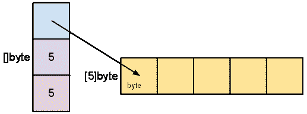

# 学习围棋——从零到英雄

> 原文：<https://www.freecodecamp.org/news/learning-go-from-zero-to-hero-d2a3223b3d86/>

先来个围棋(或 Golang)的小介绍。围棋是由谷歌工程师罗伯特·格里斯默、罗布·派克和肯·汤普森设计的。它是一种静态类型的编译语言。第一个版本于 2012 年 3 月作为开源发布。

> “Go 是一种开源编程语言，可以轻松构建简单、可靠、高效的软件”。— GoLang

在许多语言中，有许多方法可以解决给定的问题。程序员可以花很多时间去思考解决这个问题的最佳方法。

另一方面，Go 相信较少的特性——只有一种正确的方法来解决问题。

这节省了开发人员的时间，并使大型代码库易于维护。Go 中没有地图、滤镜之类的“有表现力”的功能。

> “当你拥有增加表现力的功能时，通常会增加费用”——Rob Pike


Recently published new logo of go lang: [https://blog.golang.org/go-brand](https://blog.golang.org/go-brand)

### 入门指南

围棋是由包组成的。包 main 告诉 Go 编译器，程序被编译为可执行文件，而不是共享库。它是应用程序的入口点。主包定义为:

```
package main
```

让我们通过在 Go 工作区中创建一个文件`main.go`来编写一个简单的 hello world 示例。

#### **工作空间**

Go 中的工作空间由环境变量`GOPATH`定义。

你写的任何代码都要写在工作空间里面。Go 将搜索`GOPATH`目录或`GOROOT`目录中的任何包，这是安装 Go 时默认设置的。`GOROOT` 是围棋安装的路径。

将`GOPATH`设置为您想要的目录。现在，让我们将它添加到一个文件夹`~/workspace`中。

```
# export env
export GOPATH=~/workspace
# go inside the workspace directory
cd ~/workspace
```

在我们刚刚创建的工作区文件夹中，用下面的代码创建文件`main.go`。

#### 你好世界！

```
package main

import (
 "fmt"
)

func main(){
  fmt.Println("Hello World!")
}
```

在上面的例子中，`fmt`是 Go 中的一个内置包，它实现了格式化 I/O 的函数。

我们在 Go 中使用`import` 关键字导入一个包。`func main`是执行代码的主要入口点。`Println`是包`fmt`里面的一个函数，为我们打印“hello world”。

让我们通过运行这个文件来看看。有两种方法可以运行 Go 命令。我们知道，Go 是一种编译语言，所以在执行之前首先需要编译。

```
> go build main.go
```

这创建了一个二进制可执行文件`main`，现在我们可以运行它了:

```
> ./main 
# Hello World!
```

还有另一种更简单的方式来运行程序。`go run`命令有助于抽象编译步骤。您可以简单地运行下面的命令来执行程序。

```
go run main.go
# Hello World!
```

***注意*** *:要尝试这篇博客中提到的代码，你可以使用[https://play.golang.org](https://play.golang.org/)*

### 变量

Go 中的变量是显式声明的。Go 是一种静态类型语言。这意味着在变量声明时检查变量类型。变量可以声明为:

```
var a int
```

在这种情况下，该值将被设置为 0。使用以下语法用不同的值声明和初始化变量:

```
var a = 1
```

这里变量被自动赋值为 int。我们可以将变量声明的简写定义为:

```
message := "hello world"
```

我们也可以在同一行中声明多个变量:

```
var b, c int = 2, 3
```

### 数据类型

像任何其他编程语言一样，Go 支持各种不同的数据结构。让我们探索其中的一些:

#### **数字、字符串和布尔值**

一些受支持的数字存储类型有 int、int8、int16、int32、int64、
uint、uint8、uint16、uint32、uint64、uintptr…

字符串类型存储一个字节序列。用关键字`string`表示和声明。

使用关键字`bool`存储一个布尔值。

Go 还支持复数类型数据类型，可以用`complex64`和`complex128`声明。

```
var a bool = true
var b int = 1
var c string = 'hello world'
var d float32 = 1.222
var x complex128 = cmplx.Sqrt(-5 + 12i)
```

#### **阵列、切片和图**

数组是相同数据类型的元素序列。数组在声明时定义了固定长度，因此不能扩展超过这个长度。数组被声明为:

```
var a [5]int
```

数组也可以是多维的。我们可以简单地用以下格式创建它们:

```
var multiD [2][3]int
```

当数组的值在运行时改变时，数组是有限制的。数组也不提供获取子数组的能力。为此，Go 有一个称为切片的数据类型。

切片存储一系列元素，可以随时扩展。切片声明类似于数组声明，但没有定义容量:

```
var b []int
```

这将创建一个容量和长度都为零的切片。切片也可以用容量和长度来定义。我们可以使用以下语法:

```
numbers := make([]int,5,10)
```

这里，切片的初始长度为 5，容量为 10。

切片是对数组的抽象。切片使用数组作为底层结构。切片包含三个部分:容量、长度和指向底层数组的指针，如下图所示:



image src: [https://blog.golang.org/go-slices-usage-and-internals](https://blog.golang.org/go-slices-usage-and-internals)

使用追加或复制功能可以增加切片的容量。append 函数将值添加到数组的末尾，并在需要时增加容量。

```
numbers = append(numbers, 1, 2, 3, 4)
```

另一种增加切片容量的方法是使用复制功能。只需创建另一个容量更大的存储片，并将原始存储片拷贝到新创建的存储片:

```
// create a new slice
number2 := make([]int, 15)
// copy the original slice to new slice
copy(number2, number)
```

我们可以创建切片的子切片。这可以通过使用以下命令来完成:

```
// initialize a slice with 4 len and values
number2 = []int{1,2,3,4}
fmt.Println(numbers) // -> [1 2 3 4]
// create sub slices
slice1 := number2[2:]
fmt.Println(slice1) // -> [3 4]
slice2 := number2[:3]
fmt.Println(slice2) // -> [1 2 3]
slice3 := number2[1:4]
fmt.Println(slice3) // -> [2 3 4]
```

map 是 Go 中的一种数据类型，它将键映射到值。我们可以使用以下命令定义一个映射:

```
var m map[string]int
```

这里的`m`是新的 map 变量，它的键是`string`，值是`integers`。我们可以轻松地向地图添加键和值:

```
// adding key/value
m['clearity'] = 2
m['simplicity'] = 3
// printing the values
fmt.Println(m['clearity']) // -> 2
fmt.Println(m['simplicity']) // -> 3
```

### **类型转换**

使用类型转换可以将一种数据类型转换为另一种数据类型。让我们来看一个简单的类型转换:

```
a := 1.1
b := int(a)
fmt.Println(b)
//-> 1
```

并非所有类型的数据类型都可以转换为另一种类型。请确保数据类型与转换兼容。

### 条件语句

#### 否则

对于条件语句，我们可以使用 if-else 语句，如下例所示。确保花括号和条件在同一行。

```
if num := 9; num < 0 {
 fmt.Println(num, "is negative")
} else if num < 10 {
 fmt.Println(num, "has 1 digit")
} else {
 fmt.Println(num, "has multiple digits")
}
```

#### 开关盒

Switch cases 有助于组织多个条件语句。以下示例显示了一个简单的 switch case 语句:

```
i := 2
switch i {
case 1:
 fmt.Println("one")
case 2:
 fmt.Println("two")
default:
 fmt.Println("none")
}
```

### 环

Go 对于循环只有一个关键字。单个 for 循环命令有助于实现不同类型的循环:

```
i := 0
sum := 0
for i < 10 {
 sum += 1
  i++
}
fmt.Println(sum)
```

上面的示例类似于 c 中的 while 循环。相同的 for 语句可用于普通的 for 循环:

```
sum := 0
for i := 0; i < 10; i++ {
  sum += i
}
fmt.Println(sum)
```

Go 中的无限循环:

```
for {
}
```

### 两颗北极指极星

Go 提供了指针。指针是保存值的地址的地方。指针由*定义。指针是根据数据类型定义的。示例:

```
var ap *int 
```

这里的`ap`是指向整数类型的指针。`&`操作符可以用来获取变量的地址。

```
a := 12
ap = &a 
```

使用`*`操作符可以访问指针指向的值:

```
fmt.Println(*ap)
// => 12
```

在将结构作为参数传递时，或者在为定义的类型声明方法时，通常首选指针。

1.  当传递值时，值实际上是被复制的，这意味着更多的内存
2.  随着指针的传递，由函数改变的值被反映回方法/函数调用方。

示例:

```
func increment(i *int) {
  *i++
}
func main() {
  i := 10
  increment(&i)
  fmt.Println(i)
}
//=> 11
```

注意:当您在尝试博客中的示例代码时，不要忘记将它包含在包 main 中，并在需要时导入 fmt 或其他包，如上面的第一个 main.go 示例所示。

### 功能

主包中定义的 main 函数是 go 程序执行的入口点。可以定义和使用更多的函数。让我们看一个简单的例子:

```
func add(a int, b int) int {
  c := a + b
  return c
}
func main() {
  fmt.Println(add(2, 1))
}
//=> 3
```

正如我们在上面的例子中看到的，Go 函数是使用 **func** 关键字后跟函数名定义的。函数的**参数**需要根据它的数据类型来定义，最后是返回的数据类型。

函数的返回也可以在函数中预先定义:

```
func add(a int, b int) (c int) {
  c = a + b
  return
}
func main() {
  fmt.Println(add(2, 1))
}
//=> 3
```

这里 c 被定义为返回变量。所以定义的变量 c 会自动返回，而不需要在最后的 return 语句中定义。

您也可以从单个函数返回多个返回值，用逗号分隔返回值。

```
func add(a int, b int) (int, string) {
  c := a + b
  return c, "successfully added"
}
func main() {
  sum, message := add(2, 1)
  fmt.Println(message)
  fmt.Println(sum)
}
```

### 方法、结构和接口

Go 并不是一种完全面向对象的语言，但是通过结构、接口和方法，它有很多面向对象的支持和感觉。

#### 结构体

结构是不同字段的类型化集合。结构用于将数据分组在一起。例如，如果我们想要对一个人类型的数据进行分组，我们定义一个人的属性，可以包括姓名、年龄、性别。可以使用以下语法定义结构:

```
type person struct {
  name string
  age int
  gender string
}
```

定义了人员类型结构后，现在让我们创建一个人员:

```
//way 1: specifying attribute and value
p = person{name: "Bob", age: 42, gender: "Male"}
//way 2: specifying only value
person{"Bob", 42, "Male"}
```

我们可以用一个点(.)

```
p.name
//=> Bob
p.age
//=> 42
p.gender
//=> Male
```

您也可以使用结构的指针直接访问结构的属性:

```
pp = &person{name: "Bob", age: 42, gender: "Male"}
pp.name
//=> Bob
```

#### 方法

方法是一种带有*接收器的特殊类型的函数。*接收者既可以是值，也可以是指针。让我们创建一个名为 describe 的方法，它具有我们在上面的示例中创建的接收者类型 person:

```
package main
import "fmt"

// struct defination
type person struct {
  name   string
  age    int
  gender string
}

// method defination
func (p *person) describe() {
  fmt.Printf("%v is %v years old.", p.name, p.age)
}
func (p *person) setAge(age int) {
  p.age = age
}

func (p person) setName(name string) {
  p.name = name
}

func main() {
  pp := &person{name: "Bob", age: 42, gender: "Male"}
  pp.describe()
  // => Bob is 42 years old
  pp.setAge(45)
  fmt.Println(pp.age)
  //=> 45
  pp.setName("Hari")
  fmt.Println(pp.name)
  //=> Bob
}
```

正如我们在上面的例子中看到的，现在可以使用点操作符`pp.describe`来调用该方法。注意，接收器是一个指针。通过指针，我们传递了一个对值的引用，所以如果我们在方法中做了任何改变，它将反映在接收者 pp 中。它也不会创建对象的新副本，这节省了内存。

请注意，在上面的示例中，age 的值被更改，而 name 的值没有更改，因为方法 setName 属于 receiver 类型，而 setAge 属于 pointer 类型。

#### 接口

Go 接口是方法的集合。接口有助于将类型的属性组合在一起。让我们以界面动物为例:

```
type animal interface {
  description() string
}
```

这里 animal 是一个接口类型。现在让我们创建两种不同类型的动物，它们实现了动物接口类型:

```
package main

import (
  "fmt"
)

type animal interface {
  description() string
}

type cat struct {
  Type  string
  Sound string
}

type snake struct {
  Type      string
  Poisonous bool
}

func (s snake) description() string {
  return fmt.Sprintf("Poisonous: %v", s.Poisonous)
}

func (c cat) description() string {
  return fmt.Sprintf("Sound: %v", c.Sound)
}

func main() {
  var a animal
  a = snake{Poisonous: true}
  fmt.Println(a.description())
  a = cat{Sound: "Meow!!!"}
  fmt.Println(a.description())
}

//=> Poisonous: true
//=> Sound: Meow!!!
```

在主函数中，我们创建了一个动物类型的变量`a`。我们为动物指定一个蛇和一个猫的类型，并使用 Println 打印一个描述。因为我们已经以不同的方式在这两种类型(猫和蛇)中实现了方法 describe，所以我们打印了动物的描述。

### 包装

我们把 Go 中的所有代码都写在一个包里。**主**包是程序执行的入口点。Go 里有很多内置的包。我们一直在使用的最著名的一个是 **fmt** 包。

> “go 将编程的主要机制打包在 Go 提供的大块中，它们使得将一个大项目分割成小块成为可能。”

> 罗伯特·格里森

#### 安装软件包

```
go get <package-url-github>
// example
go get github.com/satori/go.uuid
```

我们安装的包保存在 GOPATH env 中，这是我们的工作目录。你可以在我们的工作目录`cd $GOPATH/pkg`下的 pkg 文件夹中看到这些包。

#### 创建自定义包

让我们首先创建一个文件夹 custom_package:

```
> mkdir custom_package
> cd custom_package
```

要创建一个定制的包，我们需要首先创建一个文件夹，其中包含我们需要的包名。假设我们正在构建一个包`person`。为此，让我们在`custom_package`文件夹中创建一个名为`person`的文件夹:

```
> mkdir person
> cd person
```

现在让我们创建一个文件 person .进入这个文件夹。

```
package person
func Description(name string) string {
  return "The person name is: " + name
}
func secretName(name string) string {
  return "Do not share"
}
```

我们现在需要安装软件包，以便可以导入和使用它。所以让我们安装它:

```
> go install
```

现在让我们回到 custom_package 文件夹并创建一个 main.go 文件

```
package main
import(
  "custom_package/person"
  "fmt"
)
func main(){ 
  p := person.Description("Milap")
  fmt.Println(p)
}
// => The person name is: Milap
```

现在我们可以导入我们创建的包`person`并使用函数描述。请注意，我们在包中创建的函数`secretName`将不可访问。在 Go 中，没有大写字母开头的方法名是私有的。

#### **包文档**

Go 内置了对包文档的支持。运行以下命令生成文档:

```
godoc person Description
```

这将为我们的 package person 内部的描述函数生成文档。要查看文档，请使用以下命令运行 web 服务器:

```
godoc -http=":8080"
```

现在转到 URL[http://localhost:8080/pkg/](http://localhost:6060/pkg/)并查看我们刚刚创建的包的文档。

#### Go 中的一些内置包

**fmt**

这个包实现了格式化的 I/O 函数。我们已经使用了这个包来输出到 stdout。

**json**

Go 中另一个有用的包是 json 包。这有助于编码/解码 JSON。我们举个例子来编码/解码一些 json:

编码

```
package main

import (
  "fmt"
  "encoding/json"
)

func main(){
  mapA := map[string]int{"apple": 5, "lettuce": 7}
  mapB, _ := json.Marshal(mapA)
  fmt.Println(string(mapB))
}
```

译

```
package main

import (
  "fmt"
  "encoding/json"
)

type response struct {
  PageNumber int `json:"page"`
  Fruits []string `json:"fruits"`
}

func main(){
  str := `{"page": 1, "fruits": ["apple", "peach"]}`
  res := response{}
  json.Unmarshal([]byte(str), &res)
  fmt.Println(res.PageNumber)
}
//=> 1
```

在使用 unmarshal 解码 json 字节时，第一个参数是 json 字节，第二个参数是我们希望 json 映射到的响应类型结构的地址。注意，`json:”page”`将 page 键映射到结构中的 PageNumber 键。

### 错误处理

错误是一个程序不希望的和意想不到的结果。假设我们正在对外部服务进行 API 调用。此 API 调用可能成功，也可能失败。当出现错误类型时，可以识别 Go 程序中的错误。让我们看看这个例子:

```
resp, err := http.Get("http://example.com/") 
```

这里，对错误对象的 API 调用可能通过，也可能失败。我们可以检查错误是零还是存在，并相应地处理响应:

```
package main

import (
  "fmt"
  "net/http"
)

func main(){
  resp, err := http.Get("http://example.com/")
  if err != nil {
    fmt.Println(err)
    return
  }
  fmt.Println(resp)
}
```

#### 从函数返回自定义错误

当我们编写自己的函数时，有时会出现错误。这些错误可以在 error 对象的帮助下返回:

```
func Increment(n int) (int, error) {
  if n < 0 {
    // return error object
    return nil, errors.New("math: cannot process negative number")
  }
  return (n + 1), nil
}
func main() {
  num := 5

  if inc, err := Increment(num); err != nil {
    fmt.Printf("Failed Number: %v, error message: %v", num, err)
  }else {
    fmt.Printf("Incremented Number: %v", inc)
  }
}
```

大多数内置在 Go 中的包，或者我们使用的外部包，都有一个错误处理机制。所以我们调用的任何函数都有可能出错。正如我们在上面的例子中所做的那样，这些错误永远不应该被忽略，而应该在我们调用这些函数的地方被优雅地处理。

#### 恐慌

死机是指在程序执行过程中突然遇到的无法处理的情况。在 Go 中，死机并不是处理程序异常的理想方式。建议使用错误对象。当出现紧急情况时，程序执行会停止。恐慌之后执行的是延迟。

```
//Go
package main

import "fmt"

func main() {
    f()
    fmt.Println("Returned normally from f.")
}

func f() {
    defer func() {
        if r := recover(); r != nil {
            fmt.Println("Recovered in f", r)
        }
    }()
    fmt.Println("Calling g.")
    g(0)
    fmt.Println("Returned normally from g.")
}

func g(i int) {
    if i > 3 {
        fmt.Println("Panicking!")
        panic(fmt.Sprintf("%v", i))
    }
    defer fmt.Println("Defer in g", i)
    fmt.Println("Printing in g", i)
    g(i + 1)
}
```

#### 推迟

Defer 总是在函数结束时执行。

在上面的例子中，我们使用 panic()来扰乱程序的执行。正如您所注意到的，有一个 defer 语句，它将使程序在程序执行结束时执行该行。当我们需要在函数结束时执行一些事情，例如关闭一个文件时，也可以使用 Defer。

### 并发

Go 的构建考虑到了并发性。Go 中的并发性可以通过轻量级线程的 Go 例程来实现。

**围棋套路**

Go 例程是可以与另一个函数并行或并发运行的函数。创建一个 Go 例程非常简单。只需在函数前添加一个关键字 Go，我们就可以让它并行执行。围棋程序是非常轻量级的，所以我们可以创建数以千计的程序。让我们看一个简单的例子:

```
package main
import (
  "fmt"
  "time"
)
func main() {
  go c()
  fmt.Println("I am main")
  time.Sleep(time.Second * 2)
}
func c() {
  time.Sleep(time.Second * 2)
  fmt.Println("I am concurrent")
}
//=> I am main
//=> I am concurrent
```

正如你在上面的例子中看到的，函数 c 是一个与主 Go 线程并行执行的 Go 例程。有时候，我们希望在多个线程之间共享资源。Go 不喜欢一个线程与另一个线程共享变量，因为这增加了死锁和资源等待的机会。go 例程之间还有另外一种共享资源的方式:通过 Go 通道。

**频道**

我们可以使用通道在两个 Go 例程之间传递数据。创建信道时，有必要指定信道接收哪种数据。让我们创建一个字符串类型的简单通道，如下所示:

```
c := make(chan string) 
```

通过这个通道，我们可以发送字符串类型的数据。我们可以在这个通道中发送和接收数据:

```
package main

import "fmt"

func main(){
  c := make(chan string)
  go func(){ c <- "hello" }()
  msg := <-c
  fmt.Println(msg)
}
//=>"hello"
```

接收方通道等待，直到发送方向通道发送数据。

**单向通道**

有些情况下，我们希望 Go 例程通过通道接收数据，但不发送数据，反之亦然。为此，我们还可以创建一个**单向通道**。让我们看一个简单的例子:

```
package main

import (
 "fmt"
)

func main() {
 ch := make(chan string)

 go sc(ch)
 fmt.Println(<-ch)
}

func sc(ch chan<- string) {
 ch <- "hello"
}
```

在上面的例子中，`sc`是一个 Go 例程，它只能向通道发送消息，而不能接收消息。

### 使用选择为 Go routine 组织多个通道

一个函数可能正在等待多个通道。为此，我们可以使用 select 语句。为了更清楚起见，让我们看一个例子:

```
package main

import (
 "fmt"
 "time"
)

func main() {
 c1 := make(chan string)
 c2 := make(chan string)
 go speed1(c1)
 go speed2(c2)
 fmt.Println("The first to arrive is:")
 select {
 case s1 := <-c1:
  fmt.Println(s1)
 case s2 := <-c2:
  fmt.Println(s2)
 }
}

func speed1(ch chan string) {
 time.Sleep(2 * time.Second)
 ch <- "speed 1"
}

func speed2(ch chan string) {
 time.Sleep(1 * time.Second)
 ch <- "speed 2"
}
```

在上面的例子中，main 在两个通道 c1 和 c2 上等待。通过主函数打印的 select case 语句，消息从最先收到的通道发送出去。

**缓冲通道**

您可以在 go 中创建一个缓冲通道。对于缓冲通道，如果缓冲区已满，发送到该通道的消息将被阻止。让我们来看看这个例子:

```
package main

import "fmt"

func main(){
  ch := make(chan string, 2)
  ch <- "hello"
  ch <- "world"
  ch <- "!" # extra message in buffer
  fmt.Println(<-ch)
}

# => fatal error: all goroutines are asleep - deadlock!
```

正如我们在上面看到的，一个通道接受的消息不超过 2 条。

#### Golang 为什么成功？

> 简单……—罗布·派克

### 太好了！

我们学习了围棋的一些主要组成部分和特点。

1.  变量，数据类型
2.  阵列切片和图
3.  功能
4.  循环和条件语句
5.  两颗北极指极星
6.  包装
7.  方法、结构和接口
8.  错误处理
9.  并发性— Go 例程和通道

恭喜你，你现在对围棋有了一个很好的理解。

> 我最有效率的一天是扔掉了 1000 行代码。

> —肯·汤普森

不要停在这里。继续前进。考虑一个小的应用程序，然后开始构建。

[LinkedIn](https://www.linkedin.com/in/milap-neupane-99a4b565/) ， [Github](http://github.com/milap-neupane) ， [Twitter](https://twitter.com/_milap)

也发表在 Milap Neupane 博客上:[学习围棋——从零到英雄](https://milapneupane.com.np/2019/07/06/learning-golang-from-zero-to-hero/)