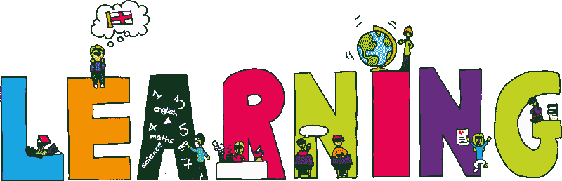
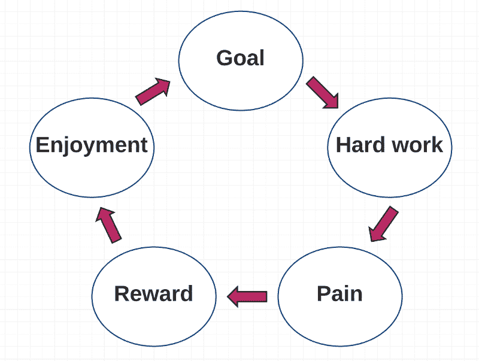

# 学习如何学习:最重要的开发人员技能

> 原文：<https://www.freecodecamp.org/news/learning-how-to-learn-the-most-important-developer-skill-7bf62dfaf67d/>

作者:Preethi Kasireddy

# 学习如何学习:最重要的开发人员技能

Source: [https://themindblower96.wordpress.com/2015/05/21/54/](https://themindblower96.wordpress.com/2015/05/21/54/)

做一个高效的学习者至少和做一个高效的编码者一样重要。

当你是一名开发人员时，你的工作要求你每天都要学习——尽管有黑客新闻、Twitter、Reddit 和脸书等分心事物的不断诱惑。

在工作中，您会不断遇到新的代码库和新的技术挑战。当你处理开源回购和个人项目时，家里也好不到哪里去，每个项目都有自己的流程和挑战要解决。

技术世界变化很快，跟上最新的工具、语言和框架就像是一份全职工作。

长话短说:学习很难。然而，我们需要能够快速有效地学习，才能茁壮成长。

在过去的一年里，我从不知道如何使用 Chrome 调试器变成了一家领先加密货币公司的软件工程师。在这个过程中，我很快学会了一项新技能(编码)。

也就是说，学习对我来说并不容易。

老实说，每一个新概念都是一场斗争。有太多的未知和不确定性。

“这究竟是如何可持续的？”我心想。

“如果这就是每天学习编码的感觉，我会很痛苦。这真的是我的激情吗？”

“如果这是我的热情所在，这对我来说不是很容易吗？艺术家为了创作艺术而奋斗吗？作家会为写出一本伟大的书而奋斗吗？运动员会努力在比赛中取得好成绩吗？当我们追求激情时，我们应该奋斗吗？”

“难道我不应该乐在其中吗？”

### 事情变得容易了吗？

是的，确实如此。一年后，处理新的编程概念仍然是“困难的”,因为它需要纪律和努力。

但这也变成了一个令人愉快的过程，而不是一个势不可挡的过程。

去年发生了什么让这种转变成为可能？

很简单:我改变了学习的角度。曾经让我觉得“困难”的事情变成了“吸引人”

在这篇文章的剩余部分，我将解释这种转变是如何发生的。

### 刚刚开始

学习编码在开始时是最难的。

例如，想想你必须学习的第一门编程语言。你想解决语法和风格这样的小问题。但是首先，你必须理解困难的核心概念，比如值、类型、操作符、控制流、函数、高阶函数、作用域、闭包、递归等等。

这感觉就像学习变戏法一样——但是从十八个球瓶开始，而不是两个。

当我第一次学习闭包时，我花了很多周才真正理解这个概念。当我读到它的时候，我以为我明白了。但是当我试图在实践中识别和使用闭包时，我发现自己被难住了。

这并不罕见。作为一名教师，我也观察到了这个过程:新的概念通常不会在第一次出现。或者第二个。甚至是第十个。

但对于那些坚持足够长时间的人来说，会有一个“转折点”，事情突然开始变得有意义。在我的例子中，我阅读了互联网上所有关于闭包的博客文章、栈溢出文章和规范。

我阅读和实验的所有东西都给了我一个新的视角，直到最后，我对闭包是如何工作的有了一个 360 度的概念。闭包“咔嚓”一声。

达到我觉得理解闭包的这种感觉非常重要的程度，因为这是值得的，并鼓励我去做更多的事情——包括写我自己的博客文章来解释这个概念。

### 学习是一个过程，而不是目标

如果我们认为学习是我们“不得不”做的事情，那么我们会匆忙完成它，这样我们就可以用剩下的时间做一些更“有趣”的事情——一些我们“想要”做的事情。

问题是不可能知道任何事情的一切，所以将学习视为一场赛跑会导致精疲力尽和失望。

相反，如果你把学习看作一个过程，你会欣赏这个过程中的小胜利和洞察力。这会驱使你不断前进。

你可以把它比作锻炼。锻炼会带来疼痛，当你的锻炼结束时，疼痛也随之消失。但它从未消失。它在等着你下次锻炼。除了每一次，疼痛变得不那么尖锐。你学会了应付它。你对疼痛变得熟悉，它只是成为日常生活的一部分。你得到的回报是更好的健康和更好的体格，并受到激励继续前进。

锻炼创造了一个积极的反馈循环:

学习也是如此。

### 将学习变成一个吸引人的过程

想象一下构建您的第一个 web 应用程序。

首先，您得到的只是一个令人畏惧的空白文本编辑器。构建应用程序的任务似乎几乎无法完成。你什么都不知道，在你做到这一点之前还有很多要学。

谢天谢地，你还是决定去争取。

从那时起，你的主要注意力就变成了一次做一小步。

首先，你创造一个想法。你会建造什么？谁是最终用户？制约因素是什么？

第二，你原型或勾画出一些你认为它可能看起来像什么的粗略设计。你向你的朋友或互联网寻求反馈，并不断迭代使之变得更好。

第三，您研究最适合您需求的语言、工具和框架。

一步一步地，你训练你的大脑把所有的能量都导向这个目标。

有时候你在写代码。

通常情况下，您会因为一些 bug 或错误而停滞不前。

有时候你太累了，什么都做不了，所以你休息一下。

其他时候，你不想写代码。没关系。你花时间研究或阅读与你的项目相关的主题。

最终，经过几周的努力，你已经建立了一个可以处理你的大想法的基础。突然间，在你的应用上工作不再感到痛苦。你看到了最初努力工作的回报，现在它只是你需要编写的另一段代码或你需要做的另一点重构——你已经做了上百次了，没问题。

你把曾经令人畏惧或可怕的活动变成了复杂和吸引人的活动。

这是我们成长的方式。这是我们变得更好的方法。无论是编程、跳舞、跑步还是阅读:这都不容易，永远不会有你“完成”学习的时间或地点。

相反，享受把精力投入到某件事情的过程，享受随之而来的痛苦。你会开始注意到，你不再用“痛苦”来形容它——因为曾经痛苦的事情变成了下一步的象征:个人成就感和自我满足感。

换句话说，奋斗和享受将开始意味着同一件事。记住循环:

### 学习技术主题的一种方法

让我告诉你一点我遵循的学习过程。这并不是学习风格的终极目标，所以如果有不同的方法适合你，请在评论中分享！万一你说不出来，我对这东西是个书呆子:)

我们以学习 [React.js](https://facebook.github.io/react/) 库的过程为例。

#### 学这个的动机是什么？

第一步:我会从 Google 搜索 React.js 文档开始，阅读一些关于库的背景和动机的信息。

了解任何话题背后的“为什么”,对构建学习过程都有极大的帮助。它回答的问题包括:

*   这与其他解决方案有何不同？
*   这对我有多大用处？
*   该解决方案旨在解决什么问题？
*   这只是一个只会用几个月的闪亮新工具，还是会从根本上改变我思考和编码的方式？

#### 阅读和理解核心概念

其次，我会通读文档中提供的任何介绍文章或示例。

请注意，我还没有接触任何代码。阅读和理解核心概念先于动手实验。做这件事非常重要，因为它为我接下来的学习奠定了基础。

即使我可以在不学习核心概念的情况下盲目使用 React.js，但最终当我遇到错误时，它会赶上我。

#### 首次编码

在上述步骤上花了一些时间后，我开始明白事情的要点，或者甚至觉得我完全明白了。然后是时候进入一些代码了。

在开始定制项目之前，我通常会按照视频教程(例如 egghead.io)或书面教程，尝试用任何新工具构建一些非常小的东西。

#### 当你陷入困境时

…然后，不可避免地，我被卡住了。

阅读文档看起来像是小菜一碟，但实际上在实践中使用它让我意识到我不知道发生了什么。

这是我开始感到可怕的“放弃”的时候。但是我没有在困难的时候屈服，而是提醒自己痛苦=收获。回头是懦弱的表现。

我会这样做:

1.  我首先缩小范围，找出我实际上遇到的问题——即定义问题。然后我提出一个假设，我认为这可能是问题的根本原因。即使我不知道，我也只是猜测。
2.  然后我离开问题和我的电脑，做一些让我放松的事情。当我对自己被卡住的问题感到心烦意乱时，很难做到这一点，但是放下这个问题会产生奇迹。(有没有注意到伟大的想法总是在洗澡的时候冒出来？)
3.  现在我试着用我的假设来调试。我不在网上寻找答案，而是尽我所能去做我的假设——当你试图通过首先自己真正深入思考问题来解决问题时，会发生一些美好的事情。即使你正走在错误的道路上，你努力的事实教会了你很多，你下次遇到问题时会记得更清楚。
4.  如果我的假设导致一个答案，万岁！我不干了。如果没有，我会用谷歌搜索文档、博客文章或堆栈溢出文章，它们可能会帮助我更接近答案。
5.  阅读时，我会记下所有可能有帮助的信息。
6.  还是无解？那很好。我确信通过通读这些，我学到了一些有价值的东西，即使它没有直接帮助我解决手头的问题。谁知道下次这些知识什么时候可能会派上用场呢？
7.  在这一点上，如果我真的卡住了，我会张贴一个关于堆栈溢出的问题，或者问一个我认识的同事或开发人员。
8.  否则，我冲洗和重复，直到我更接近最终的解决方案。在某些时候，答案总是会出现的。

这个过程有时需要几秒钟，有时需要几个小时(或几天)。不管怎样，这个过程本身对你作为开发人员的技能是非常有益的。

被虫子卡住感觉就像在黑暗的隧道中磕磕绊绊地寻找一线光明。你最终会找到它，但是在这个过程中，你会发现很多关于隧道的东西——正是关于“隧道”的知识让你成为一个强大的程序员。

把调试当成一次探索的机会，而不是偏离目标的弯路，它会变得有趣得多。

#### 冲洗并重复

到目前为止，在学习过程中，我已经建立了一些小的东西，并克服了一些小障碍。如您所见，这是一场斗争——很明显，我需要更多地练习使用新工具。

所以，我再一次尝试建立自己的东西。与其直接跳到一个大的定制项目，我会寻找一个回购协议作为我的应用程序的基础。

例如，如果有一个使用 React.js 的在线 CRUD todos 示例(当然),也许我会构建一个不同类型的 CRUD 应用程序。只是不同到足以让我参与进来，但不会不同到在出问题时让我气馁。

#### 精通

精通需要重复，所以我不断建立更多的小项目，直到我觉得我已经掌握了核心概念。

最终，我开始能够自己拼凑东西，而不需要经常参考文档或例子。只有到那时，我才最终冒险出去，靠自己从零开始建造一些东西。

在整个过程中，我的目标是让这个过程变得有趣和吸引人。我不断地鞭策自己去做那些比我目前所能做的更难的事情，但是不要让自己陷入困境，那样我会灰心丧气，永远也完成不了。

最后，当我发现自己变得太沮丧而无法享受这个项目时，我会尽快离开。

### 学习很有趣

通过一些努力和组织，学习编程变得非常有趣。起初，它非常复杂，在我看来，这就是为什么这么多人被吓跑了——不是因为它“无聊”，而是因为它“很难”。

在你经历几次这种学习过程后，处理新信息就变成了肌肉记忆。你不会真的去想它。你只是学会驾驭痛苦的浪潮，并在回报中找到快乐。

像魔术一样，变得“更容易”学会。

你如何应对新的课题？你有什么见解或突破性的时刻想分享吗？请在下面评论。我喜欢听到新的想法:)