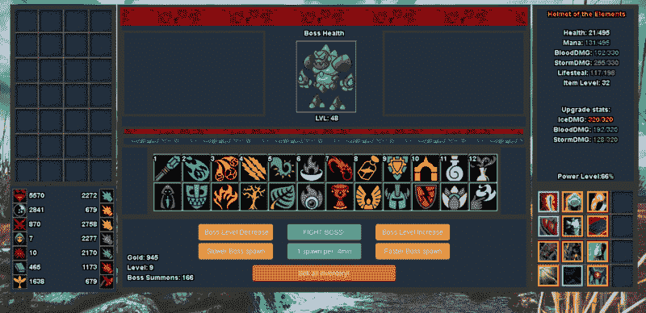
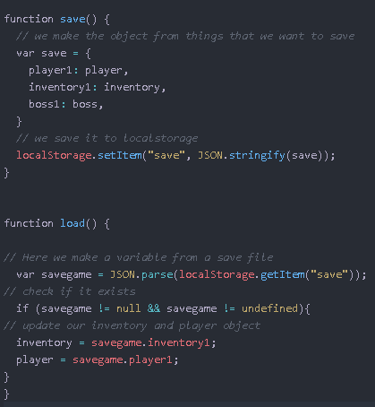
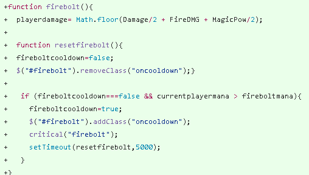
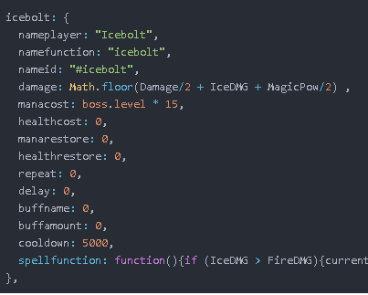

# 我用 JavaScript 构建了一个角色扮演游戏。你也可以。以下是方法。

> 原文：<https://www.freecodecamp.org/news/learning-javascript-by-making-a-game-4aca51ad9030/>

by Robert Skalko

# 我用 JavaScript 构建了一个角色扮演游戏。你也可以。以下是方法。

The version v1.05 of the game

所以你想尝试做一个游戏，但是有点害怕？别担心，我也是！

例如，我害怕使用物品。他们是这个巨大的怪异的东西，我把它束之高阁。但是现在我一直在用它们！

我将向您介绍我构建 JavaScript 角色扮演游戏的所有步骤。

这是我在 CodePen 上运行的游戏。(请注意，它尚未针对移动设备进行优化):

**首先**，**，**挑选你游戏的点。是拼图吗？一个 RPG？一个黑客&斜线？好了，现在想想制造它的技术难度。一个益智游戏需要大量复杂的 javascript。一个劈砍需要很多小心的平衡，等等。

此外，决定你是否希望它是一个浏览器游戏，手机游戏，或者两者都是(“原生网页”游戏)。

举个例子，我的游戏不能很好的适应手机屏幕，因为玩家有 24 个法术。在小屏幕上点击这些小按钮并不舒服，所以我需要为手机重新设计游戏。

**第二**，写下*所有*你需要编程来实际制作游戏的东西。对我来说是:

*   库存系统
*   项目生成器
*   一种玩家统计系统
*   储蓄系统

**第三**，通过一个一个解决这些问题，开始制作你的游戏。

### 需要实际创建游戏的帮助吗？

将你的游戏分解成小任务要容易得多。你不是在做游戏，你是在做一个库存系统。那你就是在做一个战斗系统。诸如此类。

除非你已经擅长绘画，或者想花几个月或几年的时间来精通它，否则使用这些工具来创建资产，使你的游戏看起来更好:

*   Game-Icons.net——这些图标有趣且易于上色
*   [开放游戏艺术](http://opengameart.org) —获得一些伟大的公共领域资产
*   [批量调整照片大小](http://bulkresizephotos.com)——制作你自己的小图标的好工具
*   CSS 精灵生成器 —帮助你为你的图标制作 CSS 精灵列表

### 我遇到的问题以及我如何解决它们

#### Spritesheets

你计划在你的游戏中有超过 20 个图像吗？如果是这样的话，你不会想要制作 20 张图片，并且每张图片都有链接。你可能认为 20 张图片并不多，但是如果你决定再增加 50 张呢？这就是 [spritesheets](http://spritegen.website-performance.org) 派上用场的地方。将一些图片放在上面，将 CSS 文件复制到您的项目中，然后将该类添加到与您想要的图像相对应的元素中。

#### 保存游戏状态

你想保存你的游戏吗？你可以在使用浏览器的本地存储和在服务器上存储之间进行选择。服务器需要后端知识。如果没有，我建议使用 LocalStorage。它保存游戏，只要用户没有用一些清理工具删除它。我是这样做的:

基本上，将所有数据保存在一个对象中，然后在加载时更新项目。使用 JSON stringify，稍后解析它。

#### 模块化你的代码

弄清楚哪些部分要硬编码，哪些部分要模块化。我错误地开始硬编码咒语，很快就变丑了。我需要 24 个这样的函数，以及 24 个 ifCritical 函数。

I swear I didn’t write this! Uhh.. I was forced to!

It even has a function which can add custom functionality!

现在你可能会问，第二个咒语是怎么起作用的？我有一个函数 playerAttack()使用这个对象来做一些事情:

*   它首先运行更新拼写功能，该功能调用拼写对象。然后这个法术会把你当前的属性转化成“伤害”和“法力消耗”这样的值。
*   它检查损坏是否大于 0。如果是，它对 boss 造成伤害并显示伤害，是哪个法术造成的，以及伤害的数量。对于大多数其他值也是如此。你可能会认为大于零的检查是没用的，但是当游戏显示你造成了 0 点伤害并恢复了 0 点法力时，你会再想一想。
*   然后它会运行一个自定义函数，如果这个咒语有自定义函数的话。这可以用来给法术一些特殊的效果，这是我们的主要攻击功能所不能实现的。

#### 游戏循环

对我来说，游戏循环检查和更新的东西:玩家统计，玩家是否死亡，玩家是否刚刚升级，是否有一个老板死了，等等。

你必须自己解决这个问题。我认为这是很好的学习经历。考虑检查和更新需要运行的内容和时间。例如，对于水平检查，我将其设置为每 20 秒运行一次，因为水平检查并不重要。

但是我也有一个 Boss 死亡检查，在战斗开始后每秒运行一次。为什么？所以玩家不用等 20 秒就有 boss 死了。

其他一些东西甚至不需要循环。这些函数可以在需要的时候调用。就拿我的更新法术功能来说吧。只有当玩家使用法术时才会调用。

### 我学到了一些东西:

*   对象是好的。这样，当您必须保存数据时，您只需要保存对象—而不是 50 个单独的变量。
*   始终将超时和间隔设置为变量，以便以后可以清除它们——除非它们是永久性的，并且您确定永远不需要清除它们。
*   一个大的 javascript 文件可能不是一个明智的想法。CodePen 只允许一个 JavaScript 文件，但是理想情况下，你应该把所有东西都分成模块。
*   如果您不担心性能，您可以在需要更新对象时复制并粘贴该对象—不需要单独更新一半的值。如果对象很大，你甚至可以先把对象定义成一个变量，像:**var object；然后当你想更新它的时候，使用一些其他的函数来构建它。我用我的咒语做到了。每当玩家施放一个法术，updateSpell()函数首先再次定义法术对象，计算所有的伤害和统计，然后施放法术。**

### 我妥协过的有趣的事情:

*   技能法力消耗是按 boss 等级计算的，因为如果是在玩家等级，我会惩罚升级的玩家。这也让更高层次的老板更难，这是我喜欢的。
*   物品是用所有的属性创建的，但是如果它们是 0 就不会显示。通过这种方式，我不需要检查未定义的，并且我可以避免显示生成为 0 的统计数据。双赢！
*   我简化了很多增益和减益。基本上，有一个 var buffStat，nerfStat，totalStat 和 Stat。所以增益和减益永远不会叠加。
*   有了 bosses，nerf 属性技能实际上并不会 nerf 到 0。这个比那个复杂多了。它通过 9999999 削弱 stat，然后检查它是否小于 0。如果是，则将其设置为 0。因此，如果你设法达到一个水平，你有数十亿的统计数据，我可能要添加更多的零。

所有这些让我想到的是，我应该计划得更远一点，即使我只是在建立一个有趣的项目来扩展我自己的技能。

此外，我现在对 bug 是如何产生的有了更好的理解:有时你没有意识到所有的边缘情况，在这些情况下事情可能会出问题。这时候虫子就会咬人。

### 漏洞和利用

这个让我吃惊，也让我有点害怕。我不敢相信我完美的艺术品里有虫子！

好吧，我有点夸张了。但我确实低估了可能在我没有意识到的情况下出错的事情的数量。

以下是我突然想到的一些漏洞和利用:

1.  你可以在和老板战斗时改变老板等级，这样可以得到更好的战利品
2.  生命值和法力值有时会溢出
3.  你甚至可以在战斗开始前攻击老板。说到一记重击！
4.  法力可能会变负，这使得你甚至不能进行基本的攻击，而这是你恢复法力的主要方法。
5.  治疗暂时增加你的最大生命值。
6.  由于 CSS 问题，有一个咒语实际上大部分时间是不能点击的
7.  在非战斗状态下攻击会让你的法术无限冷却

这些听起来都很恐怖，对吧？在 MMORPG，这些东西从第一天起就会被滥用，毁掉一切！

好消息是大多数都很容易修复——通常不到一行代码。

其他的错误，虽然，要求我完全重做整个系统。有了法术系统，我从不得不为每个法术写 3 个完整的函数变成只需要一个小对象，只需要几秒钟的编辑。

同样，如果你想尝试一下，这是我的游戏(注意，它不是为移动设备优化的):

下面是代码(也是开源的，可以在 CodePen 上编辑):

[**RobertSkalko/LOOT-RPG-v 1.0**](https://github.com/RobertSkalko/LOOT-RPG-v1.0)
[*LOOT-RPG-v 1.0-杀死 bosses，获得战利品！*github.com](https://github.com/RobertSkalko/LOOT-RPG-v1.0)

请记住，我是一个初学者(编程才 2 个月)，所以我的一些解决方案可以改进。不过，希望我至少给了你入门的基本知识！

祝你创建 Javascript 游戏愉快！