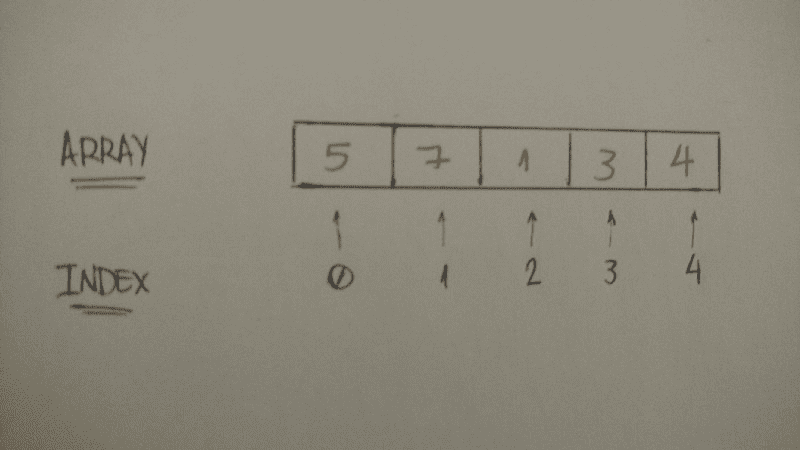

# 学习 Python:从零到英雄

> 原文：<https://www.freecodecamp.org/news/learning-python-from-zero-to-hero-120ea540b567/>

首先，Python 是什么？根据它的创造者吉多·范·罗苏姆的说法，Python 是一种:

> 高级编程语言，它的核心设计理念是关于代码可读性和语法，它允许程序员用几行代码表达概念

对我来说，学习 Python 的第一个原因是它实际上是一门漂亮的编程语言。用它来编码和表达我的想法真的很自然。

另一个原因是我们可以以多种方式使用 Python 编码:数据科学、web 开发和机器学习都在这里大放异彩。Quora、Pinterest 和 Spotify 都使用 Python 进行后端网络开发。所以让我们来了解一下。

### 基础知识

#### 1.变量

你可以把变量想象成存储一个值的单词。就这么简单。

在 Python 中，定义一个变量并为其设置一个值确实很容易。假设你想在一个名为“one”的变量中存储数字 1。让我们开始吧:

```
one = 1
```

有多简单？你刚刚把值 1 赋给了变量“一”

```
two = 2
some_number = 10000
```

你也可以把任何其他的**值**赋给你想要的任何其他的**变量**。如上表所示，变量“ **two** 存储整数 **2** ，“ **some_number** 存储**10000**。

除了整数，我们还可以使用布尔值(真/假)、字符串、浮点和许多其他数据类型。

```
# booleans
true_boolean = True
false_boolean = False

# string
my_name = "Leandro Tk"

# float
book_price = 15.80
```

#### 2.控制流:条件语句

**If** 用一个表达式来评估一个语句是真还是假。如果为真，则执行“If”语句中的内容。例如:

```
if True:
  print("Hello Python If")

if 2 > 1:
  print("2 is greater than 1")
```

**2** 大于 **1** ，则执行**打印**代码。

如果“ **if** 表达式为 **false** ，则执行 **else** 语句。

```
if 1 > 2:
  print("1 is greater than 2")
else:
  print("1 is not greater than 2")
```

**1** 不大于 **2** ，所以会执行“ **else** 语句里面的代码。

您也可以使用" **elif** "语句:

```
if 1 > 2:
  print("1 is greater than 2")
elif 2 > 1:
  print("1 is not greater than 2")
else:
  print("1 is equal to 2")
```

#### 3.循环/迭代器

在 Python 中，我们可以以不同的形式迭代。我就说两个:**而**和**为**。

**While** 循环:当语句为真时，将执行块内的代码。所以，这段代码将打印从 **1** 到 **10** 的数字。

```
num = 1

while num <= 10:
    print(num)
    num += 1
```

**而**循环需要一个**循环条件。**“如果保持为真，则继续迭代。在这个例子中，当`num`为`11`时，**循环条件**等于`False`。

更好地理解它的另一个基本代码:

```
loop_condition = True

while loop_condition:
    print("Loop Condition keeps: %s" %(loop_condition))
    loop_condition = False
```

**循环条件**是`True`，所以它一直在迭代——直到我们把它设置为`False`。

**For loop**:你把变量“ **num** 应用到这个块上， **for** 语句会替你迭代。该代码将与**打印相同，而**代码:从 **1** 到 **10** 。

```
for i in range(1, 11):
  print(i)
```

看到了吗？它是如此简单。范围从`1`开始，一直到第`11`个元素(`10`是第`10`个元素)。

### 列表:集合|数组|数据结构

假设您想将整数 1 存储在一个变量中。但也许现在你想存储 2。三，四，五…

我是否有另一种方法来存储我想要的所有整数，而不是存储在数百万个变量中？你猜对了——确实有另一种方法来储存它们。

`List`是一个集合，可以用来存储一列值(比如你想要的这些整数)。所以让我们使用它:

```
my_integers = [1, 2, 3, 4, 5]
```

这真的很简单。我们创建了一个数组，并将其存储在 **my_integer** 中。

但是也许你会问:“我怎样才能从这个数组中得到一个值？”

问得好。`List`有一个概念叫做**指数**。第一个元素的索引为 0(零)。第二个得到 1，依此类推。你明白了。

为了更清楚，我们可以用它的索引来表示数组和每个元素。我可以画出来:



使用 Python 语法，也很容易理解:

```
my_integers = [5, 7, 1, 3, 4]
print(my_integers[0]) # 5
print(my_integers[1]) # 7
print(my_integers[4]) # 4
```

假设你不想存储整数。你只想存储字符串，比如你亲戚的名字列表。我的大概是这样的:

```
relatives_names = [
  "Toshiaki",
  "Juliana",
  "Yuji",
  "Bruno",
  "Kaio"
]

print(relatives_names[4]) # Kaio
```

它的工作方式和整数一样。很好。

我们刚刚了解了指数是如何工作的。但是我仍然需要向您展示我们如何向`List`数据结构添加一个元素(向列表添加一个项目)。

向`List`添加新值的最常见方法是`append`。让我们看看它是如何工作的:

```
bookshelf = []
bookshelf.append("The Effective Engineer")
bookshelf.append("The 4 Hour Work Week")
print(bookshelf[0]) # The Effective Engineer
print(bookshelf[1]) # The 4 Hour Work Week
```

`append`超级简单。你只需要应用元素(例如:**有效工程师**)作为`append`参数。

好了，关于`Lists` ***足够了。*** 我们来谈谈另一种数据结构。

### 字典:键值数据结构

现在我们知道`Lists`是用整数索引的。但是如果我们不想用整数作为索引呢？我们可以使用的一些数据结构是数字、字符串或其他类型的索引。

我们来学习一下`Dictionary`数据结构。`Dictionary`是键值对的集合。它看起来是这样的:

```
dictionary_example = {
  "key1": "value1",
  "key2": "value2",
  "key3": "value3"
}
```

**键**是指向 **值**的索引。我们如何访问`Dictionary` **值**？你猜对了——使用**键**。让我们来试试:

```
dictionary_tk = {
  "name": "Leandro",
  "nickname": "Tk",
  "nationality": "Brazilian"
}

print("My name is %s" %(dictionary_tk["name"])) # My name is Leandro
print("But you can call me %s" %(dictionary_tk["nickname"])) # But you can call me Tk
print("And by the way I'm %s" %(dictionary_tk["nationality"])) # And by the way I'm Brazilian
```

我创造了一个关于我的`Dictionary`。我的名字、昵称和国籍。那些属性就是`Dictionary` **键**。

当我们学习如何使用索引访问`List`时，我们也使用索引(`Dictionary`上下文中的**键**)来访问存储在`Dictionary`中的**值**。

在这个例子中，我使用存储在`Dictionary`中的所有值打印了一个关于我的短语。很简单，对吧？

关于`Dictionary`的另一件很酷的事情是我们可以使用任何东西作为值。在我创建的`Dictionary` 中，我想添加**键**“年龄”和我的真实整数年龄在里面:

```
dictionary_tk = {
  "name": "Leandro",
  "nickname": "Tk",
  "nationality": "Brazilian",
  "age": 24
}

print("My name is %s" %(dictionary_tk["name"])) # My name is Leandro
print("But you can call me %s" %(dictionary_tk["nickname"])) # But you can call me Tk
print("And by the way I'm %i and %s" %(dictionary_tk["age"], dictionary_tk["nationality"])) # And by the way I'm Brazilian
```

这里我们有一个**键**(年龄)**值** (24)对，使用字符串作为**键**，整数作为**值**。

正如我们对`Lists`所做的一样，让我们学习如何向`Dictionary`添加元素。指向一个 **值**的**键**是`Dictionary`的很大一部分。当我们谈论添加元素时也是如此:

```
dictionary_tk = {
  "name": "Leandro",
  "nickname": "Tk",
  "nationality": "Brazilian"
}

dictionary_tk['age'] = 24

print(dictionary_tk) # {'nationality': 'Brazilian', 'age': 24, 'nickname': 'Tk', 'name': 'Leandro'} 
```

我们只需要将一个**值**赋给一个`Dictionary` **键**。这里没什么复杂的，对吧？

### 迭代:遍历数据结构

正如我们在 [**Python 基础知识**](https://medium.com/the-renaissance-developer/python-101-the-basics-441136fb7cc3) 中了解到的，`List`迭代非常简单。我们`Python` 开发者常用`For`循环。让我们开始吧:

```
bookshelf = [
  "The Effective Engineer",
  "The 4-hour Workweek",
  "Zero to One",
  "Lean Startup",
  "Hooked"
]

for book in bookshelf:
    print(book)
```

所以对于书架上的每一本书，我们(**可以用它做一切事情**)打印出来。非常简单直观。那是 Python。

对于散列数据结构，我们也可以使用`for`循环，但是我们应用了`key`:

```
dictionary = { "some_key": "some_value" }

for key in dictionary:
    print("%s --> %s" %(key, dictionary[key]))

# some_key --> some_value
```

这是一个如何使用它的例子。对于`dictionary`中的每个`key`，我们`print`了`key`及其对应的`value`。

另一种方法是使用`iteritems`方法。

```
dictionary = { "some_key": "some_value" }

for key, value in dictionary.items():
    print("%s --> %s" %(key, value))

# some_key --> some_value
```

我们确实将这两个参数命名为`key`和`value`，但这不是必须的。我们可以给它们起任何名字。让我们看看:

```
dictionary_tk = {
  "name": "Leandro",
  "nickname": "Tk",
  "nationality": "Brazilian",
  "age": 24
}

for attribute, value in dictionary_tk.items():
    print("My %s is %s" %(attribute, value))

# My name is Leandro
# My nickname is Tk
# My nationality is Brazilian
# My age is 24
```

我们可以看到我们使用 attribute 作为`Dictionary` `key`的参数，并且它工作正常。太好了！

### 类别和对象

#### 一点理论:

**物体**是现实世界物体的代表，如汽车、狗或自行车。这些对象共有两个主要特征:**数据**和**行为**。

汽车有**数据、**像车轮数量、车门数量和座位容量，它们也表现出**行为**:它们可以加速、停止、显示剩余燃料量，以及其他许多事情。

在面向对象编程中，我们将**数据**标识为**属性**，将**行为**标识为**方法**。再次重申:

数据→属性和行为→方法

一个**类**是创建单个对象的蓝图。在现实世界中，我们经常会发现许多相同类型的对象。比如汽车。所有的品牌和型号都一样(并且都有发动机、车轮、车门等等)。每辆车都是根据相同的蓝图建造的，有着相同的部件。

#### Python 面向对象编程模式:开

Python 作为面向对象的编程语言，有这些概念:**类**和**对象**。

一个类是一个蓝图，一个对象的模型。

所以，一个类它只是一个模型，或者一种定义**属性**和**行为**的方法(正如我们在理论部分所谈到的)。作为一个例子，一个车辆**类**有它自己的**属性**，这些属性定义了什么**对象**是车辆。车轮的数量、坦克的类型、载客量和最大速度都是车辆的属性。

记住这一点，让我们来看看**类**的 Python 语法:

```
class Vehicle:
    pass
```

我们用一个**类语句—** 来定义类，就这样。很简单，不是吗？

**对象**是**类**的实例。我们通过命名类来创建一个实例。

```
car = Vehicle()
print(car) # <__main__.Vehicle instance at 0x7fb1de6c2638>
```

这里的`car`是**`Vehicle`的一个**对象**(或实例)。**

**记住我们的车辆**等级**有四个**属性**:车轮数量、坦克类型、座位容量和最大速度。我们在创建车辆**对象**时设置所有这些**属性**。所以在这里，我们定义我们的**类**在它初始化数据时接收数据:**

```
`class Vehicle:
    def __init__(self, number_of_wheels, type_of_tank, seating_capacity, maximum_velocity):
        self.number_of_wheels = number_of_wheels
        self.type_of_tank = type_of_tank
        self.seating_capacity = seating_capacity
        self.maximum_velocity = maximum_velocity`
```

**我们用`init` **的方法**。我们称之为构造方法。所以当我们创建车辆**对象**时，我们可以定义这些**属性**。想象一下，我们喜欢**特斯拉 Model S，**，我们想创造这种**物体**。它有四个轮子，依靠电能运行，有五个座位的空间，最大速度为 250 公里/小时(155 英里/小时)。让我们创建这个**对象:****

```
`tesla_model_s = Vehicle(4, 'electric', 5, 250)`
```

**四轮+电动“坦克型”+五座+250km/h 最大速度。**

**所有属性都已设置。但是我们如何访问这些属性的值呢？我们**向对象发送消息，询问它们的情况**。我们称之为**法**。是**对象的行为**。让我们来实现它:**

```
`class Vehicle:
    def __init__(self, number_of_wheels, type_of_tank, seating_capacity, maximum_velocity):
        self.number_of_wheels = number_of_wheels
        self.type_of_tank = type_of_tank
        self.seating_capacity = seating_capacity
        self.maximum_velocity = maximum_velocity

    def number_of_wheels(self):
        return self.number_of_wheels

    def set_number_of_wheels(self, number):
        self.number_of_wheels = number`
```

**这是两种方法的实现:**轮数**和**轮数**。我们称之为`getter` & `setter`。因为第一个获取属性值，第二个为属性设置新值。**

**在 Python 中，我们可以通过使用`@property` ( `decorators`)来定义`getters`和`setters`来做到这一点。让我们用代码来看看:**

```
`class Vehicle:
    def __init__(self, number_of_wheels, type_of_tank, seating_capacity, maximum_velocity):
        self.number_of_wheels = number_of_wheels
        self.type_of_tank = type_of_tank
        self.seating_capacity = seating_capacity
        self.maximum_velocity = maximum_velocity

    @property
    def number_of_wheels(self):
        return self.__number_of_wheels

    @number_of_wheels.setter
    def number_of_wheels(self, number):
        self.__number_of_wheels = number`
```

**我们可以使用这些方法作为属性:**

```
`tesla_model_s = Vehicle(4, 'electric', 5, 250)
print(tesla_model_s.number_of_wheels) # 4
tesla_model_s.number_of_wheels = 2 # setting number of wheels to 2
print(tesla_model_s.number_of_wheels) # 2`
```

**这与定义方法略有不同。这些方法作为属性工作。例如，当我们设置新的轮数时，我们不应用两个作为参数，而是将值 2 设置为`number_of_wheels`。这是编写`pythonic` `getter`和`setter`代码的一种方式。**

**但是我们也可以使用其他方法，比如" **make_noise** "方法。让我们看看:**

```
`class Vehicle:
    def __init__(self, number_of_wheels, type_of_tank, seating_capacity, maximum_velocity):
        self.number_of_wheels = number_of_wheels
        self.type_of_tank = type_of_tank
        self.seating_capacity = seating_capacity
        self.maximum_velocity = maximum_velocity

    def make_noise(self):
        print('VRUUUUUUUM')`
```

**当我们调用这个方法时，它只是返回一个字符串 ***"* VRRRRUUUUM。****

```
*`tesla_model_s = Vehicle(4, 'electric', 5, 250)
tesla_model_s.make_noise() # VRUUUUUUUM`*
```

### ***封装:隐藏信息***

***封装是一种限制直接访问对象数据和方法的机制。但同时，它也方便了对数据的操作(对象的方法)。***

> ***“封装可以用来隐藏数据成员和成员函数。根据这个定义，封装意味着一个[对象](https://en.wikipedia.org/wiki/Object_(computer_science))的内部表示通常隐藏在对象定义之外。—维基百科***

***一个对象的所有内部表示对外部是隐藏的。只有对象可以与其内部数据进行交互。***

***首先，我们需要理解`public`和`non-public`实例变量和方法是如何工作的。***

#### ***公共实例变量***

***对于 Python 类，我们可以在构造函数方法中初始化一个`public instance variable`。让我们看看这个:***

***在构造函数方法中:***

```
*`class Person:
    def __init__(self, first_name):
        self.first_name = first_name`*
```

***这里我们将`first_name`值作为参数应用于`public instance variable`。***

```
*`tk = Person('TK')
print(tk.first_name) # => TK`*
```

***在班级内:***

```
*`class Person:
    first_name = 'TK'`*
```

***这里，我们不需要将`first_name`作为一个参数，所有实例对象都有一个用`TK`初始化的`class attribute`。***

```
*`tk = Person()
print(tk.first_name) # => TK`*
```

***酷毙了。我们现在已经知道我们可以使用`public instance variables`和`class attributes`。关于`public`部分的另一个有趣的事情是我们可以管理变量值。我这么说是什么意思？我们的`object`可以管理它的变量值:`Get`和`Set`变量值。***

***记住`Person`类，我们想为它的`first_name`变量设置另一个值:***

```
*`tk = Person('TK')
tk.first_name = 'Kaio'
print(tk.first_name) # => Kaio`*
```

***我们走吧。我们只是为`first_name`实例变量设置了另一个值(`kaio`)，它更新了这个值。就这么简单。因为它是一个`public`变量，我们可以这样做。***

#### ***非公共实例变量***

> ***我们在这里不使用术语“私有”，因为在 Python 中没有属性是真正私有的(没有不必要的工作)。— [PEP 8](https://www.python.org/dev/peps/pep-0008/#designing-for-inheritance)***

***作为`public instance variable`，我们可以在构造函数方法或类中定义`non-public instance variable`。语法上的区别是:对于`non-public instance variables`，在`variable`名称前使用下划线(`_`)。***

> ***Python 中不存在只能从对象内部访问的“私有”实例变量。然而，大多数 Python 代码都遵循一个约定:以下划线为前缀的名称(如`_spam`)应被视为 API 的非公共部分(无论是函数、方法还是数据成员)——[Python 软件基金会](https://docs.python.org/2/tutorial/classes.html#private-variables-and-class-local-references)***

***这里有一个例子:***

```
*`class Person:
    def __init__(self, first_name, email):
        self.first_name = first_name
        self._email = email`*
```

***看到`email`变量了吗？这就是我们如何定义一个`non-public variable`:***

```
*`tk = Person('TK', 'tk@mail.com')
print(tk._email) # tk@mail.com`*
```

> ***我们可以访问和更新它。只是一个约定，应该被视为 API 的非公开部分。***

***所以我们使用一种方法，允许我们在类定义中做这件事。让我们实现两个方法(`email`和`update_email`)来理解它:***

```
*`class Person:
    def __init__(self, first_name, email):
        self.first_name = first_name
        self._email = email

    def update_email(self, new_email):
        self._email = new_email

    def email(self):
        return self._email`*
```

***现在我们可以使用这些方法更新和访问`non-public variables`。让我们看看:***

```
*`tk = Person('TK', 'tk@mail.com')
print(tk.email()) # => tk@mail.com
# tk._email = 'new_tk@mail.com' -- treat as a non-public part of the class API
print(tk.email()) # => tk@mail.com
tk.update_email('new_tk@mail.com')
print(tk.email()) # => new_tk@mail.com`*
```

1.  ***我们用`first_name` TK 和`email`tk@mail.com 创建了一个新对象***
2.  ***通过使用方法访问`non-public variable`打印电子邮件***
3.  ***试图在我们班建立一个新的组织***
4.  ***我们需要将`non-public variable`视为 API 的`non-public`部分***
5.  ***用我们的实例方法更新了`non-public variable`***
6.  ***成功！我们可以用 helper 方法在我们的类中更新它***

#### ***公共方法***

***有了`public methods`，我们还可以用它们走出我们的课堂:***

```
*`class Person:
    def __init__(self, first_name, age):
        self.first_name = first_name
        self._age = age

    def show_age(self):
        return self._age`*
```

***让我们来测试一下:***

```
*`tk = Person('TK', 25)
print(tk.show_age()) # => 25`*
```

***太好了——我们可以毫无问题地使用它。***

#### ***非公开方法***

***但是我们不能这么做。让我们实现同样的`Person`类，但是现在用下划线(`_`)添加了一个`show_age` `non-public method`。***

```
*`class Person:
    def __init__(self, first_name, age):
        self.first_name = first_name
        self._age = age

    def _show_age(self):
        return self._age`*
```

***现在，我们将尝试用我们的对象来调用这个`non-public method`:***

```
*`tk = Person('TK', 25)
print(tk._show_age()) # => 25`*
```

> ***我们可以访问和更新它。只是一个约定，应该被视为 API 的非公开部分。***

***这里有一个我们如何使用它的例子:***

```
*`class Person:
    def __init__(self, first_name, age):
        self.first_name = first_name
        self._age = age

    def show_age(self):
        return self._get_age()

    def _get_age(self):
        return self._age

tk = Person('TK', 25)
print(tk.show_age()) # => 25`*
```

***这里我们有一个`_get_age`T1 和一个`show_age`T3。`show_age`可以被我们的对象使用(在我们的类之外)，而`_get_age`只能在我们的类定义内部使用(在`show_age`方法内部)。但还是那句话:作为惯例。***

#### ***封装摘要***

***通过封装，我们可以确保对象的内部表示对外部是隐藏的。***

### ***继承:行为和特征***

***某些对象有一些共同点:它们的行为和特征。***

***比如我遗传了父亲的一些特点和行为。我继承了他的眼睛和头发作为特征，他的急躁和内向作为行为。***

***在面向对象编程中，类可以从另一个类继承共同的特征(数据)和行为(方法)。***

***让我们看另一个例子，并用 Python 实现它。***

***想象一辆车。车轮数量、座位容量和最大速度都是汽车的属性。我们可以说一辆**电动车**继承了普通**车**的这些属性。***

```
*`class Car:
    def __init__(self, number_of_wheels, seating_capacity, maximum_velocity):
        self.number_of_wheels = number_of_wheels
        self.seating_capacity = seating_capacity
        self.maximum_velocity = maximum_velocity`*
```

***我们的**车**班实现了:***

```
*`my_car = Car(4, 5, 250)
print(my_car.number_of_wheels)
print(my_car.seating_capacity)
print(my_car.maximum_velocity)`*
```

***一旦启动，我们可以使用所有创建的`instance variables`。很好。***

***在 Python 中，我们将`parent class`作为参数应用于`child class`。一辆**电动车**级可以继承我们的**车**级。***

```
*`class ElectricCar(Car):
    def __init__(self, number_of_wheels, seating_capacity, maximum_velocity):
        Car.__init__(self, number_of_wheels, seating_capacity, maximum_velocity)`*
```

***就这么简单。我们不需要实现任何其他方法，因为这个类已经有了(继承自 **Car** 类)。让我们证明这一点:***

```
*`my_electric_car = ElectricCar(4, 5, 250)
print(my_electric_car.number_of_wheels) # => 4
print(my_electric_car.seating_capacity) # => 5
print(my_electric_car.maximum_velocity) # => 250`*
```

***太美了。***

### ***就是这样！***

***我们学到了很多关于 Python 基础的东西:***

*   ***Python 变量的工作原理***
*   ***Python 条件语句的工作原理***
*   ***Python 循环(while & for)如何工作***
*   ***如何使用列表:集合|数组***
*   ***字典键值集合***
*   ***我们如何遍历这些数据结构***
*   ***对象和类***
*   ***作为对象数据的属性***
*   ***作为对象行为的方法***
*   ***使用 Python getters 和 setters & property decorator***
*   ***封装:隐藏信息***
*   ***继承:行为和特征***

***恭喜你。您已经完成了这篇关于 Python 的密集内容。***

***如果你想要一个完整的 Python 课程，学习更多真实世界的编码技巧和搭建项目，试试 [***一个月 Python Bootcamp***](https://onemonth.com/courses/python?campaignid=33447&discount_code=TKPython1&mbsy=lG6tv&mbsy_source=7d89eeb0-0031-478c-a60c-6a96d762712a) 。那里见，☺***

***更多关于我学习和掌握编程之旅的故事和帖子，请关注我的出版物 [**文艺复兴时期的开发者**](https://medium.com/the-renaissance-developer) 。***

***玩得开心，不断学习，一直坚持编码。***

***我的[Twitter](https://twitter.com/LeandroTk_)&[Github](https://github.com/LeandroTk)。☺***