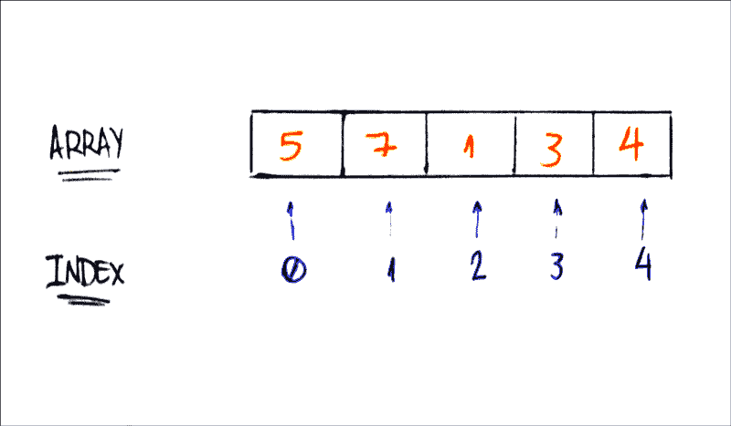

# 学习 Ruby:从零到英雄

> 原文：<https://www.freecodecamp.org/news/learning-ruby-from-zero-to-hero-90ad4eecc82d/>

> "红宝石外表简单，但内部非常复杂，就像我们的人体一样."— [Matz](https://twitter.com/yukihiro_matz) ，Ruby 编程语言的创造者

为什么要学 Ruby？

对我来说，第一个原因是它是一种美丽的语言。编码是很自然的，它总是表达我的想法。

第二个也是最主要的原因是 Rails:Twitter、Basecamp、Airbnb、Github 和许多公司使用的相同框架。

### 简介/历史

Ruby 是“一种动态的、开源的编程语言，专注于简单和高效。它有一个优雅的语法，读起来很自然，写起来也很容易。”—[ruby-lang.org](https://www.ruby-lang.org/)

让我们从一些基础开始吧！

### 变量

你可以把变量想象成一个存储值的单词。就这么简单。

在 Ruby 中，定义一个变量并给它赋值是很容易的。假设你想把数字 1 存储在一个名为 one 的变量中。我们开始吧！

```
one = 1
```

有多简单？你刚刚把值 1 赋给了一个名为 one 的变量。

```
two = 2
some_number = 10000
```

你可以给任何你想要的变量赋值。在上面的例子中，一个 *two* 变量存储一个整数 2，而 *some_number* 存储 10，000。

除了整数，我们还可以使用布尔值(真/假)、字符串、[符号](http://rubylearning.com/satishtalim/ruby_symbols.html)、浮点和其他数据类型。

```
# booleans
true_boolean = true
false_boolean = false

# string
my_name = "Leandro Tk"

# symbol
a_symbol = :my_symbol

# float
book_price = 15.80
```

### 条件语句:控制流

条件语句评估真或假。如果某事为真，它执行语句中的内容。例如:

```
if true
  puts "Hello Ruby If"
end

if 2 > 1
  puts "2 is greater than 1"
end
```

2 大于 1，所以执行 *puts* 代码。

当 if 表达式为 false 时，将执行该 else 语句:

```
if 1 > 2
  puts "1 is greater than 2"
else
  puts "1 is not greater than 2"
end
```

1 不大于 2，因此将执行 else 语句中的代码。

还有 elsif 的声明。你可以这样使用它:

```
if 1 > 2
  puts "1 is greater than 2"
elsif 2 > 1
  puts "1 is not greater than 2"
else
  puts "1 is equal to 2"
end
```

我非常喜欢编写 Ruby 的一种方式是在要执行的代码后面使用 if 语句:

```
def hey_ho?
  true
end

puts "let’s go" if hey_ho?
```

它是如此美丽和自然。这是地道的红宝石。

### 循环/迭代器

在 Ruby 中，我们可以迭代很多不同的形式。我将讨论三种迭代器:while、for 和 each。

循环时:只要语句为真，就会执行块内的代码。所以这段代码将打印从 1 到 10 的数字:

```
num = 1

while num <= 10
  puts num
  num += 1
end
```

For 循环:您将变量 num 传递给块，for 语句将为您迭代它。此代码将打印与 while 代码相同的内容:从 1 到 10:

```
for num in 1...10
  puts num
end
```

Each 迭代器:我非常喜欢 each 迭代器。对于值数组，它将逐个迭代，将变量传递给块:

```
[1, 2, 3, 4, 5].each do |num|
  puts num
end
```

你可能会问 each 迭代器和 for 循环有什么区别。主要区别在于 each 迭代器只维护迭代块内部的变量，而 for 循环允许变量存在于块外部。

```
# for vs each

# for looping
for num in 1...5
  puts num
end

puts num # => 5

# each iterator
[1, 2, 3, 4, 5].each do |num|
  puts num
end

puts num # => undefined local variable or method `n' for main:Object (NameError)
```

### 数组:集合/列表/数据结构

假设您想将整数 1 存储在一个变量中。但也许现在你想存储 2。三，四，五…

我是否有办法存储所有我想要的整数，而不是数百万个变量？Ruby 有答案了！

Array 是一个集合，可以用来存储一列值(比如这些整数)。所以还是用起来吧！

```
my_integers = [1, 2, 3, 4, 5]
```

这真的很简单。我们创建了一个数组，并将其存储在 *my_integer* 中。

你可能会问，“我怎样才能从这个数组中得到一个值？”问得好。数组有一个概念叫做索引。第一个元素的索引为 0(零)。第二个得到 1，依此类推。你明白了！



使用 Ruby 语法，很容易理解:

```
my_integers = [5, 7, 1, 3, 4]
print my_integers[0] # 5
print my_integers[1] # 7
print my_integers[4] # 4
```

假设你想存储字符串而不是整数，比如你亲戚的名字列表。我的大概是这样的:

```
relatives_names = [
  "Toshiaki",
  "Juliana",
  "Yuji",
  "Bruno",
  "Kaio"
]

print relatives_names[4] # Kaio
```

与整数的工作方式相同。不错！

我们刚刚学习了数组索引是如何工作的。现在让我们向数组数据结构中添加元素(向列表中添加项目)。

向数组添加新值最常用的方法是 push 和<

推送超级简单！您只需要将元素(有效的工程师)作为推送参数传递:

```
bookshelf = []
bookshelf.push("The Effective Engineer")
bookshelf.push("The 4 hours work week")
print bookshelf[0] # The Effective Engineer
print bookshelf[1] # The 4 hours work week
```

<

```
bookshelf = []
bookshelf << "Lean Startup"
bookshelf << "Zero to One"
print bookshelf[0] # Lean Startup
print bookshelf[1] # Zero to One
```

你可能会问，“但是它不像其他方法那样使用点符号。怎么可能是方法？”问得好！写这个:

```
bookshelf << "Hooked"
```

…类似于这样写:

```
bookshelf.<<("Hooked")
```

露比太棒了，是吧？

好了，数组够多了。再来说说另一种数据结构。

### Hash:键值数据结构/字典集合

我们知道数组是用数字索引的。但是如果我们不想用数字做索引呢？一些数据结构可以使用数字、字符串或其他类型的索引。哈希数据结构就是其中之一。

哈希是键值对的集合。看起来是这样的:

```
hash_example = {
  "key1" => "value1",
  "key2" => "value2",
  "key3" => "value3"
}
```

关键是指向值的索引。我们如何访问哈希值？使用钥匙！

这里有一个关于我的杂凑。我的名字、昵称和国籍是散列的关键字。

```
hash_tk = {
  "name" => "Leandro",
  "nickname" => "Tk",
  "nationality" => "Brazilian"
}

print "My name is #{hash_tk["name"]}" # My name is Leandro
print "But you can call me #{hash_tk["nickname"]}" # But you can call me Tk
print "And by the way I'm #{hash_tk["nationality"]}" # And by the way I'm Brazilian
```

在上面的例子中，我使用散列中存储的所有值打印了一个关于我的短语。

关于散列的另一个很酷的事情是我们可以使用任何东西作为值。我将添加关键的“年龄”和我的真实整数年龄(24)。

```
hash_tk = {
  "name" => "Leandro",
  "nickname" => "Tk",
  "nationality" => "Brazilian",
  "age" => 24
}

print "My name is #{hash_tk["name"]}" # My name is Leandro
print "But you can call me #{hash_tk["nickname"]}" # But you can call me Tk
print "And by the way I'm #{hash_tk["age"]} and #{hash_tk["nationality"]}" # And by the way I'm 24 and Brazilian 
```

让我们学习如何向散列中添加元素。指向一个值的键是 hash 的很大一部分——当我们想要向它添加元素时也是如此。

```
hash_tk = {
  "name" => "Leandro",
  "nickname" => "Tk",
  "nationality" => "Brazilian"  
}

hash_tk["age"] = 24
print hash_tk # { "name" => "Leandro", "nickname" => "Tk", "nationality" => "Brazilian", "age" => 24 } 
```

我们只需要给一个散列键赋值。这里没什么复杂的，对吧？

### 迭代:遍历数据结构

数组迭代非常简单。Ruby 开发人员通常使用 each 迭代器。让我们开始吧:

```
bookshelf = [
  "The Effective Engineer",
  "The 4 hours work week",
  "Zero to One",
  "Lean Startup",
  "Hooked"
]

bookshelf.each do |book|
  puts book
end
```

each 迭代器通过在块中将数组元素作为参数传递来工作。在上面的例子中，我们打印每个元素。

对于散列数据结构，我们也可以通过向块传递两个参数来使用 each 迭代器:键和值。这里有一个例子:

```
hash = { "some_key" => "some_value" }
hash.each { |key, value| puts "#{key}: #{value}" } # some_key: some_value
```

我们将这两个参数命名为键和值，但这不是必需的。我们可以给它们起任何名字:

```
hash_tk = {
  "name" => "Leandro",
  "nickname" => "Tk",
  "nationality" => "Brazilian",
  "age" => 24
}

hash_tk.each do |attribute, value|
  puts "#{attribute}: #{value}"
end
```

您可以看到，我们使用 attribute 作为散列键的参数，它工作正常。太好了！

### 类别和对象

作为一种面向对象的编程语言，Ruby 使用了类和对象的概念。

“类”是定义对象的一种方式。在现实世界中，有许多相同类型的对象。比如汽车，狗，自行车。每辆车都有相似的部件(车轮、车门、发动机)。

“对象”有两个主要特征:数据和行为。车辆拥有车轮数量和车门数量等数据。他们也有加速和停止的行为。

在面向对象编程中，我们称数据为“属性”，行为为“方法”

数据=属性

行为=方法

### Ruby 面向对象编程模式:开

让我们来理解 Ruby 的类语法:

```
class Vehicle
end
```

我们用类语句定义 Vehicle，用 end 结束。轻松点。

和对象都是类的实例。我们通过调用。新方法。

```
vehicle = Vehicle.new
```

这里 *vehicle* 是 vehicle 类的一个对象(或实例)。

我们的车辆类别将有 4 个属性:轮子、坦克类型、座位容量和最大速度。

让我们定义我们的类 Vehicle 来接收数据并实例化它。

```
class Vehicle
  def initialize(number_of_wheels, type_of_tank, seating_capacity, maximum_velocity)
    @number_of_wheels = number_of_wheels
    @type_of_tank = type_of_tank
    @seating_capacity = seating_capacity
    @maximum_velocity = maximum_velocity
  end
end
```

我们使用 initialize 方法。我们称之为构造器方法，这样当我们创建车辆对象时，我们可以定义它的属性。

想象一下，你热爱特斯拉 Model S，想要创造这种物件。它有四个轮子。它的罐型是电能。它有 5 个座位的空间，最大速度为 250 公里/小时(155 英里/小时)。让我们创建对象 tesla_model_s！:)

```
tesla_model_s = Vehicle.new(4, 'electric', 5, 250)
```

4 轮+电动坦克+ 5 座+250km/小时最高时速= tesla_model_s。

```
tesla_model_s
# => <Vehicle:0x0055d516903a08 @number_of_wheels=4, @type_of_tank="electric", @seating_capacity=5, @maximum_velocity=250> 
```

我们已经设置了泰斯拉的属性。但是我们如何访问它们呢？

我们向对象发送消息询问它们。我们称之为方法。是对象的行为。来实施吧！

```
class Vehicle
  def initialize(number_of_wheels, type_of_tank, seating_capacity, maximum_velocity)
    @number_of_wheels = number_of_wheels
    @type_of_tank = type_of_tank
    @seating_capacity = seating_capacity
    @maximum_velocity = maximum_velocity
  end

  def number_of_wheels
    @number_of_wheels
  end

  def set_number_of_wheels=(number)
    @number_of_wheels = number
  end
end
```

这是两个方法的实现:number_of_wheels 和 set_number_of_wheels。我们称之为“getter”和“setter”首先，我们获取属性值，其次，我们为属性设置一个值。

在 Ruby 中，我们可以在不使用 attr_reader、attr_writer 和 attr_accessor 的情况下做到这一点。用代码来看看吧！

*   attr_reader:实现 getter 方法

```
class Vehicle
  attr_reader :number_of_wheels

  def initialize(number_of_wheels, type_of_tank, seating_capacity, maximum_velocity)
    @number_of_wheels = number_of_wheels
    @type_of_tank = type_of_tank
    @seating_capacity = seating_capacity
    @maximum_velocity = maximum_velocity
  end
end

tesla_model_s = Vehicle.new(4, 'electric', 5, 250)
tesla_model_s.number_of_wheels # => 4
```

*   attr_writer:实现 setter 方法

```
class Vehicle
  attr_writer :number_of_wheels

  def initialize(number_of_wheels, type_of_tank, seating_capacity, maximum_velocity)
    @number_of_wheels = number_of_wheels
    @type_of_tank = type_of_tank
    @seating_capacity = seating_capacity
    @maximum_velocity = maximum_velocity
  end
end

# number_of_wheels equals 4
tesla_model_s = Vehicle.new(4, 'electric', 5, 250)
tesla_model_s # => <Vehicle:0x0055644f55b820 @number_of_wheels=4, @type_of_tank="electric", @seating_capacity=5, @maximum_velocity=250>

# number_of_wheels equals 3
tesla_model_s.number_of_wheels = 3
tesla_model_s # => <Vehicle:0x0055644f55b820 @number_of_wheels=3, @type_of_tank="electric", @seating_capacity=5, @maximum_velocity=250> 
```

*   attr_accessor:实现这两种方法

```
class Vehicle
  attr_accessor :number_of_wheels

  def initialize(number_of_wheels, type_of_tank, seating_capacity, maximum_velocity)
    @number_of_wheels = number_of_wheels
    @type_of_tank = type_of_tank
    @seating_capacity = seating_capacity
    @maximum_velocity = maximum_velocity
  end
end

# number_of_wheels equals 4
tesla_model_s = Vehicle.new(4, 'electric', 5, 250)
tesla_model_s.number_of_wheels # => 4

# number_of_wheels equals 3
tesla_model_s.number_of_wheels = 3
tesla_model_s.number_of_wheels # => 3
```

所以现在我们已经学习了如何获取属性值，实现 getter 和 setter 方法，以及使用 attr (reader、writer 和 accessor)。

我们也可以使用方法来做其他事情——比如“制造噪音”方法。让我们看看！

```
class Vehicle
  def initialize(number_of_wheels, type_of_tank, seating_capacity, maximum_velocity)
    @number_of_wheels = number_of_wheels
    @type_of_tank = type_of_tank
    @seating_capacity = seating_capacity
    @maximum_velocity = maximum_velocity
  end

  def make_noise
    "VRRRRUUUUM"
  end
end
```

当我们调用这个方法时，它只是返回一个字符串“VRRRRUUUUM”。

```
v = Vehicle.new(4, 'gasoline', 5, 180)
v.make_noise # => "VRRRRUUUUM"
```

### 封装:隐藏信息

封装是一种限制直接访问对象数据和方法的方式。同时，它也方便了对数据的操作(对象的方法)。

> 封装可用于隐藏数据成员和成员函数…封装意味着对象的内部表示通常隐藏在对象定义之外。
> ——[维基百科](https://en.wikipedia.org/wiki/Encapsulation_(computer_programming))

因此，一个对象的所有内部表示对外部是隐藏的，只有该对象可以与其内部数据进行交互。

在 Ruby 中，我们使用方法直接访问数据。让我们看一个例子:

```
class Person
  def initialize(name, age)
    @name = name
    @age  = age
  end
end
```

我们刚刚实现了这个 Person 类。正如我们所学的，为了创建 person 对象，我们使用新方法并传递参数。

```
tk = Person.new("Leandro Tk", 24)
```

所以我创造了我！:)的 [*tk*](https://medium.com/@leandrotk_/) 对象！传递我的名字和年龄。但是我怎样才能获得这些信息呢？我的第一个尝试是调用 name 和 age 方法。

```
tk.name
> NoMethodError: undefined method `name' for #<Person:0x0055a750f4c520 @name="Leandro Tk", @age=24>
```

我们做不到！我们没有实现 name(和 age)方法。

还记得我说过“在 Ruby 中，我们使用方法来直接访问数据吗？”为了访问 tk 名称和年龄，我们需要在 Person 类上实现这些方法。

```
class Person
  def initialize(name, age)
    @name = name
    @age  = age
  end

  def name
    @name
  end

  def age
    @age
  end
end
```

现在我们可以直接访问这些信息。通过封装，我们可以确保对象(在本例中是 tk)只被允许访问姓名和年龄。对象的内部表示对外部是隐藏的。

### 继承:行为和特征

某些物体有一些共同点。行为和特点。

例如，我继承了父亲的一些特征和行为——比如他的眼睛和头发。以及不耐烦、内向等行为。

在面向对象编程中，类可以从另一个类继承共同的特征(数据)和行为(方法)。

让我们看另一个例子，并用 Ruby 实现它。

想象一辆车。车轮数量、座位容量和最大速度都是汽车的属性。

```
class Car
  attr_accessor :number_of_wheels, :seating_capacity, :maximum_velocity

  def initialize(number_of_wheels, seating_capacity, maximum_velocity)
    @number_of_wheels = number_of_wheels
    @seating_capacity = seating_capacity
    @maximum_velocity = maximum_velocity
  end
end
```

我们的汽车类实现了！:)

```
my_car = Car.new(4, 5, 250)
my_car.number_of_wheels # 4
my_car.seating_capacity # 5
my_car.maximum_velocity # 250
```

实例化，我们可以使用所有创建的方法！不错！

在 Ruby 中，我们使用

```
class ElectricCar < Car
end
```

就这么简单！我们不需要实现 initialize 方法和任何其他方法，因为这个类已经有了(从 Car 类继承的)。来证明一下吧！

```
tesla_model_s = ElectricCar.new(4, 5, 250)
tesla_model_s.number_of_wheels # 4
tesla_model_s.seating_capacity # 5
tesla_model_s.maximum_velocity # 250
```

漂亮！

### 模块:工具箱

我们可以把模块想象成一个工具箱，里面包含了一组常量和方法。

Ruby 模块的一个例子是 Math。我们可以访问常数 PI:

```
Math::PI # > 3.141592653589793 
```

还有。sqrt 方法:

```
Math.sqrt(9) # 3.0
```

我们可以实现自己的模块并在课堂上使用。我们有跑步运动员课程:

```
class RunnerAthlete
  def initialize(name)
    @name = name
  end
end
```

并实现一个模块技能拥有 average_speed 方法。

```
module Skill
  def average_speed
    puts "My average speed is 20mph"
  end
end
```

我们如何将模块添加到我们的类中，使其具有这种行为(average_speed 方法)？我们只是包括它！

```
class RunnerAthlete
  include Skill

  def initialize(name)
    @name = name
  end
end
```

参见“包含技能”！现在我们可以在 RunnerAthlete 类的实例中使用这个方法。

```
mohamed = RunnerAthlete.new("Mohamed Farah")
mohamed.average_speed # "My average speed is 20mph"
```

耶！要完成模块，我们需要了解以下内容:

*   一个模块可以没有实例。
*   一个模块不能有子类。
*   模块由模块定义…结束。

### 结束了！

我们在这里学到了很多东西！

*   Ruby 变量如何工作
*   Ruby 条件语句如何工作
*   Ruby 循环和迭代器如何工作
*   数组:集合|列表
*   哈希:键值集合
*   我们如何遍历这些数据结构
*   对象和类别
*   作为对象数据的属性
*   作为对象行为的方法
*   使用 Ruby getters 和 setters
*   封装:隐藏信息
*   继承:行为和特征
*   模块:工具箱

### 好了

恭喜你。你完成了这篇关于 Ruby 的密集内容！我们在这里学到了很多。希望你喜欢。

玩得开心，不断学习，一直坚持编码！

我的[Twitter](https://twitter.com/LeandroTk_)&[Github](https://github.com/LeandroTk)。☺