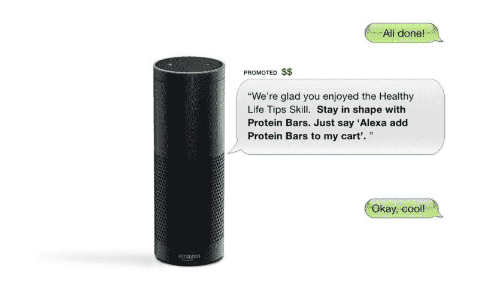

# 向亚马逊 Alexa 的 UX 设计师学习对话式用户界面的基础知识

> 原文：<https://www.freecodecamp.org/news/learning-the-basics-of-conversational-ui-with-a-ux-designer-for-amazons-alexa-c76c1908454b/>

蒂芙尼·伊顿

# 向亚马逊 Alexa 的 UX 设计师学习对话式用户界面的基础知识

[https://arstechnica.com/gadgets/2017/05/amazon-alexa-ads-voicelabs/](https://arstechnica.com/gadgets/2017/05/amazon-alexa-ads-voicelabs/)

去年夏天在 Intuit 实习期间，我是创造对话式 UI 体验的黑客马拉松团队的一员。我们采访了几个有这方面经验的人，我有机会采访了[安吉拉·阮](https://www.freecodecamp.org/news/learning-the-basics-of-conversational-ui-with-a-ux-designer-for-amazons-alexa-c76c1908454b/undefined)。安吉拉是亚马逊的 UX 设计师，在 Alexa 团队工作。你可以在这里 查看她的作品 [**。**](http://angelanm.com)

#### 你设计对话式用户界面的过程是怎样的？

这取决于谈话内容。我主要处理购物问题，因为我是购物团队的一员。

我的流程总是从顾客和他们的需求开始。

例如，如果他们试图购买纸巾，那么我做的第一件事就是考虑人工智能的反应。是基于已经购买还是基于现状打算退纸巾？他们在哪里下订单，或者他们可以通过信用卡下订单吗？这取决于这个人的标准，因为每个人问同样的问题都会导致人工智能以不同的方式回答。

每个人的情况都不一样。

假设一个给定的人总是买纸巾，也许是同样的毛巾。我喜欢创建一个答案树(“思维导图”)。它从那个问题开始，取决于这个人的情况。这个人买了这条毛巾很多次，所以 Alexa 可能会回应:“你还要再买纸巾吗？如果你从未买过毛巾，人工智能可能会推荐一个品牌。

#### **如何设计一个为语音或聊天机器人设计的 UI？**

有无头设备，没有脸或 UI 的语音产品。这完全是 UX 之声。然后是有屏幕的“面部设备”，有点像 Siri。

在为有脸的产品设计时，最好考虑这样一个问题，“你想显示和声音说的一样的图形吗？”如果一个声音说，我有 10 美元的纸巾，在 2 小时内送达，它会有图像，价格等，还是只有图像？考虑一个人是否正在观看某物是很好的。

#### 我们能简化图形或声音吗？

YouTube 就是一个很好的例子。如果你曾经看过一个视频，当你登陆这个页面时，视频开始播放，但是你仍然可以在看主视频的时候向下滚动到视频。

当你的大脑在理解音频时，你的眼睛在接收其他信息。人类的大脑可以同时处理多项任务，所以当我们听到声音和看到图像时，它们不需要匹配。你可以一边听一边看评论。设计 UI 和语音的时候可以考虑这个。你不必展示你所说的东西。

#### 你认为你正在开发的一些产品的文本视觉表现是什么样的？

用户界面可能是一张纸巾的图片，而声音会说，“这是亚马逊对纸巾的选择。这是排名最高的结果，评价最高，价格为 10 美元。中午就能拿到。”声音会更详细地解释，而图形是你会看到的。

#### 你如何用对话式用户界面做原型？

最基本的方式就是做一个图文原型，比如一个 app 或者网站。这和 UX 设计的过程完全一样，但是你在动画上添加了声音。当你对人进行测试时，你可以问他们，“你会如何用这个设备说话？”，同时让他们触摸和玩它。

你可以通过人们如何反应或谈论某事来获得洞察力。一个例子是询问天气。他们可以问，“天气怎么样？”与“温度是多少？”一旦他们与人工智能交流，你就可以回放你制作的原型动画，你可以看看他们的反应和与原型的互动。

有很多事情要记住。比如用户应该说什么？他们需要提高嗓门吗？如果他们只用手势，或者只有语音没有手势呢？信息是不是太多、太少、太短？

还有就是反应速度。有了语音，要考虑的事情就多了。如果你在和技术打交道，你需要考虑诸如延迟之类的事情。人工智能需要多长时间做出反应才会出现问题？

#### 你认为对话式用户界面在哪些地方被使用，这些选择背后的含义是什么？

现在，对话式用户界面是非常新的。人们仍然害怕与设备对话。我今天和一个人谈了他们第一次使用 Echo 的经历。她正在解释她对此的第一反应。她觉得谈论不存在的东西很奇怪。

在最近一篇关于 Alexa 和 Home Pod 的文章中，与 Home Pod 交谈会很尴尬，因为你必须说“Siri”。这是一个机器人，对这个设备说话是最重要的。Alexa 更像是在和一个人交谈。

目标是试图让人们忘记设备是一个机器人，而是一个人。这是因为人们害怕科技。例如，当计算机问世时，人们就像“什么，你再也不用去图书馆了？”。几个世纪以来我们都没有这些东西，就像优步问世时一样。你基本上是从网上给一个人打电话，他们就会出现。

科技的变化让人们感到恐惧。

作为一名设计师，如果我们能让人们更容易实现这种转变，那么人们将更容易对人工智能做出反应并采用新技术。在用法上，是为了方便。比如能够向设备询问时间表或烹饪，或者是否有办法摆桌子或询问尺寸(从杯子到毫米)。

#### 你认为对话式用户界面的未来会走向何方？你对此有什么想法？

对话式用户界面就像一个人在跟着你一样。

老实说，我认为它将开始成为日常生活的一部分。因此，当你问你现在在哪里看到对话式用户界面时，我说它被放置在方便的区域和人们放置人工智能的中心，例如在厨房。无论你在哪里，对话式用户界面都将存在。你醒来的那一刻，你上车的那一刻。这将是同样的时刻。当我们从一个地方搬到另一个地方时，它将开始变得无缝。

*查看我在 **[UX 研究](http://skl.sh/2nal9ZT)** 上的 Skillshare 课程，学习新知识！*

为了帮助你开始拥有自己的设计生涯，这里有一些来自 [**Rookieup**](https://transactions.sendowl.com/stores/8000/107314) 的神奇工具，我曾经在这个网站上得到资深设计师的指导。如果您使用我在下面提供的链接，您将获得折扣:

*   [在经验丰富的设计师的帮助下制作作品集](https://transactions.sendowl.com/stores/8221/107314)
*   [巩固和建立您的投资组合的基本工具](https://transactions.sendowl.com/stores/8219/107314)
*   成为一名自由职业者，掌控你的时间和事业
*   [获得一份令人惊叹的设计工作的技巧和诀窍](https://transactions.sendowl.com/stores/8222/107314)

链接到其他一些很酷的读物:

*   [设计团队和产品的衰落——如何恢复和促进包容性设计文化](https://medium.muz.li/the-one-big-mistake-design-leaders-make-baca844a8e98)
*   [一年写 106 篇文章如何帮助我成长为一名设计师](https://medium.freecodecamp.org/how-writing-has-helped-me-grow-as-a-designer-afbed63c16a7)
*   作为一名应届毕业生，我在脸书面试。以下是我对设计的了解
*   [成为设计领导者](https://medium.muz.li/standing-up-as-a-design-leader-9289620562a)
*   [旅程规划是获得共鸣的关键](https://uxplanet.org/journey-mapping-is-key-to-gaining-empathy-1da5b54655e1)
*   [UX 立足于理性，而非设计](https://uxplanet.org/ux-is-grounded-in-rationale-not-design-49e8f77b8f58)