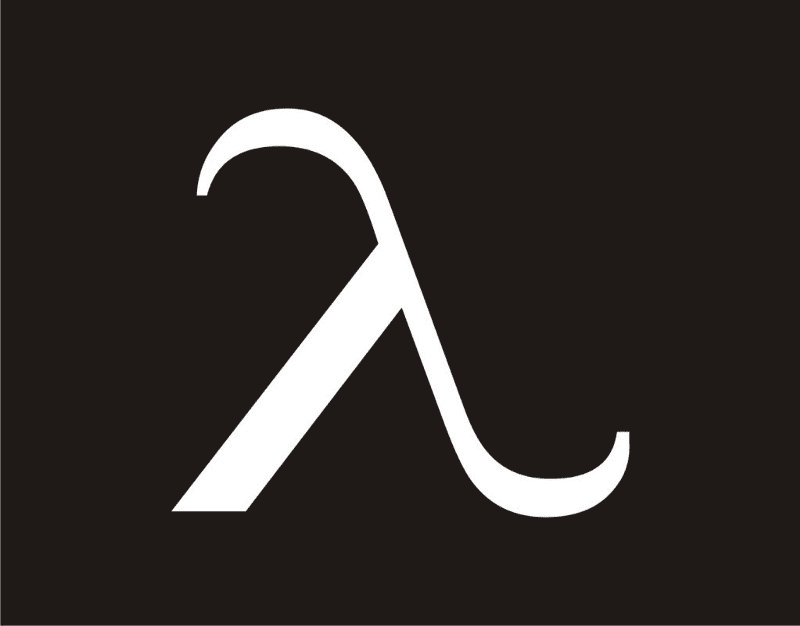
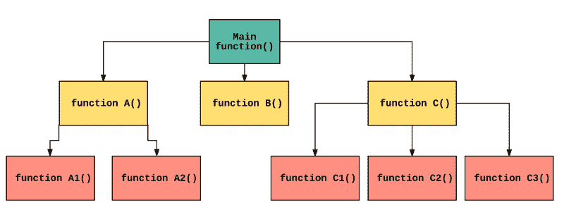
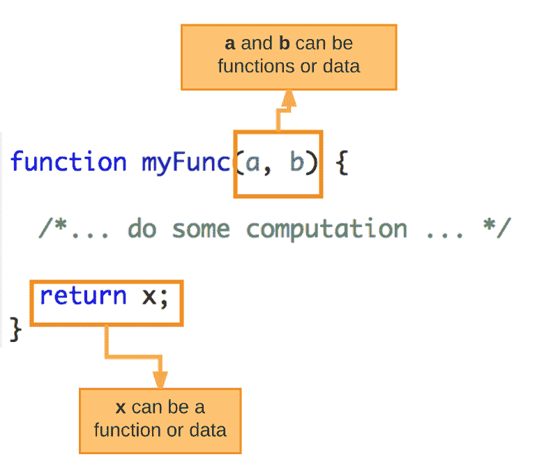
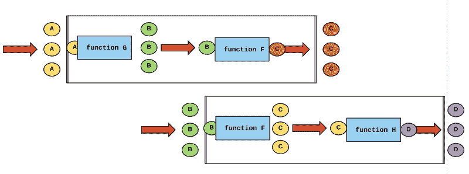

# 在您的收件箱中免费学习函数式编程的基础知识

> 原文：<https://www.freecodecamp.org/news/learning-the-fundamentals-of-functional-programming-425c9fd901c6/>

作者:Preethi Kasireddy

# 在您的收件箱中免费学习函数式编程的基础知识

如果你是一名软件开发人员，你可能已经注意到一个增长的趋势:**软件应用程序变得越来越复杂。**

作为开发人员，构建、测试、维护和扩展这些复杂系统的任务落在了我们的肩上。为此，我们必须创建易于理解、编写、调试、重用和维护的结构良好的代码。

但是实际上编写这样的程序需要的不仅仅是练习和耐心。

在我接下来的课程中，*以正确的方式学习函数式 JavaScript*，，我将教你如何使用函数式编程来创建结构良好的代码。

但是在开始学习这门课程之前(我希望你会！)，这里有一个重要的先决条件:在函数式编程的基本原则中建立一个坚实的基础。

因此，我创建了一个新的[免费电子邮件课程](https://preethikasireddy.typeform.com/to/yC9qQr)，它将带你踏上一段有趣的探索之旅，了解这些核心原则。

让我们来看看电子邮件课程将涵盖哪些内容，这样你就可以决定它如何融入你的编程教育。

### 什么是函数式编程？

所以。“函数式编程”到底是什么？

函数式编程不是一个框架或工具，而是一种编写代码的方式。在函数式编程中，我们主要强调使用**函数作为“构建块”来编写代码**

你的程序是由一个主要功能定义的。这个主函数是根据其他函数定义的，而其他函数又是根据更多的函数定义的——直到在底层，这些函数只是像“数字”或“字符串”这样的语言原语

如果你在读这篇文章，你会想，“嗯，但是等等？不是每种语言都用函数写代码吗？”那好？。这意味着你在集中注意力。你说得对——每种编程语言都有函数。但是函数式编程把它带到了一个**完全不同的层次？**

Functions to a whole ‘nother level

为了理解我的意思，让我们倒回去，从基础开始。

每个软件程序都有两样东西:

1.  行为
2.  数据

当我们学习一种编程范式时——比如函数式编程——考虑这种范式如何分别处理行为和数据通常是有帮助的。

**比如行为**，纯粹是用函数式编程中的函数来处理的。

**函数**是完成特定任务的“独立”代码段。它定义了一组可能的输入和一组可能的输出之间的关系——它们通常接收数据、处理数据并返回结果。一旦一个函数被写出来，它就可以被反复使用。

**数据**是，嗯，数据。在函数式编程中，数据是不可变的——这意味着它不能被改变。函数式编程中的函数不是改变它们接受的数据，而是接受数据作为输入，并产生新的**值作为输出。一直都是。在函数式编程中，函数和不可变数据是你唯一需要处理的两件事情。更简单地说，函数和数据没有什么不同。**

换句话说，函数式编程中的函数可以像数据一样容易地传递。你可以从*常量*和*变量*中引用它们，作为*参数*传递给其他函数，从其他函数返回作为*结果*。

这是接近函数式编程时最需要理解的。

通过将函数视为比一段数据更特殊的东西，并且只使用不可变的数据，我们在如何使用函数方面获得了更多的自由。

也就是说，它允许我们创建小的、独立的功能，这些功能可以被重用和组合在一起以构建越来越复杂的逻辑。我们可以将任何复杂的问题分解成更小的子问题，使用函数解决它们，最后将它们组合起来解决更大的问题。

考虑到软件应用程序日益增长的复杂性，这种“构建模块”的方法在保持程序的简单性、模块化和可理解性方面发挥了巨大的作用。这也是为什么开发人员努力让自己的功能尽可能的成为**通用**，这样就可以**组合**解决大型复杂问题**重用**加快后续程序的开发时间。

Function composition

归根结底，函数在函数式编程中如此强大的原因是因为函数遵循某些核心原则。这些原则将是我电子邮件课程的主题:

*   功能是纯粹的
*   函数使用不可变的数据
*   函数保证引用的透明性
*   函数是一级实体

之后，我将简要介绍函数式编程如何应用这些原则来鼓励我们仔细考虑我们的数据和与之交互的函数。

最后，您将能够理解这种方法是如何产生如下代码的:

*   更容易理解(即“有表现力”)
*   更容易重复使用
*   更容易测试
*   更易于维护
*   更容易重构
*   更易于优化
*   更容易推理

听起来很刺激？一起去兜风吧！

[立即注册免费的电子邮件课程](https://preethikasireddy.typeform.com/to/yC9qQr)。然后，在注册后的 1 到 3 天内，您会在收件箱中收到第一课？