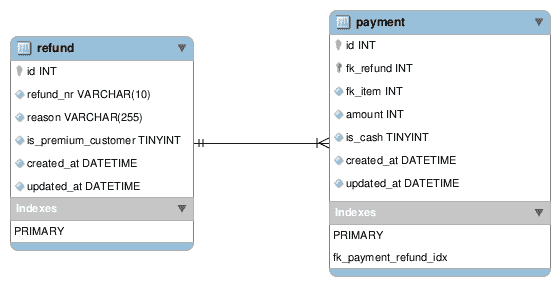

# 学习编码？第一，学会解决问题。

> 原文：<https://www.freecodecamp.org/news/learning-to-code-first-learn-to-solve-the-problem-128475b91301/>

你现在之前看过或看过的教程，大多都是做一件事，填鸭式。

这对于学习新东西来说是“可以”的，但是当你需要解决一个真正的任务时就不好了。

任务通常包括通过解决问题来达到目标。这篇文章为所有初学软件的工程师揭示了最重要的“提示”。

#### TL；速度三角形定位法(dead reckoning)

> *首先，解决问题。然后，编写代码。—约翰·约翰逊*

换句话说，逐步在纸上解决问题。然后开始为它写代码。先不要纠结于代码和软件设计。

### 那么，会发生什么呢？

我多次听到初学者和初级软件工程师说:“我可以按照教程学习，并认为我理解这个概念。但当我试图在我的宠物项目上做类似的事情时，我做不到。”

发生这种情况有两个原因。

第一，你在某个地方失去了思路，无法建立链条。

第二，你在代码中太纠结了，以至于你试图解决的主要问题没有聚焦。

这个问题也发生在软件工程师甚至高级软件工程师身上。

好的一面是，有了经验，你知道什么时候该停下来或者休息一下。然后，带着不同的处方回到问题上，更快地找到解决方案。

你们中的许多人都有同感:你花了几个小时努力解决一个问题。你休息了一会儿或者睡了一觉，下一次会议几分钟内就有了解决方案。

这不是魔法。这是换个角度看问题。

### 让我们举个例子来说明

您必须完成一项任务，例如，创建一个付款退款。

您将获得数据库模式。这是一个后端任务，您需要创建一个过帐/退款 API 来创建退款及其相关付款。数据库结构如下:

退款总是有原因的，比如“货物损坏”或“交货延迟”。

您可以与团队成员之一讨论 API 有效负载。您可能同意下面的 JSON 有效负载:

#### 通常的情况

大多数初学软件的工程师会做的是开始扫描代码库，如果有的话。他们将立即开始编写一些代码。如果有适当的测试文化，也许他们会写一些自动化测试代码。

这是大多数初学者甚至一些有经验的软件工程师容易犯的错误。没有解决问题就不要写代码。

#### 适当的步骤

最合适的步骤是坐下来，一步一步地解决纸上的问题。

所以你问自己需要做什么。你一步一步地想出一个计划，然后调整它。

如果你的团队中有资深人士，你可以验证你的步骤并获得反馈。

这也将减少代码审查时间。你们双方已经就解决方案的方式达成一致。

#### 那么如何去做呢

前面描述的任务是编写一个创建/过帐 API，可以在其中创建付款退款。

每次退款最多可以有两次支付。一个是“现金”类型，另一个是“信用”类型。它也可以是仅用现金或信用卡支付一次的退款。我会这样在纸上写下以下步骤:

1.  创建一个方法来从用户发送的控制器获取数据
2.  验证所有输入的值、退款类型和原因。
3.  如果所有验证都通过，则生成退款表中不存在的长度为 10 的随机字母数字(递归检查)
4.  如果验证未能以正确的验证失败消息进行响应，则确定响应结构
5.  启动数据库事务
6.  将`refund_nr`、`reason_reason`、`is_premium_customer`的退款相关值插入`refund`表中
7.  插入成功时，获取最后一次插入的 id
8.  使用退款 id，将 fk _ 退款、fk _ 项目、金额、is_cash 的支付相关值插入到`payment`表中
9.  如果一切顺利，提交数据库事务
10.  如果有任何问题，回滚数据库事务
11.  根据具有适当结构的数据库事务的成功，用成功或失败消息进行响应
12.  接线控制器和该方法

### 按照计划一步一步来，现在编写代码

有了循序渐进的计划后，你就可以开始写代码了。然后，您可以更深入地了解方法名称、如何获得数据库连接以及其他细节。

根据语言和框架的不同，你也可以决定验证码应该放在哪里。

如果公司和文化支持和鼓励，你甚至可以编写测试。

当你的解决方案在脑海中清晰可见，并且你在纸上有了一个一步一步的行动计划，你现在就可以写代码了。

你甚至可以用更容易完成和连接的方式分解零件。

例如，测试逻辑可以是可以单独编写并独立测试的东西。它考虑的是可以连接在一起形成解决方案的独立部分。

### 结论

当你面临下一个任务时，不要一开始就写代码。

首先，抓住问题，然后设计一个有步骤的解决方案。这最好在远离屏幕的纸上完成。

然后，完善你的解决方案，并与他人讨论。当您满意时，将该解决方案转化为代码。这有点有条不紊，但非常有效。

> 代码永远是解决方案的媒介，而不是解决方案本身。

你可以在[geshan.com.np](https://geshan.com.np/blog/2018/12/the-most-important-tip-for-beginner-software-engineers-is/)阅读更多我的博客文章*。*