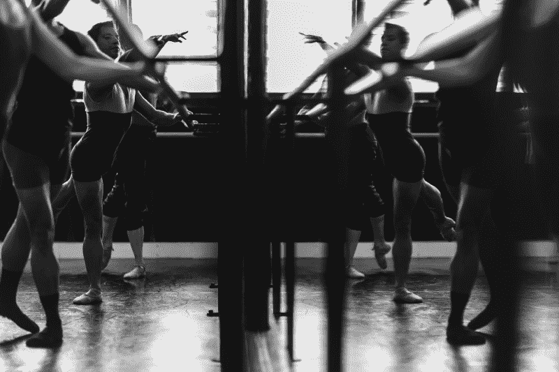
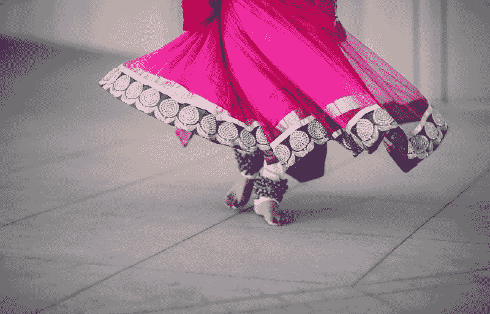
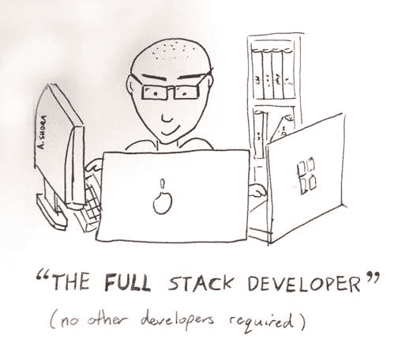
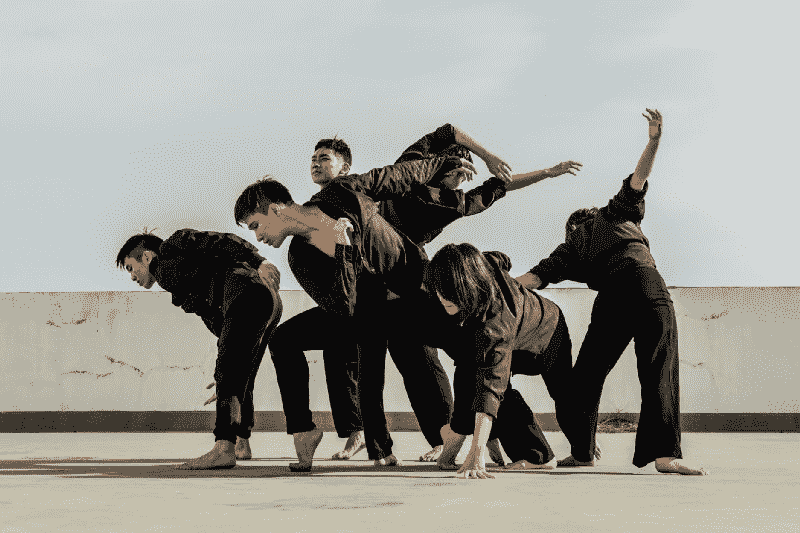

# 学习编码就像学习跳舞一样

> 原文：<https://www.freecodecamp.org/news/learning-to-code-is-just-like-learning-to-dance-3ccc6be7f62a/>

辛西娅·李

# 学习编码就像学习跳舞一样

很久以前，我是一名舞蹈演员。准确地说，是现代舞舞者。

而且不，现代舞并不总是一群光着脚的人假装是随风摇摆的树。有一次，我扮演了一个幽灵。

现在，我的编码之旅已经进行了六个多月，我注意到学习如何编码和学习如何跳舞之间的相似之处。

### **1。关注基础知识**

Photo by [Gez Xavier Mansfield](https://unsplash.com/@gezxaviermansfield?utm_source=medium&utm_medium=referral) on [Unsplash](https://unsplash.com?utm_source=medium&utm_medium=referral)

学习正确的技巧是舞蹈的基础，不管是什么类型的舞蹈。基本的 tendu 和 degagge 组合看起来很简单，可能没有在《舞魅天下》中跳过房间那么令人兴奋。然而，专注于基本技能会让你发展正确的肌肉和一般的身体意识，这将有助于你在技术上的进步。

在编码领域，新手很容易被数量惊人的语言/框架/工具所淹没。学习哪种语言最好？很多人一开始会在 JavaScript、Ruby、Go 和 Python 等语言之间转换。

的确，大多数软件开发人员精通不止一种语言。事实上，有些人的目标是每年学习一门新语言。然而，对于一个初学者来说，我认为如果你专注于一门语言，并真正努力掌握编程的基础，会更有好处。

其中包括:

*   数据结构(如二叉树、链表)
*   算法(和时间复杂度)
*   架构设计(例如面向对象编程、函数式编程)

### 2.力求全面发展

Photo by [Saksham Gangwar](https://unsplash.com/@saksham?utm_source=medium&utm_medium=referral) on [Unsplash](https://unsplash.com?utm_source=medium&utm_medium=referral)

虽然我的主要关注点是现代舞，但我也涉足 Bhratanatyam，抒情爵士乐和传统的马来舞蹈风格。我觉得这让我对自己身体的能力有了更多的了解。我学到了新的技巧和动作，这让我看到了编舞的不同可能性。

Image from [Andy Shora](http://andyshora.com/full-stack-developers.html)

我觉得同样的概念也适用于编程。你认为自己是前端开发者吗？了解另一端的一些技能不会有什么坏处。通过阅读域名服务器(DNS)以及它们是如何工作的来了解互联网是如何工作的。或者学习 Nginx 的基础知识，设置一个节点服务器。

如果你是后端开发人员，你可以挑战自己，使用 HTML、CSS 和 JavaScript 从头开始创建一个简单的网站。或者学习 React 或 Vue.js 之类的框架，这是你的前端同事一直在讨论的。

通过在您不熟悉的领域获得一些知识，您将成为一名更好的开发人员，因为您将开始理解另一方面的工作流和痛点。

### 3.协作对于改进至关重要

“Two women in dresses arching back while holding each other hands in a green meadow” by [Julia Caesar](https://unsplash.com/@juliacaesar?utm_source=medium&utm_medium=referral) on [Unsplash](https://unsplash.com?utm_source=medium&utm_medium=referral)

在每周技术课的间隙，我的舞蹈团会聚在一起练习。我们会观察和评论彼此的技术，并努力找出我们的弱点。在很大程度上，我们设法避免了在接下来的课上被舞蹈老师吼。

代码审查是相似的，但是你不是试图找出薄弱的技术，而是试图发现错误，并提高软件的整体质量。代码评审对于共享知识、确保软件设计的一致性以及提高团队凝聚力来说是非常好的。

结对编程是另一种有益的协作技术。驱动程序根据导航器的指示编写代码。这是很有用的，因为导航者必须考虑并解释，为什么他们选择了一个特定的解决方案。还有实时检查错误的优点。此外，这也是从更高级的程序员那里获取最佳实践和技术的有效方式。

### 4.退后一步，看看大局

有时候你只是舞蹈作品中的一棵树。有时候你的代码只是代码库的一小部分。这完全没问题。

如果你是一棵树，那就努力成为一棵树，为正在讲述的故事增加价值。拥抱你在舞台上的时刻。同样，确保你正在把健壮的、可读的高质量代码推进代码库。

感谢阅读我的文章，如果你喜欢就鼓掌吧！查看我的其他文章，如[我如何构建我的番茄钟应用程序，以及我在这个过程中吸取的教训](https://medium.freecodecamp.org/how-i-built-my-pomodoro-clock-app-and-the-lessons-i-learned-along-the-way-51288983f5ee)，以及[让我们揭开 JavaScript 的“新”关键字](https://medium.freecodecamp.org/demystifying-javascripts-new-keyword-874df126184c)的神秘面纱。