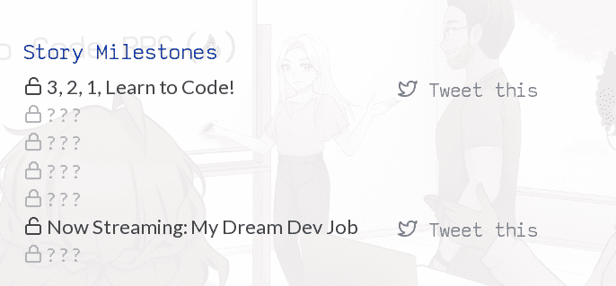
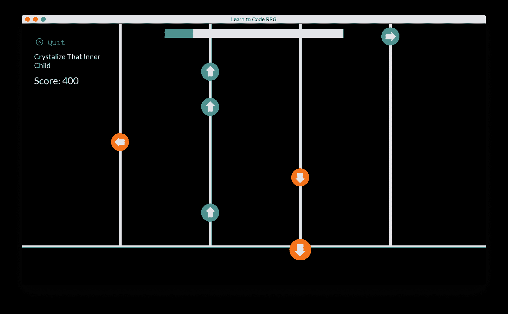
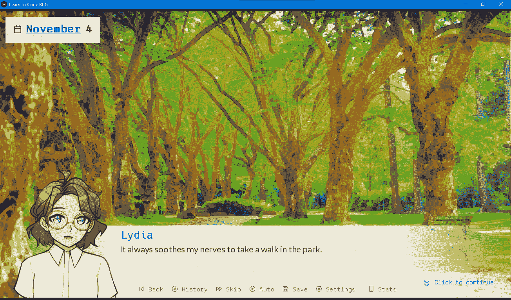
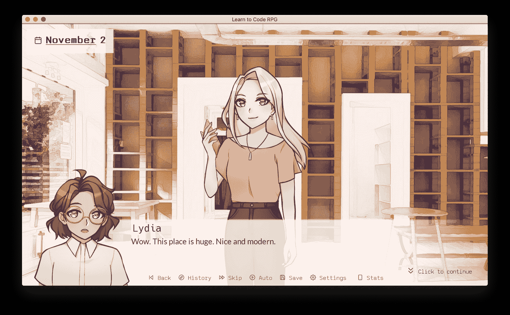
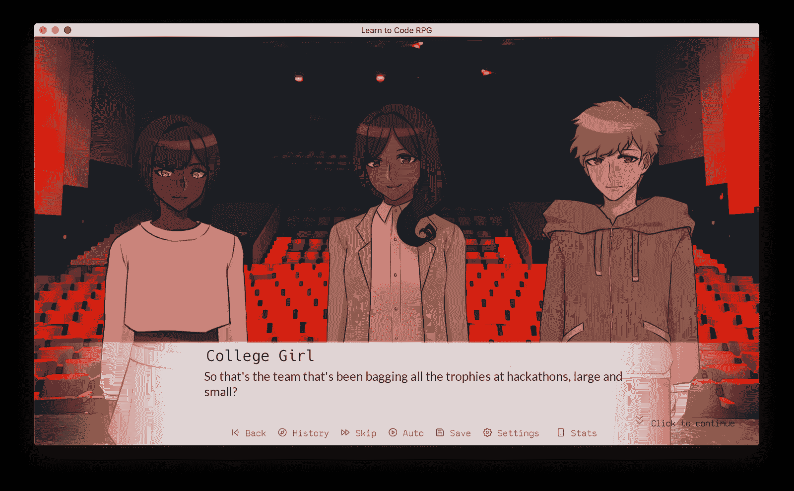

# 学习编码 RPG 玩家指南-如何解锁所有成就和结局

> 原文：<https://www.freecodecamp.org/news/learntocoderpg-player-guide-how-to-unlock-all-achievements-and-endings/>

在本指南中，您将学习如何收集所有 54 项成就，并到达学习编码 RPG 的所有六个结尾。

据游戏的创作者 [Lynn Zheng](https://www.freecodecamp.org/news/author/lynn/) ，

> ****学习编码 RPG**** 是一款互动的视觉小说游戏，在这里你将自学编码，结交科技行业的朋友，并追求你成为开发者的梦想。🎯

如果这是你第一次听说这个游戏，你可以[下载它，然后自己先玩](https://freecodecamp.itch.io/learn-to-code-rpg)。

如果你想从林恩本人那里了解更多关于这款游戏的信息，[请看这篇介绍性文章](https://www.freecodecamp.org/news/learn-to-code-rpg/)。

## 学习编写 RPG 故事里程碑

这些是你跟随故事情节肯定会得到的成就。

**3，2，1，学会编码！**当你第一次开始做测验时，你会得到这个成绩。

得到了我的第一次面试！一旦你的角色在完成课程后通过了他们的第一次面试，你就获得了这个成就。

我得到了第一份工作！一旦你收到第一份工作邀请，你就会获得这一成就。

必须粉碎那些技术面试！一旦你开始准备技术面试，你就会取得这样的成就。

**钉钉课程表！一旦你的 CS 知识达到 60 或以上，你就可以解锁该成就，这足以让你进入下一步。**

**Now Streaming:我梦想的开发工作**一旦你接受了一份开发工作的邀请，你就获得了这项成就。

提交了我的第一份开发工作申请！当你提交第一份工作申请时，你就获得了这一成就。

## 学习编码 RPG 故事复活节彩蛋

你可以解锁这些特殊的成就，主要是通过在游戏中做出某些选择，通过运用一些技巧，或者在某些情况下纯粹靠运气。

**通过一个招募者**申请到 CupcakeCPU:这个成就的前提条件是在黑客空间答对所有的琐事问答的问题。这会给你申请纸杯 CPU 的机会。

**向精通科技的朋友询问科技流行语**:询问一个你通过偷听别人谈话发现的流行语。

**咖啡师是我收集流行语的卧底身份**:你在第一次咖啡师轮班时解锁这个。

**击败 Pong 的 AI**:击败 Pong 的 AI 解锁本成就。

**Chill Beats to Code to** :在休息日听音乐。

**寒冷的节拍击碎键盘到**:在你的一个休息日玩节奏游戏。

一节课中所有的测验都不及格:一节课中所有的问题都答错了。

**Pong 被 AI 痛打**:Pong 输。

**在所有音乐曲目上获得近乎完美的分数**:在所有曲目上获得 95%以上的分数。详情见下一项成就。

**在自己喜欢的音乐曲目上得了一个近乎完美的分数**:达到 95%以上的分数就获得这个成就。为了达到 90%的参考分数，你需要至少 3/4 的分数是完美的(每个 100 分)，1/4 的分数是好的(每个 60 分)。

**在黑客空间闲逛**:第一次在黑客空间闲逛后获得此成就。

我可能会养一只小狗，这样我就可以去公园了。

**深夜饼干危机** : 当面对免费代码营课程中所有可用的认证时，选择质量保证并去拿一块饼干。

**最大化所有 CS 知识统计**:最大化所有 CS 知识统计。

**最大化一个 CS 知识统计**:最大化一个 CS 知识统计。

**在一节课中完成所有测验**:在一节课中完成所有测验。

由一位 VIP 会员推荐 : 在介绍中，在一次面试的灾难之后，有人问你是如何得到这个机会的。如果你说你是被某些人推荐的，比如说我，你就能获得成功。(好吧，完整的名单是昆西，林恩，艾比，埃斯特法尼亚，杰西卡，奥利弗，伊莱尼娅，狄奥尼西亚，内奥米，洋子，丹尼尔，博。)

**被拒？嗯，第一个很少成功**:被你第一次申请的工作拒绝。

**又被拒了？我认为第三次是魅力所在:被你第三次申请的工作拒绝。**

**创节奏游戏新高**:从第二次播放歌曲起可用，只需获得新高即可！

**科技流行语百科**:在咖啡厅收集所有流行语。

**科技问答大师**:正确回答黑客空间问答游戏中的所有问题。

**黑客空间是我现在的第二个家**:在黑客空间体验所有事件。

这份工作需要我...？:此类成绩 6 项，与工作面试有关。你可以找到有奇怪技能要求的工作招聘，找到这些你就能获得这些成就。整个技能要求列表是:**冲泡咖啡**、**修理传真机**、**保险丝**、**处理愤怒的顾客**、**安抚办公室宠物**、**、**找回丢失的密码。

**穿越时空拯救世界**:解锁其中一个可选择的结局(没有得到开发工作的结局)，然后回到过去继续玩。

对于 Prod 你再怎么小心也不为过:获得一份开发工作，一旦到了将你的代码推向生产的时候，尽可能多的反复检查你的代码。

## 测验问题复活节彩蛋

这些是在你完成测验时偶然发现的成就。如果你答对了关于 freeCodeCamp 的任何一个问题，你将获得这些成就中的一个。

*   用 freeCodeCamp 贡献开源！
*   DevDocs.io 博士
*   你好，地球呼叫代码电台！
*   免费代码营的推出
*   自由代码营的使命
*   freeCodeCamp 的技术栈
*   是什么激发了 freeCodeCamp？
*   freeCodeCamp 有聊天服务器？想不到！
*   freeCodeCamp 有论坛？整洁！
*   freeCodeCamp 有吉祥物？可爱！

## 替代学习编码 RPG 结尾

这些是你通过玩六种不同的结局解锁的成就。有一个你只要跟着故事主线就能很容易地找到——但其他的都是靠运气。在某些特定的时刻，解开结局的事件发生的几率很小。

**编码的猫**:这个结局涉及到铸造猫，在夜里你可能会被做某事的猫吵醒... **编码转发**:晚餐时你有机会成为编码导师，接受邀请解开这个结局。 **第一天拿下签子的开发者**:获得一个开发者工作，玩到最后解锁这个。在办公室的又一天:在浏览招聘信息时，你可能会找到一份与编码无关的办公室工作。接受这份工作来解开这个结局。 **内心热爱自然**:在被迫休息的每一天，角色都有可能得出结论，学习编码太难了，并决定做一些不同的事情... **`0xc0ffee`**:咖啡店可能会给你升职，接受它来解锁这个结局。

## 结论

这是 12 月 22 日发布的成果列表。我希望这份指南能满足你的完美主义精神。祝回放愉快！

如果你想了解更多关于这个游戏的信息，你可以阅读文章 *[学习编写 RPG 代码——这是一个视觉小说视频游戏，你可以从游戏中学习计算机科学概念](https://www.freecodecamp.org/news/learn-to-code-rpg-press-kit/)*dev 她自己关于创建这个游戏的过程。