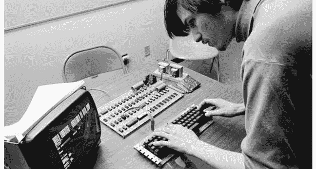
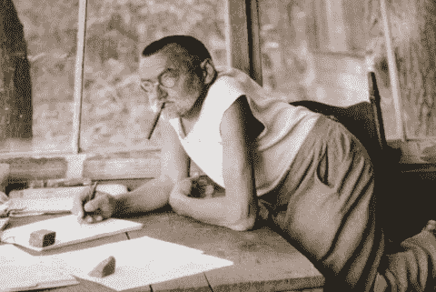
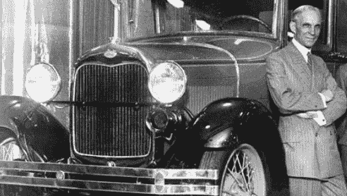
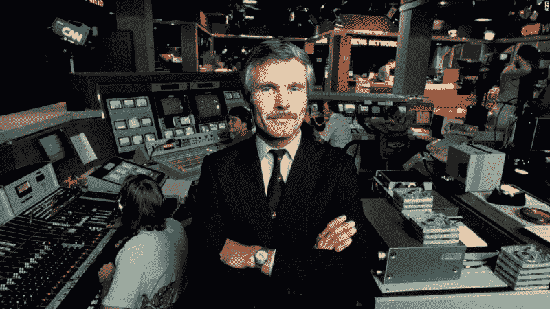

# 你永远不应忘记的历史上伟大创新者的教训

> 原文：<https://www.freecodecamp.org/news/lessons-from-historys-great-innovators-that-you-should-never-forget-4d5e432adcde/>

作者:亚当·诺尔

# 你永远不应忘记的历史上伟大创新者的教训

我花了很多时间阅读有关企业家精神和创新的书籍，因为我钦佩那些敢于冒险的人。我想变得更像他们。

我最近[离开谷歌创办了一家科技公司](https://medium.freecodecamp.com/why-i-quit-google-and-built-an-app-that-teaches-personal-finance-to-kids-f0d125e1f07b)。我花了很多时间与其他创始人交谈。我读过无数关于创业公司本质的书籍和文章。

但是，我一直在努力回答这个基本问题:**历史上的创新者给我们的最重要的教训是什么？**

谢天谢地，我在英国作家哈罗德·埃文斯的作品中发现了一些深思熟虑的答案。他写的字给我留下了不可磨灭的印象。现在我要和你们分享一些他最重要的见解。

Sir Harold Evans in his natural environment — surrounded by books.

### 第一课:不要假设

> "点燃好奇心的无知是比一知半解更好的起点."—哈罗德·埃文斯

埃德温·阿姆斯特朗就是这一教训的例证。他不断尝试在无线电电路中做一些专家告诉他不可能做的事情。他接着发明了调频收音机。

突破来自于对假设的抛弃。

第一并不总是最好的。

约翰·菲奇是第一个经营汽船服务的人，而不是通常认为的罗伯特·富尔敦。但富尔顿从惠誉的错误中吸取了教训，并在一个更有利的时机在一条不同的河流上取得了胜利。

查尔斯·固特异也是如此，他发明橡胶硫化技术比较晚。艾萨克·辛格和他标志性的缝纫机。

发明家从失败中学习。他们的成功来自对失败的理解，并根据这种理解采取行动。

> "没有人是傻瓜，除非他停止提问。"—查尔斯·普罗特斯·斯泰因梅茨，他促进了交流电的发展，使电力工业的发展成为可能

### 第二课:借是可以的

更多的创新来自于借鉴和组合，而不是简单的发明。

吉恩·尼德奇并没有发明她给慧俪轻体使用的饮食。

创立雅达利的诺兰·布什内尔并没有发明第一款自制视频游戏。

利奥·贝克兰德(塑料工业之父)借用照相化学发明了塑料。

Elisha Otis(防止电梯坠落的安全装置的发明者)用他在制作车厢时学到的弹簧制造了他的第一部电梯。

维尔伯·莱特通过思考转动自行车的方式，找到了转动飞机的方法。

> “我没有发明什么新东西。我只是把其他人的发现组装到一辆车里，而这些人背后是几个世纪的工作。”—亨利·福特

Henry Ford

### 第三课:第一次什么都不管用

> “缺乏耐心的企业家往往期待立竿见影的效果。历史告诉我们，每一次变革都有一百次挫折。”—哈罗德·埃文斯

《今日美国》、Amazon.com 和美国有线电视新闻网最初都很挣扎，但后来都兴旺起来，因为它们的基本理念是正确的。

创新经常被过早地砍掉，因为支持者没有意识到解决问题需要时间。

批评家称雷蒙德·达马迪安为“尖叫的疯子”,因为他认为核磁共振可以用于医学。然而他发明了第一台核磁共振扫描仪。

西奥多·犹大“疯狂”地主张在高山上修建一条铁路线。但他继续推动、建立和设计第一条横贯大陆的铁路。

> “如果你有一个创新的想法，而大多数人并不嗤之以鼻，那么你很可能没有一个非常好的想法。当人们认为我疯了的时候，我一点也不担心。事实上，我认为我一定是真的发现了什么。”——特德·特纳(CNN 创始人)

Ted Turner

### 第四课:整体大于部分之和

> “孤立的创新者可能会创造奇迹，但他们更有可能在知识网络中取得成功，无论是通过地理还是电子连接。创新者之间的联系无处不在——一个好的创新值得另一个好的创新。”—哈罗德·埃文斯

许多创新者在合伙企业中茁壮成长。以苹果公司的沃兹尼亚克和乔布斯的合作为例。或者艾达和威廉·罗森塔尔在迈登福姆的合作。然后是网景公司的马克·安德森和吉姆·克拉克。莱特兄弟，谷歌的谢尔盖·布林和拉里·佩奇，这样的例子不胜枚举。

利奥·贝克兰德与托马斯·爱迪生、莱特兄弟、亨利·福特、迪蓬夫妇和贝尔通信。

威廉姆·肖克利雇佣了罗伯特·诺伊斯和戈登·摩尔，他们的电路被诺兰·布什内尔用在雅达利公司，雅达利是第一个雇佣史蒂夫·乔布斯的公司。

Larry and Sergey back when Google’s headquarters was a garage.

在我们之前的创新者的开拓可以激发下一代人创造新技术的雄心。在宇宙中留下自己的足迹。

我们应该传承他们的经验和知识。

*感谢阅读。我正在尽最大努力开发技术，帮助孩子们和家庭掌握财务知识，从而创造一份遗产。如果你对这项事业感兴趣，你可以在这里提前接触 Pennybox.com[。](http://goo.gl/WgFn7V)*