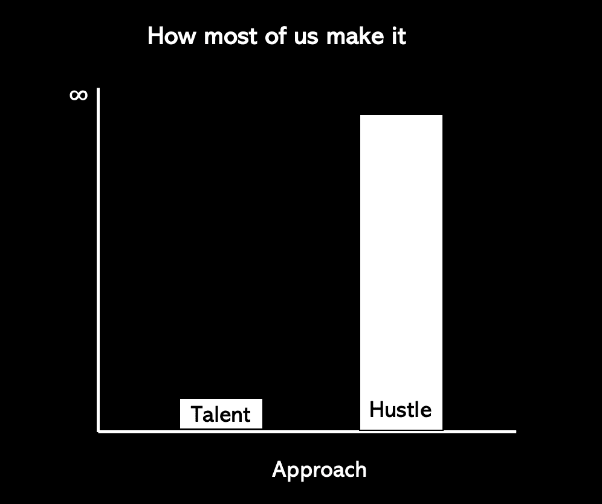

# 作为一名初级开发人员，我希望我知道的是——11 年编码后的经验教训

> 原文：<https://www.freecodecamp.org/news/lessons-learned-after-11-years-coding/>

我最初在 Reddit 上写这篇文章是作为初学者和初级开发人员的课程列表。然后就爆了 50 多个奖项。许多温暖人心的信息接踵而至。

所以我决定根据人们的反应来更新这个帖子。

以下是我希望在开始软件开发之旅时就知道的事情。它们会帮助我减轻压力，希望它们也能帮助你。

我们开始吧。

## 并非所有教程都是平等的

当你刚开始的时候，你只是在尝试不同的东西。当你学习和实验的时候，注意那些适合你的教程。

许多都不起作用。这很好。

事实上，在你找到解决方案之前，实验就是这样进行的。

但是当你挖到金子的时候，坚持下去，贪婪地消费那些内容，然后找到类似的教程，这样你就可以继续你的快速增长。

Photo by [Christopher Gower](https://unsplash.com/@cgower?utm_source=ghost&utm_medium=referral&utm_campaign=api-credit) / [Unsplash](https://unsplash.com/?utm_source=ghost&utm_medium=referral&utm_campaign=api-credit)

当我开始的时候，我经常用我的头去撞那本书。但是在学习了几个小时后，我还是毫无进展。

但是网上每个人都说这是有史以来最好的编程书。对我来说，尽管人们不再推荐他，但新波斯顿的 YouTube 教程还是帮我做到了。

我希望我能说这在我第一年后就停止了。

快进两年。

我开始学习算法，我跟着学的所有博客教程就是没有意义，直到我看了 YouTube 上关于匈牙利民族舞蹈教学算法的视频。

它就这么一拍即合了。

[https://www.youtube.com/embed/ywWBy6J5gz8?feature=oembed](https://www.youtube.com/embed/ywWBy6J5gz8?feature=oembed)

YouTube Hungarian video. I love dancing. They danced. And it clicked.

从那以后，我的学习方法一直是**从多个地方**学习同样的东西，直到我找到适合我的老师和风格。

## 你会忘记很多事情

深刻理解这一点会改变你的学习方式。

在 Udacity、Coursera 之类的网站上上了*Python 编程入门*的次数都数不清了，还是什么都忘了。

太讨厌了。

但是我后来了解到，你会忘记你在单独练习中学到的任何东西，因为它们储存在短期记忆中。神经科学研究表明，这正是大脑的工作方式。

如果你不想忘记，用间隔重复来测试你的知识。为此，请构建项目。

我给你举个具体的例子:

`len(myList)`

这将给出 Python 中一个列表的长度。您将在 Udacity 的 Python 入门课程中了解到这一点。

一个月后再来，你可能不记得是`len`、`length( )`还是`myList.size( )`。

但是在一个项目中有间隔的重复，结果是不同的。

例如，你为新程序员开发了一个为期 2 个月的 Django 应用程序，你需要:

*   多次统计用户数量。
*   存储完成的练习次数。
*   找出一天的聊天次数。

想象一下在整个项目期间都这样做——持续两个月。很难忘记`len( )`做了什么。

这是一个简单的例子，但是希望你能明白。

新手可以从简单、孤立的例子开始。

但是，如果你没有在一个项目的范围内练习，没有使用和重复使用你所学到的东西，那么你的长期记忆中什么也没有。都是短期的。

这意味着你会忘记它。

## 在恐惧中工作，而不是对抗恐惧

我承认这个说起来容易做起来难。

但是如果你想长久，你必须掌握这个。

在你继续学习之前，有一种先消除恐惧的诱惑。不幸的是，它不是那样工作的。

事实上，你会花很多时间试图让你的恐惧消失，但这只会增加你的焦虑。你必须找到一种方式——你的方式——来承认你害怕。

坦白地说，你会在很长一段时间内继续感到恐惧。所以在这种认识中工作。

没必要反抗。

有时候，随着你越来越熟练，这种恐惧会消失。

其他时候，它会消失一段时间，当你进入一个新的环境，与聪明的软件开发人员一起工作，或者转移到一个全新的堆栈时，它又会回来。

没事的。

Photo by [Jasmin Sessler](https://unsplash.com/@open_photo_js?utm_source=ghost&utm_medium=referral&utm_campaign=api-credit) / [Unsplash](https://unsplash.com/?utm_source=ghost&utm_medium=referral&utm_campaign=api-credit)

如果你想成为一名软件开发人员，你必须记住:

**这个*就是*的生活。**

这是一个正弦波——无休止地上下波动。不要太认真，否则你会迷失自我。

## 一致性>努力工作

一致性才是王道。

当你开始学习的时候，你就铺设了神经通路，使得获取信息变得更加容易。

根据神经科学研究，这些途径只会通过使用频率而变得更强，而不仅仅是强度。

这意味着一天 30 分钟，一周 5 天，比一天 2.5 小时，一周一次要好得多。

同样的时间，不同的影响。

不要只是努力，在这里应用智慧。

## 天赋=隐藏的实践

人们很容易将进步视为天赋。

我的第一堂编程课是在 C++上，我的同学们拒绝相信我以前从未编写过代码，因为我太有天赋了。

但他们也拒绝接受的是，下课后，我会花五个小时打字:

`cout << “this is my first program”`

然后我意识到它没有运行，因为我忘记了分号`;`。

所以我重新打了一遍，意识到它没有在新的一行打印出我的声明，因为我没有加上`endl`。

这种刻意的练习建立了感知的天赋。

才华比努力更性感，所以没人想听到你努力工作并取得今天的成就。告诉我你是天生完美，这更可信。

*Talent vs. Hustle - The majority of us mostly hustle our way through it.*

但是成为一名熟练的软件开发人员就像演奏乐器一样。

只有极少数人生来就有天赋。

大多数人只能得到我们投入的大量练习。

当一个学生坐在键盘前的时候，你可以立刻看出他没有练习。

## 你会遇到混蛋的！

每个领域都有可怕的人。

毫无疑问。

但是我不确定软件开发是什么吸引了成群结队的怪人。

可能是因为编码给你一种拥有超能力或者稀有技能的感觉吧。如果你是一个初学编程的人，你会遇到那些已经编码多年的人，他们认为其他人不应该进来。

仅限 Windows 开发人员？你会遇到认为你平庸的 Linux 狂热者。

如果你是女性，你会因为你的性别而立即被解雇。这是我从这些年同事的亲身经历中了解到的。

如果你是少数族裔，你会遇到一些人，他们认为你只应该去取咖啡，而不是代码。

如果你来自另一个领域(尤其不是 [STEM](https://en.wikipedia.org/wiki/Science,_technology,_engineering,_and_mathematics) )，你会遇到自动让自己成为编程社区看门人的人。

> “我们这里不需要社会科学家——我们是纯粹主义者！”

Photo by [Markus Spiske](https://unsplash.com/@markusspiske?utm_source=ghost&utm_medium=referral&utm_campaign=api-credit) / [Unsplash](https://unsplash.com/?utm_source=ghost&utm_medium=referral&utm_campaign=api-credit)

他们上线了。

在工作中。

可悲的是有时在你的家庭里。

不是*如果*你会遇到他们，而是*什么时候*。

学会继续前进。

情况正在好转，但在教育人们方面仍有许多工作要做。

但是不要让这阻止你。培养你的适应能力，这样你就不会在遇到这些人后放弃。

当你到达顶峰时，不要做一个混蛋！

## 掌握一件事

新开发人员倾向于学习很多东西。

好吧，不仅仅是新开发人员，还有有经验的人。

你学了一周的反应。然后 JavaScript 两个星期。三个拉弗尔。

**停止。**

你需要清醒过来，意识到你只是在延长你真正学到东西的时间。

> 如果一个人精通一件事，并能很好地理解一件事，那么他同时也能洞察和理解许多事情 ~文森特·梵高

Photo by [Randy Fath](https://unsplash.com/@randyfath?utm_source=ghost&utm_medium=referral&utm_campaign=api-credit) / [Unsplash](https://unsplash.com/?utm_source=ghost&utm_medium=referral&utm_campaign=api-credit)

挑一件事。

坚持几个月——最好是 6 到 12 个月，然后再去做别的事情。

这有两个好处:

1.  你会足够深入，并达到临界质量，推动你走向精通。
2.  在你掌握了一个领域之后，你可以将知识转移到另一个领域。例子:学会 Flask，你就能轻松走进 Django。深入学习 React，几天之内就能快速辨别 Laravel 的优劣。

这并不意味着单独学习 HTML 六个月。然后只有 1 年的 CSS。

相反，它意味着不要混淆学习:

*   姜戈
*   用快递
*   然后做出反应
*   一些游戏开发
*   还有 iOS。

你可能会在短时间内完成很多事情。也许感觉自己像一个快速成长的初学程序员。但这是一种错觉。

你什么都没掌握。

## 软件开发是一个不断发展的领域

很刺激。令人沮丧。
令人生畏。

但如果有必要，我会再做一次。

## 感谢阅读！

唷！我思考了很久，花了很多时间来整理这些。

1.  在 Twitter 上关注我:我在 Twitter 上最活跃。如果你喜欢这个，分享并[转发这个](https://twitter.com/LifeTechPsych/status/1306588995313438722?s=20)来帮助传播这个消息。有问题吗？我的 DM 开了。
2.  加入电子邮件社区:我正在整合资源，帮助新程序员和初级开发人员增强信心。如果有兴趣，[加入这个邮件列表](https://lifetechpsych.ck.page/)。如果你喜欢这个，[看看我为初学者和初级开发人员写的更多文章](https://www.lifetechpsych.com/)。

我热爱研究，所以我倾向于用行为心理学和神经科学的概念来支持我的建议和方法。