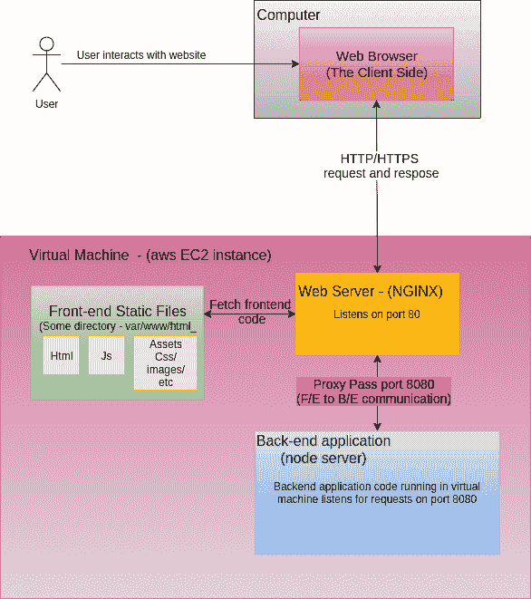
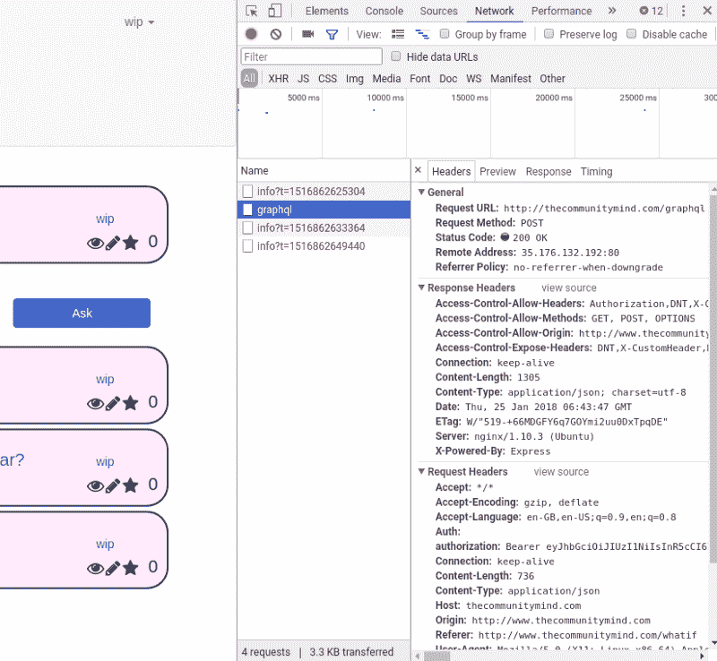
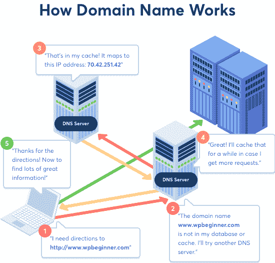

# 部署我的第一个全栈 web 应用的经验教训

> 原文：<https://www.freecodecamp.org/news/lessons-learned-from-deploying-my-first-full-stack-web-application-34f94ec0a286/>

威尔·艾布拉姆森

# 部署我的第一个全栈 web 应用的经验教训

我最近实现了我的一个长期目标:部署我的第一个全栈 web 应用程序。

在这篇文章中，我将分享我从初学者的角度学到的经验教训，以及我跟随的一些有用的教程，我必须克服的主要障碍，以及我在这一过程中犯的错误。我想帮助其他开发人员理解部署 web 应用程序所涉及的内容。

在花了六个多星期的时间搜索、尝试、失败、再尝试之后，我终于成功部署了我的 web 应用程序。它由 Node.js 后端和 Amazon Web Services (AWS) EC2 虚拟机的 React 前端组成。

这是一个相当大的挑战，但它确实令人满意，因为最终应用程序成功部署，现在可以通过公共域名访问。


Victory Jump! - After deploying your Web Application

对我来说最大的困难是找到信息。我不明白什么是部署。于是我在网上苦苦寻找有效的答案。我没能找到一个全程指导。

希望通过将我学到的所有信息集中到一个地方，我可以简化下一个人的部署学习曲线。

所以现在开始…

### 部署应用程序意味着什么？

web 应用程序分为两部分。

*   **客户端代码:**这是你的前端 UI 代码。这些是静态文件，在应用程序的整个生命周期中不会改变。静态文件需要存在于**的某个地方**，这样你的用户就可以下载并在客户端的浏览器中运行它们。稍后我会更详细地介绍这个地方可能在哪里。
*   服务器端代码:它处理应用程序的所有逻辑。它应该在一个服务器(机器)上运行，通常是一个像 EC2 实例一样的虚拟服务器，就像您在本地开发时运行它一样。

要运行本地代码，服务器必须有它的副本。我刚刚从服务器的命令行界面克隆了我的 Github repo 到服务器上。

您还需要设置您的服务器。这包括:

*   将机器设置为能够访问互联网并运行您的代码
*   暴露正确的[端口](https://www.lifewire.com/port-numbers-on-computer-networks-817939)
*   监听 HTTP 请求(Internet 请求)
*   将自定义域名指向运行应用程序的服务器

当您可以使用自定义域名从互联网上的任何机器访问您的应用程序，并且应用程序的所有功能都按预期运行时，您就知道它在工作。

这是一个概述。但是，我们实际上是怎么做的呢？

### 入门指南

你应该把你的申请分开，把问题分解。您正在部署两种不同的东西:客户端静态文件和服务器端代码。

我的第一个错误是将我的应用程序视为一个整体，而不是两个相互对话的独立应用程序。

这增加了复杂性，使谷歌搜索答案变得毫无用处。这让我感到不知所措。

我把这个问题分解成这些步骤。虽然每个问题总是可以进一步分解。

*   设置您的虚拟机并部署后端
*   部署您的前端
*   让两个应用程序进行通信
*   指向你的域名

在下图中，我试图将整个过程放在一个图表中。



The deployment process. Created using [draw.io](https://www.draw.io/) - an awesome free diagram tool.

### 设置您的虚拟机并部署后端

在我的例子中，这是一个部署在 amazon EC2 虚拟机上的 Express.js 服务器。我会解释如何做，但是教程“[在 AWS 上创建和管理 Node.js 服务器-第 1 部分](https://hackernoon.com/tutorial-creating-and-managing-a-node-js-server-on-aws-part-1-d67367ac5171)”做得更好。

这是我在这个领域遇到的最好的教程，包括:

*   启动 AWS 虚拟机
*   为端口设置正确的安全组
*   将代码从 GitHub 拉到虚拟机上
*   运行您的服务器
*   使用一个 HTTP 服务器 Nginx 来转发来自端口 80 的请求
*   使用 PM2 持久化运行服务器的进程

它是我的救命稻草，如果没有它，我可能还会被困在这里。所以谢谢你，罗伯特·托德。

您可以使用 [Postman](https://www.getpostman.com/) 向您的一个后端端点发送请求，轻松测试您的服务器是否正在运行。

### 部署您的前端

所以现在你有了一个后端运行的服务器(我希望如此)，你需要让你的前端工作起来。当你理解了这个过程，这真的很容易。

可惜，很长一段时间我都没有。例如，在开始时，我尝试使用 npm start 运行我的前端。

Npm start 创建一个本地开发服务器，为文件提供服务，这样它们只能使用`localhost`来访问，这不是我们想要的。

要部署前端代码，您必须将虚拟机上的所有文件存储在 web 服务器知道的位置。web 服务器让客户下载代码并在他们的浏览器中运行。

Apache 和 [Nginx](https://www.nginx.com/) 就是 web 服务器的例子。

web 服务器监听特定的端口，端口 80 或者更常见的端口 443(安全的)，并且或者提供静态文件(您的前端代码)或者将请求传递到不同的端口。例如，我们在上面的 Node.js 教程中看到了一个对后端的请求。

由于前端代码只是存储在 web 服务器上的一组文件，我们希望这些文件尽可能小，尽可能优化。这确保了客户端可以尽快下载并运行它们。

页面加载速度越快，用户越开心。

所有的前端 JavaScript 文件都可以打包成一个 JavaScript 文件。这通常通过运行 npm run build 来完成，假设您在 package.json 中定义了这个脚本。

你可以在这里阅读更多关于捆绑代码的信息。

基本上，捆绑应用程序会删除任何不必要的东西。这包括缩短名称并将所有 JavaScript 代码放在一个文件中。它还会将您的代码编译成正确的 JavaScript 版本。这使得所有的 web 浏览器都可以理解并运行它(例如，将 TypeScript 转换为 JavaScript)。

当您的代码被捆绑时，您只需要将文件复制到您的 web 服务器上。然后配置您的 web 服务器来提供存储在该位置的文件。

这里有一篇关于将静态文件部署到 Nginx web 服务器的好文章。
希望，如果一切顺利(它从来没有)，你的前端代码现在工作。

访问虚拟机的公共 DNS，以验证是否加载了来自站点的静态信息。

### 让两个应用程序进行通信

所以我让我的两个应用程序分别运行，但是有些地方不对劲。我无法摆脱网络请求错误。

这是最让我沮丧的一点。我差一点就成功了，但是我遇到了一些挫折，最终花了几个星期才解决。

跨源资源共享(CORS)是一种允许不同 IP 地址或端口之间通信的机制。您希望允许您的后端将数据发送回您的前端。

要实现这一点，您的前端在请求资源时必须包含正确的头。这可以通过两种方式实现:

*   头可以添加到 Nginx 中，尽管需要一些计算。可以从这里开始[。](http://oskarhane.com/avoid-cors-with-nginx-proxy_pass/)
*   您可以[使用 cors npm 模块](https://www.npmjs.com/package/cors)来包含标题。

测试它是否工作的一个很好的方法是查看浏览器开发工具的网络标签。这显示了应用程序发出的所有请求。如果您选择一个请求，您可以看到该请求的目的地以及它包含的标题。



一旦你的请求发送了正确的请求头，你必须确保请求发送到正确的地方。这应该是你的 EC2 后端服务器的地址和端口，而不是我的**本地**后端服务器的地址和端口。

您的前端使用 HTTP 请求与后端通信。在你前端的某个地方，代码你会告诉它你后端的位置。

```
const networkInterface = createNetworkInterface({
 uri: ‘http://0.0.0.0:5000/graphql',
});
```

我的看起来像这样，这显然不适合我的生产服务器。

令人恼火的是，这使得我的应用程序在我第一次在本地机器上导航到它时看起来工作正常，因为我的本地服务器正在运行并能够返回所需的信息。

要解决这个问题，您可以简单地更改定义的 URI，但这意味着每次做进一步开发时都必须将它改回来，这不是最好的方法(我知道是因为我做过)。

更复杂的解决方案是同时包含 URIs，并使用环境变量来选择合适的一个。

```
const networkInterface = createNetworkInterface({   
   uri: process.env.NODE_ENV === 'production' ?      
                     'http://thecommunitymind.com/graphql' : 
                     'http://0.0.0.0:5000/graphql',
});
```

简单却有效。只要确保在生产服务器上使用 NODE_ENV 时将它设置为 production 即可。

我们快到了。事实上，您的部署现在可能可以工作了。

但是我还有最后一个问题要克服。

即使我的 CORS 设置是正确的，所需的标题并没有被一致地包括进来，只是有时被添加。对于某些 POST 请求，CORS 标头并不总是存在。非常奇怪！

这个错误让我沮丧地试图在 Nginx 中修复我的 CORS 设置，而实际上它与 CORS 毫无关系。

实际上，我甚至不需要在 Nginx 中对 CORS 做任何事情，因为我使用的是 CORS npm 模块。

该错误是由另外两个问题引起的:

*   我的数据库作为 sqlite 文件包含在后端
*   我的流程经理 [PM2](http://pm2.keymetrics.io/) 正在观察文件的变化

因此，在 POST 请求中写入数据库文件会导致 PM2 重启服务器。这导致正确的标题没有被选中，从而导致误导性的错误。

一个很好的技巧是检查 EC2 实例上的服务器日志，我希望我能早点知道这个技巧。无论你使用的是 PM2 还是其他软件，总会有办法检查你的日志。谷歌一下就知道了！

这些日志提供了解决我的问题的关键。

我只需关闭 PM2 的观察功能。答对了。最后，它成功了。

### 指向你的域名

这是锦上添花。您希望新部署的应用程序有一个干净漂亮的 URL。

我通过亚马逊购买了我的域名，并使用 Route 53 将它指向正确的 EC2 实例。这是一次出人意料的无痛体验。

亚马逊的[教程](https://docs.aws.amazon.com/Route53/latest/DeveloperGuide/routing-to-ec2-instance.html)已经足够了。



Great diagram - Source: [WPBeginner](http://www.wpbeginner.com/beginners-guide/beginners-guide-what-is-a-domain-name-and-how-do-domains-work/)

### 摘要

我希望这篇文章能帮助你理解 web 应用程序的部署过程，并最终让你的惊人项目上线——不管它是什么。

至少你应该对谷歌搜索什么有一个更好的想法！

祝你好运。