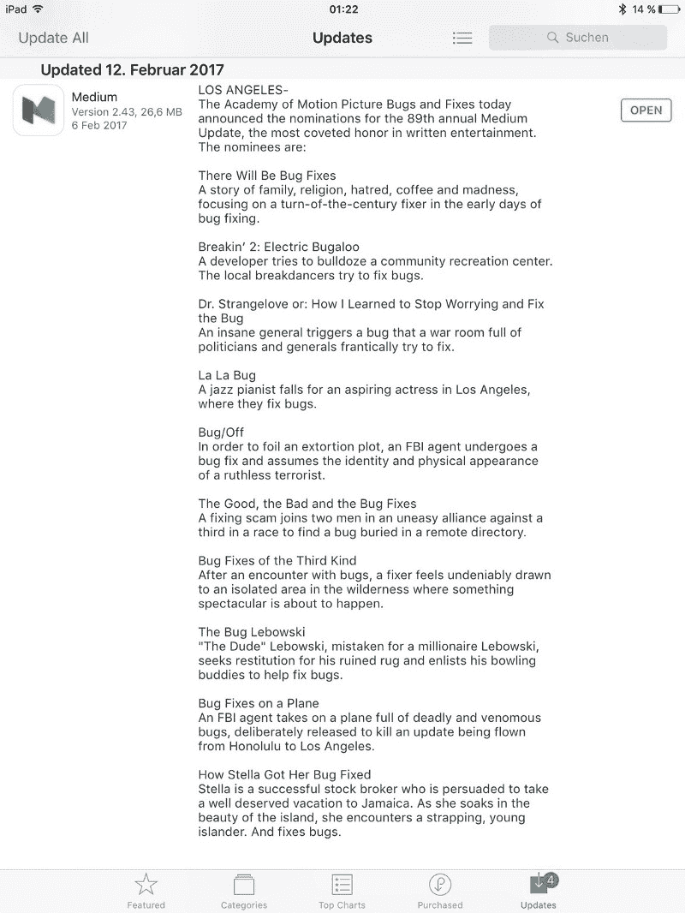
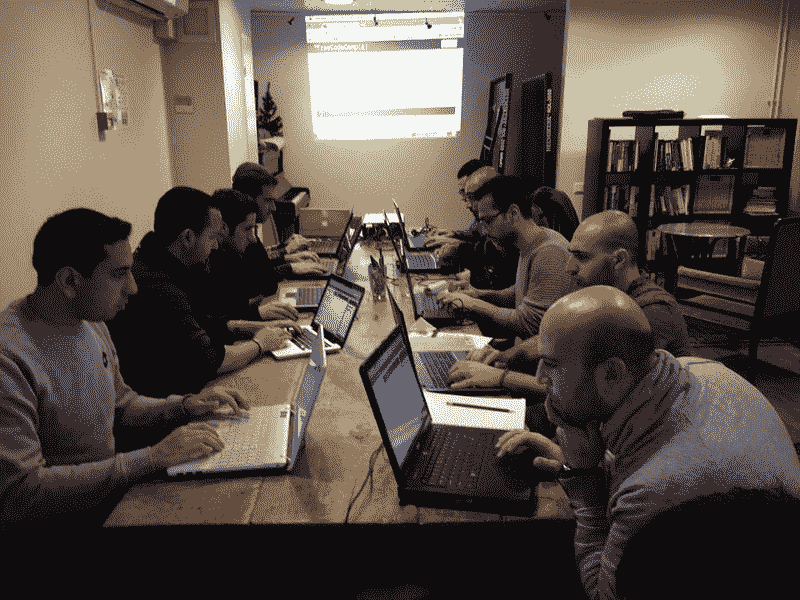

# 从在 Snapchat 获得一份开发者工作中学到的经验

> 原文：<https://www.freecodecamp.org/news/lessons-learned-from-getting-a-developer-job-at-snapchat-b9c2f15e9188/>

这里有三个值得你花时间的链接:

1.  我刚在 Snapchat 找到一份开发人员的工作。以下是我学到的，以及它如何能帮助你找工作( [15 分钟阅读](http://bit.ly/2lV3c01))
2.  如何在 React ( [8 分钟阅读](http://bit.ly/2lSNyFL))中构建动画微交互
3.  是时候再给打字稿一次机会了( [6 分钟阅读](http://bit.ly/2kQYsYx)

额外收获:我采访了 Preethi Kasireddy，关于她从风险资本家到软件工程师的转变，以及她新的函数式编程课程( [22 分钟观察](http://bit.ly/2lept98))

### 想到这一天:

> “计算机软件业最惊人的成就是它持续抵消了计算机硬件业稳定而惊人的收益。”—亨利·彼得罗夫斯基

### 每日一图:

来自 Medium 最新 iOS 版本更新的 changelog。

### 今日学习小组:

伦敦自由代码营

编码快乐！

–昆西·拉森，自由代码营的老师