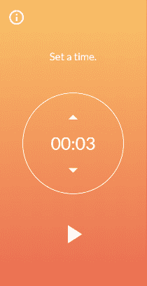
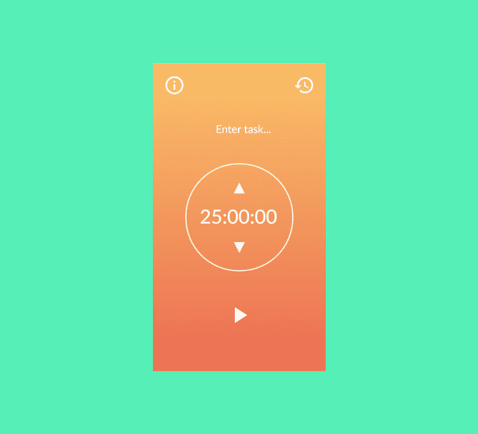
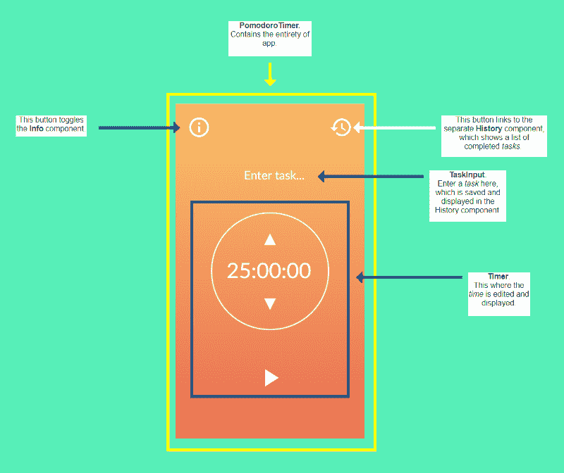

# 我从创建我的第一个 React 应用程序中学到了什么

> 原文：<https://www.freecodecamp.org/news/lessons-learned-from-my-first-react-app-3c4ebb740399/>

依列依

# 我从创建我的第一个 React 应用程序中学到了什么



animating stuff with react-transition-group

我将分享我希望我知道的事情，希望我已经做了的事情，或者当我制作我的第一个 React 应用程序时很高兴我做了的事情。这是一个番茄钟，或者生产力计时器。我为一个 freeCodeCamp 项目建造了它，并为一个 T2 Chingu 队列练习了我学到的 React。

这里可以现场[查看，代码是](https://ellereeeee-pomodoro-clock.netlify.com/)[这里](https://github.com/ellereeeee/pomodoro-clock)。

希望可以帮助一些 React 新手。

### 阅读 React 文档

如果你刚刚开始学习 React，从[官方文档](https://reactjs.org/docs/hello-world.html)开始。就 docs 而言，React 很容易理解，并且提供了大量的例子。

不要做我所做的，从 React 教程开始。我从 egghead.io 的[初学者指南反应](https://egghead.io/courses/the-beginner-s-guide-to-react)(*初学者的*在我看来是用词不当)开始，很粗糙。公平地说，我听说 egghead.io 是为更有经验的开发人员设计的，他们希望快速掌握新的框架。

我确实学到了很多，但是有很多暂停的视频，回到 10 秒钟去听一遍又一遍的解释，只是看着代码，感觉很失落。事情最终变得明朗了，但我不禁想，如果先从官方文档开始，然后再查一个教程，那会更好。

我相信你能找到一个对初学者更友好的教程。然而，首先查看官方文档是一个很好的实践，我认为在学习 React 的情况下你会更好。

### 精通 JavaScript，或者准备好学习

请看这段简短的代码:

```
class Counter extends React.Component {  constructor(props) {    super(props)    this.state = {count: 0}    this.handleClick = this.handleClick.bind(this)  }
```

上面，我们有一个 ES6 类(这只是原型继承的语法糖)声明。什么是原型继承？`constructor`和`super`功能是什么？为什么我们要把`handleClick`硬绑定到`this`？你了解 JavaScript 中的 lex-time 作用域吗？

现在，你不需要知道这些问题的答案来做出反应。你可以假设你需要这段或那段代码来让事情运转起来，然后就此打住。然而，我认为在更深层次上理解事情是很重要的。

这种代码模式是 React 的基础。你不想知道发生了什么吗？

这只是 React 中的一个例子，在 React 中，您需要对 JavaScript 有相当的了解。

很了解它，或者准备学习。

### 反应中思考

将你的应用程序设计成一个线框或模型，并将其分解成组件。这将使编码过程更加顺畅。

例如，我从这个模型开始。



我在我的最终应用程序中更改了一些东西，但看着样机，你可以看到:

1.  包含一切的橙色应用程序

2.左上角的信息按钮

3.右上角有一个已完成任务的历史按钮

4.顶部中央的消息/输入

5.中间有一个放射式计时器、时钟和上下按钮

6.底部中间的播放按钮

然后我把我的 UI 分成组件。每一部分都应该代表某种功能或数据。



由此，我能够将组件组织成一个层次结构:


很简单。一切都嵌套在 PomodoroTimer 组件中。这说明了一个重要的问题，那就是国家应该在哪里。状态应该在 React 中的一个位置，并“向下流动”到嵌套的组件。我决定它应该在番茄红素成分中。

我可以在计时器组件中设置`time`状态。但是，如果用户正在休息，我想将 PomodoroTimer 的颜色改为蓝色。这意味着我将有一个`timerType`状态来改变背景颜色和初始时间(工作 25 分钟，休息 5 分钟)。

如果我在 PomodoroTimer 中既有`timerType`状态又有`time`状态，并将`time`传递给 Timer，那么数据流会更加直接。一旦`time`达到 0，`timerType`将从`"Pomodoro"`变为`"Rest"`。如果我的应用程序都在一个地方，就更容易理解状态是如何流动的。这也使得调试更加容易。

查看 React 官方文档中的文章[“在 React 中思考”](https://reactjs.org/docs/thinking-in-react.html)，获得关于从原型到完成应用创建 React 应用的更详细解释。

### 检查控制台是否有错误

我在代码中犯了一个大错误，如果我检查控制台中的错误，我会发现它。不管你用什么语言或框架编码，你都应该这样做。

在我将代码发布到论坛进行审查后，有人向我指出了这个错误:

```
./src/components/PomodoroTimer.jsx  Line 17:   Do not mutate state directly. Use setState()  react/no-direct-mutation-state  Line 21:   Do not mutate state directly. Use setState()  react/no-direct-mutation-state
```

这意味着我在直接修改状态，这在 React 中是一大禁忌。

所以我修改了我的代码:

```
handleIncrementTime = () => {    this.setState({ state: (this.state.time += 300000) });  };  handleDecrementTime = () => {    if (this.state.time > 300000) {      this.setState({ time: (this.state.time -= 300000) });    }  };
```

对此:

```
handleIncrementTime = () =>    this.setState(prevState => ({ time: (prevState.time + 300000) }));  handleDecrementTime = () => {    if (this.state.time > 300000) {      this.setState(prevState => ({ time: (prevState.time - 300000) }));    }  };
```

我需要使用第二种形式的`setState`来更新状态。将使用参数`prevState`更新状态的函数传递给`setState`。你可以在这里阅读第二种形式的`setState`[。](https://reactjs.org/docs/state-and-lifecycle.html)

### TL；速度三角形定位法(dead reckoning)

1.  如果你正在学习 React，从 React 文档开始。
2.  精通 JavaScript，或者准备学习。
3.  花时间规划你的应用。将你的 UI 分解成组件，并考虑状态将存在于何处。
4.  检查控制台是否有错误。

我在编写我的第一个 React 应用程序时获得了很多乐趣，我希望你也一样。祝你好运！

感谢 Reddit 用户 codethesite 帮助我[重构我的处理程序赋值操作符](https://www.reddit.com/r/reactjs/comments/8tinqo/lessons_learned_from_my_first_react_app/e18vqtw/)！