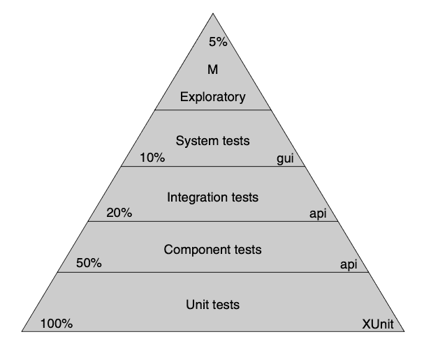
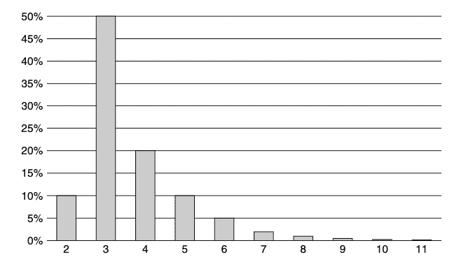
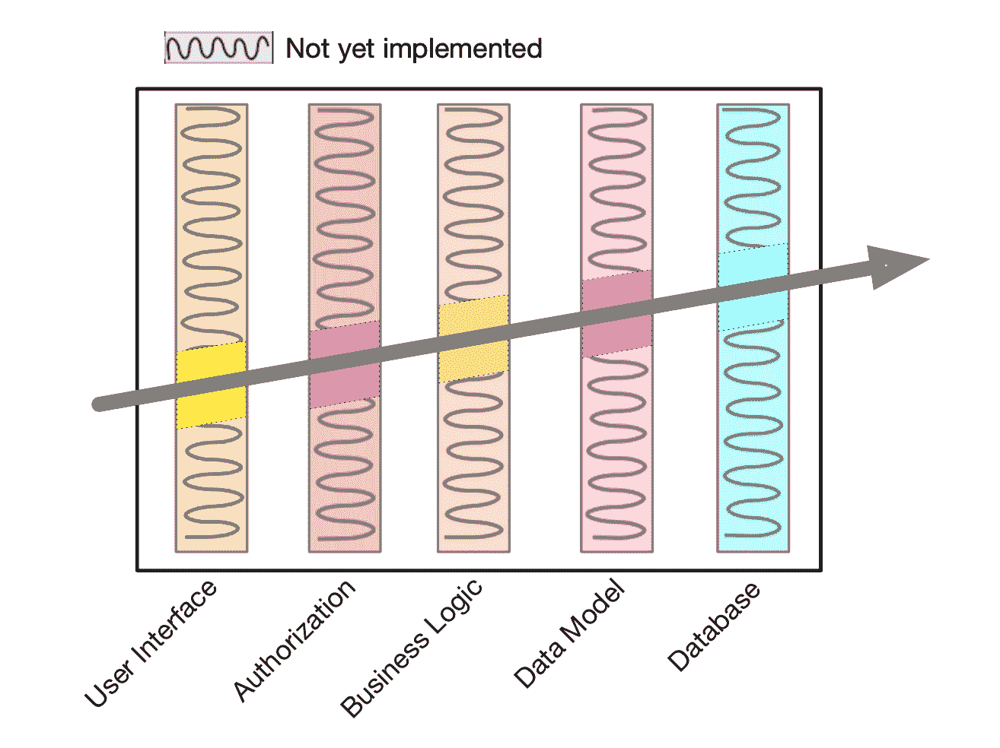
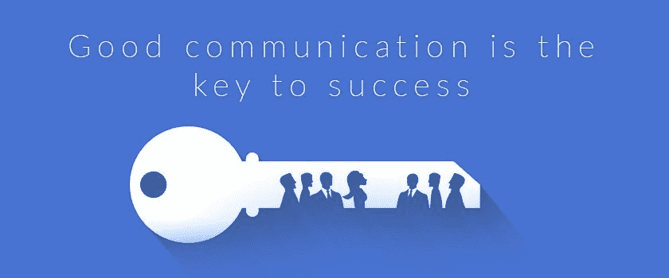

# 我从务实的程序员和干净的程序员那里学到了什么

> 原文：<https://www.freecodecamp.org/news/lessons-learned-from-the-pragmatic-programmer-and-the-clean-coder/>

我最近读完了*《实用主义程序员 20 周年纪念版》* (2019)和*《干净的程序员》* (2011)。你会在几乎所有的“十大软件开发书籍”列表中找到这些书籍。

我的目标是学习、提高和获得我的一位老师曾经说过的那种知识“*不能仅仅从阅读文章*中获得。”

当你在开发软件的时候，你可能会卡在一个 YouTube 视频和 StackOverflow 答案没有帮助的点上。你最终会接触到官方文档，或者该技术的源代码来寻找答案。

当你想真正深刻地理解这个主题时，也会发生同样的事情。文章有时会有不足之处，阅读知名书籍通常是最好的方法。

这些书不仅关注如何编写代码，还会教你开发软件的最佳实践，甚至是有用的人生经验。在这篇文章中，我将分享我从他们身上学到的一些经验。

## 目录

*   如何承担责任
*   测试很重要
*   团队合作让梦想成真
*   如何估计
*   曳光弹发展
*   如何应对压力
*   重构的重要性
*   这些书的主要区别
*   结论
*   资源

## 如何承担责任

作为一名软件开发人员，你要对自己编写的代码负责。你必须确保它不仅现在有效，而且在很长一段时间内都能以最好的方式发挥作用(没有什么是永恒的)。

确保代码不会失败的最好方法是测试它——在每次编写新代码时运行自动化测试，以确保一切都正常工作。

> 承担责任。责任是你积极认同的东西。
> —务实的程序员

然而，责任不仅仅与编码相关。你也必须**承担起提升自己的责任**，通过安排时间来变得更好。

> 专业人士花时间关心他们的职业。大概，你成为一名软件开发人员是因为你对软件充满热情，而你想成为一名专业人员的愿望就是由这种热情所激发的。
> —干净的编码器

> 你的知识和经验是你最重要的日常专业资产。
> —务实的程序员

## 测试很重要

测试在软件开发中的重要性如此之大，以至于两本书都聚焦于这个主题。

你必须**将测试视为你代码的第一批用户**，所以它们是指导你编码的最佳反馈。

实践 [TDD 测试驱动开发](https://en.wikipedia.org/wiki/Test-driven_development)。它是如何工作的？以下是它的三个主要步骤:

1.  选择一个要添加的特性，并编写一个在实现它之后将通过的测试。现在，除了新的测试，所有的测试都应该通过了。
2.  编写通过它所需的代码。
3.  重构代码并检查所有测试是否仍然通过。

这就是说，重要的是要着眼于大局，不要因为写太多的测试而错过主要目标。

> 人们很容易被绿色的“测试通过”信息所诱惑，写了很多代码，但实际上并没有让你更接近解决方案。
> —务实的程序员

测试有三种方式:*第一，期间，*和*从不。*第一(TDD)是最好的。当 First 没有用时，During 是一个后备。并且 Never 经常被称为“稍后测试”,但遗憾的是**在大多数情况下，稍后意味着 Never。**

> 首先测试的需求迫使你思考“好的设计”
> —干净的编码器

有了测试，您就有信心更频繁地重构代码，因为您可以检查以确保在您做出更改后测试仍然通过。

> 应尽可能频繁地运行测试，以提供最大的反馈，并确保系统持续保持清洁。
> —干净的编码器

使用验收测试来*定义需求何时完成*与涉众合作。

开发人员负责确保测试总是自动化的，原因很简单:**成本。**

开发人员应该有一个目标，那就是“QA 不应该发现任何东西”。您可以通过实现不同种类的测试，从单元测试到探索性测试，以不同的方式来实现这一点。

## 团队合作让梦想成真

在团队工作时，你必须成为一名“团队成员”，经常沟通，密切关注队友，尽可能有效地履行职责。

> 良好的沟通是避免这些问题的关键。我们所说的“好”是指即时的、无摩擦的。无摩擦意味着提问、分享你的进展、你的问题、你的见解和学习，以及了解你的队友在做什么，都很简单。
> —务实的程序员

团队应该是小的，少于 10-12 个成员，每个人都互相了解和信任。这种团队环境**很难实现**，因此一旦你得到它，你必须**关心它，改变团队工作的项目而不是成员。**

> 随着团队规模的增长，沟通路径以 O(n^2 的速度增长，其中 n 是团队成员的数量。在较大的团队中，沟通开始中断，变得无效。
> —务实的程序员

> 围绕项目组建团队是一种愚蠢的方法。个人只是在项目中呆了很短的时间，因此从来没有学会如何与他人相处。团队比项目更难建立。因此，最好组建持久的团队，一起从一个项目转移到下一个项目，并且可以同时承担多个项目。
> —干净的编码器

此外，优秀的团队会一起面对和解决问题，每个人都会尽最大努力。他们作为一个整体完成任务。最终，他们会因为他们的表现和工作质量而为人所知。

> 质量只能来自所有团队成员的个人贡献。质量是内在的，不是外加的。
> —务实的程序员

> 一个有凝聚力的团队可以创造奇迹，互相预测，互相掩护，互相支持，并要求对方做到最好。他们让事情发生。
> —干净的编码器

> 伟大的项目团队都有鲜明的个性。人们期待着与他们会面，因为他们知道他们将看到一场精心准备的表演，让每个人都感觉良好。他们制作的文档清晰、准确且一致。
> —务实的程序员

## 如何估计

像这两本书的大部分内容一样，这一课在软件开发和现实生活中同样重要。你练习和发展得越多，你决定任何任务可行性的能力就越直观。

首先，我想通过分享 Clean Coder 对估计的定义来澄清*估计*意味着什么，该定义称之为*概率分布。*

> 估计值不是一个数字。估计是一个*概率分布，*完成的可能性。
> —干净的编码者

为了帮助你理解它，这里有一个未来 11 天完成一项任务的可能性的图表。

做出好的评估的基础之一是**对你正在评估的东西有适当的了解。**

> 任何评估练习的第一部分都是建立对所提问题的理解。你需要掌握领域的范围。
> —务实的程序员

不要一个人估计，**和其他人交流尽量准确。**

> 你拥有的最重要的评估资源是你周围的人。他们能看到你看不到的东西。它们可以帮助你比你自己更准确地估计你的任务。
> —干净的编码器

> 一个总能给出好答案的基本估算技巧是:问问已经做过估算的人。
> —务实的程序员

当被要求估计时，选择能更好地反映你想要表达的准确性的单位。务实的程序员给出的这个估算时间表可能会对你有所帮助。

| 持续时间 | 报价估算在 |
| --- | --- |
| 1–15 天 | 天 |
| 3–6 周 | 周；星期 |
| 8-20 周 | 月份 |
| 20 周以上 | 在给出一个估价之前仔细考虑一下 |

尽管企业喜欢将估算视为承诺，但请记住估算只是一种猜测，因此并不意味着承诺。

> 承诺是你必须实现的。如果你承诺在某个日期前完成某件事，那么你只需要在那个日期前完成它。专业人士不会做出承诺，除非他们知道自己能实现。错过承诺是一种不诚实的行为，只比公开的谎言稍微轻一点。
> —干净的编码器

也就是说，为了帮助企业度量需求并制定适当的计划，您必须在评估之前**消除需求的模糊性。**之后，**让他们了解最新进展。**

> 管理迟到的诀窍是及早发现和透明。定期对照你的目标衡量你的进展。尽可能诚实地对待所有的约会。不要把希望纳入你的估计！
> —干净的编码器

不要重新发明轮子，使用众所周知的任务评估技术。这里我对两本书里提到的一些技巧做了一个总结。

*   [PERT](https://reymon359.github.io/book-sentences/#/The%20Clean%20Coder/index?id=pert)
*   [宽带德尔福](https://reymon359.github.io/book-sentences/#/The%20Clean%20Coder/index?id=wideband-delphi)
*   [飞行手指](https://reymon359.github.io/book-sentences/#/The%20Clean%20Coder/index?id=flying-fingers)
*   [策划扑克](https://reymon359.github.io/book-sentences/#/The%20Clean%20Coder/index?id=planning-poker)
*   [亲和力估计](https://reymon359.github.io/book-sentences/#/The%20Clean%20Coder/index?id=affinity-estimation)
*   [三元估计值](https://reymon359.github.io/book-sentences/#/The%20Clean%20Coder/index?id=trivariate-estimates)
*   [大数定律](https://reymon359.github.io/book-sentences/#/The%20Clean%20Coder/index?id=the-law-of-large-numbers)

你在某个项目上的经验越多，你就能更好地估计它的任务。因此，如果你做的第一次评估没有达到预期的精度，也不要担心。这是一个渐进的过程，就像你想要实现的每个长期目标一样。

我最喜欢的一句名言是:

> 只有**一种**方法可以让**吃掉一头大象**:让**一次咬一口**。
> —德斯蒙德·图图

但是，这样的可爱是没办法吃的:

## 曳光弹发展

曳光弹是一种特殊的子弹，在电影中用来标记路径，作为反馈，让射手下次瞄准得更好。因此，曳光弹开发的主要目标是将新功能“发射”到项目中，并获得快速反馈，以便更好地“瞄准”下一个功能。

> Tracer 开发与项目永无止境的想法是一致的:总会有需要的变更和需要添加的功能。这是一种渐进的方法。
> —务实的程序员

这种方法有助于开发人员专注于要实现的主要功能，以便可以在此基础上构建其他功能。

此外，通过从开发过程的开始就提供一个功能性的和可演示的框架，它可以作为架构兼容和可行的证明。

> 寻找定义系统的重要需求。寻找你怀疑的领域，以及你认为最大的风险。然后对你的开发进行优先排序，这样这些就是你编码的第一个领域。
> —务实的程序员

最后，曳光弹的开发不应该与原型制造混淆。来自原型的代码不应该是项目的一部分，然而来自追踪子弹的代码不会被丢弃。它是可行的，并且每一次迭代都有新的特性。

> 原型生成一次性代码。跟踪代码精简但完整，并构成最终系统的框架的一部分。可以把原型设计想象成在发射一颗曳光弹之前进行的侦察和情报收集。
> —务实的程序员

## 如何应对压力

我也喜欢这个，因为它对软件开发之外的人也有帮助。迟早你会处于压力之下，处理压力的最好方法是尽可能避免压力，当你不能承受压力时，忍受压力。

> 在压力下保持冷静的最好方法是避免造成压力的情况。
> —干净的编码器

你主要通过管理承诺、保持清洁和遵守纪律来避免它。

管理承诺的最好方法是对那些你不确定是否能完成的最后期限说不。保持整洁基本上意味着你的系统、代码和设计没有混乱。

> 快速完成任务并在最后期限前完成的方法是保持清洁。专业人士不会屈服于为了快速行动而制造混乱的诱惑。“又快又脏”是一个矛盾修饰法。脏总是意味着慢！
> —干净的编码器

无论在什么情况下，遵循你真正相信并一直坚持的原则。危机时刻将会到来，那时你必须注意你的行为。如果你遵循你的纪律，这意味着你相信他们。

改变你的行为和不遵守你的纪律意味着你不真正相信你的正常行为，你必须改变这些纪律来改善它。

> 如果你在平时保持代码整洁，但在危机中却搞得一团糟，那么你不会真的认为这种混乱会拖你的后腿。如果你在危机中配对，但通常不配对，那么你认为配对比不配对更有效。
> —干净的编码器

选择你在危机中感到舒适的学科。然后一直跟着他们。遵循这些原则是避免陷入危机的最佳方式。当关键时刻到来时，不要改变你的行为。如果你的纪律是最好的工作方式，那么即使在最严重的危机中也应该遵守。

但是你不能总是逃避压力，所以你要学会如何度过它。你通过保持冷静、沟通、遵守纪律和寻求帮助来度过难关。

为了保持冷静，**不要惊慌，**控制你的压力，仔细考虑问题，找到最好的结果。然后稳步前进，*像吃大象*。确保你一直与你的团队和上级保持**沟通，让他们知道你什么时候有麻烦，这样你就可以得到建议和指导。这样最后就不会有什么意外的惊喜了。**

> 避免制造惊喜。没有什么比惊喜更让人愤怒，更让人失去理智。惊喜让压力倍增十倍。
> —干净的编码器

就像你依靠纪律来避免压力一样，当情况变得艰难时，你也应该依靠纪律。事实上，这些时候你必须特别关注它们，既不质疑也不抛弃它们。

沟通技巧包括**向队友、上级或互联网网站和论坛寻求帮助**。

不要忘记当别人有压力需要帮助时，也要在他们身边。

> 当压力来临时，找一个愿意和你一起编程的合伙人。你会完成得更快，缺陷更少。你的搭档会帮助你坚持你的纪律，让你不要惊慌。
> —干净的编码器

## 重构的重要性

马丁·福勒将术语*重构*定义为:

> 重组现有代码体的规范技术，改变其内部结构而不改变其外部行为。马丁·福勒

有时您会发现代码感觉不太对劲，应该进行修复或改进。你必须记住这样做的最佳时刻是**现在**，当你找到它的时候。

这是不可避免的:一个程序的代码需要成长、进化和改进。为了做到这一点，你需要重新考虑一些决定，代码也需要改变。所以一定要用**自动化测试**来覆盖它，以保证外部行为不会改变。

> 与其说软件是建筑，不如说它更像园艺——它比混凝土更有机。根据最初的计划和条件，你在花园里种植许多东西。你不断地监控花园的健康状况，并根据需要进行调整。
> —务实的程序员

什么时候应该重构代码？以下是符合条件的情况列表:

*   删除**代码重复。**
*   使代码的某些部分更加正交。
*   更新过时的代码和/或文档。
*   提高**性能。**

以下是马丁·福勒关于如何在弊大于利的情况下进行重构的建议:

1.  不要试图在重构的同时增加功能。
2.  在开始重构之前，确保你有好的测试。尽可能经常地运行测试。
3.  采取简短、谨慎的步骤:将一个字段从一个类移到另一个类，拆分一个方法，重命名一个变量。重构通常涉及到许多局部的变化，这些变化会导致更大规模的变化。

最需要记住的是**重构不是某项任务，它是一种习惯**。而且，就像生活中的大多数事情一样，当问题很小的时候，作为编码时的一个持续活动，这样做更容易。

你现在重构得越少，将来你就有越多的时间去解决问题。

> 重构是一种“成长”移除它需要侵入性手术。你可以趁它还小的时候把它拿出来。或者，你可以等待它生长和扩散——但那时移除它将更加昂贵和危险。再等下去，你可能会完全失去这个病人。
> —务实的程序员

## 这些书的主要区别

我不想让这篇文章成为一个比较——但是尽管这些书关注相似的主题，内容和叙述方式却不尽相同。

以下是我从他们那里得到的与内容本身无关的主要印象。这些观察可以帮助你在阅读它们的时候有一个预期的想法。

*   干净的编码员以一种更日常的工作方式谈论开发人员。它提到了在这种环境中常见的情况，如与销售或业务人员的关系，在团队中工作，或对客户说不。务实程序员中的开发人员并不真正处于工作环境中。相反，它给出了该领域的一个概述，为任何情况下的建议:*主题和提示*构建了这本书。
*   干净的程序员把软件开发人员的形象称为专业程序员，而实用程序员使用完全意想不到的术语“T2 实用程序员”。
*   一般来说，干净的编码者有更多的主观感觉，因为它分享了作者更多的个人经验。另一方面，务实的程序员感觉更客观，主要关注建议本身。
*   务实的程序员比干净的程序员包含更多不同编程语言的代码示例，这有助于您理解所讨论的概念。

## 结论

请记住，我在这里讨论的只是我自己的个人印象和我从阅读这两本书中得到的教训。每本书都有更多的内容可以提供，你能做的最好的事情就是自己阅读，形成自己的观点和结论。

如果你对软件开发感兴趣，想变得更好，那么这两本书都应该读。值得——它们非常不同，每一个都值得你花时间。他们会为你的职业生涯带来不同的知识和最佳实践。

话虽如此，如果你仍然想偷懒，我用每本书的核心句子做了这个开源项目。

## 资源

主要的资源是两本书，你可以很容易地在网上找到它们，还有我记下我认为最重要的句子的项目。

我希望你喜欢这篇文章。你也可以在我的网站上和其他人一起阅读。如果你有任何问题、建议或反馈，请不要犹豫，从[我的网站](https://ramonmorcillo.com/)的任何社交网络上联系。