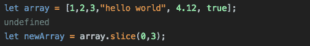
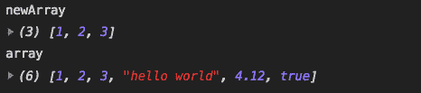
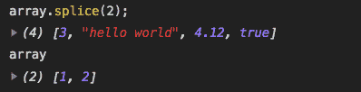
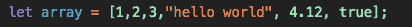
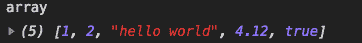
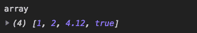
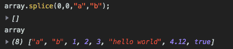
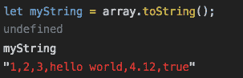
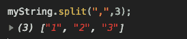
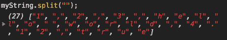

# 让我们澄清一下 JavaScript 中围绕 slice()、splice()、& split()方法的混乱

> 原文：<https://www.freecodecamp.org/news/lets-clear-up-the-confusion-around-the-slice-splice-split-methods-in-javascript-8ba3266c29ae/>

一旦我们正确理解了 JavaScript 内置方法，它们在编程时会给我们很大帮助。我想在这篇文章中解释其中的三种:方法 **`slice()`** 、 **`splice()`** 和 **`split()`** 。也许因为它们的命名非常相似，所以它们经常被混淆，即使是在有经验的开发人员中。

我建议学生和初级开发人员仔细阅读这篇文章，因为这三种方法在求职面试中也会被问到。

你可以在最后找到每种方法的总结。如果你愿意，你也可以观看下面的视频版本:

[https://www.youtube.com/embed/alFcHCWwS0I?feature=oembed](https://www.youtube.com/embed/alFcHCWwS0I?feature=oembed)

所以让我们开始…

### JavaScript 数组

首先，你需要理解 JavaScript 数组是如何工作的。像在其他编程语言中一样，我们在 JS 中使用数组存储多个数据。但不同的是， ****JS**** ****数组可以同时包含不同类型的数据。****

有时我们需要对那些数组进行操作。然后我们用一些 JS 的方法比如****slice()&****。你可以在下面看到如何用 JavaScript 声明一个数组:

`let arrayDefinition = [];   // Array declaration in JS`

现在让我们用不同的数据类型声明另一个数组。我将在下面的例子中使用它:

`let array = [1, 2, 3, "hello world", 4.12, true];`

这种用法在 JavaScript 中是 ****有效**** 。具有不同数据类型的数组:字符串、数字和布尔值。

### 切片( )

****slice( )**** 方法 ****复制**** 数组的给定部分，并将复制的部分作为新数组返回。 ****不改变原阵。****

`array.slice(from, until);`

*   ****从:**** 切片数组开始 ****从**** 开始一个元素索引
*   ****直到:**** 切片数组 ****直到**** 另一个元素索引

例如，我想从上面的数组中截取前三个元素。由于数组的第一个元素总是索引为 0，所以我从 0 开始切片 ****。****

`array.slice(0, until);`

现在是棘手的部分。当我想要切片前三个元素时，我必须将 ****直到**** 的参数设为 3。******slice()方法不包括最后给定的元素。******

```
`array[0] --> 1              // included
array[1] --> 2              // included
array[2] --> 3              // included
array[3] --> "hello world"  // not included`
```

**这可能会造成一些混乱。这就是为什么我把第二个参数 ****“直到”。******

**`let newArray = array.slice(0, 3);   // Return value is also an array`**

**最后，我将切片数组赋给 ****newArray**** 变量。现在让我们看看结果:**

**

Slice **array** and assign the members to **newArray**** **

**newArray** variable is an array now, and the original one remains the same** 

> ***重要提示: ****Slice( )**** 方法也可以用于 ****琴弦。*******

### **拼接( )**

**这个函数的名字很像 ****slice( )**** 。这种命名的相似性经常让开发人员感到困惑。 ****splice( )**** 方法 ****改变**** 一个数组，通过在其中添加或删除元素。让我们看看如何用 ****【拼接】(** **)**** 添加和删除元素:**

#### **移除元素**

**对于删除元素，我们需要给出 ****索引**** 参数，以及 ****要删除的元素数量**** :**

**`array.splice(index, number of elements);`**

******指标**** 是去除元素的 ****起点**** 。给定索引中具有较小 索引号的 ****元素不会被删除:******

**`array.splice(2);  // Every element starting from index 2, will be removed`**

**如果我们不定义第二个参数，从给定索引开始的每个元素都将从数组中删除:**

**

**only index 0 and 1 are still there**** 

**作为第二个例子，我将第二个参数设为 1，因此每次调用**方法时，从索引 2 开始的元素将被逐个删除:****

****`array.splice(2, 1);`****

****

Array at beginning**** 

********第一次通话后:********

**

**3** is removed so **“hello world”** has now index 2** 

******第二次通话后:******

**

This time, **“hello world”** is removed as **index: 2**** 

**这可以继续，直到不再有索引 2。**

#### **添加元素**

**对于添加元素，我们需要给它们作为第 3、第 4、第 5 个参数(取决于要添加多少)给**splice()【方法:****

****array.splice(索引，元素数，元素，元素)；****

****作为一个例子，我在数组的最开始添加了 ****a**** 和 ****b**** 并且我什么也没有删除:****

**`array.splice(0, 0, 'a', 'b');`**

**

**a** and **b** added to the beginning of array, no elements removed** 

### **拆分( )**

******【切片()】**** 和 ****拼接()**** 方法都是针对数组的。 ****split( )**** 方法用于 ****字符串**** 。它将一个字符串分成子字符串，并将它们作为数组返回。它有两个参数，两个都是可选的 ****。******

**`string.split(separator, limit);`**

*   ******分隔符:**** 定义如何用逗号、字符等分割字符串。**
*   ******限制:**** 限制给定数目的拆分次数**

******split( )**** 方法对 ****数组**** 直接不起作用。但是，我们可以先将数组中的元素转换成一个字符串，然后我们可以使用****【split()****方法。**

**让我们看看它是如何工作的。**

**首先，我们用 ****toString( )**** 方法将数组转换成一个字符串:**

**`let myString = array.toString();`**

****

**现在让我们把 ****myString**** 用**逗号分开，把它们限制为 ****三个**** 子串，并把它们作为一个数组返回:****

**`let newArray = myString.split(",", 3);`**

**

**Only the first 3 elements are returned**** 

**我们可以看到， ****myString**** 是用逗号分开的。因为我们将 split 限制为 3，所以只返回前 3 个元素。**

> *******注意:**** 如果我们有这样的用法:`*array.split("");*`那么字符串的每个字符都会被分成子字符串:***

**

**Each character split one by one**** 

### **总结:**

#### **切片( )**

*   **从数组中复制元素**
*   **将它们作为新数组返回**
*   **不会改变原始数组**
*   **从…开始切片，直到给定索引: ****array.slice (from，until)******
*   **切片不包括 ****【直到】**** 指标参数**
*   **可用于数组和字符串**

#### **拼接( )**

*   **用于在数组中添加/删除元素**
*   **返回已移除元素的数组**
*   **更改数组**
*   **用于添加元素: ****array.splice(索引，元素个数，元素)******
*   **用于删除元素: ****array.splice(索引，元素个数)******
*   **只能用于数组**

#### **拆分( )**

*   **将字符串分成子字符串**
*   **以数组的形式返回它们**
*   **取 2 个参数，都是可选的:****【string . split(分隔符，限制)******
*   **不改变原来的字符串**
*   **只能用于字符串**

**JavaScript 数组和字符串还有许多其他的内置方法，这使得 JavaScript 编程更加容易。接下来，你可以看看我关于 [JavaScript Substring 方法](https://www.freecodecamp.org/news/javascript-substring-examples-slice-substr-and-substring-methods-in-js/)的新文章。**

****如果你想了解更多关于 web 开发的知识，欢迎在 Youtube 上关注我**[](https://www.youtube.com/channel/UC1EgYPCvKCXFn8HlpoJwY3Q)****！******

****感谢您的阅读！****