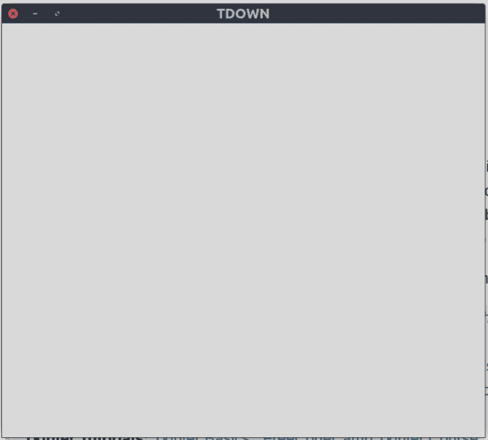
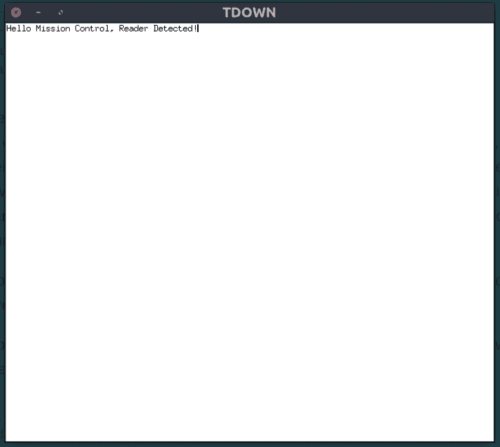
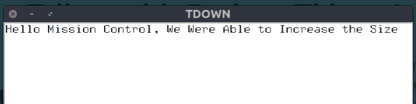
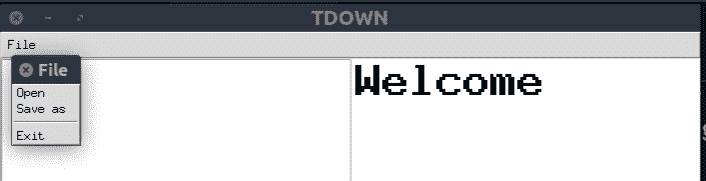
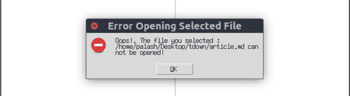

# 如何用 Python 和 Tkinter 构建一个玩具降价编辑器

> 原文：<https://www.freecodecamp.org/news/lets-create-a-toy-markdown-editor-with-python-tkinter/>

降价编辑是这些天的趋势。每个人都在创建一个 markdown 编辑器，其中一些是创新的，而另一些是无聊的。

然而，就我自己而言，我总是喜欢做别人没有做过的事情。(下面我会解释为什么其他 dev 不愿意用 Tkinter 构建 markdown 编辑器。)

如果你已经熟悉 Python 和 Tkinter，你可以很容易地进入本指南。

> 但如果你是刚开始接触 Python 和/或 Tkinter，可以看看这些:
> **Python 教程:** [FreeCodeCamp Python 教程](https://www.freecodecamp.org/news/best-python-tutorial/)，[Python 3 Playlist by send ex](https://www.youtube.com/playlist?list=PLQVvvaa0QuDeAams7fkdcwOGBpGdHpXln)， [FreeCodeCamp Python for 初学者](https://www.youtube.com/watch?v=rfscVS0vtbw)等。(更多可一搜一搜)
> **Tkinter 教程:** [Tkinter 基础知识](https://pythonprogramming.net/python-3-tkinter-basics-tutorial/)， [FreeCodeCamp Tkinter 课程](https://www.youtube.com/watch?v=YXPyB4XeYLA)， [TheNewBoston Tkinter 播放列表](https://www.youtube.com/playlist?list=PL6gx4Cwl9DGBwibXFtPtflztSNPGuIB_d)等。(更多内容可以在谷歌搜索中找到)

所以，在我们开始之前，我想解释一下为什么人们不想用 tkinter 构建 markdown 编辑器。这是因为没有默认的简单方法来显示 markdown 输入的 html 输出。甚至没有默认的 tkinter 小部件来显示 html 数据。您可以简单地编写/编辑 markdown，但是没有简单的方法在您的应用程序中显示输出。

但是有一天，我在网上的大街小巷漫游的时候，发现了一件有趣的事情: [**tk_html_widgets**](https://github.com/paolo-gurisatti/tk_html_widgets) 。它可以显示 html 输出！

当然，它也有一些问题:字体太小，而且不支持附加远程照片。所以像往常一样，我创建了自己的叉子，修复了一些问题，并提高了稳定性。我把它命名为 [tkhtmlview](https://github.com/bauripalash/tkhtmlview/) 。？

呃，我想我让你厌烦了？，所以我们别说了，开始建吧。

## ？️开始建设:

首先确保你已经安装了 Python 3 和 Tkinter。如果没有，你可以从这里下载它们:
[python.org/downloads](https://www.python.org/downloads)(Tkinter 已经打包了 Python)。

我们需要的其他东西是 **tkhtmlview** 和 **markdown2** 。你可以通过运行`pip install tkhtmlview markdown2`或`pip3 install tkhtmlview markdown2`来安装它们(如果你有多个版本的 Python)。

现在启动你最喜欢的编辑器或 IDE，创建一个新文件(例如`tdown.py`(我将编辑器命名为 *tdown* )。
我们将从导入必要的库开始。

```
from tkinter import *
from tkinter import font , filedialog
from markdown2 import Markdown
from tkhtmlview import HTMLLabel 
```

在第一行中，我们(几乎)从 tkinter 包中导入所有内容。

在第二行，我们导入字体和文件对话框。需要使用`font`来设置我们输入字段的样式(如字体、字体大小),导入 filedialog 来打开降价文件进行编辑(和/或保存我们的降价文件)。

在第 3 行中，markdown 被导入，以帮助我们将 Markdown 源转换为 html，并使用 HTMLLabel(我们在第 4 行导入它)将其显示在输出字段中。

之后，我们将创建一个名为 Window 的框架类，它将从 tkinters 的**框架**类继承而来。它将保存我们的输入和输出字段。

```
 class Window(Frame):
    def __init__(self, master=None):
        Frame.__init__(self, master)
        self.master = master
        self.myfont = font.Font(family="Helvetica", size=14)
        self.init_window()

    def init_window(self):
        self.master.title("TDOWN")
        self.pack(fill=BOTH, expand=1) 
```

在这个代码块中，我们首先定义了一个名为 Window 的类，它继承了 tkinter 的 Frame widget 类。

现在，在初始化函数中，我们将 master 作为参数，它将作为框架的父框架。在下一行中，我们初始化一个帧。

接下来，我们用字体系列 **Helvetica** (你可以选择任何你想要的字体系列)和大小 *14* 声明一个名为`self.myfont`的自定义字体对象，它将用于我们的 markdown 输入字段。

最后，我们调用 *init_window* 函数，在这里我们将放置应用程序的核心。

在 *init_window* 函数中，我们首先将窗口的标题设置为 **TDOWN** 。在下一行`self.pack(fill=BOTH, expand=1)`，我们告诉我们的框架占据我们窗口的全部空间。

我们将关键字参数`fill`设置为`BOTH`，它实际上是从 tkinter 库中导入的。它告诉框架在水平和垂直方向填充窗口，并且`expand`关键字参数被设置为 1(表示**真**，这告诉我们的框架是可扩展的。简单来说，无论我们如何拉伸窗口大小或将其最大化，框架都会填满窗口。

现在，如果您运行`tdown.py`脚本，您将看不到任何东西，因为我们只定义了类，但从未调用过它。

为了解决这个问题，我们将把它放在脚本的末尾:

```
root = Tk()
root.geometry("700x600")
app = Window(root)
app.mainloop() 
```

这里我们创建了一个 Tk 对象，并把它存储在根变量中，这个根变量将作为我们窗口类的根。

接下来，我们将窗口的几何图形设置为 700 x600——700 是窗口的高度，600 是窗口的宽度。在下一行中，您可以看到我们正在创建一个窗口对象。我们将**根**变量作为帧的*根*推送到一个名为 **app** 的变量中。

接下来我们要做的就是调用 mainloop 函数，它告诉我们的应用程序运行！？

现在运行`tdown.py`脚本。如果您做的一切都正确，您将会看到一个像这样的空白窗口:



但这只是一个空白的窗口。要在窗口中写一些东西，我们需要添加一个文本字段，我们将写我们的降价。为此，我们将使用 tkinter 的**文本**小部件。

```
...
def init_window(self):
    self.master.title("TDOWN")
    self.pack(fill=BOTH, expand=1)

    self.inputeditor = Text(self, width="1")
    self.inputeditor.pack(fill=BOTH, expand=1, side=LEFT) 
```

> 不要与**混淆...**(三个点)，我把它们放在那里只是为了表示在这个代码块之前有多行代码。

这里我们创建一个宽度为 **1** 的文本小部件。不要抓你的头——这里的尺寸是用比例做的。在接下来的几秒钟里，当我们放入输出框时，你会更清楚地理解它。？

然后我们把它装进框架，告诉它在水平和垂直方向都是可拉伸的。

当您运行该脚本时，您会看到一个多行输入字段已经占据了我们的整个~~世界~~窗口。如果你开始在上面写字，你可能会注意到字是如此的小！



我已经知道这个问题会出现。这就是为什么我之前告诉你要创建一个自定义字体对象( *self.myfont* )。如果您做这样的事情:

```
 self.inputeditor = Text(self, width="1" , font=self.myfont) 
```

> (这里，我们告诉我们的文本小部件使用我们自定义的字体，而不是默认的小字体！)

...输入字段的字体大小将增加到 14。运行脚本来检查是否一切正常。



现在，我认为是时候添加 outputbox 了，我们可以在这里看到我们的 markdown 源代码的 html 输出。

为此，我们将在`init_window`函数中添加一个类似这样的 HTMLLabel:

```
self.outputbox = HTMLLabel(self, width="1", background="white", html="<h1>Welcome</h1>")
self.outputbox.pack(fill=BOTH, expand=1, side=RIGHT)
self.outputbox.fit_height() 
```

我们使用来自 *tkhtmlview* 的`HTMLLabel`，宽度为 **1** (再次)。我们将宽度设置为 1，因为窗口将在输入字段和输出框之间以 **1:1** 的比率共享(当您运行脚本时，您就会明白我的意思)。

`html`关键字参数存储第一次显示的值。

然后我们把它打包在窗口中，用`side`作为`RIGHT`放在输入字段的右边。`fit_height()`使文本适合小部件(据我所知...？)

现在运行代码。


现在如果你开始在输入栏里写东西，你可能会失望(但是不要！)来查看我们输入时输出没有更新。这是因为我们还没有告诉我们的程序这样做。

为此，我们首先将事件与编辑器绑定。然后，每当文本被修改时，输出将被更新，如下所示:

```
self.inputeditor.bind("<<Modified>>", self.onInputChange) 
```

> 将这一行放到 init_window()函数中。

所以基本上这一行告诉`inputeditor`每当文本改变时调用`onInputChange`函数。但是由于我们还没有这个函数，所以我们需要编写它。

```
...
def onInputChange(self , event):
    self.inputeditor.edit_modified(0)
    md2html = Markdown()
    self.outputbox.set_html(md2html.convert(self.inputeditor.get("1.0" , END))) 
```

在第一行中，使用`edit_modified(0)`我们重置了修改后的标志，以便可以重用。否则，在第一次事件调用后，它将不再工作。

接下来，我们创建一个名为 md2html 的 Markdown 对象。在最后一行，我们首先....等等！最后一行可能会让一些读者感到困惑。让我把它分成三行。

```
markdownText = self.inputeditor.get("1.0" , END)
html = md2html.convert(markdownText)
self.outputbox.set_html(html) 
```

在这里的第一行，我们从输入字段的顶部到底部获取降价文本。第一个参数`self.inputeditor.get`，告诉它从第一行的第 0 个字符开始扫描(1.0 = > [LINE_NUMBER】)。[CHARACTER_NUMBER])，最后一个参数告诉它在到达末尾时停止扫描。

然后，我们使用`md2html.convert()`函数将扫描的降价文本转换成 html，并将其存储在`html`变量中。

最后，我们告诉 outputbox 使用`.set_html()`函数显示输出！

运行脚本。你会看到一个功能(几乎)markdown 编辑器。当您在输入字段中输入时，输出也将被更新！

但是...我们的工作还没有完成。用户至少需要能够打开和保存他们的文本。

为此，我们将在菜单栏中添加一个`File`菜单。这是用户能够打开和保存文件以及退出应用程序的地方。

在`init_window`函数中，我们将添加以下几行:

```
self.mainmenu = Menu(self)
self.filemenu = Menu(self.mainmenu)
self.filemenu.add_command(label="Open", command=self.openfile)
self.filemenu.add_command(label="Save as", command=self.savefile)
self.filemenu.add_separator()
self.filemenu.add_command(label="Exit", command=self.quit)
self.mainmenu.add_cascade(label="File", menu=self.filemenu)
self.master.config(menu=self.mainmenu) 
```

我长话短说:

这里我们定义了一个新菜单，它的父菜单是 Frame。

接下来，我们将另一个菜单和上一个菜单定义为其父菜单。它将作为我们的`File`菜单。

然后我们使用`add_command()`和`add_separator()`函数添加 3 个子菜单(打开、另存为和退出)和一个分隔符。**打开**子菜单将执行`openfile`功能，**另存为**子菜单将执行`savefile`功能。最后**退出**将执行一个内置函数`quit`，该函数将关闭程序。

然后使用`add_cascade()`函数，我们告诉第一个菜单对象包含`filemenu`变量。这包括我们所有带有标签`File`的子菜单。

最后我们使用`self.master.config()`来告诉我们的窗口使用`mainmenu`作为我们窗口的菜单栏。



> 它看起来会像这样，但是先不要运行它。你会得到错误消息说`openfile` & `savefile`函数没有被定义。

正如你现在看到的，我们必须在 Window 类中定义两个函数，在这里我们将使用 tkinter 的 filedialog。

首先让我们定义打开文件的函数:

```
def openfile(self):
    openfilename = filedialog.askopenfilename(filetypes=(("Markdown File", "*.md , *.mdown , *.markdown"),
                                                                  ("Text File", "*.txt"), 
                                                                  ("All Files", "*.*")))
    if openfilename:
        try:
            self.inputeditor.delete(1.0, END)
            self.inputeditor.insert(END , open(openfilename).read())
        except:
            print("Cannot Open File!") 
```

这里，首先我们向用户展示一个文件浏览器对话框，允许他们选择使用`filedialog.askopenfilename()`打开一个文件。使用`filetypes`关键字参数，我们通过传递一个包含受支持文件的元组(基本上是所有类型的文件)来告诉对话框只打开这些类型的文件:

*   扩展名为`.md`、`.mdown`、`.markdown`的降价文件，
*   扩展名为`.txt`的文本文件，
*   在下一行使用通配符扩展名，我们告诉对话框打开任何扩展名的文件。

然后我们检查用户是否选择了一个文件。如果是，我们尝试打开文件。然后，我们删除输入字段中从第一行的第 0 个字符到字段末尾的所有文本。

接下来，我们打开并读取所选文件的内容，并将内容插入输入字段。

如果我们的程序不能打开一个文件，它会打印出错误。但是等等，这不是处理错误的好方法。我们在这里可以做的是向用户显示如下所示的错误消息:



为此，我们将首先从 tkinter 包中导入`messagebox`。

```
from tkinter import messagebox as mbox 
```

然后，我们不是像上面那样打印一条错误消息，而是用下面的行替换那一行，向用户显示一条正确的错误消息。

```
 mbox.showerror("Error Opening Selected File" , "Oops!, The file you selected : {} can not be opened!".format(openfilename)) 
```

当文件无法打开时，这将创建一个类似上面我给你看的截图的错误信息。

在`mbox.showerror`函数中，第一个参数是 messagebox 的标题。第二个是要显示的消息。

现在，我们需要编写一个`savefile`函数来保存我们的 markdown 输入。

```
def savefile(self):
        filedata = self.inputeditor.get("1.0" , END)
        savefilename = filedialog.asksaveasfilename(filetypes = (("Markdown File", "*.md"),
                                                                  ("Text File", "*.txt")) , title="Save Markdown File")
        if savefilename:
            try:
                f = open(savefilename , "w")
                f.write(filedata)
            except:
                mbox.showerror("Error Saving File" , "Oops!, The File : {} can not be saved!".format(savefilename)) 
```

在这里，首先我们扫描输入字段的所有内容，并将其存储在一个变量中。然后，我们通过提供两种文件类型的选项，要求用户输入他们想要保存内容的文件名。md 和。txt)。

如果用户选择了一个文件名，我们试图将输入字段的内容保存在变量`filedata`中。如果出现异常，我们会向用户显示一条错误消息，说明程序无法保存文件。

不要忘记测试您的应用程序，以检查任何错误！如果你和我没有犯任何错误，我们的程序应该可以完美地运行，看起来应该像这样:


> **这款“tdown”markdown 编辑器的完整源代码可以在 [GitHub](https://github.com/bauripalash/tdown) 和 [Repl.it](https://repl.it/@bauripalash/tdownlive) 获得，你可以在浏览器上测试该编辑器！**


如果你在阅读这篇文章的过程中遇到了任何问题，你可以在评论中告诉我，或者在 twitter 上发消息给我，地址是 [@bauripalash](https://twitter.com/bauripalash) 。

## 一些注意事项:

*   首先，记住这只是一个玩具编辑器。如果你想构建更强大的编辑器，你可以使用任何其他 GUI 库，比如 wxPython、PyQT、Kivy 等等，它们至少有更好的 html 支持([完整列表](https://wiki.python.org/moin/GuiProgramming))。

*   在本文中，我只展示了如何构建一个基本的编辑器。你还可以添加更多自己的酷功能，比如导出为 HTML 或 PDF，添加按钮来简化编写 Markdown...等等等等。

*   html 呈现模块 tkhtmlview 或 tk_html_widgets 并不完全稳定，只支持一些基本的 HTML 功能，所以不要抱太大期望。

因此...我希望你喜欢这篇文章，并学到了一些新东西。如果你被困在某个地方或者不能理解某些事情，不要忘记让我知道。

最后但同样重要的是，请让我知道我是否犯了以上任何错误。我很乐意通过评论或 DM 听到你的想法或建议。

谢谢你。？