# 终极中级 Ruby on Rails 教程:让我们创建一个完整的应用程序！

> 原文：<https://www.freecodecamp.org/news/lets-create-an-intermediate-level-ruby-on-rails-application-d7c6e997c63f/>

### 由多曼塔斯 G


网上有很多教程展示如何创建你的第一个应用程序。本教程将更进一步，逐行解释如何创建更复杂的 Ruby On Rails 应用程序。

在整个教程中，我会逐渐引入新的技术和概念。这个想法是，每一个新的部分，你都应该学习新的东西。

本指南将讨论以下主题:

*   Ruby On Rails 基础知识
*   重构:助手、部分、关注点、设计模式
*   测试:TDD/BDD (RSpec & Capybara)，工厂(工厂女孩)
*   行动电缆
*   活动工单
*   CSS，Bootstrap，JavaScript，jQuery

#### 那么这款应用将会是什么样的呢？

这将是一个平台，在这里你可以寻找和遇到志同道合的人。

该应用程序将具有的主要功能:

*   认证(使用设备)
*   能够发布帖子，并搜索和分类
*   即时消息(弹出窗口和一个单独的信使)，能够创建私人和小组对话。
*   将用户添加到联系人的能力
*   实时通知

****你可以看到**** [****完成应用****](https://www.youtube.com/watch?time_continue=10&v=KkgJRe7df04) ****会是什么样子。****

****你可以在****[****GitHub****](https://github.com/domagude/collabfield)****上找到完整的项目源代码。****

**目录**

1.  **[介绍和设置](https://www.freecodecamp.org/news/lets-create-an-intermediate-level-ruby-on-rails-application-d7c6e997c63f/#so-what-is-the-app-is-going-to-be-about)** [前置条件](https://www.freecodecamp.org/news/lets-create-an-intermediate-level-ruby-on-rails-application-d7c6e997c63f/#prerequisites) [设置](https://www.freecodecamp.org/news/lets-create-an-intermediate-level-ruby-on-rails-application-d7c6e997c63f/#setup) [创建新 app](https://www.freecodecamp.org/news/lets-create-an-intermediate-level-ruby-on-rails-application-d7c6e997c63f/#create-a-new-app)
2.  **[布局](https://www.freecodecamp.org/news/lets-create-an-intermediate-level-ruby-on-rails-application-d7c6e997c63f/#layout)** [首页](https://www.freecodecamp.org/news/lets-create-an-intermediate-level-ruby-on-rails-application-d7c6e997c63f/#home-page) [自举](https://www.freecodecamp.org/news/lets-create-an-intermediate-level-ruby-on-rails-application-d7c6e997c63f/#bootstrap) [导航栏](https://www.freecodecamp.org/news/lets-create-an-intermediate-level-ruby-on-rails-application-d7c6e997c63f/#navigation-bar) [样式表](https://www.freecodecamp.org/news/lets-create-an-intermediate-level-ruby-on-rails-application-d7c6e997c63f/#style-sheets)
3.  **[岗位](https://www.freecodecamp.org/news/lets-create-an-intermediate-level-ruby-on-rails-application-d7c6e997c63f/#posts)** [认证](https://www.freecodecamp.org/news/lets-create-an-intermediate-level-ruby-on-rails-application-d7c6e997c63f/#authentication) [助手](https://www.freecodecamp.org/news/lets-create-an-intermediate-level-ruby-on-rails-application-d7c6e997c63f/#helpers) [测试](https://www.freecodecamp.org/news/lets-create-an-intermediate-level-ruby-on-rails-application-d7c6e997c63f/#testing) [主馈](https://www.freecodecamp.org/news/lets-create-an-intermediate-level-ruby-on-rails-application-d7c6e997c63f/#main-feed) [单个岗位](https://www.freecodecamp.org/news/lets-create-an-intermediate-level-ruby-on-rails-application-d7c6e997c63f/#single-post) [特定分支](https://www.freecodecamp.org/news/lets-create-an-intermediate-level-ruby-on-rails-application-d7c6e997c63f/#specific-branches) [服务对象](https://www.freecodecamp.org/news/lets-create-an-intermediate-level-ruby-on-rails-application-d7c6e997c63f/#service-objects) [创建新岗位](https://www.freecodecamp.org/news/lets-create-an-intermediate-level-ruby-on-rails-application-d7c6e997c63f/#create-a-new-post)
4.  **[即时通讯](https://www.freecodecamp.org/news/lets-create-an-intermediate-level-ruby-on-rails-application-d7c6e997c63f/#instant-messaging)** [私人对话](https://www.freecodecamp.org/news/lets-create-an-intermediate-level-ruby-on-rails-application-d7c6e997c63f/#private-conversation) [联系人](https://www.freecodecamp.org/news/lets-create-an-intermediate-level-ruby-on-rails-application-d7c6e997c63f/#contacts) [群组对话](https://www.freecodecamp.org/news/lets-create-an-intermediate-level-ruby-on-rails-application-d7c6e997c63f/#group-conversation) [信使](https://www.freecodecamp.org/news/lets-create-an-intermediate-level-ruby-on-rails-application-d7c6e997c63f/#messenger)
5.  **[通知](https://www.freecodecamp.org/news/lets-create-an-intermediate-level-ruby-on-rails-application-d7c6e997c63f/#notifications)** [联系请求](https://www.freecodecamp.org/news/lets-create-an-intermediate-level-ruby-on-rails-application-d7c6e997c63f/#contact-requests) [谈话](https://www.freecodecamp.org/news/lets-create-an-intermediate-level-ruby-on-rails-application-d7c6e997c63f/#conversations)

### 先决条件

我会试着解释每一行代码，以及我是如何想出解决方案的。我认为一个完全的初学者完全有可能完成这个指南。但是请记住，本教程涵盖了一些超出基础的主题。

所以如果你是一个完全的初学者，这将会更难，因为你的学习曲线将会非常陡峭。我会提供一些资源链接，在那里你可以得到一些关于我们接触到的每个新概念的额外信息。

理想情况下，最好了解以下基本知识:

*   [HTML](https://www.w3schools.com/html/) ， [CSS](https://www.w3schools.com/css/) ， [Bootstrap](https://getbootstrap.com/docs/3.3/getting-started/) ， [JavaScript](https://www.w3schools.com/js/) ， [jQuery](https://www.w3schools.com/jquery/)
*   [Ruby](https://www.tutorialspoint.com/ruby/) ， [Ruby On Rails](http://guides.rubyonrails.org/getting_started.html)
*   [去](https://www.tutorialspoint.com/git/git_quick_guide.htm)

### 设置

我假设您已经建立了基本的 Ruby On Rails 开发环境。如果没有，检查[轨道安装器](http://railsinstaller.org/en)。

我已经在 Windows 10 上开发了一段时间。起初还好，但过了一段时间，我厌倦了克服由窗户引起的神秘障碍。我必须不断想办法让我的应用程序正常工作。我意识到这不值得我浪费时间。克服这些障碍并没有给我任何有价值的技能或知识。我只是花时间在安装 Windows 10 上。

于是换了一个[虚拟机](https://en.wikipedia.org/wiki/Virtual_machine)代替。我选择了用[流浪汉](https://www.vagrantup.com/)创建开发环境，用 [PuTTY](http://www.putty.org/) 连接虚拟机。如果你也想用流浪汉，这是我发现有用的[教程](https://www.youtube.com/watch?v=qjCMtR2Z-kA&t=)。

### 创建新应用程序

我们将使用 PostgreSQL 作为我们的数据库。这是 Ruby On Rails 社区中的一个流行选择。如果你还没有用 PostgreSQL 创建过任何 Rails 应用，你可能想看看这个[教程](https://www.digitalocean.com/community/tutorials/how-to-setup-ruby-on-rails-with-postgres)。

熟悉 PostgreSQL 后，导航到保存项目的目录并打开命令行提示符。

要生成新的应用程序，请运行以下代码行:

```
rails new collabfield --database=postgresql
```

这就是我们的应用程序的名字。默认情况下，Rails 使用 SQlite3，但是由于我们希望使用 PostgreSQL 作为我们的数据库，我们需要通过添加以下内容来指定它:

```
--database=postgresql
```

现在我们应该已经成功地生成了一个新的应用程序。

通过运行以下命令导航到新创建的目录:

```
cd collabfield
```

现在，我们可以通过输入以下命令来运行我们的应用程序:

```
rails s
```

我们刚刚开始我们的应用程序。现在我们应该可以看到目前为止我们得到了什么。打开浏览器，进入 [http://localhost:3000](http://localhost:3000/) 。如果一切顺利，您应该会看到 Rails 签名欢迎页面。

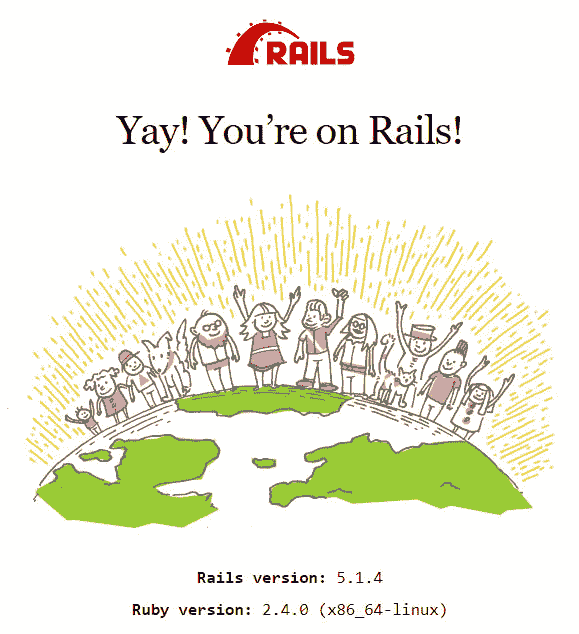

## 布局

该编码了。我们应该从哪里开始？我们可以从任何我们想去的地方开始。当我建立一个新网站时，我喜欢从创建某种基本的视觉结构开始，然后围绕它建立其他一切。我们就这么做吧。

### 主页

当我们访问 [http://localhost:3000](http://localhost:3000/) 时，我们会看到 Rails 的欢迎页面。我们将把这个默认页面换成我们自己的主页。为此，生成一个名为`Pages`的新控制器。如果你不熟悉 Rails 控制器，你应该浏览一下[动作控制器](http://guides.rubyonrails.org/action_controller_overview.html)来了解什么是 Rails 控制器。在命令提示符下运行这一行来生成一个新的控制器。

```
rails g controller pages
```

这个 rails 生成器应该已经为我们创建了一些文件。命令提示符中的输出应该如下所示:

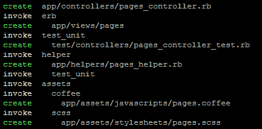

我们将使用这个`PagesController`来管理我们的特殊和静态页面。现在在文本编辑器中打开 Collabfield 项目。我使用[崇高文本](https://www.sublimetext.com/)，但是你可以使用任何你想使用的。

打开一个文件`pages_controller.rb`

```
app/controllers/pages_controller.rb
```

我们将在这里定义我们的主页。当然，我们可以在不同的控制器中以不同的方式定义主页。但是通常我喜欢在`PagesController`里面定义主页。

当我们打开`pages_controller.rb`，我们看到这个:

```
class PagesController < ApplicationController
end
```

controllers/pages_controller.rb

它是一个名为`PagesController`的空类，继承自`ApplicationController`类。你可以在`app/controllers/application_controller.rb`中找到这个类的源代码。

我们将创建的所有控制器都将从`ApplicationController`类继承。这意味着在这个类中定义的所有方法都可以在我们所有的控制器中使用。

我们将定义一个名为`index`的公共方法，因此它可以作为一个动作被调用:

```
class PagesController < ApplicationController

  def index
  end

end
```

controllers/page_controller.rb

正如您可能已经在[动作控制器](https://guides.rubyonrails.org/action_controller_overview.html)中读到的，路由决定了调用哪个控制器及其公共方法(动作)。让我们定义一个路由，这样当我们打开网站的根页面时，Rails 就知道要调用哪个控制器及其动作。在`app/config/routes.rb`中打开一个`routes.rb`文件。

如果您不知道什么是 Rails routines，这是通过阅读 Rails Routing 来熟悉它的最佳时机。

插入这一行:

```
root to: 'pages#index'
```

您的`routes.rb`文件应该如下所示:

```
Rails.application.routes.draw do
  root to: 'pages#index'
end
```

config/routes.rb

Ruby 中的散列符号`#`代表一个方法。因为你记得一个动作只是一个公共方法，所以`pages#index`说“调用`PagesController`和它的公共方法(动作)`index`”

如果我们转到我们的根路径 [http://localhost:3000](http://localhost:3000/) ，索引操作将被调用。但是我们还没有任何要渲染的模板。因此，让我们为我们的`index`操作创建一个新模板。转到`app/views/pages`，在这个目录下创建一个`index.html.erb`文件。在这个文件中，我们可以编写常规的 HTML+ [嵌入式 Ruby](https://www.tutorialspoint.com/ruby-on-rails/rails-and-html-erb.htm) 代码。只需在文件中写一些东西，这样我们就可以在浏览器中看到呈现的模板。

```
<h1>Home page</h1>
```

现在，当我们转到 [http://localhost:3000](http://localhost:3000) 时，我们应该看到类似这样的内容，而不是默认的 Rails 信息页面。

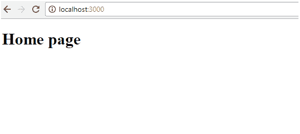

现在我们有了一个非常基本的起点。我们可以开始在我们的网站上引入新的东西。我认为是时候创建我们的第一个提交了。

在命令提示符下运行:

```
git status
```

您应该会看到类似这样的内容:


如果您还不知道，当我们生成一个新的应用程序时，会初始化一个新的本地 git 存储库。

通过运行以下命令添加所有当前更改:

```
git add -A
```

然后通过运行以下命令提交所有更改:

```
git commit -m "Generate PagesController. Initialize Home page"
```

如果我们运行这个:

```
git status
```

我们会看到没有什么要提交的，因为我们刚刚成功地提交了所有的更改。

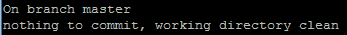

### 引导程序

对于导航栏和响应式网格系统，我们将使用 [Bootstrap](https://getbootstrap.com/) 库。为了使用这个库，我们必须安装

[bootstrap-sass](https://github.com/twbs/bootstrap-sass) 宝石。在编辑器中打开`Gemfile`。

```
collabfield/Gemfile
```

将`bootstrap-sass`宝石添加到宝石文件中。正如文档所说，您必须确保`sass-rails` gem 也存在。

```
...
gem 'bootstrap-sass', '~> 3.3.6'
gem 'sass-rails', '>= 3.2'
...
```

保存文件并运行它来安装新添加的 gems:

```
bundle install
```

如果您仍然在运行应用程序，重启 Rails 服务器以确保新的 gem 可用。要重启服务器，只需按下`Ctrl + C`将其关闭，然后再次运行`rails s`命令来启动服务器。

转到`assets`打开`application.css`文件:

`app/assets/stylesheets/application.css`

在所有注释文本下面添加以下内容:

```
...
@import "bootstrap-sprockets";
@import "bootstrap";
```

现在把`application.css`的名字改成`application.scss`。为了在 Rails 中使用引导库，这是必要的，它也允许我们使用 [Sass](https://sass-lang.com/) 特性。

我们想要控制所有`.scss`文件呈现的顺序，因为将来我们可能想要创建一些 Sass 变量。我们想确保在使用变量之前，它们已经被定义了。

要完成它，从`application.scss`文件中删除这两行:

```
*= require_self
*= require_tree .
```

我们几乎可以使用引导库。还有一件事我们必须做。正如 [bootstrap-sass](https://github.com/twbs/bootstrap-sass) 文档所说，Bootstrap JavaScript 依赖于 jQuery 库。要在 Rails 上使用 jQuery，您必须添加 [jquery-rails](https://github.com/rails/jquery-rails) gem。

```
gem 'jquery-rails'
```

运行…

```
bundle install
```

…再次，并重新启动服务器。

最后一步是在应用程序的 JavaScript 文件中需要 Bootstrap 和 jQuery。转到`application.js`

```
app/assets/javascripts/application.js
```

然后在文件中添加以下几行:

```
//= require jquery
//= require bootstrap-sprockets
```

提交更改:

```
git add -A
git commit -m "Add and configure bootstrap gem"
```

### 导航栏

对于导航栏，我们将使用 Bootstrap 的 [navbar 组件](https://getbootstrap.com/docs/3.3/components/#navbar)作为起点，然后对其进行修改。我们将把导航栏存储在一个[局部模板](https://guides.rubyonrails.org/layouts_and_rendering.html#using-partials)中。

我们这样做是因为最好将应用程序的每个组件保存在单独的文件中。它允许测试和管理应用程序的代码更容易。此外，我们可以在应用程序的其他部分重用这些组件，而无需复制代码。

导航至:

```
views/layouts
```

创建新文件:

```
_navigation.html.erb
```

对于 partial，我们使用下划线前缀，这样 Rails 框架就可以将其区分为 partial。现在，从引导文档中复制并粘贴 navbar 组件，并保存文件。要在网站上看到部分，我们必须在某个地方渲染它。导航至`views/layouts/application.html.erb`。这是默认文件，所有的东西都在这里渲染。

在该文件中，我们看到以下方法:

```
<%= yield %>
```

它呈现所请求的模板。为了在 HTML 文件中使用 ruby 语法，我们必须用`<% %>`将它包装起来(嵌入式 ruby 允许我们这样做)。要快速了解 ERB 语法之间的差异，请查看这个 [StackOverflow 答案](https://stackoverflow.com/questions/7996695/what-is-the-difference-between-and-in-erb-in-rails)。

在[主页部分](https://medium.com/free-code-camp/lets-create-an-intermediate-level-ruby-on-rails-application-d7c6e997c63f#b574)我们设置了[路径](https://medium.com/free-code-camp/lets-create-an-intermediate-level-ruby-on-rails-application-d7c6e997c63f#1faf)来识别根 URL。所以每当我们发送一个 [GET 请求](https://developer.mozilla.org/en-US/docs/Web/HTTP/Methods/GET)到一个根页面，就会调用`PagesController‘sindex`动作。并且相应的动作(在本例中是`index`动作)用一个用`yield`方法渲染的模板来响应。如您所知，我们的主页模板位于`app/views/pages/index.html.erb`。

因为我们希望所有页面都有一个导航栏，所以我们将在默认的`application.html.erb`文件中呈现我们的导航栏。要呈现部分文件，只需使用`render`方法并传递部分文件的路径作为参数。上面的`yield`方法是这样做的:

```
...
<%= render 'layouts/navigation' %>
<%= yield %>
...
```

现在转到 [http://localhost:3000](http://localhost:3000/) ，你应该可以看到导航栏。

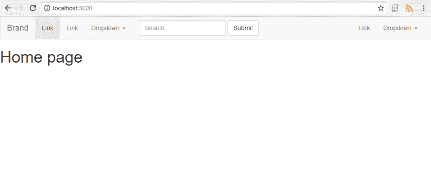

如上所述，我们将修改这个导航栏。首先让我们移除所有的`<li>`和`<form>`元素。将来，我们将在这里创建自己的元素。`_navigation.html.erb`文件现在应该是这样的。

```
<nav class="navbar navbar-default">
  <div class="container-fluid">
    <!-- Brand and toggle get grouped for better mobile display -->
    <div class="navbar-header">
      <button type="button" class="navbar-toggle collapsed" data-toggle="collapse" data-target="#bs-example-navbar-collapse-1" aria-expanded="false">
        <span class="sr-only">Toggle navigation</span>
        <span class="icon-bar"></span>
        <span class="icon-bar"></span>
        <span class="icon-bar"></span>
      </button>
      <a class="navbar-brand" href="#">Brand</a>
    </div>

    <!-- Collect the nav links, forms, and other content for toggling -->
    <div class="collapse navbar-collapse" id="bs-example-navbar-collapse-1">
      <ul class="nav navbar-nav">
      </ul>

      <ul class="nav navbar-nav navbar-right">
      </ul>
    </div><!-- /.navbar-collapse -->
  </div><!-- /.container-fluid -->
</nav>
```

layouts/_navigation.html.erb

我们现在有了一个基本的响应式导航栏。这是创建新提交的好时机。在命令提示符下运行以下命令:

```
git add -A
git commit -m "Add a basic navigation bar
```

我们应该把导航栏的名字从`Brand`改成`collabfield`。由于`Brand`是一个链接元素，我们应该使用一个`[link_to](https://apidock.com/rails/ActionView/Helpers/UrlHelper/link_to)`方法来生成链接。为什么？因为这种方法可以让我们很容易地生成 URI 路径。打开命令提示符并导航到项目目录。运行以下命令:

```
rails routes
```

该命令输出我们的可用路线，这些路线由`routes.rb`文件生成。正如我们所见:

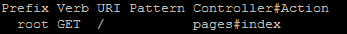

目前，我们只有一条路线，就是我们之前定义的那条。如果您查看给定的路线，您可以看到一个`Prefix`列。我们可以使用这些前缀来生成一个所需页面的路径。我们所要做的就是使用一个前缀名，并给它加上`_path`。如果我们写了`root_path`，那将生成一个到根页面的路径。所以还是用`link_to`的力量和路线吧。

替换此行:

```
<a class="navbar-brand" href="#">Brand</a>
```

使用这一行:

```
<%= link_to 'collabfield', root_path, class: 'navbar-brand' %>
```

请记住，每当你不太明白一个特定的方法是如何工作的，只要谷歌一下，你可能会找到它的文档和解释。有时文档写得很差，所以你可能想多谷歌一下，你可能会找到一个博客或 StackOverflow 答案，这将有所帮助。

在这种情况下，我们传递一个字符串作为第一个参数来添加`<a>`元素的值，第二个参数是 path 所需要的，这是 routes 帮助我们生成它的地方。第三个参数是可选的，它累积在 options 散列中。在这种情况下，我们需要添加`navbar-brand`类来保持我们的引导支持的导航条的功能。

让我们为这个小变化再做一次提交。在接下来的部分，我们将从导航栏开始改变我们应用的设计。

```
git add -A
git commit -m "Change navigation bar's brand name from Brand to collabfield"
```

### 样式表

让我介绍一下我是如何构造样式表文件的。据我所知，关于如何在 Rails 中构建样式表，并没有什么强有力的约定。每个人的做法都略有不同。


这是我通常如何组织我的文件。

*   ****基础目录**** —这是我保存 Sass 变量和样式的地方，它们会在整个应用程序中使用。例如默认字体大小和默认元素样式。
*   **——我的大部分风格都去那里。我在这个目录中保存了独立组件和页面的所有样式。**
*   ******响应式****——这里我为不同的屏幕尺寸定义了不同的样式规则。例如，桌面屏幕、平板电脑屏幕、电话屏幕等的样式。**

**首先，让我们通过运行以下命令来创建一个新的存储库分支:**

```
`git checkout -b "styles"`
```

**我们刚刚创建了一个新的 [git 分支](https://git-scm.com/book/en/v2/Git-Branching-Basic-Branching-and-Merging)，并自动切换到它。从现在开始，这就是我们如何实现代码的新变化。**

**这样做的原因是，我们可以隔离我们当前的功能版本(主分支),并在项目的副本中编写新的代码，而不用担心损坏任何东西。**

**一旦我们完成了实现，我们就可以将变更合并到`master`分支。**

**首先创建几个目录:**

```
`app/assets/stylesheets/partials/layout`
```

**在布局目录内创建一个文件`navigation.scss`，并在文件内添加:**

```
`.navbar-default, .navbar-toggle:focus, .collapsed, button.navbar-toggle {
  background: $navbarColor !important;
  border: none;
  a {
    color: white !important;
  }
}`
```

**app/assets/stylesheets/partials/layout/navigation.scss**

**通过这几行代码，我们改变了导航条的背景和链接的颜色。您可能已经注意到，`a`选择器嵌套在另一个声明块中。Sass 允许我们使用这个功能。`!important`用于严格覆盖默认引导样式。您可能已经注意到的最后一件事是，我们使用了一个 Sass 变量，而不是颜色名称。这样做的原因是，我们将在整个应用程序中多次使用这种颜色。我们来定义这个变量。**

**首先创建一个新文件夹:**

```
`app/assets/stylesheets/base`
```

**在基本目录中创建一个新文件`variables.scss`。在文件中定义一个变量:**

```
`$navbarColor: #323738;`
```

**如果你试着去 [http://localhost:3000](http://localhost:3000/) ，你不会注意到任何样式的变化。原因是在[引导部分](https://medium.com/free-code-camp/lets-create-an-intermediate-level-ruby-on-rails-application-d7c6e997c63f#58cf)我们删除了这些行:**

```
`*= require_self
*= require_tree .`
```

**从`application.scss`开始，不自动导入所有样式文件。**

**这意味着现在我们必须将新创建的文件导入到主`application.scss`文件中。该文件现在应该如下所示:**

```
`// ...default comments

// Bootstrap
@import "bootstrap-sprockets";
@import "bootstrap";

// Variables
@import "base/variables";

// Partials - main css files
@import "partials/layout/*";`
```

**app/assets/stylesheets/application.scss**

**在顶部导入`variables.scss`文件的原因是为了确保变量在我们使用之前已经定义好了。**

**在`navigation.scss`文件的顶部添加更多的 CSS:**

```
`nav {
  .navbar-header {
    width: 100%;
    button, .navbar-brand {
      transition: opacity 0.15s;
    }
    button {
      margin-right: 0;
    }
    button:hover, .navbar-brand:hover {
      opacity: 0.8;
    }
  }
}`
```

**app/assets/stylesheets/partials/layout/navigation.scss**

**当然，如果你愿意，你可以把这段代码放在文件的底部。就我个人而言，我根据 [CSS 选择器的特异性](https://developer.mozilla.org/en-US/docs/Web/CSS/Specificity)对 CSS 代码进行排序和分组。同样，每个人的做法略有不同。我把不太具体的选择器放在上面，把更具体的选择器放在下面。例如，类型选择器高于类选择器，类选择器高于 ID 选择器。**

**让我们提交更改:**

```
`git add -A
git commit -m "Add CSS to the navigation bar"`
```

**我们希望确保导航条总是可见的，即使当我们向下滚动的时候。现在我们没有足够的内容向下滚动，但将来会的。为什么我们现在不把这个功能给导航栏呢？**

**为此，使用引导类`navbar-fixed-top`。将这个类添加到`nav`元素中，看起来像这样:**

```
`<nav class="navbar navbar-default navbar-fixed-top">`
```

**我们还想让`collabfield`位于[引导网格系统的](https://getbootstrap.com/docs/3.3/css/#grid)左侧边界。现在它在视口的左侧边界，因为我们的类当前是`container-fluid`。要改变这一点，将类改为`container`。**

**它应该是这样的:**

```
`<div class="container">`
```

**提交更改:**

```
`git add -A 
git commit -m "
- in _navigation.html.erb add navbar-fixed-top class to nav. 
- Replace container-fluid class with container"`
```

**如果你去 [http://localhost:3000](http://localhost:3000/) ，你会看到`Home page`文本隐藏在导航栏下面。那是因为`navbar-fixed-top`类。要解决这个问题，通过在`navigation.scss`中添加以下内容，将主体向下推:**

```
`body {
 margin-top: 50px;
}`
```

**在这个阶段，应用程序应该是这样的:**

**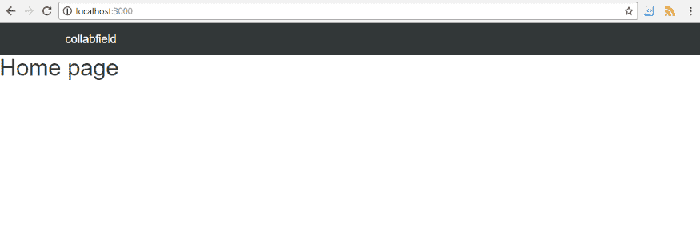**

**提交更改:**

```
`git add -A
git commit -m "Add margin-top 50px to the body"`
```

**如您所知，我们之前已经创建了一个新分支并切换到它。是时候回`master`分公司了。**

**运行命令:**

```
`git branch`
```

**您可以看到我们的分支机构列表。目前我们在`styles`分部。**

**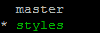**

**要切换回`master`分支，运行:**

```
`git checkout master`
```

**要合并我们在`styles`分支中所做的所有更改，只需运行:**

```
`git merge styles`
```

**该命令合并了这两个分支，现在我们可以看到我们所做更改的摘要。**

**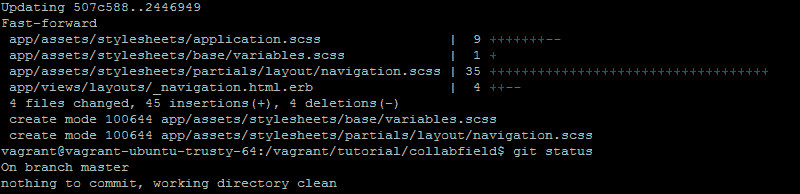**

**我们不再需要`styles`分支，所以我们可以删除它:**

```
`git branch -D styles`
```

## **邮件**

**现在差不多是开始实现文章功能的时候了。由于我们的应用程序目标是让用户遇到志同道合的人，我们必须确保帖子的作者可以被识别。为了实现这一点，需要认证系统。**

### **证明**

**对于认证系统，我们将使用[设计 gem](https://github.com/plataformatec/devise) 。我们可以创建自己的认证系统，但这需要付出很多努力。我们将选择一条更容易的路线。这也是 Rails 社区的一个流行选择。**

**首先创建一个新分支:**

```
`git checkout -b authentication`
```

**就像任何其他 gem 一样，要设置它，我们将遵循它的文档。幸运的是，它非常容易设置。**

**添加到您的`Gemfile`**

```
`gem 'devise'`
```

**然后运行命令:**

```
`bundle install
rails generate devise:install`
```

**您可能会在命令提示符下看到一些说明。我们不会在本教程中使用邮件程序，所以不需要进一步的配置。**

**此时，如果您对 Rails 模型一无所知，您应该通过浏览[活动记录](http://guides.rubyonrails.org/active_record_basics.html)和[活动模型](http://guides.rubyonrails.org/active_model_basics.html)文档来熟悉它们。**

**现在让我们使用一个设计生成器来创建一个`User`模型。**

```
`rails generate devise User`
```

**通过运行以下命令初始化应用程序的数据库:**

```
`rails db:create`
```

**然后运行以下命令在数据库中创建新表:**

```
`rails db:migrate`
```

**就是这样。从技术上讲，我们的认证系统已经建立。现在我们可以使用设计给定的方法和创建新的用户。提交更改:**

```
`git add -A
git commit -m "Add and configure the Devise gem"`
```

**通过安装 Devise gem，我们不仅获得了后端功能，还获得了默认视图。如果您通过运行以下命令列出您的路线:**

```
`rails routes`
```

**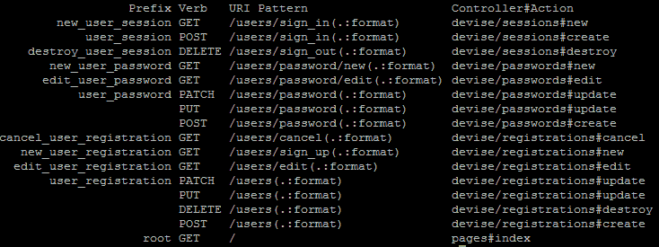**

**你可以看到现在你有一堆新的路线。请记住，到目前为止，我们只有一个根路由。如果有些事情看起来令人困惑，你可以随时打开[设计文档](https://github.com/plataformatec/devise/wiki)并得到你的答案。也不要忘记，很多同样的问题也会出现在其他人的脑海中。你也很有可能通过谷歌搜索找到答案。**

**试试那些路线。进入[localhost:3000/users/sign _ in](http://localhost:3000/users/sign_in)，你应该会看到一个登录页面。**

**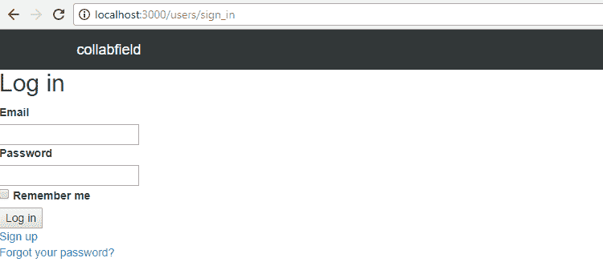**

**如果你进入[localhost:3000/users/sign _ up](http://localhost:3000/users/sign_up)，你也会看到一个注册页面。该死的。正如诺布.诺布所说。如果您查看`views`目录，您会发现没有任何我们可以修改的设备目录。正如 Devise docs 所说，为了修改 device 视图，我们必须用 devise generator 来生成它。奔跑**

```
`rails generate devise:views`
```

**如果您检查`views`目录，您将会在里面看到一个生成的设备目录。在这里，我们可以修改注册和登录页面的外观。让我们从登录页面开始，因为在我们的例子中，这将是一个更简单的实现。注册页面，由于我们想要的功能，将需要额外的努力。**

****登录页面****

**导航并打开`app/views/devise/sessions/new.html.erb`。**

**这是存储登录页面视图的地方。文件里只有一个登录表单。您可能已经注意到，`[form_for](http://api.rubyonrails.org/v5.1/classes/ActionView/Helpers/FormHelper.html)`方法用于生成这个表单。这是一种方便的生成表单的 Rails 方法。我们将使用 bootstrap 修改这个表单的样式。将所有文件内容替换为:**

```
`<%= bootstrap_form_for(resource, 
                       as: resource_name, 
                       url: session_path(resource_name)) do |f| %>

    <%= f.email_field :email, 
                      autofocus: true, 
                      class: 'form-control', 
                      placeholder: 'email' %>

    <%= f.password_field  :password, 
                          autocomplete: "off", 
                          class: 'form-control',
                          placeholder: 'password' %>

  <% if devise_mapping.rememberable? -%>
     <%= f.check_box :remember_me %>
  <% end -%>

   <%= f.submit "Log in", class: 'form-control login-button' %>
<% end %>`
```

**views/devise/sessions/new.html.erb**

**这里没有什么新奇的东西。我们只是通过将方法的名称改为`bootstrap_form_for`并将`form-control`类添加到字段中，将这个表单修改为一个引导表单。**

**看看方法内部的参数是如何设计的。每个参数都从新一行开始。我这样做的原因是为了避免代码行太长。通常代码行不应该超过 80 个字符，这样可以提高可读性。我们将为指南的其余部分设计这样的代码。**

**如果我们访问[localhost:3000/users/sign _ in](http://localhost:3000/users/sign_in)，我们会看到它给我们一个错误:**

```
`undefined method 'bootstrap_form_for'`
```

**为了在 Rails 中使用 bootstrap 表单，我们必须添加一个 [bootstrap_form](https://github.com/bootstrap-ruby/rails-bootstrap-forms) gem。将此添加到`Gemfile`**

```
`gem 'bootstrap_form'`
```

**然后运行:**

```
`bundle install`
```

**此时，登录页面应该如下所示:**

**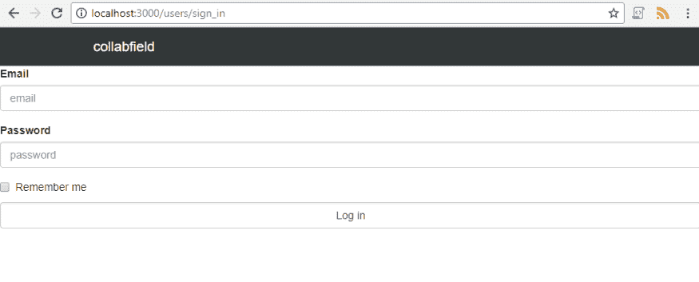**

**提交更改:**

```
`git add -A
git commit -m "Generate devise views, modify sign in form 
and add the bootstrap_form gem."`
```

**为了给页面提供引导的网格系统，用引导容器包装登录表单。**

```
`<div class="container">
  <div class="row">
    <div class="col-sm-6 col-sm-offset-3">
      <h2 class="text-center">Log in</h2>

      <!-- PASTE LOGIN FORM HERE -->

    </div>
  </div> 
</div>`
```

**views/devise/sessions/new.html.erb**

**登录表单的宽度是 12 列中的 6 列。并且偏移量是 3 列。在较小的设备上，窗体将占据整个屏幕的宽度。这就是[引导网格](https://getbootstrap.com/docs/3.3/css/#grid)的工作方式。**

**让我们再做一次提交。很小的变化，是吧？但我通常都是这样提交的。我在一个领域实施明确的改变，然后付诸实施。我认为这样做有助于跟踪变化并理解代码是如何发展的。**

```
`git add -A
git commit -m "wrap login form in the login page with a boostrap container"`
```

**如果我们可以通过进入`/login`而不是`/users/sign_in`来到达登录页面，那就更好了。我们必须改变路线。要做到这一点，我们需要知道当我们进入登录页面时被调用的动作的位置。设计控制器位于宝石内部。通过阅读设计文档，我们可以看到所有的控制器都位于`devise`目录中。老实说，我对这个发现并不感到惊讶。通过使用`devise_scope`方法，我们可以简单地改变路线。转到`routes.rb`文件并添加**

```
`devise_scope :user do
  get 'login', to: 'devise/sessions#new'
end`
```

**提交更改:**

```
`git add -A
git commit -m "change route from /users/sign_in to /login"`
```

**现在，让登录页面保持原样。**

****报名页面****

**如果我们导航到[localhost:3000/users/sign _ up](http://localhost:3000/users/sign_up)，我们会看到默认的设计注册页面。但是如上所述，注册页面将需要一些额外的努力。为什么？因为我们想在`users`表中添加一个新的`:name`列，所以用户对象可以有`:name`属性。**

**我们将要对`schema.rb`文件做一些修改。此时，如果您不太熟悉模式变更和迁移，我建议您通读一下[活动记录迁移](http://guides.rubyonrails.org/active_record_migrations.html)文档。**

**首先，我们必须向`users`表添加一个额外的列。我们可以创建一个新的迁移文件，并使用一个`change_table`方法来添加一个额外的列。但我们只是在开发阶段，我们的应用程序还没有部署。我们可以直接在`devise_create_users`迁移文件中定义一个新列，然后重新创建数据库。导航到`db/migrate`并打开`*CREATION_DATE*_devise_create_users.rb`文件，在`create_table`方法中添加`t.string :name, null: false, default: ""`。**

**现在运行命令来删除和创建数据库，并运行迁移。**

```
`rails db:drop
rails db:create
rails db:migrate`
```

**我们向 users 表中添加了一个新列，并修改了`schema.rb`文件。**

**为了能够发送一个额外的属性，以便设备控制器能够接受它，我们必须在控制器级别做一些更改。我们可以用几种不同的方法来设计控制器。我们可以使用发电机和发电机控制器。或者我们可以创建一个新文件，指定我们想要修改的控制器和方法。两种方式都好。我们将使用后者。**

**导航到`app/controllers`并创建一个新文件`registrations_controller.rb`。将以下代码添加到文件中:**

```
`class RegistrationsController < Devise::RegistrationsController

  private

  def sign_up_params
    params.require(:user).permit( :name, 
                                  :email, 
                                  :password, 
                                  :password_confirmation)
  end

  def account_update_params
    params.require(:user).permit( :name, 
                                  :email, 
                                  :password, 
                                  :password_confirmation, 
                                  :current_password)
  end
end`
```

**controllers/registrations_controller.rb**

**这段代码覆盖了`sign_up_params`和`account_update_params`方法，以接受`:name`属性。如您所见，那些方法在 device`RegistrationsController`中，所以我们指定了它并改变了它的方法。现在，在我们的路由中，我们必须指定这个控制器，所以这些方法可能会被覆盖。内部`routes.rb`发生变化**

```
`devise_for :users`
```

**到**

```
`devise_for :users, :controllers => {:registrations => "registrations"}`
```

**提交更改。**

```
`git add -A
git commit -m "
- Add the name column to the users table. 
- Include name attribute to sign_up_params and account_update_params 
  methods inside the RegistrationsController"`
```

**打开`new.html.erb`文件:**

```
`app/views/devise/registrations/new.html.erb`
```

**同样，删除除表单之外的所有内容。将表单转换为引导表单。这次我们添加了一个额外的名称字段。**

```
`<%= bootstrap_form_for(resource, 
                       :as => resource_name, 
                       :url => registration_path(resource_name)) do |f| %>

  <%= f.text_field :name, 
	           placeholder: 'username (will be shown publicly)', 
	           class: 'form-control' %>
  <%= f.text_field :email, 
	           placeholder: 'email', 
	           class: 'form-control' %>
  <%= f.password_field :password, 
                       placeholder: 'password', 
                       class: 'form-control' %>
  <%= f.password_field :password_confirmation, 
                       placeholder: 'password confirmation', 
                       class: 'form-control' %>
  <%= f.submit 'Sign up', class: 'btn sign-up-button' %>
<% end %>`
```

**views/devise/registrations/new.html.erb**

**提交更改。**

```
`git add -A
git commit -m "
Delete everything from the signup page, except the form. 
Convert form into a bootstrap form. Add an additional name field"`
```

**用引导容器包装表单，并添加一些文本。**

```
`<div class="container" id="sign-up-form">
  <div class="row">
    <h1>Get in touch with like-minded people</h1>
    <h3>Create, study, accomplish goals together</h3>

    <div class="col-sm-offset-4 col-sm-4">
      <h3>Sign up <small>it's free!</small></h3> 

        <!-- PASTE THE FORM HERE -->

    </div>
  </div>
</div>`
```

**views/devise/registrations/new.html.erb**

**提交更改。**

```
`git add -A
git commit -m "
Wrap the sign up form with a bootstrap container. 
Add informational text inside the container"`
```

**就像登录页面一样，如果我们可以通过进入`/signup`而不是`users/sign_up`来打开注册页面，那就更好了。在`routes.rb`文件中添加以下代码:**

```
`devise_scope :user do
  get 'signup', to: 'devise/registrations#new'
end`
```

**提交更改。**

```
`git add -A
git commit -m "Change sign up page's route from /users/sign_up to /signup"`
```

**在我们继续之前，让我们应用一些样式更改。导航到`app/assets/sytlesheets/partials`并创建一个新的`signup.scss`文件。在文件中添加以下 CSS:**

```
`#sign-up-form {
  margin-top: 100px;
  h1 {
    font-size: 36px !important;
    font-size: 3.6rem !important;
  }
  text-align: center;
  padding-bottom: 20px; 
}`
```

**assets/stylesheets/partials/signup.scss**

**此外，我们还没有从`application.scss`文件中的`partials`目录导入文件。让我们现在就做吧。导航到`application.scss`，在`@import partials/layout/*`的正上方，从`partials`目录导入所有文件。`Application.scss`应该是这样的**

```
`...

// Partials - main css files
@import "partials/*";
@import "partials/layout/*";`
```

**assets/stylesheets/application.scss**

**提交更改。**

```
`git add -A
git commit -m "
- Create a signup.scss and add CSS to the sign up page
- Import all files from partials directory to the application.scss"`
```

**给网站的整体外观添加一些其他的风格变化。导航到`app/assets/stylesheets/base`并创建一个新的`default.scss`文件。在文件中添加以下 CSS 代码:**

```
`* {
  box-sizing: border-box;
}

html {
  font-size: 62.5%;
}

body {
  background: $backgroundColor;
  font-size: 14px;
  font-size: 1.4rem;
}

h1 {
  font-size: 24px;
  font-size: 2.4rem;
}

i {
  width: 26px;
}

ul {
  list-style-type: none;
}

a:hover, a:active, a:link, a:visited {
  text-decoration: none;
}

.control-label {
  display: none;
}`
```

**assets/stylesheets/base/default.scss**

**在这里，我们为整个网站应用一些通用的样式变化。`font-size`设置为`62.5%`，所以`1 rem`单位可以代表`10px`。如果你不知道什么是 rem 单位，你可能想看看这个[教程](https://www.sitepoint.com/understanding-and-using-rem-units-in-css/)。我们不想在引导表单上看到标签文本，这就是我们设置它的原因:**

```
`.control-label {
  display: none;
}`
```

**您可能已经注意到使用了`$backgroundColor`变量。但是这个变量还没有设置。因此，让我们打开`variables.scss`文件并添加以下内容:**

```
`$backgroundColor: #f0f0f0;`
```

**`default.scss`文件没有被导入到`application.scss`中。导入下面的变量，`application.scss`文件应该是这样的:**

```
`...

// Variables
@import "base/variables";

// Default styles
@import "base/default";

...`
```

**assets/stylesheets/application.scss**

**提交更改。**

```
`git add -A
git commit -m "
Add CSS and import CSS files inside the main file
- Create a default.scss file and add CSS 
- Define $backgroundColor variable 
- Import default.scss file inside the application.scss"`
```

****导航栏更新****

**现在我们有三个不同的页面:主页、登录和注册。将它们连接在一起是一个好主意，这样用户可以毫不费力地浏览网站。我们将在导航栏上放置注册和登录页面的链接。导航并打开`_navigation.html.erb`文件。**

```
`app/views/layouts/_navigation.html.erb`
```

**我们将在这里添加一些额外的代码。将来我们会在这里添加更多的代码。这将导致文件包含大量代码，难以管理和测试。为了更容易地处理长代码，我们将开始把较大的代码分成较小的块。为了达到这个目的，我们将使用偏导数。在添加额外的代码之前，让我们把当前的`_navigation.html.erb`代码分成几部分。**

**让我快速向您介绍一下我们的导航栏是如何工作的。我们将有两个主要部分。在一个部件上，无论屏幕大小如何，元素将一直显示。在导航栏的另一部分，元素将只在较大的屏幕上显示，并在较小的屏幕上折叠。**

**以下是`.container`元素内部的结构:**

```
`<div class="row">

  <!-- Elements visible all the time -->
  <div class="col-sm-7">
  </div><!-- col-sm-7 -->

  <!-- Elements collapses on smaller devices -->
  <div class="col-sm-5">
  </div><!-- col-sm-5 -->

</div><!-- row -->`
```

**layouts/_navigation_html.erb**

**在布局目录中:**

```
`app/views/layouts`
```

**创建一个新的`navigation`目录。在这个目录中创建一个新的部分`_header.html.erb`文件。**

```
`app/views/layouts/navigation/_header.html.erb`
```

**从`_navigation.html.erb`文件中剪下整个`.navbar-header`部分并粘贴到`_header.html.erb`文件中。在`navigation`目录中，创建另一个名为`_collapsible_elements.html.erb`的部分文件。**

```
`app/views/layouts/navigation/_collapsible_elements.html.erb`
```

**从`_navigation.html.erb`文件中剪下整个`.navbar-collapse`段并粘贴到`_collapsible_elements.html.erb`内。现在让我们在`_navigation.html.erb`文件中渲染这两个部分。文件现在应该是这样的。**

```
`<nav class="navbar navbar-default navbar-fixed-top">
  <div class="container">
    <div class="row">

      <!-- Elements visible all the time -->
      <div class="col-sm-7">
        <%= render 'layouts/navigation/header' %>
      </div><!-- col-sm-7 -->

      <!-- Elements collapses on smaller devices -->
      <div class="col-sm-5">
        <%= render 'layouts/navigation/collapsible_elements' %>
      </div><!-- col-sm-5 -->

    </div><!-- row -->
  </div><!-- container -->
</nav>`
```

**layouts/_navigation_html.erb**

**如果你现在去 [http://localhost:3000](http://localhost:3000/) ，你不会注意到任何区别。我们只是稍微清理了一下代码，为进一步的开发做准备。**

**我们准备向导航栏添加一些链接。导航并再次打开`_collapsible_elements.html.erb`文件:**

```
`app/views/layouts/_collapsible_elements.html.erb`
```

**让我们用链接填充这个文件，将文件的内容替换为:**

```
`<!-- Collect the nav links, forms, and other content for toggling -->
<div class="collapse navbar-collapse navbar-right" id="navbar-collapsible-content">
  <ul class="nav navbar-nav ">
    <% if user_signed_in? %>
      <li class="dropdown pc-menu">
        <a id="user-settings" class="dropdown-toggle" data-toggle="dropdown" href="#">
          <span id="user-name"><%= current_user.name %></span>
          <span class="caret"></span>
        </a>

        <ul class="dropdown-menu" role="menu">
          <li><%= link_to 'Edit Profile', edit_user_registration_path %></li>
          <li><%= link_to 'Log out', destroy_user_session_path, method: :delete %></li>
        </ul>
      </li>

      <li class="mobile-menu">
        <%= link_to 'Edit Profile', edit_user_registration_path %>
      </li>
      <li class="mobile-menu">
        <%= link_to 'Log out', destroy_user_session_path, method: :delete %>
      </li>

    <% else # user not signed it %>
      <li ><%= link_to 'Login', login_path %></li>
      <li ><%= link_to 'Signup', signup_path %></li>
    <% end # if user is signed it %>
  </ul>
</div><!-- navbar-collapse -->`
```

**layouts/navigation/_collapsible_elements.html.erb**

**我给你简单解释一下这是怎么回事。首先，在第二行，我将元素的`id`改为`navbar-collapsible-content`。这是使此内容可折叠所必需的。这是引导程序的功能。默认的`id`是`bs-example-navbar-collapse-1`。为了触发这个函数，在`_header.html`文件中有一个带有`data-target`属性的按钮。打开`views/layouts/navigation/_header.html.erb`，将`data-target`属性改为`data-target="#navbar-collapsible-content"`。现在按钮将触发可折叠的内容。**

**接下来，在`_collapsible_elements.html.erb`文件中你会看到一些带有`user_signed_in?`设计方法的`if else`逻辑。这将根据用户是否登录显示不同的链接。将逻辑(如`if else`语句)留在视图中不是一个好的做法。视图应该是相当“愚蠢”的，只是把信息吐出来，根本没有“思考”。我们将在后面用助手重构这个逻辑。**

**文件中最后要注意的是`pc-menu`和`mobile-menu` CSS 类。这些类的目的是控制链接在不同屏幕尺寸上的显示方式。让我们为这些类添加一些 CSS。导航到`app/assets/stylesheets`并创建一个新目录`responsive`。在目录中创建两个文件，`desktop.scss`和`mobile.scss`。这些文件的目的是为不同的屏幕尺寸提供不同的配置。在`desktop.scss`文件里面添加:**

```
`@media screen and (min-width: 767px) {
  .mobile-menu {
    display: none !important;
  }
}`
```

**assets/styleshseets/responsive/desktop.scss**

**在`mobile.scss`文件内添加:**

```
`@media screen and (max-width: 767px) {
  .pc-menu {
    display: none !important;
  }
}`
```

**assets/styleshseets/responsive/mobile.scss**

**如果你不熟悉 CSS 媒体查询，请阅读[这篇](https://www.w3schools.com/css/css_rwd_mediaqueries.asp)。从`application.scss`文件中的`responsive`目录导入文件。在文件的底部导入它，所以`application.scss`应该是这样的:**

```
`...

// Media queries for a responsive design
@import "responsive/*";`
```

**app/assets/stylesheets/application.scss**

**导航并打开`navigation.scss`文件**

```
`app/assets/stylesheets/partials/layout/navigation.scss`
```

**通过在`nav`元素的选择器中添加以下内容，对导航栏进行一些风格上的调整:**

```
`.col-sm-5, .col-sm-7 {
  padding: 0;
}`
```

**assets/styleshseets/partials/layout/navigation.scss**

**在`nav`元素之外，添加以下 CSS 代码:**

```
`.pc-menu {
  margin-right: 10px;
}

.mobile-menu {
  i {
    color: white;
  }
  ul {
    padding: 0px;
  }
  a {
    display: block;
    padding: 10px 0px 10px 25px !important;
  }
  a:hover {
    background: white !important;
    color: black !important;
    i {
      color: black;
    }
  }
}

.icon-bar {
  background-color: white !important;
}

.active a {
  background: $navbarColor !important;
  border-bottom: solid 5px white;
}

.dropdown-toggle, .dropdown-menu {
  background: $navbarColor !important;
  border: none;
}

.dropdown-menu a:hover {
  color: black !important;
  background: white !important;
}`
```

**assets/styleshseets/partials/layout/navigation.scss**

**此时，当用户未登录时，我们的应用程序应该如下所示:**

**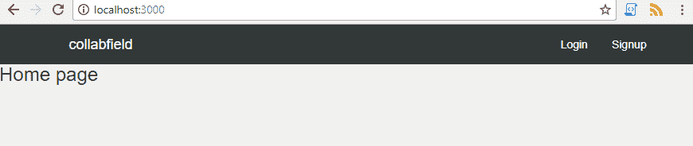**

**当用户登录时，如下所示:**

**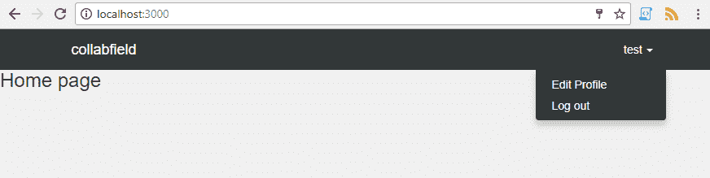**

**当屏幕尺寸更小时，就像这样:**

**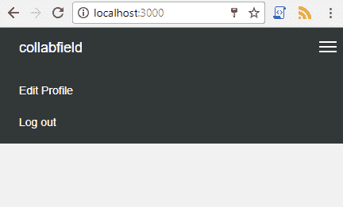**

**提交更改。**

```
`git add -A
git commit -m "
Update the navigation bar
- Add login, signup, logout and edit profile links on the navigation bar 
- Split _navigation.scss code into partials 
- Create responsive directory inside the stylesheets directory and add CSS. 
- Add CSS to tweak navigation bar style"`
```

**现在我们有了一个基本的认证功能。它满足了我们的需求。所以让我们合并`authentication`分支和`master`分支。**

```
`git checkout master
git merge authentication`
```

**我们可以再次看到变化摘要。不再需要身份验证分支，因此将其删除。**

```
`git branch -D authentication`
```

### **助手**

**当我们在处理`_collapsible_elements.html.erb`文件时，我提到 Rails 视图不是逻辑的合适位置。如果您查看项目的`app`目录，您会看到名为`helpers`的目录。我们将从 Rails 视图中提取逻辑，并将其放在`helpers`目录中。**

```
`app/views/pages`
```

**让我们创建我们的第一个助手。首先，创建一个新的分支并切换到它。**

```
`git checkout -B helpers`
```

**导航到`helpers`目录并创建一个新的`navigation_helper.rb`文件**

```
`app/helpers/navigation_helper.rb`
```

**在助手文件中，助手被定义为[模块](https://www.tutorialspoint.com/ruby/ruby_modules.htm)。在`navigation_helper.rb`里面定义模块。**

```
`module NavigationHelper
end`
```

**app/helpers/navigation_helper.rb**

**默认情况下，Rails 会将所有辅助文件加载到所有视图中。我个人不喜欢这样，因为来自不同帮助文件的方法名可能会冲突。要覆盖此默认行为，请打开`application.rb`文件**

```
`config/application.rb`
```

**在`Application`类中添加这个配置**

```
`config.action_controller.include_all_helpers = false`
```

**现在，助手仅适用于相应的控制器视图。因此，如果我们有了`PagesController`,`pages_helper.rb`文件中的所有助手都可以用于`pages`目录中的所有视图文件。**

**我们没有`NavigationController`，所以在`NavigationHelper`模块中定义的助手方法在任何地方都不可用。导航栏在整个网站上都是可用的。我们可以在`ApplicationHelper`中包含`NavigationHelper`模块。如果你不熟悉加载和包含文件，通读这篇[文章](https://prograils.com/posts/ruby-methods-differences-load-require-include-extend)，了解一下将要发生的事情。**

**在`application_helper.rb`文件中，需要`navigation_helper.rb`文件。现在我们可以访问`navigation_helper.rb`文件的内容了。所以让我们用一个`include`方法在`ApplicationHelper`模块中注入`NavigationHelper`模块。`application_helper.rb`应该是这样的:**

```
`require 'navigation_helper.rb'

module ApplicationHelper
  include NavigationHelper
end`
```

**helpers/application_helper.rb**

**现在`NavigationHelper` helper 方法在整个应用程序中都可用。**

**导航并打开`_collapsible_elements.html.erb`文件**

```
`app/views/layouts/navigation/_collapsible_elements.html.erb`
```

**我们将把`if else`语句中的内容分成部分。在`navigation`目录中创建一个新的`collapsible_elements`目录。**

```
`app/views/layouts/navigation/collapsible_elements`
```

**在目录中创建两个文件:`_signed_in_links.html.erb`和`_non_signed_in_links.html.erb`。现在从`_collapsible_elements.html.erb`文件的`if else`语句中剪切内容并粘贴到相应的部分。分音应该是这样的:**

```
`<li class="dropdown pc-menu">
  <a id="user-settings" class="dropdown-toggle" data-toggle="dropdown" href="#">
    <span id="user-name"><%= current_user.name %></span>
    <span class="caret"></span>
  </a>

  <ul class="dropdown-menu" role="menu">
    <li><%= link_to 'Edit Profile', edit_user_registration_path %></li>
    <li><%= link_to 'Log out', destroy_user_session_path, method: :delete %></li>
  </ul>
</li>

<li class="mobile-menu">
  <%= link_to 'Edit Profile', edit_user_registration_path %>
</li>
<li class="mobile-menu">
  <%= link_to 'Log out', destroy_user_session_path, method: :delete %>
</li>`
```

**layouts/navigation/collapsible_elements/_signed_in_links.html.erb**

```
`<li ><%= link_to 'Login', login_path %></li>
<li ><%= link_to 'Signup', signup_path %></li>`
```

**layouts/navigation/collapsible_elements/_non_signed_in_links.html.erb**

**现在在`_collapsible_elements.html.erb`文件中，代替`if else`语句，添加带有`collapsible_links_partial_path`辅助方法的`render`方法作为参数。该文件应该如下所示**

```
`<!-- Collect the nav links, forms, and other content for toggling -->
<div class="collapse navbar-collapse navbar-right" id="navbar-collapsible-content">
  <ul class="nav navbar-nav ">
    <%= render collapsible_links_partial_path %>
  </ul>
</div><!-- navbar-collapse -->`
```

**layouts/navigation/_collapsible_elements.html.erb**

**`collapsible_links_partial_path`是我们将要在`NavigationHelper`中定义的方法。打开`navigation_helper.rb`**

```
`app/helpers/navigation_helper.rb`
```

**并在模块内部定义方法。`navigation_helper.rb`文件应该是这样的:**

```
`module NavigationHelper

  def collapsible_links_partial_path
    if user_signed_in?
      'layouts/navigation/collapsible_elements/signed_in_links'
    else
      'layouts/navigation/collapsible_elements/non_signed_in_links'
    end
  end

end`
```

**app/helpers/navigation_helper.rb**

**定义的方法非常简单。如果用户已登录，则返回相应的部分路径。如果用户未登录，则返回另一个部分路径。**

**我们已经创建了第一个助手方法，并从视图中提取逻辑到一个助手方法中。在本指南的其余部分中，每当我们在视图文件中遇到逻辑时，我们都会这样做。通过这样做，我们对自己有利，测试和管理应用程序变得更加容易。**

**该应用程序应该看起来和功能相同。**

**提交更改。**

```
`git add -A
git commit -m "Configure and create helpers
- Change include_all_helpers config to false 
- Split the _collapsible_elements.html.erb file's content into 
  partials and extract logic from the file into partials"`
```

**将`helpers`分支与`master`分支合并**

```
`git checkout master
git merge helpershttps://gist.github.com/domagude/419bba70cb97e27f4ea04fe37820194a#file-rails_helper-rb`
```

### **测试**

**此时，应用程序具有一些功能。尽管还没有很多功能，但如果我们想确保一切正常，我们已经不得不花一些时间手动测试应用程序。想象一下，如果应用程序拥有比现在多 20 倍的功能。每当我们做代码变更时，检查每件事都工作正常是多么令人沮丧。为了避免这种挫折和数小时的手工测试，我们将实现[自动化测试](https://en.wikipedia.org/wiki/Test_automation)。**

**在进入测试写作之前，请允许我向你介绍我是如何测试的以及测试的内容。你也可以通读[测试 Rails 应用的指南](http://guides.rubyonrails.org/testing.html)来熟悉默认的 Rails 测试技术。**

****我用来测试的东西****

*   ******框架:**** [RSpec](https://relishapp.com/rspec/) 当我开始测试我的 Rails 应用时，我使用的是默认的 [Minitest](http://guides.rubyonrails.org/testing.html#rails-meets-minitest) 框架。现在我用 RSpec。我不认为这里有好的或坏的选择。两个框架都很棒。我觉得这要看个人喜好，用哪个框架。我听说 RSpec 是 Rails 社区中的一个流行选择，所以我决定尝试一下。现在大部分时间都在用。**
*   ******样本数据:****[factory _ girl](https://github.com/thoughtbot/factory_girl)**再次，首先我尝试了默认的 Rails 方式——[夹具](http://guides.rubyonrails.org/testing.html#the-low-down-on-fixtures)，来添加样本数据。我发现这与测试框架的情况不同。选择哪种测试框架，大概是个人喜好吧。在我看来，样本数据并非如此。起初，固定装置还不错。但我注意到，当应用程序变大后，用 fixtures 控制样本数据变得很困难。也许我用错了方法。但是有了工厂，一切立刻变得美好而平静。无论一个应用程序是大是小，设置样本数据的工作量都是一样的。****
*   ********验收测试:**** [水豚](https://github.com/teamcapybara/capybara)默认情况下水豚使用 rack_test 驱动。不幸的是，这个驱动程序不支持 JavaScript。我没有选择默认的 Capybara 驱动程序，而是选择使用 [poltergeist](https://github.com/teampoltergeist/poltergeist) 。它支持 JavaScript，对我来说，它是最容易安装的驱动程序。****

****我考什么****

**我测试所有我写的逻辑。可能是:**

*   **助手**
*   **模型**
*   **乔布斯**
*   **设计模式**
*   **我写的其他逻辑吗**

**除了逻辑之外，我还用水豚对我的应用进行了验收测试，通过模拟用户的交互来确保所有应用的功能都正常工作。同样为了帮助我的模拟测试，我使用[请求测试](https://relishapp.com/rspec/rspec-rails/docs/request-specs/request-spec)来确保所有的请求都返回正确的响应。**

**这是我在个人应用中测试的，因为它完全满足了我的需求。显然，测试标准因人而异，因公司而异。**

**控制器，视图和宝石没有被提及，为什么？正如许多 Rails 开发人员所说，控制器和视图不应该包含任何逻辑。我同意他们的观点。在这种情况下，没有什么可测试的。在我看来，对于视图和控制器来说，用户模拟测试已经足够且高效。宝石已经被它们的创造者检验过了。所以我认为模拟测试足以确保 gems 也能正常工作。**

****我如何测试****

**当然，只要有可能，我都会尝试使用 TDD 方法。首先编写一个测试，然后实现代码。在这种情况下，开发流程变得更加顺畅。但是，有时您不确定完成的功能看起来会是什么样子，以及会有什么样的输出。您可能正在试验代码，或者只是尝试不同的实现解决方案。因此，在这些情况下，先测试后实现的方法实际上不起作用。**

**在我编写每一个逻辑之前(有时是之后，如上所述)，我都会为它编写一个独立的测试，也称为单元测试。为了确保一个应用程序的每个功能都能工作，我用水豚编写了接受度(用户模拟)测试。**

****设置测试环境****

**在我们编写第一个测试之前，我们必须配置测试环境。**

**打开`Gemfile`并将那些宝石添加到测试组**

```
`gem 'rspec-rails', '~> 3.6'
gem 'factory_girl_rails'
gem 'rails-controller-testing'
gem 'headless'
gem 'capybara'
gem 'poltergeist'
gem 'database_cleaner'`
```

**如上所述，`rspec` gem 是一个测试框架，`factory_girl`用于添加样本数据，`capybara`用于模拟用户与应用的交互，`poltergeist` driver 为您的测试提供 JavaScript 支持。**

**如果更容易设置的话，你可以使用另一个支持 JavaScript 的驱动程序。如果你决定使用`poltergeist` gem，你将需要安装 PhantomJS。要安装幻想曲，请阅读[闹鬼文件](https://github.com/teampoltergeist/poltergeist)。**

**要求 gem 支持无头驱动程序。`poltergeist`是个无头司机，这就是我们需要这个宝石的原因。`rails-controller-testing`当我们用[请求规格](https://relishapp.com/rspec/rspec-rails/docs/request-specs/request-spec)测试请求和响应时，将需要 gem。稍后会详细介绍。**

**在执行了 JavaScript 的测试之后，需要使用`database_cleaner`来清理测试数据库。通常情况下，测试数据库会在每次测试后自动清理，但是当您测试包含一些 JavaScript 的特性时，数据库不会自动清理。将来可能会改变，但是在编写本教程的时候，在用 JavaScript 执行测试之后，测试数据库不会自动清理。这就是为什么我们必须手动配置我们的测试环境，以便在每次 JavaScript 测试之后清理测试数据库。我们稍后将配置何时运行`database_cleaner` gem。**

**现在，当这些 gem 的目的被涵盖后，让我们通过运行以下命令来安装它们:**

```
`bundle install`
```

**要为 RSpec 框架初始化`spec`目录，请运行以下命令:**

```
`rails generate rspec:install`
```

**一般来说，spec 是指 RSpec 框架中的单个测试。当我们运行我们的规格，这意味着我们运行我们的测试。**

**如果查看`app`目录，您会注意到一个名为`spec`的新目录。这是我们将要编写测试的地方。你可能也注意到了一个叫做`test`的目录。当您使用默认测试配置时，这是存储测试的地方。我们根本不会使用这个目录。你可以简单地从项目 c(x_X)b 中删除它。**

**如上所述，我们必须为包含 JavaScript 的测试设置`database_cleaner`。打开`rails_helper.rb`文件**

```
`spec/rails_helper.rb`
```

**改变这条线**

```
`config.use_transactional_fixtures = true`
```

**到**

```
`config.use_transactional_fixtures = false`
```

**并在它下面添加以下代码:**

```
 `config.before(:suite) do
    DatabaseCleaner.clean_with(:truncation)
  end

  config.before(:each) do
    DatabaseCleaner.strategy = :transaction
  end

  config.before(:each, :js => true) do
    DatabaseCleaner.strategy = :truncation
  end

  config.before(:each) do
    DatabaseCleaner.start
  end

  config.after(:each) do
    DatabaseCleaner.clean
  end` 
```

**spec/rails_helper.rb**

**我从这个[教程](http://www.virtuouscode.com/2012/08/31/configuring-database_cleaner-with-rails-rspec-capybara-and-selenium/)中摘录了这段代码。**

**我们要做的最后一件事是添加一些配置。在`rails_helper.rb`文件的配置中，添加以下几行**

```
 `require 'capybara/poltergeist'
  require 'factory_girl_rails'
  require 'capybara/rspec'

  config.include Devise::Test::IntegrationHelpers, type: :feature
  config.include FactoryGirl::Syntax::Methods
  Capybara.javascript_driver = :poltergeist
  Capybara.server = :puma` 
```

**spec/rails_helper.rb**

**让我们稍微分解一下代码。**

**使用`require`方法，我们从新添加的 gems 中加载文件，所以我们可以使用下面的方法。**

```
`config.include Devise::Test::IntegrationHelpers, type: :feature`
```

**这种配置允许我们在`capybara`测试中使用`devise`方法。我是怎么想出这句台词的？这是在[设计文件](https://github.com/plataformatec/devise)中提供的。**

```
`config.include FactoryGirl::Syntax::Methods`
```

**这种配置允许使用`factory_girl` gem 的方法。同样，我在 gem 的文档中找到了这个配置。**

```
`Capybara.javascript_driver = :poltergeist 
Capybara.server = :puma`
```

**为了能够用`capybara`测试 JavaScript，这两个配置是必需的。当你想实现一些你不知道如何实现的东西时，总是先阅读文档。**

**我之所以一次向您介绍大多数测试工具和配置，而不是在我们遇到特定问题时逐步介绍，是为了让您清楚地了解我使用什么来进行测试。现在，您可以随时回到这一部分，在一个地方检查大多数配置。而不是从一个地方跳到另一个地方，把具有类似拼图块的配置的宝石放在一起。**

**让我们提交更改，并最终用测试来弄脏我们的手。**

```
`git add -A
git commit -m "
Set up the testing environment
- Remove test directory
- Add and configure rspec-rails, factory_girl_rails, 
  rails-controller-testing, headless, capybara, poltergeist,
  database_cleaner gems"`
```

****助手规格****

**关于每种规格(测试)，你可以通过阅读 [rspec 文档](https://relishapp.com/rspec)及其 [gem 文档](https://github.com/rspec/rspec-rails)找到一般信息。两者非常相似，但你可以找到彼此之间的一些差异。**

**创建并切换到新分支:**

```
`git checkout -b specs`
```

**到目前为止，我们只创建了一个 helper 方法。我们来测试一下。**

**导航到`spec`目录 an[https://gist . github . com/DOMA gude/3c 42 ba 6 CCF 31 BF 1c 50588 c 59277 a 9146 # file-navigation _ helper _ spec-Rb](https://gist.github.com/domagude/3c42ba6ccf31bf1c50588c59277a9146#file-navigation_helper_spec-rb)d 新建一个名为`helpers`的目录。**

```
`spec/helpers`
```

**在目录中，创建一个新文件`navigation_helper_spec.rb`**

```
`spec/helpers/navigation_helper_spec.rb`
```

**在该文件中，编写以下代码:**

```
`require 'rails_helper'

RSpec.describe NavigationHelper, :type => :helper do

end`
```

**spec/helpers/navigation_helper_spec.rb**

**`require ‘rails_helper'`让我们能够访问所有测试配置和方法。将我们的测试视为辅助规范，并为我们提供具体的方法。**

**这就是在测试`collapsible_links_partial_path`方法时，`navigation_helper_spec.rb`文件应该看起来的样子。**

```
`require 'rails_helper'

RSpec.describe NavigationHelper, :type => :helper do

  context 'signed in user' do
    before(:each) { helper.stub(:user_signed_in?).and_return(true) }

    context '#collapsible_links_partial_path' do
      it "returns signed_in_links partial's path" do
        expect(helper.collapsible_links_partial_path).to (
          eq 'layouts/navigation/collapsible_elements/signed_in_links'
        )
      end
    end
  end

  context 'non-signed in user' do
    before(:each) { helper.stub(:user_signed_in?).and_return(false) }

    context '#collapsible_links_partial_path' do
      it "returns non_signed_in_links partial's path" do
        expect(helper.collapsible_links_partial_path).to (
          eq 'layouts/navigation/collapsible_elements/non_signed_in_links'
        )
      end
    end
  end

end`
```

**spec/helpers/navigation_helper_spec.rb**

**要了解关于`context`和`it`的更多信息，请阅读[基本结构](https://relishapp.com/rspec/rspec-core/v/3-6/docs/example-groups/basic-structure-describe-it)文档。这里我们测试两种情况——用户登录时和用户未登录时。在`signed in user`和`non-signed in user`的每个上下文中，我们在钩子之前有[。在相应的上下文中，这些钩子(方法)在我们的每个测试之前运行。在我们的例子中，在每次测试之前，我们运行](https://relishapp.com/rspec/rspec-core/v/2-0/docs/hooks/before-and-after-hooks)[存根](https://relishapp.com/rspec/rspec-mocks/v/2-4/docs/method-stubs/stub-with-a-simple-return-value)方法，因此`user_signed_in?`返回我们告诉它返回的任何值。**

**最后，使用 [expect](https://relishapp.com/rspec/rspec-expectations/docs/built-in-matchers) 方法，我们检查当我们调用`collapsible_links_partial_path`方法时，我们得到了一个预期的返回值。**

**要运行所有测试，只需运行:**

```
`rspec spec`
```

**要专门运行`navigation_helper_spec.rb`文件，请运行:**

```
`rspec spec/helpers/navigation_helper_spec.rb`
```

**如果测试通过，输出应该如下所示:**

**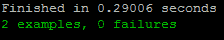**

**提交更改。**

```
`git add -A
git commit -m "Add specs to NavigationHelper's collapsible_links_partial_path method"`
```

****工厂****

**接下来，我们需要一些样本数据来执行我们的测试。无论何时我们需要，gem 都能让我们非常容易地添加样本数据。此外，它提供了高质量的文档，所以它使整体体验相当愉快。到目前为止，我们可以用我们的应用程序创建的唯一对象是`User`。为了定义用户工厂，在`spec`目录中创建一个`factories`目录。**

```
`spec/factories`
```

**在工厂目录中创建一个新文件 users.rb，并添加以下代码:**

```
`FactoryGirl.define do 
  factory :user do
    sequence(:name) { |n| "test#{n}" }
    sequence(:email) { |n| "test#{n}@test.com" }
    password '123456'
    password_confirmation '123456'
  end
end`
```

**spec/factories/users**

**现在，在我们的规范中，我们可以使用`factory_girl` gem 的方法，在需要的时候，在测试数据库中轻松地创建新用户。关于如何定义和使用工厂的全面指南，请查看`factory_girl` gem 的文档。**

**我们定义的工厂`user`非常简单。我们定义了值，`user`对象就会有。我们也使用了`sequence`方法。通过阅读文档，您可以看到每增加一条`User`记录，`n`值就会增加 1。即第一个创建的用户名将是`test0`，第二个将是`test1`，依此类推。**

**提交更改**

```
`git add -A
git commit -m "add a users factory"`
```

****功能规格****

**在[功能规格](https://relishapp.com/rspec/rspec-rails/docs/feature-specs/feature-spec)中，我们编写代码来模拟用户与应用程序的交互。特征规格由`capybara`宝石驱动。**

**好消息是，我们已经做好了一切准备，可以开始编写我们的第一个特性规范了。我们将测试登录、注销和注册功能。**

**在`spec`目录中，创建一个名为`features`的新目录。**

```
`spec/features`
```

**在`features`目录中，创建另一个名为`user`的目录。**

```
`spec/features/user`
```

**在`user`目录中，创建一个名为`login_spec.rb`的新文件**

**这就是登录测试的样子:**

```
`require "rails_helper"

RSpec.feature "Login", :type => :feature do
  let(:user) { create(:user) }

  scenario 'user navigates to the login page and succesfully logs in', js: true do
    user
    visit root_path
    find('nav a', text: 'Login').click
    fill_in 'user[email]', with: user.email
    fill_in 'user[password]', with: user.password
    find('.login-button').click
    expect(page).to have_selector('#user-settings')
  end

end`
```

**spec/features/user/login_spec.rb**

**使用这段代码，我们模拟了从主页开始对登录页面的访问。然后我们填写表格并提交。最后，我们检查导航栏上是否有`#user-settings`元素，它只对登录的用户可用。**

**`feature`和`scenario`是水豚语法的一部分。`feature`与`context` / `describe`相同，`scenario`与`it`相同。你可以在水豚的文档中找到更多信息，[使用水豚与 Rspec](https://github.com/teamcapybara/capybara#using-capybara-with-rspec) 。**

**方法允许我们编写记忆的方法，我们可以在上下文中的所有规范中使用这些方法，方法是定义好的。**

**在这里，我们也使用我们创建的`users`工厂和`create`方法，它与`factory_girl`宝石一起提供。**

**`js: true`参数允许测试涉及 JavaScript 的功能。**

**和往常一样，要查看测试是否通过，运行一个特定的文件。在这种情况下，它是`login_spec.rb`文件:**

```
`rspec spec/features/user/login_spec.rb`
```

**提交更改。**

```
`git add -A
git commit -m "add login feature specs"`
```

**现在我们可以测试注销功能。在`user`目录中，创建一个名为`logout_spec.rb`的新文件**

```
`spec/features/user/logout_spec.rb`
```

**实现的测试应该如下所示:**

```
`require "rails_helper"

RSpec.feature "Logout", :type => :feature do
  let(:user) { create(:user) }

  scenario 'user successfully logs out', js: true do
    sign_in user
    visit root_path
    find('nav #user-settings').click
    find('nav a', text: 'Log out').click
    expect(page).to have_selector('nav a', text: 'Login')
  end

end`
```

**spec/features/user/logout_spec.rb**

**该代码模拟用户单击注销按钮，然后期望在导航栏上看到未登录用户的链接。**

**`sign_in`方法是 design helper 方法之一。我们之前已经在`rails_helper.rb`文件中包含了这些帮助方法。**

**运行该文件以查看测试是否通过。**

**提交更改。**

```
`git add -A
git commit -m "add logout feature specs"`
```

**我们拥有的最后一个功能是注册新账户的能力。我们来测试一下。在`user`目录中创建一个名为`sign_up_spec.rb`的新文件。包含测试的文件应该是这样的:**

```
`require "rails_helper"

RSpec.feature "Sign up", :type => :feature do
  let(:user) { build(:user) }

  scenario 'user navigates to sign up page and successfully signs up', js: true do
    visit root_path
    find('nav a', text: 'Signup').click
    fill_in 'user[name]', with: user.name
    fill_in 'user[email]', with: user.email
    fill_in 'user[password]', with: user.password
    fill_in 'user[password_confirmation]', with: user.password_confirmation
    find('.sign-up-button').click
    expect(page).to have_selector('#user-settings')
  end

end`
```

**spec/features/user/sign_up_spec.rb**

**我们模拟用户导航到注册页面，填写表单，提交表单，最后，我们期望看到只对登录用户可用的`#user-settings`元素。**

**这里我们使用设计者的`build`方法，而不是`create`。这样，我们就创建了一个新对象，而无需将其保存到数据库中。**

**我们可以运行整个测试套件，看看是否所有测试都成功通过。**

```
`rspec spec`
```

**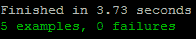**

**提交更改。**

```
`git add -A
git commit -m "add sign up features specs"`
```

**我们完成了第一次测试。所以让我们合并`specs`分支和`master`。**

```
`git checkout master
git merge specs`
```

**不再需要 Specs 分支。删了它 q__o。**

```
`git branch -D specs`
```

### **主馈线**

**在主页上，我们将创建一个帖子提要。这个 feed 将以卡片格式显示所有类型的帖子。**

**首先创建一个新分支:**

```
`git checkout -b main_feed`
```

**生成一个名为`Post`的新模型。**

```
`rails g model post`
```

**然后我们需要一个`Category`模型来对帖子进行分类:**

```
`rails g model category`
```

**现在让我们在`User`、`Category`和`Post`模型之间建立一些联系。**

**每个帖子都属于一个类别和它的作者(用户)。打开模型文件并添加关联。**

```
`class Post < ApplicationRecord
  belongs_to :user
  belongs_to :category
end
class User < ApplicationRecord
  ...
  has_many :posts, dependent: :destroy       
end

class Category < ApplicationRecord
  has_many :posts
end`
```

**`dependent: :destroy`参数表示，当用户被删除时，用户创建的所有帖子也将被删除。**

**现在，我们必须在迁移文件中定义数据列和关联。**

```
`class CreatePosts < ActiveRecord::Migration[5.1]
  def change
    create_table :posts do |t|
      t.string :title
      t.text :content
      t.belongs_to :category, index: true
      t.belongs_to :user, index: true
      t.timestamps
    end
  end
end`
```

**db/migrate/CREATION_DATE_create_posts.rb**

```
`class CreateCategories < ActiveRecord::Migration[5.1]
  def change
    create_table :categories do |t|
      t.string :name
      t.string :branch
    end
  end
end`
```

**db/migrate/CREATION_DATE_create_categories.rb**

**现在运行迁移文件:**

```
`rails db:migrate`
```

**提交更改:**

```
`git add -A
git commit -m "
- Generate Post and Category models. 
- Create associations between User, Post and Category models. 
- Create categories and posts database tables."`
```

****规格****

**我们可以测试新创建的模型。稍后我们将需要样本数据进行测试。由于一篇文章属于一个类别，我们还需要类别的样本数据来建立关联。**

**在`factories`目录中创建一个`category`工厂。**

```
`FactoryGirl.define do 
  factory :category do
    sequence(:name) { |n| "name#{n}" }
    sequence(:branch) { |n| "branch#{n}" }
  end
end`
```

**spec/factories/categories.rb**

**在`factories`目录中创建一个`post`工厂**

```
`spec/factories/posts.rb`
```

```
`FactoryGirl.define do 
  factory :post do
    title 'a' * 20
    content 'a' * 20
    user
    category
  end
end`
```

**spec/factories/posts.rb**

**正如你所看到的，建立一个工厂协会是非常容易的。我们所要做的就是为`post`工厂建立`user`和`category`关联，就是在`post`工厂里面写工厂的名字。**

**提交更改。**

```
`git add -A
git commit -m "Add post and category factories"`
```

**现在我们将只测试关联，因为这是我们在模型中写的唯一的东西。**

**打开`post_spec.rb`**

```
`spec/models/post_spec.rb`
```

**为关联添加规范，因此文件应该如下所示:**

```
`require 'rails_helper'

RSpec.describe Post, type: :model do
  context 'Associations' do
    it 'belongs_to user' do
      association = described_class.reflect_on_association(:user).macro
      expect(association).to eq :belongs_to
    end

    it 'belongs_to category' do
      association = described_class.reflect_on_association(:category).macro
      expect(association).to eq :belongs_to
    end
  end
end`
```

**spec/models/post_spec.rb**

**我们使用`[described_class](https://relishapp.com/rspec/rspec-core/docs/metadata/described-class)`方法来获取当前上下文的类。这与在这种情况下写`Post`基本相同。然后我们使用`[reflect_on_association](https://apidock.com/rails/v2.3.2/ActiveRecord/Reflection/ClassMethods/reflect_on_association)`方法来检查它是否返回正确的关联。**

**对其他模型进行同样的操作。**

```
`require 'rails_helper'

RSpec.describe Category, type: :model do
  context 'Associations' do
    it 'has_many posts' do
      association = described_class.reflect_on_association(:posts)
      expect(association.macro).to eq :has_many
    end
  end
end`
```

**spec/models/category_spec.rb**

```
`require 'rails_helper'

RSpec.describe User, type: :model do

  context 'Associations' do
    it 'has_many posts' do
      association = described_class.reflect_on_association(:posts)
      expect(association.macro).to eq :has_many
      expect(association.options[:dependent]).to eq :destroy
    end
  end
end`
```

**spec/models/user_spec.rb**

**提交更改。**

```
`git add -A
git commit -m "Add specs for User, Category, Post models' associations"`
```

****首页布局****

**目前主页里面什么都没有，只有虚拟文本“主页”。是时候用 bootstrap 创建它的布局了。打开主页的视图文件`views/pages/index.html.erb`，用以下代码替换文件内容，创建页面布局:**

```
`<div class="container">
  <div class="row">
    <div id="side-menu"  class="col-sm-3">
    </div><!-- side-menu -->

    <div id="main-content" class="col-sm-9">
    </div><!-- main-content -->

  </div><!-- row -->
</div><!-- container -->`
```

**views/pages/index.html.erb**

**现在添加一些 CSS 来定义元素的样式和响应行为。**

**在`stylesheets/partials`目录中创建一个新文件`home_page.scss`**

```
`assets/stylesheets/partials/home_page.scss`
```

**在文件中添加以下 CSS:**

```
`#main-content {
  background: white;
  min-height: 800px;
  margin: 0;
  padding: 10px 0 0 0;
}

#side-menu {
  padding: 0;
  #links-list {
    margin-top: 20px;
    padding: 0;
    font-size: 14px;
    font-size: 1.4rem;
    a {
      display: block;
      padding: 5px 15px;
      margin: 2px 0;
    }
    li {
      min-width: 195px;
      max-width: 195px;
    }
    li, li a {
      color: black;
      text-decoration: none;
    }
    li:hover {
      border-radius: 50px;
      background: $navbarColor;
    }
    li:hover a, li:hover i {
      color: white;
    }
  }
}`
```

**assets/stylesheets/partials/home_page.scss**

**在`mobile.scss`文件的`max-width: 767px`媒体查询内添加:**

```
`#side-menu {
  display: none !important;
}`
```

**assets/stylesheets/responsive/mobile.scss**

**现在，主页在更大的屏幕上应该是这样的**

****

**像这样在小屏幕上**

**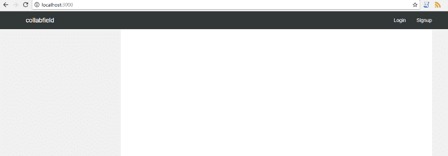**

**提交更改。**

```
`git add -A
git commit -m "
- Add the bootstrap layout to the home page 
- Add CSS to make home page layout's stylistic and responsive design changes"`
```

****种子****

**要在主页上显示文章，首先我们需要将它们放在数据库中。手动创建数据既枯燥又耗时。为了自动化这个过程，我们将使用种子。打开`seeds.rb`文件。**

```
`db/seeds.rb`
```

**添加以下代码:**

```
`def seed_users
  user_id = 0
  10.times do 
    User.create(
      name: "test#{user_id}",
      email: "test#{user_id}@test.com",
      password: '123456',
      password_confirmation: '123456'
    )
    user_id = user_id + 1
  end
end

def seed_categories
  hobby = ['Arts', 'Crafts', 'Sports', 'Sciences', 'Collecting', 'Reading', 'Other']
  study = ['Arts and Humanities', 'Physical Science and Engineering', 'Math and Logic',
          'Computer Science', 'Data Science', 'Economics and Finance', 'Business',
          'Social Sciences', 'Language', 'Other']
  team = ['Study', 'Development', 'Arts and Hobby', 'Other']

  hobby.each do |name|
    Category.create(branch: 'hobby', name: name)
  end

  study.each do |name|
    Category.create(branch: 'study', name: name)
  end

  team.each do |name|
    Category.create(branch: 'team', name: name)
  end
end

def seed_posts
  categories = Category.all

  categories.each do |category|
    5.times do
      Post.create(
        title: Faker::Lorem.sentences[0], 
        content: Faker::Lorem.sentences[0], 
        user_id: rand(1..9), 
        category_id: category.id
      )
    end
  end
end

seed_users
seed_categories
seed_posts`
```

**db/seeds.rb**

**如您所见，我们创建了`seed_users`、`seed_categories`和`seed_posts`方法来在开发数据库中创建`User`、`Category`和`Post`记录。此外, [faker](https://github.com/stympy/faker) gem 用于生成虚拟文本。将`faker`宝石添加到您的`Gemfile`中**

```
`gem 'faker'`
```

**和**

```
`bundle install`
```

**要播种数据，使用`seeds.rb`文件，运行命令**

```
`rails db:seed`
```

**提交更改。**

```
`git add -A
git commit -m "
- Add faker gem 
- Inside the seeds.rb file create methods to generate 
  User, Category and Post records inside the development database"`
```

****渲染帖子****

**为了呈现文章，我们需要在视图中有一个`posts`目录。**

**生成一个名为`Posts`的新控制器，这样它也会在视图中自动创建一个`posts`目录。**

```
`rails g controller posts`
```

**由于在我们的应用程序中,`PagesController`负责主页，我们将需要查询`pages_controller.rb`文件的`index`动作中的数据。在`index`动作中，从`posts`表中检索一些记录。将检索到的记录分配给一个实例变量，这样检索到的对象将在主页的视图中可用。**

*   **如果你不熟悉 ruby 变量，请阅读本[指南](https://www.tutorialspoint.com/ruby/ruby_variables.htm)。**
*   **如果您不熟悉在 Rails 中从数据库中检索记录，请阅读[活动记录查询接口](http://guides.rubyonrails.org/active_record_querying.html)指南。**

**现在的`index`动作应该是这样的:**

```
`def index
  @posts = Post.limit(5)
end`
```

**controllers/pages_controller.rb**

**导航到主页的模板**

```
`views/pages/index.html.erb`
```

**并在`.main-content`元素内添加**

```
`<%= render @posts %>`
```

**这将呈现在`index`动作中检索到的所有帖子。因为`post`对象属于`Post`类，所以 Rails 自动尝试呈现所定位的`_post.html.erb`部分模板**

```
`views/posts/_post.html.erb`
```

**我们还没有创建这个部分文件，所以创建它并在其中添加以下代码:**

```
`<div class="col-sm-3 single-post-card" id=<%= post_path(post.id) %>>
  <div class="card">
    <div class="card-block">
      <h4 class="post-text">
        <%= truncate(post.title, :length => 60) %>
      </h4>
      <div class="post-content">
        <div class="posted-by">Posted by <%= post.user.name %></div>
        <h3><%= post.title %></h3> 
        <p><%= post.content %></p>
        <%= link_to "I'm interested", post_path(post.id), class: 'interested' %>
      </div>
    </div>
  </div><!-- card -->
</div><!-- col-sm-3 -->`
```

**views/posts/_post.html.erb**

**我在这里使用了一个[引导卡](https://v4-alpha.getbootstrap.com/components/card/)组件来实现想要的风格。然后，我将 post 的内容及其路径存储在元素中。我还添加了一个链接，这将导致完整的职位。**

**到目前为止，我们还没有为帖子定义任何路线。我们现在就需要它们，所以让我们声明它们。打开`routes.rb`文件，在 routes 中添加以下代码**

```
`resources :posts do
  collection do
    get 'hobby'
    get 'study'
    get 'team'
  end
end`
```

**routes.rb**

**这里我使用了一个[资源](http://guides.rubyonrails.org/routing.html#resource-routing-the-rails-default)方法来声明`index`、`show`、`new`、`edit`、`create`、`update`和`destroy`动作的路径。然后我声明了一些定制的`collection`路径来访问具有多个`Post`实例的页面。这些页面将专门用于单独的分支，我们稍后将创建它们。**

**重启服务器，进入 [http://localhost:3000](http://localhost:3000/) 。您应该会在屏幕上看到渲染后的帖子。应用程序看起来应该如下所示:**

**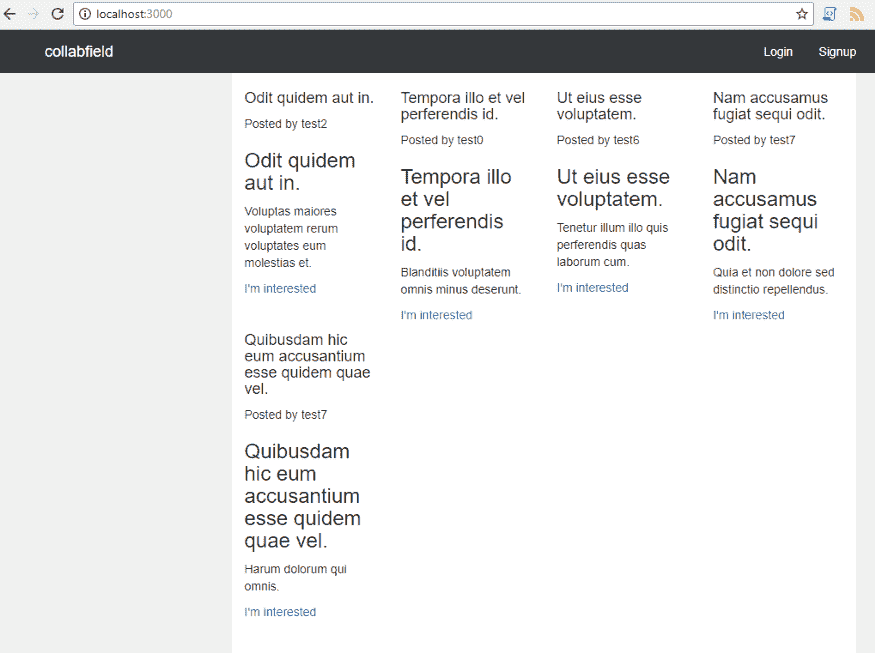**

**提交更改。**

```
`git add -A
git commit -m "Display posts on the home page
- Generate Posts controller and create an index action.
  Inside the index action retrieve Post records
- Declare routes for posts
- Create a _post.html.erb partial inside posts directory
- Render posts inside the home page's main content"`
```

**要开始设计帖子，请在`partials`目录中创建一个新的 scss 文件:**

```
`assets/stylesheets/partials/posts.scss`
```

**并在文件中添加以下 CSS:**

```
`.single-post-card {
  min-height: 135px;
  max-height: 135px;
  box-shadow: 1px 1px 4px rgba(0,0,0, 0.3);
  color: black;
  padding: 10px;
  text-align: left;
  transition: border 0.1s, background 0.5s;
  .post-text {
    overflow: hidden;
  }
  a, a:active, a:hover {
    color: black;
  }
  &:hover {
    cursor: pointer;
    background: white;
    box-shadow: none;
    border-radius: 1%;
  }
}

.post-content {
  display: none;
}` 
```

**assets/stylesheets/partials/posts.scss**

**主页应该类似于以下内容:**

**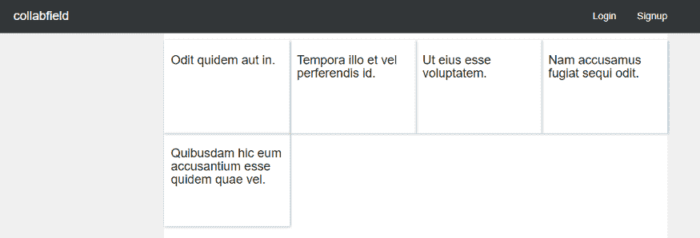**

**提交更改。**

```
`git add -A
git commit -m "Create a posts.scss file and add CSS to it"`
```

****用 JavaScript 设计样式****

**目前，该网站的设计相当单调。为了形成对比，我们要给帖子上色。但是不要仅仅用 CSS 来着色，让我们在每次用户刷新网站时用不同的颜色模式来着色。为此，我们将使用 JavaScript。这可能是一个愚蠢的想法，但它很有趣 c(o_u)？**

**导航到您的`assets`中的`javascripts`目录，并创建一个名为`posts`的新目录。在目录中创建一个名为`style.js`的新文件。如果你愿意，你也可以删除默认生成的`.coffee`，`javascripts`目录下的文件。在本教程中，我们不会使用 CoffeeScript。**

```
`assets/javascripts/posts/style.js`
```

**在`style.js`文件中添加以下代码。**

```
`$(document).on('turbolinks:load', function() {
    if ($(".single-post-card").length) {
        // set a solid background color style
        if (mode == 1) {
            $(".single-post-card").each(function() {
                $(this).addClass("solid-color-mode");
                $(this).css('background-color', randomColor());
            });
        }
        // set a border color style
        else {
            $(".single-post-card").each(function() {
                $(this).addClass("border-color-mode");
                $(this).css('border', '5px solid ' + randomColor());
            });
        }	
    }

    $('#feed').on( 'mouseenter', '.single-post-list', function() {
        $(this).css('border-color', randomColor());	
    });

    $('#feed').on( 'mouseleave', '.single-post-list', function() {
        $(this).css('border-color', 'rgba(0, 0 , 0, 0.05)');	
    });

});

var colorSet = randomColorSet();
var mode = Math.floor(Math.random() * 2);

// Randomly returns a color scheme
function randomColorSet() {
    var colorSet1 = ['#45CCFF', '#49E83E', '#FFD432', '#E84B30', '#B243FF'];
    var colorSet2 = ['#FF6138', '#FFFF9D', '#BEEB9F', '#79BD8F', '#79BD8F'];
    var colorSet3 = ['#FCFFF5', '#D1DBBD', '#91AA9D', '#3E606F', '#193441'];
    var colorSet4 = ['#004358', '#1F8A70', '#BEDB39', '#FFE11A', '#FD7400'];
    var colorSet5 = ['#105B63', '#FFFAD5', '#FFD34E', '#DB9E36', '#BD4932'];
    var colorSet6 = ['#04BFBF', '#CAFCD8', '#F7E967', '#A9CF54', '#588F27'];
    var colorSet7 = ['#405952', '#9C9B7A', '#FFD393', '#FF974F', '#F54F29'];
    var randomSet = [colorSet1, colorSet2, colorSet3, colorSet4, colorSet5, colorSet6, colorSet7];
    return randomSet[Math.floor(Math.random() * randomSet.length )];
}

// Randomly returns a color from an array of colors
function randomColor() {
    var color = colorSet[Math.floor(Math.random() * colorSet.length)];
    return color;
}`
```

**assets/javascripts/posts/style.js**

**通过这段代码，我们在浏览器刷新时随机设置了两种风格模式中的一种，方法是给文章添加属性。一种风格只有彩色边框，另一种风格有纯色支柱。随着每次页面的改变和浏览器的刷新，我们也会随机地对文章重新着色。在`randomColorSet()`功能中，您可以看到预定义的配色方案。**

**`mouseenter`和`mouseleave`事件处理程序将在未来被用于特定页面的帖子。这些帖子的风格将与主页上的帖子不同。当你将鼠标悬停在一篇文章上时，它的底部边框的颜色会发生轻微的变化。稍后你会看到这个。**

**提交更改。**

```
`git add -A
git commit -m "Create a style.js file and add js to create posts' style"`
```

**为了补充样式，添加一些 CSS。打开`posts.scss`文件**

```
`assets/stylesheets/partials/posts.scss`
```

**并添加以下 CSS:**

```
`...
.solid-color-mode, .border-color-mode {
  .post-text {
    text-align: center;
  }
}

.solid-color-mode {
  .post-text {
    padding: 10px;
    background-color: white;
    border-radius: 25px;
  }
}

.border-color-mode {
  background-color: white;
}`
```

**assets/stylesheets/partials/posts.scss**

**此外，在`mobile.scss`中添加以下代码，以修复较小屏幕上过大的文本问题:**

```
`@media screen and (max-width: 1000px) {
  .solid-color-mode, .border-color-mode {
    .post-text {
      font-size: 16px;  
    }
  }
}`
```

**assets/stylesheets/responsive/mobile.scss**

**主页现在应该看起来像这样:**

**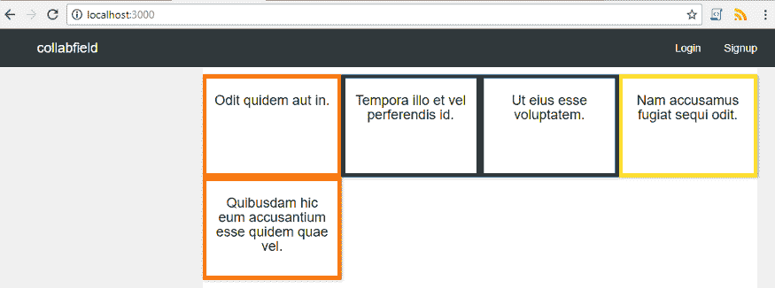****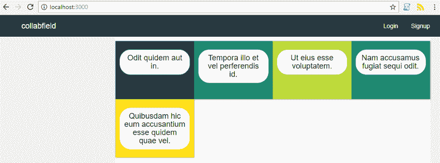****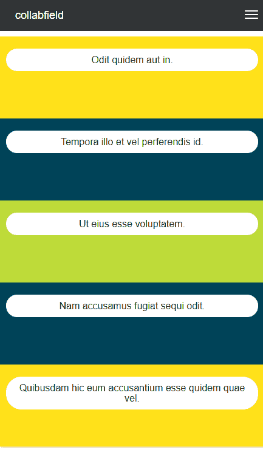**

**提交更改**

```
`git add -A
git commit -m "Add CSS to posts on the home page
- add CSS to the posts.scss file
- add CSS to the mobile.scss to fix too large text issues on smaller screens"`
```

****模态窗口****

**我希望能够点击一个帖子，看到它的完整内容，而不是去另一个页面。为了实现这个功能，我将使用 bootstrap 的[模态组件](https://v4-alpha.getbootstrap.com/components/modal/)。**

**在`posts`目录中，创建一个新的部分文件`_modal.html.erb`**

```
`views/posts/_modal.html.erb`
```

**并添加以下代码:**

```
`<!-- Modal -->
<div  class="modal myModal" 
      tabindex="-1" 
      role="dialog" 
      aria-labelledby="myModalLabel">
  <div class="modal-dialog modal-lg" role="document">
    <div class="modal-content">
      <div class="modal-header">
        <span class="posted-by"></span>
        <button type="button" 
                class="close" 
                data-dismiss="modal" 
                aria-label="Close">
          <span aria-hidden="true">&times;</span>
        </button>
      </div>
        <div class="modal-body">
          <div class="loaded-data">
            <h3></h3>
            <p></p>
            <div class="interested"><a href="">I'm interested</a></div>
          </div><!-- loaded-data -->
        </div><!-- modal-body -->
    </div>
  </div>
</div>`
```

**views/posts/_modal.html.erb**

**这只是一个稍微修改的 bootstrap 组件来完成这个特定的任务。**

**将此部分呈现在主页模板的顶部。**

```
`<%= render 'posts/modal' %>
...`
```

**views/pages/index.html.erb**

**为了使这个模态窗口起作用，我们必须添加一些 JavaScript。在`posts`目录中，创建一个新文件`modal.js`**

```
`assets/javascripts/posts/modal.js`
```

**在该文件中，添加以下代码:**

```
`$(document).on('turbolinks:load', function() {
  // when a post is clicked, show its full content in a modal window
  $("body").on( "click", ".single-post-card, .single-post-list", function() {
    var posted_by = $(this).find('.post-content .posted-by').html();
    var post_heading = $(this).find('.post-content h3').html();
    var post_content = $(this).find('.post-content p').html();
    var interested = $(this).find('.post-content .interested').attr('href');
    $('.modal-header .posted-by').text(posted_by);
    $('.loaded-data h3').text(post_heading);
    $('.loaded-data p').text(post_content);
    $('.loaded-data .interested a').attr('href', interested);
    $('.myModal').modal('show');
  });
});`
```

**assets/javascripts/posts/modal.js**

**使用这个 js 代码，我们只需将选中的 post 数据存储到变量中，并用这些数据填充模式窗口的元素。最后，通过最后一行代码，我们使模式窗口可见。**

**为了增强模式窗口的外观，添加一些 CSS。但是在添加 CSS 之前，让我们在`stylesheets`目录中做一个快速管理任务。**

**在`partials`目录中创建一个名为`posts`的新目录**

```
`assets/stylesheets/partials/posts`
```

**在`posts`目录中创建一个新文件`home_page.scss`。从`posts.scss`文件中剪切所有代码并粘贴到`home_page.scss`文件中。删除`posts.scss`文件。我们这样做是为了更好的 CSS 代码管理。当有几个目的明确的较小的 CSS 文件，而不是一个所有东西都混在一起的大文件时，情况会更清楚。**

**同样在`posts`目录中，创建一个新文件`modal.scss`并添加以下 CSS:**

```
`.modal-content {
  h3 {
    text-align: center;
  }
  p {
    margin: 50px 0;
  }
  .posted-by {
    color: rgba(0,0,0,0.5);
  }
}

.modal-content {
  .loaded-data {
    h3, p {
      overflow: hidden;
    }
    padding: 0 10px;
    .posted-by {
      margin: 0;
    }
  }
}

.interested {
  text-align: center;
  a {
    background-color: $navbarColor;
    padding: 10px;
    color: white;
    border-radius: 10px;
    &:hover {
      background-color: black;
      color: white;
    }
  }
}`
```

**assets/stylesheets/partials/posts/modal.scss**

**现在，当我们单击帖子时，应用程序应该如下所示:**

**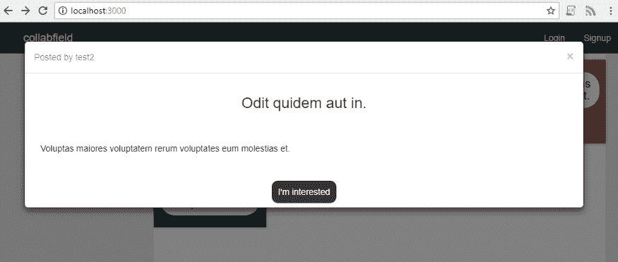**

**提交更改。**

```
`git add -A
git commit -m "Add a popup window to show a full post's content
- Add bootstrap's modal component to show full post's content
- Render the modal inside the home page's template
- Add js to fill the modal with post's content and show it
- Add CSS to style the modal"`
```

**同时将`main_feed`分支与`master`分支合并**

```
`git checkout master
git merge main_feed`
```

**去掉`main_feed`分支**

```
`git branch -D main_feed`
```

****单条帖子****

**切换到新的分支**

```
`git checkout -b single_post`
```

****显示单个帖子****

**如果你试图点击`I'm interested`按钮，你会得到一个错误。我们没有创建`show.html.erb`模板，也没有创建相应的控制器动作。通过点击按钮，我想被重定向到一个选定的职位的页面。**

**在`PostsController`中，创建一个`show`动作，然后在一个实例变量中查询并存储一个特定的 post 对象:**

```
`...
  def show
    @post = Post.find(params[:id])
  end
...`
```

**controllers/posts_controller.rb**

**`I'm interested`按钮重定向到选定的帖子。它有一个带有文章路径的`href`属性。通过发送一个获取 post 的`GET`请求，rails 调用了`show`动作。在`show`动作中，我们可以访问 id 参数，因为通过发送一个`GET`请求来获取一个特定的帖子，我们提供了它的`id`。也就是说，通过进入一个`/posts/1`路径，我们将发送一个请求来获取一个`id`为`1`的帖子。**

**在`posts`目录中创建一个`show.html.erb`模板**

```
`views/posts/show.html.erb`
```

**在文件中添加以下代码:**

```
`<div id="single-post-content" class="container">
  <div class="row">
    <div class="col-sm-6 col-sm-offset-3">
      <div class="posted-by">Posted by <%= @post.user.name %></div>
      <h3><%= @post.title %></h3>
      <p><%= @post.content %></p>
    </div>
  </div><!-- row -->
</div>`
```

**views/posts/show.html.erb**

**在`posts`目录中创建一个`show.scss`文件，并添加 CSS 来设计页面的外观:**

```
`#single-post-content {
  background: white;
  height: calc(100vh - 50px);

  h3 { 
    text-align: center;
  }
  p {
    margin: 50px 0;
  }
  .posted-by {
    font-size: 12px;
    font-size: 1.2rem;
    margin: 20px 0;
    color: rgba(0,0,0,0.5);
  }
}`
```

**assets/stylesheets/partials/posts/show.scss**

**在这里，我将页面的高度定义为`100vh-50px`，因此页面的内容是整个视图的高度。它允许容器在整个浏览器的高度上被涂成白色，不管元素中是否有足够的内容。`vh`属性表示视口的高度，因此`100vh`值表示元素被拉伸视口高度的 100%。`100vh-50px`需要减去导航条的高度，否则容器会被`50px`拉伸太多。**

**如果您现在点击`I'm interested`按钮，您将被重定向到如下页面:**

**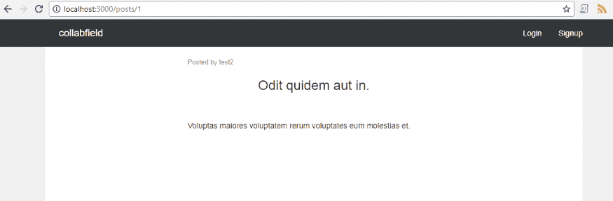**

**稍后我们将向`show.html.erb`模板添加额外的特性。现在提交更改。**

```
`git add -A
git commit -m "Create a show template for posts
- Add a show action and query a post to an instance variable
- Create a show.scss file and add CSS"`
```

****规格****

**不要手动检查这个功能，模态窗口外观和重定向到一个选中的帖子，用规范把它包装起来。我们将使用水豚来模拟用户与应用程序的交互。**

**在`features`目录中，创建名为`posts`的新目录**

```
`spec/features/posts`
```

**在新目录中，创建一个新文件`visit_single_post_spec.rb`**

```
`spec/features/posts/visit_single_post_spec.rb`
```

**并在里面添加一个特性规范。该文件如下所示:**

```
`require "rails_helper"

RSpec.feature "Visit single post", :type => :feature do
  let(:user) { create(:user) }
  let(:post) { create(:post) }

  scenario "User goes to a single post from the home page", js: true do
    post
    visit root_path
    page.find(".single-post-card").click
    expect(page).to have_selector('body .modal')
    page.find('.interested a').click
    expect(page).to have_selector('#single-post-content p', text: post.content)
  end

end`
```

**spec/features/posts/visit_single_post_spec.rb**

**在这里，我定义了我将手动执行的所有步骤。我首先进入主页，点击文章，期望看到弹出的模态窗口，点击`I'm interested`按钮，最后，期望被重定向到文章的页面并看到其内容。**

**默认情况下，RSpec 匹配器有`have_selector`、`have_css`等。如果一个元素实际上对用户可见，则返回 true。所以在点击一篇文章后，测试框架希望看到一个可见的模态窗口。如果你不关心用户是否能看到一个元素，而只关心一个元素在 DOM 中的存在，那么传递一个额外的`visible: false`参数。**

**尝试运行测试**

```
`rspec spec/features/posts/visit_single_post_spec.rb`
```

**提交更改。**

```
`git add -A
git commit -m "Add a feature spec to test if a user can go to a
single post from the home page"`
```

**将`single_post`分支与`master`分支合并。**

```
`git checkout master
git merge single_post
git branch -D single_post`
```

****具体分支****

**每个职位都属于一个特定的分支。让我们为不同的分支创建特定的页面。**

**切换到新的分支**

```
`git checkout -b specific_branches`
```

****首页的侧边菜单****

**从更新主页的侧面菜单开始。添加指向特定分支的链接。打开`index.html.erb`文件:**

```
`views/pages/index.html.erb`
```

**我们将在`#side-menu`元素中放置一些链接。把文件的内容分成几部分，否则会很快变得嘈杂。剪切`#side-menu`和`#main-content`元素，粘贴到单独的部分文件中。在`pages`目录下创建一个`index`目录，并在目录下创建元素对应的部分文件。文件应该如下所示:**

```
`<div id="side-menu"  class="col-sm-3">
</div><!-- side-menu -->`
```

**views/pages/index/_side_menu.html.erb**

```
`<div id="main-content" class="col-sm-9">
  <%= render @posts %>
</div><!-- main-content -->`
```

**views/pages/index/_main_content.html.erb**

**在主页的模板中呈现这些部分文件。该文件应该如下所示:**

```
`<%= render 'posts/modal' %>

<div class="container">
  <div class="row">
    <%= render 'pages/index/side_menu' %>
    <%= render 'pages/index/main_content' %>
  </div><!-- row -->
</div><!-- container -->`
```

**views/pages/index.html.erb**

**提交更改。**

```
`git add -A
git commit -m "Split home page template's content into partials"`
```

**在`the _side_menu.html.erb`里面局部添加一个链接列表，所以文件应该是这样的:**

```
`<div id="side-menu"  class="col-sm-3">
  <ul id="links-list">
    <%= render 'pages/index/side_menu/no_login_required_links' %>
  </ul>
</div><!-- side-menu -->`
```

**views/pages/index/_side_menu.html.erb**

**添加了一个无序列表。在列表中，我们用链接呈现另一个部分。这些链接将对所有用户开放，无论他们是否登录。创建这个部分文件并添加链接。**

**在`index`目录中创建一个`side_menu`目录:**

```
`views/pages/index/side_menu`
```

**在目录中，使用以下代码创建一个`_no_login_required_links.html.erb`分部:**

```
`<li id="hobby">
  <%= link_to hobby_posts_path do %>
    <i class="fa fa-user-circle-o" aria-hidden="true"></i> Find a hobby buddy
  <% end %>
</li>

<li id="study">
  <%= link_to study_posts_path do %>
    <i class="fa fa-graduation-cap" aria-hidden="true"></i> Find a study buddy
  <% end %>
</li>

<li id="team">
  <%= link_to team_posts_path do %>
    <i class="fa fa-users" aria-hidden="true"></i> Find a team member
  <% end %>
</li>`
```

**views/pages/index/side_menu/_no_login_required_links.html.erb**

**在这里，我们简单地添加了特定帖子分支的链接。如果你想知道我们是如何拥有路径的，比如`hobby_posts_path`等。，看`routes.rb`文件。之前我们已经在`resources :posts`声明中添加了嵌套的`collection`路线。**

**如果你注意`i`元素的属性，你会注意到`fa`类。对于这些类，我们声明[字体牛逼](http://fontawesome.io/icons/)图标。我们还没有建立这个图书馆。幸运的是，它非常容易设置。在主`application.html.erb`文件的`head`元素中，添加下面一行**

```
`<link rel="stylesheet" href="https://maxcdn.bootstrapcdn.com/font-awesome/4.7.0/css/font-awesome.min.css">`
```

**侧菜单现在应该出现了。**

****

**提交更改。**

```
`git add -A
git commit -m "Add links to the home page's side menu"`
```

**在较小的屏幕上，宽度在`767px`和`1000px`之间，bootstrap 的容器看起来很不舒服，看起来被过度压缩了。所以在这些宽度中伸展它。在`mobile.scss`文件中，添加以下代码:**

```
`...
@media only screen and (min-width:767px) and (max-width: 1000px) {
  .container {
     width: 100% !important;
  }
}`
```

**assets/stylesheets/responsive/mobile.scss**

**提交更改。**

```
`git add -A
git commit -m "set .container width to 100% 
when viewport's width is between 767px and 1000px"`
```

****分支页面****

**如果你试图点击其中一个侧菜单链接，你会得到一个错误。我们没有在`PostsController`中设置动作，也没有为它创建任何模板。**

**在`PostsController`中，定义`hobby`、`study`和`team`动作。**

```
`...  
  def hobby
    posts_for_branch(params[:action])
  end

  def study
    posts_for_branch(params[:action])
  end

  def team
    posts_for_branch(params[:action])
  end
...`
```

**controllers/posts_controller.rb**

**在每个动作里面，`posts_for_branch`方法被调用。该方法将根据操作的名称返回特定页面的数据。在`private`范围内定义方法。**

```
`...
private

def posts_for_branch(branch)
  @categories = Category.where(branch: branch)
  @posts = get_posts.paginate(page: params[:page])
end
...`
```

**contorllers/posts_controller.rb**

**在`@categories`实例变量中，我们检索特定分支的所有类别。也就是说，如果你进入爱好分支页面，所有属于爱好分支的类别都会被检索出来。**

**为了在`@posts`实例变量中获取和存储文章，使用了`get_posts`方法，然后用`paginate`方法将它链接起来。`paginate`方法来自 [will_paginate](https://github.com/mislav/will_paginate) gem。让我们从定义`get_posts`方法开始。在`PostsController`的`private`范围内添加:**

```
`...
def get_posts
  Post.limit(30)
end
...`
```

**controllers/posts_controller.rb**

**现在`get_posts`方法只是检索任意 30 个帖子，并不针对任何内容，所以我们可以继续前进，专注于进一步的开发。我们将在不久的将来回到这个方法。**

**添加能够使用分页的`will_paginate` gem。**

```
`gem 'will_paginate', '~> 3.1.0'`
```

**奔跑**

```
`bundle install`
```

**我们现在缺的就是模板。它们将与所有分支相似，所以不要重复代码，在每个分支内部，为一个分支创建一个具有一般结构的分部。在`posts`目录中创建一个`_branch.html.erb`文件。**

```
`<div id="branch-main-content" class="container">
  <div class="row">
    <h1 class="page-title"><%= page_title %></h1>
    <%= render 'posts/branch/create_new_post', branch: branch %>
  </div><!-- row -->

  <div class="row">
    <%= render 'posts/branch/categories', branch: branch %>
  </div>

  <div class="row">
    <div class="col-sm-12" id="feed">
      <%= render @posts %>
      <%= render no_posts_partial_path %>		
    </div>
  </div><!-- row -->	

  <div class="infinite-scroll">
    <%= will_paginate @posts %>
  </div>
</div><!-- container -->`
```

**posts/_branch.html.erb**

**首先，您会看到页面上打印了一个`page_title`变量。当我们呈现`_branch.html.erb`部分时，我们将把这个变量作为参数传递。接下来，呈现一个`_create_new_post`片段以显示一个链接，该链接将导致一个页面，用户可以在该页面上创建一个新帖子。在新的`branch`目录中创建这个部分文件:**

```
`<div class="col-sm-12">
  <div class="col-sm-8 col-sm-offset-2">
    <%= render create_new_post_partial_path, branch: branch %>
  </div><!-- col-sm-8 -->	
</div><!-- col-sm-12 -->`
```

**posts/branch/_create_new_post.html.erb**

**这里我们将使用一个`create_new_post_partial_path`辅助方法来决定渲染哪个部分文件。在`posts_helper.rb`文件中，实现方法:**

```
`...  
  def create_new_post_partial_path
    if user_signed_in?
      'posts/branch/create_new_post/signed_in'
    else
      'posts/branch/create_new_post/not_signed_in'
    end
  end
...`
```

**helpers/posts_helper.rb**

**还要在一个新的`create_new_post`目录中创建这两个对应的部分:**

```
`<div class="new-post-button-parent">
  <span>Cannot find anyone? Try to: </span>
  <%= link_to "Create a new post", 
              new_post_path(branch: branch), 
              :class => "new-post-button" %>
</div>`
```

**posts/branch/create_new_post/_signed_in.html.erb**

```
`<div class="text-center login-branch">
  To create a new post you have to 
  <%= link_to 'Login', 
              login_path, 
              class: 'login-button login-button-branch' %>
</div>`
```

**posts/branch/create_new_post/_not_signed_in.html.erb**

**接下来，在`_branch.html.erb`文件中，我们呈现一个类别列表。创建一个`_categories.html.erb`部分文件:**

```
`<% branch_path_name = "#{params[:action]}_posts_path" %>

<div class="col-sm-12">
  <ul class="categories-list">
    <%= render all_categories_button_partial_path, 
               branch_path_name: branch_path_name %>
    <% @categories.each do |category| %>
      <li class="category-item">
        <%= link_to category.name, 
                    send(branch_path_name, category: category.name), 
                    :class => ("selected-item" if params[:category] == category.name) %>
      </li>
    <% end %>
  </ul>
</div><!-- col-sm-12 -->`
```

**posts/branch/_categories.html.erb**

**在文件内部，我们有一个`all_categories_button_partial_path`帮助器方法，它决定呈现哪个部分文件。在`posts_helper.rb`文件中定义这个方法:**

```
`...
   def all_categories_button_partial_path
    if params[:category].blank?
      'posts/branch/categories/all_selected'
    else
      'posts/branch/categories/all_not_selected'
    end
  end
...`
```

**helpers/posts_helper.rb**

**默认情况下，所有类别都会被选中。如果`params[:category]`为空，则意味着用户没有选择任何类别，这意味着当前选择了默认值`all`。创建相应的分部文件:**

```
`<li class="category-item">
  <%= link_to "All", 
              send(branch_path_name), 
              :class => "selected-item"  %>
</li>`
```

**posts/branch/categories/_all_selected.html.erb**

```
`<li class="category-item">
  <%= link_to "All", send(branch_path_name) %>
</li>`
```

**posts/branch/categories/_all_not_selected.html.erb**

**这里使用了 [send](https://apidock.com/ruby/Object/send) 方法，通过使用一个字符串来调用一个方法，这样可以灵活地动态调用方法。在我们的例子中，我们根据当前控制器的动作生成不同的路径。**

**接下来，在`_branch.html.erb`文件中，我们呈现帖子并调用`no_posts_partial_path`辅助方法。如果没有找到帖子，该方法将显示一条消息。**

**在`posts_helper.rb`中添加助手方法:**

```
`...
def no_posts_partial_path
  @posts.empty? ? 'posts/branch/no_posts' : 'shared/empty_partial'
end
...`
```

**helpers/posts_helper.rb**

**这里我使用了一个三进制操作符[，](https://www.w3resource.com/ruby/ruby-ternary-operator.php)，这样代码看起来更干净一些。如果有任何帖子，我不想显示任何消息。因为不能向`render`方法传递空字符串，所以在我不想呈现任何东西的时候，我传递一个空的部分路径。**

**在视图中创建一个`shared`目录，然后创建一个空的部分:**

```
`views/shared/_empty_partial.html.erb`
```

**现在在`branch`目录中为消息创建一个`_no_posts.html.erb`片段。**

```
`<div class="text-center">Currently there are no published posts</div>`
```

**posts/branch/_no_posts.html.erb**

**最后，如果有很多帖子，我们使用 gem 中的`will_paginate`方法将帖子拆分成多个页面。**

**为`hobby`、`study`和`team`动作创建模板。在它们内部，我们将呈现`_branch.html.erb`部分文件并传递特定的局部变量。**

```
`<%= render 'posts/modal' %>
<%= render partial: 'posts/branch', locals: { 
    branch: 'hobby',
    page_title: 'Find a person with the same hobby',
    search_placeholder: 'E.g. guitar playing, programming, cooking'
  } %>`
```

**posts/hobby.html.erb**

```
`<%= render 'posts/modal' %>
<%= render partial: 'posts/branch', locals: { 
    branch: 'study',
    page_title: 'Find a person who studies the same field as you',
    search_placeholder: 'E.g. nutrition, calculus, astrophysics'
  } %>`
```

**posts/study.html.erb**

```
`<%= render 'posts/modal' %>
<%= render partial: 'posts/branch', locals: { 
    branch: 'team',
    page_title: 'Find a person with similar interests as yours to your team',
    search_placeholder: 'E.g. musician for a band, developer for a project'
  } %>`
```

**posts/team.html.erb**

**如果你去任何一个分支页面，你会看到这样的内容**

**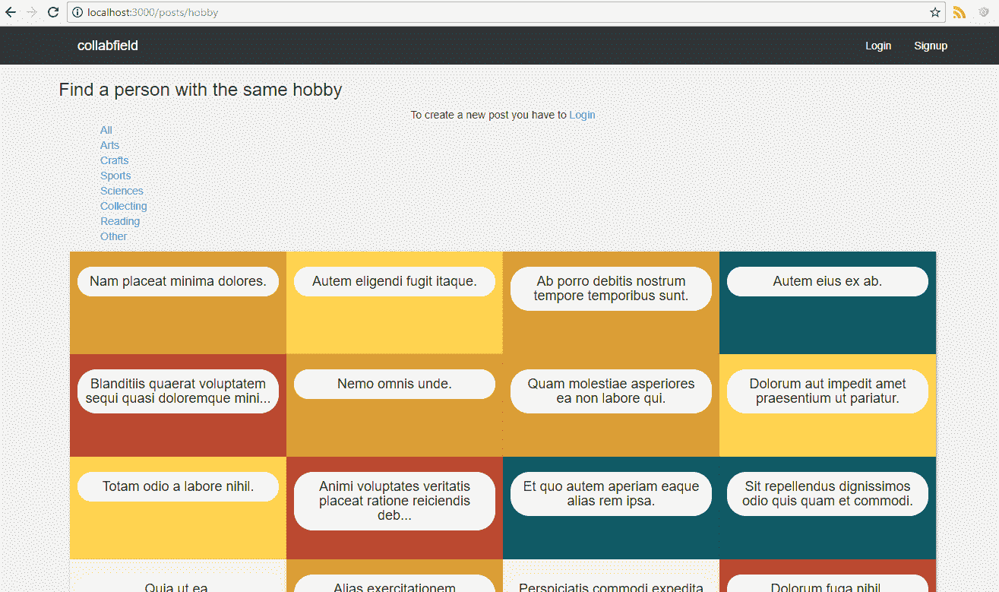**

**此外，如果您向下滚动，您会看到现在我们有一个分页**

**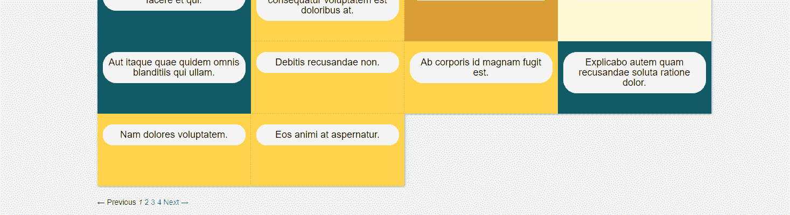**

**我们做了大量的工作来创建这些分支页面。提交更改**

```
`git add -A
git commit -m "Create branch pages for specific posts

- Inside the PostsController define hobby, study and team actions.
  Define a posts_for_branch method and call it inside these actions
- Add will_paginate gem
- Create a _branch.html.erb partial file
- Create a _create_new_post.html.erb partial file
- Define a create_new_post_partial_path helper method
- Create a _signed_in.html.erb partial file
- Create a _not_signed_in.html.erb partial file
- Create a _categories.html.erb partial file
- Define a all_categories_button_partial_path helper method
- Create a _all_selected.html.erb partial file
- Create a _all_not_selected.html.erb partial file
- Define a no_posts_partial_path helper method
- Create a _no_posts.html.erb partial file
- Create a hobby.html.erb template file
- Create a study.html.erb template file
- Create a team.html.erb template file"`
```

****规格****

**用规范覆盖助手方法。`posts_helper_spec.rb`文件应该是这样的:**

```
`require 'rails_helper'

RSpec.describe PostsHelper, :type => :helper do

  context '#create_new_post_partial_path' do
    it "returns a signed_in partial's path" do
      helper.stub(:user_signed_in?).and_return(true)
      expect(helper.create_new_post_partial_path). to (
        eq 'posts/branch/create_new_post/signed_in'
      )
    end

    it "returns a signed_in partial's path" do
      helper.stub(:user_signed_in?).and_return(false)
      expect(helper.create_new_post_partial_path). to (
        eq 'posts/branch/create_new_post/not_signed_in'
      )
    end
  end

  context '#all_categories_button_partial_path' do
    it "returns an all_selected partial's path" do
      controller.params[:category] = ''
      expect(helper.all_categories_button_partial_path).to (
        eq 'posts/branch/categories/all_selected'
      )
    end

    it "returns an all_not_selected partial's path" do
      controller.params[:category] = 'category'
      expect(helper.all_categories_button_partial_path).to (
        eq 'posts/branch/categories/all_not_selected'
      )
    end
  end

  context '#no_posts_partial_path' do
    it "returns a no_posts partial's path" do
      assign(:posts, [])
      expect(helper.no_posts_partial_path).to (
        eq 'posts/branch/no_posts'
      )
    end

    it "returns an empty partial's path" do
      assign(:posts, [1])
      expect(helper.no_posts_partial_path).to (
        eq 'shared/empty_partial'
      )
    end
  end
end`
```

**spec/helpers/posts_helper_spec.rb**

**同样，这里的规格非常简单。我使用了`stub`方法来定义方法的返回值。为了定义参数，我选择了控制器，并简单地将其定义为这样的`controller.params[:param_name]`。最后，我通过使用[赋值](https://relishapp.com/rspec/rspec-rails/docs/helper-specs/helper-spec#helper-method-that-accesses-an-instance-variable)方法给实例变量赋值。**

**提交更改**

```
`git add -A
git commit -m "Add specs for PostsHelper methods"`
```

****设计变更****

**在这些分支页面，我们希望有不同的职位的设计。在主页上，我们有卡片设计。在分支页面中，让我们创建一个列表设计，这样用户就可以看到更多的文章并更有效地浏览它们。**

**在`posts`目录中，创建一个包含`_home_page.html.erb`部分的`post`目录。**

```
`posts/post/_home_page.html.erb`
```

**剪切`_post.html.erb`部分的内容并粘贴到`_home_page.html.erb`部分文件中。在`_post.html.erb`分部文件中添加下面一行代码:**

```
`<%= render post_format_partial_path, post: post %>`
```

**posts/_post.html.erb**

**这里我们调用`post_format_partial_path`帮助器方法，根据当前路径决定呈现哪个 post 设计。如果用户在主页上，呈现主页的文章设计。如果用户在分支页面上，则呈现分支页面的文章设计。这就是为什么我们把`_post.html.erb`文件的内容剪切到`_home_page.html.erb`文件中。**

**在`post`目录中，创建一个新的`_branch_page.html.erb`文件，并粘贴这段代码来定义分支页面的文章设计。**

```
`<div class="single-post-list" id=<%= post_path(post.id) %>>
  <%= truncate(post.title, :length => 60) %>
  <div class="post-content">
    <div class="posted-by">Posted by <%= post.user.name %></div>
    <h3><%= post.title %></h3> 
    <p><%= post.content %></p>
    <%= link_to "I'm interested", post_path(post.id), class: 'interested' %> 
  </div>
</div>`
```

**posts/post/_branch_page.html.erb**

**要决定呈现哪个部分文件，请在`posts_helper.rb`中定义`post_format_partial_path`辅助方法**

```
`def post_format_partial_path
  current_page?(root_path) ? 'posts/post/home_page' : 'posts/post/branch_page'
end`
```

**helpers/posts_helper.rb**

**在主页中,`post_format_partial_path` helper 方法将不可用，因为我们在主页的模板中呈现文章，这属于不同的控制器。要访问这个方法，在主页的模板中，在`ApplicationHelper`中包含`PostsHelper`**

```
`include PostsHelper`
```

****规格****

**为`post_format_partial_path`助手方法添加规范:**

```
`...
context '#post_format_partial_path' do
  it "returns a home_page partial's path" do
    helper.stub(:current_page?).and_return(true)
    expect(helper.post_format_partial_path).to (
      eq 'posts/post/home_page'
    )
  end

  it "returns a branch_page partial's path" do
    helper.stub(:current_page?).and_return(false)
    expect(helper.post_format_partial_path).to (
      eq 'posts/post/branch_page'
    )
  end
end
...`
```

**helpers/posts_helper_spec.rb**

**提交更改**

```
`git add -A
git commit -m "Add specs for the post_format_partial_path helper method"`
```

****CSS****

**用 CSS 描述分支页面中的文章样式。在`posts`目录中，创建一个新的`branch_page.scss`样式表文件:**

```
`.single-post-list {
  min-height: 45px;
  max-height: 45px;
  padding: 10px 20px 10px 0px;
  margin: 0 10px;
  border-bottom: solid 3px rgba(0, 0 , 0, 0.05);
  border-bottom-right-radius: 10%;
  transition: border-color 0.1s;
  overflow: hidden;
  &:hover {
    cursor: pointer;
  }
}

.page-title {
  margin: 30px 0;
  text-align: center;
  background-color: white !important;
  font-weight: bold;
  a {
    color: black;
  }
  a:hover {
    text-decoration: underline;
  }
}

.categories-list {
  margin: 10px 0;
  padding: 0;
}

.category-item {
  display: inline-block;
  margin: 15px 0;
  a {
    font-size: 16px;
    font-size: 1.6rem;
    color: rgba(0,0,0,0.7);
    border: solid 2px rgba(0,0,0,0.4);
    border-radius: 8%;
    padding: 10px;
  }
  a:hover, .selected-item {
    background: $navbarColor;
    color: white;
    border: solid 2px white;
    border-radius: 0px;
  }
}

.new-post-button-parent {
  text-align: right;
  span {
    font-size: 12px;
    font-size: 1.2rem;
  }
}

.new-post-button {
  display: inline-block;
  background: $navbarColor;
  color: white;
  padding: 8px;
  border-radius: 10px;
  font-weight: bold;
  border: solid 2px $navbarColor;
  margin: 10px 0;
  &:hover, &:active, &:focus {
    background: white;
    color: black;
  }
}

.login-branch {
  margin: 10px 0;
}

.login-button-branch {
  padding: 5px 10px;
  border-radius: 10px;
  &:hover, &:active, &:visited, &:link {
    color: white;
  }
}

#branch-main-content {
  background: white;
  height: calc(100vh - 50px);
}

#feed {
  background-color: white;
}`
```

**stylesheets/partials/posts/branch_page.scss**

**`base/default.scss`里面补充:**

```
`...
.login-button, .sign-up-button {
  background-color: $navbarColor;
  color: white !important;
}`
```

**assets/stylesheets/base/default.scss**

**要修复较小设备上的样式问题，请在`responsive/mobile.scss`中添加:**

```
`...
@media screen and (max-width: 550px) {
  .page-title {
      font-size: 20px;
      font-size: 2rem;
  }
  .new-post-button-parent {
    text-align: center;
    span {
      display: none !important;
    }
  }
  .post-button {
    padding: 5px;
  }
  .category-item {
    a {
      padding: 5px;
    }
  }
}

@media screen and (max-width: 767px) {
  .single-post-list {
    min-height: 65px;
    max-height: 65px;
    padding: 10px 0;
  }
}
...`
```

**assets/stylesheets/responsive/mobile.scss**

**现在，分支页面应该如下所示:**

**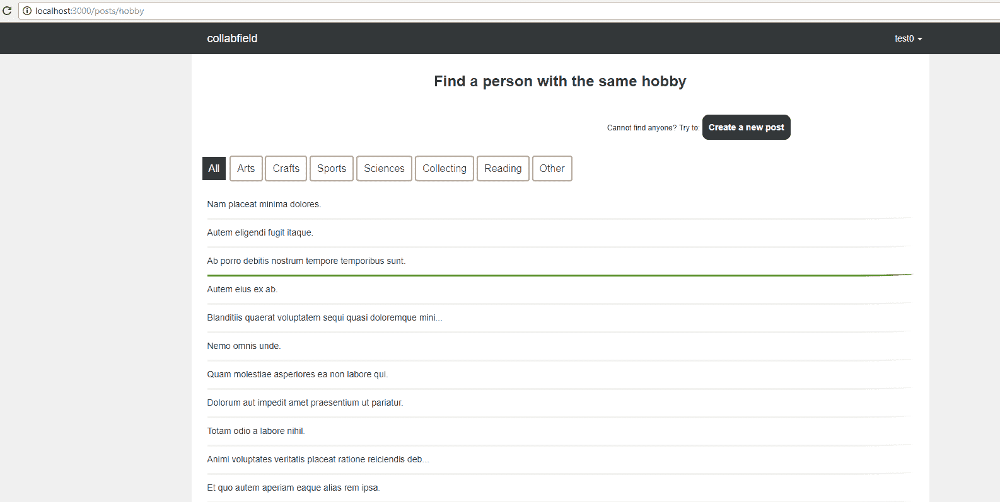******

**提交更改。**

```
`git add -A
git commit -m "Describe the posts style in branch pages

- Create a branch_page.scss file and add CSS
- Add CSS to the default.scss file
- Add CSS to the mobile.scss file"`
```

#### ****搜索栏****

**我们不仅希望能够浏览帖子，还希望能够搜索特定的帖子。在`_branch.html.erb`部分文件中，在`categories`行的上方，添加:**

```
`...
<div class="row">
  <%= render  'posts/branch/search_form', 
              branch: branch,
              search_placeholder: search_placeholder %>
</div><!-- row -->
...`
```

**posts/_branch.html.erb**

**在`branch`目录中创建一个`_search_form.html.erb`部分文件，并在其中添加以下代码:**

```
`<div class="col-sm-12">
  <%= form_tag(send("#{branch}_posts_path"), 
               :method => "get", 
               id: "search-form") do %>
    <i class="fa fa-search" aria-hidden="true"></i>
    <%= text_field_tag  :search, 
                        params[:search], 
                        placeholder: search_placeholder, 
                        class: "form-control" %>
    <%= render category_field_partial_path %>
  <% end %>
</div><!-- col-sm-12 -->`
```

**posts/branch/_search_form.html.erb**

**这里使用`send`方法，我们根据当前的分支动态地生成一个到特定`PostsController`动作的路径。此外，如果选择了特定的类别，我们会为该类别发送一个额外的数据字段。如果用户选择了特定的类别，则只返回该类别的搜索结果。**

**在`posts_helper.rb`中定义`category_field_partial_path`助手方法**

```
`...  
  def category_field_partial_path
    if params[:category].present?
      'posts/branch/search_form/category_field'
    else
      'shared/empty_partial'
    end
  end
...`
```

**helpers/posts_helper.rb**

**创建一个`_category_field.html.erb`部分文件并添加代码:**

```
`<%= hidden_field_tag :category, params[:category] %>`
```

**posts/branch/search_form/_category_field.html.erb**

**为了给搜索表单添加一些样式，将 CSS 添加到`branch_page.scss`文件中:**

```
`.fa-search {
  position:absolute; 
  bottom:14px; 
  left:10px; 
  width:20px; 
  height:10px;
}

#search-form {
  position:relative;
  input {
    border: solid 2px rgba(0,0,0,0.2);
    border-radius: 10px;
    box-shadow: none;
    outline: 0;
  }
  input:focus {
    border: solid 2px rgba(0,0,0,0.35);
  }
  input#search {
    padding: 15px;
    width: 100%;
    height:20px; 
    margin: 10px 0; 
    padding-left: 30px;
  }
}`
```

**assets/stylesheets/partials/posts/branch_page.scss**

**分支页面中的搜索表单现在应该是这样的**

**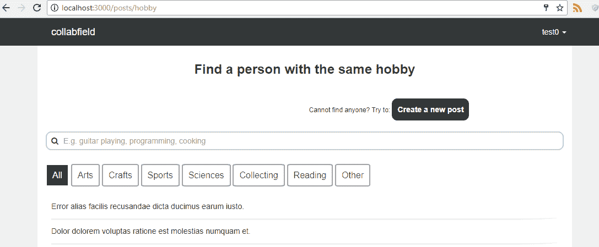**

**提交更改**

```
`git add -A
git commit -m "Add a search form in branch pages
- Render a search form inside the _branch.html.erb
- Create a _search_form.html.erb partial file
- Define a category_field_partial_path helper method in PostsHelper
- Create a _category_field.html.erb partial file
- Add CSS for the the search form in branch_page.scss"`
```

**目前我们的表单没有真正的功能。我们可以使用一些 gems 来实现搜索功能，但是我们的数据并不复杂，所以我们可以创建自己的简单搜索引擎。我们将在`Post`模型中使用[作用域](http://guides.rubyonrails.org/active_record_querying.html#scopes)来使查询可链接，并在控制器中使用一些条件逻辑(我们将在下一节中将其提取到服务对象中，以使代码更简洁)。**

**首先在`Post`模型中定义范围。为了预热，在`post.rb`文件中定义`default_scope`。这将按创建日期降序排列帖子，最新的帖子在顶部。**

```
`...
default_scope -> { includes(:user).order(created_at: :desc) }
...`
```

**models/post.rb**

**提交更改**

```
`git add -A
git commit -m "Define a default_scope for posts"`
```

**用一个规格包起来，确保`default_scope`正常工作。在`post_spec.rb`文件中，添加:**

```
`context 'Scopes' do
  it 'default_scope orders by descending created_at' do
    first_post = create(:post)
    second_post = create(:post)
    expect(Post.all).to eq [second_post, first_post]
  end
end`
```

**spec/models/post_spec.rb**

**提交更改:**

```
`git add -A
git commit -m "Add a spec for the Post model's default_scope"`
```

**现在，让我们使搜索栏的功能。在`posts_controller.rb`中，将`get_posts`方法的内容替换为:**

```
`def get_posts
  branch = params[:action]
  search = params[:search]
  category = params[:category]

  if category.blank? && search.blank?
    posts = Post.by_branch(branch).all
  elsif category.blank? && search.present?
    posts = Post.by_branch(branch).search(search)
  elsif category.present? && search.blank?
    posts = Post.by_category(branch, category)
  elsif category.present? && search.present?
    posts = Post.by_category(branch, category).search(search)
  else
  end
end`
```

**controllers/posts_controller.rb**

**正如我之前提到的，逻辑就像视图一样，在控制器中并不是一个好位置。我们想让它们变干净。因此，我们将在下一节中提取该方法的逻辑。**

**如你所见，这里有一些条件逻辑。根据用户请求的不同，使用范围对数据进行不同的查询。**

**在`Post`模型中，定义这些范围:**

```
`...
  scope :by_category, -> (branch, category_name) do 
    joins(:category).where(categories: {name: category_name, branch: branch}) 
  end

  scope :by_branch, -> (branch) do
    joins(:category).where(categories: {branch: branch}) 
  end

  scope :search, -> (search) do
    where("title ILIKE lower(?) OR content ILIKE lower(?)", "%#{search}%", "%#{search}%")
  end
...`
```

**models/post.rb**

**`[joins](http://guides.rubyonrails.org/active_record_querying.html#joins)`方法用于从关联的表中查询记录。此外，基本的 SQL 语法用于根据提供的字符串查找记录。**

**现在，如果您重启服务器并返回到任何一个分支页面，搜索栏应该可以工作了！现在你也可以通过点击分类按钮来过滤文章。此外，当您选择特定类别时，当您使用搜索表单时，只会查询该类别中的帖子。**

**提交更改**

```
`git add -A
git commit -m "Make search bar and category filters 
in branch pages functional
- Add by_category, by_branch and search scopes in the Post model
- Modify the get_posts method in PostsController"`
```

**用规格盖住这些瞄准镜。在`post_spec.rb`文件的`Scopes`上下文中添加:**

```
`...
  it 'by_category scope gets posts by particular category' do
    category = create(:category)
    create(:post, category_id: category.id)
    create_list(:post, 10)
    posts = Post.by_category(category.branch, category.name)
    expect(posts.count).to eq 1
    expect(posts[0].category.name).to eq category.name
  end

  it 'by_branch scope gets posts by particular branch' do
    category = create(:category)
    create(:post, category_id: category.id)
    create_list(:post, 10)
    posts = Post.by_branch(category.branch)
    expect(posts.count).to eq 1
    expect(posts[0].category.branch).to eq category.branch
  end

  it 'search finds a matching post' do
    post = create(:post, title: 'awesome title', content: 'great content ' * 5)
    create_list(:post, 10, title: ('a'..'c' * 2).to_a.shuffle.join)
    expect(Post.search('awesome').count).to eq 1
    expect(Post.search('awesome')[0].id).to eq post.id
    expect(Post.search('great').count).to eq 1
    expect(Post.search('great')[0].id).to eq post.id
  end
...`
```

**spec/models/post_spec.rb**

**提交更改**

```
`git add -A
git commit -m "Add specs for Post model's 
by_branch, by_category and search scopes"`
```

#### ****无限卷轴****

**当你进入任何一个分支页面时，在页面的底部你会看到分页**

**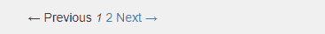**

**当你点击下一个链接时，它会把你重定向到另一个有旧文章的页面。我们可以制作一个无限滚动的功能，类似于脸书和 Twitter 的 feed，而不是重定向到另一个有旧帖子的页面。你只需向下滚动，不需要任何重定向和页面重新加载，旧的文章会被添加到列表的底部。令人惊讶的是，这非常容易实现。我们要做的就是写一些 JavaScript。每当用户到达页面底部时， [AJAX](https://www.w3schools.com/xml/ajax_intro.asp) 请求被发送，以从`next`页面获取数据，该数据被追加到列表的底部。**

**首先配置 AJAX 请求及其条件。当用户通过向下滚动超过某个阈值时，AJAX 请求就会被触发。在`javascripts/posts`目录中，创建一个新的`infinite_scroll.js`文件并添加代码:**

```
`$(document).on('turbolinks:load', function() {
  var isLoading = false;
  if ($('.infinite-scroll', this).size() > 0) {
    $(window).on('scroll', function() {
      var more_posts_url = $('.pagination a.next_page').attr('href');
      var threshold_passed = $(window).scrollTop() > $(document).height() - $(window).height() - 60;
      if (!isLoading && more_posts_url && threshold_passed) {
        isLoading = true;
        $.getScript(more_posts_url).done(function (data,textStatus,jqxhr) {
          isLoading = false;
        }).fail(function() {
          isLoading = false;
        });
      }
    });
  }
});`
```

**assets/javascripts/posts/infinite_scroll.js**

**`isLoading`变量确保一次只发送一个请求。如果当前有一个请求正在进行，则不会启动其他请求。**

**首先检查分页是否存在，是否有更多的文章要呈现。接下来，获取到下一页的链接，这是数据将被检索的地方。然后在调用 AJAX 请求时设置一个阈值，在这种情况下，阈值是从窗口底部开始的`60px`。最后，如果所有条件都成功通过，使用`[getScript()](https://api.jquery.com/jquery.getscript/)`函数从`next`页面加载数据。**

**因为`getScript()`函数加载 JavaScript 文件，所以我们必须指定在`PostsController`中呈现哪个文件。在`posts_for_branch`方法中指定`respond_to`格式和要呈现的文件。**

```
`respond_to do |format|
  format.html
  format.js { render partial: 'posts/posts_pagination_page' }
end`
```

**controllers/posts_controller.rb**

**当控制器试图用`.js`文件响应时，`posts_pagination_page`模板被渲染。这个部分文件将新检索到的帖子附加到列表中。创建这个文件来追加新的文章并更新分页元素。**

```
`$('#feed').append('<%= j render @posts %>');
<%= render update_pagination_partial_path %>`
```

**posts/_posts_pagination_page.js.erb**

**在`posts_helper.rb`中创建一个`update_pagination_partial_path`辅助方法**

```
`def update_pagination_partial_path
  if @posts.next_page
    'posts/posts_pagination_page/update_pagination'
  else
    'posts/posts_pagination_page/remove_pagination'
  end
end`
```

**helpers/posts_helper.rb**

**这里使用了来自`will_paginate` gem 的`next_page`方法，以确定将来是否有更多的文章要加载。**

**创建相应的分部文件:**

```
`$('.pagination').replaceWith('<%= j will_paginate @posts %>');`
```

**posts/posts_pagination_page/_update_pagination.js.erb**

```
`$(window).off('scroll');
$('.pagination').remove();`
```

**posts/posts_pagination_page/_remove_pagination.js.erb**

**如果你转到任何一个分支页面并向下滚动，旧的文章会自动添加到列表中。**

**此外，我们不再需要看到分页菜单，所以用 CSS 隐藏它。在`branch_page.scss`文件内添加:**

```
`...
.infinite-scroll {
  display: none;
}
...`
```

**stylesheets/partials/posts/branch_page.scss**

**提交更改**

```
`git add -A
git commit -m "Transform posts pagination into infinite scroll
- Create an infinite_scroll.js file
- Inside PostController's posts_for_branch method add respond_to format
- Define an update_pagination_partial_path
- Create _update_pagination.js.erb and _remove_pagination.js.erb partials
- hide the .infinite-scroll element with CSS"`
```

****规格****

**用规范覆盖`update_pagination_partial_path` helper 方法:**

```
`context '#update_pagination_partial_path' do
  it "returns an update_pagination partial's path" do
    posts = double('posts', :next_page => 2)
    assign(:posts, posts)
    expect(helper.update_pagination_partial_path).to(
      eq 'posts/posts_pagination_page/update_pagination'
    )
  end

  it "returns a remove_pagination partial's path" do
    posts = double('posts', :next_page => nil)
    assign(:posts, posts)
    expect(helper.update_pagination_partial_path).to(
      eq 'posts/posts_pagination_page/remove_pagination'
    )
  end
end`
```

**spec/helpers/post_helper_spec.rb**

**这里我使用了一个测试`double`来模拟`posts`实例变量和它的链接方法`next_page`。你可以在这里了解更多关于 RSpec 模拟的信息[。](https://relishapp.com/rspec/rspec-mocks/docs)**

**提交更改:**

```
`git add -A
git commit -m "Add specs for the update_pagination_partial_path
helper method"`
```

**我们还可以编写功能规范，以确保在您向下滚动后，帖子被成功附加。创建一个`infinite_scroll_spec.rb`文件:**

```
`require "rails_helper"

RSpec.feature "Infinite scroll", :type => :feature do
  Post.per_page = 15  

  let(:check_posts_count) do
    expect(page).to have_selector('.single-post-list', count: 15)
    page.execute_script("$(window).scrollTop($(document).height())")
    expect(page).to have_selector('.single-post-list', count: 30)
  end

  scenario "User scrolls down the hobby page 
            and posts list will be appended with older posts", js: true do      
    create_list(:post, 30, category: create(:category, branch: 'hobby'))     
    visit hobby_posts_path
    check_posts_count
  end

  scenario "User scrolls down the study page 
            and posts list will be appended with older posts", js: true do      
    create_list(:post, 30, category: create(:category, branch: 'study'))        
    visit study_posts_path
    check_posts_count
  end

  scenario "User scrolls down the team page 
            and posts list will be appended with older posts", js: true do      
    create_list(:post, 30, category: create(:category, branch: 'team'))      
    visit team_posts_path
    check_posts_count
  end

end`
```

**spec/features/posts/infinite_scroll_spec.rb**

**在 spec 文件中，所有分支页面都包含在内。我们确保该功能在所有三个页面上都有效。`per_page`是`will_paginate`宝石的方法。这里选择了`Post`模型，并设置了默认的每页文章数。**

**定义了`check_posts_count`方法来减少文件的代码量。我们没有以不同的规格一遍又一遍地重复相同的代码，而是将其提取到一个方法中。一旦访问该页面，预计会看到 15 个帖子。然后使用`execute_script`方法运行 JavaScript，将滚动条滚动到浏览器底部。最后，滚动后，预计会看到另外 15 个帖子。现在总共应该有 30 页上的职位。**

**提交更改:**

```
`git add -A
git commit -m "Add feature specs for posts' infinite scroll functionality"`
```

****首页更新****

**目前在主页上我们只能看到一些随机的帖子。修改主页，这样我们可以看到所有分支的一些帖子。**

**将`_main_content.html.erb`文件的内容替换为:**

```
`<div id="main-content" class="col-sm-9">
  <h3 class="page-name"><%= link_to 'Hobby', hobby_posts_path %></h3>
  <div class="row">
    <%= render @hobby_posts %>
    <%= render no_posts_partial_path(@hobby_posts) %>
  </div><!-- row -->

  <h3 class="page-name"><%= link_to 'Study', study_posts_path %></h3>
  <div class="row">
    <%= render @study_posts %>
    <%= render no_posts_partial_path(@study_posts) %>
  </div><!-- row -->

  <h3 class="page-name"><%= link_to 'Team member', team_posts_path %></h3>
  <div class="row">
    <%= render @team_posts %>
    <%= render no_posts_partial_path(@team_posts) %>
  </div><!-- row -->
</div><!-- main_content -->`
```

**pages/index/_main_content.html.erb**

**我们为每个分支创建了张贴的部分。**

**在`PagesController`的`index`动作中定义实例变量。该操作应该如下所示:**

```
 `def index
    @hobby_posts = Post.by_branch('hobby').limit(8)
    @study_posts = Post.by_branch('study').limit(8)
    @team_posts = Post.by_branch('team').limit(8)
  end`
```

**controllers/pages_controller.rb**

**我们有以前的`no_posts_partial_path` helper 方法，但是我们应该稍微修改一下，使它更具可重用性。目前它只适用于分支页面。向该方法添加一个`posts`参数，因此它现在应该是这样的:**

```
`def no_posts_partial_path(posts)
  posts.empty? ? 'posts/shared/no_posts' : 'shared/empty_partial'
end`
```

**helpers/posts_helper.rb**

**这里添加了`posts`参数，实例变量变成了一个简单变量，部分变量的路径也改变了。因此将`_no_posts.html.erb`部分文件从**

```
`posts/branch/_no_posts.html.erb`
```

**到**

```
`posts/shared/_no_posts.html.erb`
```

**同样在`_branch.html.erb`文件中，将`@posts`实例变量作为参数传递给`no_posts_partial_path`方法。**

**添加一些风格变化。在`default.scss`文件内添加:**

```
`...
.container {
  padding: 0;
}

.row {
  margin: 0;
}`
```

**assets/stylesheets/base/default.scss**

**并在`home_page.scss`里面加上:**

```
`.page-name {
  margin: 15px 0px 15px 0px;
  text-align: center;
  background-color: white !important;
  font-weight: bold;
  a {
    color: black;
  }
  a:hover {
    text-decoration: underline;
  }
}
...`
```

**assets/stylesheets/partials/home_page.scss**

**主页现在应该看起来像这样**

**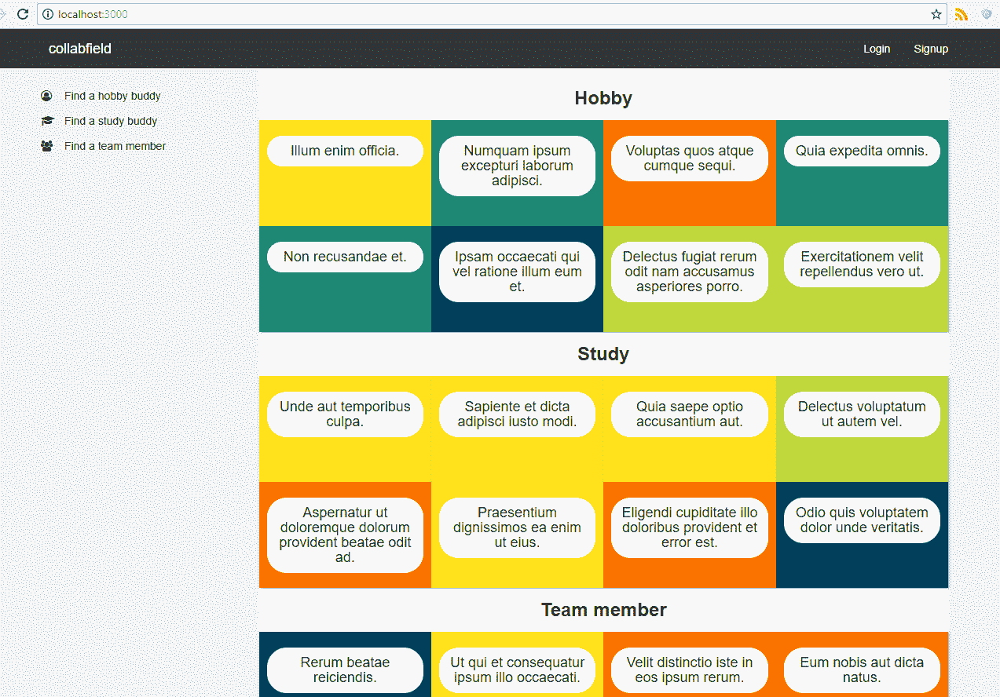**

**提交更改**

```
`git add -A
git commit -m "Add posts from all branches in the home page
- Modify the _main_content.html.erb file
- Define instance variables inside the PagesController’s index action
- Modify the no_posts_partial_path helper method to be more reusable
- Add CSS to style the home page"`
```

#### **服务对象**

**正如我之前提到的，如果你把逻辑放在控制器里面，它们很容易变得复杂，测试起来也很痛苦。这就是为什么在其他地方从它们那里提取逻辑是个好主意。为了做到这一点，我使用设计模式，更具体地说是服务对象(服务)。**

**现在在`PostsController`里面，我们有这个方法:**

```
`def get_posts
  branch = params[:action]
  search = params[:search]
  category = params[:category]

  if category.blank? && search.blank?
    posts = Post.by_branch(branch).all
  elsif category.blank? && search.present?
    posts = Post.by_branch(branch).search(search)
  elsif category.present? && search.blank?
    posts = Post.by_category(branch, category)
  elsif category.present? && search.present?
    posts = Post.by_category(branch, category).search(search)
  else
  end
end`
```

**controllers/posts_controller.rb**

**它有很多条件逻辑，我想通过使用服务来删除它们。服务对象(services)设计模式只是一个基本的 [ruby 类](https://www.tutorialspoint.com/ruby/ruby_classes.htm)。这非常简单，我们只需传递我们想要处理的数据，并调用一个定义的方法来获得所需的返回值。**

**在 ruby 中，我们将数据传递给类的`initialize`方法，在其他语言中，它被称为`constructor`。然后在类内部，我们创建一个方法来处理所有定义的逻辑。让我们创建它，看看它在代码中是什么样子。**

**在`app`目录中，创建一个新的`services`目录:**

```
`app/services`
```

**在目录中，创建一个新的`posts_for_branch_service.rb`文件:**

```
`class PostsForBranchService
  def initialize(params)
    @search = params[:search]
    @category = params[:category]
    @branch = params[:branch]
  end

  # get posts depending on the request
  def call
    if @category.blank? && @search.blank?
      posts = Post.by_branch(@branch).all
    elsif @category.blank? && @search.present?
      posts = Post.by_branch(@branch).search(@search)
    elsif @category.present? && @search.blank?
      posts = Post.by_category(@branch, @category)
    elsif @category.present? && @search.present?
      posts = Post.by_category(@branch, @category).search(@search)
    else
    end
  end

end`
```

**services/posts_for_branch_service.rb**

**这里，如上所述，它只是一个普通的 ruby 类，用一个`initialize`方法接受参数，用一个`call`方法处理逻辑。我们从`get_posts`方法中得到这个逻辑。**

**现在简单地创建这个类的一个新对象，并在`get_posts`方法中调用`call`方法。该方法现在应该是这样的:**

```
 `def get_posts
    PostsForBranchService.new({
      search: params[:search],
      category: params[:category],
      branch: params[:action]
    }).call
  end`
```

**controllers/posts_controller.rb**

**提交更改:**

```
`git add -A
git commit -m "Create a service object to extract logic
from the get_posts method"`
```

****规格****

**与服务一样，设计模式的一个幸运之处是很容易为它编写单元测试。我们可以简单地为`call`方法编写规范，并测试它的每一个条件。**

**在`spec`目录中创建一个新的`services`目录:**

```
`spec/services`
```

**在目录内创建一个新文件`posts_for_branch_service_spec.rb`**

```
`require 'rails_helper'
require './app/services/posts_for_branch_service.rb'

describe PostsForBranchService do

  context '#call' do
    let(:not_included_posts) { create_list(:post, 2) }
    let(:category) { create(:category, branch: 'hobby', name: 'arts') }
    let(:post) do
      create(:post,
              title: 'a very fun post', 
              category_id: category.id)
    end
    it 'returns posts filtered by a branch' do
      not_included_posts
      category
      included_posts = create_list(:post, 2, category_id: category.id)
      expect(PostsForBranchService.new({branch: 'hobby'}).call).to(
        match_array included_posts
      )
    end

    it 'returns posts filtered by a branch and a search input' do
      not_included_posts
      category
      included_post = [] << post
      expect(PostsForBranchService.new({branch: 'hobby', search: 'fun'}).call).to(
        eq included_post
      )
    end

    it 'returns posts filtered by a category name' do
      not_included_posts
      category
      included_post = [] << post
      expect(PostsForBranchService.new({branch: 'hobby', category: 'arts'}).call).to(
        eq included_post
      )
    end

    it 'returns posts filtered by a category name and a search input' do
      not_included_posts
      category
      included_post = [] << post
      expect(PostsForBranchService.new({name: 'arts', 
                                        search: 'fun', 
                                        branch: 'hobby'}).call).to eq included_post
    end
  end
end`
```

**spec/services/posts_for_branch_service_spec.rb**

**在文件的顶部，加载了`posts_for_branch_service.rb`文件，然后测试了每个`call`方法的条件。**

**提交更改**

```
`git add -A
git commit -m "Add specs for the PostsForBranchService"`
```

#### **创建新帖子**

**到目前为止，帖子都是通过使用种子人工创建的。让我们为它添加一个用户界面，这样用户就可以创建帖子。**

**在`posts_controller.rb`文件中添加`new`和`create`动作。**

```
`...
  def new
    @branch = params[:branch]
    @categories = Category.where(branch: @branch)
    @post = Post.new
  end

  def create
    @post = Post.new(post_params)
    if @post.save 
      redirect_to post_path(@post) 
    else
      redirect_to root_path
    end
  end
...`
```

**controllers/posts_controller.rb**

**在`new`动作中，我们为表单定义了一些实例变量来创建新的帖子。在`@categories`实例变量中，存储了特定分支的类别。`@post`实例变量存储一个新帖子的对象，这是 Rails 表单所需要的。**

**在`create`动作的`@post`实例变量中，我们使用`post_params`方法创建了一个新的`Post`对象并用数据填充它。在`private`范围内定义该方法:**

```
`...
def post_params
  params.require(:post).permit(:content, :title, :category_id)
                       .merge(user_id: current_user.id)
end
...`
```

**controllers/posts_controller.rb**

**`[permit](https://apidock.com/rails/ActionController/Parameters/permit)`方法用于将对象的属性列入白名单，因此只允许传递这些指定的属性。**

**同样在`PostsController`的顶部，添加下面一行:**

```
`...
before_action :redirect_if_not_signed_in, only: [:new]
...`
```

**controllers/posts_controller.rb**

**`before_action`是轨道[滤波器](http://guides.rubyonrails.org/action_controller_overview.html#filters)中的一个。我们不希望允许未登录的用户访问他们可以创建新帖子的页面。所以在调用`new`动作之前，先调用`redirect_if_not_signed_in`方法。我们在其他控制器上也需要这个方法，所以在`application_controller.rb`文件中定义它。此外，重定向登录用户的方法在将来也会很有用。所以定义他们两个。**

```
`...
def redirect_if_not_signed_in
  redirect_to root_path if !user_signed_in?
end

def redirect_if_signed_in
  redirect_to root_path if user_signed_in?
end
...`
```

**controllers/application_controller.rb**

**现在需要`new`模板，因此用户可以创建新的帖子。在`posts`目录中，创建一个`new.html.erb`文件:**

```
`<div class="container new-post">
  <div class="row">
    <div class="col-sm-6 col-sm-offset-3">
      <h1>Create a new post</h1>
        <%= render 'posts/new/post_form' %>
    </div>
  </div>
</div>`
```

**posts/new.html.erb**

**在里面创建一个`new`目录和一个`_post_form.html.erb`部分文件:**

```
`<%= bootstrap_form_for(@post) do |f| %>
  <%= f.text_field  :title, 
                    maxlength: 100, 
                    placeholder: 'Title', 
                    class: 'form-control',
                    required: true, 
                    minlength: 5,
                    maxlength: 100 %>
  <%= f.hidden_field :branch, :value => @branch %>
  <%= f.text_area :content, 
                  rows: 6,
                  required: true, 
                  minlength: 20,
                  maxlength: 1000,
                  placeholder: 'Describe what you are looking for. E.g. specific interests, expertise level, etc.', 
                  class: 'form-control' %>
  <%= f.collection_select :category_id, @categories, :id, :name, class: 'form-control' %>
  <%= f.submit "Create a post", class: 'form-control' %>
<% end %>`
```

**posts/new/_post_form.html.erb**

**表单非常简单。定义字段的属性，并使用`collection_select`方法允许选择一个可用类别。**

**提交更改**

```
`git add -A
git commit -m "Create a UI to create new posts
- Inside the PostsController: 
  define new and create actions
  define a post_params method
  define a before_action filter
- Inside the ApplicationController:
  define a redirect_if_not_signed_in method
  define a redirect_if_signed_in method
- Create a new template for posts"`
```

**我们可以通过编写规格来测试表单是否有效。从编写[请求规格](https://relishapp.com/rspec/rspec-rails/docs/request-specs/request-spec)开始，以确保我们在发送特定请求后得到正确的响应。在`spec`目录中创建几个目录。**

```
`spec/requests/posts`
```

**里面还有一个`new_spec.rb`文件:**

```
`require 'rails_helper'
include Warden::Test::Helpers
RSpec.describe "new", :type => :request do

  context 'non-signed in user' do
    it 'redirects to a root path' do
      get '/posts/new'
      expect(response).to redirect_to(root_path)
    end
  end

  context 'signed in user' do
    let(:user) { create(:user) }
    before(:each) { login_as user }

    it 'renders a new template' do
      get '/posts/new'
      expect(response).to render_template(:new)
    end
  end

end`
```

**spec/requests/posts/new_spec.rb**

**正如文档中所提到的，请求规范为集成测试提供了一个薄薄的包装。所以我们测试当我们发送某些请求时是否得到正确的响应。为了使用`login_as`方法，需要`include Warden::Test::Helpers`行。方法让用户登录。**

**提交更改。**

```
`git add -A
git commit -m "Add request specs for a new post template"`
```

**我们甚至可以为之前创建的页面添加更多的请求规范。**

**在同一个目录中创建一个`branches_spec.rb`文件:**

```
`require 'rails_helper'
include Warden::Test::Helpers
RSpec.describe "branches", :type => :request do

  shared_examples 'render_templates' do
    it 'renders a hobby template' do
      get '/posts/hobby'
      expect(response).to render_template(:hobby)
    end

    it 'renders a study template' do
      get '/posts/study'
      expect(response).to render_template(:study)
    end

    it 'renders a team template' do
      get '/posts/team'
      expect(response).to render_template(:team)
    end
  end

  context 'non-signed in user' do
    it_behaves_like 'render_templates'
  end

  context 'signed in user' do
    let(:user) { create(:user) }
    before(:each) { login_as user }

    it_behaves_like 'render_templates'
  end

end`
```

**spec/requests/posts/branches_spec.rb**

**通过这种方式，我们可以检查所有分支页面的模板是否成功呈现。此外,`[shared_examples](https://relishapp.com/rspec/rspec-core/docs/example-groups/shared-examples)`用于减少重复代码。**

**提交更改。**

```
`git add -A
git commit -m "Add request specs for Posts branch pages' templates"`
```

**此外，我们可以确保`show`模板渲染成功。在同一个目录中创建一个`show_spec.rb`文件:**

```
`require 'rails_helper'
include Warden::Test::Helpers
RSpec.describe "show", :type => :request do

  shared_examples 'render_show_template' do
    let(:post) { create(:post) }
    it 'renders a show template' do
      get post_path(post)
      expect(response).to render_template(:show)
    end
  end

  context 'non-signed in user' do
    it_behaves_like 'render_show_template'
  end

  context 'signed in user' do
    let(:user) { create(:user) }
    before(:each) { login_as user }

    it_behaves_like 'render_show_template'
  end

end`
```

**spec/requests/posts/show_spec.rb**

**提交更改。**

```
`git add -A
git commit -m "Add request specs for the Posts show template"`
```

**为了确保用户能够创建新的帖子，需要编写功能规范来测试表单。在`features/posts`目录中创建一个新文件`create_new_post_spec.rb`**

```
`require "rails_helper"

RSpec.feature "Create a new post", :type => :feature do
  let(:user) { create(:user) }
  before(:each) { sign_in user }

  shared_examples 'user creates a new post' do |branch|
    scenario 'successfully' do
      create(:category, name: 'category', branch: branch)
      visit send("#{branch}_posts_path")
      find('.new-post-button').click
      fill_in 'post[title]', with: 'a' * 20
      fill_in 'post[content]', with: 'a' * 20
      select 'category', from: 'post[category_id]' 
      click_on 'Create a post'
      expect(page).to have_selector('h3', text: 'a' * 20)
    end
  end

  include_examples 'user creates a new post', 'hobby'
  include_examples 'user creates a new post', 'study'
  include_examples 'user creates a new post', 'team'
end`
```

**spec/features/posts/create_new_post_spec.rb**

**提交更改。**

```
`git add -A
git commit -m "Create a create_new_post_spec.rb file with feature specs"`
```

**对`new`模板应用一些设计。**

**在以下目录中:**

```
`assets/stylesheets/partials/posts`
```

**创建一个`new.scss`文件:**

```
`.new-post {
  height: calc(100vh - 50px);
  background-color: white;
  h1 {
    text-align: center;
    margin: 25px 0;
  }
  input, textarea, select {
    width: 100%;
  }
}`
```

**assets/stylesheets/partials/posts/new.scss**

**如果您现在在浏览器中转到模板，您应该会看到一个基本表单**

**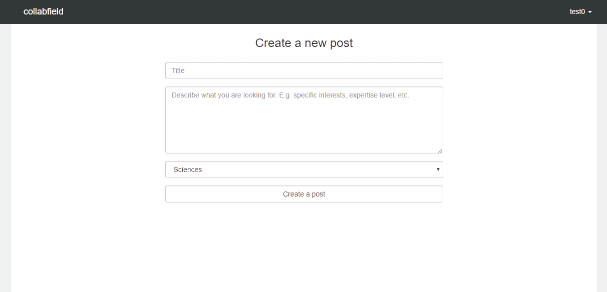**

**提交更改**

```
`git add -A
git commit -m "Add CSS to the Posts new.html.erb template"`
```

**最后，我们要确保所有字段都正确填写。在`Post`模型中，我们将定义一些[验证](http://guides.rubyonrails.org/active_record_validations.html)。将以下代码添加到`Post`模型中:**

```
`...
validates :title, presence: true, length: { minimum: 5, maximum: 255 }
validates :content, presence: true, length: { minimum: 20, maximum: 1000 }
validates :category_id, presence: true
...`
```

**models/post.rb**

**提交更改。**

```
`git add -A
git commit -m "Add validations to the Post model"`
```

**用规范覆盖这些验证。转到`Post`模型的规格文件:**

```
`spec/models/post_spec.rb`
```

**然后补充:**

```
`context 'Validations' do
  let(:post) { build(:post) }

  it 'creates succesfully' do 
    expect(post).to be_valid
  end

  it 'is not valid without a category' do 
    post.category_id = nil
    expect(post).not_to be_valid
  end

  it 'is not valid without a title' do 
    post.title = nil
    expect(post).not_to be_valid
  end

  it 'is not valid  without a user_id' do
    post.user_id = nil
    expect(post).not_to be_valid
  end

  it 'is not valid  with a title, shorter than 5 characters' do 
    post.title = 'a' * 4
    expect(post).not_to be_valid
  end

  it 'is not valid  with a title, longer than 255 characters' do 
    post.title = 'a' * 260
    expect(post).not_to be_valid
  end

  it 'is not valid without a content' do 
    post.content = nil
    expect(post).not_to be_valid
  end

  it 'is not valid  with a content, shorter than 20 characters' do 
    post.content = 'a' * 10
    expect(post).not_to be_valid
  end

  it 'is not valid  with a content, longer than 1000 characters' do 
    post.content = 'a' * 1050
    expect(post).not_to be_valid
  end
end` 
```

**spec/models/post_spec.rb**

**提交更改。**

```
`git add -A
git commit -m "Add specs for the Post model's validations"`
```

**将`specific_branches`分支与`master`分支合并**

```
`git checkout -b master
git merge specific_branches
git branch -D specific_branches`
```

### **即时消息**

**用户能够发布帖子并阅读其他用户的帖子，但他们没有相互交流的能力。我们可以创建一个简单的邮箱系统，开发起来会更容易更快。但这是一种非常古老的与人交流的方式。实时通信开发起来更令人兴奋，使用起来也更舒适。**

**幸运的是，Rails 有[动作电缆](http://edgeguides.rubyonrails.org/action_cable_overview.html)，这使得实时特性的实现相对容易。Action Cables 背后的核心概念是，它使用了一个 [WebSockets 协议](https://en.wikipedia.org/wiki/WebSocket)，而不是 [HTTP](https://en.wikipedia.org/wiki/Hypertext_Transfer_Protocol) 。WebSockets 的核心概念是它建立了一个客户端-服务器连接并保持开放。这意味着发送和接收额外的数据不需要重新加载页面。**

#### **私人对话**

**本节的目标是创建一个允许两个用户之间进行私人对话的工作功能。**

**切换到新的分支**

```
`git checkout -B private_conversation`
```

****命名空间模型****

**从定义必要的模型开始。我们现在需要两种不同的模型，一种用于私人对话，另一种用于私人信息。我们可以将它们命名为`PrivateConversation`和`PrivateMessage`，但是你很快会遇到一个小问题。虽然一切都会很好，但是想象一下在我们创建了越来越多名字前缀相似的模型之后，`models`目录会是什么样子。目录很快就会变得难以管理。**

**为了避免目录中混乱的结构，我们可以使用命名空间技术。**

**让我们看看它会是什么样子。一个普通的私人对话模型叫做`PrivateConversation`，它的文件叫做`private_conversation.rb`，存储在`models`目录中**

```
`models/private_conversation.rb`
```

**同时，命名空间的版本将被称为`Private::Conversation`。该文件将被命名为`conversation.rb`，并位于`private`目录中**

```
`models/private/conversation.rb`
```

**你能看出它有什么用处吗？所有带有`private`前缀的文件都将存储在`private`目录中，而不是堆积在主`models`目录中，使其难以读取。**

**通常，Rails 使开发过程变得愉快。我们能够通过指定一个目录来创建命名空间模型，我们希望将模型放在这个目录中。**

**要创建命名空间`Private::Conversation`模型，运行以下命令:**

```
`rails g model private/conversation`
```

**同时生成`Private::Message`模型:**

```
`rails g model private/message`
```

**如果你查看`models`目录，你会看到一个`private.rb`文件。这是为数据库表的名称添加前缀所必需的，因此可以识别模型。就我个人而言，我不喜欢将这些文件保存在`models`目录中，我更喜欢在模型本身中指定一个表名。要在模型中指定表名，您必须使用`self.table_name =`并以字符串形式提供表名。如果您像我一样选择以这种方式指定数据库表的名称，那么模型应该如下所示:**

```
`class Private::Conversation < ApplicationRecord
  self.table_name = 'private_conversations'
end`
```

**models/private/conversation.rb**

```
`class Private::Message < ApplicationRecord
  self.table_name = 'private_messages'
end`
```

**models/private/message.rb**

**`models`目录中的`private.rb`文件不再需要，可以删除。**

**用户将能够进行许多私人对话，并且对话将具有许多消息。在模型中定义这些关联:**

```
`...
has_many :messages, 
         class_name: "Private::Message", 
         foreign_key: :conversation_id
belongs_to :sender, foreign_key: :sender_id, class_name: 'User'
belongs_to :recipient, foreign_key: :recipient_id, class_name: 'User'
...`
```

**models/private/conversation.rb**

```
`...
  belongs_to :user
  belongs_to :conversation, 
             class_name: 'Private::Conversation',
             foreign_key: :conversation_id
...`
```

**models/private/message.rb**

```
`...
has_many :private_messages, class_name: 'Private::Message'
has_many  :private_conversations, 
          foreign_key: :sender_id, 
          class_name: 'Private::Conversation'
...`
```

**models/user.rb**

**这里的`class_name`方法用于定义一个相关模型的名称。这允许为我们的关联使用自定义名称，并确保命名空间模型得到识别。`class_name`方法的另一个用例是创建与其自身的关系，当您想要通过创建某种层次结构或类似结构来区分同一模型的数据时，这很有用。**

**`foreign_key`用于指定数据库表中关联列的名称。表中的数据列只在`belongs_to`关联方创建，但是为了使列可识别，我们必须在两个模型上用相同的值定义`foreign_key`。**

**私人对话将在两个用户之间进行，这里这两个用户是`sender`和`recipient`。我们可以把它们命名为`user1`和`user2`。但是知道谁发起了一个对话是很方便的，所以这里的`sender`是一个对话的创建者。**

**在迁移文件中定义数据表:**

```
`class CreatePrivateConversations < ActiveRecord::Migration[5.1]
  def change
    create_table :private_conversations do |t|
      t.integer :recipient_id
      t.integer :sender_id

      t.timestamps
    end
    add_index :private_conversations, :recipient_id
    add_index :private_conversations, :sender_id
    add_index :private_conversations, [:recipient_id, :sender_id], unique: true
  end
end`
```

**db/migrate/CREATION_DATE_create_private_conversations.rb**

**`private_conversations`表将存储用户的 id，这是`belongs_to`和`has_many`关联工作所需要的，当然也是在两个用户之间创建对话所需要的。**

```
`class CreatePrivateMessages < ActiveRecord::Migration[5.1]
  def change
    create_table :private_messages do |t|
      t.text :body
      t.references :user, foreign_key: true
      t.belongs_to :conversation, index: true
      t.boolean :seen, default: false

      t.timestamps
    end
  end
end`
```

**db/migrate/CREATION_DATE_create_private_messages.rb**

**在`body`数据列中，将存储消息的内容。我们没有添加索引和 id 列来实现两个模型之间的关联，而是使用了`references`方法，这简化了实现。**

**运行迁移文件以在开发数据库中创建表**

```
`rails db:migrate`
```

**提交更改**

```
`git add -A
git commit -m "Create Private::Conversation and Private::Message models
- Define associations between User, Private::Conversation
  and Private::Message models
- Define private_conversations and private_messages tables"`
```

****非实时私人对话窗口****

**我们有一个存储私人谈话数据的地方，但仅此而已。我们现在应该从哪里开始？如前所述，就我个人而言，我喜欢创建一个功能的基本视觉方面，然后编写一些逻辑使其功能化。我喜欢这种方法，因为当我有一个视觉元素时，我想让它具有功能性，这更明显地表明我想要实现什么。一旦你有了一个用户界面，就更容易开始把一个问题分解成更小的步骤，因为你知道在某个事件之后应该发生什么。编程一个还不存在的东西更难。**

**要开始构建私人对话的用户界面，创建一个`Private::Conversations`控制器。一旦我命名了应用程序中的一些东西，我喜欢保持一致，并命名所有其他相关部分。这允许更直观地理解和浏览源代码。**

```
`rails g controller private/conversations`
```

**Rails generator 相当不错。它创建了命名空间模型和命名空间视图，一切都为开发做好了准备。**

****创建新对话****

**我们需要一个开始新对话的方法。在我们的应用程序中，你想联系一个和你有相似兴趣的人是有意义的。实现这一功能的一个方便的地方是在单个帖子的页面中。**

**在`posts/show.html.erb`模板中，创建一个表单来发起一个新的对话。在`<p><%= @post.content %></p>`行下方添加:**

```
`...
<%= render contact_user_partial_path %>
...`
```

**posts/show.html.erb**

**在`posts_helper.rb`中定义助手方法**

```
`...
def contact_user_partial_path
  if user_signed_in?
    @post.user.id != current_user.id ? 'posts/show/contact_user' : 'shared/empty_partial'
  else 
    'posts/show/login_required'
  end
end
...`
```

**helpers/posts_helper.rb**

**为 helper 方法添加规范:**

```
`...
context '#contact_user_partial_path' do
  before(:each) do
    @current_user = create(:user, id: 1)
    helper.stub(:current_user).and_return(@current_user)
  end

  it "returns a contact_user partial's path" do
    helper.stub(:user_signed_in?).and_return(true)
    assign(:post, create(:post, user_id: create(:user, id: 2).id))
    expect(helper.contact_user_partial_path).to(
      eq 'posts/show/contact_user' 
    )
  end

  it "returns an empty partial's path" do
    helper.stub(:user_signed_in?).and_return(true)
    assign(:post, create(:post, user_id: @current_user.id))

    expect(helper.contact_user_partial_path).to(
      eq 'shared/empty_partial'
    )
  end

  it "returns an empty partial's path" do
    helper.stub(:user_signed_in?).and_return(false)
    expect(helper.contact_user_partial_path).to(
      eq 'posts/show/login_required'
    )
  end
end
...`
```

**spec/helpers/posts_helper_spec.rb**

**创建一个`show`目录和相应的部分文件:**

```
`<div class="contact-user">
  <%= render leave_message_partial_path %>
</div><!-- contact-user -->`
```

**posts/show/_contact_user.html.erb**

```
`<div class="text-center">
  To contact the user you have to <%= link_to 'Login', login_path %> 
</div>`
```

**posts/show/_login_required.html.erb**

**在`posts_helper.rb`中定义`leave_message_partial_path`助手方法**

```
`...
def leave_message_partial_path
  if @message_has_been_sent
    'posts/show/contact_user/already_in_touch'
  else
    'posts/show/contact_user/message_form'
  end
end
...`
```

**helpers/posts_helper.rb**

**为方法添加规格**

```
`...
context '#leave_message_partial_path' do
  it "returns an already_in_touch partial's path" do
    assign('message_has_been_sent', true)
    expect(helper.leave_message_partial_path).to(
      eq 'posts/show/contact_user/already_in_touch'
    )
  end

  it "returns an already_in_touch partial's path" do
    assign('message_has_been_sent', false)
    expect(helper.leave_message_partial_path).to(
      eq 'posts/show/contact_user/message_form'
    )
  end
end
...`
```

**spec/helpers/posts_helper_spec.rb**

**我们稍后将在`PostsController`中定义`@message_has_been_sent`实例变量，它将决定给用户的初始消息是否已经发送。**

**在一个新的`contact_user`目录中创建对应于`leave_message_partial_path`助手方法的部分文件**

```
`<div class="contacted-user">
  You are already in touch with this user
</div>`
```

**posts/show/contact_user/_already_in_touch.html.erb**

```
`<%= form_tag({controller: "private/conversations", action: "create"},
              method: "post",
              remote: true) do %>
  <%= hidden_field_tag(:post_id, @post.id)  %>
  <%= text_area_tag(:message_body,
                    nil,
                    rows: 3,
                    class: 'form-control', 
                    placeholder: 'Send a messsage to the user') %>
  <%= submit_tag('Send a message', class: 'btn send-message-to-user') %>
<% end %>`
```

**posts/show/contact_user/_message_form.html.erb**

**现在配置`PostsController`的`show`动作。在动作中添加**

```
`...
if user_signed_in?
  @message_has_been_sent = conversation_exist?
end
...`
```

**controllers/posts_controller.rb**

**在控制器的`private`范围内，定义`conversation_exist?`方法**

```
`...
def conversation_exist?
  Private::Conversation.between_users(current_user.id, @post.user.id).present?
end
...`
```

**controllers/posts_controller.rb**

**`between_users`方法查询两个用户之间的私人对话。将其定义为`Private::Conversation`模型中的一个范围**

```
`...
scope :between_users, -> (user1_id, user2_id) do
  where(sender_id: user1_id, recipient_id: user2_id).or(
    where(sender_id: user2_id, recipient_id: user1_id)
  )
end
...`
```

**models/private/conversation.rb**

**我们必须测试示波器是否工作。在编写规范之前，定义一个`private_conversation`工厂，因为我们需要测试数据库中的样本数据。**

```
`FactoryGirl.define do
  factory :private_conversation, class: 'Private::Conversation' do
    association :recipient, factory: :user
    association :sender, factory: :user

    factory :private_conversation_with_messages do
      transient do
        messages_count 1
      end

      after(:create) do |private_conversation, evaluator|
        create_list(:private_message, evaluator.messages_count, 
                     conversation: private_conversation)
      end
    end
  end
end`
```

**spec/factories/private_conversations.rb**

**我们在这里看到一个嵌套工厂，这允许使用其父配置创建一个工厂，然后修改它。还因为我们将使用`private_conversation_with_messages`工厂创建消息，所以我们也需要定义`private_message`工厂**

```
`FactoryGirl.define do 
  factory :private_message, class: 'Private::Message' do
    body 'a' * 20
    association :conversation, factory: :private_conversation
    user
  end
end`
```

**spec/factories/private_messages.rb**

**现在我们已经做好了测试规格范围的一切准备。**

```
`...
context 'Scopes' do
  it 'gets a conversation between users' do
    user1 = create(:user)
    user2 = create(:user)
    create(:private_conversation, recipient_id: user1.id, sender_id: user2.id)
    conversation = Private::Conversation.between_users(user1.id, user2.id)
    expect(conversation.count).to eq 1
  end
end
...`
```

**spec/models/private/conversation_spec.rb**

**定义`Private::Conversations`控制器的`create`动作**

```
`...
def create
  recipient_id = Post.find(params[:post_id]).user.id
  conversation = Private::Conversation.new(sender_id: current_user.id, 
                                           recipient_id: recipient_id)
  if conversation.save
    Private::Message.create(user_id: recipient_id, 
                            conversation_id: conversation.id, 
                            body: params[:message_body])
    respond_to do |format|
      format.js {render partial: 'posts/show/contact_user/message_form/success'}
    end
  else
    respond_to do |format|
      format.js {render partial: 'posts/show/contact_user/message_form/fail'}
    end
  end
end
...`
```

**controllers/private/conversation_controller.rb**

**这里我们创建了一个帖子作者和当前用户之间的对话。如果一切顺利，应用程序将创建一条消息，由当前用户编写，并通过呈现相应的 JavaScript 部分来给出反馈。**

**创造这些分音**

```
`$('.contact-user').replaceWith('\
    <div class="contact-user">\
        <div class="contacted-user">Message has been sent</div>\
    </div>');`
```

**posts/show/contact_user/message_form/_success**

```
`$('.contact-user').replaceWith('<div>Message has not been sent</div>');`
```

**posts/show/contact_user/message_form/_fail**

**为`Private::Conversations`和`Private::Messages`控制器创建路线**

```
`...
namespace :private do 
  resources :conversations, only: [:create] do
    member do
      post :close
    end
  end
  resources :messages, only: [:index, :create]
end
...`
```

**routes.rb**

**现在我们只需要几个动作，这就是`only`方法方便的地方。`namespace`方法允许轻松地为命名空间控制器创建路由。**

**用特性规格测试整个`.contact-user`表单的性能**

```
`require "rails_helper"

RSpec.feature "Contact user", :type => :feature do
	let(:user) { create(:user) }
	let(:category) { create(:category, name: 'Arts', branch: 'hobby') }
	let(:post) { create(:post, category_id: category.id) }

  context 'logged in user' do
    before(:each) do
      sign_in user 
    end

    scenario "successfully sends a message to a post's author", js: true do
      visit post_path(post)
      expect(page).to have_selector('.contact-user form')

      fill_in('message_body', with: 'a' * 20)
      find('form .send-message-to-user').trigger('click')

      expect(page).not_to have_selector('.contact-user form')
      expect(page).to have_selector('.contacted-user', 
                                      text: 'Message has been sent')
    end

    scenario 'sees an already contacted message' do
      create(:private_conversation_with_messages, 
              recipient_id: post.user.id, 
              sender_id: user.id)
      visit post_path(post)
      expect(page).to have_selector(
        '.contact-user .contacted-user', 
        text: 'You are already in touch with this user')
    end
  end

  context 'non-logged in user' do
    scenario 'sees a login required message to contact a user' do
      visit post_path(post)
      expect(page).to have_selector('div', text: 'To contact the user you have to')
    end
  end
end`
```

**spec/features/posts/contact_user_spec.rb**

**提交更改**

```
`git add -A
git commit -m "Inside a post add a form to contact a user
- Define a contact_user_partial_path helper method in PostsHelper. 
  Add specs for the method
- Create _contact_user.html.erb and _login_required.html.erb partials
- Define a leave_message_partial_path helper method in PostsHelper.
  Add specs for the method
- Create _already_in_touch.html.erb and _message_form.html.erb 
  partial files
- Define a @message_has_been_sent in PostsController's show action
- Define a between_users scope inside the Private::Conversation model
  Add specs for the scope
- Define private_conversation and private_message factories
- Define routes for Private::Conversations and Private::Messages
- Define a create action inside the Private::Conversations
- Create _success.js and _fail.js partials
- Add feature specs to test the overall .contact-user form"`
```

**通过向`branch_page.scss`文件添加 CSS 来稍微改变表单的样式**

```
`...
.send-message-to-user {
  background-color: $navbarColor;
  padding: 10px;
  color: white;
  border-radius: 10px;
  margin-top: 10px;
  &:hover {
    background-color: black;
    color: white;
  }
}

.contact-user {
  text-align: center;
}

.contacted-user {
  display: inline-block;
  border-radius: 10px;
  padding: 10px;
  background-color: $navbarColor;
  color: white;
}
...`
```

**stylesheets/partials/posts/branch_page.scss**

**当你访问一个帖子时，表单应该是这样的**

**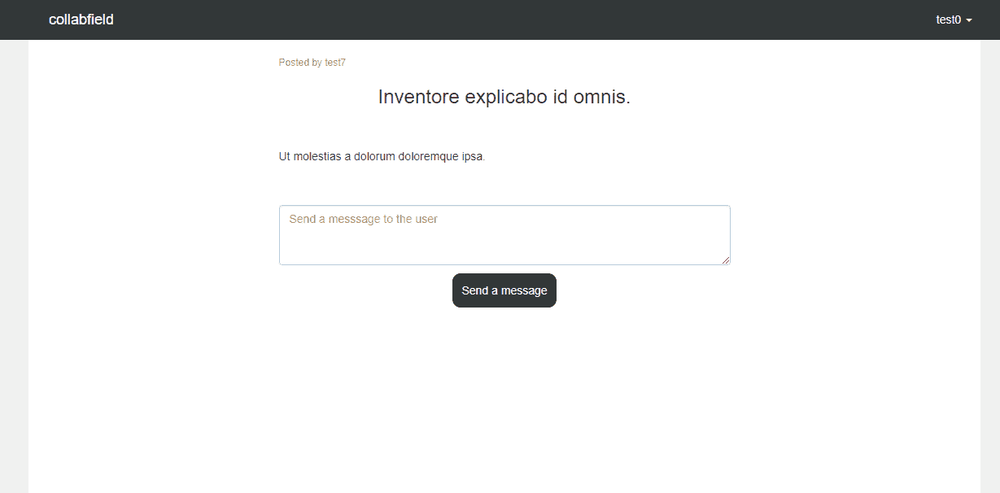**

**当你给文章的作者发送消息时，表单消失了**

**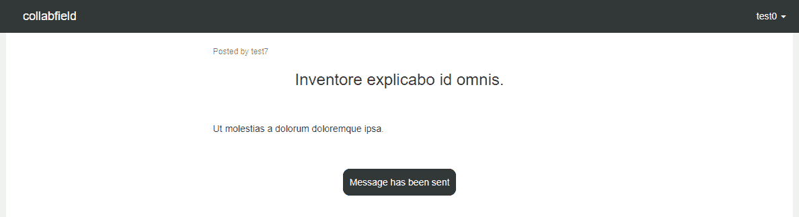**

**这就是当你已经和用户接触时的样子**

**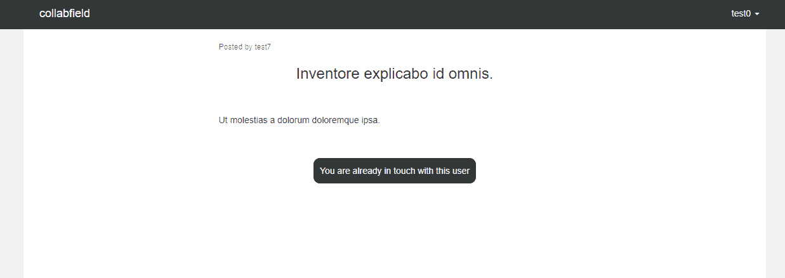**

**提交更改**

```
`git add -A
git commit -m "Add CSS to style the .contact-user form"`
```

****呈现对话窗口****

**我们发送了一条消息并创建了一个新对话。这是我们目前唯一的权力，我们不能做任何其他事情。迄今为止，这是一种多么无用的力量。我们需要一个对话窗口来读写消息。**

**将打开的对话 id 存储在会话中。这允许在应用程序中保持对话打开，直到用户关闭或破坏会话。**

**在`Private::ConversationsController`的`create`动作中，如果对话被成功保存，调用一个`add_to_conversations unless already_added?`方法。然后在`private`范围内定义方法**

```
`...
private

def add_to_conversations
  session[:private_conversations] ||= []
  session[:private_conversations] << @conversation.id
end`
```

**controllers/private/conversations_controller.rb**

**这将在会话中存储对话的 id。而`already_added?` private 方法将确保会话的 id 还没有被添加到会话中。**

```
`def already_added?
  session[:private_conversations].include?(@conversation.id)
end`
```

**controllers/private/conversations_controller.rb**

**最后，我们需要访问视图内部的对话，所以将`conversation`变量转换成一个实例变量。**

**现在我们可以开始为对话窗口构建一个模板。为窗口创建一个分部文件**

```
`<% @recipient = private_conv_recipient(conversation) %>
<% @is_messenger = false %>
<li class="conversation-window" 
    id="pc<%= conversation.id %>" 
    data-pconversation-user-name="<%= @recipient.name %>" 
    data-turbolinks-permanent>
  <div class="panel panel-default" data-pconversation-id="<%= conversation.id %>">
    <%= render 'private/conversations/conversation/heading', 
                conversation: conversation %>

    <!-- Conversation window's content -->
    <div class="panel-body">
      <%= render 'private/conversations/conversation/messages_list', 
                  conversation: conversation %>
      <%= render 'private/conversations/conversation/new_message_form', 
                  conversation: conversation,
                  user: user %>
    </div><!-- panel-body -->
  </div>
</li><!-- conversation-window -->`
```

**private/conversations/_conversation.html.erb**

**这里我们用`private_conv_recipient`方法得到了会话的接收者。在`Private::ConversationsHelper`中定义助手方法**

```
`...
# get the opposite user of the conversation
def private_conv_recipient(conversation)
  conversation.opposed_user(current_user)
end
...`
```

**helpers/private/conversations_helper.rb**

**使用`opposed_user`方法。转到`Private::Conversation`模型并定义方法**

```
`...
def opposed_user(user)
  user == recipient ? sender : recipient
end
...`
```

**models/private/conversation.rb**

**这将返回一个私人对话的反对用户。通过用规范覆盖它来确保该方法正确工作**

```
`...
context 'Methods' do
  it 'gets an opposed user of the conversation' do
    user1 = create(:user)
    user2 = create(:user)
    conversation = create(:private_conversation,
                           recipient_id: user1.id,
                           sender_id: user2.id)
    opposed_user = conversation.opposed_user(user1)
    expect(opposed_user).to eq user2
  end
end
...`
```

**spec/models/private/conversation_spec.rb**

**接下来，为`_conversation.html.erb`文件创建缺失的部分文件**

```
`<div class="panel-heading conversation-heading">
  <span class="contact-name-notif"><%= @recipient.name %></span>  
</div> <!-- conversation-heading -->

<!-- Close conversation button -->
<%= link_to "X", 
            close_private_conversation_path(conversation), 
            class: 'close-conversation', 
            title: 'Close', 
            remote: true, 
            method: :post %>`
```

**private/conversations/conversation/_heading.html.erb**

```
`<div class="messages-list">
  <%= render load_private_messages(conversation), conversation: conversation %>
  <div class="loading-more-messages">
    <i class="fa fa-spinner" aria-hidden="true"></i>
  </div>
  <!-- messages -->
  <ul>
  </ul>
</div>`
```

**private/conversations/conversation/_messages_list.html.erb**

**在`Private::ConversationsHelper`中，定义`load_private_messages`助手方法**

```
`...
# if the conversation has unshown messages, show a button to get them
def load_private_messages(conversation)
  if conversation.messages.count > 0 
    'private/conversations/conversation/messages_list/link_to_previous_messages'
  else
    'shared/empty_partial'
  end 
end
...`
```

**helpers/private/conversations_helper.rb**

**这将添加一个链接来加载以前的消息。在新的`messages_list`目录中创建相应的部分文件**

```
`<%= link_to "Load messages", 
            private_messages_path(:conversation_id => conversation.id, 
                                  :messages_to_display_offset => @messages_to_display_offset,
                                  :is_messenger => @is_messenger),
            class: 'load-more-messages', 
            remote: true %>`
```

**private/conversations/conversation/messages_list/_link_to_previous_messages.html.erb**

**不要忘记确保该方法一切正常，并为其编写规范**

```
`...
context '#load_private_messages' do
  let(:conversation) { create(:private_conversation) }

  it "returns load_messages partial's path" do
    create(:private_message, conversation_id: conversation.id)
    expect(helper.load_private_messages(conversation)).to eq (
      'private/conversations/conversation/messages_list/link_to_previous_messages'
    )
  end

  it "returns empty partial's path" do
    expect(helper.load_private_messages(conversation)).to eq (
      'shared/empty_partial'
    )
  end
end
...`
```

**spec/helpers/private/conversations_helper_spec.rb**

**因为 conversations 的窗口将在整个应用程序中呈现，这意味着我们需要访问`Private::ConversationsHelper` helper 方法。要在整个应用程序中访问所有这些方法，在`ApplicationHelper`中添加**

```
`include Private::ConversationsHelper`
```

**然后为会话的新消息表单创建最后一个缺失的部分文件**

```
`<form class="send-private-message">
  <input name="conversation_id" type="hidden" value="<%= conversation.id %>">
  <input name="user_id" type="hidden" value="<%= user.id %>">
  <textarea name="body" rows="3" class="form-control" placeholder="Type a message..."></textarea>
  <input type="submit" class="btn btn-success send-message">
</form>`
```

**private/conversations/conversation/_new_message_form.html.erb**

**稍后我们会让这个表单发挥作用。**

**现在，让我们创建一个功能，在用户通过个人帖子发送消息后，应用程序上会显示对话窗口。**

**在`_success.js.erb`文件中**

```
`posts/show/contact_user/message_form/_success.js.erb`
```

**增加**

```
`<%= render 'private/conversations/open' %>`
```

**这个部分文件的目的是给应用程序添加一个对话窗口。定义部分文件**

```
`var conversation = $('body').find("[data-pconversation-id='" + 
                                "<%= @conversation.id %>" + 
                                "']");
var chat_windows_count = $('.conversation-window').length + 1;

if (conversation.length !== 1) {
  $('body').append("<%= j(render 'private/conversations/conversation',\
                                  conversation: @conversation,\
                                  user: current_user) %>");
  conversation = $('body').find("[data-conversation-id='" + 
                                "<%= @conversation.id %>" + 
                                "']");
}

// Toggle conversation window after its creation
$('.conversation-window:nth-of-type(' + chat_windows_count + ')\
   .conversation-heading').click();
// mark as seen by clicking it
setTimeout(function(){ 
  $('.conversation-window:nth-of-type(' + chat_windows_count + ')').click();
 }, 1000);
// focus textarea
$('.conversation-window:nth-of-type(' + chat_windows_count + ')\
   form\
   textarea').focus();

// repositions all conversation windows
positionChatWindows();`
```

**private/conversations/_open.js.erb**

**这个回调部分文件将在多个场景中重用。为了避免多次渲染同一个窗口，在渲染窗口之前，我们检查它是否已经存在于应用程序中。然后我们扩展窗口，自动聚焦消息表单。在文件的底部，调用了`positionChatWindows()`函数来确保所有对话的窗口都定位正确。如果我们不定位它们，它们将会在同一个地方被渲染，这当然是不可用的。**

**现在在`assets`目录中创建一个文件，它将负责对话的窗口可见性和定位**

```
`$(document).on('turbolinks:load', function() { 
    chat_windows_count = $('.conversation-window').length;
    // if the last visible chat window is not set and conversation windows exist
    // set the last_visible_chat_window variable
    if (gon.last_visible_chat_window == null && chat_windows_count > 0) {
        gon.last_visible_chat_window = chat_windows_count;
    }
    // if gon.hidden_chats doesn't exist, set its value
    if (gon.hidden_chats == null) {
        gon.hidden_chats = 0;
    }
    window.addEventListener('resize', hideShowChatWindow);

    positionChatWindows();
    hideShowChatWindow();
});

function positionChatWindows() {
    chat_windows_count = $('.conversation-window').length;
    // if a new conversation window was added, 
    // set it as the last visible conversation window
    // so the hideShowChatWindow function can hide or show it, 
    // depending on the viewport's width
    if (gon.hidden_chats + gon.last_visible_chat_window !== chat_windows_count) {
        if (gon.hidden_chats == 0) {
            gon.last_visible_chat_window = chat_windows_count;
        }
    }

    // when a new chat window is added, position it to the most left of the list
    for (i = 0; i < chat_windows_count; i++ ) {
        var right_position = i * 410;
        var chat_window = i + 1;
        $('.conversation-window:nth-of-type(' + chat_window + ')')
            .css('right', '' + right_position + 'px');
    }
}

// Hides last conversation window whenever it is close to viewport's left side
function hideShowChatWindow() {
    // if there are no conversation windows, stop the function
    if ($('.conversation-window').length < 1) {
        return;
    }
    // get an offsset of the most left conversation window
    var offset = $('.conversation-window:nth-of-type(' + gon.last_visible_chat_window + ')').offset();
    // if the left offset of the conversation window is less than 50, 
    // hide this conversation window
    if (offset.left < 50 && gon.last_visible_chat_window !== 1) {
        $('.conversation-window:nth-of-type(' + gon.last_visible_chat_window + ')')
            .css('display', 'none');
        gon.hidden_chats++;
        gon.last_visible_chat_window--;
    }
    // if the offset of the most left conversation window is more than 550 
    // and there is a hidden conversation, show the hidden conversation
    if (offset.left > 550 && gon.hidden_chats !== 0) {
        gon.hidden_chats--;
        gon.last_visible_chat_window++;
        $('.conversation-window:nth-of-type(' + gon.last_visible_chat_window + ')')
            .css('display', 'initial');
    }
}`
```

**assets/javascripts/conversations/position_and_visibility.js**

**我们可以使用 [gon](https://github.com/gazay/gon) gem，而不是创建自己的函数来设置和获取 cookies 或类似的方法来管理 JavaScript 之间的数据。这个 gem 最初的用途是从服务器端向 JavaScript 发送数据。但我也发现它对跟踪应用程序中的 JavaScript 变量很有用。通过阅读说明安装和设置 gem。**

**我们用一个事件监听器跟踪视口的宽度。当对话靠近视口的左侧时，对话会被隐藏。一旦隐藏的对话窗口有足够的空闲空间，应用程序就会再次显示它。**

**在页面访问中，我们调用定位和可见性函数来确保所有对话的窗口都在正确的位置。**

**我们使用 bootstrap 的面板组件来轻松地展开和折叠对话窗口。默认情况下，它们会被折叠起来，根本不会进行交互。为了使它们可切换，在`javascripts`目录中创建一个新文件`toggle_window.js`**

```
`$(document).on('turbolinks:load', function() { 

    // when conversation heading is clicked, toggle conversation
    $('body').on('click', 
    	         '.conversation-heading, .conversation-heading-full', 
    	         function(e) {
        e.preventDefault();
        var panel = $(this).parent();
        var panel_body = panel.find('.panel-body');
        var messages_list = panel.find('.messages-list');

        panel_body.toggle(100, function() {
        }); 
    });
});`
```

**javascripts/conversations/toggle_window.js**

**创建一个新的`conversation_window.scss`文件**

```
`assets/stylesheets/partials/conversation_window.scss`
```

**并将 CSS 添加到样式对话的窗口中**

```
`textarea {
  resize: none;
}

.panel {
  margin: 0;
  border: none !important;
}

.panel-heading {
  border-radius: 0;
}

.panel-body {
  position: relative;
  display: none;
  padding: 0 0 5px 0;
}

.conversation-window, .new_chat_window {
  min-width: 400px;
  max-width: 400px;
  position: fixed;
  bottom: 0;
  right: 0;
  list-style-type: none;
}

.conversation-heading, .conversation-heading-full, .new_chat_window {
  background-color: $navbarColor !important;
  color: white !important;
  height: 40px;
  border: none !important;
  a {
    color: white !important;
  }

}

.conversation-heading, .conversation-heading-full {
  padding: 0 0 0 15px;
  width: 360px;
  display: inline-block;
  vertical-align: middle;
  line-height: 40px;
}

.close-conversation, .add-people-to-chat, .add-user-to-contacts, .contact-request-sent {
  color: white;
  float: right;
  height: 40px;
  width: 40px;
  font-size: 20px;
  font-size: 2.0rem;
  border: none;
  background-color: $navbarColor;
}

.close-conversation, .add-user-to-contacts {
  text-align: center;
  vertical-align: middle;
  line-height: 40px;
  font-weight: bold;
}

.close-conversation {
  &:hover {
    border: none;
    background-color: white;
    color: $navbarColor !important;
  }
  &:visited, &:focus {
    color: white;
  }
}

.form-control[disabled] {
  background-color: $navbarColor;
}

.send-private-message, .send-group-message {
  textarea {
    border-radius: 0;
    border: none;
    border-top: 1px solid rgba(0, 0, 0, 0.2);
  }
}

.loading_svg {
  display: none;
}

.loading_svg {
  text-align: center;
}

.messages-list {
  z-index: 1;
  min-height: 300px;
  max-height: 300px;
  overflow-y: auto;
  overflow-x: hidden;
  ul {
    padding: 0;
  }
}

.message-received, .message-sent {
  max-width: 300px;
  word-wrap: break-word;
  z-index: 1;
}

.message-sent {
  position: relative;
  background-color: white;
  border: 1px solid rgba(0, 0, 0, 0.5);
  border-radius: 5px;
  margin: 5px 5px 5px 50px;
  padding: 10px;
  float: right;
}

.message-received {
  background-color: $backgroundColor;
  border-color: #EEEEEE;
  border-radius: 5px;
  margin: 5px 50px 5px 5px;
  padding: 10px;
  float: left;
}

.messages-date {
  width: 100%; 
  text-align: center; 
  border-bottom: 1px solid rgba(0, 0, 0, 0.2);
  line-height: 1px; 
  line-height: 0.1rem;
  margin: 20px 0 20px;
  span {
    background: #fff; 
    padding: 0 10px; 
  }

}

.load-more-messages {
  display: none;
}

.loading-more-messages {
  font-size: 20px;
  font-size: 2.0rem;
  padding: 10px 0;
  text-align: center;
}

.send-message {
  display: none;
}`
```

**assets/stylesheets/partials/conversation_window.scss**

**您可能注意到，有些类尚未在任何 HTML 文件中定义。这是因为，我们将在`views`目录中创建的未来文件将具有已经存在的 HTML 元素的共享 CSS。在我们添加了任何次要的 HTML 元素之后，我没有多次来回跳转到 CSS 文件，而是包括了一些类，这些类现在在未来的 HTML 元素中定义。请记住，您始终可以转到样式表并分析特定样式的工作原理。**

**之前，我们已经在会话中保存了一个新创建的对话的 id。是时候利用它了，让对话窗口一直打开，直到用户关闭它或破坏会话。在`ApplicationController`里面定义一个过滤器**

```
`before_action :opened_conversations_windows`
```

**然后定义`opened_conversations_windows`方法**

```
`...
def opened_conversations_windows
  if user_signed_in?
    # opened conversations
    session[:private_conversations] ||= []
    @private_conversations_windows = Private::Conversation.includes(:recipient, :messages)
                                      .find(session[:private_conversations])
  else
    @private_conversations_windows = []
  end
end
...`
```

**controllers/application_controller.rb**

**`[includes](https://apidock.com/rails/ActiveRecord/QueryMethods/includes)`方法用于包含来自相关数据库表的数据。在不久的将来，我们将从对话中加载消息。如果我们不使用`includes`方法，我们就不会用这个查询加载对话的消息记录。这将导致一个 [N + 1 查询](https://secure.phabricator.com/book/phabcontrib/article/n_plus_one/)问题。如果我们没有用查询加载消息，那么将会为每个消息触发一个额外的查询。这将显著影响应用程序的性能。现在，我们只对任意数量的消息进行一次初始查询，而不是对 100 条消息进行 100 次查询。**

**在`application.html.erb`文件中，就在`yield`方法的下面，添加**

```
`...
<%= render 'layouts/application/private_conversations_windows' %>
...`
```

**layouts/application.html.erb**

**创建一个新的`application`目录，并在其中创建`_private_conversations_windows.html.erb`部分文件**

```
`<% private_conversations_windows.each do |conversation| %>
  <%= render partial: "private/conversations/conversation",
             locals: { conversation: conversation, 
                       user: current_user } %>
<% end %>`
```

**layouts/application/_private_conversations_windows.html.erb**

**现在，当我们浏览应用程序时，我们总是会看到打开的对话，不管我们在哪个页面。**

**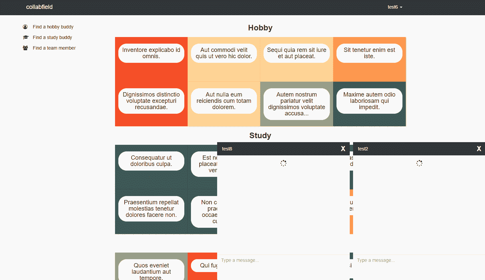**

**提交更改**

```
`git add -A
git commit -m "Render a private conversation window on the app
- Add opened conversations to the session
- Create a _conversation.html.erb file inside private/conversations
- Define a private_conv_recipient helper method in the
  private/conversations_helper.rb
- Define an opposed_user method in Private::Conversation model
  and add specs for it
- Create _heading.html.erb and _messages_list.html.erb files
  inside the private/conversations/conversation
- Define a load_private_messages in private/conversations_helper.rb
  and add specs for it
- Create a _new_message_form.html.erb inside the 
  private/conversations/conversation
- Create a _open.js.erbinside private/conversations
- Create a  position_and_visibility.js inside the
  assets/javascripts/conversations
- Create a  conversation_window.scss inside the
  assets/stylesheets/partials
- Define an opened_conversations_windows helper method in 
  ApplicationController
- Create a _private_conversations_windows.html.erb inside the
  layouts/application`
```

****结束对话****

**对话的“关闭”按钮还不起作用。但是我们已经做好了一切准备。在`Private::ConversationsController`中，定义一个`close`动作**

```
`...
def close
  @conversation_id = params[:id].to_i
  session[:private_conversations].delete(@conversation_id)

  respond_to do |format|
    format.js
  end
end
...`
```

**controllers/private/conversations_controller.rb**

**当单击关闭按钮时，将调用此操作。该操作从会话中删除会话的 id，然后用一个 js 部分文件作为响应，该文件与操作的名称相同。创建部分文件**

```
`$('body')
    .find("[data-pconversation-id='" + "<%= @conversation_id %>" + "']")
    .parent()
    .remove();
positionChatWindows();`
```

**private/conversations/close.js.erb**

**它从 DOM 中移除对话窗口，并重新定位其余的对话窗口。**

**提交更改**

```
`git add -A
git commit -m "Make the close conversation button functional
- Define a close action inside the Private::ConversationsController
- Create a close.js.erb inside the private/conversations"`
```

****渲染消息****

**目前在消息列表中，我们看到一个没有任何消息的加载图标。这是因为我们还没有为消息创建任何模板。在`views/private`目录中，创建一个`messages`目录。在目录中，创建一个新文件**

```
`<%= render private_message_date_check(message, previous_message),
           locals: { message: message } %>
<li title="<%= message.created_at.to_s(:time) %>">
  <div class="row">   
    <div class="<%= sent_or_received(message, user) %> <%= seen_or_unseen(message) %>">
      <%= message.body %>
    </div>
  </div>
</li>`
```

**private/messages/_message.html.erb**

**帮助器方法检查这个消息是否和前一个消息是在同一天写的。如果没有，它会用一个新日期呈现一个额外的行。在`Private::MessagesHelper`中定义助手方法**

```
`module Private::MessagesHelper 

  def private_message_date_check(message, previous_message)
    if defined?(previous_message) && previous_message.present? 
      # if messages are not created at the same day
      if previous_message.created_at.to_date != message.created_at.to_date
        @message = message
        'private/messages/message/new_date'
      else
        'shared/empty_partial'
      end 
    else
      'shared/empty_partial'
    end 
  end
end`
```

**helpers/private/messages_helper.rb**

**在`ApplicationHelper`中，包含`Private::MessagesHelper`，这样我们就可以通过应用程序访问它**

```
`include Private::MessagesHelper`
```

**为该方法编写规范。创建一个新的`messages_helper_spec.rb`文件**

```
`require 'rails_helper'
RSpec.describe Private::MessagesHelper, :type => :helper do
  context '#private_message_date_check' do
    let(:message) { create(:private_message) }
    let(:previous_message) { create(:private_message) }

    it "returns new_date partial's path" do
      message.update(created_at: 2.days.ago)
      expect(helper.private_message_date_check(message, previous_message)).to(
        eq 'private/messages/message/new_date'
      )
    end

    it "returns an empty partial's path" do
      expect(helper.private_message_date_check(message, previous_message)).to(
        eq 'shared/empty_partial'
      )
    end

    it "returns an empty partial's path" do
      previous_message = nil
      expect(helper.private_message_date_check(message, previous_message)).to(
        eq 'shared/empty_partial'
      )
    end
  end
end`
```

**spec/helpers/private/messages_helper_spec.rb**

**在一个新的`message`目录中，创建一个`_new_date.html.erb`文件**

```
`<div class="messages-date">
  <span><%= @message.created_at.to_date %></span> 
</div>`
```

**private/messages/message/_new_date.html.erb**

**然后在`_message.html.erb`文件中，我们有`sent_or_received`和`seen_or_unseen`助手方法。它们在不同的情况下返回不同的类。在`Private::MessagesHelper`中定义它们**

```
`...
def sent_or_received(message, user)
  user.id == message.user_id ? 'message-sent' : 'message-received'
end

def seen_or_unseen(message)
  message.seen == false ? 'unseen' : ''
end
...`
```

**helpers/private/messages_helper.rb**

**为他们写规格:**

```
`...
context '#sent_or_received' do
  let(:user) { create(:user) }
  let(:message) { create(:private_message) }
  it 'returns message-sent' do
    message.update(user_id: user.id)
    expect(helper.sent_or_received(message, user)).to eq 'message-sent'
  end

  it 'returns message-received' do
    expect(helper.sent_or_received(message, user)).to eq 'message-received'
  end
end

context '#seen_or_unseen' do
  let(:message) { create(:private_message) }
  it 'returns unseen' do
    message.update(seen: false)
    expect(helper.seen_or_unseen(message)).to eq 'unseen'
  end

  it 'returns nothing' do
    message.update(seen: true)
    expect(helper.seen_or_unseen(message)).to eq ''
  end
end
...`
```

**spec/helpers/private/messages_helper_spec.rb**

**现在我们需要一个组件将消息加载到消息列表中。此外，当用户向上滚动时，该组件将在列表顶部添加以前的消息，直到对话中没有消息。我们将会有一个无限滚动的消息机制，类似于我们在帖子页面中的机制。**

**在`views/private/messages`目录中创建一个`_load_more_messages.js.erb`文件:**

```
`<% @id_type = 'pc' %>
<%= render append_previous_messages_partial_path %>
<%= render replace_link_to_private_messages_partial_path %>`
```

**private/messages/_load_more_messages.js.erb**

**`@id_type`实例变量决定了对话的类型。在未来，我们不仅可以创建私人对话，还可以创建团体对话。这导致了两种类型之间的公共帮助器方法和部分文件。**

**在`helpers`目录中，创建一个`shared`目录。创建一个`messages_helper.rb`文件并定义一个助手方法**

```
`module Shared::MessagesHelper

  def append_previous_messages_partial_path
    'shared/load_more_messages/window/append_messages' 
  end

end`
```

**helpers/shared/messages_helper.rb**

**到目前为止，这种方法相当愚蠢。它只返回部分路径。稍后，当我们为我们的消息传递系统构建额外的功能时，我们将赋予它一些智能。现在，我们不能访问这个文件中定义的任何其他文件中的 helper 方法。我们必须将它们包含在其他助手文件中。在
T0 里面，包含了来自`Shared::MessagesHelper`的方法**

```
`require 'shared/messages_helper'
include Shared::MessagesHelper`
```

**在共享目录中，创建几个新目录:**

```
`shared/load_more_messages/window`
```

**然后创建一个 _append_messages.js.erb 文件:**

```
`// temporary remove load more messages link
// so it cannot be clicked if new messages aren't rendered yet
$('#<%= @id_type %><%= @conversation.id %> .load-more-messages')
    .replaceWith('<span class="load-more-messages"></span>');
// render previous messages
$('#<%= @id_type %><%= @conversation.id %> .messages-list ul')
    .prepend('<%= j render "#{@type}/conversations/messages" %>');
// after new messages are appended, leave a gap at the top of the scrollbar
$('#<%= @id_type %><%= @conversation.id %> .messages-list').scrollTop(400);`
```

**shared/load_more_messages/window/_append_messages.js.erb**

**这段代码负责将以前的消息追加到消息列表的顶部。然后在`Private::MessagesHelper`中定义另一个不那么有趣的 helper 方法**

```
`def replace_link_to_private_messages_partial_path
  'private/messages/load_more_messages/window/replace_link_to_messages'
end`
```

**helpers/private/messages_helper.rb**

**在`private/messages`目录中创建相应的目录，并创建一个`_add_link_to_messages.js.erb`文件**

```
`$('#<%= @id_type %><%= @conversation.id %> .load-more-messages')
    .replaceWith('\
        <%= j render partial: "private/conversations/conversation/messages_list/link_to_previous_messages",\
                     locals: { conversation: @conversation } %>\
    ');`
```

**private/messages/load_more_messages/window/_add_link_to_messages.js.erb**

**该文件将更新加载先前消息的链接。追加以前的消息后，该链接将被更新的链接替换，以加载以前的旧消息。**

**现在我们有了这个系统，以前的消息如何被附加到消息列表的顶部。但是，如果我们试图打开应用程序并打开对话窗口，我们将看不到任何呈现的消息。为什么？因为没有什么会触发链接加载以前的消息。当我们第一次打开对话窗口时，我们希望看到最近的消息。我们可以对对话窗口进行编程，一旦它展开，就会触发 load more messages 链接，以加载最近的消息。它启动附加先前消息并用更新的消息替换加载更多消息链接的第一个周期。**

**在`toggle_window.js`文件中，更新`toggle`函数来完成上面描述的任务**

```
`panel_body.toggle(100, function() {
    var messages_visible = $('ul', this).has('li').length;

    // Load first 10 messages if messages list is empty
    if (!messages_visible && $('.load-more-messages', this).length) {
        $('.load-more-messages', this)[0].click(); 
    }
});` 
```

**javascripts/conversations/toggle_window.js**

**创建一个事件处理程序，这样每当用户向上滚动并几乎到达消息列表的顶部时，就会触发加载更多消息链接。**

```
`$(document).on('turbolinks:load ajax:complete', function() {
    var iScrollPos = 0;
    var isLoading = false;
    var currentLoadingIcon;

    $(document).ajaxComplete(function() {
        isLoading = false;
        // hide loading icon
        if (currentLoadingIcon !== undefined) {
            currentLoadingIcon.hide();
        }
    });

    $('.messages-list', this).scroll(function () {
        var iCurScrollPos = $(this).scrollTop();

        if (iCurScrollPos > iScrollPos) {
            //Scrolling Down
        } else {
           //Scrolling Up
           if (iCurScrollPos < 300 && isLoading == false && $('.load-more-messages', this).length) {
                // trigger link, which loads 10 more messages
                $('.load-more-messages', this)[0].click();
                isLoading = true;

                // select conversation window's loading icon and show it
                currentLoadingIcon = $('.loading-more-messages', this);
                currentLoadingIcon.show();
           }
        }
        iScrollPos = iCurScrollPos;
    });
});`
```

**assets/javascripts/conversations/messages_infinite_scroll.js**

**当将要点击 load more messages 链接时，会调用一个`Private::MessagesController`的`index`动作。这就是我们为加载以前的消息链接定义的路径。创建控制器及其`index`动作**

```
`class Private::MessagesController < ActionController::Base
  include Messages

  def index
    get_messages('private', 10)
    @user = current_user
    @is_messenger = params[:is_messenger]
    respond_to do |format|
      format.js { render partial: 'private/messages/load_more_messages' }
    end
  end
end`
```

**controllers/private/messages_controller.rb**

**这里我们包括了来自`Messages`模块的方法。该模块存储在`concerns`目录中。 [ActiveSupport::Concern](http://api.rubyonrails.org/classes/ActiveSupport/Concern.html) 是其中的一个地方，在这里你可以存储模块，以后你可以在课堂上使用。在我们的例子中，我们从模块中为控制器添加了额外的方法。`get_messages`方法来自`Messages`模块。之所以将它存储在模块中，是因为稍后我们将在另一个控制器中使用完全相同的方法。为了避免代码重复，我们使该方法更加可重用。**

**我看到一些人抱怨`ActiveSupport::Concern`并建议根本不要使用它。我向那些人挑战在八角形中与我战斗。我开玩笑的:d .这是一个独立的应用程序，我们可以创建我们的应用程序，无论我们喜欢它。如果你不喜欢`concerns`，有很多其他方法可以创建可重用的方法。**

**创建模块**

```
`require 'active_support/concern'

module Messages
  extend ActiveSupport::Concern

  def get_messages(conversation_type, messages_amount)
    # convert a string into a constant, so the models can be called dynamically
    model = "#{conversation_type.capitalize}::Conversation".constantize
    @conversation = model.find(params[:conversation_id])
    # get previous messages of the conversation
    @messages = @conversation.messages.order(created_at: :desc)
                                      .limit(messages_amount)
                                      .offset(params[:messages_to_display_offset].to_i)
    # set a variable to get another previous messages of the conversation
    @messages_to_display_offset = params[:messages_to_display_offset].to_i + messages_amount

    @type = conversation_type.downcase
    # if messages are the last in the conversation, mark the variable as 0
    # so the load more messages link will be removed
    if @conversation.messages.count < @messages_to_display_offset
      @messages_to_display_offset = 0
    end
  end

end`
```

**controllers/concerns/messages.rb**

**这里我们需要`active_support/concern`，然后用`ActiveSupport::Concern`扩展我们的模块，所以 Rails 知道这是一个问题。**

**使用`[constantize](https://apidock.com/rails/String/constantize)`方法，我们通过输入一个字符串值来动态创建一个常量名称。我们动态地调用模型。同样的方法也将用于`Private::Conversation`和`Group::Conversation`车型。**

**在`get_messages`方法设置了所有必要的实例变量之后，`index`动作用`_load_more_messages.js.erb`部分文件进行响应。**

**最后，在消息被附加到消息列表的顶部之后，我们希望从对话窗口中移除加载图标。在`_load_more_messages.js.erb`文件的底部添加**

```
`<%= render remove_link_to_messages %>`
```

**现在在`Shared::MessagesHelper`中定义`remove_link_to_messages`助手方法**

```
`# if there are no previous messages
def remove_link_to_messages
  if @is_messenger == 'false'
    if @messages_to_display_offset != 0
      'shared/empty_partial'
    else
      'shared/load_more_messages/window/remove_more_messages_link' 
    end
  else
    'shared/empty_partial'
  end
end`
```

**helpers/shared/messages_helper.rb**

**尝试自己编写方法的规范。**

**创建`_remove_more_messages_link.js.erb`部分文件**

```
`$('#<%= @id_type %><%= @conversation.id %> .loading-more-messages')
    .replaceWith('');
$('#<%= @id_type %><%= @conversation.id %> .load-more-messages')
.replaceWith('');`
```

**shared/load_more_messages/window/_remove_more_messages_link.js.erb**

**现在，在没有以前的消息留下的情况下，到以前的消息的链接和加载图标将被移除。**

**如果您现在尝试联系某个用户，将会出现一个对话窗口，其中包含您发送的消息。我们能够通过 AJAX 请求呈现消息。**

**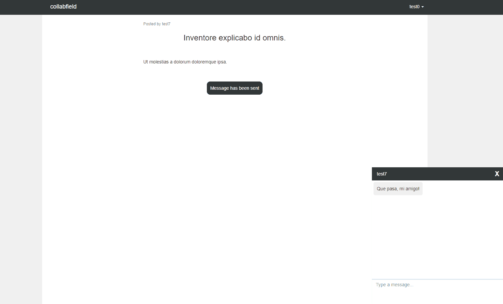**

**提交更改。**

```
`git add -A
git commit -m "Render messages with AJAX

- Create a _message.html.erb inside private/messages
- Define a private_message_date_check helper method in 
  Private::MessagesHelper and write specs for it
- Create a _new_date.html.erb inside private/messages/message
- Define sent_or_received and seen_or_unseen helper methods in
  Private::MessagesHelper and write specs for them
- Create a _load_more_messages.js.erb inside private/messages
- Define an  append_previous_messages_partial_path helper method in
  Shared::MessagesHelper
- Create a _append_messages.js.erb inside
  shared/load_more_messages/window
- Define a  replace_link_to_private_messages_partial_path in
  Private::MessagesHelper
- Create a _add_link_to_messages.js.erb inside 
  private/messages/load_more_messages/window
- Create a toggle_window.js inside javascripts/conversations
- Create a messages_infinite_scroll.js inside
  assets/javascripts/conversations
- Define an index action inside the Private::MessagesController
- Create a messages.rb inside controllers/concerns
- Define a remove_link_to_messages inside helpers/shared
- Create a _remove_more_messages_link.js.erb inside 
  shared/load_more_messages/window"`
```

#### ****通过行动电缆实现实时功能****

**对话窗口看起来已经很整洁了。它们也有一些可爱的功能。但是，它们缺少最重要的功能——实时发送和接收信息的能力。**

**如前所述， [Action Cable](http://guides.rubyonrails.org/action_cable_overview.html) 将允许我们实现所需的实时对话功能。您应该浏览一下文档，了解它是如何工作的。**

**我们应该做的第一件事是创建一个 WebSocket 连接并订阅一个特定的频道。幸运的是，默认的 Rails 配置已经包含了 WebSocket 连接。在`app/channels/application_cable`目录中，你可以看到`channel.rb`和`connection.rb`文件。`Connection`类负责认证，`Channel`类是一个父类，用于存储所有通道之间的共享逻辑。**

**默认情况下设置连接。现在我们需要订阅一个私人对话频道。生成命名空间通道**

```
`rails g channel private/conversation`
```

**在生成的`Private::ConversationChannel`中，我们看到了`subscribed`和`unsubscribed`方法。使用`subscribed`方法，用户创建一个到通道的连接。使用`unsubscribed`方法，很明显，用户破坏了连接。**

**更新这些方法:**

```
`...
def subscribed
  stream_from "private_conversations_#{current_user.id}"
end

def unsubscribed
  stop_all_streams
end
...`
```

**channels/private/conversation_channel.rb**

**在这里，我们希望用户拥有自己独特的频道。用户将从该信道接收和发送数据。因为用户的 id 是唯一的，所以我们通过添加一个用户 id 来使频道是唯一的。**

**这是服务器端连接。现在我们也需要在客户端创建一个连接。**

**为了在客户端创建连接的实例，我们必须编写一些 JavaScript。实际上，Rails 已经用通道生成器创建了它。导航到`assets/javascripts/channels/private`，默认情况下 Rails 会生成`CoffeeScript`文件。我将在这里使用 JavaScript。因此，将该文件重命名为`conversation.js`，并将其内容替换为:**

```
`App.private_conversation = App.cable.subscriptions.create("Private::ConversationChannel", {
    connected: function() {},
    disconnected: function() {},
    received: function(data) {}
});`
```

**assets/javascripts/channels/private/conversation.js**

**重启服务器，进入应用程序，登录并检查服务器日志。**

**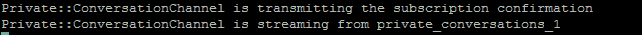**

**我们找到联系了。设置了实时通信的核心。我们有一个持续开放的客户端-服务器连接。这意味着我们可以从服务器发送和接收数据，而无需重新启动连接或刷新浏览器，伙计！当你想到它的时候，它真的很强大。从现在开始，我们将围绕这个连接构建消息传递系统。**

**提交更改。**

```
`git add -A
git commit -m "Create a unique private conversation channel and subscribe to it"`
```

**让我们使对话窗口的新消息表单起作用。在`assets/javascripts/channels/private/conversations.js`文件的底部添加这个函数:**

```
`...
$(document).on('submit', '.send-private-message', function(e) {
    e.preventDefault();
    var values = $(this).serializeArray();
    App.private_conversation.send_message(values);
    $(this).trigger('reset');
});`
```

**assets/javascripts/channels/private/conversation.js**

**该函数将从新的消息表单中获取值，并将它们传递给一个`send_message`函数。`send_message`函数将调用服务器端的`send_message`方法，该方法将负责创建新消息。**

**还要注意，事件处理程序在提交按钮上，但是在对话窗口中我们没有任何可见的提交按钮。这是一个设计选择。我们必须对对话窗口进行编程，使得当点击键盘上的回车键时，提交按钮被触发。这个函数将来会被其他特性使用，所以在`assets/javascripts/conversations`目录中创建一个`conversation.js`文件**

```
`$(document).on('turbolinks:load', function() { 

    // leave a gap at the top of the conversation windows' scrollbar
    $('.messages-list').scrollTop(500);

    // send a message on Enter key click and leave textarea in its original state
    $(document).on('keydown', 
                   '.conversation-window, .conversation',
                   function(event) {
        if (event.keyCode === 13) {
            // if textarea window is not empty
            if ($.trim($('textarea', this).val())) {
                $('.send-message', this).click();
                event.target.value = "";
                event.preventDefault();
            }  
        }
    });

});

function calculateUnseenConversations() {
    var unseen_conv_length = $('#conversations-menu').find('.unseen-conv').length;
    if (unseen_conv_length) {
        $('#unseen-conversations').css('visibility', 'visible');
        $('#unseen-conversations').text(unseen_conv_length);
    } else {
        $('#unseen-conversations').css('visibility', 'hidden');
        $('#unseen-conversations').text('');
    }
}`
```

**assets/javascripts/conversations/conversation.js**

**在文件中，我们描述了对话窗口的一些一般行为。第一个行为是让滚动条远离顶部，这样以前的消息就不会在不需要的时候被加载。第二个函数确保提交按钮在点击回车键时被触发，然后将输入的值清除回一个空字符串。**

**首先在`private_conversation`对象中创建`send_message`函数。把它加在`received`回调函数下面**

```
`...
send_message: function(message) {
    return this.perform('send_message', {
        message: message
    });
}`
```

**assets/javascripts/channels/private/conversation.js**

**这会调用服务器端的`send_message`方法并传递消息值。服务器端方法应该在`Private::ConversationChannel`中定义。定义方法:**

```
`...
def send_message(data)
  message_params = data['message'].each_with_object({}) do |el, hash|
    hash[el['name']] = el['value']
  end
  Private::Message.create(message_params)
end`
```

**channels/private/conversation_channel.rb**

**这将负责新消息的创建。从传递的参数中得到的`data`参数是一个嵌套的散列。因此，为了将这种嵌套的复杂性减少到单个散列中，使用了`[each_with_object](https://apidock.com/rails/Enumerable/each_with_object)`方法。**

**如果您尝试在对话窗口内发送新消息，实际上会创建一个新的消息记录。它不会立即显示在对话窗口上，只有在你刷新网站时才会显示。它会显示出来，但我们没有设置任何东西来广播新创建的消息到私人对话的频道。我们一会儿就实施它。但是在我们继续并提交更改之前，请快速回顾一下当前消息传递系统是如何工作的。**

1.  **用户填写新消息表单并提交消息**
2.  **`javascripts/channels/private/conversations.js`内部的事件处理程序获取对话窗口的数据、对话 id 和消息值，并触发客户端`send_message`函数上的通道实例。**

**3.客户端的`send_message`函数调用服务器端的`send_message`方法并向其传递数据**

**4.客户端的`send_message`方法处理提供的数据并创建新的`Private::Message`记录**

**提交更改。**

```
`git add -A
git commit -m "Make a private conversation window's new message form functional
- Add an event handler inside the
  javascripts/channels/private/conversation.js to trigger the submit button
- Define a common behavior among conversation windows inside the
  assets/javascripts/conversations/conversation.js
- Define a send_message function on both, client and server, sides"`
```

****广播新消息****

**在一个新的消息被创建后，我们想以某种方式把它广播到一个相应的频道。嗯，[主动记录回调](http://guides.rubyonrails.org/active_record_callbacks.html)为我们提供了大量有用的模型回调方法。有一个`after_create_commit`回调方法，每当一个新模型的记录被创建时运行。在`Private::Message`模型的文件中添加**

```
`...
after_create_commit do 
  Private::MessageBroadcastJob.perform_later(self, previous_message)
end

def previous_message
  previous_message_index = self.conversation.messages.index(self) - 1
  self.conversation.messages[previous_message_index]
end
...`
```

**models/private/message.rb**

**如您所见，在记录创建之后，`Private::MessageBroadcastJob.perform_later`被调用。那是什么？是后台工作，处理后端运营。它允许我们随时运行某些操作。它可以在特定事件发生后立即运行，也可以安排在事件发生后的某个时间运行。如果你不熟悉背景工作，查看[活动工作基础](http://guides.rubyonrails.org/active_job_basics.html)。**

**添加`previous_message`方法的规格。如果您现在要尝试运行规范，请注释掉`after_create_commit`方法。我们还没有定义`Private::MessageBroadcastJob`，所以目前的规范会产生一个未定义的常量错误。**

```
`...
context 'Methods' do
  it 'gets a previous message' do
    conversation = create(:private_conversation)
    message1 = create(:private_message, conversation_id: conversation.id)
    message2 = create(:private_message, conversation_id: conversation.id)
    expect(message2.previous_message).to eq message1
  end
end
...`
```

**spec/models/private/message_spec.rb**

**现在，我们可以创建一个后台作业，它会将新创建的消息广播到私人对话的频道。**

```
`rails g job private/message_broadcast`
```

**在文件内部，我们看到一个`perform`方法。默认情况下，当您调用作业时，会调用此方法。现在在作业内部，处理给定的数据并将其广播给通道的订户。**

```
`class Private::MessageBroadcastJob < ApplicationJob
  queue_as :default

  def perform(message, previous_message)
    sender = message.user
    recipient = message.conversation.opposed_user(sender)

    broadcast_to_sender(sender, recipient, message, previous_message)
    broadcast_to_recipient(sender, recipient, message, previous_message)
  end

  private

  def broadcast_to_sender(sender, recipient, message, previous_message)
    ActionCable.server.broadcast(
      "private_conversations_#{sender.id}",
      message: render_message(message, previous_message, sender),
      conversation_id: message.conversation_id,
      recipient_info: recipient
    )
  end

  def broadcast_to_recipient(sender, recipient, message, previous_message)
    ActionCable.server.broadcast(
      "private_conversations_#{recipient.id}",
      recipient: true,
      sender_info: sender,
      message: render_message(message, previous_message, recipient),
      conversation_id: message.conversation_id
    )
  end

  def render_message(message, previous_message, user)
    ApplicationController.render(
      partial: 'private/messages/message',
      locals: { message: message, 
                previous_message: previous_message, 
                user: user }
    )
  end
end`
```

**jobs/private/message_broadcast_job.rb**

**在这里，我们呈现一条消息，并将其发送给两个通道的订阅者。我们还传递了一些额外的键值对来正确显示消息。如果我们尝试发送一条新消息，用户将会收到数据，但该消息不会被追加到消息列表中。不会有明显的变化。**

**当数据被广播到一个通道时，客户端的`received`回调函数被调用。这就是我们有机会向 DOM 添加数据的地方。在`received`函数中添加以下代码:**

```
`...
received: function(data) {
    // if a link to the conversation in the conversations menu list exists
    // move the link to the top of the conversations menu list
    var conversation_menu_link = $('#conversations-menu ul')
                                     .find('#menu-pc' + data['conversation_id']);
    if (conversation_menu_link.length) {
        conversation_menu_link.prependTo('#conversations-menu ul');
    }

    // set variables
    var conversation = findConv(data['conversation_id'], 'p');
    var conversation_rendered = ConvRendered(data['conversation_id'], 'p');
    var messages_visible = ConvMessagesVisiblity(conversation);

    if (data['recipient'] == true) {
        // mark conversation as unseen, after new message is received
        $('#menu-pc' + data['conversation_id']).addClass('unseen-conv');
        // if conversation window exists
        if (conversation_rendered) {
            if (!messages_visible) {
            // change style of conv window when there are unseen messages
            // add an additional class to the conversation's window or something
            }
            conversation.find('.messages-list').find('ul').append(data['message']);
        }
        calculateUnseenConversations();
    }
    else {
        conversation.find('ul').append(data['message']);
    }

    if (conversation.length) {
        // after a new message was appended, scroll to the bottom of the conversation window
        var messages_list = conversation.find('.messages-list');
        var height = messages_list[0].scrollHeight;
        messages_list.scrollTop(height);
    }
}
...`
```

**assets/javascripts/channels/private/conversation.js**

**在这里，我们看到发送者和接收者得到了稍微不同的对待。**

```
`// change style of conv window when there are unseen messages
// add an additional class to the conversation's window or something`
```

**我特意创建了这个，所以每当一个对话有看不见的消息时，你可以随心所欲地设计它的窗口。你可以改变窗口的颜色，让它闪烁，或者你想做的任何事情。**

**还使用了`findConv`、`ConvRendered`、`ConvMessagesVisibility`功能。我们将把这些功能用于两种类型的聊天，私人聊天和群组聊天。**

**创建一个`shared`目录:**

```
`assets/javascripts/channels/shared`
```

**在这个目录中创建一个`conversation.js`文件。**

```
`// finds a conversation in the DOM
function findConv(conversation_id, type) {
    // if a current conversation is opened in the messenger
    var messenger_conversation = $('body .conversation');
    if (messenger_conversation.length) {
        // conversation is opened in the messenger
        return messenger_conversation;
    } else { 
        // conversation is opened in a popup window
        var data_attr = "[data-" + type + "conversation-id='" + 
                         conversation_id + 
                         "']";
        var conversation = $('body').find(data_attr);
        return conversation;
    }
}

// checks if a conversation window is rendered and visible on a browser
function ConvRendered(conversation_id, type) {
    // if a current conversation is opened in the messenger
    if ($('body .conversation').length) {
        // conversation is opened in the messenger
        // so it automatically means that is visible
        return true;
    } else { 
        // conversation is opened in a popup window
        var data_attr = "[data-" + type + "conversation-id='" + 
                         conversation_id + 
                         "']";
        var conversation = $('body').find(data_attr);
        return conversation.is(':visible');
    }
}

function ConvMessagesVisiblity(conversation) {
    // if current conversation is opened in the messenger
    if ($('body .conversation').length) {
        // conversation is opened in the messenger
        // so it is automatically means that messages are visible
        return true;
    } else {
        // conversation is opened in a popup window
        // check if the window is collapsed or expanded
        var visibility = conversation
                             .find('.panel-body')
                             .is(':visible');
        return visibility;
    }
}`
```

**assets/javascripts/channels/shared/conversation.js**

**法典中多次提到信使，但我们还没有信使。messenger 将成为开启对话的一种独立方式。为了防止将来出现很多小的变化，我现在已经在 messenger 中包含了案例。**

**就是这样，实时功能应该工作。发送方和接收方这两个用户都应该在 DOM 上接收并显示新消息。当我们发送一条新消息时，我们应该看到它立即被添加到消息列表中。但是现在有一个小问题。我们只有一种方法来呈现对话窗口。它仅在创建对话时呈现。我们稍后将添加其他方法来呈现对话窗口。但在此之前，让我们回顾一下数据如何到达频道的订户。**

1.  **在一个新的`Private::Message`记录被创建后，`after_create_commit`方法被触发，它调用后台作业**
2.  **处理给定的数据并将其广播给频道的用户**
3.  **在客户端，调用`received`回调函数，将数据追加到 DOM 中**

**提交更改。**

```
`git add -A
git commit -m "Broadcast a new message
- Inside the Private::Message define an after_create_comit callback method.
- Create a Private::MessageBroadcastJob
- Define a received function inside the
  assets/javascripts/channels/private/conversation.js
- Create a conversation.js inside the
  assets/javascripts/channels/shared"`
```

#### ****导航栏更新****

**在导航栏上，我们将呈现一个用户对话列表。当打开对话列表时，我们希望看到按最新消息排序的对话。包含最新消息的对话将位于列表顶部。这个列表应该在整个应用程序中都是可访问的。所以在`ApplicationController`中，将有序的用户对话存储在一个实例变量中。我建议的方法是在控制器内部定义一个`all_ordered_conversations`方法**

```
`def all_ordered_conversations 
  if user_signed_in?
    @all_conversations = OrderConversationsService.new({user: current_user}).call
  end
end`
```

**controllers/application_controller.rb**

**添加一个`before_action`过滤器，这样`@all_conversations`实例变量就随处可用。**

```
`before_action :all_ordered_conversations`
```

**然后创建一个`OrderConversationsService`来处理对话的查询和排序。**

```
`class OrderConversationsService

  def initialize(params)
    @user = params[:user]
  end

  # get and order conversations by last messages' dates in descending order
  def call
    all_private_conversations = Private::Conversation.all_by_user(@user.id)
                                                     .includes(:messages)
    return all_conversations = all_private_conversations.sort{ |a, b| 
      b.messages.last.created_at <=> a.messages.last.created_at
    }
  end

end`
```

**services/order_conversations_service.rb**

**目前这项服务只处理私人对话，这是我们目前为止开发的唯一类型的对话。未来，我们将把私人和群组对话融合在一起，并根据它们的最新消息进行分类。方法用于对一组对话进行排序。同样，如果我们不使用`includes`方法，我们会遇到 N + 1 查询问题。因为当我们对对话进行排序时，我们会检查每个对话的最新消息的创建日期并进行比较。这就是我们在查询中包含消息记录的原因。**

**`<=>`运算符评估哪个`created_at`值更高。如果我们使用
`a <=> b`，它将给定的数组按升序排序。当您以相反的方式计算值时，`b <=> a`，它以降序对数组进行排序。**

**我们还没有在`Private::Conversation`模型中定义`all_by_user`的范围。打开模型并定义范围:**

```
`...
scope :all_by_user, -> (user_id) do
  where(recipient_id: user_id).or(where(sender_id: user_id))
end
...`
```

**models/private/conversation.rb**

**撰写服务和范围的规格:**

```
`context 'Scopes' do
  it "gets all user's conversations" do
    create_list(:private_conversation, 5)
    user = create(:user)
    create_list(:private_conversation, 2, recipient_id: user.id)
    create_list(:private_conversation, 2, sender_id: user.id)
    conversations = Private::Conversation.all_by_user(user.id)
    expect(conversations.count).to eq 4
  end 
end`
```

**spec/models/private/conversation_spec.rb**

```
`require 'rails_helper'
require './app/services/order_conversations_service.rb'

describe OrderConversationsService do
  context '#call' do
    it 'returns ordered conversations in descending order' do
      user = create(:user)
      conversation1 = create(:private_conversation,
                              sender_id: user.id,
                              messages: [create(:private_message)])
      conversation2 = create(:private_conversation,
                              sender_id: user.id,
                              messages: [create(:private_message)])
      conversations = [conversation2, conversation1]
      expect(OrderConversationsService.new({user: user}).call).to eq conversations
    end
  end
end`
```

**spec/services/order_conversations_service_spec.rb**

**提交更改。**

```
`git add -A
git commit -m "
- Create an OrderConversationsService and add specs for it
- Define an all_by_user scope inside the Private::Conversation
  model and add specs for it"`
```

**现在在视图内部，我们可以访问一系列有序的对话。让我们呈现他们的链接列表。每当用户点击它们中的任何一个，应用程序上就会呈现一个对话窗口。如果您还记得，我们的导航栏有两个主要组件。在一个组件中，元素不断显示。在另一个组件中，元素在较小的设备上折叠。因此，在导航标题中，组件始终可见，我们将创建一个对话下拉菜单。通常，为了防止拥有一个大的视图文件，将它分割成多个较小的文件。**

**打开导航的`_header.html.erb`文件，将其内容替换为以下内容:**

```
`<div class="navbar-header">
  <% nav_header_content_partials.each do |partial_path| %>
    <%= render partial: partial_path %>
  <% end %>
</div><!-- navbar-header -->`
```

**layouts/navigation/_header.html.erb**

**现在创建一个包含一个`_toggle_button.html.erb`文件的`header`目录**

```
`<button type="button" 
        class="navbar-toggle collapsed" 
        data-toggle="collapse" 
        data-target="#navbar-collapsible-content" 
        aria-expanded="false">
  <span class="sr-only">Toggle navigation</span>
  <span class="icon-bar"></span>
  <span class="icon-bar"></span>
  <span class="icon-bar"></span>
</button>`
```

**layouts/navigation/header/_toggle_button.html.erb**

**这是一个切换按钮，以前位于`_header.html.erb`文件内。在`header`目录中创建另一个文件**

```
`<%= link_to 'collabfield', root_path, class: 'navbar-brand' %>
<%= link_to root_path, class: 'navbar-brand brand-mobile' do %>
	<i class="fa fa-home" aria-hidden="true"></i>
<% end %>`
```

**layouts/navigation/header/_home_button.html.erb**

**这是`_header.html.erb`的 home 键。这里还有一个额外的链接。在较小的设备上，我们将显示一个图标，而不是应用程序的名称。**

**回头看看`_header.html.erb`文件。有一个助手方法`nav_header_content_partials`，它返回部分路径的数组。我们不只是一个接一个的渲染部分的原因是因为数组在不同的情况下会有所不同。`NavigationHelper`里面定义了方法**

```
`# render the navigation header's content
def nav_header_content_partials
  partials = []
  if params[:controller] == 'messengers' 
    partials << 'layouts/navigation/header/messenger_header'
  else # controller is not messengers  
    partials << 'layouts/navigation/header/toggle_button'
    partials << 'layouts/navigation/header/home_button'
    partials << 'layouts/navigation/header/dropdowns' if user_signed_in?
  end
  partials
end`
```

**helpers/navigation_helper.rb**

**为`navigation_helper_spec.rb`中的方法编写规范**

```
`context '#nav_header_content_partials' do
  it "returns messenger_header partial's path" do
    controller.params[:controller] = 'messengers'
    partials = ['layouts/navigation/header/messenger_header']
    expect(helper.nav_header_content_partials).to eq partials
  end

  it "returns partials' paths for buttons without dropdowns" do
    controller.params[:controller] = 'not_messengers'
    view.stub(:user_signed_in?).and_return(false)
    partials = ['layouts/navigation/header/toggle_button']
    partials << 'layouts/navigation/header/home_button'
    expect(helper.nav_header_content_partials).to eq partials
  end

  it "returns partials' paths for buttons and dropdowns" do
    controller.params[:controller] = 'not_messengers'
    view.stub("user_signed_in?").and_return(true)
    partials = ['layouts/navigation/header/toggle_button']
    partials << 'layouts/navigation/header/home_button'
    partials << 'layouts/navigation/header/dropdowns'
    expect(helper.nav_header_content_partials).to eq partials
  end
end`
```

**spec/helpers/navigation_helper_spec.rb**

**现在创建必要的文件来在导航栏上显示下拉菜单。首先创建一个`_dropdowns.html.erb`文件**

```
`<div class='pull-right' id ='conversations-menu'>
  <%= render 'layouts/navigation/header/dropdowns/conversations' %>
</div>`
```

**layouts/navigation/header/_dropdowns.html.erb**

**创建一个包含`_conversations.html.erb`文件的`dropdowns`目录**

```
`<a class="dropdown-toggle" data-toggle="dropdown" href="#">
  <i class="fa fa-envelope-o" aria-hidden="true">
    <span id="unseen-conversations"></span>
  </i>
</a>

<ul class="dropdown dropdown-menu" role="menu">
  <% @all_conversations.each do |conversation| %>
    <%= render partial: conversation_header_partial_path(conversation),
               locals: { conversation: conversation, 
                         user_id: current_user.id } %>
  <% end %>
</ul><!-- dropdown-menu -->`
```

**layouts/navigation/header/dropdowns/_conversation.html.erb**

**在这里，我们使用之前在控制器内部定义的`@all_conversations`实例变量，并呈现打开对话的链接。不同类型对话的链接会有所不同。我们需要为私人和小组对话创建两个不同版本的链接。首先在`NavigationHelper`中定义`conversation_header_partial_path`助手方法**

```
`# return a conversation header partial's path
def conversation_header_partial_path(conversation)
  if conversation.class == Private::Conversation
    'layouts/navigation/header/dropdowns/conversations/private_conversation'
  else
    'layouts/navigation/header/dropdowns/conversations/group_conversation'
  end  
end`
```

**helpers/navigation_helper.rb**

**为它写规格:**

```
`context '#conversation_header_partial_path' do
  it "returns a partial's path for a private conversation's header" do
    conversation = create(:private_conversation)
    expect(helper.conversation_header_partial_path(conversation)). to eq(
      'layouts/navigation/header/dropdowns/conversations/private'
    )
  end

  it "returns a partial's path for a group conversation's header" do
    conversation = create(:group_conversation)
    expect(helper.conversation_header_partial_path(conversation)). to eq(
      'layouts/navigation/header/dropdowns/conversations/group'
    )
  end
end`
```

**spec/helpers/navigation_helper.rb**

**当然，我们还没有对小组对话做任何事情。因此，为了避免失败，您必须暂时注释掉 specs 中的群组对话部分。**

**为私人对话的链接创建文件:**

```
`<% recipient = private_conv_recipient(conversation) %>
<% seen_status = private_conv_seen_status(conversation) %>
<li id="menu-pc<%= conversation.id %>" 
    class="<%= seen_status %>"
    data-id="<%= conversation.id %>"
    data-type="private">
    <%= link_to recipient.name, 
                open_private_conversation_path(id: conversation.id), 
                remote: true, 
                method: :post,
                class: 'bigger-screen-link' %>
</li>`
```

**layouts/navigation/header/dropdowns/conversations/_private.html.erb**

**在新的`Shared::ConversationsHelper`中定义`private_conv_seen_status`助手方法**

```
`module Shared::ConversationsHelper

  def private_conv_seen_status(conversation) 
    # if the latest message of a conversation is not created by a current_user
    # and it is unseen, return an unseen-conv value
    not_created_by_user = conversation.messages.last.user_id != current_user.id
    unseen = conversation.messages.last.seen == false
    not_created_by_user && unseen ? 'unseen-conv' : ''
  end
end`
```

**helpers/shared/conversations_helper.rb**

**将此模块添加到`Private::ConversationsHelper`**

**``包含共享::ConversationsHelper**

**内部规范用一个`conversations_helper_spec.rb`文件创建一个`shared`目录来测试`private_conv_seen_status`助手方法。**

```
`require 'rails_helper'

RSpec.describe Shared::ConversationsHelper, :type => :helper do

  context '#private_conv_seen_status' do
    it 'returns an empty string' do
      current_user = create(:user)
      conversation = create(:private_conversation)
      create(:private_message, 
              conversation_id: conversation.id,
              seen: false, 
              user_id: current_user.id)
      view.stub(:current_user).and_return(current_user)
      expect(helper.private_conv_seen_status(conversation)).to eq ''
    end

    it 'returns an empty string' do
      current_user = create(:user)
      recipient = create(:user)
      conversation = create(:private_conversation)
      create(:private_message, 
              conversation_id: conversation.id,
              seen: true, 
              user_id: recipient.id)
      view.stub(:current_user).and_return(current_user)
      expect(helper.private_conv_seen_status(conversation)).to eq ''
    end

    it 'returns unseen-conv status' do
      current_user = create(:user)
      recipient = create(:user)
      conversation = create(:private_conversation)
      create(:private_message, 
              conversation_id: conversation.id,
              seen: false, 
              user_id: recipient.id)
      view.stub(:current_user).and_return(current_user)
      expect(helper.private_conv_seen_status(conversation)).to eq(
        'unseen-conv'
      )
    end
  end

end`
```

**spec/helpers/shared/conversations_helper_spec.rb**

**当点击一个对话的链接时，`Private::Conversation`控制器的`open`动作被调用。定义此操作的路线。在`routes.rb`文件中，在命名空间`privateconversations`资源中添加一个`post :open`成员，就在`post :close`的下面。**

**当然，不要忘记在控制器中定义动作本身:**

```
`def open
  @conversation = Private::Conversation.find(params[:id])
  add_to_conversations unless already_added?
  respond_to do |format|
    format.js { render partial: 'private/conversations/open' }
  end
end`
```

**conversations_controller.rb**

**现在，当你点击它的链接时，一个对话窗口应该会打开。导航条现在很乱，我们必须注意它的设计。要设计下拉菜单的样式，将 CSS 添加到`navigation.scss`文件中。**

```
`.brand-mobile {
  font-size: 20px;
  font-size: 2.0rem;
}

.navigation-items {
  position: absolute;
  top: 0;
  left: 50%;
}

.navbar-header {
  .open {
    width: 36px;
  }
}

.non-user-nav-links {
  display: inline-block;
  height: 50px;
  line-height: 50px;
  vertical-align: middle;
  padding-right: 20px;
}

#conversations-menu, #contacts-requests {
  font-size: 20px;
  font-size: 2.0rem;
  height: 50px;
  line-height: 50px;
  padding-right: 10px;

  ul {
    margin: 0;
    position: relative;
    top: 50px;
    right: 200px;
    border-radius: 0 0 5px 5px;
    height: 300px;
    overflow: scroll;
    overflow-x: hidden;
    li {
      a {
        width: 100%;
      }
    }
  }
  .unseen-conv {
    a {
      background: $backgroundColor;
      color: black !important;
    }
  }
}

#unseen-conversations, #unresponded-contact-requests {
  visibility: hidden;
  padding: 1px;
  position: absolute;
  // color: white;
  font-size: 13px;
  font-size: 1.3rem;
}

#unseen-conversations {
  right: 5px;
  background: #E92F2F;
}

#conversations-menu {
  i {
    position: relative;
  }
}

#conversations-list {
  position: fixed;
  bottom: 0;
  right: 0;
  padding: 0;
  .col-sm-2 {
    padding: 0;
  }
}`
```

**assets/stylesheets/partials/layout/navigation.scss**

**更新`mobile.scss`内的`max-width: 767px`媒体查询**

```
`@media screen and (max-width: 767px) {
  .col-sm-10 {
    display: none;
    padding: 0 !important;
    .conversation {
      padding: 50px 0 0 0;
    }
    .private-conversation .messages-list {
      width: 100%;
      right: 0;
    }
    .group-conversation .messages-list {
      width: 100%;
      left: 0;
    }
    .send-private-message, .send-group-message {
      position: fixed;
      bottom: 0;
    }
  }
  .pc-menu {
    display: none !important;
  }
  .single-post-list {
    min-height: 65px;
    max-height: 65px;
    padding: 10px 0;
  }
  .bigger-screen-link, .brand-bigger-screen {
    display: none !important;
  }
  .smaller-screen-link {
    padding: 10px 20px !important;
  }
  .conversation-window {
    display: none !important;
  }
  .navbar-brand {
    margin: 0 !important;
  }
  .mobile-menu {
    i {
      color: white;
    }
    ul {
      padding: 0px;
    }
    a {
      display: block;
      padding: 10px 0px 10px 25px !important;
    }
    a:hover {
      background: white !important;
      color: black !important;
      i {
        color: black;
      }
    }
  }
  .navbar-header {
    #conversations-menu, #messages-page-name {
      a {
        float: left;
      }
      ul {
        position: absolute;
        left: 0;
        width: 100%;
      }
    }
    #conversations-menu {
      width: 40%;
    }
    #messages-page-name  {
      width: 50%;
    }
    #contacts-requests {
      ul {
        position: absolute;
        left: 0;
        width: 100%;
      }
    }
  }
  #side-menu {
    display: none !important;
  }
  #feed {
    padding: 0;
  }
}`
```

**assets/stylesheets/responsive/mobile.scss**

**更新`desktop.scss`中的`min-width: 767px`媒体查询**

```
`@media screen and (min-width: 767px) {
  // scrollbar styling
  ::-webkit-scrollbar-track
  {
    -webkit-box-shadow: inset 0 0 6px rgba(0,0,0,0.3);
    // border-radius: 10px;
    background-color: #F5F5F5;
  }
  ::-webkit-scrollbar
  {
    width: 12px;
    background-color: #F5F5F5;
  }
  ::-webkit-scrollbar-thumb
  {
    // border-radius: 10px;
    -webkit-box-shadow: inset 0 0 6px rgba(0,0,0,0.3);
    background-color: $navbarColor;
  }
  body nav {
    display: initial !important;
  }
  .smaller-screen-link {
    display: none !important;
  }
  .brand-mobile {
    display: none;
  }
  .mobile-menu {
    display: none !important;
  }
  #conversations-menu, #contacts-requests {
    ul {
      width: 400px;
      top: 0;
    }
  }
}`
```

**assets/stylesheets/responsive/desktop.scss**

**应用程序现在看起来是这样的**

**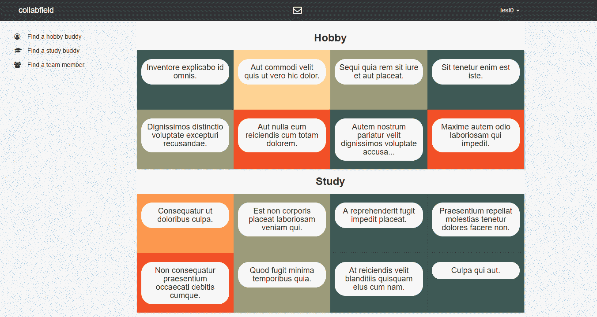**

**然后，您可以展开对话列表**

**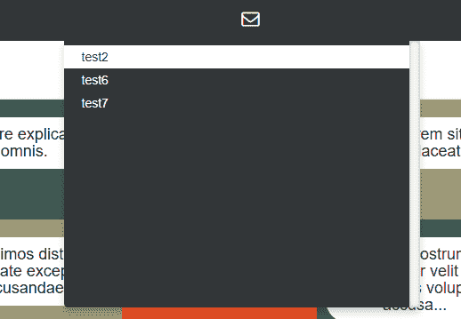**

**通过点击任何一个菜单链接，应用程序上会出现一个对话窗口**

**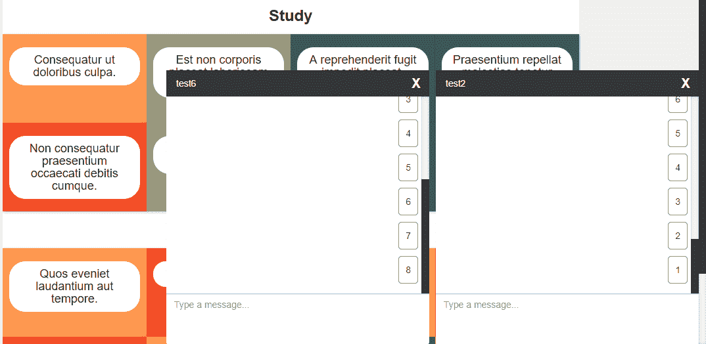**

**如果你试图缩小浏览器的尺寸，对话应该一个接一个地隐藏起来**

****

**还要注意，现在我们有了主页图标，而不是 collabfield 徽标。对话列表仍然可以在较小的屏幕上看到。那么，如果对话窗口隐藏在更小的设备上，用户将如何在移动设备上交流呢？我们将创建一个打开的 messenger，而不是对话窗口。**

**提交更改**

```
`git add -A
git commit -m "Render a drop down menu of conversations links
- split layouts/navigation/_header.html.erb file's content into partials
- Create a _toggle_button.erb.html inside layouts/navigation/header
- Create a _home_button.html.erb inside  layouts/navigation/header
- Define a nav_header_content_partials inside NavigationHelper 
  and write specs for it
- Create a _dropdowns.html.erb inside layouts/navigation/header
- Create a _conversation.html.erb inside
  layouts/navigation/header/dropdowns
- Define a conversation_header_partial_path inside NavigationHelper
  and write specs for it
- Create a  _private.html.erb inside 
  layouts/navigation/header/dropdowns/conversations
- Define a private_conv_seen_status inside
  Shared::ConversationsHelper and write specs for it
- Define an open action inside the Private::Conversations controller
- add CSS to style drop down menus on the navigation bar.
  Inside navigation.scss, mobile.scss and desktop.scss"`
```

**这是确保实时消息的所有功能正常工作的好时机。**

**因为我们是动态地向 DOM 添加元素，所以有时元素添加得太晚，水豚会认为元素不存在，因为默认情况下等待时间只有 2 秒。为了避免这些故障，在`rails_helper.rb`中，改变等待时间，在 5 到 10 秒之间。**

```
`Capybara.default_max_wait_time = 5`
```

**spec/rails_helper.rb**

**在`spec/features/private/conversations folder`内部创建一个`window_spec.rb`文件。**

```
`require "rails_helper"

RSpec.feature "window", :type => :feature do
  let(:user) { create(:user) }
  let(:conversation) { create(:private_conversation, sender_id: user.id) }
  let(:open_window) do
    sign_in user
    visit root_path
    find('#conversations-menu .dropdown-toggle').trigger('click')
    find('#conversations-menu li a').click
    expect(page).to have_selector('.conversation-window')
  end
  before(:each) do 
    conversation
    create(:private_message, conversation_id: conversation.id, user_id: user.id)
  end

  scenario 'user opens a conversation', js: true do
    open_window
  end

  scenario 'user closes a conversation', js: true do 
    open_window
    find('.conversation-window .close-conversation').click
    expect(page).not_to have_selector('.conversation-window')
  end

  scenario 'user sends a message', js: true do 
    open_window
    expect(page).to have_selector('.conversation-window .messages-list li', count: 1)
    find('.conversation-window').fill_in 'body', with: 'hey, mate'
    find('.conversation-window form .send-message', visible: false).trigger('click')
    expect(page).to have_selector('.conversation-window .messages-list li', count: 2)
  end

  scenario 'user collapses and expands a conversation window', js: true do
    open_window
    find('.conversation-window .conversation-heading').click
    expect(page).not_to have_selector('.conversation-window .messages-list')
  end
end`
```

**spec/features/private/conversations/window_spec.rb**

**在这里，我没有定义规范来测试接收方用户是否实时接收消息。试着弄清楚如何自己编写这样的测试。**

**提交更改**

```
`git add -A
git commit -m "Add specs to test the conversation window's functionality"`
```

**如果你登录了一个收到信息的帐户，你会注意到一个对话，标记为看不见的**

**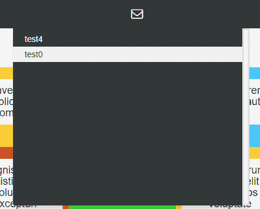**

**目前无法将对话标记为已查看。默认情况下，新消息有一个看不见的值。对应用程序进行编程，当对话窗口被打开或点击时，它的消息会被标记为可见。另请注意，当下拉菜单展开时，我们目前只能看到突出显示的未显示的对话。将来我们会创建一个通知功能，这样用户就可以知道他们没有展开任何东西就收到了新消息。**

**让我们解决第一个问题。当一个对话已经呈现在应用程序上，但它是折叠的，并且用户点击下拉菜单的链接来打开该对话时，什么都不会发生。那个崩溃的对话保持崩溃。我们必须添加一些 JavaScript，所以在下拉菜单的链接点击的情况下，对话应该扩展并聚焦到新的消息区域。**

**打开下面的文件，添加要点中的代码来实现。**

```
`assets/javascripts/conversations/toggle_window.js`
```

```
`// when the link to open a conversation is clicked
// and the conversation window already exists on the page
// but it is collapsed, expand it
$('#conversations-menu').on('click', 'li', function(e) {
    // get conversation window's id
    var conv_id = $(this).attr('data-id');
    // get conversation's type
    if ($(this).attr('data-type') == 'private') {
        var conv_type = '#pc';
    } else {
        var conv_type = '#gc';
    }
    var conversation_window = $(conv_type + conv_id);

    // if conversation window exists 
    if (conversation_window.length) {
        // if window is collapsed, expand it
        if (conversation_window.find('.panel-body').css('display') == 'none') {
            conversation_window.find('.conversation-heading').click();
        }
        // mark as seen by clicking it and focus textarea
        conversation_window.find('form textarea').click().focus();
    }
});`
```

**assets/javascripts/conversations/toggle_window.js**

**当你点击一个链接，打开一个对话窗口，无论一个对话是否已经出现在应用程序中，它都会被展开。**

**现在我们需要一个事件处理程序。在点击了一个有隐藏消息的对话窗口后，私人对话客户端应该触发一个回调函数。首先，在文件的底部，在私有会话客户端定义一个事件处理程序**

```
`$(document).on('click', '.conversation-window, .private-conversation', function(e) {
    // if the last message in a conversation is not a user's message and is unseen
    // mark unseen messages as seen
    var latest_message = $('.messages-list ul li:last .row div', this);
    if (latest_message.hasClass('message-received') && latest_message.hasClass('unseen')) {
        var conv_id = $(this).find('.panel').attr('data-pconversation-id');
        // if conv_id doesn't exist, it means that conversation is opened in messenger
        if (conv_id == null) {
            var conv_id = $(this).find('.messages-list').attr('data-pconversation-id');
        }
        // mark conversation as seen in conversations menu list
        latest_message.removeClass('unseen');
        $('#menu-pc' + conv_id).removeClass('unseen-conv');
        calculateUnseenConversations();
        App.private_conversation.set_as_seen(conv_id);
    }
});

$(document).on('turbolinks:load', function() {
    calculateUnseenConversations();
});`
```

**assets/javascripts/channels/private/conversation.js**

**这个代码片段中已经包含了 messenger 的一个实例。**

**然后，在`private_conversation`实例中定义回调函数，就在`send_message`函数的下面**

```
`set_as_seen: function(conv_id) {
    return this.perform('set_as_seen', { conv_id: conv_id });
}`
```

**assets/javascripts/channels/private/conversation.js**

**最后，在服务器端定义这个方法**

```
`def set_as_seen(data)
  # find a conversation and set its all unseen messages as seen
  conversation = Private::Conversation.find(data["conv_id"].to_i)
  messages = conversation.messages.where(seen: false)
  messages.each do |message|
    message.update(seen: true)
  end
end`
```

**channels/private/conversation_channel.rb**

**用户点击链接打开对话窗口或直接点击对话窗口后，其未看到的消息将被标记为已看到。**

**提交更改**

```
`git add -A
git commit -m "Add ability to mark unseen messages as seen
- Add an event handler to expand conversation windows inside the
  assets/javascripts/conversations/toggle_window.js
- Add an event handler to mark unseen messages as seen inside the
  assets/javascripts/channels/private/conversation.js
- Define a set_as_seen method for Private::ConversationChannel"`
```

**通过编写规范，确保一切如我们预期的那样工作。**

#### **联系人**

**要与你在应用程序上认识的人保持联系，你必须能够将他们添加到联系人中。我们现在缺少这个功能。此外，拥有联系人功能为创建只有被接受为联系人的用户才能执行的其他功能提供了许多可能性。**

**生成一个`Contact`模型**

```
`rails g model contact`
```

**定义关联、验证和通过提供用户 id 来查找联系人记录的方法。**

```
`class Contact < ApplicationRecord
  belongs_to :user
  belongs_to :contact, class_name: "User"

  validates_uniqueness_of :user_id, scope: :contact_id

  def self.find_by_users(user_id, contact_id)
    where('user_id = ? AND contact_id = ?', user_id, contact_id).or(
           where('user_id = ? AND contact_id = ?', contact_id, user_id)
         )[0]
  end
end`
```

**models/contact.rb**

**定义联系人表**

```
`class CreateContacts < ActiveRecord::Migration[5.1]
  def change
    create_table :contacts do |t|
      t.belongs_to :user, index: true
      t.belongs_to :contact, index: true
      t.boolean :accepted, default: false

      t.timestamps
    end
  end
end`
```

**db/migrate/CREATION_DATE_create_contacts.rb**

**将需要一个接触工厂。定义它:**

```
`FactoryGirl.define do 
  factory :contact do
    association :user, factory: :user
    association :contact, factory: :user
  end
end`
```

**spec/factories/contacts.rb**

**编写规格来测试模型**

```
`require 'rails_helper'

RSpec.describe Contact, type: :model do

  let(:contact) { build(:contact) }

  context 'Associations' do
    it 'belongs_to user' do
      association = described_class.reflect_on_association(:user)
      expect(association.macro).to eq :belongs_to
    end

    it 'belongs_to contact' do
      association = described_class.reflect_on_association(:contact)
      expect(association.macro).to eq :belongs_to
      expect(association.options[:class_name]).to eq 'User'
    end
  end

  context 'Validations' do
    it 'is valid to create a new contact' do
      expect(contact).to be_valid
    end

    it 'is not valid with the same user' do
      contact = create(:contact)
      duplicate_contact = contact.dup
      expect(duplicate_contact).not_to be_valid
    end
  end

  context 'Methods' do
    it 'finds by users' do
      user1 = create(:user)
      user2 = create(:user)
      contact = create(:contact, user_id: user1.id, contact_id: user2.id)
      expect(Contact.find_by_users(user1.id, user2.id)).to eq contact
    end
  end

end`
```

**spec/models/contact_spec.rb**

**提交更改**

```
`git add -A
git commit -m "Create a Contact model and write specs for it"`
```

**在`User`模型的文件中，我们必须定义适当的关联，还必须定义一些方法来帮助联系人查询。**

```
`has_many :contacts
has_many :all_received_contact_requests,  
          class_name: "Contact", 
          foreign_key: "contact_id"

has_many :accepted_sent_contact_requests, -> { where(contacts: { accepted: true}) }, 
          through: :contacts, 
          source: :contact
has_many :accepted_received_contact_requests, -> { where(contacts: { accepted: true}) }, 
          through: :all_received_contact_requests, 
          source: :user
has_many :pending_sent_contact_requests, ->  { where(contacts: { accepted: false}) }, 
          through: :contacts, 
          source: :contact
has_many :pending_received_contact_requests, ->  { where(contacts: { accepted: false}) }, 
          through: :all_received_contact_requests, 
          source: :user

# gets all your contacts
def all_active_contacts
  accepted_sent_contact_requests | accepted_received_contact_requests
end

# gets your pending sent and received contacts
def pending_contacts
  pending_sent_contact_requests | pending_received_contact_requests
end

# gets a Contact record
def contact(contact)
  Contact.where(user_id: self.id, contact_id: contact.id)[0]
end`
```

**models/user.rb**

**用规范覆盖关联和方法**

```
`context 'Associations' do

  ...

  it 'has_many contacts' do
    association = described_class.reflect_on_association(:contacts)
    expect(association.macro).to eq :has_many
  end

  it 'has_many all_received_contact_requests' do
    association = described_class.reflect_on_association(:all_received_contact_requests)
    expect(association.macro).to eq :has_many
    expect(association.options[:class_name]).to eq 'Contact'
    expect(association.options[:foreign_key]).to eq 'contact_id'
  end

  it 'has_many accepted_sent_contact_requests' do
    association = described_class.reflect_on_association(:accepted_sent_contact_requests)
    expect(association.macro).to eq :has_many
    expect(association.options[:through]).to eq :contacts
    expect(association.options[:source]).to eq :contact
  end

  it 'has_many accepted_received_contact_requests' do
    association = described_class.reflect_on_association(:accepted_received_contact_requests)
    expect(association.macro).to eq :has_many
    expect(association.options[:through]).to eq :all_received_contact_requests
    expect(association.options[:source]).to eq :user
  end

  it 'has_many pending_sent_contact_requests' do
    association = described_class.reflect_on_association(:pending_sent_contact_requests)
    expect(association.macro).to eq :has_many
    expect(association.options[:through]).to eq :contacts
    expect(association.options[:source]).to eq :contact
  end

  it 'has_many pending_received_contact_requests' do
    association = described_class.reflect_on_association(:pending_received_contact_requests)
    expect(association.macro).to eq :has_many
    expect(association.options[:through]).to eq :all_received_contact_requests
    expect(association.options[:source]).to eq :user
  end
end

context 'Methods' do
  let(:user) { build(:user) }
  let(:contact_requests) do
    @user = create(:user)
    create_list(:contact, 2)
    create_list(:contact, 2, accepted: true)
    create(:contact, user_id: @user.id)
    create(:contact, user_id: @user.id, accepted: true)
    create(:contact, contact_id: @user.id)
    create(:contact, contact_id: @user.id, accepted: true)
  end

  it 'accepted_sent_contact_requests gets only accepted requests' do
    contact_requests
    expect(@user.accepted_sent_contact_requests.count).to eq 1
  end

  it 'accepted_received_contact_requests gets only accepted requests' do
    contact_requests
    expect(@user.accepted_received_contact_requests.count).to eq 1
  end

  it 'pending_sent_contact_requests gets only unaccepted requests' do
    contact_requests
    expect(@user.pending_sent_contact_requests.count).to eq 1
  end

  it 'pending_received_contact_requests gets only unaccepted requests' do
    contact_requests
    expect(@user.pending_received_contact_requests.count).to eq 1
  end
end`
```

**spec/models/user_spec.rb**

**提交更改**

```
`git add -A
git commit -m "Add associations and helper methods to the User model
- Create relationship between the User the Contact models
- Methods help query the Contact records"`
```

**生成一个`Contacts`控制器并定义其动作**

```
`rails g controller contacts`
```

```
`class ContactsController < ApplicationController

  def create
    @contact = current_user.contacts.create(contact_id: params[:contact_id])
    respond_ok
  end

  def update
    @contact = Contact.find_by_users(params[:id], current_user.id)
    @contact.update(accepted: true)
    respond_ok
  end

  def destroy
    @contact = Contact.find_by_users(params[:id], current_user.id)
    @contact.destroy
    respond_ok
  end

  private

  def respond_ok
    respond_to do |format|
      format.json  { head :ok } 
    end
  end

end`
```

**controllers/contacts_controller.rb**

**如您所见，用户将能够创建新的联系人记录、更新其状态(接受用户加入其联系人)以及从联系人列表中删除用户。因为所有的动作都是通过 AJAX 调用的，并且我们不想将任何模板作为响应来呈现，所以我们用一个成功响应来响应。这样 Rails 就不必考虑用什么来响应。**

**定义相应的路线:**

```
`resources :contacts, only: [:create, :update, :destroy]`
```

**routes.rb**

**提交更改。**

```
`git add -A
git commit -m "Create a ContactsController and define routes to its actions"`
```

#### ****私人对话窗口更新****

**用户将能够通过私人对话窗口发送和接受联系请求。稍后，我们将添加一种额外的方法，通过导航栏的下拉菜单接受请求。**

**创建新的`heading`目录**

```
`private/conversations/conversation/heading`
```

**这是我们为私人对话窗口保留额外选项的地方。在目录中，创建一个`_add_user_to_contacts.html.erb`文件**

```
`<%= link_to contacts_path(contact_id: @recipient), 
            method: :post, 
            remote: true, 
            class: 'add-user-to-contacts add-user-to-contacts-notif' do %>
  <i class="fa fa-user-plus" aria-hidden="true" title="Add to contacts"></i>
<% end %>`
```

**private/conversations/conversation/heading/_add_user_to_contacts.html.erb**

**在`_heading.html.erb`文件的底部，呈现将对话的对方用户添加到联系人的选项:**

```
`<%= render add_to_contacts_partial_path(@contact) %>`
```

**private/conversations/conversation/_heading.html.erb**

**在私有范围内定义帮助器方法和附加方法**

```
`# decide to show an option or not
def add_to_contacts_partial_path(contact)
  if recipient_is_contact? 
    'shared/empty_partial'
  else 
    non_contact(contact)
  end 
end

private

def recipient_is_contact?
  # check if recipient is a user's contact
  contacts = current_user.all_active_contacts
  contacts.find {|contact| contact['id'] == @recipient.id}.present?
end

def non_contact(contact)
  # if the contact request was sent by the user or recipient 
  if unaccepted_contact_exists(contact)
    'shared/empty_partial'
  else 
    # contact requests wasn't sent by any users 
    'private/conversations/conversation/heading/add_user_to_contacts' 
  end
end

def unaccepted_contact_exists(contact)
  # get a contact status with the recipient
  if contact.present?
    # check if an unaccepted contact between a user and a recipient exists
    contact.accepted ? false : true
  else
    false
  end
end`
```

**helpers/private/conversations_helper.rb**

**为这些助手方法编写规范**

```
`context '#add_to_contacts_partial_path' do
  let(:contact) { create(:contact) }

  it "returns an empty partial's path" do
    helper.stub(:recipient_is_contact?).and_return(true)
    expect(helper.add_to_contacts_partial_path(contact)).to eq(
      'shared/empty_partial'
    )
  end

  it "returns add_user_to_contacts partial's path" do
    helper.stub(:recipient_is_contact?).and_return(false)
    helper.stub(:unaccepted_contact_exists).and_return(false)
    expect(helper.add_to_contacts_partial_path(contact)).to eq(
      'private/conversations/conversation/heading/add_user_to_contacts' 
    )
  end
end

context 'private scope' do
  let(:current_user) { create(:user) }
  let(:recipient) { create(:user) }

  context '#unaccepted_contact_exists' do
    it 'returns false' do
      contact = create(:contact, accepted: true)
      expect(helper.instance_eval {
        unaccepted_contact_exists(contact)
      }).to eq false
    end

    it 'returns false' do
      contact = nil
      expect(helper.instance_eval {
        unaccepted_contact_exists(contact)
      }).to eq false
    end

    it 'returns true' do
      contact = create(:contact, accepted: false)
      expect(helper.instance_eval {
        unaccepted_contact_exists(contact)
      }).to eq true
    end
  end

  context '#recipient_is_contact?' do
    it 'returns false' do
      helper.stub(:current_user).and_return(current_user)
      assign(:recipient, recipient)
      create_list(:contact, 2, user_id: current_user.id, accepted: true)
      expect(helper.instance_eval { recipient_is_contact? }).to eq false
    end

    it 'returns true' do
      helper.stub(:current_user).and_return(current_user)
      assign(:recipient, recipient)
      create_list(:contact, 2, user_id: current_user.id, accepted: true)
      create(:contact, 
              user_id: current_user.id, 
              contact_id: recipient.id, 
              accepted: true)
      expect(helper.instance_eval { recipient_is_contact? }).to eq true
    end
  end
end`
```

**spec/helpers/private/conversations_helper_spec.rb**

**`instance_eval`方法用于测试私有范围内的方法。**

**因为我们将在对话窗口的标题元素上显示选项，所以我们必须确保附加选项完全适合标题。在`_heading.html.erb`文件中，用`<%= conv_heading_class(@contact) %>`替换`conversation-heading`
类，以确定要添加哪个类。**

**定义助手方法**

```
`# decide which conversation heading style to show
def conv_heading_class(contact)
  # show a conversation heading without or with options
  if unaccepted_contact_exists(contact)
   'conversation-heading-full'
  else
   'conversation-heading'
  end
end`
```

**helpers/private/conversations_helper.rb**

**为该方法编写规范**

```
`context '#conv_heading_class' do
  let(:contact) { create(:contact) }

  it 'returns a conversation-heading-full class' do
    contact.update(accepted: false)
    expect(helper.conv_heading_class(contact)).to eq 'conversation-heading-full'
  end

  it 'returns a conversation-heading class' do
    contact.update(accepted: true)
    expect(helper.conv_heading_class(contact)).to eq 'conversation-heading'
  end
end`
```

**spec/helpers/private/conversations_helper_spec.rb**

**发送或接受联系人请求的选项不会显示。需要添加更多的元素。打开`_conversation.html.erb`文件**

```
`private/conversations/_conversation.html.erb`
```

**在文件的顶部，定义一个`@contact`实例变量，这样就可以跨所有部分访问它**

```
`<% @contact = get_contact_record(@recipient) %>`
```

**private/conversations/_conversation.html.erb**

**定义`get_contact_record`助手方法**

```
`def get_contact_record(recipient)
  contact = Contact.find_by_users(current_user.id, recipient.id)
end`
```

**helpers/private/conversations_helper.rb**

**用规范覆盖方法**

```
`context '#get_contact_record' do
  it 'returns a Contact record' do
    contact = create(:contact, user_id: current_user.id, contact_id: recipient.id)
    helper.stub(:current_user).and_return(current_user)
    expect(helper.get_contact_record(recipient)).to eq contact
  end
end`
```

**spec/helpers/private/conversations_helper_spec.rb**

**以前，我们只在私有作用域的上下文中使用`current_user`和`recipient` `let`方法。现在我们需要通过私有和公共方法访问它们。因此，剪切它们并将其放在私有范围的上下文之外。**

**在`.panel-body`元素的顶部，呈现一个部分文件，该文件将显示一个额外的消息窗口，用于接受或拒绝联系请求**

```
`<%= render 'private/conversations/conversation/request_status' %>`
```

**private/conversations/_conversation.html.erb**

**创建`_request_status.html.erb`文件**

```
`<%= render unaccepted_contact_request_partial_path(@contact) %>
<%= render not_contact_no_request_partial_path(@contact) %>`
```

**private/conversations/conversation/_request_status.html.erb**

**定义所需的助手方法**

```
`# show an unaccepted contact request's status if any
def unaccepted_contact_request_partial_path(contact)
  if unaccepted_contact_exists(contact) 
    if request_sent_by_user(contact)
      "private/conversations/conversation/request_status/sent_by_current_user"  
    else
      "private/conversations/conversation/request_status/sent_by_recipient" 
    end
  else
    'shared/empty_partial'
  end
end

# show a link to send a contact request
# if an opposite user is not in contacts and no requests exist
def not_contact_no_request_partial_path(contact)
  if recipient_is_contact? == false && unaccepted_contact_exists(contact) == false
    "private/conversations/conversation/request_status/send_request"
  else
    'shared/empty_partial'
  end
end

private

def request_sent_by_user(contact)
  # true if contact request was sent by the current_user 
  # false if it was sent by a recipient
  contact['user_id'] == current_user.id
end`
```

**helpers/private/conversations_helper.rb**

**为助手方法编写规范**

```
`context '#unaccepted_contact_request_partial_path' do
  let(:contact) { contact = create(:contact) }

  it "returns sent_by_current_user partial's path" do
    helper.stub(:unaccepted_contact_exists).and_return(true)
    helper.stub(:request_sent_by_user).and_return(true)
    expect(helper.unaccepted_contact_request_partial_path(contact)).to eq(
      'private/conversations/conversation/request_status/sent_by_current_user' 
    )
  end

  it "returns sent_by_recipient partial's path" do
    helper.stub(:unaccepted_contact_exists).and_return(true)
    helper.stub(:request_sent_by_user).and_return(false)
    expect(helper.unaccepted_contact_request_partial_path(contact)).to eq(
      'private/conversations/conversation/request_status/sent_by_recipient'
    )
  end

  it "returns an empty partial's path" do
    helper.stub(:unaccepted_contact_exists).and_return(false)
    expect(helper.unaccepted_contact_request_partial_path(contact)).to eq(
      'shared/empty_partial'
    )
  end
end

context '#not_contact_no_request' do
  let(:contact) { contact = create(:contact) }

  it "returns send_request partial's path" do
    helper.stub(:recipient_is_contact?).and_return(false)
    helper.stub(:unaccepted_contact_exists).and_return(false)
    expect(helper.not_contact_no_request_partial_path(contact)).to eq(
      'private/conversations/conversation/request_status/send_request'
    )
  end

  it "returns an empty partial's path" do
    helper.stub(:recipient_is_contact?).and_return(true)
    helper.stub(:unaccepted_contact_exists).and_return(false)
    expect(helper.not_contact_no_request_partial_path(contact)).to eq(
      'shared/empty_partial'
    )
  end

  it "returns an empty partial's path" do
    helper.stub(:recipient_is_contact?).and_return(false)
    helper.stub(:unaccepted_contact_exists).and_return(true)
    expect(helper.not_contact_no_request_partial_path(contact)).to eq(
      'shared/empty_partial'
    )
  end
end

context 'private scope' do
  context '#request_sent_by_user' do
    it 'returns true' do
      contact = create(:contact, user_id: current_user.id)
      helper.stub(:current_user).and_return(current_user)
      expect(helper.instance_eval { request_sent_by_user(contact) }).to eq true
    end

    it 'returns false' do
      contact = create(:contact, user_id: recipient.id)
      helper.stub(:current_user).and_return(current_user)
      expect(helper.instance_eval { request_sent_by_user(contact) }).to eq false
    end
  end
end`
```

**spec/helpers/private/conversations_helper_spec.rb**

**创建`request_status`目录，然后创建`_send_request.html.erb`、`_sent_by_current_user.html.erb`和`_sent_by_recipient.html.erb`部分文件**

```
`<div class="contact-request-status">
  <div class="add-user-to-contacts-message">
    <div>
      <%= @recipient.name %> is not in your contacts
    </div>
    <div>
      <%= link_to "Add to contacts", 
                  contacts_path(contact_id: @recipient), 
                  remote: true, 
                  method: :post, 
                  class: 'add-user-to-contacts-notif' %>
    </div>
  </div>   
</div>`
```

**private/conversations/conversation/request_status/_send_request.html.erb**

```
`<div class="contact-request-status">
  <div class="pending-request">
    Contact request is pending
  </div>
</div>`
```

**private/conversations/conversation/request_status/_sent_by_current_user.html.erb**

```
`<div class="contact-request-status" 
     data-user-name="<%= @recipient.name %>">
  <div class="contact-name">
    <%= @recipient.name %> sent you a contact request
  </div>
  <div class="request-response">
    <span class="accept-request">
      <%= link_to "Accept",  
          contact_path(id: @recipient.id), 
          remote: true, 
          method: "put" %>
    </span>  
    <span class="decline-request">
      <%= link_to "Decline", 
                  contact_path(id: @recipient.id), 
                  remote: true, 
                  method: :delete %>
    </span>              
  </div>
</div>`
```

**private/conversations/conversation/request_status/_sent_by_recipient.html.erb**

**提交更改**

```
`git add -A
git commit -m "Add a button on private conversation's window
to add a recipient to contacts"`
```

**实施设计更改，并处理由于对话窗口上的额外元素而出现的样式问题。将 CSS 添加到`conversation_window.scss`文件**

```
`.add-user-to-contacts {
  display: none;
  i {
    opacity: 0.8;
    &:hover {
      opacity: 1;
    }
  }
  &:hover {
    color: white;
  }
}

.add-user-to-contacts-message {
  text-align: center;
  padding: 10px 0;
}

.add-people-to-chat, .contact-request-sent {
  display: none;
  margin: 0;
  padding: 0;
  div {
    width: 40px;
    height: 40px;
    display: table;
    i {
      display: table-cell;
      text-align: center;
      vertical-align: middle;
    }
  }
}

.add-people-to-chat {
  i {
    opacity: 0.8;
    transition: opacity 0.15s;
  }
  &:hover i {
    opacity: 1;
  }
}

.contact-request-status {
  position: relative;
  left: 0;
  top: 0;
  width: 400px;
  text-align: center;
  background-color: white;
  z-index: 2;
  .pending-request {
    padding: 10px 0;
  }
  .request-response {
    padding: 10px 0;
  }
  .accept-request, .decline-request {
    a {
      padding: 10px 0;
    }
  }
  .contact-name {
    padding: 10px 0 0 0;
  }
  .accept-request {
    margin-right: 10px;
    a {
      color: green;
    }
  }
  .decline-request {
    a {
      font-weight: bold;
      color: red;
    }
  }
}`
```

**stylesheets/partials/conversation_window.scss**

**提交更改**

```
`git add -A
git commit -m "Add CSS to conversation_window.scss to style option buttons"`
```

**当对话窗口折叠时，最好不要看到任何选项。只有在对话窗口展开时才看到选项，这是一种更方便的设计。为了实现这一点，在`toggle_window.js`文件的切换函数中，就在`messages_visible`变量的下面，添加**

```
`// if window is collapsed, hide conversation menu options
if ( panel_body.css('display') == 'none' ) {
    panel.find('.add-people-to-chat,\
                .add-user-to-contacts,\
                .contact-request-sent').hide();
    conversation_heading = panel.find('.conversation-heading');
    conversation_heading.css('width', '360px');

} else { // show conversation menu options
    conversation_heading = panel.find('.conversation-heading');
    conversation_heading.css('width', '320px');
    panel.find('.add-people-to-chat,\
                .add-user-to-contacts,\
                .contact-request-sent').show();
    // focus textarea
    $('form textarea', this).focus();
}`
```

**assets/javascripts/conversations/toggle_window.js**

**现在折叠的窗口看起来像这样，它没有可见的选项**

**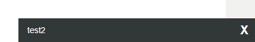**

**展开的窗口中有一个将用户添加到联系人的选项。还有一条信息建议这样做**

**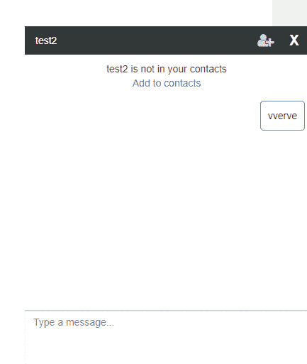**

**实际上，您可以通过点击对话标题上的图标或点击`Add to contacts`链接，立即发送和接受联系人请求。现在，当你点击这些链接和按钮后，没有任何反应。稍后我们会添加一些反馈和实时通知系统。但是从技术上来说，你可以把用户添加到你的联系人列表中，只是还不够用户友好。**

**在你发出联系请求后，对方用户方是这样的**

**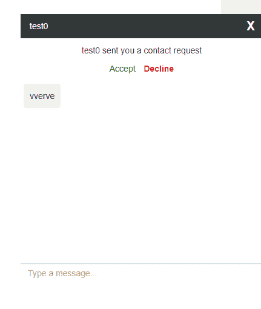**

**提交更改**

```
`git add -A
git commit -m "Add JS inside the toggle_window.js to show and hide additional options"`
```

#### **目前，用户可以私下交谈，进行一对一的对话。由于该应用程序是关于协作的，因此进行小组对话也是合乎逻辑的。**

**从生成新模型开始**

```
`rails g model group/conversation`
```

**多个用户将能够参与一个对话。定义关联和数据库表**

```
`class Group::Conversation < ApplicationRecord
  self.table_name = 'group_conversations'

  has_and_belongs_to_many :users
  has_many :messages, 
           class_name: "Group::Message",
           foreign_key: 'conversation_id', 
           dependent: :destroy
end`
```

**models/group/conversation.rb**

```
`has_many :group_messages, class_name: 'Group::Message'
has_and_belongs_to_many :group_conversations, class_name: 'Group::Conversation'`
```

**models/user.rb**

**一个[连接表](http://guides.rubyonrails.org/active_record_migrations.html#creating-a-join-table)将被用来跟踪谁属于哪个群组对话**

**然后为消息生成模型**

```
`rails g model group/message`
```

```
`class Group::Message < ApplicationRecord
  serialize :seen_by, Array
  serialize :added_new_users, Array
  self.table_name = "group_messages"

  belongs_to  :conversation,
              class_name: 'Group::Conversation',
              foreign_key: 'conversation_id'
  belongs_to :user

  validates :content, presence: true
  validates :user_id, presence: true
  validates :conversation_id, presence: true

  default_scope { includes(:user) }

  # get a previous message of a conversation
  def previous_message
    previous_message_index = self.conversation.messages.index(self) - 1
    self.conversation.messages[previous_message_index]
  end
end`
```

**models/group/message.rb**

**我们将把看过消息的用户的 id 存储到一个数组中。为了在数据库列中创建和管理对象，如数组，使用了 serialize 方法。添加了一个默认范围，以最小化查询量和一些验证。**

**我们建立小组对话的方式与私人对话非常相似。事实上，两种类型的对话在风格和某些方面是相同的。**

**写下模型的规格。还需要一个群组消息工厂**

```
`FactoryGirl.define do 
  factory :group_message, class: 'Group::Message' do
    content 'a' * 20
    association :conversation, factory: :group_conversation
    user
  end
end`
```

**spec/factories/group_messages.rb**

```
`it 'has_many group_messages' do 
  association = described_class.reflect_on_association(:group_messages)
  expect(association.macro).to eq :has_many
  expect(association.options[:class_name]).to eq 'Group::Message'
end

it 'has_and_belongs_to_many group_conversations' do
  association = described_class.reflect_on_association(:group_conversations)
  expect(association.macro).to eq :has_and_belongs_to_many
  expect(association.options[:class_name]).to eq 'Group::Conversation'
end`
```

**spec/models/user_spec.rb**

```
`require 'rails_helper'

RSpec.describe Group::Conversation, type: :model do

  let(:conversation) { build(:group_conversation) }

  context 'Associations' do
    it 'has_and_belongs_to_many users' do
      association = described_class.reflect_on_association(:users)
      expect(association.macro).to eq :has_and_belongs_to_many
    end

    it 'has_many messages' do
      association = described_class.reflect_on_association(:messages)
      expect(association.macro).to eq :has_many
      expect(association.options[:class_name]).to eq 'Group::Message'
      expect(association.options[:foreign_key]).to eq 'conversation_id'
      expect(association.options[:dependent]).to eq :destroy
    end
  end

end`
```

**spec/models/group/conversation_spec.rb**

```
`require 'rails_helper'

RSpec.describe Group::Message, type: :model do

  let(:message) { build(:group_message) }

  context 'Associations' do
    it 'belongs_to group_conversation' do
      association = described_class.reflect_on_association(:conversation)
      expect(association.macro).to eq :belongs_to
      expect(association.options[:class_name]).to eq 'Group::Conversation'
      expect(association.options[:foreign_key]).to eq 'conversation_id'
    end
  end

  context 'Validations' do
    it "is not valid without a content" do 
      message.content = nil
      expect(message).not_to be_valid 
    end

    it "is not valid without a conversation_id" do 
      message.conversation_id = nil
      expect(message).not_to be_valid 
    end

    it "is not valid without a user_id" do 
      message.user_id = nil
      expect(message).not_to be_valid 
    end
  end

  context 'Methods' do
    it 'gets a previous message of a conversation' do
      conversation = create(:group_conversation)
      message1 = create(:group_message, conversation_id: conversation.id)
      message2 = create(:group_message, conversation_id: conversation.id)
      expect(message2.previous_message).to eq message1
    end
  end

end`
```

**定义迁移文件**

```
`class CreateGroupConversations < ActiveRecord::Migration[5.1]
  def change
    create_table :group_conversations do |t|
      t.string :name
      t.timestamps
    end
  end
end`
```

**db/migrate/CREATION_DATE_create_group_conversations.rb**

```
`class CreateGroupConversationsUsersJoinTable < ActiveRecord::Migration[5.1]
  def change
    create_table :group_conversations_users, id: false do |t|
      t.integer :conversation_id
      t.integer :user_id
    end
    add_index :group_conversations_users, :conversation_id
    add_index :group_conversations_users, :user_id
  end
end`
```

**db/migrate/CREATION_DATE_create_group_conversations_users_join_table.rb**

```
`class CreateGroupMessages < ActiveRecord::Migration[5.1]
  def change
    create_table :group_messages do |t|
      t.string :content
      t.string :added_new_users
      t.string :seen_by
      t.belongs_to :user, index: true
      t.belongs_to :conversation, index: true
      t.timestamps
    end
  end
end`
```

**db/migrate/CREATION_DATE_create_group_messages.rb**

**小组对话的基础已经确定。**

**提交更改**

```
`git add -A
git commit -m "Create Group::Conversation and Group::Message models
- Define associations
- Write specs"`
```

****创建群组对话****

**如前所述，创建群组对话功能的过程与我们创建私人对话的过程相似。首先创建一个控制器和一个基本的用户界面。**

**生成命名空间控制器**

```
`rails g controller group/conversations`
```

**在控制器内部定义一个私有范围内的`create`动作和`add_to_conversations`、`already_added?`和`create_group_conversation`方法**

```
`class Group::ConversationsController < ApplicationController

  def create
    @conversation = create_group_conversation
    add_to_conversations unless already_added?

    respond_to do |format|
      format.js
    end
  end

  private

  def add_to_conversations
    session[:group_conversations] ||= []
    session[:group_conversations] << @conversation.id
  end

  def already_added?
    session[:group_conversations].include?(@conversation.id)
  end

  def create_group_conversation
    Group::NewConversationService.new({
      creator_id: params[:creator_id],
      private_conversation_id: params[:private_conversation_id],
      new_user_id: params[:group_conversation][:id]
    }).call
  end

end`
```

**controllers/group/conversations_controller.rb**

**创建新的群组对话有些复杂，所以我们将它提取到一个服务对象中。然后我们有`add_to_conversations`和`already_added?`私有方法。如果您还记得的话，我们在`Private::ConversationsController`中也有它们，但是这次它将群组对话的 id 存储到会话中。**

**现在在一个新的`group`目录中定义`Group::NewConversationService`**

```
`class Group::NewConversationService

  def initialize(params)
    @creator_id = params[:creator_id]
    @private_conversation_id = params[:private_conversation_id]
    @new_user_id = params[:new_user_id]
  end

  def call
    creator = User.find(@creator_id)
    pchat_opposed_user = Private::Conversation.find(@private_conversation_id)
                           .opposed_user(creator)
    new_user_to_chat = User.find(@new_user_id)
    new_group_conversation = Group::Conversation.new
    new_group_conversation.name = '' + creator.name + ', ' + 
                                  pchat_opposed_user.name + ', ' + 
                                  new_user_to_chat.name 
    if new_group_conversation.save
      arr_of_users_ids = [creator.id, pchat_opposed_user.id, new_user_to_chat.id]
      # add users to the conversation
      creator.group_conversations << new_group_conversation
      pchat_opposed_user.group_conversations << new_group_conversation
      new_user_to_chat.group_conversations << new_group_conversation
      # create an initial message with an information about the conversation
      create_initial_message(creator, arr_of_users_ids, new_group_conversation)
      # return the conversation
      new_group_conversation
    end
  end

  private

  def create_initial_message(creator, arr_of_users_ids, new_group_conversation)
    message = Group::Message.create(
      user_id: creator.id, 
      content: 'Conversation created by ' + creator.name, 
      added_new_users: arr_of_users_ids , 
      conversation_id: new_group_conversation.id
    )
  end
end`
```

**services/group/new_conversation_service.rb**

**创建新的群组对话的方式实际上是通过私人对话。我们将很快创建这个界面作为私人对话窗口的一个选项。在这样做之前，通过用规范覆盖服务对象来确保它正常工作。在`services`中，创建一个新的目录`group`，里面有一个`new_conversation_service_spec.rb`文件**

```
`require 'rails_helper'
require './app/services/group/new_conversation_service.rb'

describe Group::NewConversationService do
  let(:user1) { create(:user) }
  let(:user2) { create(:user) }
  let(:new_user) { create(:user) }
  let(:private_conversation) { create(:private_conversation,
                                       sender_id: user1.id,
                                       recipient_id: user2.id) }
  context '#call' do
    it 'returns a new created group conversation' do
      new_conversation = Group::NewConversationService.new({
                           creator_id: user1.id,
                           private_conversation_id: private_conversation.id,
                           new_user_id: new_user.id
                         }).call
      last_conversation = Group::Conversation.last
      expect(new_conversation).to eq last_conversation
      expect(last_conversation.messages.count).to eq 1
    end
  end
end`
```

**spec/services/group/new_conversation_service_spec.rb**

**提交更改**

```
`git add -A
git commit -m "Create back-end for creating a new group conversation
- Create a Group::ConversationsController
  Define a create action and add_to_conversations, 
  create_group_conversation and already_added? private methods inside
- Create a  Group::NewConversationService and write specs for it"`
```

**为群组对话及其消息定义路由**

```
`namespace :group do 
  resources :conversations do
    member do
      post :close
      post :open
    end
  end
  resources :messages, only: [:index, :create]
end`
```

**routes.rb**

**提交更改**

```
`git add -A
git commit -m "Define specs for Group::Conversations and Messages"`
```

**目前我们只负责`ApplicationController`内的私人对话。只有私人对话被订购，并且在用户打开后，只有他们的 id 在应用程序中可用。在`ApplicationController`内部，更新`opened_conversations_windows`方法**

```
`def opened_conversations_windows
  if user_signed_in?
    # opened conversations
    session[:private_conversations] ||= []
    session[:group_conversations] ||= []
    @private_conversations_windows = Private::Conversation.includes(:recipient, :messages)
                                         .find(session[:private_conversations])
    @group_conversations_windows = Group::Conversation.find(session[:group_conversations])
  else
    @private_conversations_windows = []
    @group_conversations_windows = []
  end
end`
```

**controllers/application_controller.rb**

**因为对话的排序是在`OrderConversationsService`的帮助下发生的，所以我们必须更新这个服务**

```
`# get and order conversations by last messages' dates in descending order
def call
  all_private_conversations = Private::Conversation.all_by_user(@user.id)
                                                   .includes(:messages)
  all_group_conversations = @user.group_conversations.includes(:messages)
  all_conversations = all_private_conversations + all_group_conversations

  return all_conversations = all_conversations.sort{ |a, b| 
    b.messages.last.created_at <=> a.messages.last.created_at
  }
end`
```

**order_conversations_service.rb**

**以前，我们只有私人对话数组，并按照最新消息的创建日期进行排序。现在，我们有了私有和群组会话数组，然后我们将它们连接到一个数组中，并像以前一样进行排序。**

**还要更新规格**

```
`describe OrderConversationsService do
  context '#call' do
    it 'returns ordered conversations in descending order' do
      user = create(:user)
      conversation1 = create(:private_conversation,
                              sender_id: user.id,
                              messages: [create(:private_message)])
      conversation2 = create(:group_conversation,
                              users: [user],
                              messages: [create(:group_message)])
      conversation3 = create(:private_conversation,
                              sender_id: user.id,
                              messages: [create(:private_message)])
      conversations = [conversation3, conversation2, conversation1]
      expect(OrderConversationsService.new({user: user}).call).to eq conversations
    end
  end
end`
```

**spec/services/order_conversations_service_spec.rb**

**提交更改**

```
`git add -A
git commit -m "Get data for group conversations in ApplicationController
- Update the opened_conversations_windows method
- Update the OrderConversationsService"`
```

**一会儿，我们需要将一些数据从控制器传递给 JavaScript。幸运的是，我们已经安装了`gon` gem，这让我们可以很容易地做到这一点。在`ApplicationController`内，在`private`范围内，添加**

```
`def set_user_data
  if user_signed_in?
    gon.group_conversations = current_user.group_conversations.ids
    gon.user_id = current_user.id
    cookies[:user_id] = current_user.id if current_user.present?
    cookies[:group_conversations] = current_user.group_conversations.ids
  else
    gon.group_conversations = []
  end
end`
```

**controllers/application_controller.rb**

**使用`before_action`过滤器调用该方法**

```
`before_action :set_user_data`
```

**提交更改**

```
`git add -A
git commit -m "Define a set_user_data private method in ApplicationController"`
```

**从技术上讲，我们现在可以创建一个新的群组对话，但是用户没有接口来这样做。如前所述，他们将通过私人谈话来完成。让我们在私人对话窗口上创建此选项。**

**在里面**

```
`views/private/conversations/conversation/heading`
```

**目录创建一个新文件**

```
`<!-- Add more contacts to chat button -->
<div class="add-people-to-chat" title="Create a group chat">
  <div>
    <i class="fa fa-plus" aria-hidden="true" data-toggle="dropdown"></i>
  </div>
</div>
<!-- select users to add to conversation -->
<div class="select-users-to-chat">
  <%= form_for(Group::Conversation.new, remote: true, class: 'form-group') do |f| %>
    <%= hidden_field_tag :creator_id, current_user.id %>
    <%= hidden_field_tag :private_conversation_id, conversation.id %>
    <%= f.collection_select(:id, 
                            contacts_except_recipient(@recipient), 
                            :id, 
                            :name, 
                            {}, 
                            {:class=>'form-control select-users-dropdown'}) %>
    <%= f.submit 'Start a conversation', class: 'form-control select-users-button' %>
  <% end %>
</div>`
```

**private/conversations/conversation/heading/_create_group_conversation.html.erb**

**一个`[collection_select](https://apidock.com/rails/ActionView/Helpers/FormOptionsHelper/collection_select)`方法用于显示用户列表。只有“联系人”中的用户才会被包括在列表中。定义`contacts_except_recipient`助手方法**

```
`def contacts_except_recipient(recipient)
  contacts = current_user.all_active_contacts
  # return all contacts, except the opposite user of the chat
  contacts.delete_if {|contact| contact.id == recipient.id }
end`
```

**helpers/private/conversations_helper.rb**

**为该方法编写规范**

```
`context '#contacts_except_recipient' do
  it 'return all contacts, except the opposite user of the chat' do
    contacts = create_list(:contact, 
                            5, 
                            user_id: current_user.id, 
                            accepted: true)

    contacts << create(:contact, 
                        user_id: current_user.id, 
                        contact_id: recipient.id,
                        accepted: true)
    helper.stub(:current_user).and_return(current_user)
    expect(helper.contacts_except_recipient(recipient)).not_to include recipient
  end
end`
```

**spec/helpers/private/conversations_helper_spec.rb**

**渲染`_heading.html.erb`底部的局部**

```
`<%= render create_group_conv_partial_path, conversation: conversation %>`
```

**private/conversations/conversation/_heading.html.erb**

**定义助手方法**

```
`def create_group_conv_partial_path(contact)
  if recipient_is_contact?
    'private/conversations/conversation/heading/create_group_conversation'
  else
    'shared/empty_partial'
  end
end`
```

**helpers/private/conversations_helper.rb**

**用规格包起来**

```
`context '#create_group_conv_partial_path' do
  let(:contact) { create(:contact) }

  it "returns a create_group_conversation partial's path" do 
    helper.stub(:recipient_is_contact?).and_return(true)
    expect(helper.create_group_conv_partial_path(contact)).to(
      eq 'private/conversations/conversation/heading/create_group_conversation'
    )
  end

  it "returns an empty partial's path" do 
    helper.stub(:recipient_is_contact?).and_return(false)
    expect(helper.create_group_conv_partial_path(contact)).to(
      eq 'shared/empty_partial'
    )
  end
end`
```

**spec/helpers/private/conversations_helper_spec.rb**

**提交更改。**

```
`git add -A
git commit -m "Add a UI on private conversation to create a group conversations"`
```

**添加 CSS 来设置允许创建新群组对话的组件的样式**

```
`.select-users-to-chat {
  padding: 5px 0 5px 5px;
  border-bottom: 1px solid rgba(0, 0, 0, 0.1);
  position: absolute;
  top: 40px;
  background-color: white;
  display: none;
  height: 45px;
  width: 100%;
  z-index: 2;
}

.select-users-dropdown, .select-users-button {
  border: none;
  display: inline-block;
  margin: 0;
  height: 35px;
}

.select-users-dropdown {
  width: 55%;
  border: 1px solid rgba(0, 0, 0, 0.2);
}

.select-users-button {
  width: 40%;
  background-color: $navbarColor;
  color: white;
  border: 1px solid $navbarColor;
}`
```

**assets/stylesheets/partials/conversation_window.scss**

**默认情况下，联系人的选择是隐藏的。要打开选择，用户必须点击按钮。这个按钮还不是交互式的。用 JavaScript 创建一个`options.js`文件，使选择列表可切换。**

```
`$(document).on('turbolinks:load', function() { 

  //  when add more contacts to a conversation button is clicked
  //  toggle contacts selection
  $('body').on('click', '.add-people-to-chat', function(e) {
      $(this).next().toggle(100, 'swing');
  });

});`
```

**assets/javascripts/conversations/options.js**

**现在，带有收件人(联系人)的对话窗口如下所示**

****

**有一个按钮可以打开一个联系人列表，当你点击它时，你可以创建一个群组对话**

**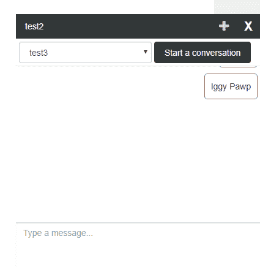**

**提交更改。**

```
`git add -A
git commit -m "
- Describe style for the create a group conversation option
- Make the option toggleable"`
```

**我们有一个有序对话的列表，包括现在的群组对话，它将呈现在导航栏的下拉菜单上。如果您还记得，我们为不同类型的对话指定了不同的部分。当应用程序试图呈现一个链接来打开一个群组对话时，它会寻找一个不同于私人对话的文件。文件尚未创建。**

**创建一个`_group.html.erb`文件**

```
`<% seen_status = group_conv_seen_status(conversation, current_user) %>
<li id="menu-gc<%= conversation.id %>" class="<%= seen_status %>">
  <%= link_to truncate(conversation.name, :length => 40), 
              open_group_conversation_path(id: conversation.id), 
              remote: true, 
              method: :post, 
              class: 'bigger-screen-link' %>
</li>`
```

**navigation/header/dropdowns/conversations/_group.html.erb**

**在`Shared::ConversationsHelper`中定义`group_conv_seen_status`助手方法**

```
`def group_conv_seen_status(conversation, current_user)
  # if the current_user is nil, it means that the helper is called from the service
  # return an empty string
  if current_user == nil
    ''
  else
    # if the last message of the conversation is not created by this user
    # and is unseen, return an unseen-conv value
    not_created_by_user = conversation.messages.last.user_id != current_user.id
    seen_by_user = conversation.messages.last.seen_by.include? current_user.id
    not_created_by_user && seen_by_user == false ? 'unseen-conv' : ''
  end
end`
```

**helpers/shared/conversations_helper.rb**

**为该方法编写规范**

```
`context '#group_conv_seen_status' do
  it 'returns unseen-conv status' do
    conversation = create(:group_conversation)
    create(:group_message, conversation_id: conversation.id)
    current_user = create(:user)
    view.stub(:current_user).and_return(current_user)
    expect(helper.group_conv_seen_status(conversation)).to eq(
      'unseen-conv'
    )
  end

  it 'returns an empty string' do
    user = create(:user)
    conversation = create(:group_conversation)
    create(:group_message, conversation_id: conversation.id, user_id: user.id)
    view.stub(:current_user).and_return(user)
    expect(helper.group_conv_seen_status(conversation)).to eq ''
  end

  it 'returns an empty string' do
    user = create(:user)
    conversation = create(:group_conversation)
    message = build(:group_message, conversation_id: conversation.id)
    message.seen_by << user.id
    message.save
    view.stub(:current_user).and_return(user)
    expect(helper.group_conv_seen_status(conversation)).to eq ''
  end
end`
```

**spec/helpers/shared/conversations_helper_spec.rb**

**提交更改。**

```
`git add -A
git commit -m "Create a link on the navigation bar to open a group conversation"`
```

**在应用程序上呈现群组对话窗口，就像我们呈现私人对话一样。在`application.html.erb`中，在呈现的私人对话的正下方，添加:**

```
`<%= render 'layouts/application/group_conversations_windows' %>`
```

**layouts/application.html.erb**

**创建部分文件以逐个呈现群组对话窗口:**

```
`<% @group_conversations_windows.each do |conversation| %>
  <%= render partial: "group/conversations/conversation",
            locals: { conversation: conversation, 
                      user: current_user } %>
<% end %>`
```

**layouts/application/_group_conversations_windows.html.erb**

**提交更改。**

```
`git add -A
git commit -m "Render group conversations' windows inside the
application.html.erb"`
```

**我们有一个在应用程序上创建和呈现群组对话的机制。现在让我们构建一个对话窗口本身。**

**在`group/conversations`目录中，创建一个`_conversation.html.erb`文件。**

```
`<% add_people_to_conv_list = add_people_to_group_conv_list(conversation) %>
<% @is_messenger = false %>
<li class="conversation-window" id="gc<%= conversation.id %>" data-turbolinks-permanent>
  <div class="panel panel-default" data-gconversation-id="<%= conversation.id %>">
    <%= render  'group/conversations/conversation/heading',
                conversation: conversation %> 
    <%= render  'group/conversations/conversation/select_users',
                conversation: conversation,
                add_people_to_conv_list: add_people_to_conv_list %>
    <div class="panel-body">
      <%= render  'group/conversations/conversation/messages_list',
                  conversation: conversation %>
      <%= render  'group/conversations/conversation/new_message_form',
                  conversation: conversation,
                  user: user %> 
    </div><!-- panel-body -->
  </div><!-- panel -->
</li>`
```

**group/conversations/_conversation.html.erb**

**定义`add_people_to_group_conv_list`助手方法:**

```
`module Group::ConversationsHelper
  def add_people_to_group_conv_list(conversation)
    contacts = current_user.all_active_contacts
    users_in_conv = conversation.users
    add_people_to_conv_list = []
    contacts.each do |contact|
      # if the contact is already in the conversation, remove it from the list
      if !users_in_conv.include?(contact)
        add_people_to_conv_list << contact
      end
    end
    add_people_to_conv_list
  end
end`
```

**helpers/group/conversations_helper.rb**

**为助手写规格:**

```
`context '#add_people_to_group_conv_list' do
  let(:conversation) { create(:group_conversation) }
  let(:current_user) { create(:user) }
  let(:user) { create(:user) }
  before(:each) do
    create(:contact, 
            user_id: current_user.id, 
            contact_id: user.id,
            accepted: true)
  end

  it 'a user is not included in a list' do
    conversation.users << current_user
    conversation.users << user
    helper.stub(:current_user).and_return(current_user)
    expect(helper.add_people_to_group_conv_list(conversation)).not_to include user
  end

  it 'a user is included in a list' do
    conversation.users << current_user
    helper.stub(:current_user).and_return(current_user)
    expect(helper.add_people_to_group_conv_list(conversation)).to include user
  end
end`
```

**spec/helpers/group/conversations_helper_spec.rb**

**就像私人对话一样，群组对话将可以在整个应用程序中访问，所以很明显，我们也需要在任何地方访问`Group::ConversationsHelper`方法。将此模块添加到`ApplicationHelper`中**

```
`include Group::ConversationsHelper`
```

**提交更改。**

```
`git add -A
git commit -m "
- Create a _conversation.html.erb inside the group/conversations
- Define a add_people_to_group_conv_list and write specs for it"`
```

**创建一个新的`conversation`目录，其中包含一个`_heading.html.erb`文件:**

```
`<div class="panel-heading conversation-heading">
  <%= truncate(conversation.name, :length => 40) %>
</div>

<!-- Close the conversation button -->
<%= link_to "X", 
            close_group_conversation_path(conversation), 
            class: 'close-conversation', 
            title: 'Close', 
            remote: true, 
            method: :post %>

<!-- Add more contacts to the conversation button -->
<div class="add-people-to-chat" title="Add people to chat">
  <div>
    <i class="fa fa-plus" aria-hidden="true" data-toggle="dropdown"></i>
  </div>
</div>`
```

**group/conversations/conversation/_heading.html.erb**

**提交更改。**

```
`git add -A
git commit -m "Create a _heading.html.erb inside the
group/conversations/conversation"`
```

**接下来我们有`_select_user.html.erb`和`_messages_list.html.erb`部分文件。创建它们:**

```
`<div class="select-users-to-chat">
  <%= form_tag  group_conversation_path(conversation), 
                method: 'put', 
                class: 'form-group' do %>
    <%= hidden_field_tag :added_by, current_user.id %>
    <%= collection_select(:user, 
                          :id, 
                          add_people_to_conv_list, 
                          :id, 
                          :name, 
                          {}, 
                          {:class=>'form-control select-users-dropdown'}) %>
    <%= submit_tag 'Add the user', class: 'form-control select-users-button' %>
  <% end %>
</div>`
```

**group/conversations/conversation/_select_users.html.erb**

```
`<div class="messages-list">
  <%= render partial: load_group_messages_partial_path(conversation),
             locals: { conversation: conversation, messenger_boolean: false } %>
  <div class="loading-more-messages">
    <i class="fa fa-spinner" aria-hidden="true"></i>
  </div>
  <!-- messages -->
  <ul>
  </ul>
</div>`
```

**group/conversations/conversation/_messages_list.html.erb**

**定义`load_group_messages_partial_path`助手方法:**

```
`def load_group_messages_partial_path(conversation)
  if conversation.messages.count > 0
    'group/conversations/conversation/messages_list/load_messages'
  else
    'shared/empty_partial'
  end
end`
```

**helper/group/conversations_helper.rb**

**用规格包装它:**

```
`context '#load_group_messages_partial_path' do
  let(:conversation) { create(:group_conversation) }
  it "returns load_messages partial's path" do
    create_list(:group_message, 2, conversation_id: conversation.id)
    expect(helper.load_group_messages_partial_path(conversation)).to eq(
      'group/conversations/conversation/messages_list/link_to_previous_messages'
    )
  end

  it "returns an empty partial's path" do
    expect(helper.load_group_messages_partial_path(conversation)).to eq(
      'shared/empty_partial'
    )
  end
end`
```

**spec/helpers/group/conversations_helper_spec.rb**

**提交更改。**

```
`git add -A
git commit -m "
- Create _select_user.html.erb and _messages_list.html.erb inside
  group/conversations/conversation
- Define a load_group_messages_partial_path helper method 
  and write specs for it"`
```

**创建一个`_link_to_previous_messages.html.erb`文件，其中包含一个加载先前消息的链接:**

```
`<%= link_to "Load messages", 
            group_messages_path(:conversation_id => conversation.id, 
                                :messages_to_display_offset => @messages_to_display_offset,
                                :is_messenger => @is_messenger), 
            class: 'load-more-messages', 
            remote: true %>`
```

**group/conversations/conversation/messages_list/_link_to_previous_messages.html.erb**

**提交更改。**

```
`git add -A
git commit -m "Create a _load_messages.html.erb inside the
group/conversations/conversation/messages_list"`
```

**创建新的邮件表单**

```
`<form class="send-group-message">
  <input  name="conversation_id" 
          type="hidden" 
          value="<%= conversation.id %>">
  <input  name="user_id" 
          type="hidden" 
          value="<%= user.id %>">
  <textarea name="content" 
            rows="3" 
            class="form-control" 
            placeholder="Type a message..."></textarea>
  <input type="submit" class="btn btn-success send-message">
</form>`
```

**group/conversations/conversation/_new_message_form.html.erb**

**提交更改。**

```
`git add -A
git commit -m "Create a _new_message_form.html.erb inside the 
group/conversations/conversation/"`
```

**该应用程序现在也能够呈现群组对话的窗口。**

**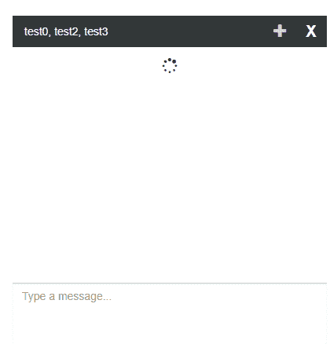**

**但是，它们还没有发挥作用。首先，我们需要加载消息。我们需要一个消息和视图的控制器。生成一个`Messages`控制器:**

```
`rails g controller group/messages`
```

**包含来自`concerns`的`Messages`模块并定义一个`index`动作:**

```
`class Group::MessagesController < ApplicationController
  include Messages

  def index
    get_messages('group', 15)
    @user = current_user
    @is_messenger = params[:is_messenger]
    respond_to do |format|
      format.js { render partial: 'group/messages/load_more_messages' }
    end
  end
end`
```

**controllers/group/messages_controller.rb**

**提交更改。**

```
`git add -A
git commit -m "Create a Group::MessagesController and define an index action"`
```

**创建一个`_load_more_messages.js.erb`**

```
`<% @id_type = 'gc' %>
<%= render append_previous_messages_partial_path %>
<%= render replace_link_to_group_messages_partial_path %>
<%= render remove_link_to_messages %>`
```

**group/messages/_load_more_messages.js.erb**

**我们已经在前面定义了`append_previous_messages_partial_path`和`remove_link_to_messages`助手方法。我们只需要定义`replace_link_to_group_messages_partial_path`助手方法**

```
`def replace_link_to_group_messages_partial_path
  'group/messages/load_more_messages/window/replace_link_to_messages'   
end` 
```

**helpers/group/messages_helper.rb**

**同样，这种方法，就像在私人方面，将变得更加“智能”，一旦我们开发了信使。**

**创建`_replace_link_to_messages.js.erb`**

```
`$('#<%= @id_type %><%= @conversation.id %> .load-more-messages')
    .replaceWith('\
        <%= j render partial: "group/conversations/conversation/messages_list/link_to_previous_messages",\
                     locals: { conversation: @conversation } %>\
        ');`
```

**group/messages/load_more_messages/window/_replace_link_to_messages.js.erb**

**也将`Group::MessagesHelper`加到`ApplicationHelper`上**

```
`include Group::MessagesHelper`
```

**提交更改。**

```
`git add -A
git commit -m "Create a _load_more_messages.js.erb inside the group/messages"`
```

**现在打开群组对话的唯一方法是在初始化之后。显然，这并不是一件惊心动魄的事情，因为一旦你破坏了会话，就没有办法再打开同样的对话。在控制器内部创建一个`open`动作。**

```
`def open
  @conversation = Group::Conversation.find(params[:id])
  add_to_conversations unless already_added?
  respond_to do |format|
    format.js { render partial: 'group/conversations/open' }
  end
end`
```

**controllers/group/conversations_controller.rb**

**创建`_open.js.erb`部分文件:**

```
`var conversation = $('body').find("[data-gconversation-id='" + 
                                "<%= @conversation.id %>" + 
                                "']");
var chat_windows_count = $('.conversation-window').length + 1;

if (conversation.length !== 1) {
  $('body').append("<%= j(render 'group/conversations/conversation',\
                                  conversation: @conversation,\
                                  user: current_user) %>");
  conversation = $('body').find("[data-gconversation-id='" + 
                                "<%= @conversation.id %>" + 
                                "']");
}

// Toggle conversation window after its creation
$('.conversation-window:nth-of-type(' + chat_windows_count + ')\
   .conversation-heading').click();
// mark as seen by clicking it
setTimeout(function(){ 
  $('.conversation-window:nth-of-type(' + chat_windows_count + ')').click();
 }, 1000);
// focus textarea
$('.conversation-window:nth-of-type(' + chat_windows_count + ')\
   form\
   textarea').focus();

var messages_list = conversation.find('.messages-list');
var height = messages_list[0].scrollHeight;
messages_list.scrollTop(height);

// repositions all conversation windows
positionChatWindows();`
```

**group/conversations/_open.js.erb**

**现在，我们可以通过点击导航栏的下拉菜单链接来打开对话。试着用你自己的特性规格来测试它。**

**提交更改。**

```
`git add -A
git commit -m "Add ability to open group conversations
- Create an open action in the Group::ConversationsController
- Create an _open.js.erb inside the group/conversations"`
```

**该应用程序将尝试呈现消息，但我们还没有为它们创建任何模板。创建一个`_message.html.erb`**

```
`<%= render partial: group_message_date_check_partial_path(message, 
                                                          previous_message),
           locals: { message: message } %>
<li class="group-message">
  <div class="row <%= seen_by_user? %>" data-seen-by="<%= group_message_seen_by(message) %>">
    <%= render partial: message_content_partial_path(user, message, previous_message),
               locals: { user: user, message: message } %>
  </div>
</li>`
```

**group/messages/_message.html.erb**

**定义`group_message_date_check_partial_path`、`group_message_seen_by`和`message_content_partial_path`助手方法。**

```
`def group_message_date_check_partial_path(new_message, previous_message)
  # if a previous message exists
  if defined?(previous_message) && previous_message.present?
    # if the date is different between the previous and new messages
    if previous_message.created_at.to_date != new_message.created_at.to_date
      'group/messages/message/new_date'
    else
      'shared/empty_partial'
    end
  else
    'shared/empty_partial'
  end
end

def group_message_seen_by(message)
  seen_by_names = []
  # If anyone has seen the message
  if message.seen_by.present?
    message.seen_by.each do |user_id|
      seen_by_names << User.find(user_id).name
    end
  end
  seen_by_names
end

def message_content_partial_path(user, message, previous_message)
  # if previous message exists
  if defined?(previous_message) && previous_message.present?
    # if new message is created by the same user as previous'
    if previous_message.user_id == user.id
      'group/messages/message/same_user_content'
    else
      'group/messages/message/different_user_content'
    end
  else
    'group/messages/message/different_user_content'
  end
end

def seen_by_user?
  @seen_by_user ? '' : 'unseen'
end`
```

**helpers/group_message_helper.rb**

**`group_message_seen_by`方法将返回已经看到消息的用户列表。这一点点信息允许我们创建额外的功能，如显示给已经看到消息的对话参与者，等等。但是在我们的例子中，我们将使用这些信息来确定当前用户是否已经看到了一条消息。如果没有，那么在用户看到它之后，该消息将被标记为已看到。**

**我们还需要来自`Shared`模块的助手方法。在`Group::MessagesHelper`内部，添加模块。**

```
`require 'shared/messages_helper'
include Shared::MessagesHelper`
```

**用规范包装助手方法:**

```
`context '#group_message_seen_by' do
  let(:message) { create(:group_message) }
  it 'returns an array with users' do
    users = create_list(:user, 2)
    users.each do |user|
      message.seen_by << user.id
    end
    message.save
    users.map! { |user| user.name }
    expect(helper.group_message_seen_by(message)).to eq users
  end

  it 'returns an empty array' do
    users = []
    expect(helper.group_message_seen_by(message)).to eq users
  end
end

context '#message_content_partial_path' do
  let(:user) { create(:user) }
  let(:message) { create(:group_message) }
  let(:previous_message) { create(:group_message) }

  it "returns same_user_content partial's path" do
    previous_message.update(user_id: user.id)
    expect(helper.message_content_partial_path(user, 
                                               message, 
                                               previous_message)).to eq(
      'group/messages/message/same_user_content'
    )
  end

  it "returns different_user_content partial's path" do
    expect(helper.message_content_partial_path(user, 
                                               message, 
                                               previous_message)).to eq(
      'group/messages/message/different_user_content'
    )
  end

  it "returns different_user_content partial's path" do
    previous_message = nil
    expect(helper.message_content_partial_path(user, 
                                               message, 
                                               previous_message)).to eq(
      'group/messages/message/different_user_content'
    )
  end
end

context '#group_message_date_check_partial_path' do
  let(:new_message) { create(:group_message) }
  let(:previous_message) { create(:group_message) }

  it "returns a new_date partial's path" do
    new_message.update(created_at: 2.days.ago)
    expect(helper.group_message_date_check_partial_path(new_message, 
                                                        previous_message)).to eq(
      'group/messages/message/new_date'
    )
  end

  it "returns an empty partial's path" do
    expect(helper.group_message_date_check_partial_path(new_message, 
                                                        previous_message)).to eq(
      'shared/empty_partial'
    )
  end

  it "returns an empty partial's path" do
    previous_message = nil
    expect(helper.group_message_date_check_partial_path(new_message, 
                                                        previous_message)).to eq(
      'shared/empty_partial'
    )
  end
end`
```

**spec/helpers/group/messages_helper_spec.rb**

**提交更改。**

```
`git add -A
git commit -m "Create a _message.html.erb inside group/messages
- Define group_message_date_check_partial_path,
  group_message_seen_by and message_content_partial_path helper
  methods and write specs for them"`
```

**为邮件创建部分文件:**

```
`<div class="messages-date">
  <span><%= message.created_at.to_date %></span>
</div>`
```

**group/messages/_new_date.html.erb**

```
`<span class="message-author"><%= user.name %></span>
<span class="message-time"><%= message.created_at.to_s(:time) %></span>
<p class="message-content">
  <%= message.content %>
</p>`
```

**group/messages/message/_different_user_content.html.erb**

```
`<div class="message-time hidden-item"><%= message.created_at.to_s(:time) %></div> 
<p class="message-content">
  <%= message.content %>
</p>`
```

**group/messages/message/_same_user_content.html.erb**

**提交更改。**

```
`git add -A
git commit -m "Create _new_date.html.erb,
_different_user_content.html.erb and _same_user_content.html.erb
inside the group/messages/message/"`
```

**现在我们需要一种机制来一个接一个地呈现消息。创建一个`_messages.html.erb`部分文件:**

```
`<% previous_message = nil %>
<% @messages.reverse.each do |message| %>
  <%= render  partial: 'group/messages/message', 
              locals: { user: message.user, 
                        conversation_id: @conversation.id,
                        message: message, 
                        previous_message: previous_message } %>
  <% previous_message = message %>
<% end %>`
```

**group/conversations/_messages.html.erb**

**提交更改。**

```
`git add -A
git commit -m "Create _messages.html.erb inside group/conversations"`
```

**为群消息添加样式:**

```
`.group-message {
  padding: 0 10px;
  word-wrap: break-word;
  z-index: 1;
  .row {
    position: relative;
  }
  .hidden-item {
    position: absolute; 
    left: 0; 
    vertical-align: middle;
    line-height: 20px;
    visibility: hidden;
  }
  .message-content {
    margin-left: 40px;
  }
  &:hover {
    background-color: rgb(250, 250, 250);
  }
  p {
    margin: 0;
  }
  .message-author, .message-time {
    font-size: 12px;
    font-size: 1.2rem;
  }
  .message-author {
    margin-left: 40px;
    font-weight: bold;
  }
  .message-time {
    padding-left: 2px;
    color: rgba(0,0,0,0.5);
  }
  &:hover .message-time {
    visibility: visible;
  }
}`
```

**assets/stylesheets/partials/conversation_window.scss**

**提交更改。**

```
`git add -A
git commit -m "Add CSS for group messages in conversation_window.scss"`
```

**通过在`Group::ConversationsController`中定义一个`close`动作使关闭按钮起作用**

```
`def close
  @conversation = Group::Conversation.find(params[:id])

  session[:group_conversations].delete(@conversation.id)

  respond_to do |format|
    format.js
  end
end`
```

**controllers/group/conversations_controller.rb**

**创建相应的模板文件:**

```
`$('body').find("[data-gconversation-id='" + "<%= @conversation.id %>" + "']")
    .parent()
    .remove();
positionChatWindows();`
```

**group/conversations/close.js.erb**

**提交更改。**

```
`git add -A
git commit -m "Add a close group conversation window functionality
- Define a close action inside the Group::ConversationsController
- Create a close.js.erb inside the group/conversations"`
```

****实时通信****

**就像私人对话一样，我们希望能够在同一个窗口与多个用户进行实时对话。实现这一功能的过程将与我们在私人对话中所做的非常相似。**

**为群组对话创造新的渠道**

```
`rails g channel group/conversation`
```

```
`class Group::ConversationChannel < ApplicationCable::Channel
  def subscribed
    if belongs_to_conversation(params[:id])
      stream_from "group_conversation_#{params[:id]}"
    end
  end

  def unsubscribed
    stop_all_streams
  end

  def set_as_seen(data)
    # find a conversation and set its last message as seen
    conversation = Group::Conversation.find(data['conv_id'])
    last_message = conversation.messages.last 
    last_message.seen_by << current_user.id
    last_message.save
  end

  def send_message(data)
    message_params = data['message'].each_with_object({}) do |el, hash|
      hash[el['name']] = el['value']
    end
    message = Group::Message.new(message_params)
    if message.save
      previous_message = message.previous_message
      Group::MessageBroadcastJob.perform_later(message, previous_message, current_user)
    end
  end

  private

  # checks if a user belongs to a conversation
  def belongs_to_conversation(id)
    conversations = current_user.group_conversations.ids
    conversations.include?(id)
  end

end`
```

**channels/group/conversation_channel.rb**

**这一次，在建立连接之前，我们用`belongs_to_conversation`方法检查用户是否属于一个对话。在私人对话中，我们通过提供`current_user`的 id，从一个独特的频道进行传输。在群组对话的情况下，从客户端传递对话的 id。使用`belongs_to_conversation`方法，我们检查用户是否没有做任何操作，也没有试图连接到他们不属于的频道。**

**提交更改**

```
`git add -A
git commit -m "Create a Group::ConversationChannel"`
```

**创建`Group::MessageBroadcastJob`**

```
`rails g job group/message_broadcast`
```

```
`class Group::MessageBroadcastJob < ApplicationJob
  queue_as :default

  def perform(message, previous_message, current_user)
    # broadcast message to all conversation's participants
    conversation_id = message.conversation_id
    ActionCable.server.broadcast(
      "group_conversation_#{conversation_id}",
      message: render_message(message, previous_message),
      conversation_id: conversation_id,
      user_id: message.user_id
    )
  end

  def render_message(message, previous_message)
    ApplicationController.render(
      partial: 'group/messages/message',
      locals: { message: message, 
                previous_message: previous_message, 
                user: message.user }
    )
  end

end`
```

**jobs/group/message_broadcast_job.rb**

**提交更改。**

```
`git add -A
git commit -m "Create a Group::MessageBrodcastJob"`
```

**剩下的最后一块拼图——客户端:**

```
`for (i = 0; i < gon.group_conversations.length; i++) {
    subToGroupConversationChannel(gon.group_conversations[i]);
}

function subToGroupConversationChannel(id) {
    App['group_conversation_' + id]  = App.cable.subscriptions.create(
        {
            channel: 'Group::ConversationChannel',
            id: id
        },
        {
            connected: function() {},
            disconnected: function() {},
            received: function(data) {
                console.log('sawp');
                // prepend link to the conversation 
                // to the top of conversations menu list
                modifyConversationsMenuList(data['conversation_id']);

                // set variables
                var conversation = findConv(data['conversation_id'], 'g');
                var conversation_rendered = ConvRendered(data['conversation_id'], 'g');
                var messages_visible = ConvMessagesVisiblity(conversation);

                // if the message is not sent by the user, 
                // mark the conversation as unseen
                MarkGroupConvAsUnseen(data['user_id'], data['conversation_id']);

                // append the new message
                appendGroupMessage(conversation_rendered, 
                                   messages_visible, 
                                   conversation,
                                   data['message']);

                // if the conversation window is rendered
                if (conversation_rendered) {
                    // after the new message was appended 
                    // scroll to the bottom of the conversation window
                    var messages_list = conversation.find('.messages-list');
                    var height = messages_list[0].scrollHeight;
                    messages_list.scrollTop(height);
                }

            },
            send_message: function(message) {
                return this.perform('send_message', {
                    message: message
                });
            },
            set_as_seen: function(conv_id) {
                return this.perform('set_as_seen', { conv_id: conv_id });
            }
        }
    );
}

$(document).on('submit', '.send-group-message', function(e) {
    e.preventDefault();
    var id = $(this).find('input[name=conversation_id]').val();
    var message_values = $(this).serializeArray();
    App['group_conversation_' + id].send_message(message_values);
});

// if the last message in the conversation is not seen by the user
// mark unseen messages as seen
$(document).on('click', '.conversation-window, .group-conversation', function(e) {
    var latest_message = $('.messages-list ul li:last .row', this);
    var unseen_by_user = latest_message.hasClass('unseen');
    // if not seen by the user
    if (unseen_by_user) {
        var conv_id = $(this).find('.panel').attr('data-gconversation-id');
        // if conv_id doesn't exist, it means that message was seen in messenger
        if (conv_id == null) {
            var conv_id = $(this).find('.messages-list').attr('data-gconversation-id');
        }
        // mark conversation as seen in conversations menu list
        $('#menu-gc' + conv_id).removeClass('unseen-conv');
        latest_message.removeClass('unseen');
        calculateUnseenConversations();
        App['group_conversation_' + conv_id].set_as_seen(conv_id);
    }
});

function MarkGroupConvAsUnseen(message_user_id, conversation_id) {
     // if the message is not sent by the user, mark the conversation as unseen
    if (message_user_id != gon.user_id) {
        newGroupConvMenuListLink(conversation_id);

        // mark the conversation as unseen, after the new message is received
        $('#menu-gc' + conversation_id).addClass('unseen-conv');
        calculateUnseenConversations();
    }

}

// prepend link to the conversation to the top of conversations menu list
function modifyConversationsMenuList(conversation_id) {
    // if the conversation link in conversations menu list exists
    // move conversation link to the top of the conversations menu list
    var conversation_menu_link = $('#conversations-menu ul')
                                     .find('#menu-gc' + conversation_id);
    if (conversation_menu_link.length) {
        conversation_menu_link.prependTo('#conversations-menu ul');
    }
}

// append the new message to the list
function appendGroupMessage(conversation_rendered, 
                            messages_visible, 
                            group_conversation,
                            message) {
    if (conversation_rendered) {
        // if the conversation is collapsed
        if (!messages_visible) {
            // mark its header color
        }
        // append the new message to the list
        group_conversation
            .find('.messages-list')
            .find('ul')
            .append(message);
    }

}

// if the conversation link in the conversations menu list doesn't exist
// create a new link with the receiver's name and prepend it to the list
function newGroupConvMenuListLink(conversation_id) {
    var id_attr = '#menu-gc' + conversation_id;
    var conversation_menu_link = $('#conversations-menu ul').find(id_attr);
    if (conversation_menu_link.length == 0) {
        var list_item = '<li class="conversation-window">\
                             <a data-remote="true"\
                                rel="nofollow"\
                                data-method="post"\
                                href="/group_conversations?group_conversation_id=' +  conversation_id + '">\
                                    group conversation\
                             </a>\
                         </li>';
        $('#conversations-menu ul').prepend(list_item);
    }
}`
```

**assets/javascripts/channels/group/conversation.js**

**本质上，它非常类似于私人对话的`.js`文件。代码的布局有点不同。主要的区别是能够将对话的`id` 传递给文件顶部的通道和循环。通过这个循环，我们将用户连接到其所有群组对话的频道。这就是我们在服务器端使用`belongs_to_conversation`方法的原因。会话的 Id 是从客户端传递的。服务器端的这种方法确保用户确实属于所提供的对话。**

**仔细想想，我们可以只在服务器端创建这个循环，而不必处理所有这些确认过程。但这是我们从客户端传递对话 id 的原因。当新用户加入群组对话时，我们希望将他们立即连接到对话频道，而无需重新加载页面。尚可对话的 id 允许我们毫不费力地实现这一点。在接下来的部分，我们将为每个用户创建一个独特的实时接收通知的渠道。当新用户将被添加到群组对话中时，我们将调用`subToGroupConversationChannel`函数，通过他们唯一的通知通道，并将他们连接到群组对话通道。如果我们不允许将一个对话的 id 传递给一个通道，那么只有在页面重新加载后才会连接到新的通道。我们无法将新用户动态连接到对话通道。**

**现在，我们能够实时发送和接收群组消息。尝试用自己的规格测试整体功能。**

**提交更改。**

```
`git add -A
git commit -m "Create a conversation.js inside the
assets/javascripts/channels/group"`
```

**在`Group::ConversationsController`内部定义一个`update`动作**

```
`def update
  Group::AddUserToConversationService.new({
    conversation_id: params[:id],
    new_user_id: params[:user][:id],
    added_by_id: params[:added_by]
  }).call
end`
```

**controllers/group/conversations_controller.rb**

**创建`Group::AddUserToConversationService`，它将负责将选定的用户添加到对话中**

```
`class Group::AddUserToConversationService

  def initialize(params)
    @group_conversation_id = params[:group_conversation_id]
    @new_user_id = params[:new_user_id]
    @added_by_id = params[:added_by_id]
  end

  def call
    group_conversation = Group::Conversation.find(@group_conversation_id)
    new_user = User.find(@new_user_id)
    added_by = User.find(@added_by_id)
    if new_user.group_conversations << group_conversation
      create_info_message(new_user, added_by)
    end
  end

  private

  def create_info_message(new_user, added_by)
    message = Group::Message.new(
      user_id: added_by.id, 
      content: '' + new_user.name + ' added by ' + added_by.name, 
      added_new_users: [new_user.id], 
      group_conversation_id: @group_conversation_id)
    if message.save
      Group::MessageBroadcastJob.perform_later(message, nil, nil)
    end
  end

end`
```

**services/group/add_user_to_conversation_service.rb**

**使用规范测试服务:**

```
`require 'rails_helper'
require './app/services/group/add_user_to_conversation_service.rb'

describe Group::AddUserToConversationService do
  context '#call' do
    let(:user) { create(:user) }
    let(:new_user) { create(:user) }
    let(:conversation) { create(:group_conversation, users: [user]) }
    let(:add_user_to_conversation) do
      Group::AddUserToConversationService.new({
        conversation_id: conversation.id,
        new_user_id: new_user.id,
        added_by_id: user.id
      }).call
    end

    it 'adds user to a group conversation' do
      add_user_to_conversation
      conversation_users = Group::Conversation.find(conversation.id).users
      expect(conversation_users).to include new_user
    end

    it 'creates an informational message' do
      add_user_to_conversation
      group_conversation = Group::Conversation.find(conversation.id)
      expect(group_conversation.messages.count).to eq 1
    end
  end
end`
```

**spec/services/group/add_user_to_conversation_service_spec.rb**

**我们现在有工作私人和小组对话。仍然缺少一些细微差别，我们将在后面实现，但核心功能在这里。用户可以一对一地交流，或者如果他们需要，他们可以建立一个多人聊天室。**

**提交更改。**

```
`git add -A
git commit -m "Create a Group::AddUserToConversationService and test it"`
```

#### **送信人；通信员**

**有信使的目的是什么？在手机屏幕上，该应用程序将加载 messenger，而不是打开一个对话窗口。在更大的屏幕上，用户可以选择在哪里聊天，在对话窗口还是在 messenger 上。如果 messenger 要填满整个浏览器的窗口，交流起来应该更舒服。**

**由于我们将使用相同的数据和模型，我们只需要在不同的环境中展开对话。生成一个新的控制器来处理在 messenger 中打开对话的请求。**

```
`rails g controller messengers`
```

```
`class MessengersController < ApplicationController
  before_action :redirect_if_not_signed_in

  def index
    @users = User.all.where.not(id: current_user)
  end

  def get_private_conversation
  	conversation = Private::Conversation.between_users(current_user.id, params[:id])
  	@conversation = conversation[0]
  	respond_to do |format|
      format.js { render 'get_private_conversation'}
    end
  end

  def get_group_conversation
    @conversation = Group::Conversation.find(params[:group_conversation_id])
    respond_to do |format|
      format.js { render 'get_group_conversation'}
    end
  end

  def open_messenger
    @type = params[:type]
    @conversation = get_conversation
  end

  private

    def get_conversation
      ConversationForMessengerService.new({
          conversation_type: params[:type],
          user1_id: current_user.id,
          user2_id: params[:id],
          group_conversation_id: params[:group_conversation_id]
        }).call
    end

end`
```

**controllers/messengers_controller.rb**

**`get_private_conversation`和`get_group_conversation`动作将获得用户选择的对话。这些操作的模板将把选定的对话追加到对话占位符中。每次选择打开一个新的对话时，旧的对话会被删除并替换为新选择的对话。**

**为操作定义路线:**

```
`get 'messenger', to: 'messengers#index'
get 'get_private_conversation', to: 'messengers#get_private_conversation'
get 'get_group_conversation', to: 'messengers#get_group_conversation'
get 'open_messenger', to: 'messengers#open_messenger'`
```

**routes.rb**

**提交更改。**

```
`In the controller is an open_messenger action. The purpose of this action is to go from any page straight to the messenger and render a selected conversation. On smaller screens users are going to chat through messenger instead of conversation windows. In just a moment, we’ll switch links for smaller screens to open conversations inside the messenger.

Create a template for the open_messenger action`
```

**控制器中有一个`open_messenger`动作。此操作的目的是从任何页面直接转到 messenger，并呈现选定的对话。在较小的屏幕上，用户将通过 messenger 而不是对话窗口聊天。稍后，我们将切换到较小屏幕的链接，以便在 messenger 中打开对话。**

**为`open_messenger`动作创建一个模板**

```
`<div class="container-fluid messenger">
  <div class="row">
    <div class="col-sm-2">
      <ul>
      </ul>
    </div>
    <div class="col-sm-10">
      <div class="conversation">
        <%= render partial: "messengers/#{@type}_conversation",
                      locals: { conversation: @conversation, 
                                user: current_user } %>
      </div>
    </div>
  </div>
</div>

<script>
  $('body nav').hide();
  $('.messenger .col-sm-2').hide();
  $('.messenger .col-sm-10').show();
  $('body').css('margin', '0 0 0 0');
  $('.messenger').css('height', '100vh');
</script>`
```

**messengers/open_messenger.html.erb**

```
`git add -A
git commit -m "Create an open_messenger.html.erb in the /messengers"`
```

**然后我们看到`ConversationForMessengerSerivce`，它检索一个选定的对话对象。创建服务:**

```
`class ConversationForMessengerService
  def initialize(params)
    @conversation_type = params[:conversation_type]
    @user1_id = params[:user1_id] || nil
    @user2_id = params[:user2_id] || nil
    @group_conversation_id = params[:group_conversation_id] || nil
  end

  def call
    if @conversation_type == 'private'
      Private::Conversation.between_users(@user1_id, @user2_id)[0]
    else
      Group::Conversation.find(@group_conversation_id) 
    end
  end

end`
```

**services/conversation_for_messenger_service.rb**

**添加服务规格:**

```
`require 'rails_helper'
require './app/services/conversation_for_messenger_service.rb'

describe ConversationForMessengerService do
  let(:user1) { create(:user) }
  let(:user2) { create(:user) }
  let(:group_conversation) { create(:group_conversation) }
  let(:private_conversation) do 
    create(:private_conversation,
            sender_id: user1.id,
            recipient_id: user2.id)
  end

  context '#call' do
    it 'returns a group conversation' do
      expect(ConversationForMessengerService.new({
        conversation_type: 'group',
        group_conversation_id: group_conversation.id
      }).call).to eq group_conversation
    end

    it 'returns a private conversation' do
      private_conversation
      expect(ConversationForMessengerService.new({
        conversation_type: 'private',
        user1_id: user1.id,
        user2_id: user2.id
      }).call).to eq private_conversation
    end
  end

end`
```

**spec/services/conversation_for_messenger_service_spec.rb**

**提交更改。**

```
`git add -A
git commit -m "Create a ConversationForMessengerSerivce and add specs for it"`
```

**为索引操作创建模板:**

```
`<div class="container-fluid messenger">
  <div class="row">
    <%= render 'messengers/index/conversations_list' %>
    <%= render 'messengers/index/conversation' %>
  </div><!-- row -->
</div>`
```

**messengers/index.html.erb**

**这将是信使本身。在 messenger 中，我们将能够看到用户对话列表和选定的对话。创建部分文件:**

```
`<div class="col-sm-2">
  <ul>
    <% @all_conversations.each do |conversation| %>
      <%= render partial: conversations_list_item_partial_path(conversation),
                 locals: { conversation: conversation } %>
    <% end %>
  </ul>
</div>`
```

**messengers/index/_conversations_list.html.erb**

**定义助手方法:**

```
`module MessengersHelper
  def conversations_list_item_partial_path(conversation)
    # if it's a private conversation
    if conversation.class == Private::Conversation
      'messengers/index/conversations_list_item/private'
    else # it is a group conversation
      'messengers/index/conversations_list_item/group'
    end
  end
end`
```

**helpers/messengers_helper.rb**

**试着自己用 specs 测试一下。**

**为打开对话的链接创建部分文件:**

```
`<% recipient = private_conv_recipient(conversation) %>
<% seen_status = private_conv_seen_status(conversation) %>
<li id="menu-pc<%= conversation.id %>" class="<%= seen_status %>">
  <%= link_to recipient.name, 
              get_private_conversation_path(id: recipient.id), 
              remote: true  %>
</li>`
```

**messengers/index/conversations_list_item/_private.html.erb**

```
`<% seen_status = group_conv_seen_status(conversation, current_user) %>
<li id="menu-gc<%= conversation.id %>" class="<%= @seen_by_user %>">
    <%= link_to conversation.name, 
                get_group_conversation_path(group_conversation_id: conversation.id), 
                remote: true %>
</li>`
```

**messengers/index/conversations_list_item/_group.html.erb**

**现在为对话空间创建一个部分，选定的对话将在那里呈现:**

```
`<div class="col-sm-10">
  <div class="conversation">
    <div class="start-conversation">
      <div>
        <i class="fa fa-inbox" aria-hidden="true"></i><br>
        Open a conversation
      </div>
    </div>
  </div>
</div>`
```

**messengers/index/_conversation.html.erb**

**提交更改。**

```
`git add -A
git commit -m "Create a template for the MessengersController's index action"`
```

**为`get_private_conversation`动作创建一个模板:**

```
`$('.conversation').replaceWith('<div class="conversation private-conversation"></div>');
$('.conversation').append("<%= j(render partial: 'messengers/private_conversation',\
                                        locals: { conversation: @conversation,\
                                                  user: current_user}) %>");`
```

**messengers/get_private_conversation.js.erb**

**创建一个`_private_conversation.html.erb`文件:**

```
`<% @recipient = private_conv_recipient(conversation) %>
<% @contact = get_contact_record(@recipient) %>
<% @is_messenger = true %>
<%= render 'private/conversations/conversation/request_status' %>
<%= render 'messengers/private_conversation/details' %>
<%= render 'private/conversations/conversation/messages_list', 
            conversation: conversation %>
<%= render  'private/conversations/conversation/new_message_form', 
            conversation: conversation,
            user: user %>`
```

**messengers/_private_conversation.html.erb**

**该文件将在 messenger 中呈现私人对话。还要注意，我们重用了私有对话视图中的一些片段。创建`_details.html.erb`部分:**

```
`<div class="conversation-details">
  <%= link_to :back do %>
    <i class="fa fa-arrow-left back-to-chats-main" aria-hidden="true"></i>
  <% end %>
  <div class="conversation-name">
    <%= @recipient.name %>
  </div>
</div>`
```

**messengers/private_conversation/_details.html.erb**

**提交更改。**

```
`git add -A
git commit -m "Create a template for the MessengersController's
get_private_conversation action"`
```

**当我们使用 messenger 时，最好不要在导航栏上看到下拉菜单。为什么？我们不想在 messenger 中呈现对话窗口，否则看起来会很混乱。对话窗口和 messenger 同时与同一个人聊天。那将是一个非常错误的设计。**

**首先，禁止在 messenger 页面上显示对话窗口。不难做到。为了控制它，记住对话的窗口是如何在应用程序上呈现的。它们呈现在`application.html.erb`文件中。然后我们有了`@private_conversations_windows`和`@group_conversations_windows`实例变量。这些变量是对话的数组。不要只是从这些数组中呈现对话，而是定义 helper 方法来决定是否将这些数组提供给用户，这取决于用户所在的页面。如果用户在 messenger 的页面中，他们将得到一个空数组，并且不会显示任何对话窗口。**

**用`private_conversations_windows`和`group_conversations_windows`助手方法替换那些实例变量。现在在`ApplicationHelper`里面定义它们**

```
`def private_conversations_windows
  params[:controller] != 'messengers' ? @private_conversations_windows : []
end

def group_conversations_windows
  params[:controller] != 'messengers' ? @group_conversations_windows : []
end`
```

**helpers/application_helper.rb**

**用规格包装它们**

```
`require 'rails_helper'

RSpec.describe ApplicationHelper, :type => :helper do
  context '#private_conversations_windows' do
    let(:conversations) { conversations = create_list(:private_conversation, 2) }

    it 'returns private conversations' do
      assign(:private_conversations_windows, conversations)
      controller.params[:controller] = 'not_messengers'
      expect(helper.private_conversations_windows).to eq conversations
    end

    it 'returns an empty array' do
      assign(:private_conversations_windows, conversations)
      controller.params[:controller] = 'messengers'
      expect(helper.private_conversations_windows).to eq []
    end
  end

  context '#group_conversations_windows' do
    let(:conversations) { create_list(:group_conversation, 2) }

    it 'returns group conversations' do
      assign(:group_conversations_windows, conversations)
      controller.params[:controller] = 'not_messengers'
      expect(helper.group_conversations_windows).to eq conversations
    end

    it 'returns an empty array' do
      assign(:group_conversations_windows, conversations)
      controller.params[:controller] = 'messengers'
      expect(helper.group_conversations_windows).to eq []
    end
  end
end`
```

**spec/helpers/application_helper_spec.rb**

**提交更改**

```
`git add -A
git commit -m "
Define private_conversations_windows and group_conversations_windows
helper methods inside the ApplicationHelper and test them"`
```

**接下来，为导航标题创建一个替代的部分文件，这样下拉菜单就不会被呈现。在`NavigationHelper`中，我们之前已经定义了`nav_header_content_partials`辅助方法。它决定了要呈现的导航标题。**

**在里面**

```
`layouts/navigation/header`
```

**目录下，创建一个`_messenger_header.html.erb`文件**

```
`<%= link_to 'collabfield', root_path, class: 'navbar-brand' %>
<div class="pull-right" id="messages-page-name">Messages</div>`
```

**layouts/navigation/header/_messenger_header.html.erb**

**给信使设计风格。在`partials`目录下创建一个`messenger.scss`文件**

```
`.messenger {
  z-index: 2;
  padding: 0;
  background-color: white;
  height: calc(100vh - 50px);
  .conversation-details {
    z-index: 3;
    background-color: white;
    position: fixed;
    top: 0;
    width: 100%;
    text-align: center;
    border-bottom: 1px solid rgba(0, 0, 0, 0.2);
    .back-to-chats-main, .conversation-name {
      height: 50px;
      line-height: 50px;
      vertical-align: middle;
      color: $navbarColor;
    }
    .back-to-chats-main {
      position: absolute;
      left: 10px;
      font-size: 24px;
      font-size: 2.4rem;
    }
    .conversation-name {
      display: inline-block;
      font-size: 20px;
      font-size: 2.0rem;
    }
  }
  .row {
    height: 100%;
  }
  .col-sm-2, .col-sm-10, .conversation {
    height: 100%;
  }
  .conversation {
    position: relative;
    .contact-request-sent {
      display: none !important;
    }
    .start-conversation {
      height: 100%;
      display: table;
      margin: 0 auto;
      div {
        display: table-cell;
        vertical-align: middle;
        text-align: center;
        i {
          font-size: 40px;
          font-size: 4.0rem;
        }
      }
    }
  }
  .col-sm-2 {
    padding: 0;
    background-color: $navbarColor;
    ul {
      padding: 20px 0 0 0;
      background-color: $navbarColor;
      li a {
        color: white;
        display: inline-block;
        padding: 10px 0 10px 10px;
        width: 100%;
        border-bottom: 1px solid rgba(255,255,255,0.4);
        &:hover {
          background-color: white;
          color: black;
        }
      }
    }
    border-right: 1px solid $navbarColor;
  }
  .messages-list {
    min-height: 100%;
    height: 100%;
  }
  .send-private-message, .send-group-message {
    z-index: 3;
    position: absolute;
    width: 100%;
    bottom: 7px;
  }
  .contact-request-status {
    width: 100%;
  }
}`
```

**assets/stylesheets/partials/messenger.scss**

**提交更改**

```
`git add -A
git commit -m "Create a messenger.scss inside the partials"`
```

**在`desktop.scss`内，在`min-width: 767px`内，添加**

```
`.messenger {
  .col-sm-2 {
    display: initial !important;
  }
  .col-sm-2, .col-sm-10 {
    display: initial;
  }
  .conversation {
    padding: 0 0 60px 0;
    .conversation-details {
      display: none;
    }
  }
}`
```

**assets/stylesheets/responsive/desktop.scss**

**当我们点击打开一个对话时，我们希望能够加载以前的消息。我们可以添加一个可见的链接来加载它们。或者我们可以自动加载一些消息，直到滚动条出现，这样用户可以通过向上滚动来加载以前的消息。创建一个助手方法来处理这个问题**

```
`# in the messenger load previous messages until the scroll bar appears
def autoload_messenger_messages
  if @is_messenger == 'true'
    # if previous messages exist, load them
    if @messages_to_display_offset != 0
      'shared/load_more_messages/messenger/load_previous_messages'
    else 
      # remove load previous messages link 
      'shared/load_more_messages/messenger/remove_previous_messages_link'
    end 
  else
    'shared/empty_partial'
  end
end`
```

**helpers/shared/messages_helper.rb**

**用你自己的规格测试它。创建部分文件**

```
`var scrollbar_visible = $('.conversation .messages-list').scrollTop();
if (scrollbar_visible == 0) {
    $('.conversation .messages-list .load-more-messages').click();
}`
```

**shared/load_more_messages/messenger/_load_previous_messages.js.erb**

```
`$('body .conversation .messages-list .loading-more-messages')
    .replaceWith('');
$('body .conversation .messages-list .load-more-messages')
.replaceWith('');`
```

**shared/load_more_messages/messenger/_remove_previous_messages_link.js.erb**

**提交更改**

```
`git add -A
git commit -m "Define an autoload_messenger_messages in the
Shared::MessagesHelper"`
```

**在`_load_more_messages.js.erb` 文件中使用 helper 方法，就在`<%= render remove_link_to_messages %>`的上面**

```
`<%= render autoload_messenger_messages %>`
```

**private/messages/_load_more_messages.js.erb**

**现在我们有了`append_previous_messages_partial_path`和
`replace_link_to_private_messages_partial_path`助手方法，我们应该更新它们，使它们与 messenger 兼容**

```
`def append_previous_messages_partial_path
  # if a conversation is opened in the messenger
  if @is_messenger == 'true'
    'shared/load_more_messages/messenger/append_messages' 
  else 
    'shared/load_more_messages/window/append_messages' 
  end 
end`
```

**helpers/shared/messages_helper.rb**

**创建丢失的部分文件**

```
`// temporary remove the load more messages link 
// so it cannot be clicked if new messages aren't rendered yet
$('body .conversation .messages-list .load-more-messages')
    .replaceWith('<span class="load-more-messages"></span>');
// render previous messages
$('body .conversation .messages-list ul')
    .prepend('<%= j render "#{@type}/conversations/messages" %>');
// after new messages are appended, leave a gap at the top of the scrollbar
$('body .conversation .messages-list').scrollTop(400);`
```

**shared/load_more_messages/messenger/_append_messages.js.erb**

**更新另一种方法**

```
`def replace_link_to_private_messages_partial_path
  if @is_messenger == 'true'
    'private/messages/load_more_messages/messenger/replace_link_to_messages'
  else
    'private/messages/load_more_messages/window/replace_link_to_messages'
  end
end`
```

**helpers/private/messages_helper.rb**

**创建部分文件**

```
`$('.conversation .load-more-messages')
    .replaceWith('\
        <%= j render partial: "private/conversations/conversation/messages_list/link_to_previous_messages",\
                     locals: { conversation: @conversation } %>\
        ');`
```

**private/messages/load_more_messages/messenger/_replace_link_to_messages.js.erb**

**用自己的规范测试助手方法。**

**提交更改**

```
`git add -A
git commit -m "
- Update the append_previous_messages_partial_path helper method in
  Shared::MessagesHelper
- Update the replace_link_to_private_messages_partial_path method in
  Private::MessagesHelper"`
```

**现在，在一个初始加载消息链接点击后，应用程序将自动继续加载以前的消息，直到消息列表中出现滚动条。为了使最初的点击发生，添加一些 JavaScript:**

```
`$(document).on('turbolinks:load ajax:complete', function() {
    var messages_visible = $('.conversation .messages-list ul', this)
                               .has('li').length;
    var previous_messages_exist = $('.conversation .messages-list .load-more-messages', this).length;
    // Load previous messages if messages list is empty && scrollbar doesn't exist
    if (!messages_visible && previous_messages_exist) {
        $('.load-more-messages', this)[0].click();
        $('.conversation .messages-list .loading-more-messages').hide();
    }
});`
```

**assets/javascripts/messenger.js**

**当你访问`/messenger`路径时，你会看到信使:**

**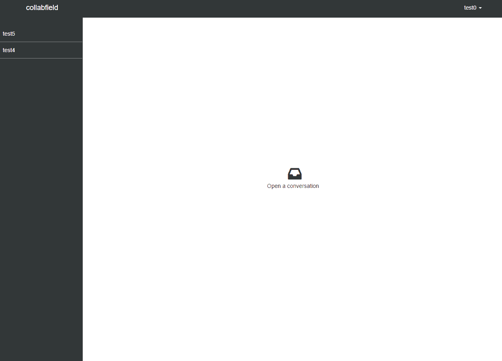**

**然后你可以打开你的任何对话。**

******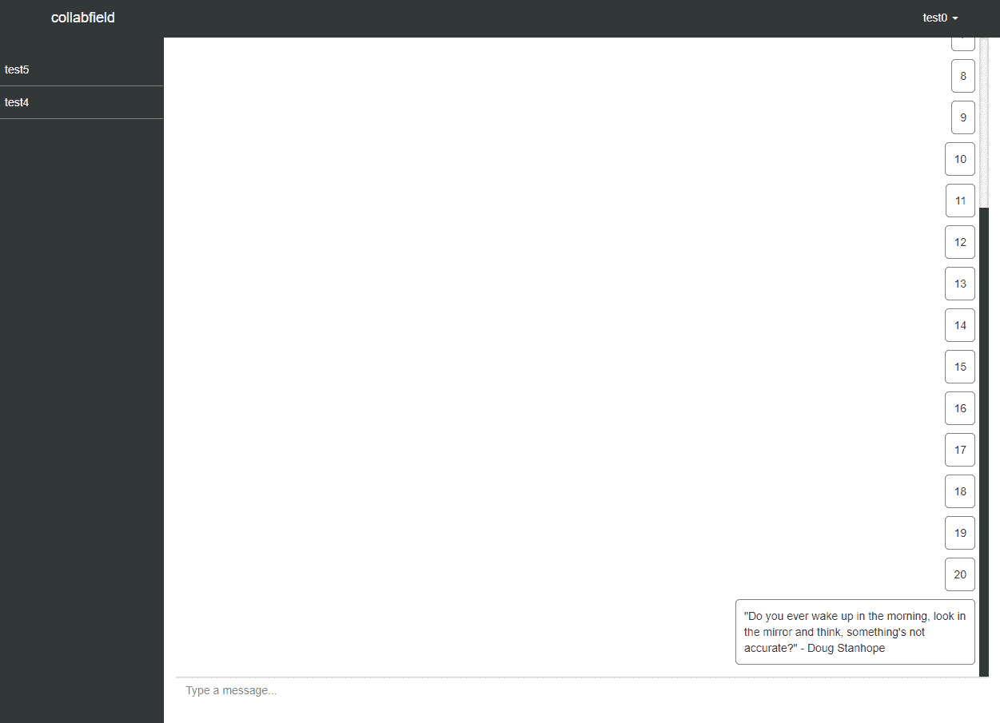**

**提交更改。**

**现在，在较小的屏幕上，当用户点击导航栏的链接打开对话时，他们的对话应该在 messenger 中打开，而不是在对话窗口中打开。要做到这一点，我们必须为较小的屏幕创建不同的链接。**

**在导航的`_private.html.erb`部分中，存储了一个打开私人对话的链接，为小屏幕设备添加一个额外的链接。将此链接添加到文件中的`open_private_conversation_path`路径链接的正下方**

```
`<%= link_to recipient.name, 
        open_messenger_path(id: recipient.id, 
                            smaller_device: true, 
                            type: 'private'), 
        class: 'smaller-screen-link' %>` 
```

**layouts/navigation/header/dropdowns/conversations/_private.html.erb**

**在较小的屏幕上，将显示此链接，而不是之前专用于较大屏幕的链接。添加一个额外的链接来打开群组对话**

```
`<%= link_to truncate(conversation.name, :length => 40), 
          open_messenger_path(group_conversation_id: conversation.id, 
          smaller_device: true, type: 'group'), 
          class: 'smaller-screen-link' %>` 
```

**layouts/navigation/header/dropdowns/conversations/_group.html.erb**

**我们在不同屏幕尺寸上看到不同链接的原因是，之前我们已经为`bigger-screen-link`和`smaller-screen-link`类设置了 CSS。**

**提交更改。**

```
`git add -A
git commit -m "Inside _private.html.erb and _group.html.erb, in the 
layouts/navigation/header/dropdowns/conversations, add alternative
links for smaller devices to open conversations"`
```

**Messenger 在桌面和移动设备上的版本会略有不同。在`messenger.js`里面写一些 JavaScript，这样在用户点击打开对话后，js 会决定是否显示移动版。**

```
`// if the messenger is opened on a smaller screen device
// show the messenger's version for mobile devices
$(".messenger .col-sm-2 ul").on( "click", "a", function() {
    var col_2_width = $('.messenger .col-sm-2').css('width');
    var window_width = '' + $('.messenger').width() + 'px';
    // check if bootstrap columns are stacked (page is opened on a smaller device)
    if (col_2_width == window_width) {
        $('body nav').hide();
        $('.messenger .col-sm-2').hide();
        $('.messenger .col-sm-10').show();
        $('body').css('margin', '0 0 0 0');
        $('.messenger').css('height', '100vh');
    }
});`
```

**assets/javascripts/messenger.js**

**现在，当你在移动设备上打开一个对话时，它看起来像这样**

**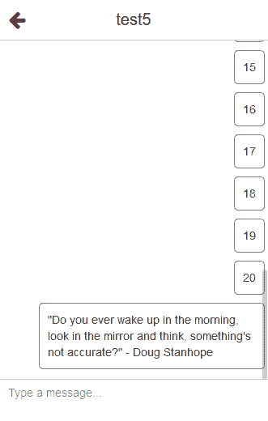**

**提交更改。**

```
`git add -A
git commit -m "Add JavaScript to messenger.js to show a different
messenger's version on mobile devices"`
```

**现在让群组对话在 messenger 上发挥作用。messenger 的大部分工作已经完成，因此建立群组对话将变得更加容易。如果你回头看看`MessengersController`里面，我们有`get_group_conversation`动作。为它创建一个模板文件:**

```
`$('.conversation').replaceWith('<div class="conversation group-conversation"></div>');
$('.conversation').append("<%= j(render 'messengers/group_conversation',\
                                         conversation: @conversation) %>");`
```

**messengers/get_group_conversation.js.erb**

**然后创建一个文件以在 messenger 中呈现群组对话:**

```
`<% @is_messenger = true %>
<%= render 'messengers/group_conversation/details', 
            conversation: conversation %>
<%= render 'group/conversations/conversation/messages_list', 
            conversation: conversation %>
<%= render 'messengers/group_conversation/new_message_form', 
            conversation: conversation %>`
```

**messengers/_group_conversation.html.erb**

**创建其分音:**

```
`<div class="conversation-details">
  <%= link_to :back do %>
    <i class="fa fa-arrow-left back-to-chats-main" aria-hidden="true"></i>
  <% end %>
  <div class="conversation-name">
    <%= conversation.name %>
  </div>
</div>`
```

**messengers/group_conversation/_details.html.erb**

```
`<form class="send-group-message">
  <input  name="conversation_id" 
          type="hidden" 
          value="<%= conversation.id %>">
  <input name="user_id" type="hidden" value="<%= current_user.id %>">
  <textarea name="content" 
            rows="2" 
            class="form-control" 
            placeholder="Type a message..."></textarea>
  <input type="submit" class="btn btn-success send-message">
</form>`
```

**messengers/group_conversation/_new_message_form.html.erb**

**提交更改:**

```
`git add -A
git commit -m "Create a get_group_conversation.js.erb template and 
its partials inside the messengers"`
```

**这就是 messenger 中的群组对话:**

**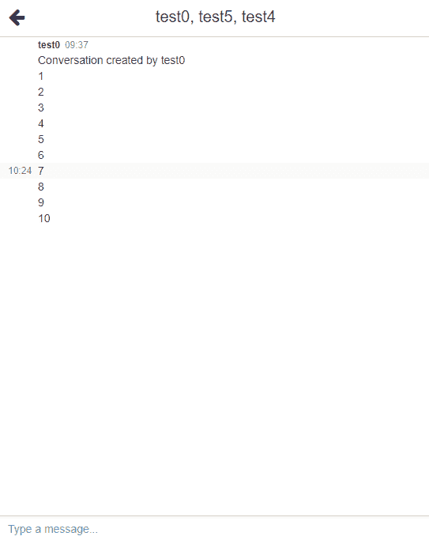**

### **5.通知**

**该应用程序已经具备了所有的基本特性。在这一部分，我们将把精力放在增强这些重要特性上。当其他用户试图与您联系时，即时通知可以提供更好的用户体验。让我们在用户收到联系请求更新或加入群组对话时提醒他们。**

#### **联系人请求**

**生成将处理所有用户通知的通知通道。**

```
`rails g channel notification`
```

```
`class NotificationChannel < ApplicationCable::Channel
  def subscribed
    stream_from "notifications_#{current_user.id}"
  end

  def unsubscribed
    stop_all_streams
  end

  def contact_request_response(data)
    receiver_user_name = data['receiver_user_name']
    sender_user_name = data['sender_user_name']
    notification = data['notification']
    receiver = User.find_by(name: receiver_user_name)

    ActionCable.server.broadcast(
      "notifications_#{receiver.id}",
      notification: notification,
      sender_user_name: sender_user_name,
    )

  end
end`
```

**channels/notification_channel.rb**

**提交更改。**

```
`git add -A
git commit -m "Create a NotificationChannel"`
```

**每个用户都将拥有自己独特的通知渠道。然后我们有了`ContactRequestBroadcastJob`，它将广播联系请求和响应。**

**生成作业。**

```
`rails g job contact_request_broadcast`
```

```
`class ContactRequestBroadcastJob < ApplicationJob
  queue_as :default

  def perform(contact_request)

    sender = User.find(contact_request.user_id)
    receiver = User.find(contact_request.contact_id)
    ActionCable.server.broadcast(
      "notifications_#{receiver.id}",
      notification: 'contact-request-received',
      sender_name: sender.name,
      contact_request: render_contact_request(sender, contact_request)
    )

  end

  private

  def render_contact_request(sender, contact_request)
    ApplicationController.render(
      partial: 'contacts/contact_request',
      locals: { sender: sender }
    )
  end

end`
```

**jobs/contact_request_broadcast_job.rb**

**创建一个`_contact_request.html.erb` partial，用于在导航栏的下拉菜单中添加联系人请求。在这种情况下，我们将使用`ContactRequestBroadcastJob`动态添加这些请求**

```
`<li class="contact-request" data-user-name="<%= sender.name %>">
  <div class="sixty-percent">
    <span class="contact-name"><%= sender.name %></span> 
  </div>
  <div class="forty-percent">
    <span class="accept-request">
      <%= link_to "Accept",  
                  contact_path(id: sender.id), 
                  remote: true, 
                  method: "put" %>
    </span> 
    <span class="decline-request">
      <%= link_to "Decline",
                  contact_path(id: sender.id), 
                  remote: true, 
                  method: :delete %>
    </span>
  </div>
</li>`
```

**contacts/_contact_request.html.erb**

**每次创建新的`Contact`记录时触发作业:**

```
`after_create_commit { ContactRequestBroadcastJob.perform_later(self) }`
```

**models/contact.rb**

**提交更改。**

```
`git add -A
git commit -m "Create a ContactRequestBroadcastJob"`
```

**然后在导航栏上创建一个下拉菜单:**

```
`<a class="dropdown-toggle" data-toggle="dropdown" href="#">
  <i class="fa fa-user-o" aria-hidden="true">
    <span id="unresponded-contact-requests"></span>
  </i>
</a>
<ul class="dropdown dropdown-menu" role="menu">
  <%= render nav_contact_requests_partial_path %>
</ul><!-- dropdown-menu -->`
```

**layouts/navigation/header/dropdowns/_contact_requests.html.erb**

**定义`nav_contact_requests_partial_path`助手方法:**

```
`def nav_contact_requests_partial_path
  # if contact requests exist
  if current_user.pending_received_contact_requests.present? 
    'layouts/navigation/header/dropdowns/contact_requests/requests' 
  else # contact requests do not exist 
    'layouts/navigation/header/dropdowns/contact_requests/no_requests'
  end
end`
```

**helpers/navigation_helper.rb**

**用规范包装该方法，然后创建部分文件:**

```
`<% current_user.pending_received_contact_requests.each do |user| %>
  <%= render partial: "layouts/"\
                      "navigation/"\
                      "header/"\
                      "dropdowns/"\
                      "contact_requests/"\
                      "request", 
             locals: { user: user } %>
<% end %>`
```

**layouts/navigation/header/dropdowns/contact_requests/_requests.html.erb**

```
`<li class="no-requests">You have no new requests</li>`
```

**layouts/navigation/header/dropdowns/contact_requests/_no_requests.html.erb**

**在`_dropdowns.html.erb`文件中，渲染`_contact_requests.html.erb`，就在对话的下面。因此，我们可以在导航栏上看到联系人请求的下拉菜单**

```
`<div class='pull-right' id='contacts-requests'>
  <%= render 'layouts/navigation/header/dropdowns/contact_requests' %>
</div>`
```

**layouts/navigation/header/_dropdowns.html.erb**

**提交更改。**

```
`git add -A
git commit -m "
- Create a _contact_requests.html.erb inside the
  layouts/navigation/header/dropdowns
- Define a nav_contact_requests_partial_path in NavigationHelper"`
```

**还要为单个联系人请求创建一个部分文件:**

```
`<li class="contact-request" data-user-name="<%= user.name %>">
  <div class="sixty-percent">
    <span class="contact-name"><%= user.name %></span> 
  </div>
  <div class="forty-percent">
    <span class="accept-request">
      <%= link_to "Accept",  
                  contact_path(id: user.id), 
                  remote: true, 
                  method: "put" %>
    </span> 
    <span class="decline-request">
      <%= link_to "Decline",
                  contact_path(id: user.id), 
                  remote: true, 
                  method: :delete %>
    </span>
  </div>
</li><!-- contact-request -->`
```

**layouts/navigation/header/dropdowns/_request.html.erb**

**提交更改。**

```
`git add -A
git commit -m "Create a _request.html.erb inside the
layouts/navigation/header/dropdowns"`
```

**将 CSS 添加到联系人请求下拉菜单的样式和位置:**

```
`#contacts-requests {
  li {
    color: black;
    background-color: $backgroundColor;
    border-bottom: 1px solid $navbarColor;
  }
  i {
    position: relative;
  }
  .sixty-percent {
    display: inline-block;
    width: 60%;
  }
  .forty-percent {
    display: inline-block;
    float: right;
    width: 40%;
  }
  .contact-request, .contact-request-responded {
    .contact-name {
      padding-left: 10px;
      padding-right: 20px;
    }
    .accept-request, .decline-request {
      a {
        border: 2px solid $navbarColor;
        padding: 5px;
      }
      &:hover a {
        border-color: black;
      }
      transition: 0.15s border-color;
      transition: 0.15s background-color;
    }
    .accept-request {
      a:hover {
        background-color: black !important;
      }
      a {
        background-color: $navbarColor;
        color: white !important;
      }
    }
    .decline-request {
      a {
        background-color: $backgroundColor;
        color: black !important;
      }
      a:hover, &:hover {
        background-color: white !important;
      }
    }
    .accepted-request {
      background: $navbarColor;
      color: white;
      padding: 5px;
    }
  }
  .no-requests {
    text-align: center;
  }
}

#unresponded-contact-requests {
  top: 0;
  right: 5px;
  background: #3F4EBF;
}`
```

**assets/stylesheets/partials/layout/navigation.scss**

**提交更改。**

```
`git add -A
git commit -m "Add CSS in navigation.scss to style and position the
contact requests drop down menu"`
```

**在导航栏上，我们现在可以看到联系人请求的下拉菜单。**

**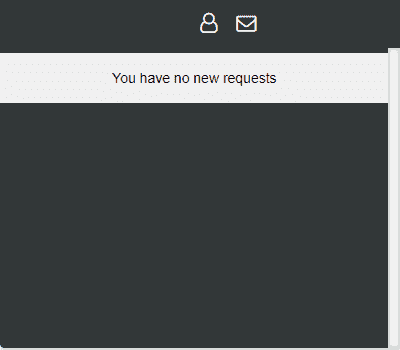****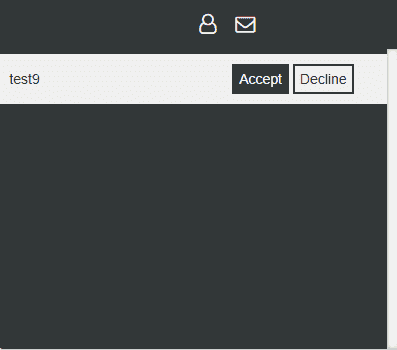**

**我们有通知渠道和广播联系请求更新的工作。现在我们需要在客户端创建一个连接，这样用户就可以实时发送和接收数据。**

```
`App.notification = App.cable.subscriptions.create("NotificationChannel", {
  connected: function() {},
  disconnected: function() {},
  received: function(data) {
    // if a contact request was accepted
    if (data['notification'] == 'accepted-contact-request') {

    }
    // if a contact request was declined
    if (data['notification'] == 'declined-contact-request') {

    }
    // if a contact request was received
    if (data['notification'] == 'contact-request-received') {
      conversation_window = $('body').find('[data-pconversation-user-name="' + data["sender_name"] + '"]');
      has_no_contact_requests = $('#contacts-requests ul').find('.no-requests');
      contact_request = data['contact_request'];

      if (has_no_contact_requests.length) {
        // remove has no contact request message
        has_no_contact_requests.remove();
      }

      if (conversation_window.length) {
        // remove add user to contacts button
        conversation_window.find('.add-user-to-contacts-message').parent().remove();

        conversation_window.find('.add-user-to-contacts').remove();
        conversation_window.find('.conversation-heading').css('width', '360px');
      }

      // append a new contact request
      $('#contacts-requests ul').prepend(contact_request);
      calculateContactRequests();
    }

  },
  contact_request_response: function(sender_user_name, receiver_user_name, notification) {
    return this.perform('contact_request_response', {
      sender_user_name: sender_user_name,
    	receiver_user_name: receiver_user_name,
    	notification: notification
    });
  }
});`
```

**assets/javascripts/channels/notification.js**

**请注意，接受和拒绝联系请求的`if` 语句中有空代码块。您可以在这里尝试并添加自己的代码。**

**还创建一个`contact_requests.js`文件，在某些事件之后执行 DOM 更改，并使用`contact_request_response`回调函数将执行的动作广播给对方用户**

```
`$(document).on('turbolinks:load', function() {
    // when a contact request is accepted, mark it as accepted
    $('body').on('click', '.accept-request a', function() {
        var sender_user_name = $('nav #user-name').html();
        var receiver_user_name = $(this)
                                    .parents('[data-user-name]')
                                    .attr('data-user-name');

        var requests_menu_item = $('#contacts-requests ul');
        requests_menu_item = requests_menu_item
                                 .find('\
                                       [data-user-name="' + 
                                       receiver_user_name + 
                                       '"]');
        var conversation_window_request_status = $('.conversation-window')
                                                    .find('[data-user-name="' + 
                                                           receiver_user_name + 
                                                           '"]');
        // if a conversation is opened in the messenger                                            
        if(conversation_window_request_status.length == 0) {
          conversation_window_request_status = $('.contact-request-status');
        }   
        requests_menu_item.find('.decline-request').remove();
        requests_menu_item
            .find('.accept-request')
            .replaceWith('<span class="accepted-request">Accepted</span>');
        requests_menu_item
            .removeClass('contact-request')
            .addClass('contact-request-responded');
        conversation_window_request_status
            .replaceWith('<div class="contact-request-status">\
                              Request has been accepted\
                          </div>');
        calculateContactRequests();
        // update the opposite user with your contact request response
        App.notification.contact_request_response(sender_user_name, 
                                                  receiver_user_name, 
                                                  'accepted-contact-request');
    });

    // when a contact request is declined, mark it as declined
    $('body').on('click', '.decline-request a', function() {
        var sender_user_name = $('nav #user-name').html();
        var receiver_user_name = $(this)
                                    .parents('[data-user-name]')
                                    .attr('data-user-name');
        var requests_menu_item = $('#contacts-requests ul')
                                    .find('[data-user-name="' + 
                                           receiver_user_name + 
                                           '"]');
        var conversation_window_request_status = $('.conversation-window')
                                                    .find('[data-user-name="' + 
                                                           receiver_user_name + 
                                                           '"]');
        // if a conversation is opened in the messenger                                            
        if(conversation_window_request_status.length == 0) {
          conversation_window_request_status = $('.contact-request-status');
        }   
        requests_menu_item.find('.accept-request').remove();
        requests_menu_item
            .find('.decline-request')
            .replaceWith('<span class="accepted-request">Declined</span>');
        requests_menu_item
            .removeClass('contact-request')
            .addClass('contact-request-responded');
        conversation_window_request_status
            .replaceWith('<div class="contact-request-status">\
                              Request has been declined\
                          </div>');
        calculateContactRequests();
        // update the opposite user with your contact request response
        App.notification.contact_request_response(sender_user_name, 
                                                  receiver_user_name, 
                                                  'declined-contact-request');
    });

    // when a contact request is sent
    $('body').on('click', '.add-user-to-contacts-notif', function() {
        var sender_user_name = $('nav #user-name').html();
        var receiver_user_name = $(this)
                                    .parents('.conversation-window')
                                    .find('.contact-name-notif')
                                    .html();
        App.notification.contact_request_response(sender_user_name, 
                                                  receiver_user_name, 
                                                  'contact-request-received');
    });

    calculateContactRequests();
});

function calculateContactRequests() {
  var unresponded_requests = $('#contacts-requests ul')
                                .find('.contact-request')
                                .length;
  if (unresponded_requests) {
    $('#unresponded-contact-requests').css('visibility', 'visible');
    $('#unresponded-contact-requests').text(unresponded_requests);
  } else {
    $('#unresponded-contact-requests').css('visibility', 'hidden');
    $('#unresponded-contact-requests').text('');
  }
}`
```

**assets/javascripts/contact_requests.js**

**此外，在从对话窗口发送新的联系人请求后，删除再次发送请求的选项。在对话的`options.js`文件中，添加以下内容:**

```
`// on the add-user-to-contacts link click
// remove the link and notify, that the request has been sent
$(document).on('click', 
               '.add-user-to-contacts, .add-user-to-contacts-notif', 
               function(e) {
    var conversation_window = $(this).parents('.conversation-window,\
                                               .conversation');
    conversation_window
        .find('.add-user-to-contacts')
        .replaceWith('<div class="contact-request-sent"\
                           style="display: block;">\
                          <div>\
                              <i class="fa fa-question"\
                                 aria-hidden="true"\
                                 title="Contact request sent">\
                              </i>\
                          </div>\
                      </div>');
    conversation_window.find('.add-user-to-contacts-message').remove();
    conversation_window
        .find('.messages_list ul')
        .append('<div class="add-user-to-contacts-message">\
                     Contact request sent\
                 </div>');
});`
```

**assets/javascripts/conversations/options.js**

**现在，联系请求将被实时处理，用户界面将在特定事件后改变。**

**多亏了托尼·肖特利弗。**