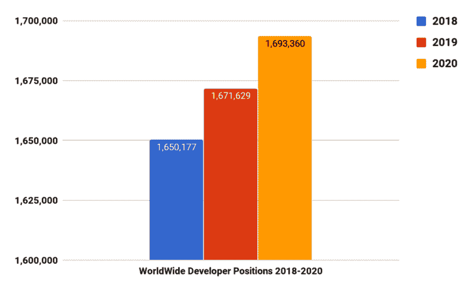

# 让我们揭穿关于学习如何编码的主要神话

> 原文：<https://www.freecodecamp.org/news/lets-debunk-the-main-myths-about-learning-how-to-code-4e7774f8eee6/>

有多少次你因为听到的事情而想过放弃成为一名网页开发者的梦想？

也许你担心没有大学学位。也许你担心*找不到工作*。或者也许你只是*认为* *你不够聪明，无法在那些“天才”开发者身边工作*。

作为一个软件团队的领导者和初级开发人员的导师，我经常被问到一些问题，听到一些关于我是一名开发人员的陈述，但是，很明显这些都不是真的。

因此，让我们来谈谈学习编码的一些常见误区。

### 误解 1:我必须去大学学习编程

人们经常提到，你需要去大学学习如何编码，并找到一份工作。你必须奋斗 4/5 年，靠啤酒和方便面生活，并获得学位，才能被认为是软件开发人员。

有一段时间这是真的，因为很多公司和职位要求你在申请之前有一个 4 年的大学学位！大公司已经远离了这个时代(理应如此)。

我不是说每个人都应该像史蒂夫·乔布斯和马克·扎克伯格那样从大学辍学，也不是说我降低了大学学位的价值——你在大学里会学到很多东西，获得很多技能！但是时代在变。

如果你是一个自学成才的开发人员，你有关键的技能，你会得到一份工作。

### 误解 2:要成为一名开发者，我需要成为数学专家

我远非数学专家。昨天我不得不把 87.63 美元的晚餐账单分成三份，我只能说我不会在倒计时中出现了。

如果你想成为一名优秀的开发人员，你不一定需要擅长数学。然而，你需要有很强的解决问题的能力&逻辑思维的能力。

这就是这个神话的来源——因为擅长数学的人通常是优秀的问题解决者和逻辑思考者。但是它们并不互相排斥，所以如果你不擅长数学，不要担心，如果你能解决问题，你仍然会是一个伟大的开发者。

### 误解 3:我需要精通数据结构和算法

我做过初级开发人员、高级开发人员，现在是团队领导，唯一一次不得不使用冒泡排序、快速排序、二分搜索法或“反转链表”的时候是在一次面试中。作为你日常工作的一部分，特别是在 web 开发中，你很少需要用到 90%的东西。

务必了解它们以及它们是如何工作的！即使是出于教育和面试的目的。了解它们将有助于你的逻辑和解决问题的能力。如果你决定将你的职业转向一条不同的道路，比如金融、数据科学或后端繁重的工作，你会遇到更多数据结构和算法的用途。

### 误解 4:我需要学习所有的语言和技术

下面是我知道的一些东西:JavaScript，Node.js，React.js，React Native，Java，CSS/HTML，REST API，Docker，基本的 shell 命令，基本的网络东西，一些设计模式。

下面列出我不知道的东西:Angular.js，Vue.js，PHP，GraphQL，Python，Ruby，PHP，TypeScript，Serverless，C/C++，Swift…

没有人知道所有的技术。你不需要什么都知道。公司更倾向于雇用精通一种语言的人，而不是对多种类似语言知之甚少的人。

如果你想成为一名高效的开发人员，并快速晋升，选择一条道路，并掌握你所选择的道路的技术。

### 误区 5:几个月后我会找到工作！

啊，要是这个是真的就好了！有许多令人敬畏的成功故事，人们自学如何编码，并在几个月内找到一份工作。我认为重要的是要强调，这并不是对每个人都适用的。你应该在开始你的旅程之前设定现实的期望，这样如果几个月后你没有到达你想去的地方，你也不会灰心丧气。

在你扔掉笔记本电脑放弃之前，我不是说你几个月后就找不到工作了(如果你找到了，太棒了！请发微博给我让我知道！)，但时间可能会长一点。

“需要多长时间？!"，我听到你问了！答案取决于:

*   你有多少空闲时间
*   你能多快学会适合你所选择的道路的技术
*   你是多么有激情和决心
*   你所在地区的工作机会
*   [你的简历有多好](https://www.chrisblakely.dev/how-to-write-an-awesome-junior-developer-resume-in-a-few-simple-steps/)

所以，如果你已经学习编码几个月了，没有看到你想要的进步，不要放弃！我经历了 20 多次面试和数不清的申请，才得到第一份实习工作。

> 记住，这是一场马拉松而不是短跑，好事情会降临到那些耐心等待的人身上。

我成功地把两句激励性的话合并成了一句。我觉得自己很聪明。？

### 误解 6:我太老了，学不了编码

这总是让我想起《星球大战》中尤达说“他太老了，不能开始训练”的那一幕。你很幸运，你正在学习如何编程，而不是如何成为一名绝地大师(据我所知)——这意味着你不必在 5 岁时就开始。

还是那句话，如果你能胜任某一套技术，无论年龄大小，你都会得到一份工作。你应该把你从其他工作/途径中获得的额外经验看作是加分项——计划、解决问题和人际交往技巧都是成为优秀开发人员的一部分。

我最近和一位 40 多岁的女士一起工作，她拥有自己的咖啡馆，她想学习如何编写代码来创建自己的网站。她的网站已经开通，她现在接受在线订单。[像这样的故事还有很多](https://medium.freecodecamp.org/stories-from-300-developers-who-got-their-first-tech-job-in-their-30s-40s-and-50s-64306eb6bb27)，一定要去看看！

可能性是无限的。不要担心你的年龄是一个问题，而是担心学习编码！

### 误解 7:每个人都在学习如何编码，但是没有足够的工作

是的，越来越多的人正在自学如何编码，这是事实。的确如此，随着世界越来越依赖技术，编码将很快变得和阅读、写作一样重要。

这导致了工作短缺的神话。有什么比用一个好的图表来揭穿这个神话更好的方法呢？

Source: monstertemplates.com

正如你所看到的，工作的数量正在上升。还不服气？在谷歌上搜索“网络开发人员职位”，看看有多少职位可供选择。

### 就是这样！结尾…

开个玩笑，这里还有一个:

### 误解 8:学习编码是昂贵的

学习编码，不管出于什么原因，都和其他学科没有什么不同。如果你正在学习摄影，你不会马上去买一个 3000 美元的相机和三脚架。如果你开始跑步，你不会首先去买最贵的跑鞋和跑步装备。

相反，你可以先用你的手机摄像头，或者旧运动鞋，看看你是否喜欢这个爱好。然后，随着你越来越多地使用它，你可能会升级到更昂贵的东西。

我对那些寻求网络开发职业的人的建议是一样的。有很多免费的资源，可以帮助你在花钱上更贵的课程之前先入门。

例如， [freeCodeCamp](https://www.chrisblakely.dev/learning-to-code-myths/freeCodeCamp.org) ，有一个完整的课程，带你从最基础的东西到更高级的东西，而且它是免费的——你可以说在完成它之后你就不需要付费的课程了。

### 真正的结局

希望我已经澄清了一些被证明只是神话的常见神话。如果你想成为一名开发者，不管你是什么背景，什么情况，都可以。努力工作，有耐心，结果就会来。

感谢阅读！

将最新的指南、技巧和初级开发人员课程直接发送到您的收件箱(以及一些独家资料！)，一定要加入 [www.chrisblakely.dev](https://www.chrisblakely.dev/#sign-up) 的邮件列表！