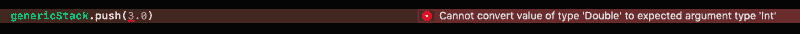
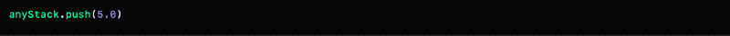

# 让我们剖析一下 Swift 中泛型和 Any 类型之间的区别

> 原文：<https://www.freecodecamp.org/news/lets-dissect-the-differences-between-generics-and-the-any-type-in-swift-86c8214c35e4/>

Swift 是当今最顶级的类型安全语言之一。？？？

#### ***Ohhh 等等！！如果一种语言是类型安全的，这意味着什么？？***

类型安全语言总是确保操作使用当时可用的正确类型的数据。✓

如果一种语言能够声明不同的数据类型(例如，Int、Float、String、Array、Dictionary ),并且能够确保用特定数据类型声明的变量永远不会保存不同类型的数据，那么这种语言就称为类型安全语言。

在类型安全语言中，总是要进行类型检查。它可能发生在编译时或运行时，具体取决于语言。✅

#### ***现在，Swift 中有哪些泛型？？***

泛型是类型安全的，帮助我们编写灵活的、可重用的函数和类型。使用泛型，我们可以编写适用于所有数据类型的代码。由于 Swift 是一种类型安全的语言，在不破坏这一点的情况下，我们能够编写通用代码，避免代码重复。

让我们举一个简单的例子:数组是一个有序的集合，可以保存相同类型的数据。这就是为什么在数组的定义中，我们可以看到它采用了通用类型的**元素*。*** 于是一个数组变成了一个**泛型类型的集合**。

***Ok。酷毙了。那么 Swift 中的 Any 类型是什么？*** ？？？

Swift 还支持任何类型。顾名思义，它可以表示任何类型的实例，如结构、类、枚举和函数类型。

#### ***那么客观的 C id 和斯威夫特的有任何一样吗？*** ？

在 Swift 3 中，Objective C *id* type 映射到 Swift 的 Any type。这提高了 Swift 和 Objective C 的兼容性。

#### ***但是怎么和为什么呢？？***

在 Swift 2 中，Objective C *id* 被映射到 Swift 的 Any object。这在大多数情况下工作良好，但有时会导致意想不到的行为。Swift 中的一个关键概念是值类型，这种映射并没有恰当地体现这一概念。

Swift 只是 iOS 开发的新语言，Objective C 已经存在多年了。因此，当然大多数项目都是在目标 C 中开发的。现在，为了将目标项目转换为 Swift 项目，要求应该能够将任何 Swift 类型桥接到任何目标 C 对象。

但这对于 Swift 类和 Swift 值类型(如 Int、String、Float)来说不是问题，因为它们已经有了自己的 Objective C 对应物。对于没有任何 Objective C 对应物的 Swift 值类型，问题就出现了。

所以为了解决这个问题，Objective C id 类型映射到 Swift Any 类型。✅✅✅

**足够的定义？。现在让我们进入正题。通过以上几点，看起来泛型和 Any 类型是一样的。但他们真的是吗？？？**

在高层次上，任何可能看起来都类似于泛型。但是让我们试着找出一些不同之处-？？？

**我们都知道数据结构中的**栈**是什么，对吧？堆栈是一种基本的线性数据结构，其中条目的插入和删除只发生在一端。**

**现在我们将在 Swift 中实现堆栈结构。首先，我们将使用泛型实现，然后使用 Any 类型。**

#### ****栈使用泛型实现:****

**上面的栈实现使用的是泛型。该结构采用通用类型的**元素**项，并使用该项实现堆栈。现在让我们用通用栈做一些操作:**

它声明了一个通用堆栈，可以保存一个整数类型的元素。我们将整数元素压入堆栈。到目前为止，一切都很好。

但是如果我想把一个浮动元素推到泛型 Stack 之上呢？

****❌❌哎呀！编译错误！❌❌****

#### ****栈使用任意类型实现:****

在这个堆栈实现中，items 数组可以保存任何类型的元素。我们没有在定义中指定*项*数组元素的确切数据类型。现在让我们对这个堆栈做同样的基本操作:

没问题，对吧？这里一切都很好。最初，我们声明了一个堆栈，并将两个整数元素放入其中。当我们调用 *show()* 方法时，它打印出确切的数组 *[3，4]。*

****现在让我们将一个浮点值推入其中。☄️****

****✅✅没有错误！一切正常！✅✅****

#### *****那么幕后发生的是什么？为什么我们没有得到任何错误？？？*** ？**

**泛型基本上告诉编译器:**

> 我已经声明了一个泛型类型，稍后我会给你一个确切的类型。我要你在我指定的任何地方使用这种字体。

**Any 类型基本上告诉编译器:**

> 不要担心这个变量，这里不需要应用任何类型让我做我想做的。

****泛型可以用来定义灵活的函数，但是参数的类型还是由编译器来检查。任何类型都可以用来躲闪 Swift 的类型系统。？****

****在通用堆栈声明**中，我们告诉编译器堆栈应该只接受整数类型。那么当我们试图插入一个 float 类型的元素时，就意味着我们违背了这个承诺。因此，它抛出一个编译时错误。它总是期望元素应该是整数类型。**

****但是对于任意栈**，我们没有得到任何编译时或运行时错误。即使我们调用了 *show()* 方法，它也会将堆栈打印为 *[3，4，5.0]* ，这意味着堆栈保存整数和浮点类型的值。因此，在任何堆栈中，都没有类型限制，我们可以将任何类型的值放入其中(但有可能出现运行时异常)。**

### **结论**

因此，如果我们使用泛型，那么我们可以编写灵活的函数、结构、类和协议，而不会损害 Swift 的类型安全性。但是如果我们使用 Any 类型，那么我们就是自己的老板，我们几乎可以做任何我们想做的事情。

*****？？？干杯！！！感谢您的阅读！！？？？*****