# 让我们增强！我们如何找到@rogerkver 的 1000 美元钱包混淆的私人钥匙

> 原文：<https://www.freecodecamp.org/news/lets-enhance-how-we-found-rogerkver-s-1000-wallet-obfuscated-private-key-8514e74a5433/>

米歇尔·萨萨诺

# **让我们增强！我们如何找到** @rogerkver 的 1000 美元钱包**混淆的私人密钥**

在我们开始之前:我们不认识记录采访的记者，也不认识罗杰·弗。任何能接触到这段视频的人都有可能拿到私钥。

我们可以简单地将这篇文章命名为“二维码是多么伟大，我们是如何从零开始恢复一个二维码的。”但当二维码是 1000 美元比特币现金钱包的钥匙时，就有趣多了。

比特币、以太坊、莱特币、Dash、Neo……加密货币遍地开花，并且发展迅速。我从 2013 年开始关注比特币(关注并不意味着购买)，不得不阅读[掌握比特币](https://www.amazon.com/Mastering-Bitcoin-Programming-Open-Blockchain/dp/1491954388/ref=sr_1_1?ie=UTF8&qid=1508344325&sr=8-1&keywords=Mastering+Bitcoin) 3 遍，以了解它的每个部分是如何真正工作的，并能够向其他人解释它。尽管如此，我还是跟不上市场，新的加密货币，新的叉子，新的 ico 无处不在，每天都有。

通过在线学习教程，很容易开始使用加密货币。下载一个随机钱包应用程序，生成一对随机密钥，并在随机交易所购买一些密码，但加密货币的学习曲线很难。

如果你不完全理解这一切是如何工作的，你应该避免加密货币。如果你不这样做，你就有可能陷入其中一个陷阱，从而失去你的钱。其中之一，保护您的私钥安全，就是本文的主题。

> 密码俱乐部的第一条规则是:你不能分享你的私人钥匙。

当你拥有加密货币时，你拥有的最珍贵的东西就是你的私钥。如果你丢失了你的私人钥匙，你就失去了你的钱。如果有人得到了你的私人钥匙，你就会失去你的钱。简单。

通过这个真实世界的例子，我们将一步一步地向你展示我们如何恢复由 [@rogerkver](http://twitter.com/rogerkver) 为法国电视节目“Complément d'enquête”制作的 1000 美元比特币钱包的私钥，尽管它被混淆了。

### 介绍

上周，法国二台播出了一部关于比特币的纪录片。他们采访了@rogerkver ，他决定向最快的观众提供 1000 美元的比特币。不幸的是，二维码和私钥被法国 2 号混淆了。

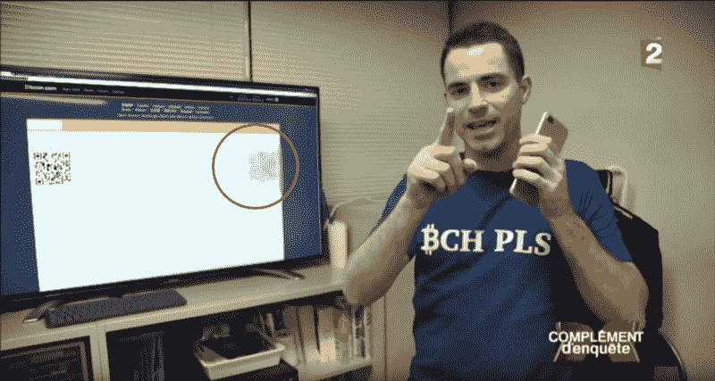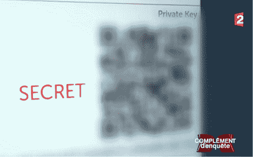

n°1 — Obfuscated QR code and private key.

我看到一些人在推特上抱怨这一点，有些人甚至在推特上说法国 2 号决定把比特币留给自己。这是错误的，法国 2 必须混淆密钥，不是因为他们想保留比特币，而是因为他们有法律义务这样做。

你可以尝试用尽可能多的不同应用程序扫描二维码，你将无法解码它，因为有太多的模糊。

故事本可以到此结束，1000 美元将永远丢失，因为我认为罗杰从未保留过私钥的副本。只有录制采访的记者能够兑换比特币。

**但是**，在采访即将结束的时候，他们展示了一小部分清晰的二维码。他们是故意这样做的吗？他们知道如果没有人能找到私钥，这 1000 美元就会丢失。或者这只是你开始使用加密货币时可能犯的错误之一？

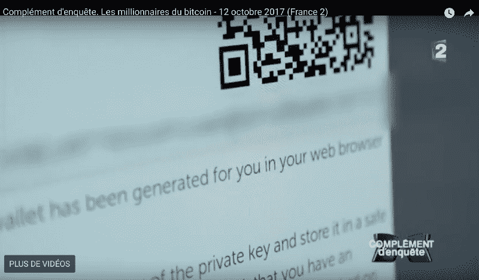

n°2 — Clear part of the QR code. Obfuscated private key string below.

我正要给我的朋友 [@clementstorck](https://twitter.com/clementstorck) 发邮件的时候收到了他拍的二维码截图。我们决定研究一下，看看能否从这么少量的信息中找到私钥。

让我们明确一点，仅通过暴力破解找到私钥的几率接近于零。我们知道二维码的属性以及它们对损坏的恢复能力。我们的目标是收集尽可能多的信息，使未知参数尽可能小。我们知道在某些时候我们将不得不使用暴力。经过下面所有的步骤，我们只需要暴力破解 2 097 152 个组合。

那么，我们从哪里开始？下面是我们检索私钥的所有步骤

1.  情报收集
2.  让我们增强！映象分析
3.  二维码标准第 1 部分
4.  QR 码重构
5.  二维码标准第 2 部分
6.  QR 码解码
7.  误差校正码
8.  Python 和蛮力

### 1 —信息收集

第一步是从采访中收集尽可能多的信息。我们一帧一帧地观看回放，并拍摄了一些截图，例如:

*   公钥，它让我们找到了一个(几乎)空空如也的 BTC 钱包。罗杰说过谎吗？推特上很多人都这么说。他没有撒谎，他在推特上发布了关于[的消息。我们不得不寻找一个](https://twitter.com/rogerkver/status/913705294546341888) [BCH 钱包](https://cashexplorer.bitcoin.com/address/17Qgadvc7pm51mV9r9zUAs4xU1XXwDRr8o)。

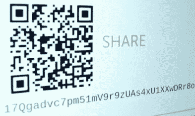

n°3 — The public key string and QR code: 17Qgadvc7pm51mV9r9zUAs4xU1XXwDRr8o

*   私钥字符串的模糊部分。我们将在图像分析步骤中利用这一点来获得前 6 个字母。纠错码步骤将给我们接下来的 7 个字母。

n°4 — Blurred part of the private key string. You can read some letters but it’s not very clear.

*   私钥的最后一个字母，这个也会对解锁私钥的最后 8 个字母很有帮助。

n°5 — The last letter of the private key. A nice “V”

*   二维码顶部和左侧的质量不好的截图。它们还将有助于在重建阶段获得(一点)更多的数据并完成 QR 码。

n°6 — The top of the QR code, first row can be exploited.

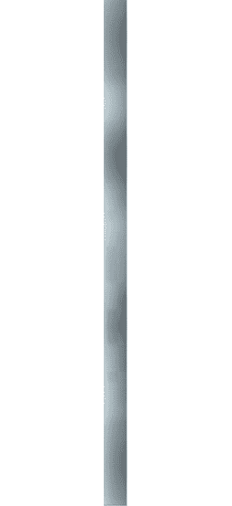

n°7 — Seriously ?? The left side of the QR code, first two columns can (partially) be exploited.

*   他用来创建公钥和私钥的工具是 Bitcoin.com 上的[单钱包工具。这给了我们关于二维码内数据的信息:一个 52 个字符长的钱包导入格式比特币私钥类似于这样:](https://tools.bitcoin.com/paper-wallet/)

> kwjiu 4 cvmdyxydbvkbx 2 XB sou 1 nxzgyxz 7 usqaemvsd 4 rdghopf

下一步是重新创建二维码。

### 2 —让我们增强！映象分析

好了，我们还有不到 1/3 的二维码，我们离私钥还很远。从我们拍摄的截图中可以了解到什么？

我们决定关注 2 个截图，第一个是私钥模糊的二维码，我们想知道二维码应用程序在处理后是否能够读取它。

我们想要处理的第二个屏幕截图是带有私钥字符串的那个。我们知道，如果我们想要 ECC(纠错码)步骤起作用，我们必须至少有少量的数据。

我们决定把截图发给我们的专家。收获颇丰:)

这是我们经过一些模糊处理后得到的结果。

*   二维码的非模糊版本，没有一个二维码应用程序能够解码它。我们想试一试，因为这个人对二维码做了一些碰撞测试，从评论来看，所有的二维码都是可扫描的。

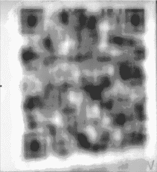

n°8 — We got nothing out of this picture. Only a confirmation of the last letter.

*   两个版本的私钥串不模糊。第一个给出了前四个字母(我们看不清楚“K”)，第二个给出了前六个字母(我们看不清楚“z”)。

n°9 — It’s fuzzy but you can read “?yUz”

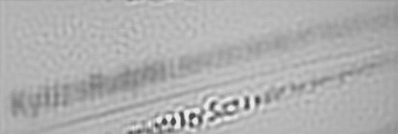

n°10 — A bit more clear. You can read up to the 6th letter “KyU?sR”.

让我们把这个信息留着以后用。他们会帮我们填一些东西。

### 3 —二维码标准第 1 部分

了解 QR 码的工作原理及其在恢复受损 QR 码时的 ECC 功能限制非常重要。

维基百科是一个良好的开端，但我们需要的一切都符合 [ISO/IEC 18004 标准](https://www.iso.org/standard/62021.html)(在 [Swisseduc](http://www.swisseduc.ch) 上有第一版的免费版本)。我们也是在网上找到[这个宝石](http://www.thonky.com/qr-code-tutorial/introduction)的。

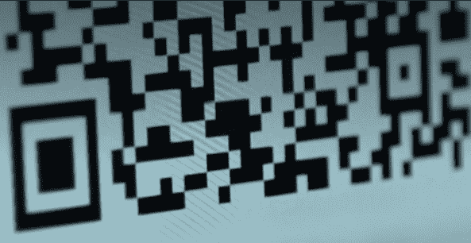

n°11 — The Error Correction level and the Mask of the QR code can be extracted from this screenshot.

在我们开始重建二维码之前，让我们看看使用 ISO 标准和二维码的结构，我们可以从这张图片中学到什么。

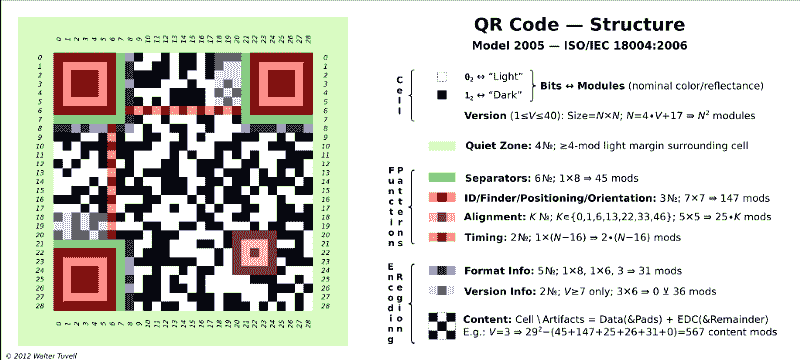

n°12 — By Wtuvell at English Wikipedia (Own work) [Public domain], via Wikimedia Commons

对我们来说，有趣的部分是蓝色的列(x:8，y:22–28)。

这是格式信息字符串(15 位序列)的一部分。5 个数据位和 10 个 [BCH](https://en.wikipedia.org/wiki/BCH_code) 纠错位)。位于(x:8，y:22–28)的位是字符串的第 8 到第 14 位。我们只有 15 位中的 7 位，但这足以找到我们需要的信息。

格式信息字符串对应用于 QR 码的纠错(EC)级别和掩码模式进行编码。有 4 个可能的 EC 级别(L、M、Q、H)和 8 个可能的掩码模式=> 32 个可能的格式信息字符串。

关于如何创建信息字符串的详细信息可在标准的第 76 页找到(附录 C-格式信息)。32 种可能性的列表可以在[这里](http://www.thonky.com/qr-code-tutorial/format-version-tables)找到。

让我们再次使用标准来找出哪个位是哪个位。

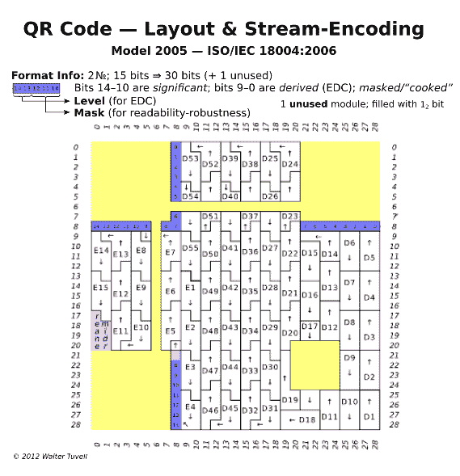

n°13 — By Wtuvell at English Wikipedia (Own work) [Public domain], via Wikimedia Commons

从上到下，我们有信息字符串的第 8 位到第 14 位。位 14 是最高有效位。从截图 n 11，我们采取了我们可以然后阅读。

> 0011001XXXXXXXX

在[格式信息字符串表](http://www.thonky.com/qr-code-tutorial/format-version-tables)中快速查找。唯一匹配的组合是 ECC 级别:H 和掩码模式:3 的组合

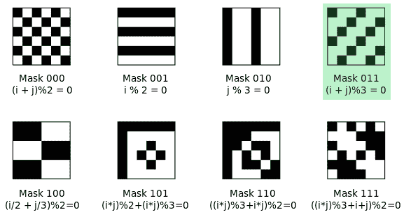

n°14 — By Bobmath (Own work) [CC0], via Wikimedia Commons

我们还需要找到二维码的编码格式。有五种编码格式(每一种使用不同的方法将文本转换成比特):

*   数字(0–9)
*   字母数字(0–9；a-Z；其他九个字符:空格$ % * +-。/ : )
*   8 位字节(JIS 8 位字符集。 [JIS X 0201](https://en.wikipedia.org/wiki/JIS_X_0201) 日文版 os [ISO 646](https://en.wikipedia.org/wiki/ISO/IEC_646)
*   汉字(移位 JIS 字符，可以将每个汉字字符编码在 2 个字节上)
*   ECI(扩展通道解释，当您需要特殊/定制编码时)

QR 码的**编码格式是 8 位字节**，数字和字母数字不支持私钥字母表(没有小写字母)，汉字编码在 2 个字节上(我们只需要一个字节)，ECI 是多余的。

我们几乎准备好开始二维码的重建，我们需要的最后一件事是知道二维码的大小。

二维码有 40 种大小(称为版本)。它们可以从 21x21 像素(版本 1)到 177x177 像素(版本 40)。每次增加版本号，它们都会增长 4x4 像素。根据编码格式和纠错级别，每个版本都有最大容量。

每个 QR 码的容量取决于其版本和纠错级别。详情可参见 ISO 标准第 28 页。

我们知道 QR 码必须存储 52 个字符(416 位)，纠错级别为 h。

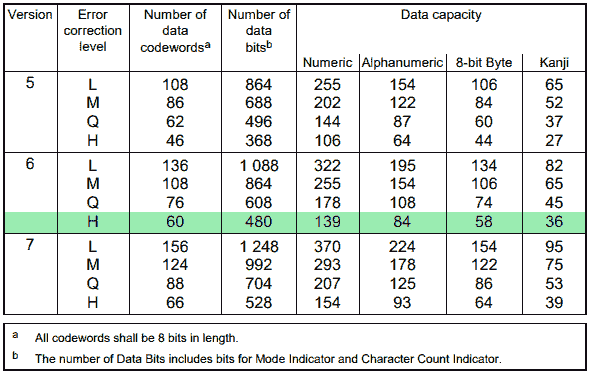

n°15 — V6 is the smallest size which can hold the 416 bits key with an EC level of H. V5 is too small, V7 too big.

版本 6 二维码的大小为 41x41 像素。

我们现在有了开始二维码重建所需的所有信息。

### 4 — QR 码重建

我们知道我们必须重建一个 41x41 像素的 QR 码。我们决定制作一个谷歌电子表格(易于绘制、着色和应用功能，如在二维码上进行蒙版)。

我们经历了以下步骤:

1.  画出作为标准一部分的每个图案(定位图案、对齐图案(版本 6 QR 码中只有一个)、定时图案和分隔符，如图 12 所示)
2.  添加我们在上一步中找到的格式信息字符串中的位。
3.  根据我们拍摄的截图(n 11)填写其余的二维码。

让我们也利用顶部和左侧二维码的侧面截图。这看起来不多，但在这个阶段，每一点都很重要。

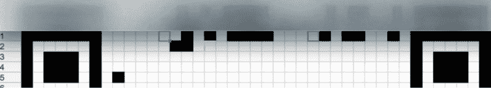

n°16 — How we collected some more bits on the top rows

n°17 — Same process for the left side of the QR code (90° rotated)

下面是我们能够重建的二维码。下一步是定义提取码字和纠错码字的位序列。

n°18 — Step by step reconstruction of the QR code.

### 5 —二维码标准第 2 部分

如果我们想从二维码中提取更多的信息，我们需要弄清楚如何读取二维码。

一个 QR 码由**个数据码字**和**个 EC 码字**块组成。每个块长 8 位，每一位由一个模块(黑色或白色方块)表示。你不能仅仅通过看一个二维码来判断一个特定的白色方块是“0”还是“1 ”,因为正如我们稍后将看到的，在二维码被渲染之前，它被应用到了一个遮罩上。

**数据代码字**携带封装成简单协议的信息/数据，如下所示(详情见 ISO 标准第 17 页):

*   模式指示符:4 位标识符，指示消息/数据序列编码的编码模式。
*   字符计数指示器:表示信息长度的位序列。根据编码模式和 QR 码版本的不同而不同。
*   消息/数据(私钥)比特流。(每个字符 8 位)
*   终止符:4 位，用于结束代表消息的位串。
*   填充位:用于填充比特流的空位置。

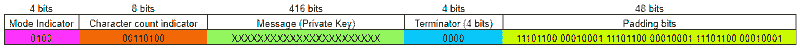

n°19 — The bit stream contained in the Data codewords.

**ECC 代码字**被添加到数据代码字序列中，以便在出现错误或擦除时检测并纠正数据。它们是从数据码字生成的[里德-索罗门](https://en.wikipedia.org/wiki/Reed%E2%80%93Solomon_error_correction)码。我们将在第 7 步中详细讨论它们。

数据和 ECC 代码字的数量因版本和纠错级别而异。根据版本和 EC 级别，它们被分成组(1 或 2)和块(1 至 67)。

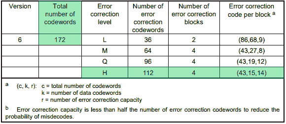

n°20 — Error correction characteristics for version 6 (page 35 of the ISO standard)

在我们的例子中(版本 6，EC 级别 H)，每个块有 15 个数据码字和 28 个 ECC 码字。QR 码将包含 1 组 4 个块，总共 172 个码字。

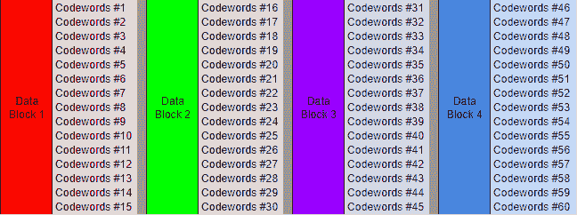

n°21 — Data Codewords blocks. Each Codeword is 8 bits long. They carry a part of the bit stream from N°19

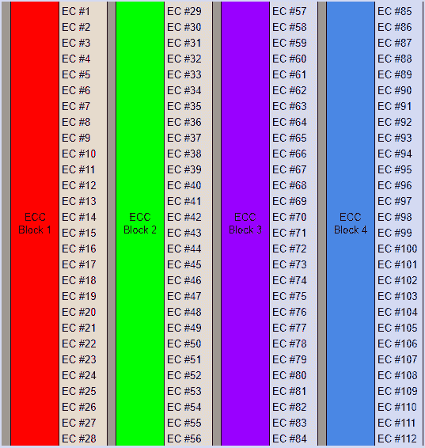

n° 22 — ECC Codewords blocks. They are 8 bits long Reed-Solomon codes derived from the Data blocks.

### 6 — QR 码解码

下一步是读取 QR 码，并尽可能多地填写步骤 5 中的数据和 ECC 代码字表。

第一步是揭开二维码。我们使用 Google 电子表格来创建掩码，并使用 BITXOR 函数来应用它。

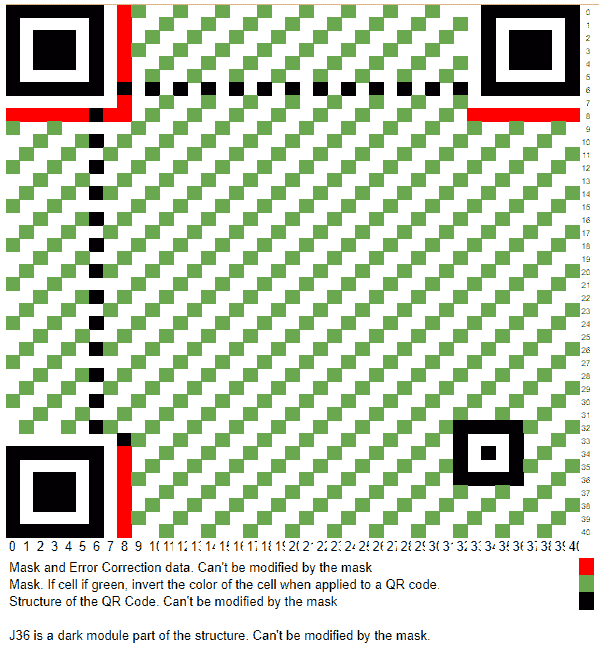

n°23 — When applied to the QR code, each green module of the mask inverts the color of the module.

屏蔽过程的结果是可读的 QR 码。二维码怎么看，从哪里入手？ISO 标准解释了如何将码字映射到 QR 码上以及如何读取它们(第 46 页:矩阵中的码字位置)。

让我们将代码字映射到二维码上。

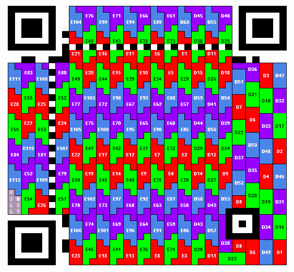

n°24 — Position of the Data and Error Correction codewords. Regular and irregular symbols can be seen.

现在让我们逐一阅读。每个符号必须根据其形状和阅读方向以不同的方式阅读，如下图所示，如 ISO 标准第 47 页所述。

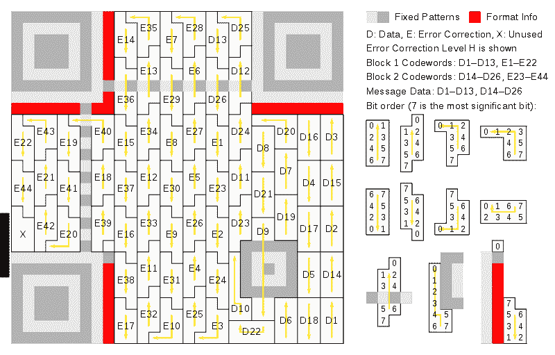

n°25 — By Bobmath (Own work) [CC0], via Wikimedia Commons

下面，一点一点可读的二维码。每个“X”都是一个未知位。

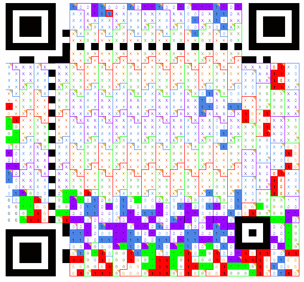

n°26 — Decoding a QR code by hand, one bit at a time. Seems fun right ?

然后，我们读取并填写步骤 4 中的数据和 ECC 表。

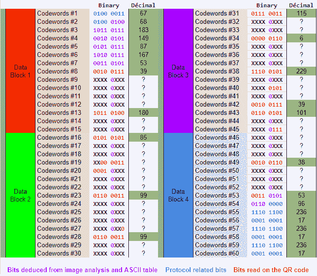

n°27 — Data codewords after we read the QR code, filled the protocol’s bits and those we got via image analysis.

码字#1 和#2 是已知的，因为它们是协议的一部分(模式指示符+字符计数指示符)。

码字#3、#4、#6 和#7 是已知的，因为我们在步骤 2(“KyUzsR”)中进行了图像分析

码字#54 到#60 也是已知的，因为它们是协议的一部分(终止符+填充位)。

每解决一个“X ”,我们在 ECC 阶段成功的机会就增加一倍，我们将不得不在道路上使用蛮力的可能性就减少一倍。

你可能想知道为什么携带消息/数据的所有码字的第 5 位都被设置为“0”。这是因为我们知道私钥的字母表( [Base58Check](https://en.bitcoin.it/wiki/Base58Check_encoding) )，并且当编码到 8 位时，该字母表中的所有字符都以“0”开始。(由于前 12 个协议位引入的移位，每个码字中的第 5 位是消息的每个字母的第一位)。

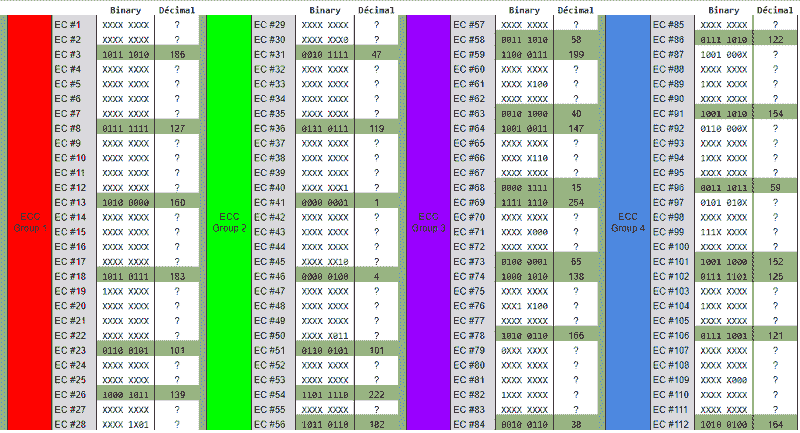

n°28 — ECC Codewords table after we read the QR code. Nothing we can do here as all of them are defined by the Reed-Solomon encoder.

现在让我们使用纠错码的魔力来恢复尽可能多的数据。

### 7 —纠错码

在这个阶段，我们离完整的私钥还很远，但是我们很快就能够知道我们是否收集了足够的数据来利用 ECC 恢复密钥。

ECC 是在不可靠的信道上实现可靠通信的技术。它们有能力通过检测和纠正错误和擦除来重建原始数据。

QR 码实现了 [Reed-Solomon 码](https://en.wikipedia.org/wiki/Reed%E2%80%93Solomon_error_correction)(我们在步骤 3 解码格式信息串时看到的 BCH 码的一个子类型)。

我们不打算详细解释如何编码或解码里德-所罗门码。网上有许多好的资源，但速度很快:

*   里德-所罗门编码器产生 ECC 代码字。它们是表示消息的多项式和不可约的生成多项式之间的除法的余数。

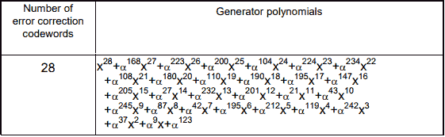

n°29 — The irreducible generator polynomial for 28 EC codewords.

*   里德-所罗门解码器有点复杂，因为有许多不同的方法来解码信息。该任务存在不同的解码算法，[本页](https://en.wikiversity.org/wiki/Reed%E2%80%93Solomon_codes_for_coders)非常有助于理解解码过程。

里德-所罗门解码器能够同时解码擦除和错误。不幸的是，有一个限制，叫做[单例约束](https://en.wikipedia.org/wiki/Singleton_bound)。

我们面临的风险是超过这个限度。Reed-Solomon 是一个最优的前向纠错编码，容易受到 T2 悬崖效应的影响。这确实意味着，如果您超出了限制，您将无法从 EC 代码中获得任何东西，这就是我们需要强力解决的地方。

极限(可纠正的擦除和错误的数量)由 ISO 标准第 33 页中定义的以下公式定义:

e + 2*t ≤ d - p

其中:

*   e:擦除次数
*   t:错误数量
*   d:纠错码字的数量
*   p:误解码保护码字的数量(在我们的情况下为 0:6-H)

这个公式的意思是，每个块最多可以纠正 14 个错误或 28 个擦除(或者两者的混合，如果总和不大于 28)。我们利用了这样一个事实，即我们知道 QR 码上的擦除位置，从而具有可能的最高纠错级别(每块 28 个码字)。

让我们检查每个块是否低于或高于限制:

*   块 1:数据包含 6 个擦除，ECC 包含 22 个擦除
*   块 2:数据包含 12 个擦除，ECC 包含 21 个擦除
*   块 3:数据包含 10 个擦除，ECC 包含 18 个擦除
*   块 4:数据包含 6 个擦除，ECC 包含 21 个擦除

有了 28 个擦除，块 3 和块 1 正好达到极限，我们将能够恢复 100%的擦除。块 4 也是如此，每个块总共有 27 个擦除。

有 33 次擦除，块 2 超出了限制，我们将不得不暴力破解它。幸运的是，蛮力将在少量组合上实现。

### 8 — Python 和蛮力

我们决定使用[这个 Reed-Solomon Python 编解码器](https://github.com/tomerfiliba/reedsolomon)来解码消息。

我们将混合使用 Python 代码和伪代码来描述找到最终结果的步骤。

让我们从最好的情况开始，当我们低于极限时，解码块 3、4 和 1。

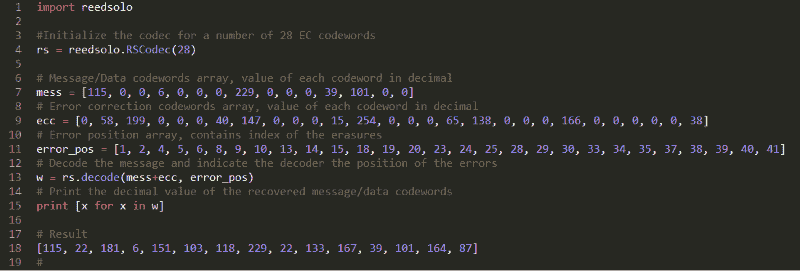

n°30 — Decoding block 3 using the Reed-Solomon decoder.

**块 3** 的解码器结果为:

> [115, 22, 181, 6, 151, 103, 118, 229, 22, 133, 167, 39, 101, 164, 87]

**模块 4** 的过程相同，只是修改了 mess、ecc 和 error_pos 变量的值。结果是:

> [118, 132, 183, 38, 36, 99, 116, 53, 96, 236, 17, 236, 17, 236, 17]

**块 1** 的解码器结果为:

> [67, 68, 183, 149, 87, 167, 53, 39, 86, 71, 4, 230, 180, 196, 182]

到目前为止一切顺利。不幸的是，如果我们对块 2 做同样的事情，解码器会失败，因为我们超过了极限。

我们唯一的解决办法就是暴力。我们有一个 5 的负容限(33 个擦除，而不是 28 个)，所以我们的目标是恢复(暴力)5 个码字，看看解码器给我们哪个结果。

为了减少可能性的数量，我们在表 n 27 和 n 28 中查找具有较少未知位的字节。数据码字#17、#19、#20、#27 和 EC 码字#50 是令人感兴趣的。

总共 21 个未知位，2 个组合(2 097 152)没那么大。下面是蛮力的伪代码。

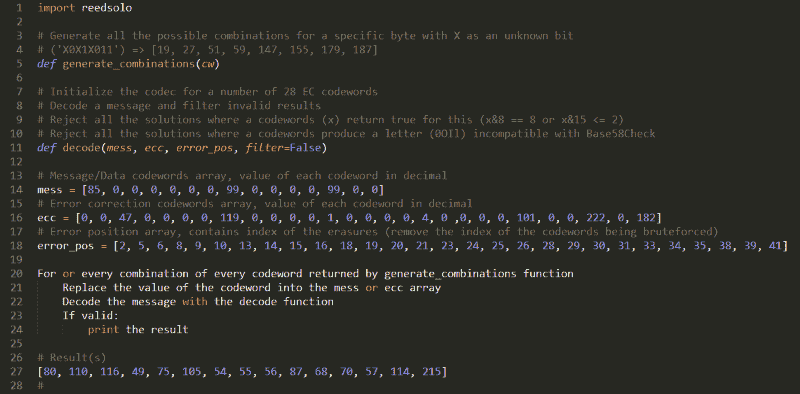

n°31 — Brute forcing the block 2, giving us the last bits we needed.

我的 i5–6600k CPU 能够在一个内核上每分钟计算大约 30 000 个键。花了 30 分钟和 838 849 次试验才找到第一个解决方案，它是重建私钥的好方案(在这 2 097 152 个组合中只有 2 个解决方案与过滤器匹配)。

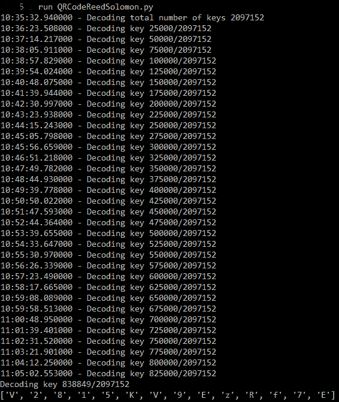

n°32 — Brute forcing the block 2

区块 2 的结果:

> [85, 99, 35, 131, 19, 84, 181, 99, 148, 87, 165, 38, 99, 116, 84]

我们现在有了所有的码字，最后一步是将所有这些码字转换成二进制，填充表 n 27，修整前 12 位，后 52 位，解码，瞧！

最终结果是私钥:

> **kyuzsrudpnklkev 2815kv 9 ezrf 7 eg 1 kpivwnqhzrvzewhkrbf 7 cv**

#### 不言而喻，您不应该使用这个私钥，因为它不再是真正的私有密钥了！

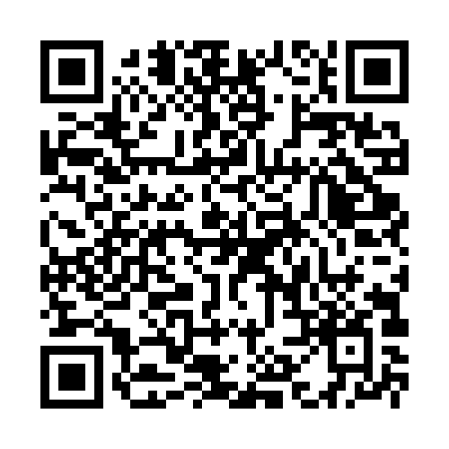

Private key QR code restored!

罗杰，谢谢你的赠品。兑换 BCH 的过程不像在电视上扫描二维码那么简单，但很有挑战性，也很有趣。

#### 如果你喜欢这篇文章，请点击？按钮并分享，以帮助其他人找到它。欢迎在下面留下评论或问题。