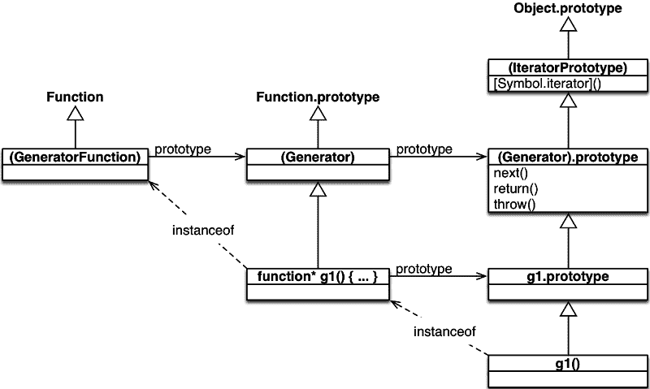

# 让我们探索 ES6 发电机

> 原文：<https://www.freecodecamp.org/news/lets-explore-es6-generators-5e58ed23b0f1/>

提哥·洛佩斯·费雷拉

# 让我们探索 ES6 发电机

生成器是 iterables 的实现。

关于生成器的大问题是**它们是可以在保持上下文**的同时暂停执行的函数。

当处理需要暂停的执行时，这种行为是至关重要的，但是它的上下文被维护以便在将来恢复它。

异步开发听起来熟悉吗？

### 句法

生成器的语法以它的`function*`声明(请注意*星号*和`yield`开始，通过它们生成器可以暂停它的执行。

调用我们的`generator`函数创建新的生成器，我们可以使用它通过`next`函数来控制进程。

运行`next`将执行我们`generator`的代码，直到达到一个`yield`表达式。

此时，`yield`上的值被发出，并且`generator`的执行被暂停。

#### 产量

`yield`生来就有发电机，并允许我们发出价值观。然而，我们只能在发电机里这样做。

例如，如果我们试图在回调函数上`yield`一个值，即使是在生成器内部声明的，我们也会得到一个错误。

#### 产量*

`yield*`用于在另一个生成器中调用一个生成器。

我们的`b`迭代器，由`bar`生成器生成，在调用`foo`时不按预期工作。

这是因为，尽管执行`foo`产生了一个迭代器，但我们并不迭代它。

所以 ES6 才带了运营商`yield*`。

这非常适合数据消费者。

在内部,`yield*`检查发电机上的每个元素,`yield`检查它。

### 作为迭代器的生成器

**生成器是简单的可迭代**，这意味着它们遵循`iterable`和`iterator`协议:

*   `iterable`协议规定对象应该返回一个键为`Symbol.iterator`的函数迭代器。

*   `iterator`协议说迭代器应该是指向迭代的下一个元素的对象。这个对象应该包含一个名为`next`的函数。

因为生成器是可迭代的，所以我们可以使用数据消费者，例如`for-of`，来迭代生成器的值。

#### 返回

我们可以在生成器中添加一个`return`语句，但是`return`会根据生成器数据的迭代方式表现不同。

当使用`next`手动执行迭代时，我们将返回值(即`done`)作为迭代器对象的最后一个`value`，并将`done`标志设为 true。

另一方面，当使用已定义的数据消费者(如`for-of`或`destructuring`)时，返回值被忽略。

#### **收益率***

我们看到`yield*`允许我们在生成器内部调用生成器。

它还允许我们存储被执行的生成器返回的值。

#### 扔

我们可以在生成器内部`throw`并且`next`将传播我们的异常。

一旦抛出异常，迭代器流程就会中断，其状态被无限期地设置为`done: true`。

### 作为数据消费者的生成器

除了作为数据生产者的生成器之外，通过`yield`，它们还具有使用`next`消费数据的能力。

这里有一些有趣的地方值得探索。

#### 生成器创建(1)

在这个阶段，我们正在创建我们的生成器`g`。

我们的执行在点`A`停止。

#### 第一个下一个(2)

第一次执行`next`会让我们的生成器一直执行到第一条`yield`语句。

在第一次执行时，通过`next`发送的任何值都被忽略。这是因为在第一个`yield`语句之前没有`yield`语句？

我们的执行在`B`暂停，等待一个值被填充到`yield`。

#### 下一个下一个(3)

在下一次执行`next`时，我们的生成器将运行代码，直到下一个`yield`。

在我们的例子中，它记录通过`yield`(即`Got: foo`)获得的值，并在`yield`上再次挂起。

### 用例

#### 实现可迭代的

因为**生成器是一个可迭代的实现**，当创建时，我们得到一个可迭代的对象，其中每个`yield`代表每次迭代发出的值。这种描述允许我们使用生成器来创建可迭代对象。

以下示例将生成器表示为 iterable，它迭代偶数，直到到达`max`。因为我们的生成器返回一个 iterable，所以我们可以使用`for-of`来迭代这些值。

记住`yield`暂停生成器的执行是很有用的，在每次迭代中，生成器都从暂停的地方恢复。

#### 异步代码

我们可以使用生成器来更好地处理异步代码，比如`promises`。

这个用例很好地介绍了 ES8 上的新`async/await`。

接下来是一个用我们所知的`promises`获取 JSON 文件的例子。我们将把杰克·阿奇博尔德和 T2 的例子用在 developers.google.com 和 T4 身上。

使用 [co 库](https://github.com/tj/co)和一个生成器，我们的代码看起来更像同步代码。

至于新的`async/await`,我们的代码将看起来很像我们以前的版本。

### 结论

这是 schema，由 Axel Rauschmayer 在[探索 ES6](http://exploringjs.com/es6/index.html) 上制作，向我们展示生成器如何与迭代器相关联。

生成器是 iterables 的实现，遵循`iterable`和`iterator`协议。因此，它们可以用来构建可迭代的。

生成器最令人惊奇的地方是它们能够暂停执行。为此，ES6 带来了一个名为`yield`的新声明。

然而，在生成器内部调用生成器并不像执行生成器函数那样容易。为此，ES6 有`yield*`。

> 生成器是异步开发接近同步的下一步。

### 感谢什么？

*   [阿克塞尔·劳施迈尔](https://twitter.com/rauschma)因为他的[探索 ES6 —发电机](http://exploringjs.com/es6/ch_generators.html)
*   [尼古拉斯·贝瓦夸](https://twitter.com/nzgb)为他的 [PonyFoo — ES6 发电机深入](https://ponyfoo.com/articles/es6-generators-in-depth)
*   [杰克·阿奇博尔德](https://twitter.com/jaffathecake)对 developers.google.com[的承诺举例](https://developers.google.com/web/fundamentals/getting-started/primers/promises)
*   致所有[常规秀](https://www.youtube.com/watch?v=n_OC-RAm7Qs)粉丝

*一定要看看我在 ES6 上的其他文章*

[**揭秘 ES6 Iterables &迭代器**](https://medium.freecodecamp.com/demystifying-es6-iterables-iterators-4bdd0b084082)
[*让我们揭秘 JavaScript 与数据结构交互的新方式。*medium.freecodecamp.com](https://medium.freecodecamp.com/demystifying-es6-iterables-iterators-4bdd0b084082)