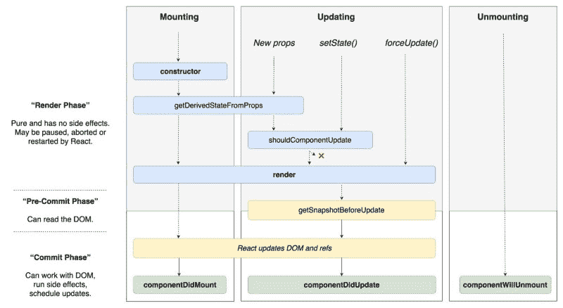

# 让我们爱上反应纤维

> 原文：<https://www.freecodecamp.org/news/lets-fall-in-love-with-react-fiber-90f2e1f68ded/>

瑞安·尤尔卡宁

# 让我们爱上反应纤维

**TLDR，** React 纤程是一个内部引擎变化，允许 React 打破调用栈的限制。它的创建使 React 能够随意暂停/开始渲染工作。最终，React 用户将能够暗示工作的“优先级”。

目前，我们不能直接与它交互，所以我们为什么要关心它？因为这真的很酷！

### 在 Fiber 出现之前，React 就像是在一家没有 git 的快节奏公司工作。

想象一下，在一个巨大的功能中，你的老板需要一个补丁，马上。你不能停止工作，因为所有的修改都在一个文件中，你必须完成这项工作。

如果我们使用 git，我们将能够提交我们的工作到一个分支，并切换到一个快速修复分支。

**有了光纤，React 可以随意暂停和恢复工作，以便尽快处理重要的事情！？**

### 反应堆内部简单来说？

您创建了一个组件树。React 获取这棵树，遍历它，并创建最终结果的虚拟模型。也许你是渲染到 DOM，也许你是针对 native。此时，反应过来也没关系。

If you’ve never used React, here’s an example of a tree of components.

现在，随着应用程序的更新，React 将一遍又一遍地执行创建虚拟结果的过程。每次，它将前一个虚拟树与下一个虚拟树进行比较。

此时，我们变得依赖于平台。如果要呈现给 DOM，可能只有一个元素上的一个类发生了变化。React 将遍历虚拟树，找到发生了什么变化，并尽可能少地更新。

这可能意味着更新一个类属性，也可能意味着拆除整个 DOM。这是[对账](https://reactjs.org/docs/reconciliation.html)。

在光纤出现之前，就是这样。工作安排好了，选择的渲染器开始工作。即使浏览器滞后，用户正在打字，或者地球即将爆炸，渲染列车也不会停止。？

### 它是如何工作的(在高层次上)？

有了光纤，现在有不同级别的更新优先级。更新用户正在键入的输入比具有数千个组件的列表具有更高的优先级。

纤程将树计算分解成可以随时“提交”的工作单元。那么什么是工作单元呢？它只是你的组件树中的一个节点！

1.  React 现在可以暂停、恢复和重启组件上的工作。这意味着某些生命周期挂钩可能会触发多次。
2.  React 可以有一个基于优先级的更新系统。这允许 React 团队微调渲染器，以便 React 在最常见的用例中是最快的。

不过，我想重点谈谈第一点。React 将远离(但仍支持！)一些旧的生命周期挂钩，并添加一些新的！？

`componentWillMount`、`componentWillUpdate`、`componentWillReceiveProps`，现在可以多次开火。你不应该在这里引发副作用。

现在，你想在生命周期挂钩中触发副作用，只触发一次:`componentDidMount`和`componentDidUpdate`

为了弥补`componentWillReceiveProps` 涵盖的许多用例，我们将收到两个新的钩子。

1.  它不能访问以前的道具或组件实例，但允许你同步道具的状态。
2.  在 DOM 更新之前，让您可以访问它。您返回的值在`componentDidUpdate`中可用。

This chart illustrates how lifecycle hooks work with React Fiber

> 从 React 16.4 开始，getDerivedStateFromProps 现在总是在 render 方法之前触发。不只是道具更新的时候！

总之， **Fiber 允许 React 微调渲染，以确保最重要的更新尽快发生，**所有这些都是为了一些生命周期挂钩的轻微成本，以及大量的脸书开发人员的血液。**？**

如果您有任何问题或正在寻找一对一的 React 指导，请随时给我发推特**@ yurkaniryan**！

如果你喜欢我的写作风格，这里有一些我写的其他文章。

祝你好运，编码快乐！？？