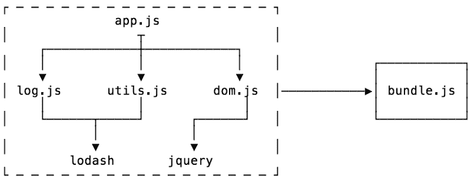
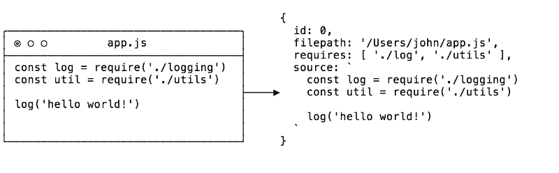
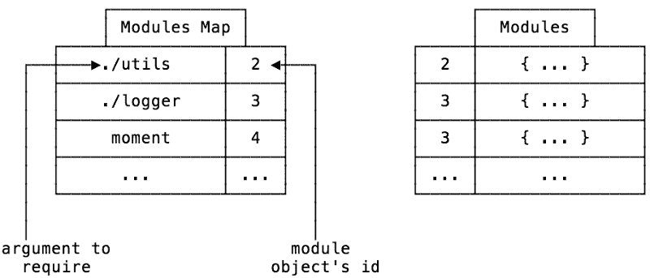
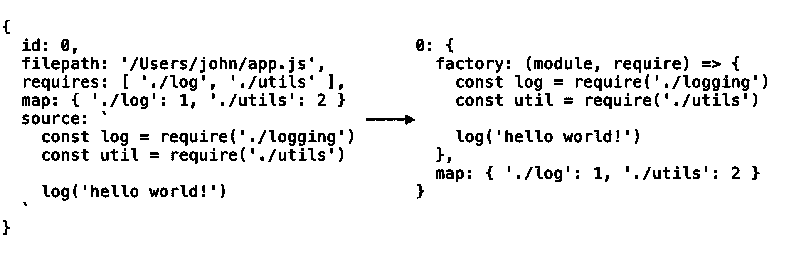

# 让我们学习模块捆绑器是如何工作的，然后自己写一个

> 原文：<https://www.freecodecamp.org/news/lets-learn-how-module-bundlers-work-and-then-write-one-ourselves-b2e3fe6c88ae/>

亚当·凯利

# 让我们学习模块捆绑器是如何工作的，然后自己写一个


你好！欢迎，欢迎，你能来真是太好了！今天我们将构建一个非常简单的 JavaScript 模块捆绑器。

在我们开始之前，我想说几句感谢的话。本文大量引用了以下资源:

*   [解开 JavaScript 模块捆绑器](http://loige.link/bundle-dublinjs) -卢西亚诺·马米诺
*   [迷你包](https://github.com/ronami/minipack) - Ronen Amiel

好了，让我们从什么是模块捆绑器开始。

### 什么是模块捆绑器？

模块捆绑器是一种工具，它将 JavaScript 片段及其依赖项捆绑到一个文件中，通常用于浏览器。你可能使用过诸如 [Browserify](http://browserify.org/) 、 [Webpack](https://webpack.js.org/) 、 [Rollup](https://rollupjs.org/guide/en) 或其他工具。

它通常从一个入口文件开始，并从那里捆绑该入口文件所需的所有代码。



捆扎机有两个主要阶段:

1.  依赖性解析
2.  包装

从一个入口点(比如上面的`app.js`)开始，依赖关系解析的目标是寻找你的代码的所有依赖关系(它需要运行的其他代码片段)并构建一个图(称为依赖关系图)。

完成后，您可以将依赖图打包或转换成应用程序可以使用的单个文件。

让我们从一些导入开始我们的代码(稍后我会详细解释原因)。

### 依赖性解析

我们要做的第一件事是想出在依赖解析阶段我们想要如何表示一个模块。

#### 模块表示

我们需要四样东西:

*   文件的名称和标识符
*   文件的来源(在文件系统中)
*   文件中的代码
*   该文件需要哪些依赖关系

图形结构是通过递归检查每个文件中的依赖关系建立起来的。

在 JavaScript 中，表示这样一组数据的最简单方式是对象。

查看上面的`createModuleObject`函数，值得注意的部分是对一个名为`detective`的函数的调用。

[Detective](https://github.com/browserify/detective) 是一个库，无论嵌套多深*都可以*找到所有需要的调用()，使用它意味着我们可以避免自己做 AST 遍历！**

**需要注意的一点是(这在几乎所有的模块捆绑器中都是一样的),如果你试图做一些奇怪的事情，比如:**

```
**`const libName = 'lodash'const lib = require(libName)`**
```

**它将无法找到它(因为这意味着执行代码)。**

**那么从一个模块的路径运行这个函数会给出什么呢？**

****

**接下来是什么？依赖关系解析。**

**好吧，还没有。首先，我想说一个叫做模块图的东西。**

#### **模块图**

**在 Node 中导入模块时，可以做相对导入，比如`require('./utils')`。所以当你的代码调用这个的时候，当所有东西都被打包的时候，bundler 怎么知道什么是正确的`./utils`文件呢？**

**这就是模块图解决的问题。**

**我们的模块对象有一个唯一的`id`键，这将是我们的“事实的来源”。因此，当我们进行依赖解析时，对于每个模块，我们将保留一个列表，列出需要的名称以及它们的 id。这样，我们可以在运行时获得正确的模块。**

**这也意味着我们可以将所有的模块存储在一个非嵌套的对象中，使用 id 作为一个键。**

****

### **依赖性解析**

**好的，所以在`getModules`函数中有相当多的内容。它的主要目的是从根/入口模块开始，递归地寻找和解决依赖关系。**

**我说的“解决依赖性”是什么意思？在 Node 中有一个叫做`require.resolve`的东西，这就是 Node 如何计算出你需要的文件在哪里。这是因为我们可以相对导入或者从`node_modules`文件夹导入。**

**幸运的是，有一个名为`resolve`的 npm 模块为我们实现了这个算法。我们只需传入依赖项和基本 URL 参数，它将为我们完成所有的艰苦工作。**

**我们需要为项目中每个模块的每个依赖项执行这个解决方案。**

**我们还创建了我前面提到的名为`map`的模块图。**

**在函数的结尾，我们留下了一个名为`modules`的数组，它将包含项目中每个模块/依赖项的模块对象。**

**现在我们有了这些，我们可以进入最后一步:打包！**

### **包装**

**在浏览器中，没有模块这种东西(有点)。但这意味着没有 require 函数，也没有`module.exports`。因此，即使我们拥有所有的依赖项，我们目前也没有办法将它们作为模块使用。**

#### **模块工厂功能**

**进入工厂功能。**

**工厂函数是返回对象的函数(不是构造函数)。它是一种来自面向对象编程的模式，其用途之一是进行封装和依赖注入。**

**听起来不错吧？**

**使用工厂函数，我们可以注入我们自己的`require`函数和`module.exports`对象，它们可以在我们的捆绑代码中使用，并给模块赋予自己的作用域。**

#### **包装**

**以下是用于打包的打包功能。**

**其中大部分只是 JavaScript 的模板文字，所以让我们来讨论它在做什么。**

**首先出场的是`modulesSource`。在这里，我们将浏览每个模块，并将它们转换成一串源代码。**

**那么模块对象的输出是什么样的呢？**

****

**现在读起来有点困难，但是你可以看到源代码被封装了。正如我之前提到的，我们使用工厂函数来提供`modules`和`require`。**

**我们还包括了我们在依赖关系解析过程中构建的模块图。**

**接下来，在函数中，我们将所有这些连接起来，创建一个包含所有依赖项的大对象。**

**下一串代码是一个 IIFE，这意味着当你在浏览器(或其他任何地方)运行该代码时，函数将立即运行。IIFE 是封装作用域的另一种模式，在这里使用它是为了不让我们的`require`和模块污染全局作用域。**

**你可以看到我们正在定义两个需求函数，`require`和`localRequire`。**

**Require 接受模块对象的 id，但是当然源代码不是使用 id 编写的。相反，我们使用另一个函数`localRequire`来获取模块所需的任何参数，并将它们转换成正确的 id。这是使用那些模块图。**

**在这之后，我们定义一个模块可以填充的`module object`，并将两个函数都传递到工厂，之后我们返回`module.exports`。**

**最后，我们调用`require(0)`来请求 id 为 0 的模块，这是我们的入口文件。**

**就是这样！我们的模块捆扎机 100%完成！**

### **恭喜你！？**

**所以我们现在有一个工作模块捆绑器。**

**这可能不应该在生产中使用，因为它缺少很多特性(比如管理循环依赖，确保每个文件只被解析一次，es-modules，等等),但是这有望让您对模块捆绑器实际上是如何工作的有一个很好的了解。**

**事实上，如果去掉所有的源代码，这段代码只需要 60 行。**

**感谢您的阅读，我希望您喜欢我们简单的模块捆绑器的工作方式。如果你看到了，一定要鼓掌？和分享。**

> **这篇文章最初发表在我的博客上。
> 检查出来源[https://github.com/adamisntdead/wbpck-bundler](https://github.com/adamisntdead/wbpck-bundler)**