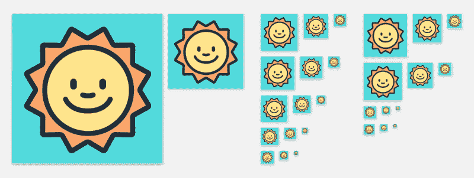
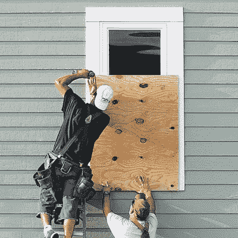

# 让我们停止把设计工作庸俗化

> 原文：<https://www.freecodecamp.org/news/lets-stop-trivializing-design-work-c4beb48a339c/>

乔纳斯·唐尼

# 让我们停止把设计工作庸俗化

本周，Instagram 更新了他们的标志，就在这个时候，互联网上爆发了关于它的讨论。这不是一个关于这个的帖子。相反，这是一个关于我们如何在公共场合批评设计的帖子。

例如，这条推文获得了很多关注，尤其是来自有设计感的人:

理所当然地…这是一个有趣的 GIF。有那个竖起大拇指的孩子的任何东西都是金子！

只有一个问题。像这样的笑话传播了这样一种误解，即设计是一种简单而肤浅的审美练习。似乎每次大品牌重新设计都会出现这种情况。

如果你从未制作过应用程序图标，以下是需要做的。(我最近刚刚为我的应用程序 [Hello Weather](http://helloweatherapp.com) 做了这个。)

您需要:

1.  将你的应用程序的总体概念和目的——可能还有你的整个公司——浓缩成一个单一的视觉符号。
2.  设计一些非常符合平台关于比例和颜色使用的指导方针的东西。当您支持具有不同指导原则的多个平台时，这就更加困难了。
3.  尝试突出一点，但不要太突出，以免相对于其他应用程序图标来说，你显得令人讨厌。
4.  找到一个对比度好的配色方案，并在一堆不同的场景中使用(黑色背景，白色背景，某人怪异狮子狗的糟糕照片上，等等)。)

优选地，它还应该足够灵活，以便根据需要简化为简单的黑白字形。

我有没有提到它需要从 16x16 到 512x512 的半清晰缩放？一个应用图标不仅仅是一个图标。所有这些图标:

Icon size variations required for an iOS app

哦，顺便说一下，你只有一个小小的空间来满足所有的要求。

因此，制作一个图标比看起来要复杂得多，需要考虑很多限制因素。像 Instagram 这样聪明、有设计头脑的公司不仅仅是在 20 分钟内打开 Illustrator，拼凑出一个图标——他们可能在选择最终的一个之前，用几周或几个月的时间设计和测试了几十个版本。

选择也很艰难。比方说，你最终有 2 或 3 个你喜欢的版本。没有办法知道哪一个是正确的，但是不管你选择什么，很多人会告诉你它是错误的。数量惊人的人有空闲时间告诉你，他们“不喜欢红色”或任何数量的其他同样愚蠢的评论。

推出这样的东西需要勇气和相当厚的脸皮。也许这一周最好躲在掩体里。

Here are some designers preparing for Internet feedback before launching a rebranding.

总的来说，制作一个应用图标仍然比让一枚火箭降落在海洋中的一艘船上或者生活中数百万件真正困难的事情要容易得多。但这也不是儿戏。

这就是为什么每个人都有一个应用程序的想法，但只有一小部分人真正制作应用程序:这很难做到，更难做好。作为希望自己的努力被认真对待(并获得丰厚报酬)的设计师，我们应该承认这一点，并更多地谈论它。

一个好的开始是改变你在公共场合对新设计作品的反应。当人们做出重大改变或推出新东西时，为他们鼓掌，支持他们，分享积极的评论或深思熟虑的批评。以身作则。这就是你希望他们为你做的。

*Psst:如果你喜欢这篇文章，并且你想偶尔听到更多像这样与设计相关的夸夸其谈，请在 [Twitter](http://twitter.com/jonasdowney) 上关注我。你也可以看看 Hello Weather，在这里讨论它的应用图标[。](https://helloweatherapp.com)*