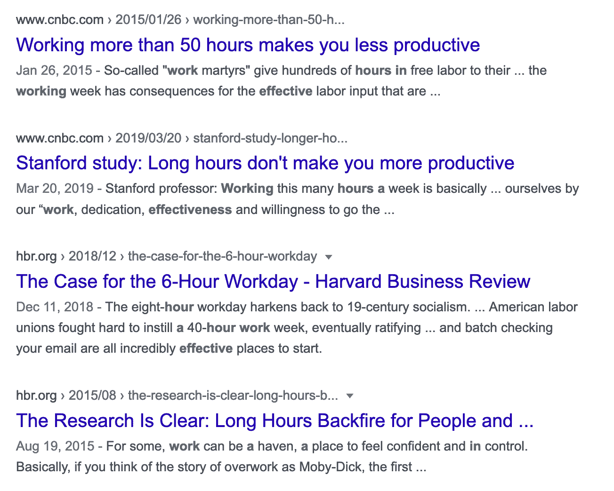

# 我们来谈谈工作之外的编码。

> 原文：<https://www.freecodecamp.org/news/lets-talk-about-coding-outside-of-work/>

工作之外的编程是一个热门话题。

一边是*奋起抗争*的喧嚣文化，另一边是一群告诉你去享受生活的人。

看书。烤一些酸面团。学木工。任何东西——只是不是电脑上的任何东西！

我认为，真相在中间的某个地方。就像软件开发中的任何重要话题一样，答案通常是*视情况而定。*

我们来谈谈工作之外的编码。职业利益，职业倦怠，以及这一切背后的终极人生问题:**你到底想要什么？**

## 光速职业

我在 2012 年末开始了我的第一份开发工作。我加入了一家现有的公司，这家公司看起来运转良好，前景看好。

这是在新闻和关于创业文化的讨论渗透到我们生活的每个角落之前——或者至少是我的生活。

我接了一份工作。NET 开发以及一些经典的 ASP，VB 6，VB.NET 和 C # ASP.NET。

读到这里的大多数人可能甚至不知道这些语言或框架的一半是什么。这是在 JavaScript 开发成为技术世界的前沿和中心之前——在大多数开发世界知道 React、Angular 或 Vue 之前。

在这项工作中，我们使用了我们拥有的最强大的 JavaScript 工具: *jQuery* 。对于我们正在构建的大多数应用程序，jQuery 已经足够了。

我所在的是一个内部应用程序团队，我们构建并维护销售、客户支持和产品应用程序开发人员所依赖的内部 CRM、客户支持工具和数据库模式。

从整体上看，这是一份相当不错的第一份工作。薪水不错，人们也很聪明，我被大量的新课题和我必须做的学习淹没了(这是一件好事)。

我在一个五人左右的相对较小的团队中，同时学习前端、后端和数据库开发——尽管我当时并不真正知道这些术语是什么。

有一个问题:我讨厌呆在那里。这份工作每天都在摧毁我的灵魂。

一部分原因是我们使用的技术感觉过时和乏味。其中一部分是我们工作的内部代码库(产品设计/用户体验被有意忽略，以利于在屏幕上尽可能多地填充信息)。

但最大的因素是公司文化。

尽管如此，我还是有一个可取之处:我在工作之外花时间写代码。

The Ruby on Rails logo

## 输入 Ruby on Rails

大约在这个时候，一个偶然的机会，我认识了一个新朋友，他也是一名开发人员。那时，他是我唯一认识的开发者朋友。我们开始更多地出去玩，结果我们开始修补不同的项目。

工作之外，在晚上和周末，他和我开始学习这个相对较新的框架，当时被称为 [*Ruby on Rails* 。](https://rubyonrails.org/)

我喜欢它。这与我讨厌的工作截然相反。

它很容易使用。Rails 建立在“约定优于配置”的基础上，这一信条非常有意义。

我可以在 Rails 框架中调用一行函数，而不是在 SQL Server 中一遍又一遍地编写相同的存储过程。当许多真正聪明的人已经为我解决了这个问题，为什么还要重新发明轮子呢？

在工作中，我使用 Windows GUIs 开发应用程序，这些程序看起来像是在 90 年代开发的，从来没有更新过。

下班后，我从终端运行所有的 Rails 命令，感觉自己是有史以来最糟糕的黑客。

在家里，我可以建造任何我想要的东西。我可以使用这个令人震惊的新 CSS 框架，叫做 *[Bootstrap CSS。](https://getbootstrap.com/docs/3.4/css/)* 世界是我的牡蛎。没有规则——没有人告诉我什么能做，什么不能做，或者我必须怎么做。

在此期间，我的妻子在法学院，她几乎一直在学习。当她学习到深夜时，我制作了一些愚蠢的玩具应用程序。早上我会早起看教程，练习构建应用程序，然后去上班，忍受一天的工作。

在家里，我感受到了创造新事物的创造力和力量。在工作中，我感到被困住了。

我这样持续了很长一段时间——直到有一天我终于忍不住了。

## 向前和向上

我终于受够了。我和我的妻子谈过，我们决定是时候找一份新工作了。

幸运的是，我发现我所在城市的一家公司正在招聘 Ruby on Rails 开发人员。我对 Rails 还是难以置信的陌生——我做真正的软件开发才一年多一点——但是他们看到了我足够的潜力来雇用我，并且愿意在我不知道的事情上培训我(这是很多的)。

在这份新工作中(这份工作要好得多)，我继续在家建造、学习和实践。我很小的时候就知道我想拥有自己的企业，我把软件视为实现这一目标的途径。因此，我继续学习、实践，并在此基础上进行构建。

### 启动失败。三个月的资金。你加入吗？

不久之后，机会来了。这座城市的一家初创公司失败了，公司解散了，主要投资者想给这个产品最后一次机会。

和我一起兼职的那个朋友是通过一个共同的朋友和投资者联系的。我的朋友告诉我:我们有三个月的资金，看看我们是否能扭转这个产品——之后谁知道呢。

想象你自己在那种情况下。你会接受吗？

这份工作确实比我现在挣的多得多——但只有三个月的资金？谁会为了一件可能只存在了三个月的事情而放弃自己美好稳定的工作呢？

嗯，我做了。

关于那次经历，我可以写很多其他的经验教训，但是我想集中在一点上:我们试图复活的应用程序是用 Ruby on Rails 编写的。

当时我不知道这一点，但我现在意识到我一直在做的事情:我在为这个机会付出代价。所有那些我一直在编码的夜晚和周末都是为了抓住这个机会而进行的练习和准备。

今天，我可以更简洁地描述那个时刻:机会到来之前，必须付出代价。

在这份新工作中，我有了巨大的成长。有一段时间，我领导着一个由五名开发人员和两名设计师组成的团队，帮助公司实现投资者和首席执行官设定的目标。它像旋风一样袭来，吞噬了我的生命。

我不仅一直在编写代码，把我的后端技能打磨到刀刃上，而且我还在计划、领导一个团队，并指导其他开发人员。这是将多年的经验浓缩到令人难以置信的忙碌的一年中。

### 余波

一年后，这家复活的公司以辉煌的方式内爆了(说来话长经典创业公司*等等等等*),我转而从事咨询工作。

尽管这家公司失败了，但这种*学习、实践、机会*的模式继续在我的生活和职业生涯中发生。

不久之后，我被介绍了一个名为 [Phoenix](https://www.phoenixframework.org/) 的新框架，该框架建立在名为 Elixir 的语言之上(该语言本身建立在名为 Erlang 的旧语言之上)。

同样的事情又发生了。我学习了它，实践了它，一年后，一份简单的咨询工作变成了一家小创业公司的“合同 CTO”的角色。

回想起来，感觉有点意外，但这些小决定都与一件事有关:工作之外的编码:

*   初创时担任首席技术官
*   担任 CTO 是因为我在工作之余学习了 Phoenix
*   从以前创业时认识的朋友那里听说过凤凰城
*   由于以前结交的朋友和 Ruby on Rails 的技能，加入了以前的创业公司
*   通过工作提高了我的 Ruby on Rails 技能
*   从在 Rails 中构建辅助项目中获得 Ruby on Rails 工作
*   拿起 Rails，因为我讨厌我的生活(开玩笑，但也不是)

*学习。练习。抓住机会。*

工作之外的编码并不是一种神奇的力量。神奇的部分是不断学习、练习和建立的习惯。

这个简单的小实践让我的职业生涯突飞猛进——从每天通勤到我讨厌的工作，再到远程工作，控制我的时间和精力——构建我想要的生活。

A classic.

## *记录暂存*— *倒带*。

在这篇文章的开始，我说过我要谈谈工作之外的权衡，但是到目前为止，我只谈了工作之外的工作带给我的惊人的事情——它带来了一些真正伟大的事情。

嗯，这是电影的一部分，我们用不同的音乐语调重新观看倒叙。我刚刚给你们播放了精彩片段——但是这个硬币还有另外一面，那就是工作之外的编码成本。

### 健康、人际关系、职业——任选两个？

让我们回滚到我加入的那家只有三个月资金的创业公司。这是一个不可思议的成长机会吗，有时还会带来难以置信的回报？绝对的。这也是一段持续的过度工作、压力、浪费机会和不健康的自我安慰的时期吗？肯定也是。

你看，一个人能投入到任何活动中的时间和精力都是有限的。我们每天只有有限的时间。如果太多的时间被分配到一件特定的事情上，那么额外的时间就被从另一件事情上偷走了。

在我第一次创业的时候，我们日复一日、夜复一夜、周末复一周地疯狂工作——时间是从某个地方来的。

它来自于和朋友、家人、财务的相处，以及我们的健康。我们睡眠不足。我们经常从餐馆订购食物来缓解我们每天感受到的压力(食物是一种强大的抚慰剂，它经常被遗忘，因为它是一种更容易被社会接受的恶习)。

这并不奇怪:我们的体重增加了，健康状况下降了。油腻的食物、糖和咖啡因给我们提供了能量。

我们的关系也受到了影响。和家人在一起的时间很少，我们和他们在一起的短暂时光中有太多都不是优质时光——我们的大脑还在工作。

我怀疑这个故事对你来说并不奇怪——它是一个经典的故事。人们全神贯注于工作，抛弃了他们的家庭和健康。这是陈词滥调，但这是真的。

我们会认为我们需要再努力*“仅仅两个星期/直到我们为即将到来的事件完成这部分产品/直到与投资者/潜在收购者会面。”*

有一次，在一个重要的演示之前，我们呆在办公室工作了一整夜，包括在演示之前睡在地上小睡一会儿。

但是时间会到来，会过去，然后下一个里程碑会出现——循环再次继续。

### 烧坏了，持续了多久？

虽然旅途中有一些令人难以置信的有趣时刻，但倦怠和疲劳仍在继续加剧。这就是工作之外过度工作的代价:最终筋疲力尽。在我们必须充电之前，我们只能给予这么多。

这种倦怠需要很长时间才能恢复。

有一个关于关系的古老格言，它需要关系长度的一半来继续前进，这就是从倦怠中恢复的感觉。

直到今天，我仍能感觉到倦怠的沉闷，就藏在我的外围。它总是在那里，随时准备爬回来。

## 一个重要的问题是

让我们最后一次回放那些倒叙。

这些是关于工作之外过多工作的好处和坏处的真实事实。但事情是这样的，真相真的在中间的某个地方，我觉得答案是由这个问题决定的:**你想从生活中得到什么？**

这是一个可怕的问题——不是因为这是一个糟糕的问题，而是因为回答这个问题有多么沉重和困难。

你想要什么？你想从生活中得到什么？

问题不是*你是否应该在工作之外编码*——而是*你想从中获得什么，你愿意为此付出什么？*

毫无疑问，工作之外的工作让我的职业生涯向前推进了好几年。毫无疑问，这是有代价的。当我认识的人去度假、看《权力的游戏》或者只是简单地享受生活时，我在工作。

我后悔一直在工作吗？肯定不是。我从中获益匪浅。我后悔了吗？是啊，当然。

重要的是确定你想要什么，以及你愿意为此付出什么。

根据你是谁和你在生活中的位置，你的答案会不同，这个答案甚至可能会随着时间而改变——对我来说就是这样。

一个刚刚开始职业生涯的年轻单身人士可能会决定现在就付钱，为以后收获回报。

一个人带着现有的家庭和责任来发展，可能满足于朝九晚五的工作，然后一天不工作。这可能就是他们想要的一切——和家人一起过稳定而充实的生活。

这里没有正确或错误的答案。只有你的答案。每个决定都有后果。明确你想要什么，实现它需要什么，以及你愿意为此做什么。

我现在有一个女儿，当她出生时，我决定优先考虑和她在一起的时间。如果现在有一个类似的机会到来，需要我磨掉晚上和周末的时间，我不会接受。我现在有比那更重要的事情(我现在也不认为它需要那样)。

### 一万小时？

在这本现在被认为有点争议的书中，马尔科姆·格拉德威尔的*离群值:成功的故事*经常提到这个概念[【10，000 小时】](https://en.wikipedia.org/wiki/Outliers_(book)):

> 在整个出版物中，Gladwell 反复提到“10，000 小时规则”，声称在任何技能中获得世界级专业知识的关键，在很大程度上，是以正确的方式练习，总共大约 10，000 小时，尽管最初研究的作者对 Gladwell 的用法有争议。

不管“10000 小时规则”是否正确，毫无疑问，在某件事情上练习得多的人会比练习得少的人有更好的结果。或者至少那个人会比另一个人更快地达到他们想要的结果(假设实践质量是相同的，这是一个很大的“如果”)。

正因为如此，我理解那些拥护工作之外的工作的人。

另一方面，已经有充分的研究表明，长时间工作的回报显著递减。

TL;DR: Google says not to overwork.

事实上，斯坦福大学和 IZA 劳动经济研究所 2014 年的一项研究表明，超过一定限度(每周约 55 小时)的工作不会带来任何明显的好处。我在自己的经历中也发现了这一点。

根据我的经验，连续几周超过 40 小时的工作会导致战略思维的丧失、无数的错误和一连串的疲劳效应。

最近，我看到了独立黑客播客中的一集，Ruby on Rails 框架的创始人大卫·海涅梅尔·汉森(也就是后来人们所熟知的 DHH)正在和另一位成功的软件企业家娜塔莉·内格尔讨论这个话题。

DHH 以其在工作之外不工作的大胆(有时甚至苛刻)立场而闻名。他提到了他在公司 Basecamp 的成功，以及他们每周工作时间很少超过 40 小时的事实。

虽然这个故事显然不仅仅是他在一集播客中可以分享的，但我认为他强调的一点是至关重要的:工作的质量很重要。

### 起初是一些数量，然后是所有的质量。

你需要一定数量的工作才能开始，但是一旦你开始行动，你工作的*质量*就变得比工作的*数量*更重要。

不要低估每天一小时集中学习的成长。两个小时不一定更好，四个小时也不一定更好。

就像我在我的帖子[中谈到的如何成为一名优秀的新开发人员](https://www.freecodecamp.org/news/how-to-become-an-astounding-junior-developer/)，目标是每天都有 1%的进步。**每天 1%的改善是一年内 37 倍的改善。**

小而持续的胜利总会战胜短暂的爆发。

## 不好也不坏

因此，工作之外的编码背后有着真实的真相。不好也不坏:这是一种选择。

这是一个后果不同的选择。如果这是你想要的，那么两种结果都不坏。

毫无疑问，在一门手艺上花更多的时间、精力和练习会让你做得更好——否则说什么都是愚蠢的。但是，毫无疑问，你生活的其他方面也需要付出代价。

我现在认为没有必要在工作之外一直工作——更不用说是有益的了。在一些专注的、有意的努力和享受你努力建立的生活之间有一个甜蜜点。

DHH 曾在推特上发布了一条深深印在我脑海中的信息:

> 投入一天的工作，然后关上该死的笔记本电脑，在剩下的人类体验上“浪费”一些时间。吃点该死的鸭子。看一部糟糕的圣诞电影。点一棵该死的树。敢于大胆到时不时的平凡。
> 
> — DHH (@dhh) [December 19, 2017](https://twitter.com/dhh/status/943001297736761344?ref_src=twsrc%5Etfw)