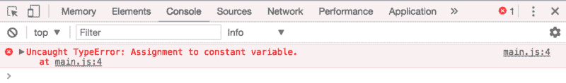
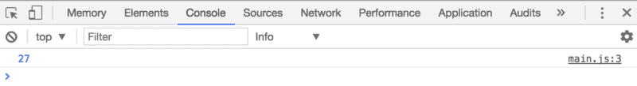

# 让我们来谈谈变量——以及为什么应该在 JavaScript 中使用它们。

> 原文：<https://www.freecodecamp.org/news/lets-talk-about-variables-and-why-you-should-use-them-in-javascript-92d8c661a5b/>

作者 Zell Liew

# 让我们来谈谈变量——以及为什么应该在 JavaScript 中使用它们。


编码的主要目的是解决问题。例如，当你点击一个按钮时会发生什么？那是我们要解决的问题。

所以，让我们从解决一个简单的问题开始这篇文章。

### 数苹果

如果你有 4 个苹果，你又买了 27 个，你有多少个苹果？花点时间在你的文本编辑器中写下你的答案。

你的答案是什么？

```
// This? 31 
```

```
// Or this? 4 + 27
```

两个答案都是对的，但是第二种方法更好——因为你把计算交给了 JavaScript。你在教它如何得出答案。

但是代码还有一个问题。

如果你看`4 + 27`时没有任何苹果问题的背景，你知道我们正在计算你目前持有的苹果数量吗？

大概不会。

所以，更好的方法是用代数用变量代替 4 和 27。当您这样做时，您将能够编写有意义的代码:

```
initialApples + applesBought
```

用名为`initialApples`的变量代替 4 的过程称为声明变量。

### 声明变量

使用以下语法声明变量:

```
const variableName = 'value'
```

您需要注意四个部分:

1.  `variableName`
2.  `value`
3.  `=`标志
4.  `const`关键字

### 变量名称

`variableName`是你要声明的变量的名字。你可以给它起任何名字，只要它遵循以下规则:

1.  必须是一个词
2.  它只能由字母、数字或下划线组成(0–9、a-z、A-Z、`_`)。
3.  它不能以数字开头。
4.  它不能是这些[保留关键字](https://developer.mozilla.org/en-US/docs/Web/JavaScript/Reference/Lexical_grammar#Keywords)中的任何一个

如果你需要用两个或更多的单词来命名你的变量，只要把这些单词连在一起，但是要把后面每个单词的第一个字母大写。这个怪异的大写叫做**骆驼案**。

驼峰式变量的一个很好的例子是`applesToBuy`。

### 价值

该值就是您希望该变量成为的值。它可以是原语(如字符串和数字)或对象(如数组和函数)。

### =在 JavaScript 中

JavaScript 中的`=`不像数学中的`=`那样工作。不要混淆。

在 JavaScript 中，`=`表示**赋值**。使用`=`时，将`=`符号右侧(RHS)的值设置(或分配)到`=`符号左侧(LHS)。

在下面的语句中，您将变量`initialApples`设置为数字 4。

```
const initialApples = 4
```

如果你`console.log`这个变量，你可以看到`initialApples`是 4。

```
console.log(initialApples) // 4
```

### 任务前评估

每个变量只能取一个值。因此，如果您有一个需要在 RHS 上计算的方程，它将在被赋值给变量之前被计算。

```
const initialApples = 4 const applesToBuy = 27 const totalApples = initialApples + applesToBuy
```

在这个例子中，JavaScript 将评估`initialApples` + `applesToBuy`(结果为 31)的答案，然后将结果分配给`totalApples`。这就是为什么你尝试登录`totalApples`会得到`31`的原因。

```
console.log(totalApples) // 31
```

### const 关键字

`const`是可以用来声明变量的三个关键字之一。还有另外两个关键词——`let`和`var`。

这三个关键字都声明了变量，但它们彼此略有不同。

### 常量与 let 和 var

`const`和`let`是 ES6 中提供给我们的关键字。它们比`var`更适合创建变量，因为[它们是块范围的，而 var 是函数范围的](https://zellwk.com/blog/es6/#let-and-const)。

现在，让我们专注于`const`和`let`的区别。

### Const vs let

如果你用`const`、**声明一个变量，你不能用一个新的值给**、**、**重新赋值。以下代码会产生一个错误:

```
const applesToBuy = 22 
```

```
// Reassigning to a variable declared with const results in an error applesToBuy = 27
```



如果你用`let`，**声明一个变量，你可以用一个新的值重新分配它。**

```
let applesToBuy = 22 applesToBuy = 27 console.log(applesToBuy)
```



### 应该用 const 还是 let？

理解应该使用`const`还是`let`更像是一个高级话题。

当你开始的时候，使用`let`会比使用`const`简单得多。

然而，当你写更多的程序时，你会慢慢意识到你不想重新分配你的变量。所以你会开始使用`const`而不是`let`。但那是另一天的不同话题。

既然当你写更高级的程序时，无论如何你都要使用`const`而不是`let`，那么当你开始时，最好养成更喜欢`const`而不是`let`的习惯。

如果你想知道，不要再用`var`了——没有必要。`let`和`const`比`var`好多了。

### 包扎

在 JavaScript 中，变量用来保存一个值。它们可以保存任何值，从原语到对象。

JavaScript 中的`=`符号不同于数学中的`=`符号。在 JavaScript 中，`=`意味着分配。

声明变量时，使用 camelCase 命名变量。避免保留关键字。

你可以用`const`、`let`或者`var`来声明变量。尽可能多地，你会想要使用`const`而不是`let`。当您需要重新分配值时，使用`let`。不再需要使用`var`。

**本文是学习 JavaScript** 中的一个示例课程，该课程帮助您学习 JavaScript 并从头构建真正实用的组件。如果你觉得这篇文章有帮助，我邀请你去[了解更多关于学习 JavaScript 的知识](https://learnjavascript.today/)。

(哦，对了，如果你喜欢这篇文章，如果你能[分享一下](http://twitter.com/share?text=Use%20const%20over%20let%20when%20declaring%20variables.%20No%20need%20to%20use%20var%20anymore%20?%20&url=https://zellwk.com/blog/javascript-variables/&hashtags=)，我会很感激。？)

*最初发表于[zellwk.com](https://zellwk.com/blog/javascript-variables/)。*