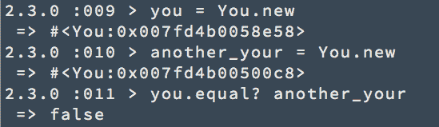
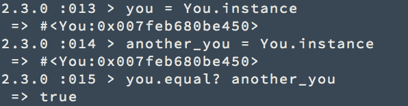

# 让我们来谈谈你——以及单例设计模式

> 原文：<https://www.freecodecamp.org/news/lets-talk-about-you-and-the-singleton-design-pattern-bb2e160fa952/>

作者:黄思慧

这可能是我的[生活中的设计模式和 Ruby](http://www.sihui.io/design-patterns/) 系列中最重要的一篇文章，因为这篇文章是关于你的。

在做任何事情之前，你需要听这首歌:

不，我是认真的。

歌曲不到 2 分钟。

在你进一步阅读之前，先听听这首歌。

让我们来看看这首歌的歌词:

> 站直了。

> 你是独一无二的。

> 要骄傲。

> 你与众不同。

> 毫无疑问。你是首屈一指的。

> 因为你是独一无二的。

> 抬起下巴。

> 因为你是独一无二的。

> 挺胸。

> 我们知道在太阳底下再也找不到像你这样的人了 。

> 因为你是独一无二的。

> 如果每个人都像其他人一样，那该有多无聊。

> 让我与众不同的东西就是让我成为我的东西。

你是独一无二的，你是独一无二的，你是唯一的！

这种唯一性正是 Singleton 模式的意义所在！

单例模式的定义:

> 单例模式:

> - **确保一个类只有一个实例**，

> -并提供全球访问点。

标准的第二部分很容易实现——基本上任何类都可以提供一个全局访问点。

但是像这样的简单类并不能确保该类只有一个实例:

我们可以很容易地创建两个不同的`you`实例。

这是因为为类创建实例的方法`new`是公共的。

为了防止类有多个实例，我们可以尝试将`new`方法标记为私有，这样类之外的任何人都不能访问该方法——除非您真的特意使用了`You.send('new')`。如果你真的想违背代码作者的意愿，你可以随时调用`.send(method_name)`来调用 Ruby 中的私有方法。

但是我们根本不能创建类的实例！

为什么我们不从类内部创建一个实例，并打开一个通向外部世界的入口呢？

(在 Ruby 中，@@表示变量是类变量。)

现在有一种方法可以访问在类中创建的实例:

单例模式定义的两个标准都已满足:

> -确保一个类只有一个实例，

> -并提供全球访问点。

我们刚刚写了一个简单的单例模式的例子！

使用单例模式有很多好处。其中之一是惰性初始化:

> 策略**延迟一个对象**的创建，一个值的计算，或者其他一些昂贵的过程**，直到第一次需要它的时候**。

在上面的代码中，我们直到第一次调用`LazyYou.instance`才初始化实例，这是第一次需要实例。

现在您对单例模式有了基本的了解。

下次当您试图确保一个类只有一个实例时，您可以考虑这种模式。

当你情绪低落时，提醒自己**你是唯一的一个，让你与众不同的东西就是让你成为你的东西:】**

### 外卖食品

1.  单体模式确保一个类只有一个实例，并提供一个全局的访问点。
2.  **骄傲。你和其他人不一样。**

别忘了订阅，这样你就不会错过下一篇文章了！

下次我们将谈论…

