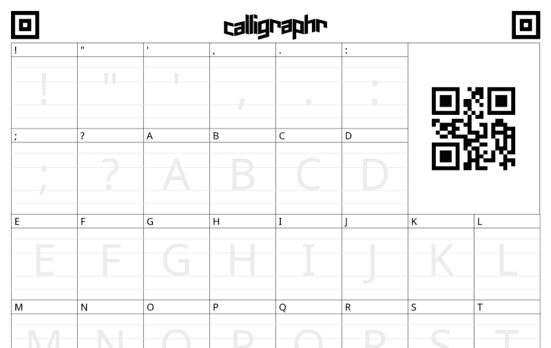
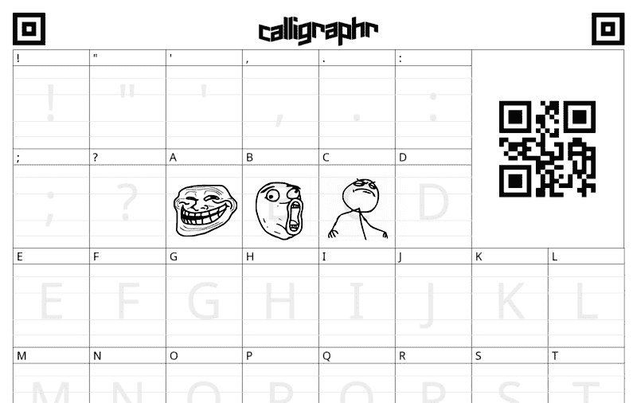
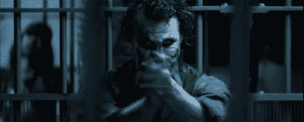

# 字体(更)牛逼——一个标志性的发明

> 原文：<https://www.freecodecamp.org/news/lets-use-font-more-awesome-to-make-an-iconic-invention-a95324d92ace/>

由 Pubudu Dodangoda

# 字体(更)牛逼——一个标志性的发明


无论你是在建立一个网站，一个手机应用程序，甚至是一个独立的应用程序，都有一些事情是你永远无法逃避的。正确使用图形和图标就是这样一种基本需求。花哨的图标与排列和颜色组合同样重要。这是因为一个图标可以表达一百个单词所能表达的意思！

虽然有很多方法可以给网站添加图标，但最流行的方法是使用字体 Awesome。执行所需的配置后，添加图标就像这样简单:

```
<i class="fa fa-bell"></i>
```

然而，有些情况下，字体 Awesome 提供的图标集是不够的。例如，我最近想在一个网站上使用脸书、Twitter 和 Airbnb 的标志。这让我大吃一惊 Airbnb 的图标并没有被收录到“牛逼字体”中。事实上，这个社区在大约 3 年前就已经申请了 Airbnb 图标。然而，该图标仍然不在官方图标集中。

同样，如果你想要一个不太流行的自定义图标，添加它最简单的方法是使用一个`img`标签。与使用字体 Awesome 相比，这太麻烦了。另一方面，字体牛逼的家伙不能迎合所有的图标要求，实际上来说。

所以我寻找一种简单的方法来获得我需要的图标，而不依赖于第三方。很幸运，我找到了一个叫[书法家](https://www.calligraphr.com/)的工具。我现在将解释我如何使用这个工具、一些 CSS 知识和一些其他简单的技巧来在我的代码中完成以下任务:

```
<i class="fa fa-troll"/><i class="fa fa-like-a-boss"/><i class="fa fa-lol"/>
```


很酷吧？然后**让我们把字体建得更牛逼！**

### 创建字体

我们旅程的第一个里程碑是使用他们网站上的[指令来创建更棒的字体。第一步是下载模板。这里有一个例子:](https://www.calligraphr.com/en/webapp/app_home/?/)



Calligraphr Template

现在我们要做的是在这些盒子里填入我们想要的图标。你可以手工打印和绘制图标，或者使用 Adobe Photoshop 或 GIMP 等工具使用从互联网上下载的图像。

填充模板后，它将如下所示:



接下来你要做的事情很简单。只需将填充好的模板上传到书法家网站，然后点击“创建字体”按钮——嘣！将下载您的自定义字体。我们把它命名为`FontMoreAwesome.otf`

如果你想知道刚刚发生了什么神奇的事情，它被称为图像[矢量化](https://en.wikipedia.org/wiki/Image_tracing)或图像跟踪。由于潜在的跟踪算法，您可能会注意到所使用的图像和实际创建的图标之间的细微差别。但是，一旦图像被转换成矢量，它们可以放大和缩小，而不会损失质量。

### 与字体集成 Awesome

当然，你可以把新的字体文件当作一个单独的图标集。但是如果我们可以扩展字体牛逼字体本身不是很酷吗？我们开始吧！

这里你应该明白的一件事是，我们将继承由字体 Awesome CSS 文件定义的 CSS 规则。例如，它将包含如下条目:

```
.fa {  display: inline-block;  font: normal normal normal 14px/1 FontAwesome;  font-size: inherit;  text-rendering: auto;  -webkit-font-smoothing: antialiased;  -moz-osx-font-smoothing: grayscale;}
```

这意味着当我们如下定义一个图标元素时，它将从上面继承诸如`display`、`font-size`和`text-rendering`的样式。

```
<i class="fa fa-troll"/>
```

现在让我们定义我们的自定义 CSS 文件。让我们把这个文件命名为`font-more-awesome.css`

这个文件的第一个条目应该是 font-face 声明。这可以如下进行。没什么大不了的。只是一些基本的 CSS。

```
@font-face {    font-family: 'FontMoreAwesome';    src: url('../fonts/FontMoreAwesome.otf');    font-weight: normal;    font-style: normal;}
```

然后，我们可以像这样轻松地定义我们想要的自定义图标:

```
.fa-troll:before {    font-family: FontMoreAwesome;    content: "A";}.fa-lol:before {    font-family: FontMoreAwesome;    content: "B";}.fa-like-a-boss:before {    font-family: FontMoreAwesome;    content: "C";}
```

注意，我们使用`before`选择器将图标定义为伪元素。这样，我们可以将我们想要的内容注入到使用这些类的元素中。

在我们创建的 FontMoreAwesome 字体中，“A”、“B”和“C”分别由 Troll、Lol 和 Like-a-boss 的图标表示。尽管这不是最好的方法。

字体 Awesome 使用 Unicode 私人使用区(PUA)来确保屏幕阅读器不会读出代表图标的随机字符。

但是对于我们的例子，我们将坚持用英文字母来保持故事的简单。

在上面的例子中需要注意的另一件事是，我们在注入定制内容时覆盖了由 Font Awesome 定义的字体系列。

### 让我们用更牛逼的字体

最后一步是将这个 CSS 文件加载到 index.html 文件中，这非常简单。

```
<link href="css/font-more-awesome.css" rel="stylesheet">
```

现在，您可以将这些图标用作任何其他的`fa`图标。例如，下面的图标会很大并且会旋转。

```
<i class="fa fa-troll fa-spin fa-lg"/>
```

### 你喜欢这个故事吗？那么你可以做一件小事…

