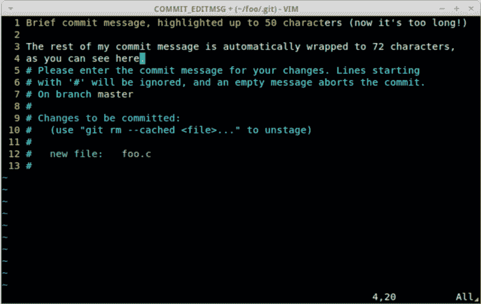

# 如何让你的提交信息令人敬畏并让你的团队开心

> 原文：<https://www.freecodecamp.org/news/level-you-up-to-awesome-commit-messages-a85558cb90e8/>

作者布鲁诺

# 如何让你的提交信息令人敬畏并让你的团队开心

#### 提交消息是团队成员之间交流的重要方式



团队软件开发中最重要的是沟通。提交消息是团队成员之间交流的重要方式:它的过去和它的未来。

当分析代码或调试时，我们都有这样的问题:

*   为什么这个*如果*在这里？
*   谁忘了更新分支？
*   这种变化产生了什么影响？
*   这种变化如何修正或改进代码呢？

为此，[git-fall](https://git-scm.com/docs/git-blame)允许我们发现哪个版本是最后更改文件的。但是仅仅知道这一点是不够的。实际阅读提交消息将有助于理解那里到底发生了什么。

我们需要阅读消息来体验一个好的提交消息的真正价值，并被激励去写它们。

#### 一些最佳实践

所以，如果到目前为止你的大部分 Git 提交都是用类似于`git commit -m "9000 — Bug fixes issue"`的东西创建的，那么下一次试试这个指南:

> 千万不要使用`-m <m`SG&`gt; / --message`=<msg&`gt; flag t`o git commit。

它让您立刻有了一种糟糕的心态，因为您会觉得必须将提交消息放入终端命令中，并且使提交感觉更像是一次性的争论，而不是历史中的一页。

> 第一行应始终为 [50 个字符或更少](https://commit.style)，其后应跟随一个空行。

写一个祈使句:“修复 bug”。[*Add | Fix | Remove | Update | Refactor*]一致的措辞使得在心理上处理提交列表更加容易。

> 72 个字符的较长描述。

通常一个主题本身就足够了。如果不是，添加一个空行(这很重要)后跟一个或多个段落硬换行到 72 个字符。

这些段落应解释:

为什么这种改变是必要的？

这个答案解释了在提交中会发生什么，允许他们更容易地识别和指出不相关的变更。

它如何解决这个问题？

从高层次上描述影响变革的措施。如果你的改变很明显，你可以不回答这个问题。

**这种改变有什么副作用？**

这是需要回答的最重要的问题，因为它可以指出您在一个提交或分支中进行了太多更改的问题。相关变更的一两个要点可能没问题，但是五六个要点可能表明提交做了太多的事情。

```
# 50-character subject line## 72-character wrapped longer description. This should answer:## * Why was this change necessary?# * How does it address the problem?# * Are there any side effects?## Include a link to the ticket, if any.
```

#### 如何让你的生活更轻松

需要记住的内容很多，但是您可以通过使用`commit.template`来设置提交消息模板

配置 Git 使用模板文件(例如，`.gitmessage`)，然后用 Vim 创建模板文件:

```
git config --global commit.template ~/.gitmessagevim ~/.gitmessage
```

当我们在没有`-m`消息标志的情况下运行`git commit`时，编辑器将打开我们有用的模板:

```
# [Add/Fix/Remove/Update/Refactor/Document] [summary]# Why is it necessary? (Bug fix, feature, improvements?)-# How does the change address the issue? -# What side effects does this change have?-# Include a link to the ticket, if any.
```

最终消息中不包括注释行。只需在提示下的空白行中填入文本和要点。

GitHub 和 Bitbucket 中的问题追踪器都可以识别关键字`close`、`fix`和`resolve`，后面紧跟问题或拉取请求编号。

我想如果我们不再在公共存储库中使用`git commit -m "Fix bug"`，Linus 会很高兴的:)

您可以在 git 日志中简单地搜索问题编号，例如，使用`git log --grep=JIRA-1234`

你也可以使用类似于`vim-fugitive`用于 *vim* 或者`git lens`用于 *vs code* 的插件来快速访问 git 提交消息。

#### 结束语

创建干净的 Git 提交说明了很多关于你的事情，并且可能是人们在项目中与你互动的主要方式。

通过一点练习，你可以让你的提交习惯更好地反映你最好的工作——显然是用心和自豪创造的工作。

当你未来的你和你的团队运行`git blame`来查看为什么会有条件时，他们会感谢你的深谋远虑和罗嗦。

如果你喜欢这篇文章，请鼓掌、推荐并分享。