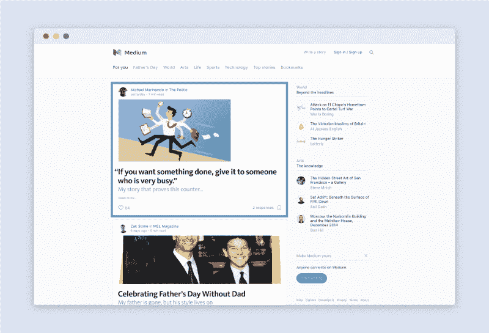
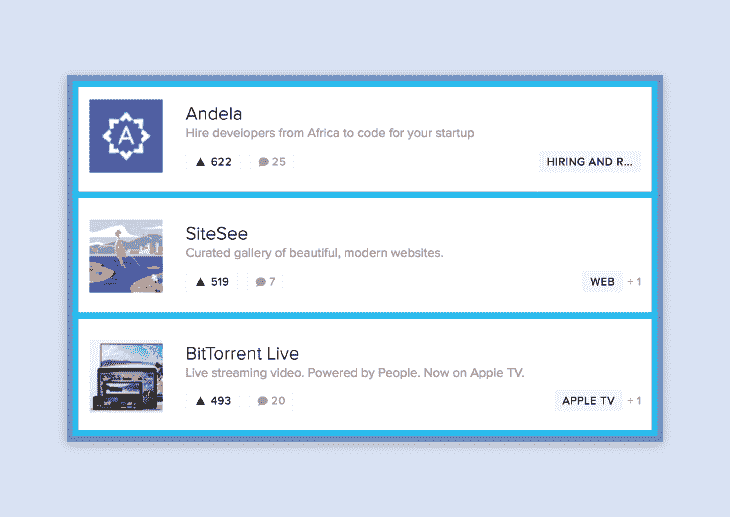
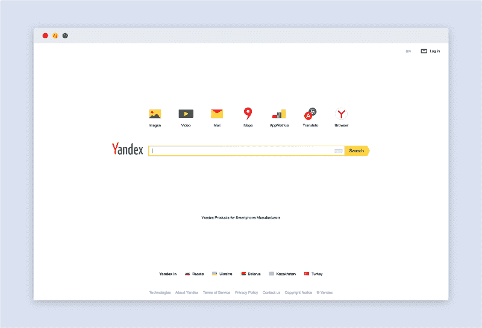

# 在 CSS 中升级

> 原文：<https://www.freecodecamp.org/news/leveling-up-css-44b5045a2667/>

CSS 初看起来很容易。毕竟只是造型对吧？

但是，给它时间。很快，CSS 将向您展示其复杂性的真正深度。

在大规模使用 CSS 时，你可以做四件事来保持理智:使用正确的语义、模块化、采用命名约定以及遵循单一责任原则。

#### 使用正确的语义

在 HTML 和 CSS 中有语义标记的概念。语义是词及其关系的意义。在 HTML 的上下文中，这意味着使用适当的标记标签。这里有一个经典的例子。

```
<!-- bad --><div class=”footer”></div>
```

```
<!-- good --><footer></footer>
```

语义 HTML 非常简单。另一方面，语义 CSS 更加抽象和主观。编写语义 CSS 意味着选择传达结构意义和功能的类名。想出容易理解的类名。确保它们不要太具体。这样，您可以重用您的类。



为了说明好的语义类名，这里有一个简化的 Medium 的 CSS 示例。

```
<div class="stream">  <div class="streamItem">    <article class="postArticle">      <div class="postArticle-content">        <!-- content -->      </div>    </article>  </div></div>
```

从代码中，您可以立即辨别出结构、角色和含义。父类是 *stream，*文章列表。子类是 *streamItem，*列表中的实际文章。父母和孩子之间的关系很明显。此外，那些类被用在每一个有文章的页面上。

你应该能够像阅读一本书一样阅读 HTML 和 CSS。它应该讲一个故事。一个故事有人物和他们之间的关系。更多的语义 CSS 将最终使你的代码更易于维护。

为了进一步阅读，请查看[语义类名的来源](https://css-tricks.com/semantic-class-names/)、[给 CSS 命名真的很难](https://seesparkbox.com/foundry/naming_css_stuff_is_really_hard)以及[语义和敏感性](http://csswizardry.com/2010/08/semantics-and-sensibility/)。更长的阅读，见[关于 HTML 语义和前端架构](http://nicolasgallagher.com/about-html-semantics-front-end-architecture/)。

#### 模块化

在 React 这样的基于组件的库时代，模块化是王道。将组件视为通过解构接口创建的可组合模块。下面是产品搜索的首页流。作为一个练习，让我们将流分解成不同的组件。



每个彩色轮廓代表一个组件。*流*有许多*流项目*。

```
<div class="stream">  <div class="streamItem">    <!-- product info -->  </div></div>
```

大多数组件可以被分解成更小的组件。


每个*流项目*都有一个*缩略图*和关于特色产品的信息。

```
<!-- STREAM COMPONENT --><div class="stream">  <div class="streamItem">
```

```
 <!-- POST COMPONENT -->    <div class="post">            <div class="content">        <!-- product info -->      </div>    </div>
```

```
 </div></div>
```

因为*流*组件独立于其子组件，反之亦然，所以您可以轻松地调整或切换出 *post* 类，而无需对*流*类进行重大更改。

考虑组件将有助于您编写解耦代码。你的代码解耦的越多，你的类之间的相互依赖就越低。从长远来看，这使得您的代码更容易修改和使用。


[Component driven design](https://dribbble.com/shots/1200218-iOS-7-UI-Components)

当模块化你的 CSS 时，首先把你的设计分解成组件。你可以用纸和笔或者像 Illustrator 或 Sketch 这样的程序来完成。识别组件会让你知道如何命名你的类，以及它们之间的关系。

要阅读更多关于组件驱动 CSS 的内容，请查看 [CSS 架构:可扩展和模块化方法](https://www.sitepoint.com/css-architectures-scalable-and-modular-approaches/)、[用 Sass 编写模块化 CSS](http://sassbreak.com/writing-modular-css-with-sass/)和[模块化前端代码以实现长期可维护性和健全性](http://www.berndtgroup.net/thinking/blog/development/modularizing-your-front-end-code-for-long-term-maintainability-and-sanity)。

#### 选择一个好的命名约定

有许多 CSS 命名约定。有些人对自己选择的惯例信以为真，声称自己的比别人的好。事实上，最佳命名惯例因人而异。我收到的最好的建议是:选择对你来说最有意义的命名约定。

以下是人们使用的一些命名惯例的简短列表:

*   [面向对象的 CSS OOCSS](https://www.smashingmagazine.com/2011/12/an-introduction-to-object-oriented-css-oocss/)
*   [块元素修改器(BEM)](http://csswizardry.com/2013/01/mindbemding-getting-your-head-round-bem-syntax/)
*   [CSS 的可扩展和模块化架构(SMACSS)](https://smacss.com/)
*   [原子](http://acss.io/)

我最喜欢的命名惯例之一是 BEM。BEM 代表块、元素和修改器。Yandex ，俄罗斯的谷歌，想出了它来解决大规模 CSS 代码库的问题。



BEM 是最简单的——但也是最严格的——命名约定之一。

```
.block {}.block__element {}.block--modifier {}
```

块代表更高级别的类。元素是块的子元素。和修饰语代表不同的状态。


```
<div class="search"> <input type="search__btn search__btn--active" /></div>
```

在上面的例子中，类*搜索*是块，而*搜索按钮*是它的元素。如果我们想修改按钮的状态，我们可以添加一个类似于*激活*的修改器。

关于命名约定要记住的一件事是，不管你喜欢哪种 CSS 命名约定，你经常会继承或使用不同标准的代码库。对学习新的标准和思考 CSS 的替代方式持开放态度。

你可以在[获得你的头脑’轮 BEM 语法](http://csswizardry.com/2013/01/mindbemding-getting-your-head-round-bem-syntax/)、 [BEM 101](https://css-tricks.com/bem-101/) 和[BEM 简介](http://getbem.com/introduction/)中阅读更多关于 BEM 的内容。对于不同约定的一般阅读，请查看 OOCSS、ACSS、BEM、SMACSS:它们是什么？我应该用什么？

#### 遵循单一责任原则

单一责任原则规定，每个模块或类都应该对软件提供的功能的单一部分负责，并且这种责任应该完全由类来封装。

在 CSS 的上下文中，单一责任原则意味着代码、类和模块应该只做一件事。当应用于 CSS 文件组织时，这意味着像传送带和导航栏这样的自包含组件应该有自己的 CSS 文件。

```
/components   |- carousel  |- |- carousel.css  |- |- carousel.partial.html  |- |- carousel.js  |- nav  |- |- nav.css  |- |- nav.partial.html  |- |- nav.js
```

文件组织的另一种常见模式是按功能对文件进行分组。例如，在上面的代码片段中，所有与 carousel 组件相关的文件都被分组在一起。采用这种方法可以更容易地找到文件。

除了分离组件样式之外，使用单一责任原则分离全局样式也是很好的。

```
/base  |- application.css   |- typography.css  |- colors.css  |- grid.css
```

在这个例子中，每一个风格问题都被分离到它自己的文件中。这样，如果你想更新你的颜色，你就知道去哪里找了。

无论您使用哪种文件组织惯例，让单一责任原则帮助指导您的决策。如果一个文件开始变大，考虑根据逻辑意义对其进行分区。

关于文件结构和 CSS 架构的更多信息，请阅读[美学 Sass 1:架构和风格组织](https://scotch.io/tutorials/aesthetic-sass-1-architecture-and-style-organization)和[可扩展和可维护的 CSS 架构](https://www.xfive.co/blog/itcss-scalable-maintainable-css-architecture/)。

当单一责任原则应用于单独的 CSS 类时，这意味着每个类应该只有一个函数。换句话说，根据关注点将风格分成不同的类别。这里有一个经典的例子:

```
.splash {  background: #f2f2f2;  color: #fffff;  margin: 20px;  padding: 30px;  border-radius: 4px;  position: absolute;  top: 0;  right: 0;  bottom: 0;  left: 0;}
```

在上面的例子中，我们混合了关注点。 *splash* 类不仅包含自己的表示和样式逻辑，还包含其子类的表示和样式逻辑。为了解决这个问题，我们可以将代码分成两个独立的类。

```
.splash {  position: absolute;  top: 0;  right: 0;  bottom: 0;  left: 0;}
```

```
.splash__content {  background: #f2f2f2;  color: #fffff;  padding: 30px;  border-radius: 4px;}
```

现在我们有了*飞溅*和*飞溅内容*。我们可以使用 *splash* 作为一个通用的全出血类，它接受任何孩子。孩子的所有关注点，在这种情况下是 *splash 内容*，与父对象分离。

你可以在[应用于 CSS 的单一责任原则](http://csswizardry.com/2012/04/the-single-responsibility-principle-applied-to-css/)和[单一责任](http://drewbarontini.com/articles/single-responsibility/)中读到更多关于将单一责任方法应用于样式和类的内容。

#### 简单胜于复杂

问问任何优秀的前端开发人员或 CSS 架构师，他们都会告诉你，他们从来没有对自己的代码完全满意过。写好 CSS 是一个迭代的过程。从简单开始，遵循基本的 CSS 惯例和样式指南，并从那里迭代。

我很想知道你是如何处理 CSS 的。你最喜欢的命名惯例是什么？你如何组织你的代码？欢迎给我留言或发推文。

另外，如果你喜欢这篇文章，点击推荐按钮或与朋友分享，这将意味着很多。

如果你想了解更多，你可以在 Twitter 上关注我，我会在这里发布一些关于设计、前端开发、机器人和机器学习的无聊言论。

