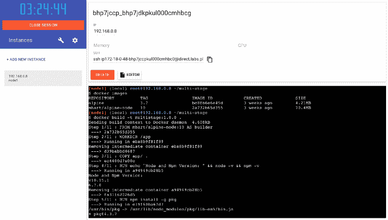
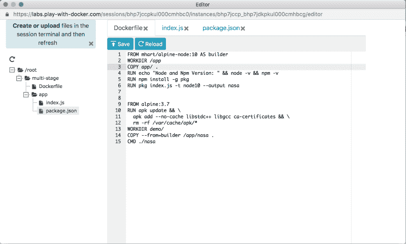
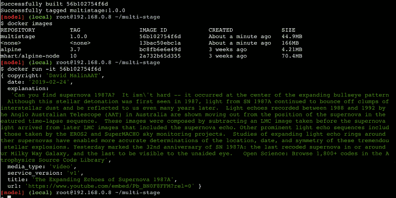

# 如何利用 Docker 多阶段构建来优化您的 Docker 文件和图像

> 原文：<https://www.freecodecamp.org/news/leveraging-docker-multi-stage-builds-to-optimize-dockerfile-image-1e708a591940/>

作者:库马尔·里沙夫

# 如何利用 Docker 多阶段构建来优化您的 Docker 文件和图像


Photo by [Jose Carbajal](https://unsplash.com/@jocac?utm_source=medium&utm_medium=referral) on [Unsplash](https://unsplash.com?utm_source=medium&utm_medium=referral)

多阶段构建是一项新功能，要求守护程序和客户端上的 Docker 17.05 或更高版本。它们有助于构建复杂/多步图像，同时保持易于阅读和维护。

在构建图像时，保持图像尺寸较小是一项具有挑战性的任务。docker 文件中的每条指令都会向图像添加一层。此外，您需要记住清理以后不再需要的依赖项/工件。以前，您可能会使用 shell 脚本来尽可能减轻图层。但是使用 shell 技巧来编写一个真正高效的 Dockerfile 是一项痛苦的任务。

### 什么是多阶段构建？

简而言之:您可以将一个阶段的最终结果(例如:二进制/可执行文件)用于另一个阶段，而不必担心用于构建该二进制/可执行文件的依赖关系。

### 它是如何工作的？

对于多阶段构建，在一个 Dockerfile 文件中可以有多个`FROM`语句。每个`FROM`语句贡献一个阶段。第一阶段从数字`0`开始。

```
FROM mhart/alpine-node:10  #stage 0
```

```
.......
```

```
FROM alpine:3.7 #stage 1
```

这里，阶段的顺序很重要，因为第一个阶段总是`0`。另一种方法是用`AS`给`stage`命名。在那种情况下，你不必担心秩序。

```
FROM mhart/alpine-node:10 AS nodebuilder
```

```
.......
```

```
FROM alpine:3.7 AS builder
```

### 演示多阶段构建

经过测试的基础设施:[使用 Docker](https://labs.play-with-docker.com)

出于演示的目的，让我们考虑一个简单的 nodejs 应用程序，并用它构建一个二进制文件。当您执行这个二进制文件时，它将调用一个 [NASA api](https://api.nasa.gov/api.html) ，返回一些关于今天日期的有趣事实。

#### 之前:docker 图像



before:docker_images

目前我们有两张我从 [dockerhub](https://hub.docker.com/) 中提取的图片:

*   `alpine (**~4Mb**)` -最轻版本的 linux 操作系统
*   `alpine-node (**~70Mb**)` - alpine + Node/Npm 等依赖。

#### 文件结构



`**Dockerfile**`**:T2**

*   **在阶段 0** (别名:`builder`)上，我们有一个`alpine-node` OS，里面内置了`node`和`npm`。它的大小是`**~70Mb**`。这个阶段将在当前`WORKDIR`即`app/`中创建一个二进制(名为`nasa` : *行 6* )。
*   在第一阶段，我们有`alpine`个操作系统。之后，我们安装一些必要的依赖项。在`Line 14`中，我们将`nasa`二进制从上一阶段(`builder`)复制到当前阶段。因此，我们只是复制了二进制文件，并留下了所有繁重的`alpine-node`操作系统和其他依赖项，如`npm` ( [节点包管理器](https://www.npmjs.com/))等，因为二进制文件已经内置了所需的依赖项(如 nodejs)。

`**app/**`**:T2**

*   只是一个简单的节点应用。它执行一个`https`调用，并使用 NASA api 获取数据。它有`index.js`和`package.json`。我已经使用了`[pkg](https://www.npmjs.com/package/pkg)`来构建节点二进制文件。这是这个应用的[代码](https://gist.github.com/kumarrishav/36596fc94fe282d9e8dc26707fbdb7df)。

#### 之后:docker 图像



after: docker images

**多级:1.0.0** ( `56b102754f6d`)是我们构建的最终所需图像。它的尺寸是`**~45Mb**`。**几乎是搭建在舞台 0 上的中间图像`13bac50ebc1a`的 1/4**和`alpine-node`图像的**几乎一半**。

因此，这是一个展示多阶段构建特性的简单示例。对于有多个步骤的图像(如语句中的 10–15)，您会发现这个特性非常有用。

#### 使用外部图像作为“舞台”

使用多阶段构建时，您并不局限于从先前在 docker 文件中创建的阶段进行复制。您可以使用`COPY --from`指令从一个单独的映像进行复制，或者使用本地映像名、本地可用的或 Docker 注册表上的标签，或者标签 ID。

`COPY --from=sampleapp:latest home/user/app/config.json app/config.json`

谢谢你。

*感谢[阿吉特](https://twitter.com/ajeetsraina)对博客的评论。*

*最初发布于[collab nix](http://collabnix.com/):[https://lnkd.in/fJaC6gp](https://lnkd.in/fJaC6gp)。*