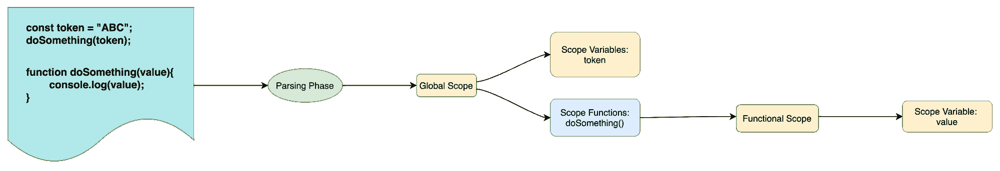
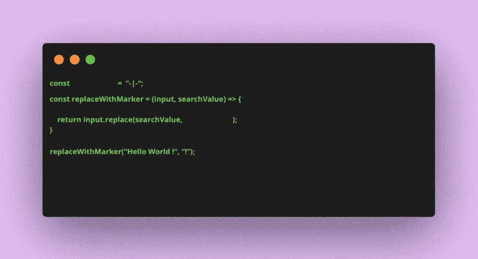
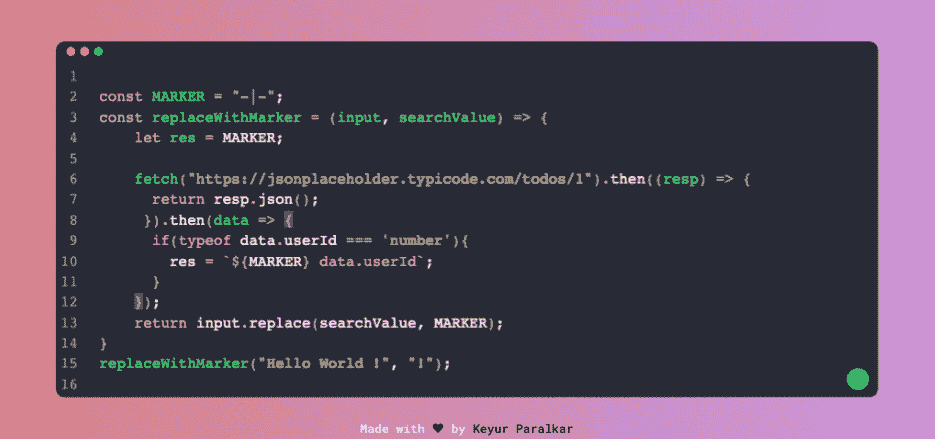
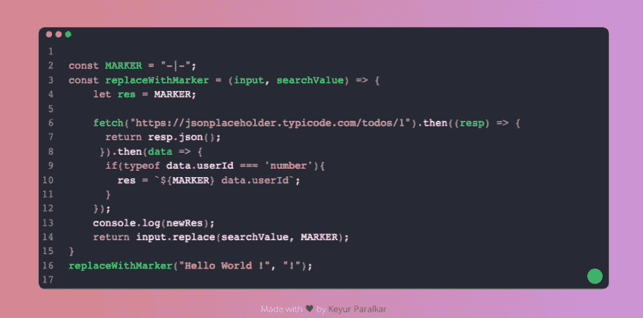

# JavaScript 中的词法范围——初学者指南

> 原文：<https://www.freecodecamp.org/news/lexical-scope-in-javascript/>

在本文中，我们将通过一些有用的例子来理解什么是词法范围。

我们还将简要讨论 JavaScript 如何编译和执行程序。

最后，我们将看看如何使用词法范围来解释未声明的变量错误或引用错误。

事不宜迟，我们开始吧。

## 目录

*   【JavaScript 如何执行程序？
*   【JavaScript 如何解析/编译和执行代码
*   [理解语法错误](#syntax-error)
*   [了解变量/函数提升](#variable-function-hoisting)
*   [什么是词法范围](#what-is-lexical-scope)？
*   [理解词法范围](#understanding-lexical-scope)
*   [总结](#summary)

## Javascript 如何执行程序？

在理解 JavaScript 如何执行代码/程序之前，我们将首先从编译理论的角度探索任何编译过程中涉及的不同步骤。

对于任何语言，编译器都执行以下操作:

### 标记化/词法分析

在这个过程中，整个程序被分成称为令牌的关键字。例如，考虑下面的语句:`let temp = 10`–一旦应用了标记化，它将把该语句分成如下关键字:`let`、`temp`、`=`、`10`。

词法分析和标记化术语可以互换使用，但它们之间有细微的区别。词法分析是一个标记化的过程，但它也检查是否需要将其视为一个独特的标记。我们可以认为 **Lexing** 是标记化的一个聪明版本。

### 从语法上分析

这是一个收集上一步中生成的所有标记并将它们转换成语法上表示代码的嵌套树结构的过程。

这种树结构被称为抽象语法树(AST)。

### 代码生成

这个过程将 AST 转换成机器可读的代码。

这是对编译器如何工作并生成机器可读代码的简单解释。

当然，除了上面提到的步骤之外，还有更多的步骤。但是解释编译器的其他步骤/阶段超出了本文的范围。

关于 JS 执行，我们可以做的最重要的观察是，要执行代码，它要经历两个阶段:

1.  从语法上分析
2.  执行

在我们理解词法范围之前，首先理解 JavaScript 如何执行程序是很重要的。在接下来的部分中，我们将深入探讨这两个阶段是如何工作的。

## JavaScript 如何解析/编译和执行代码



Parsing phase

先说解析阶段。在这个阶段，JavaScript 引擎遍历整个程序，将变量赋给它们各自的作用域，并检查任何错误。如果它发现一个错误，那么程序的执行就会停止。

在下一个阶段，实际执行代码。

为了更详细地理解这一点，我们将研究以下两种情况:

*   句法误差
*   可变提升

### 句法误差

为了向您展示 JS 如何首先解析程序，然后执行它，最好也是最简单的方法是演示语法错误的行为。

考虑下面的错误代码:

```
const token = "ABC";
console.log(token);

//Syntax error:
const newToken = %((token);
```

上面的程序会在最后一行产生一个语法错误。错误看起来是这样的:

```
Uncaught SyntaxError: Unexpected token '%' 
```

如果您查看错误，JavaScript 引擎没有执行`console.log`语句。相反，它以下列方式完成了整个程序:

*   第 1 行，发现有一个变量声明和定义。所以它把对`token`变量的引用存储在当前作用域，也就是全局作用域中。
*   第 2 行，JavaScript 引擎发现正在引用`token`变量。它首先引用当前作用域来检查`token`变量是否存在。如果它存在，那么它被引用到`token`变量的声明中。
*   第 3 行，引擎发现正在声明和定义`newToken`变量。它检查当前作用域中是否存在名为`newToken`的变量。如果是，则抛出引用错误。如果为否，则在当前范围内存储此变量的引用。
*   在同一行，引擎还发现它试图引用一个变量`%((token)`。但是它发现它以`%`开头，并且变量名不能以保留关键字开头，所以它抛出了一个语法错误。

### 可变/功能提升

提升是一种机制，通过这种机制，所有存在于各自作用域中的变量都被提升，这在顶部是可用的。

现在让我们看一下下面的例子，它将向您展示托管在解析阶段发生，然后执行发生:

```
doSomething();

function doSomething(){
	console.log("How you doing?");
}
```

在上述程序中，引擎以下列方式执行程序:

*   第 1 行，JavaScript 引擎遇到了一个名为`doSomething`的函数。它搜索以查看`doSomething`在当前范围内是否可用。如果是，那么它引用这个函数，否则它抛出一个引用错误。
*   结果是，在解析阶段，引擎发现`function doSomething`行将出现在当前范围内。因此，它在当前范围内添加了这个变量的引用，并使它在整个程序中可用。
*   最后，`doSomething`函数打印出了字符串`How you doing?`。

从上面的解释中我们可以看到，代码首先被解析，以生成一些中间代码，确保当前作用域中引用的变量/函数(即`doSomething`)可用。

在下一阶段，JavaScript 知道这个函数，因此开始执行。

从上面的例子中，我们可以有把握地得出结论，JavaScript 引擎在执行代码之前会做以下事情:

1.  解析代码。
2.  生成描述可用变量/函数的中间代码。
3.  使用上面的中间代码，它开始执行程序。

## 什么是词法范围？

在运行时确定变量/函数范围的过程称为词法范围。单词*词法*来自 JS 编译器步骤的*词法/标记化阶段*。

在运行时，JavaScript 做这两件事:`parsing`和`execution`。正如您在上一节中了解到的，在解析阶段，变量/函数的范围是定义的。这就是为什么首先理解代码执行的解析阶段很重要，因为它为理解词法范围奠定了基础。

用外行人的话来说，JavaScript 引擎的解析阶段是词法作用域发生的地方。

现在我们知道了它的基础，让我们来看看词法范围的一些主要特征:

首先，在解析阶段，作用域被分配/引用到声明它的变量。

例如，考虑一个场景，其中一个变量在内部函数中被引用，而它的声明出现在全局范围内。在这种情况下，内部变量被赋予外部作用域，即全局作用域。



Scope assigned illustration

然后，在给变量分配作用域时，JavaScript 引擎会检查其父作用域中变量的可用性。

如果变量存在，则该父作用域应用于该变量。如果在任何父作用域中都找不到变量，则会引发引用错误。请看下图，它展示了如何搜索一个变量的范围。



JS engine successfully finding a variable by going through each scope

下图显示了 JS 引擎尝试查找不存在于任何范围内的变量:



JS engine throwing reference error

## 理解词汇范围

在上一节中，我们定义了什么是词法范围。我们也知道它有什么特征。

在这一节中，我们将借助一个例子来理解词法范围。正如他们所说的，通过查看现实生活中日常代码的例子，理解困难的主题总是更容易。让我们开始吧。

我们将要使用的例子涉及到对具有相似范围的代码区域进行着色。这听起来可能令人困惑，但是让我用一个简单的例子来演示一下。


Understanding lexical scope with a coloring example

让我们后退一步，理解这个例子中发生了什么。

我们的计划中有以下内容:

*   `empData`:对象数组。
*   `allPositions`:包含所有雇员职位的字符串数组。
*   最后，我们有一个控制台语句打印出`allPositions`变量。

现在让我们看看在这个程序的解析阶段发生了什么:

*   引擎从第一行开始，遇到一个变量声明`empData`。
*   然后，引擎检查`empData`在当前范围内是否可用。因为没有找到类似的变量，所以它检查这个变量在其父作用域中是否存在。
*   引擎将在此处停止搜索，因为没有可用的范围，并且当前范围是全局范围。
*   接下来，引擎在解析阶段给`empData`分配一个`undefined`值，这样一旦任何嵌套的作用域试图引用这个变量，它就可以被使用。
*   这个赋值操作符的右边在程序的执行阶段被求值。
*   以类似的方式，引擎对`allPositions`变量做同样的事情，并给它分配一个`undefined`值。
*   但是在右边，我们也引用了`empData`变量。在此阶段，引擎检查该变量在当前范围内是否可用。既然可用，就引用同一个(即存在于全局范围内)。
*   引擎仍然在右边，因为它发现 map 函数中有一个箭头函数。由于引擎遇到了函数定义，它创建了一个新的作用域。在 gif 中，这是数字 2。
*   由于这是一个新的范围，我们将颜色编码为黑色。
*   这个箭头函数有一个参数`data`并返回`data.position`。在解析阶段，引擎通过引用当前作用域及其父作用域中的变量来提升所有需要的变量。
*   在这个函数中，引用了`data`变量，所以引擎检查当前作用域是否有这个变量。因为变量存在于当前范围内，所以它引用同一个。
*   一旦引擎遇到`}`拉条，它就会移出功能范围。
*   最后，在程序的最后，我们有一个显示`allPositions`变量的控制台语句。因为它引用了`allPositions`变量，所以它在当前范围(即全局范围)中搜索。既然找到了，就在`console`语句中引用同一个。

## 摘要

在本文中，我们了解了词法范围的含义，并通过一个简单的着色示例了解了它是如何工作的。

感谢您的阅读！

在 [Twitter](https://twitter.com/keurplkar) 、 [GitHub](https://github.com/keyurparalkar) 和 [LinkedIn](https://www.linkedin.com/in/keyur-paralkar-494415107/) 上关注我。