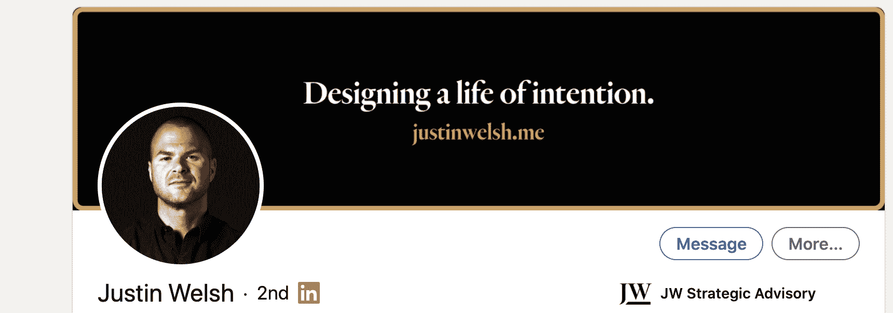
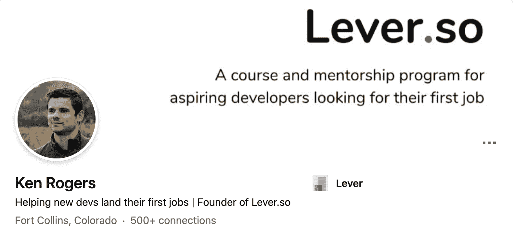

# 如何使用 LinkedIn 获得你的第一份开发工作——一步一步的指南

> 原文：<https://www.freecodecamp.org/news/linkedin-handbook-get-your-first-dev-job/>

LinkedIn 是一个爱或恨的平台。

有些人喜欢它是因为它提供的机会和它促进职业联系的便利性。

其他人讨厌它，因为它经常看起来好像有一个真正联系的外表，而实质主要是自我服务的网络。

事实上，这两个极端都有一定程度的真实性。

LinkedIn 不是一个神奇的解决方案，你可以创建一个帐户，然后立即被数百家急于向你砸钱的公司发现。

但它也不是整天发送垃圾连接请求的招聘人员和虚假网络的污水池。

不管你对这个平台有什么想法，现实是，如果使用得当，LinkedIn 为你提供了一个脱颖而出、获得关注和被聘用的绝佳机会，即使你没有专业经验。

关键在于正确使用*时*部分的那句话。

因此，今天我们将介绍一些策略，你可以利用 LinkedIn 获得至关重要的第一份工作。

我们将涵盖配置文件设置和连接/网络策略。这些将有助于你提高在招聘者和寻找开发者的雇主面前的知名度，并开始与能给你带来宝贵机会的业内人士建立关系。

我喜欢例子，所以我将用一个例子来引导你，就好像我是一个新的 React 开发人员，正试图得到我的第一份工作。

你可以根据自己的具体情况和目标来跟进。

## 如何设置您的 LinkedIn 个人资料

在 LinkedIn 上建立个人资料的主要目的是让合适的人更容易找到你，主要是招聘人员和雇主。

招聘人员并不是唯一在 LinkedIn 上寻找优秀候选人的人。可能没有招聘资源的小机构和其他小公司也使用 LinkedIn 来寻找优秀人才。

我们希望这两类人都能看到我们，这样当他们在寻找符合你技能的人时，他们就会找到你。

让我们来了解一下强大的 LinkedIn 个人资料的各个组成部分。

### 使用正确的关键词

一切都从关键词开始。你的关键词是你如何构建你的个人资料的内容。我们将在您个人资料中有意义的相关部分包含这些关键字。但是我们会确保保持可读性，这样你就不会听起来像个机器人，并且仍然吸引真正查看你的个人资料的人。

如果我想获得全栈 JS 开发人员的职位，我可能想包括的一些关键字可能是 React、GraphQL 和 Node。

我喜欢说得更具体一些，把我正在学习和想要使用的具体技术放进去，而不是像 JavaScript 那样说得太宽泛。

同时，这里有一个平衡。你也可以缩小搜索范围，把没有多少人会去搜索的东西放进去。

一个过于狭窄的例子可能是 Next、Firebase 和 Tailwind。这些都是非常具体的技术，有人专门搜索这些技术的可能性小于 React。

但是，了解 React 并能在基于 React 的几种不同堆栈中展示一些基本技能的人将会吸引某些人，即使他们使用的特定堆栈与您的特定堆栈不同。

我们在这里想要传达的主要内容是，你拥有使用你想要从事的特定技术的知识，同时传达你有能力学习他人的事实。

对于这个例子，我将使用 React、GraphQL 和 Node 作为我的关键字。

### 撰写您的介绍

您个人资料的简介部分由您的照片、标题、横幅图像、姓名、位置和您的 URL 组成。

它形成了人们对你和你的个人资料的第一印象，所以把它弄对是很重要的。让我们一次一个地浏览介绍部分的每个组件。

第一，三巨头。

只要你在 LinkedIn 上与任何人互动，或者出现在某人的 feed 中，前三个组件就会显示出来。

即使人们没有点击你的个人资料，他们也只会看到这些部分，所以要让他们有价值。

#### 你的名字

不言自明。使用你真实的名和姓。昵称是可以的，只要你在某个地方被雇佣时，你会用昵称。

如果可能的话，在你所有的个人资料和你的网站上保持一致，因为这可以加强你的在线形象的品牌方面。

例如:我的名字是肯尼斯·罗杰斯，但我的 LinkedIn 上显示的是肯·罗杰斯，因为这是我通常使用的名字，也是我在所有社交媒体个人资料上使用的名字。

#### 个人资料照片

您的个人资料照片是您个人资料的重要组成部分。

关于你是否应该在你的社交媒体档案中放一张你自己的照片，存在一些分歧。

有些人认为这会让看你个人资料的人产生不必要的无意识偏见。

虽然这可能是真的，但让我们看看另一种选择。

不管我们喜不喜欢，有一个空白的地方来放置你的照片看起来是不完整的。

所以无意识的偏见是不可避免的。不管我们喜不喜欢，这都是过程的一部分。

我认为拥有一张高质量的照片是一个更好的决定，不要把它留作空白，或者使用一些实际上不是你的东西。

对于照片，基本适用。

清晰、高质量的大头照，最好是微笑的，背景中性，不分散注意力。

如果你有能力这样做，请专业人士，但我意识到不是每个人都能做到这一点。

幸运的是，如今智能手机拥有惊人的功能。通过问一个知道他们在做什么的朋友，或者通过自己学习一点手机摄影，你可以拍出很棒的照片，给人一个好的第一印象。

如果有人在看了你的个人资料后见到你本人，他们会很容易认出你。没有宠物或家人，只有你的清晰头像。

#### 头条新闻

标题是你 LinkedIn 个人资料中最重要的部分之一。

尽管它很短，但它对你的搜索可见性和是否有人会点击了解你有很大的影响。

那么什么是好的标题呢？它需要同时吸引人类读者和 LinkedIn 搜索引擎。

这意味着在传达你到底在做什么(或想做什么)时，它需要清晰简洁。

有一件事我不建议做，那就是在你的个人资料中放入“年轻人”、“有抱负的”或“学生”这样的词。

如果你目前使用代码创建东西，你目前是一名开发人员，你可能没有正式的职称。

去掉任何表明你目前不是开发人员的语言。这不是撒谎，我们不会伪造任何你实际上没有的经历。

这是关于对你的能力和你自己有信心，称你自己是什么，一个开发者:用代码创造东西的人。

你的标题应该包括你的专长(你想从事的工作)和你独特的价值主张(你特别提到的)。

第一部分非常简单明了，但是作为一名全新的开发人员，您如何才能拥有独特的价值主张呢？

这可以简单到你希望你的专业是什么，或者你在过去的项目中完成的独特的事情。

你对可访问性感兴趣吗？你建立了一个包含可访问性的项目吗？这是帮助你脱颖而出的引人注目的标题的秘诀。

类似于“React 开发人员构建高度可访问的 web 应用程序”

我们已经有了一个关键词，如果你把可访问性作为一个关键词，可能有两个，它清楚地传达了你给公司带来的价值。

对于我的个人资料，我会选择“在 React 和 GraphQL 中构建优秀的用户体验”。

我想成为一名 React 开发人员，我对打造优秀的用户体验充满热情。

对你来说，这可能是干净的代码，经过良好测试的代码，等等。

选择你唯一关注的能为组织增加价值的事情。

这也不一定是技术性的。如果你来自一个利用了其他与发展相关的软技能的背景，那就把它整合进去。

假设你曾经在客户服务部工作，那么沟通是你的强项之一。

你可以把标题定为“构建有效解决客户问题的 React 应用程序”,因为你的沟通技巧可以让你清楚地了解客户的需求，而你所构建的工具可以很好地完成这项任务。

这里需要决定的是你希望标题的哪一部分放在开头。根据您使用的是移动设备还是桌面设备，只有前 65 到 80 个字符会显示在搜索结果和内容源中。

所以你需要决定你工作的哪个方面更重要，并把它放在第一位。

#### 横幅图像

定制您的横幅图像是另一个小细节，它传达了您花时间定制您的个人资料并真正关心它的外观。

您的横幅图像有两个选项。

如果你能找到一张库存照片或一张你拍摄的照片来传达你的一些信息，你可以利用它。

例如，我住在科罗拉多州，喜欢山区，所以我可能会选择山区照片。

它不一定要传达一些关于你的专业信息，但也不应该是泛泛而谈。

例如，不要使用写有代码的电脑图片，因为这不会让你与其他新开发人员有任何区别。

另一个选择是创建你自己的横幅图像，传达你的职业目标。

很多顾问都这样做，我也有类似的想法。

你可以使用 Canva 或在 Fiverr 上雇人来做这件事。

你可以把一些东西放在横幅上:

*   您所使用的技术的图标
*   另一张你的照片，上面有一张覆盖图和一些描述你能带来什么的文字

这里有几个例子:

在这里，贾斯汀强调了他的主要职业车手，并列出了他的网站。

如果你有一个特定的使命驱使你去编码，这是一个很好的例子。

正如你所看到的，横幅图像不一定要花哨或复杂，简单通常更好。

这是我的样子:

就我个人而言，我会选择第二种风格的横幅，在第一种风格上，你有一些描述你做什么的文字。它让你作为一个人更加清晰。

虽然如果你很难想出这样的东西，但一张仍然传达你的一些信息的漂亮图片比默认的要好。

#### 统一资源定位器

定制你的网址是其中的一个小细节，只需要 10 秒钟，却能为你的个人资料增添一点光彩。

将您的 URL 更改为您的姓和名的某种形式。如果有必要，你也可以加上姓名的首字母或其他形式。

例如，我通常使用肯·罗杰斯或肯尼·罗杰斯，但这两个名字都被采用了，所以我的网址是 https://linkedin.com/in/kennetharogers,，它同时使用了我的全名和中间名的首字母。

### 摘要

人们对摘要的最佳长度有不同的看法，但我个人倾向于推荐较短的摘要。

我注意到的一件事是，人们觉得他们需要把他们的整个生活故事放在他们的总结中，或者放在像他们的作品集网站 about page 这样的地方。

像网上写作一样思考你的网上资料。

在写作中，标题或引言的唯一目的是让读者阅读下一行。

你的 LinkedIn 标题和摘要的目标不是被录用，而是让浏览你个人资料的人有足够的兴趣采取下一步行动。那可能是在 LinkedIn 上给你发一个 DM，给你发一封电子邮件，或者访问你的投资组合网站。

这个求职过程应该以这种循序渐进的方式来看待。它有助于让您专注于每个组件的最佳用途，并避免人们过早地被过多的信息淹没。

那么我们如何将这一点应用到你的总结中呢？

你想把读者吸引到摘要的前两行，因为 LinkedIn 要求你点击“显示更多”按钮才能查看更多内容。

为了使它更容易写，我喜欢使用下面的结构:

*   钩
*   代表团
*   专业知识
*   证明
*   三醋酸纤维素

在钩子中，你想利用你身上独特而有趣的东西，打开一个只有通过进一步阅读才能闭合的循环。这就是你如何让读者阅读你的整个摘要。

我喜欢把我的背景和我为什么在这里从事编码的原因结合起来。你也可以暗示在这个过程中发生在你身上的一些事情，这些会在后面的总结中解释。

因此，如果我在我的例子中这样做，我可能会这样写:

“在我开发第一个 web 应用程序之前，开了一整天的叉车，花了很多个深夜编写代码。但当我这样做的时候，我了解到了一些自己意想不到的事情。”

这通过展示我有学习的动力并致力于此来抓住读者的注意力，简要提及我从头到尾已经建立了一些东西，并暗示我学到了一些东西，我们将在任务部分继续解释。

“我明白了为什么我真的喜欢编码。这个特殊的应用程序是为了解决我生活中的一个小问题，即坚持写日记，通过完成它，我意识到我从构建一些真实的东西中获得了巨大的满足感，这些东西让别人的生活变得更容易，只使用代码和我自己的努力。”

现在我们开始讨论我为什么要编码了。这比人们意识到的更重要。尽管一些公司努力做到这一点，但招聘并不是一个自动化、机器人化的过程。

人们会看你的个人资料，联系你，然后雇佣你。为了引起某人的注意，你需要在个人层面上建立联系。

现在，让我们深入探讨一下我们的专业知识，谈谈我们实际上是如何完成上面列出的“什么”和“为什么”的。

这是另一个你想使用你之前选择的关键词的地方。在这个例子中，我选择了 React、GraphQL 和 Node。考虑到这一点，我可以这样写我的总结的这一部分。

“我痴迷于使用 React、GraphQL 和 Node 解决复杂的问题，通过构建强调可访问性和可用性的 web 应用程序。”

这些东西谁都可以说，你也需要用证据来佐证。这意味着您需要使用本节中讨论的工具和概念构建一个或两个完整的项目。

我们一会儿就会谈到这一点，首先让我们用一个清晰的 CTA 来结束这一部分，这样读者就知道我们在寻找什么了。

“我目前希望将我的技能贡献给一个团队，在那里我可以证明我的技能，同时提高我的能力。如果你正在寻找一个有能力，有高度积极性的开发人员，让我们来聊聊。你可以在 email@example.com 找到我，或者在 LinkedIn 上注册我。”

这给人们一个明确的行动，并告诉他们你到底在寻找什么。

现在，关于我们谈论的那个证据。

我不只是在这里列出来，我喜欢包括链接到一两个项目的链接，也许是一篇展示你在这里写的属性的文章。

你可以利用“特色”部分。

### 作为特色的

特色版块很简单，但是很强大。

我在这里建议做的是链接到一两个与你在总结中列出的技能和品质相符的项目，或者一两篇同样的文章。

对于项目来说，不要只是链接到项目的实时版本或 GitHub 页面。你应该在你的作品集网站上有一个专门的页面，让读者了解你是如何以及为什么要建立这个项目。

建立投资组合网站超出了本指南的范围，但是我强烈推荐阅读 Josh Comeau 的关于建立伟大的投资组合网站的书。

### 经验

在没有任何经验的情况下，可以在经验部分放什么？

即使你的其他工作是在另一个领域，几乎总是有相关的经验可以利用。

学习如何交流，如何将你在其他领域学到的软技能应用到网站开发中，这一点至关重要。

我建议你看看这张几乎每个雇主都重视的技能清单。然后看看在你以前的工作中你必须利用其中的哪些，以及如何转化为一个好的开发人员。

一定要列出你获得的任何具体成就和奖励，以及展示这些技能的具体例子。

比如我以前是做服务器的，开铲车的，后来才成为开发者。

我必须经常使用的一系列技能是沟通和适应能力。

所以，让我们看看如何将它融入到我的经历中。

我可能会在我的服务器体验部分写下这样的内容:

“同时为多张桌子服务，同时确保他们点的菜正确无误，让客人满意。适应不断变化的需求，履行多种职责，如随着餐厅客流量的增加和减少而在多个班次中进行招待和接送。”

这是一个简单的例子，但它表明我能够在保持良好沟通和客户服务的同时承担多重责任，并且我适应性强，愿意帮助团队，即使这意味着做一份不一定是我主要职能的工作。

我看到很多人犯的一个错误是仅仅陈述他们有某些技能，而不是用例子来展示。这是做到这一点的一种方法。

如果你做过自由职业，你也可以把它作为相关的工作经历写在这里，如果你是用公司的名字，甚至是你自己的名字。

确保把重点放在交付给客户或雇主的结果上。如果可以，列出你完成的具体事情，以及这些事情如何为你工作的组织或个人带来价值。

### 教育

如果你受过正规教育或者参加过训练营，你可以把它放在这里。

除此之外，把你已经完成的课程作业放在这里。像 Udemy 课程或 freeCodeCamp 课程证书也应该包括在内。你参加过的任何结构化培训项目或课程都应该包含在教育部分。

### 技能

对于你的技能，我建议根据你选择的关键词选择前三名。这三个是最重要的，将用于过滤您的个人资料。

至于其他的，我更喜欢的经验法则是包括你用来构建一个完整项目的任何技能。

不要在这里列出你接触过的每一件科技产品，因为这是对雇主和招聘人员的一个微妙暗示，你渴望得到你能得到的任何工作。事实上，一个人精通那么多东西是不可能的。

### 推荐

如果你能得到他们，推荐是很好的。试着从你过去工作过的人那里获得推荐。

这些都不是必需的，因为获得它们取决于外部因素，但如果你能获得一个或两个。

## 如何扩大你在 LinkedIn 上的影响力

你已经确定了你的个人资料，现在是时候把它展示给大家了。

LinkedIn 的另一半正在恰当地使用它，以便结识合适的人，并作为对他们的组织有价值的人进入他们的雷达。

你已经有了正确创建个人资料的基础，现在你需要让尽可能多的人看到它。

您已经优化了您的个人资料，以利用 LinkedIn 的搜索功能，但您不希望在此过程中只是被动的。

你也想积极地站在正确的人面前。

这不会是什么尴尬的过程。我们大部分时间只是与人交流和发布内容。

你不需要发任何简历或者在 LinkedIn 上推销自己。

这是一个由两部分组成的过程:

1.  与人交流
2.  撰写引人注目的内容

### 如何在 LinkedIn 上与人联系

先说与人连接。

你希望对你联系的人有所了解。最好的方法是垂直连接。

大多数人把他们的社交网络的很大一部分集中在横向联系上。这意味着他们与和他们处于同一水平的人联系。

这没有错，我也不是说你不应该这么做。但是你的努力最好花在那些处于你想要的职位或者雇佣像你这样的人的人身上。

因此，一个好的开始是开始寻找你钦佩的公司，并希望为之工作，并开始与该公司的员工，目前做你想做的事情的人，以及该公司负责招聘的人联系。

当你这样做的时候，LinkedIn 会开始推荐相关的人来联系，让这个过程变得更加容易和快速。

我对连接请求消息有矛盾的感觉。一方面，我理解定制消息的价值，但另一方面，我实际上倾向于看到默认消息更好的接受率。所以我不再写自定义消息了。

这是你想要亲自体验的东西。

两种方法都试试，看看哪种更适合你。对于您的自定义消息，保持简单，并说你是一个新的开发人员，希望与业内其他人联系。

就是这样。你现在不需要发一条个人 DM 或者试图和他们建立友谊。你只是想扩大你的关系网，增加你的知名度。这种长期的联系将以创造有价值的、有趣的内容的形式出现。

### 如何写出好的内容并在 LinkedIn 上分享

那么，如何在 LinkedIn 上写出引人入胜的内容，让人们想更多地了解你呢？

我最喜欢的方法是做一个项目，写下我在你的过程中学到了什么，但是——这是一个重要的区别——从老师/权威的角度来写。

我的意思是，不要写“我今天学到了这个”，而要写“这是怎么做的。”

LinkedIn 更适合高层次、概念性的内容，而不是过于技术性的内容。

所以写你正在学习的高层次的课程，而不是技术本身。

比方说，我正在用 Gatsby 做一个项目，经过一番努力，我想出了如何把它变成 PWA，而不需要遵循教程，只需要文档。

我可能会按照以下思路写一篇文章:

> “今天，我成功地把我的盖茨比网站变成了一个渐进式网络应用程序，而没有遵循任何教程。教程和课程很棒，但真正的学习发生在我们努力实现自己的解决方案，处理过程中不可避免的错误和挫折的时候。
> 
> 无论何时，当你正在努力解决一个问题，努力想出一个解决方案时，要知道这种努力是你的大脑适应新环境和学习的过程。
> 
> 这是真正成长的地方。”

您希望您的内容传达这样一个事实，即您每次构建东西时都在学习，并且您一直在探索成为开发人员的最佳方式，并与他人分享这些见解。

这让人们对你的思维方式和你将成为什么样的开发人员有了很好的了解。

通过持续不断地创建这样的内容，并让它出现在你有意建立的联系面前，你可以开始为自己建立一个档案，这将有助于你在其他新开发者中脱颖而出。

慢慢地，你会开始有对雇佣你感兴趣的人来找你。然后，当你开始看到这些公司出现职位空缺时，你就已经作为一个有能力的人出现在他们的雷达上了。

想出好内容的关键是学会在任何地方看到灵感。当你浏览 Twitter、做项目、阅读文章、听播客等等时，开始写下你的内容灵感和想法。

然后，每周留出一些时间来写你这一周的内容，并尝试每天发布一篇新内容。

## 包扎

通过遵循这些步骤，你将大大增加在 LinkedIn 上被发现的机会，并与业内人士建立新的关系。

这不是灵丹妙药，但它是强有力的求职策略的一部分，也是寻找第一份工作时的一个重要难题，这可能非常具有挑战性。

对于路线图的其余部分， [Lever.so](https://lever.so) 可以提供帮助。这是一个循序渐进的课程和指导社区，旨在帮助新开发人员找到他们的第一份工作，无论经验或教育程度如何。