# 黑客的 Linux 网络安全初学者的基础

> 原文：<https://www.freecodecamp.org/news/linux-basics/>

是时候学习如何使用普通黑客的操作系统了🐧。

在本文中，我们将对以下几个方面进行简单的了解:

*   Linux 操作系统
*   包装管理
*   Linux 文件结构
*   命令行界面

您还可以学习如何更新您的 Linux 发行版。我们走吧。🙃

## 什么是 Linux？


Hacker Penguins | Credit: Wallpaperflare.com

Linux [内核](https://www.redhat.com/en/topics/linux/what-is-the-linux-kernel)是由 Linus Torvalds 在 1991 年创建的。使它成为[操作系统](https://www.freecodecamp.org/news/what-is-an-os-operating-system-definition-for-beginners/)的是内核的附加组件，比如包管理器、桌面环境、外壳和引导装载程序，以及其他组件。

因为 Linux 是开源的，所以对操作系统做了很多定制。每个特定的定制组合简称为发行版。

世界上即使没有上千个发行版，也有上百个。它们中的每一个都是为了特定的目的而优化的，或者仅仅是为了像你我这样的人的乐趣。

一些著名的发行版有:

1.  [Ubuntu](https://en.wikipedia.org/wiki/Ubuntu) (最常见)
2.  [初级 OS](https://en.wikipedia.org/wiki/Elementary_OS) (最美之一)
3.  Debian (整洁优雅)
4.  [Arch Linux](https://en.wikipedia.org/wiki/Arch_Linux) (针对 Linux 大佬)
5.  [红帽企业版 Linux](https://en.wikipedia.org/wiki/Red_Hat_Enterprise_Linux) (商业且昂贵💰)

## Linux 和黑客有什么关系？


A Guy Fawkes mask on a keyboard | Credit: Wallpaperflare.com

Linux 是许多黑客选择的操作系统。你可能会问，为什么？因为它是开源的，不容易受到恶意软件的攻击，轻量级，可移植，并且非常兼容多种黑客工具。

Windows 是一个有点封闭的系统，所以它不允许黑客做很多事情。Mac OS 也不是很好，因为有很多专有软件。Linux 有许多发行版可供选择，并且大多数可以按照用户的意愿进行修改，没有任何限制。

黑客常用的发行版有 Kali Linux、Parrot、BlackArch 和 Archstrike。但是不要止步于此，选项是无限的。

正如我前面提到的，Linux 也是高度可定制的。这个特性的一个很好的例子是桌面环境，这是一个关于桌面外观的有趣的名字。

在 Windows 中，有基本的任务栏、开始菜单和带有图标的背景。很好的一点是，你可以做一些小小的修改，而且每一个新的 Windows 版本都会有不同的感觉，尤其是 Windows 11。但是，当谈到桌面的真实外观和感觉时，与 Linux 社区取得的巨大进步相比，微软的步伐显得苍白无力。

常见的桌面环境包括:

1.[侏儒](https://en.wikipedia.org/wiki/GNOME)(最好😎)
2。 [KDE 等离子](https://en.wikipedia.org/wiki/KDE)(一个 Windows 分身)
3。 [Xfce](https://en.wikipedia.org/wiki/Xfce) (针对极客)
4。 [Mate](https://en.wikipedia.org/wiki/MATE_(software)) (硬件资源高效)

如果您对编程感兴趣，您可以在 GNU 许可下发布的当前桌面环境上构建，或者开发您自己的桌面环境来满足您的需求。

提示:如果你完全不熟悉 Linux，你可能想在替换你的默认操作系统之前再等等。许多用户习惯于使用 GUI(图形用户界面)来执行活动。但是 Linux 用户更倾向于使用 CLI(命令行界面)。这仅仅是因为 Linux 是面向开发者和科学家的，而不是普通用户。

我个人建议你在 VirtualBox 这样的[管理程序](https://www.redhat.com/en/topics/virtualization/what-is-a-hypervisor)上安装一个 Linux 发行版，并练习习惯它。(我并不建议使用 VMware，因为在撰写本文时它有一个已知的漏洞)。如果你不知道如何安装 Linux，你可以在这里学习它[。](https://www.freecodecamp.org/news/how-to-install-kali-linux/)

## Linux 包管理


Colourful Packages | Credit: Wallpaperflare.com

Linux 与其他操作系统有很大不同，这意味着安装应用程序也不同。短版？您将通过CLI(终端)从发行版应用商店下载应用。现在是长版本。

**。exe** 和**。msi** 安装程序(用于在 Windows 中安装应用程序)在 Linux 中并不太好用。因此，一个发行版的管理者拥有为该发行版优化的多个应用程序的服务器。

通过您在终端中输入的一些命令，以及软件包管理器的帮助，您的电脑可以连接到服务器，下载应用程序并安装它们。您也可以通过这种方式获得系统更新。

软件包管理器是用于管理下载和安装的软件的软件。您可能至少听说过以下软件包管理器之一:

1.  Apt (Linux)
2.  巧克力(Windows)
3.  MacPorts (MacOS)
4.  Pip (Python)
5.  Javascript 语言
6.  度(Java)
7.  作曲者(PHP)

一些。exe 和。msi 安装程序可以在 Linux 计算机上工作，但是有一个问题。一款名为 Wine 的软件在发行版中增加了一个 Windows 兼容层，以优化 Windows 应用程序。不幸的是，这并不适用于所有的应用程序。

另一个选择是安装 Steam，或者更好的是，如果你是一个对 Linux 有天赋的游戏玩家，安装 SteamOS🎮。

## Linux 文件结构


Folders | Credit: Wallpaperflare.com

Linux 操作系统和 Windows 一样有一个目录树。在最顶部(或者底部，取决于你的视角)，我们有“/”文件夹。这就像 Windows 中的 C: drive。它包含了你所有的目录、文件和应用程序。下面是其他文件夹，在下面的图片中进行了总结

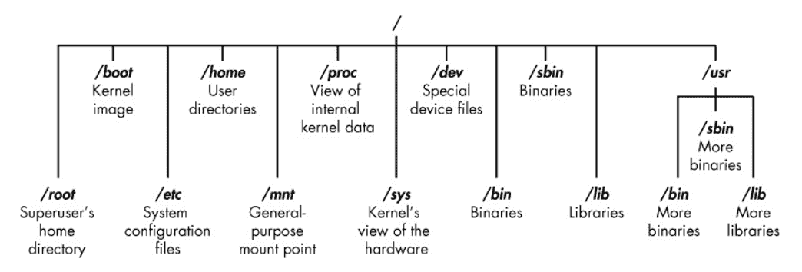

The Linux file structure | Credit: Hackers-arise.com

需要注意的一些重要目录是:

1.  /bin:二进制或可执行程序(保存持久脚本的好地方)
2.  /etc:系统配置文件(获取凭证的好地方)
3.  /home : home 目录(打开终端时默认的当前目录)
4.  /opt:可选或第三方软件
5.  /tmp:临时空间，通常在重新启动时清除(存储枚举脚本的好地方)
6.  /usr:用户相关程序
7.  /var:日志文件(挫败法医分析师的最佳场所)

还有很多关于 Linux 文件结构的内容，可能值得写一篇自己的文章，但是现在这样就够了。

现在让我们在终端中获得更多的实践经验，并运行每个黑客都应该知道的一些基本命令。

## Linux Shell 简介

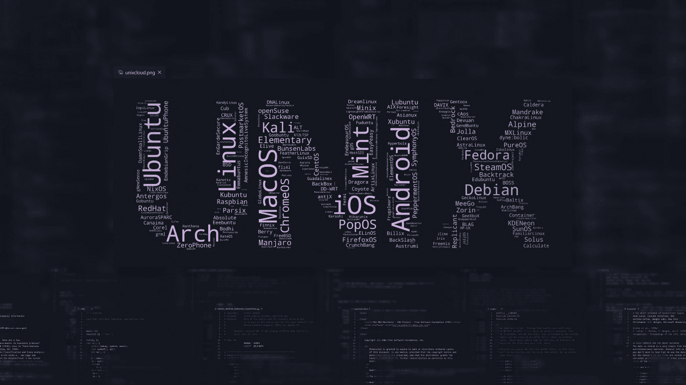

Unix and its various derivatives | Credit: Wallpaperflare.com

shell 是一个基于文本的界面，用于控制 Linux 计算机。类似于微软的 Powershell 或 cmd，它是用户和内核之间的接口，除了 GUI(图形用户界面)。

有各种类型的炮弹，每一种都是在以前的基础上改进而成，或为某一特定目标而优化。

黑客经常使用 Shells，因为它们是向计算机传递指令的最快、最有效的方式。GUI 很好，但是可能相当有限，因为有些特性不能以图形方式访问，或者您想要使用的工具没有图形界面。

一些常见的外壳包括:

1.  《谍影重重》
2.  GNU-Bourne 再次外壳(bash)
3.  Z 外壳(zsh)
4.  C 壳(csh)
5.  Korn shell (ksh)

快速经验:在网络安全领域和本文中,“终端”和“外壳”这两个词可以互换使用。但是，它们是不同的。终端是让您通过图形界面访问 shell 的**程序**。

## 基本 Linux Shell 命令

在本文中，我们将浏览以下命令: `whoami, pwd, ls, cd, touch, cat, nano, operators, mv and cp, mkdir, rm and rmdir, stat, echo, grep,`‘help’标志和`man`页面。

你将需要任何你选择的 Linux 发行版，尽管我建议你使用 Kali。如果你不知道如何安装一个，你可以[看这篇文章](https://www.freecodecamp.org/news/how-to-install-kali-linux/)。

打开名为“终端”的应用程序，让我们开始。我们继续吗？🙃

### 如何使用`whoami`命令

您可以使用这个命令来检查您是哪个用户。在个人电脑上，您很可能只有两个帐户:一个是在安装操作系统时创建的，另一个是 root。如果你是以普通用户(账号)的身份在终端，可以尝试一下。

```
whoami
```

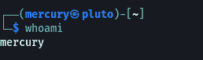

whoami | Credit: Mercury

如果你想成为超级用户，运行命令 *sudo su* 并输入你的密码。试试`whoami`，终端会告诉你 root:

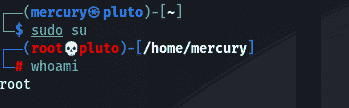

whoami as root | Credit: Mercury

企业计算机倾向于在一台计算机上有许多用户。正如我在[前一篇文章](https://www.freecodecamp.org/news/what-is-hacking/)中所说，每个人都有不同的[权限](https://www.howtogeek.com/school/windows-network-sharing/lesson1/)，有些比其他人多。当您在利用后获得初始访问权限时，您通常从标准帐户开始。如果您想检查受威胁帐户的名称，请使用此命令。

### 如何使用`pwd`命令

当前工作目录(`pwd`)命令告知你当前在目录树中的位置。默认情况下，这通常是主目录。

```
pwd
```

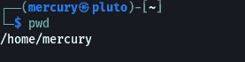

Present Working Directory | Credit: Mercury

如果你是一个初学者，迷失在目录树中，突然不知道自己在哪里是很正常的。这个命令帮助你跟踪事物。

根据您的发行版，当您打开终端时，您可能会看到一个`~`符号。这是用户默认主目录的符号。它就像 Windows 中的`C:\Users\<default_user>`文件夹，包含所有用户特定的文件。在 Linux 中，它将作为上面的格式`/home/<default_user>`。

### 如何使用`ls`命令

您可以使用`ls`命令列出一个目录的内容。它让你不用图形用户界面就能知道目录里有什么文件。

当与旗帜一起使用时，它是一把瑞士军刀，以各种方式显示目录中的内容。

您可能需要注意的常见标志有`-l`(长列表)、`-a`(也就是显示隐藏文件)和`-c`(显示最近修改的文件)

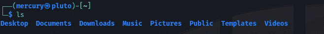

Listing | Credit: Mercury

标志是应用程序/工具的特性，允许你告诉它们做什么。让我们看一下`ls`的`-l`标志作为例子。长列表是一个特征，可通过命令`ls -l`激活。

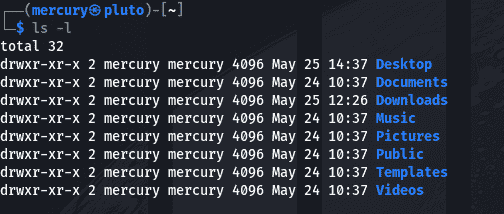

Long listing | Credit: Mercury

如你所见，带着旗帜运行`ls`不同于普通的老式`ls`。我将在另一篇文章中解释额外的细节，或者您也可以自己研究它们是什么。

### 如何使用`cd`命令

你使用改变目录(`cd`)命令来遍历整个目录树。

```
cd <directory>
```


Changing directory | Credit: Mercury

如果你运行命令`ls -a`，你会注意到无论文件夹是什么，都有两个文件始终存在:`.`和`..`。`.`文件代表当前目录，`..`文件代表**父目录**(当前目录之上的目录)。

### 如何使用`cat`、`more`和`less`命令

上面所有的命令都是输出命令。您使用它们向终端显示文件的内容。

但是这里有显著的不同。`cat`通常用于包含少量文本的文件。`less`和`more`可能用于有大量文本的文件，可以用箭头键控制输出。

```
cat <file_name>
more <file_name>
less <file_name>
```

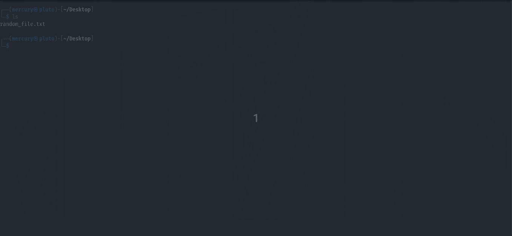

cat vs more vs less | Credit: Mercury

你会注意到`cat`将输出直接打印到你的终端，而`more` 和`less`允许你使用箭头键。输出命令用于从受损系统收集信息和凭据。

### 如何使用`touch`命令

您可以使用 touch 命令来创建文件。您可以通过多种方式写入这些文件，比如使用文本编辑器或通过管道向其中输入内容(稍后将详细介绍)。

您可以使用以下语法创建文件:

```
touch <file_name>
```

然后，您可以使用`ls`命令来检查您的文件是否已经创建。

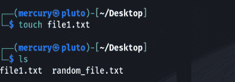

Creating a file | Credit: Mercury

### 如何使用`nano`命令

Nano 是 Linux 中一个流行的内置文本编辑器。它非常常见，因为它易于使用，并且在许多 CLI 环境中受支持。其他常见的文本编辑器有 Vim(非常烦人😫)和 gedit(像记事本一样简单🙃).

您可以使用以下命令编辑文件:

```
nano <file_name>
```

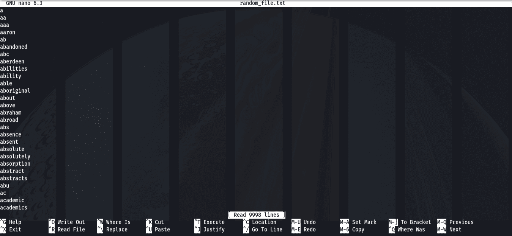

The nano interface | Credit: Mercury

Nano 界面下有一些命令可以帮助你。'^'仅仅意味着 Ctrl 键和“m”键是 Alt 键。'^S'(或者在这种情况下是 Ctrl + S)用于在你写完东西后保存文件。黑客使用 nano 命令来更改文件中的信息，编辑日志，或者如果你是一个[红帽黑客](https://www.freecodecamp.org/news/white-hat-black-hat-red-hat-hackers/)，删除必要的配置文件行。

### 命令链运算符

“链接”命令是将多个命令编写在一起并以多种方式执行它们的概念。您通常使用特殊字符来实现这一点。例子包括:

1.  &符号( *&* ):在后台运行程序
2.  逻辑与( *& &* ):只有在前一个命令成功运行的情况下，下面的命令才会运行
3.  管道( *|* ):前一个命令的输出作为下一个命令的输入
4.  Overwrite(>):用前一个文件的输出覆盖文件的内容
5.  Append(> >):将前一个命令的输出追加到文件中

如果你不明白所有这些是如何工作的，不要担心。它们通常与我将在本文后面提到的其他命令一起运行。

### 如何使用`mv`和`cp`命令

这是两个非常相似的命令，但有显著的区别。您使用`mv`将文件移动到另一个位置。您使用`cp`将文件复制到另一个位置。

```
mv <file_name>
cp <file_name>
```

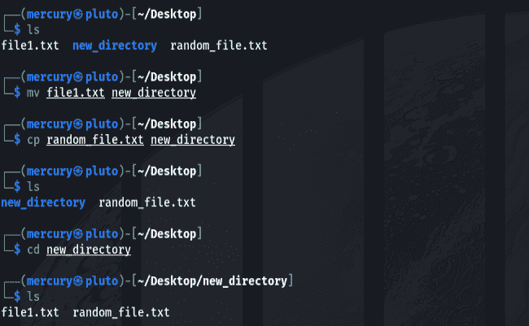

Examples of cp and mv | Credit: Mercury

在 Linux 中没有重命名文件的命令，所以大多数人通过以下语法使用`mv`命令:

```
mv <original_file_name> <new_file_name>
```

自己试试，感受一下。

### 如何使用`mkdir`命令

`mkdir`命令创建目录。您可以使用它来创建一个自定义目录，只有您可以在受损的系统上访问该目录，以保存脚本或工具来实现持久性。

```
mkdir <directory>
```

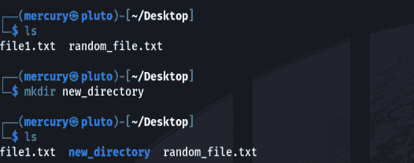

Making a new directory | Credit: Mercury

### 如何使用`rm`和`rmdir`命令

你也许可以自己解决这个问题。`rm`是删除文件的命令，`rmdir`是删除目录的命令。

```
rm <file_name>
rmdir <directory>
```

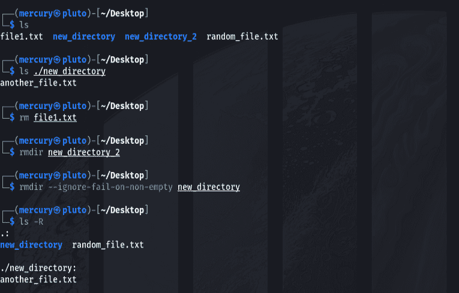

rm, rmdir and rmdir with the ignore-fail-on-non-empty flag | Credit: Mercury

如果文件夹不是空的，Linux 并不热衷于删除它们。为了解决这个问题，使用`ignore-fail-if-non-empty`标志删除文件和目录。

请注意，您需要非常小心地使用这些命令，因为它们不会将删除的文件或目录发送到回收站。他们就这么走了。

### 如何使用`stat`命令

您可以使用 stat 命令给出有关文件的信息。

```
stat <file_name>
```

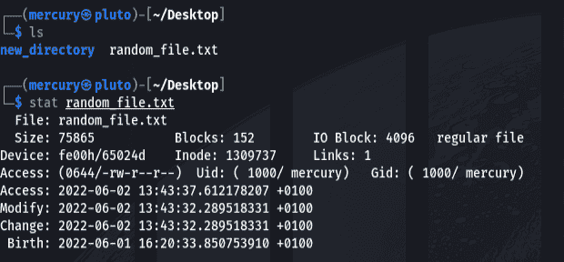

stat | Credit: Mercury

您可以收集关于文件名和扩展名、权限、创建时间、修改时间、上次访问时间等信息。

现在是学习权限的好时机。如果您运行命令`ls -la`或`stat`，您可能会看到如下内容:drwxrwxrwx。我们来分解一下。

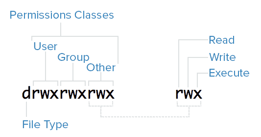

Permissions demystified | Credit: unix.stackexchange.com

read (r)权限允许您查看文件的内容，write (w)权限允许您修改文件，execute (x)权限允许您在文件是脚本或可执行文件时将其作为进程运行。

有 3 类用户可以访问文件:用户、组和其他用户。root 帐户是另一个类，但在这里被免除了。

每个“rwx”集由一个权限类拥有。如果空间读取一个字母，则 set 拥有该权限。如果它有破折号，则他们没有权限。

前面的 d 呢？它表示它是目录还是文件。“d”表示它是一个目录，如果它是一个破折号(-)，它就是一个文件。尽管从技术上讲，目录是一种特殊类型的文件。但那是以后的事了。

### 如何使用`echo`命令

您使用`echo`命令打印出输入。我们用一个例子把事情说清楚。

```
echo "<text>"
```

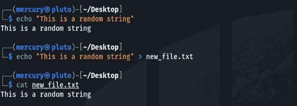

如您所见，您可以使用带有>操作符的`echo`将文本写入文件。

### 如何使用`grep`命令

让我们更上一层楼。使用管道操作符，使用`grep`命令从文件中提取指定的文本。

```
grep "<text>"
```

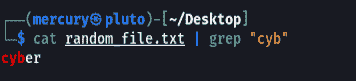

grep | Credit: Mercury

上面的命令并不像看起来那么复杂。我们告诉计算机打印一个文件的内容，并使用管道操作符，告诉`grep`命令使用它作为输入。这被称为**管道**一个命令通过另一个命令，可以做多次。找到的文本以红色显示。

`grep`通常用于在大文件中查找某些文本。一个实际的例子是，如果您在一个包含大量文本的文件中查找特定用户的凭据。您可以使用`grep`来查找诸如“密码”、“登录”之类的词，以及您认为会出现在您正在查找的凭证周围的其他关键字。

### 如何使用“帮助”标志和手册页

最后一个是“help”和`man`。“帮助”标志不一定是一个命令，但如果你对一个应用程序或工具感到困惑，它是一个很好的帮助。只需使用以下代码:

```
<app or tool> --help
```

这将获得快速，咬大小的信息。另一方面，`man`给你所有关于这个应用程序的文档信息。

```
man <app>
```


help vs man | Credit: Mercury

你可能注意到了，在 gif 中，我用了`-h`。那是因为它是国旗的简称。一些旗帜有简短的形式。如果它以一个破折号开始，那是短格式。如果它以两个破折号开始，它是长的形式。

## 如何更新你的 Linux

这整个部分实际上可以用一个命令来完成，但是让我们把它分解一下来理解整个事情。任务:更新你的操作系统。为了实现目标，你需要做两件事。

1.  更新本地存储库信息:就像在实际下载和安装之前检查更新一样。
2.  升级系统:正如它所说，我们下载更新，然后安装更新。

要运行的第一个命令是:

```
sudo apt update
```

*   sudo: 表示我们正在以更高的权限运行命令
*   apt: 包管理器
*   更新:告诉计算机更新其关于存储库的本地信息

在你输入这个命令后，你输入你的密码，瞧。正如您将观察到的，您的计算机将从存储库中下载关于要更新哪些包(应用程序)的信息。

我已经更新了我自己的，所以它看起来像下面的。但是如果这是你的第一次，它应该需要几分钟。

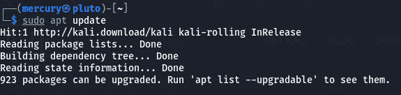

sudo apt update | Credit: Mercury

完成后，您可以运行下一个命令来下载并安装更新:

```
sudo apt full-upgrade
```

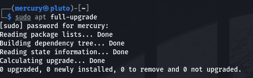

sudo apt full-upgrade | Credit: Mercury

注意:你可以中断软件包下载过程，但是**永远不能中断安装过程**。这可能会破坏您的操作系统，使其无法使用。

在升级过程中，您可能会注意到一些异常情况，如下所示:

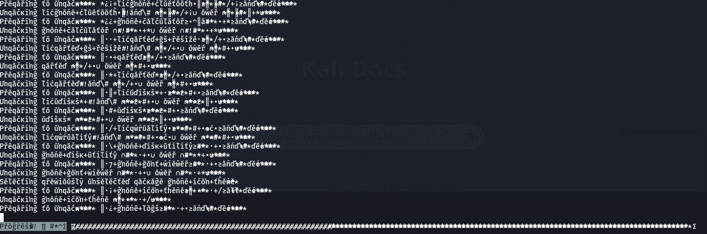

Scrambled upgrade | Credit: Mercury

别担心，你的电脑不会在你面前爆炸或发生任何事情😂。只是一个 bug。升级安装完成后，您需要重新启动计算机。这将允许您的笔记本电脑完全实现所有更新。


My personally customised desktop | Credit: Mercury

恭喜🎉。您已经成功更新了您的系统。还记得我说过所有这些都可以通过一个命令来完成吗？在这里。👀

```
sudo apt update && sudo apt upgrade -y && reboot
```

放松点，这并不像看起来那么复杂。一点一点看代码。唯一不熟悉的部分是`&&`符号。

正如我前面提到的，它们是逻辑 AND 运算符。这只是告诉计算机运行前面的第一个命令，结束，然后执行后面的命令。`-y`标志告诉计算机在没有用户输入的情况下执行升级。

所以上面的命令告诉计算机首先更新，然后升级，最后重启。很简单，对吗？😎

## 结论

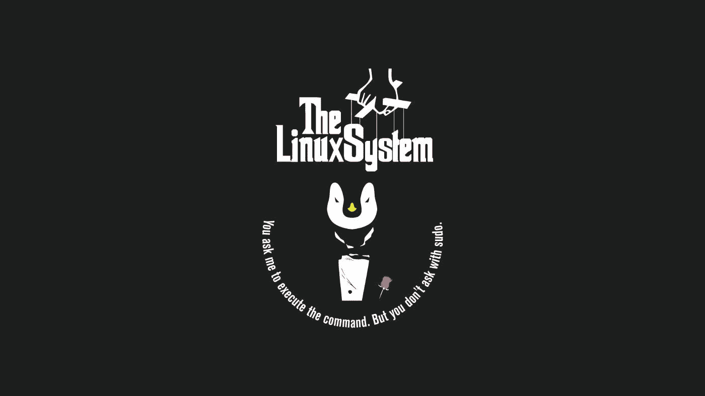

Tux the Godfather ¦ Credit: Wallpaperflare.com

让我们快速回顾一下您所做的工作:

1.  我们已经参观了 Linux 操作系统
2.  我们已经学习了 Linux 中的包管理
3.  我们已经回顾了 Linux 文件结构
4.  我们已经在命令行界面上运行了一些命令

就此而言，我们已经到了这篇文章的结尾。我希望你喜欢它。正如我常说的，祝你黑客生涯愉快！🙃

### Linux 资源

1.  你可以[在这里](https://www.geeksforgeeks.org/chaining-commands-in-linux/)阅读更多关于链接命令的信息
2.  这里有一个关于包管理的精彩视频。
3.  这里有一个对 Linux 文件结构的[快速介绍。](https://www.geeksforgeeks.org/linux-directory-structure/)

### 承认

感谢 Anuoluwapo Victor、 [Chinaza Nwukwa](https://www.linkedin.com/in/chinaza-nwukwa-22a256230/) 、 [Holumidey Mercy](https://www.linkedin.com/in/mercy-holumidey-88a542232/) 、[favor Ojo](https://www.linkedin.com/in/favour-ojo-906883199/)、 [Georgina Awani](https://www.linkedin.com/in/georgina-awani-254974233/) 以及我的家人，感谢他们给予我灵感、支持和知识，让我完成了这篇文章。你们太棒了。