# Linux chmod 和 chown——如何在 Linux 中更改文件权限和所有权

> 原文：<https://www.freecodecamp.org/news/linux-chmod-chown-change-file-permissions/>

Linux 是一个多用户操作系统，这意味着它同时支持多个用户。

由于许多人可以同时访问系统，并且一些资源是共享的，Linux 通过所有权和权限来控制访问。

## Linux 文件所有权

在 Linux 中，有三种类型的所有者:`user`、`group`和`others`。

### **Linux 用户**

用户是文件的默认所有者和创建者。所以这个用户也被称为所有者。

### **Linux 组**

用户组是用户的集合。属于一个组的用户将拥有相同的 Linux 组权限来访问文件/文件夹。

您可以使用组来批量分配权限，而不是单独分配。一个用户也可以属于多个组。

### **其他**

不属于用户或组类的任何用户都属于该类。

## Linux 文件权限

文件权限分为三类:`read`、`write`和`execute`。

### **读取权限**

对于常规文件，读取权限只允许用户打开和读取文件。用户不能修改该文件。

类似地，对于目录，读取权限允许在不修改目录的情况下列出目录内容。

### **写权限**

当文件具有写权限时，用户可以修改(编辑、删除)文件并保存它。

对于文件夹，写权限使用户能够修改其内容(创建、删除和重命名其中的文件)，并修改用户具有写权限的文件的内容。

### **执行权限**

对于文件，执行权限允许用户运行可执行脚本。对于目录，用户可以访问它们，并访问目录中文件的详细信息。

下面是用户、组和其他人的权限的符号表示。

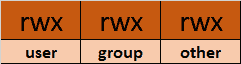

Symbolic representation of permissions

注意，我们可以在 Linux 终端上使用长列表(`ls -l`)找到文件和文件夹的权限。

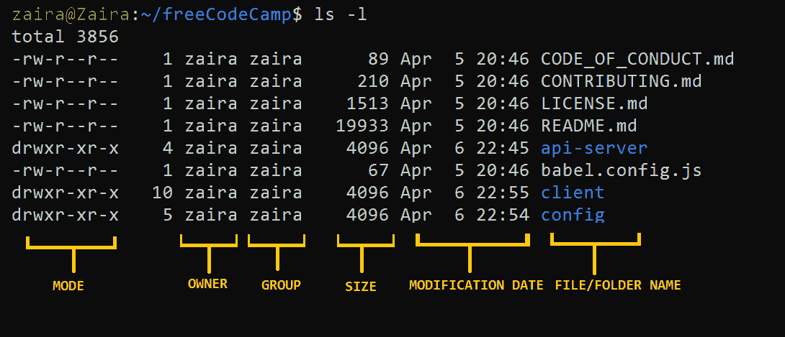

Output of long listing

在上面的输出中，`d`代表一个目录，`-`代表一个常规文件。

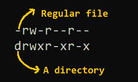

## **如何在 Linux 中使用`chmod`命令**更改权限

现在我们知道了所有权和权限的基本知识，让我们看看如何使用`chmod`命令修改权限。

**`chmod`的语法:**

```
chmod permissions filename
```

在哪里，

*   `permissions`可以是读、写、执行或它们的组合。
*   `filename`是需要更改权限的文件的名称。如果文件要批量更改权限，此参数也可以是一个列表。

我们可以使用两种模式来更改权限:

1.  **符号模式**:该方法使用`u`、`g`、`o`等符号来表示用户、组等。权限分别表示为读写和执行的`r, w, x`。您可以使用+、-和=来修改权限。
2.  **绝对模式**:该方法将权限表示为 0-7 的 3 位八进制数。

现在，让我们详细地看看它们。

### 如何使用符号模式更改权限

下表总结了用户代表性:

| 用户表示 | 描述 |
| --- | --- |
| u | 用户/所有者 |
| g | 组 |
| o | 其他的 |
|  |  |

我们可以使用数学运算符来添加、删除和分配权限。下表显示了摘要:

| 操作员 | 描述 |
| --- | --- |
| + | 向文件或目录添加权限 |
| – | 移除权限 |
| = | 如果以前没有权限，则设置权限。如果之前设置了权限，也会覆盖这些权限。 |
|  |  |

#### 示例:

假设，我有一个脚本，我想让它对文件`zaira`的所有者是可执行的。

当前文件权限如下:

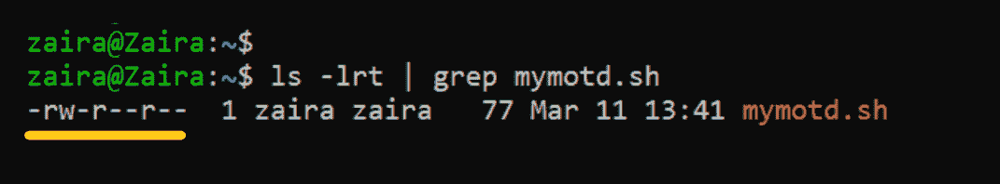

让我们像这样划分权限:

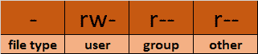

要使用符号模式将执行权限(`x`)添加到所有者(`u`)中，我们可以使用下面的命令:

```
chmod u+x mymotd.sh
```

**输出:**

现在，我们可以看到已经为所有者`zaira`添加了执行权限。

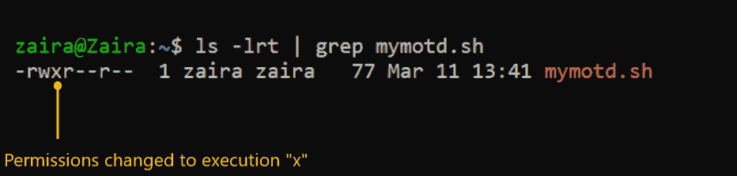

**通过符号方法更改权限的其他示例:**

*   取消`group`和`others` : `chmod go-rw`的`read`和`write`权限。
*   正在删除`others` : `chmod o-r`的`read`权限。
*   将`write`权限分配给`group`并覆盖现有权限:`chmod g=w`。

### 如何使用绝对模式更改权限

绝对模式使用数字来表示权限，使用数学运算符来修改权限。

下表显示了我们如何分配相关权限:

| 许可 | 提供许可 |
| --- | --- |
| 阅读 | 添加 4 |
| 写 | 添加 2 |
| 执行 | 添加 1 |
|  |  |

可以使用减法来撤销权限。下表显示了如何删除相关权限。

| 许可 | 撤销许可 |
| --- | --- |
| 阅读 | 减去 4 |
| 写 | 减去 2 |
| 执行 | 减去 1 |
|  |  |

**举例**:

*   为`user`、`read`(加 4)、组`execute`(加 1)设置`read`(加 4)，其他只设置`execute`(加 1)。

`chmod 451 file-name`

我们是这样进行计算的:

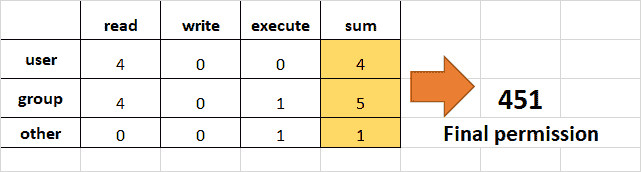

注意这和`r--r-x--x`是一样的。

*   取消`other`和`group`的`execution`权限。

要删除`other`和`group`的执行，从最后 2 个八位字节的执行部分减去 1。

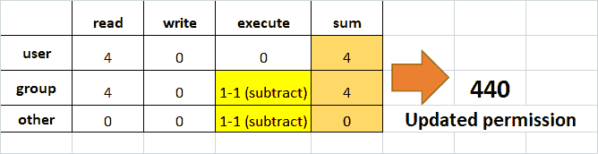

*   将`read`、`write`和`execute`分配给`user`、`read`和`execute`分配给`group`，其他人只分配`read`。

这将与`rwxr-xr--`相同。

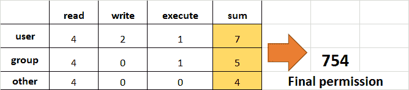

## 如何使用`chown`命令改变所有权

接下来，我们将学习如何更改文件的所有权。您可以使用`chown`命令更改文件或文件夹的所有权。在某些情况下，改变所有权需要`sudo`权限。

`chown`的语法:

```
chown user filename 
```

### 如何用`chown`改变用户所有权

让我们将所有权从用户`zaira`转移到用户`news`。

`chown news mymotd.sh`

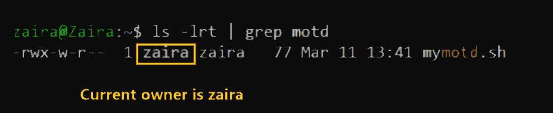

改变所有权的命令:`sudo chown news mymotd.sh`

**输出:**

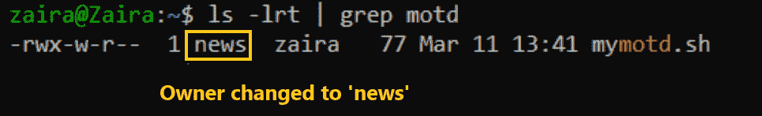

### 如何同时更改用户和组的所有权

我们也可以使用`chown`同时改变用户和组。

```
chown user:group filename
```

### 如何更改目录所有权

您可以递归地更改目录中内容的所有权。以下示例更改了`/opt/script`文件夹的所有权，以允许用户`admin`。

```
chown -R admin /opt/script
```

### 如何更改组所有权

如果我们只需要更改组的所有者，我们可以在组名前面加上冒号`:`来使用`chown`

```
chown :admins /opt/script
```

## Linux 权限指导练习

到目前为止，我们已经探索了权限、所有权以及改变它们的方法。现在，我们将通过引导练习来巩固我们的学习。

**目标**:创建群组并为其成员分配相关权限。通过未经授权的用户访问来验证访问权限。

**任务**:创建一个名为`dev-team`的组，并向其中添加两个成员(约翰和鲍勃)。创建一个文件夹`/home/dev-team`并将所有权更改为组`dev-team`。验证`dev-team`组中的两个用户都具有对该文件夹的*读*和*写*访问权限。

创建另一个组`project-manager`，并向其中添加一个用户`Fatima`。验证文件夹`/home/dev-team`是否可以被`Fatima`访问。

### 问题的可视化

我们可以这样想象这个问题:

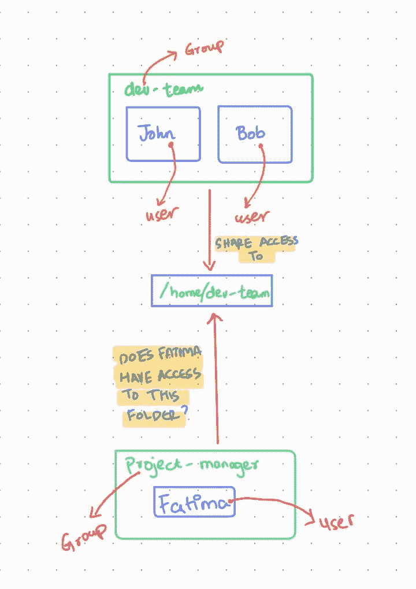

**第一步:切换到 root 用户。**
切换到 root 用户，这样我们就有权限创建新的用户和组。

<details><summary>Show hint</summary>

使用带有标志`i`的`sudo`命令。

如果您有 root 密码，也可以使用该密码登录。</details> <details><summary>Show solution</summary>

输入`sudo -i`切换到 root 用户。

输入`whoami`确认您是否是 root 用户:

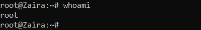

如果您没有`root`访问权限，请使用附加了`sudo`的命令。</details> 

* * *

**第二步:创建群组`dev-team`**

<details><summary>Show hint</summary>

使用`groupadd`命令。

语法:`groupadd group-name`</details> <details><summary>Show solution</summary>

输入`groupadd dev-team`创建`dev-team`组

验证:`cat /etc/group | grep dev-team`</details> 

* * *

**步骤 3:创建两个新用户约翰和鲍勃，并将他们添加到`dev-team`组**

<details><summary>Show hint</summary>

使用命令`useradd`。

`useradd`创建新用户并添加到指定组。

语法:`useradd -G groupname username`

其中`-G`指定组。</details> <details><summary>Show solution</summary>

`useradd -G dev-team John`

`useradd -G dev-team Bob`

验证:`cat /etc/group | grep dev-team`

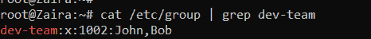</details> 

* * *

**步骤 4:为用户 John 和 Bob 提供密码**

<details><summary>Show hint</summary>

使用命令`passwd`

`passwd`为用户创建密码。

语法:`passwd username`</details> <details><summary>Show solution</summary>

`passwd John`

`passwd Bob`</details> 

* * *

**第五步:在/home 下创建一个目录，命名为`dev-team`**

<details><summary>Show hint</summary>

使用命令`mkdir`

创建一个目录。

语法:`mkdir directory-name`</details> <details><summary>Show solution</summary>

`mkdir /home/dev-team`

验证:

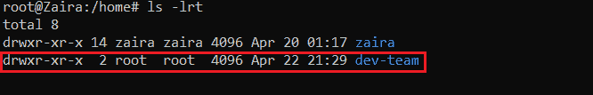</details> 

* * *

**第六步:将文件夹`dev-team`的分组所有权改为分组`dev-team`**

<details><summary>Show hint</summary>

使用命令`chown`

语法:`chown :group-name folder`</details> <details><summary>Show solution</summary>

`chown :dev-team /home/dev-team/`

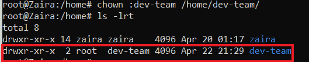</details> 

* * *

**步骤 7:确保文件夹`dev-team`的权限允许群组成员创建和删除文件。**

<details><summary>Show hint</summary>

使用命令`chmod`

写权限允许用户和组创建和删除文件。

语法:`chmod permissions folder`</details> <details><summary>Show solution</summary>

`chmod g+w /home/dev-team/`

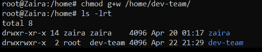</details> 

* * *

**第 8 步:确保“其他人”无权访问`dev-team`文件夹中的文件。**

<details><summary>Show hint</summary>

使用命令`chmod`

删除“其他人”的读、写、执行权限(如果存在)。

语法:`chmod permissions folder`</details> <details><summary>Show solution</summary>

`chmod o-rx dev-team`

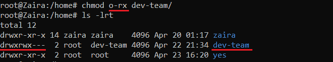</details> 

* * *

**第九步:退出`root`会话，切换到`John`**

<details><summary>Show hint</summary>

使用命令`exit`注销根用户。

使用`su`切换用户。

语法:`su - user`

要确认当前用户，使用命令`whoami`。</details> <details><summary>Show solution</summary>

`exit`

`su - John`

用命令`whoami`验证。</details> 

* * *

**第十步:导航至文件夹:`/home/dev-team`**

<details><summary>Show hint</summary>

使用命令`cd`切换文件夹。

语法:`cd /path/to/folder`

用`pwd`确认当前路径。</details> <details><summary>Show solution</summary>

`cd /home/dev-team`</details> 

* * *

**步骤 11:在文件夹:`/home/dev-team`** 中创建一个空文件

<details><summary>Show hint</summary>

使用命令`touch`创建一个空文件。

语法:`touch filename`</details> <details><summary>Show solution</summary>

`touch john-file.txt`

验证:`ls -lrt`

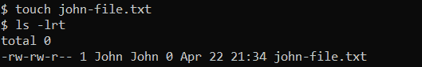</details> 

* * *

**步骤 12:将已创建文件的组所有权更改为`dev-team`并验证。**

<details><summary>Show hint</summary>

使用命令`chown`改变所有权。

语法:`chown :group file-name`</details> <details><summary>Show solution</summary>

`chown :dev-team john-file.txt`

修改组所有权后，该组的所有成员都可以访问该文件。

验证`ls -lrt`

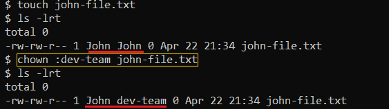</details> 

* * *

**第十三步:退出 shell，切换到用户`Bob`**

<details><summary>Show hint</summary>

使用命令`exit`退出终端。

使用`su`切换用户。

语法:`su - user`

要确认当前用户，使用命令`whoami`。</details> <details><summary>Show solution</summary>

`exit`

`su - Bob`

使用命令`whoami`验证当前用户。</details> 

* * *

**第 14 步:导航到路径`/home/dev-team`**

<details><summary>Show hint</summary>

使用命令`cd`切换文件夹。

语法:`cd /path/to/folder`

用`pwd`确认当前路径。</details> <details><summary>Show solution</summary>

`cd /home/dev-team`</details> 

* * *

**第十五步:找出`Bob's`权限进入`john-file.txt`**

<details><summary>Show hint</summary>

使用命令`ls -l`进行长列表。

语法:`ls -l | grep file-name`

组是否有`rw-`权限？</details> <details><summary>Show solution</summary>

`ls -l | grep john-file.txt`

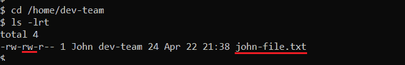</details> 

* * *

**第十六步:以`Bob`** 身份登录，修改文件`john-file.txt`

<details><summary>Show hint</summary>

使用命令`echo`向文件添加一些文本。

语法:`echo "Some text" >>file-name`

这将把引用的文本重定向到文件的末尾。</details> <details><summary>Show solution</summary>

`echo "This is Bob's comment" > john-file.txt`

如果正确设置了所有权限，`Bob`将被允许编辑和保存该文件。否则您会得到类似这样的错误:`Permission denied`。

验证`cat john-file.txt`

</details> 

* * *

**第 17 步:创建另一个组`project-manager`，并为其分配一个成员`Fatima`**

<details><summary>Show hint</summary>

使用命令`groupadd`添加一个新组。

语法:`groupadd group-name`

用命令`useradd`创建一个新用户。

使用标志`-G`为其分配一个用户。</details> <details><summary>Show solution</summary>

```
groupadd project-manager
useradd -G project-manager Fatima
passwd Fatima 
```</details> 

* * *

**步骤 18:导航到文件夹`/home/dev-team`并验证`Fatima`是否可以访问它**

<details><summary>Show hint</summary>

使用`cd`导航至`/home/dev-team`。</details> <details><summary>Show solution</summary>

`cd /home/dev-team`。

我们得到这个错误:

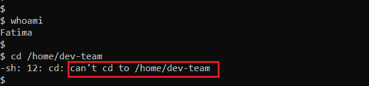

这是因为，`others`对文件夹`dev-team`没有任何访问权限。

如果我们回想一下，下面是`dev-team`文件夹的权利。

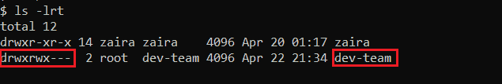</details> 

## 包扎

权限和所有权是跨多用户操作系统加强安全性的有用概念。我希望您能够深入了解更改权限和所有权。

你从这个教程中学到的最喜欢的东西是什么？在 [Twitter](https://twitter.com/hira_zaira) 上告诉我！

你也可以在这里阅读我的其他帖子[。](https://www.freecodecamp.org/news/author/zaira/)

感谢汤姆·蒙德洛克对指导练习的帮助。