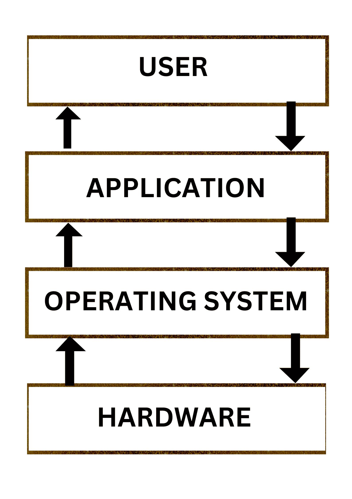
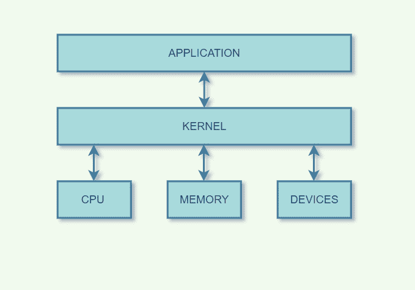

# Linux 命令行教程——如何使用常见的终端命令

> 原文：<https://www.freecodecamp.org/news/linux-command-line-tutorial/>

操作系统是介于你和计算机硬件之间的一组软件层。

操作系统是一种软件，它控制所有其他应用程序，并帮助您管理计算机的硬件和软件。

流行的操作系统的例子有 Windows、Linux、MacOS 和 Android。在本教程中，我们将关注 Linux 操作系统。



operating system diagram

您将学习最常用的 Linux 命令和操作符。您还将对 Linux 操作系统及其各种发行版有一个较高的理解，在本文中它们被称为“发行版”。

## 目录

*   [为什么要学习 Linux 命令行？](#why-learn-the-linux-command-line)
*   [操作系统的历史](#history-of-operating-systems)
*   [GNU 项目的兴起](#the-rise-of-the-gnu-project)
*   【Linux 如何工作及其基本组件
*   什么是 Linux 发行版？
*   [如何选择 Linux 发行版](#how-to-choose-a-linux-distribution)
*   [在终端运行的基本 Linux 命令](#basic-linux-commands-to-run-in-the-terminal)
*   [如何在 Linux 中使用目录](#how-to-work-with-directories-in-linux)
*   [在 Linux 中处理文件的命令](#commands-to-work-with-files-in-linux)
*   [处理文件内容的命令](#commands-to-work-with-file-contents)
*   [Linux 命令操作](#linux-command-operations)

## 为什么要学习 Linux 命令行？

有很多理由说明为什么您应该学习 Linux 命令行。其中一些是:

*   对你的机器有更多的控制权:你有很大的权力和对命令行的控制权。您可以运行命令来更改权限、查看隐藏文件、与数据库交互、启动服务器等等。
*   **更快**:使用工具箱中的基本命令，你可以比使用图形用户界面(GUI)更快地完成任务。请记住，在学习 CLI 时，速度可能会变慢。
*   自动化多项任务:您可以使用一个命令创建 10，000 个文件，每个文件都有一个唯一的名称，从而加快工作速度。对于 GUI，这个过程很费力。
*   **随处可用**:你发出的指令会在 Linux 和 Mac 电脑上自动类似运行。稍加调整，它们也可以在 Windows 上运行。
*   **基本要求**:如果你想在任何编码相关的技术领域提升自己的知识，包括开发、数据分析、devops 工程、系统管理、安全、机器学习工程等，你需要使用命令行。

## 操作系统的历史

大多数操作系统通常分为两类:基于 Unix 的和微软 NT 的后代。

Unix 是 20 世纪 60 年代中期开发的操作系统。它是我们现在经常使用的许多现代操作系统的“祖辈”，比如 Linux。

Unix 操作系统是一个闭源项目(意味着它的代码和文件不公开)。这导致了理查德·斯托尔曼领导的“自由软件”运动的兴起。它认为用户应该有运行、复制、分发和协作项目源代码的自由。

微软 NT 的后代是微软创造的专有图形操作系统。Windows NT 的后代本身没有类似的 Linux 命令，不像 Unix 和基于 Unix 的操作系统有类似的命令。相反，微软 NT 有自己的一套命令和缺省外壳。

微软 NT 的后代包括 Windows、Xbox OS、Windows Phone/Mobile 等。

## GNU 项目的兴起

理查德·斯托尔曼想创造一个自由软件来替代 Unix。1984 年，他和其他一些开发者一起创建了一个完全免费的操作系统。所以他们开始着手 GNU 项目。

与此同时，另一位名叫 Linus Torvalds 的开发人员正在创建他自己的内核，即 Linux。那时，许多 GNU 作品已经完成，但是它们缺少一个内核。托沃兹将他的内核与现有的 GNU 组件结合起来，创建了一个完整的操作系统。

一些开发人员强烈认为这个名字应该是 GNU/Linux，而不仅仅是 Linux，因为它反映了 Linux 内核与 GNU 项目的结合。

## Linux 的工作原理和 c 组件

在这一节中，您将通过理解 Linux 的基本组件来了解它是如何工作的。我们现在将讨论这些元素。

### 什么是内核？

内核是操作系统的一部分，它促进了硬件和软件之间的交互。它是计算机操作系统的基本元素。

只有操作系统的核心负责为所有其他组件提供必要的服务。它有助于设备控制、网络、文件系统管理、进程和内存管理，并充当操作系统和硬件之间的主要接口。



[kernel](https://d1m75rqqgidzqn.cloudfront.net/wp-data/2022/08/04135248/image-11.png)

### 什么是贝壳？

外壳是操作系统的计算机接口。外壳向用户或其他程序公开操作系统的服务。shell 接收您的命令，并将其发送给操作系统，以便操作系统执行这些命令。

它被命名为外壳，因为它是操作系统的外层，就像牡蛎的外壳一样！

### 终端是什么？

终端是运行外壳的程序。这是我们运行大多数命令的地方，这些命令告诉操作系统该做什么。

在不同的操作系统上，您可以通过以下方式安装终端:

*   **Linux 发行版用户**——默认安装 Bash shell
*   **Mac 用户**–终端默认安装，可以执行类似 Linux 的命令
*   **Windows 用户**–下载[Windows Subsystem for Linux(WSL)](https://www.freecodecamp.org/news/how-to-install-wsl2-windows-subsystem-for-linux-2-on-windows-10/)或使用`git bash`并从那里运行所有 Linux 命令。

## 什么是 Linux 发行版？

Linux 发行版(通常称为**发行版)**是 Linux 操作系统的版本。这些发行版是基于 Linux 的开源软件构建的。

其中的一些例子是:

### Debian 家族

自 1993 年成立以来，Debian 发布新版本的速度远远慢于 Ubuntu 和 mint。因此，它是最可靠的 Linux 发行商之一。

Debian 是 Ubuntu 的基础，Ubuntu 的创建是为了快速增强 Debian 的基础组件，使其更加用户友好。

Ubuntu 由 Canonical 于 2004 年创建，并立即获得了流行。Canonical 希望 Ubuntu 被用作一个简单的、无命令行的图形化 Linux 桌面。这是最著名的 Linux 发行版。

Ubuntu 对于初学者来说使用起来很简单。它有大量的预装应用程序和方便的存储库。

### 红帽家族

Red Hat 是一家专业的 Linux 发行商。红帽企业 Linux (RHEL)和 Fedora 是他们的产品，都是开源的。

Fedora 提供更快的更新，但不支持，但 RHEL 在发布前经过全面测试，发布后支持七年。

Red Hat 使用商标法来阻止其软件的再分发。CentOS 使用 Red Hat Enterprise Linux source，这是一项社区工作，旨在消除 Red Hat 的所有商标，并使其公开可用。换句话说，它是 RHEL 的免费版本，提供了一个持久可靠的平台。

### 苏塞家族

SUSE 为计算机创造了自己的操作系统。它与来自其他开源项目的系统和应用软件一起提供，并在免费和开源的 Linux 内核之上开发。

SUSE Linux 主要是在欧洲开发的，起源于德国。SUSE 这个名字是“软件和系统-Entwicklung”的首字母缩写 SUSE 是仍在使用的最古老的商业发行版之一，因为它的最初版本是在 1994 年初发布的。

### Fedora 家族

这是一个提供最新软件版本的项目，主要关注自由软件。它使用“上游”应用程序，而不是开发自己的桌面环境。它默认带有 GNOME3 桌面环境。虽然不太可靠，但它提供了最新的信息。

## 如何选择 Linux 发行版

| 分配 | 使用理由 |
| 人的本质 | 它像 Mac OS 一样工作，并且易于使用。 |
| CentOS | 如果你想用红帽但没有它的商标。 |
| 一种男式软呢帽 | 如果你想使用红帽和最新的软件。 |
| 红帽企业 | 商用。 |
| OpenSUSE | 它的工作原理与 Fedora 相同，但稍旧且更稳定。 |
| Arch Linux | 它对初学者不友好。 |

现在让我们来讨论一些您可以运行来与 shell 交互的命令。

# 在终端中运行的基本 Linux 命令

### `whoami`命令

该命令将当前登录用户的名称打印到终端会话中。

```
caesarsage@caesarsage:$ whoami
```

### `man`命令

该命令打印**手册**或关于命令、配置文件等的信息。这个命令在获取任何命令的更多信息时非常有用。

```
caesarsage@caesarsage:$ man whoami
```

### `clear`命令

清除之前在当前终端中运行的所有命令。这将清除终端中以前命令的屏幕。

```
caesarsage@caesarsage:$ clear
```

### 如何打开文件

#### Mac 用户:

`open <filename or directory name>`

open 命令允许您在终端外部的图形用户界面(GUI)中打开文件或目录。

#### Linux 用户

`xdg-open <filename or directory name"`

#### Windows WSL 用户

可以用与 Linux 类似的方式打开文件，但是需要安装 xdg-open 包。

Linux 和 Windows 用户示例:

```
caesarsage@caesarsage:$ xdg-open clean-code-architecture.pdf
```

现在我们已经介绍了基本命令，让我们学习一些您会经常使用的其他命令。

## 如何在 Linux 中使用目录

现在让我们来看看一些最常用的命令，您将使用这些命令来处理目录。

目录就像文件夹，你可以通过你的系统界面用鼠标或光标创建、删除和执行所有的功能。

在这里，我们将做一些类似的事情，但从我们的终端舒适。以下命令允许您对目录执行不同的操作:

*   **`pwd`** (目前工作目录)
*   **`cd`** (当前目录)
*   **`ls`** (列表)
*   **`mkdir`** (制作目录)
*   **`rmdir`** (删除目录)

让我们来看看它们各自的功能:

### `pwd`命令

当你在文件系统中感到迷失时，调用`pwd`命令来知道你在哪里。这不需要争论。

```
casesarsage@caesarsage:~/Documents/github.com$ pwd
```

它应该打印出你当前所在的文件夹/目录路径。

### `cd <path>`命令

您可以使用 cd 命令(更改目录)更改当前目录。就像使用 GUI 时在文件夹之间来回切换一样。

```
caesarsage@caesarsage$: cd Documents/articles
```

此命令将我带到“我的文档”文件夹中名为“文章”的文件夹。

让我们看看你还能用`cd`做些什么。

#### `cd ~`

cd 也是返回主目录的快捷方式。在没有目标目录的情况下，只需输入 cd 就会把你放在主目录下。键入`cd ~`也有同样的效果。

```
caesarsage@caesarsage:~/Documents/github.com$ cd ~
```

这将把您的从 github.com 文件夹带到您的主目录

#### `cd ..`

要转到父目录(目录树中当前目录的上一层)，请键入 **`cd ..`** :

```
caesarsage@caesarsage:~/Documents/github.com$ cd ..
```

### `ls`命令

在一个文件夹中，您可以使用`ls`命令列出该文件夹包含的所有文件。这不需要争论。

```
caesarsage@caesarsage:~/Documents/mycatfolder$ ls
```

就像使用`cd`一样，您还可以使用`ls`的其他选项:

#### `ls -a`

ls 的一个常用选项是-a，用于显示所有文件。显示所有文件意味着包括隐藏的文件。

当 Linux 文件系统上的文件名以点开始时，它被认为是一个隐藏文件，不会出现在常规文件列表中。该命令将显示这些文件。

#### `ls -l`

很多时候，您将使用 ls 选项以不同的格式显示目录的内容，或者显示目录的不同部分。

只需输入 ls 就会给出目录中的文件列表。键入 **`ls -l`** 会给出一个很长的列表和权限，如( **rwx** -读、写、执行)。

### `mkdir <directoryName>`命令

浏览 Unix 文件树很有趣，但是用 **mkdir** 创建自己的目录/文件夹更有趣。

您必须给`mkdir`至少一个参数——要创建的新目录的名称。键入前导/之前请三思。

```
caesarsage@caesarsage:~/Documents$ mkdir cats
```

### `rmdir <directoryName>`命令

当目录为空时，您可以使用 **rmdir** 移除或删除该目录。

```
caesarsage@caesarsage~/Documents$ rmdir cats
```

#### `rmdir -p <directoryName>`

当你想删除嵌套目录时，你可以使用 **-p** 标志。使用`rmdir -p`递归删除目录。这类似于用 **mkdir -p** 创建嵌套目录。

```
caesarsage@caesarsage:~/Documents$ rmdir -p articles/drafts
```

## 在 Linux 中处理文件的命令

在本节中，您将学习如何使用以下命令识别、创建、删除、复制和移动文件:

*   **T2`touch`**
*   **T2`rm`**
*   **T2`cp`**
*   **T2`mv`**
*   **T2`rename`**

### `touch <filename>`命令

创建空文件的一个简单方法是使用如下的`touch`:

```
caesarsage@caesarsage:~$ touch file1.txt file2.md file3
```

上面创建了三个文件(文本和降价文件)。

### `rm <filename>`命令

当您不再需要某个文件时，请使用 rm 将其删除。

**注意**与一些图形用户界面不同，命令行通常没有可以恢复文件的垃圾桶。当您使用`rm`删除一个文件时，该文件就消失了。所以删除文件的时候一定要小心！

```
caesarsage@caesarsage:~$ rm file1.txt
```

以下是使用`rm`的一些更具体的方法:

#### `rm -v <filename>`

这个标志给你反馈它做了什么(删除一个文件)。

#### `rm -i <filename>`

为了防止自己意外删除文件，可以键入`rm -i`。这将显示一个提示，确认您是否真的要删除该文件。

#### `rm -rf <filename>or<directory>`

默认情况下，`rm -r`不会删除非空目录。但是 rm 接受几个选项，允许您删除任何目录。

`rm -rf`语句很有名，因为它会删除任何东西(假设你有权限这么做)。当你以 root 用户身份登录时，要非常小心使用`rm -rf`(f 表示强制，r 表示递归)，因为作为 root 用户意味着权限不适用于你。您可能会意外地删除整个文件系统。

### `cp <fileold> <newfile>`命令

要复制一个文件，使用带有文件名和新文件名参数的`cp`。

```
caesarsage@caesarsage:$ cp text2.md text2Copy.md
```

#### `cp <source> <destination>`

使用该选项将文件复制到另一个目录(目标)。

如果目标是一个目录，那么源文件被复制到该目标目录。

```
caesarsage@caesarsage:~$ mkdir dir3
caesarsage@caesarsage:~$ cp file2.md dir3
```

#### `cp -r directorySource dirTarget`

要复制完整的目录，使用`cp -r`(- r 选项强制递归复制所有子目录中的所有文件)。

```
caesarsage@caesarsage:~$ cp -r dir1/dir2  dir3
```

### `mv source destination`命令

您可以使用`mv`命令来移动和重命名目录。

```
caesarsage@caesarsage:~/Documents/$ mv cat catFolder
```

```
caesarsage@caesarsage:~/Documents/$ mv newarticle.txt articles
```

## 处理文件内容的命令

您可以使用以下命令查看文本文件的内容:

*   **T2`head`**
*   **T2`tail`**
*   **T2`cat`**
*   **T2`less`**
*   **T2`echo`**
*   **T2`wc`**
*   **T2`grep`**

### `head <file>`命令

该命令打印文件的第一部分。默认情况下，它给出了文件的前 10 行，但是您可以通过添加`-n`标志来覆盖它。

```
caesarsage@caesarsage:$ head /etc/passwd
```

### `tail <file>`命令

该命令打印文件的最后 10 行。您也可以通过传递`-n`标志来覆盖默认设置。

尾文件也有一个`-f`标志，帮助您继续打印文件的额外内容。这对于系统中不断变化的日志和错误文件非常有用，因此您可以对它们进行监控。

```
caesarsage@caesarsage:$ tail /etc/passwd
```

### `cat <filename>`命令

可以向文件中添加内容，这使它变得非常强大。最简单的用法是，cat 将文件内容打印到标准输出中。

```
caesarsage@caesarsage:$ cat file
```

您也可以打印多个文件的内容。

使用**操作符>** (我们稍后会看到它的作用——现在，我们知道它将终端输出放入一个文件中)您可以将多个文件的内容连接到一个新文件中:

```
caesarsage@caesarsage:$ cat file2.txt file3.txt > combine.txt
```

您还可以使用它来创建文件:

```
caesarsage@caesarsage:$ cat > newfile.txt
```

### `less <filename>`命令

`less`命令在一个漂亮的交互式 UI 中显示存储在文件中的内容。

```
caesarsage@caesarsage:$ less /etc/passwd
```

使用 **b** 滚动一页， **G** 转到末尾， **g** 转到开始，使用 **q** 退出 cmd。

### `echo`命令

该命令将传递给它的参数打印到输出中。

```
caesarsage@caesarsage:$ echo 'Hello world'
```

### `wc <input>`命令

`wc`代表字数，该命令给出了关于输入(例如一个文件)的信息，如行数、字数、内容的字节数等等。

#### `wc -l`

该选项仅打印换行符计数。

#### `wc -m`

该选项仅打印字符数。

#### `wc -c`

该选项仅打印字节数。

#### `wc -w`

此选项仅打印字数。

### `grep`命令

grep 命令可能是使用最广泛的文本操作命令。它允许您过滤要显示的文件内容。

例如，如果您想查看文件中包含单词 output 的所有行，您可以使用 cat 并要求它只显示这些行。

```
caesarsage@caesarsage:$ cat /etc/snort/snort.conf | grep output
```

在下一节中，您将了解到关于管道(|)操作符的更多信息。

## Linux 命令操作

可以用来操作 Linux 命令的一些常见命令是:

*   **`>`** :重定向标准输出

到目前为止，我们看到的大多数命令都在终端上为我们打印了一些内容。例如，PWD 打印出我们当前的目录，等等。

可以使用“>”将这些输出存储并重定向到一个文件。当您多次运行它时，它会覆盖当前的文件内容。

```
caesarsage@caesarsage: whoami > file.txt
caesarsage@caesarsage: pwd > file.txt
caesarsage@caesarsage: cat > file.txt
```

*   **`>>`** :重定向标准输出并追加新内容。

与'>'操作不同，>>不会覆盖以前存储在文件中的输出。

```
caesarsage@caesarsage: whoami >> file.txt
caesarsage@caesarsage: pwd >> file.txt
caesarsage@caesarsage: cat file.txt
```

*   **`|`** :这种运算符叫做 pipe。

这将一个命令的输出作为另一个命令的输入传递。你可以这样使用它:

```
caesarsage@caesarsage:$ cat /etc/snort/snort.conf | grep output
```

# 摘要

在本文中，您从较高的层次了解了 Linux 操作系统。您还将学习使用 Linux 命令行与操作系统进行交互。

一如既往，我希望你喜欢这篇文章，并学到一些新东西。如果你愿意，你也可以在 [LinkedIn](https://www.linkedin.com/in/destiny-erhabor) 或 [Twitter](https://twitter.com/caesar_sage) 上关注我。

干杯，下期再见！✌️