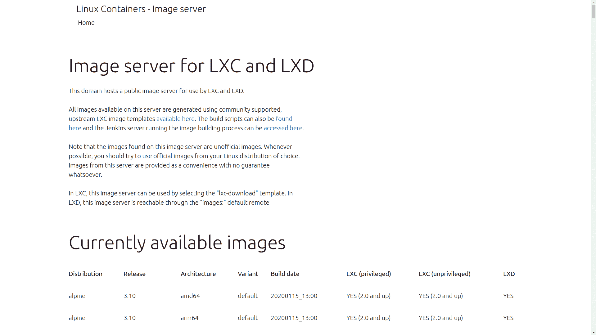

# 如何在 LXC 和 LXD 上使用 Linux 容器

> 原文：<https://www.freecodecamp.org/news/linux-containers-lxc-lxd/>

在过去，安装操作系统意味着将所有的硬件组件组装在一起，用外围驱动器中的安装盘启动新计算机，然后让安装过程自由进行。总运行时间可能在几小时到几周之间。

如今，我可以对自己说“我不介意在运行特定版本 CentOS 的服务器上进行测试”,并且——取决于许多变量并假设原始映像已经下载——我可以在 30 秒内准备好一个全功能的虚拟系统。您的确切结果可能会有所不同，但不会相差太多。

你可以在我的新[plural sight“Linux 系统优化”课程](https://pluralsight.pxf.io/RqrJb)中看到所有这些是如何工作的——本文就是基于该课程。

是什么推动了这一切变化？虚拟化。尤其是容器虚拟化。

虚拟化操作系统是一个文件系统，包含启动传统机器所需的所有软件库、二进制文件和配置文件。只不过这个特定的文件系统不是存储在计算机开机时会读取的根分区或引导分区中，而是存储在存储卷的其他部分。

当一些软件巧妙地欺骗文件，让它们认为自己在自己的硬件上运行，而实际上它们正在与主机操作系统，或许还有其他一些虚拟计算机共享空间和资源时，就会“启动”你的虚拟计算机。

概括地说，有两种用于服务器虚拟化管理的软件系统:管理程序和容器。

虚拟机管理程序提供了一个抽象层，允许来宾虚拟机创建一个隔离的环境，可以访问模拟裸机服务器的系统硬件。这意味着虚拟机管理程序虚拟机可以从与底层硬件兼容的任何操作系统中构建。但这也意味着它们会占用更多的空间、更多的内存和计算资源。

## 容器虚拟化

另一方面，容器共享主机的操作系统内核，存在于由 cgroups 之类的系统工具管理的小心保护和隔离的空间中。因为它们共享内核，所以容器消耗的内存和系统资源可以非常少，绝对没有浪费。而且，正如您将看到的，运行容器应用程序的速度将是惊人的。

在过去的几年中，很多与容器相关的注意力都集中在 Docker 上，最近则是 Google 的容器编排工具 Kubernetes。事实上，Kubernetes 非常适合企业级微服务架构。

但是有一个更老的，也可以说是更成熟的容器模型实现还没有出现。Linux 容器项目，LXC，和它最近的工具集，LXD，有很多人认为它比 Kubernetes 更适合一些用例。特别是，LXC 擅长为测试和应用程序开发构建轻量级和快速的沙盒环境。

在本文中，我将向您展示如何安装 LXD，如何准备和启动一个运行超小型 Alpine Linux 的简单容器，然后如何在您的新容器中打开一个 shell 会话。我还将解释如何找到并启动其他发行版的多个版本。

我可以马上告诉你的一件事是，每当我教 LXC 的时候，学生们都会惊讶地发现使用容器是多么强大和有效。

当我们完成所有这些后，您将能够启动机器，在几秒钟内动手测试您正在学习或工作的内容。当实验失败时，您可以立即关闭并移除一个容器，然后构建另一个容器来替换它。再也没有不学习的借口了。

## 建造 LXD 集装箱

我们将让 LXC 运行全新安装的 Ubuntu 18.04 机器。在这个演示中，我们将安装并初始化一个 LXD 环境，然后使用 LXD 版本的 LXC 命令行界面下载并启动一个 Alpine Linux 容器。我们将确认一切正常，然后四处看看环境是如何填充的。

我将使用 snap 包管理器来安装 LXD，因为这是现在的官方建议。提醒你一下，不仅仅是 LXD:各种各样的应用程序都在流向 snap 或 AppImmage 和 Flatpak 等替代管理器。我依然爱我的 Debian 资质，但你无法对抗全世界。

```
$ sudo snap install lxd 
```

LXD 是一个更新的工具集，用于管理 LXC API，它包含了所有常规的 LXC 依赖项。一个安装命令就完成了。

使用 lxd init 命令初始化 LXC 环境很重要。你可以自己手动设置，但是这样你更有可能做好。init 进程会问你一堆问题，至少现在，默认的答案都是有效的。

```
$ sudo lxd init 
```

一旦完成，我们就准备好建造你的第一个容器了。无论我们想要哪个 Linux 发行版和版本，我们都需要找到并下载映像。在 images.linuxcontainers.org，LXC 项目维护着一个相当广泛的图像库。您可以看到每个发行版通常都有多个版本，这允许您构建可以与任何软件兼容的容器。

我准备用最新版本的 Alpine Linux，因为它真的很小。随意使用你喜欢的任何图像——包括像 Ubuntu 和 CentoOS 这样的大男孩。当然，Alpine 下载速度会很快。

但在此之前，我应该告诉您如何理解获取图像所需的命令行语法。

正如你在 LXD 网站的屏幕截图中看到的，你可以从页面本身获得三条信息:发行版的名称——在这个例子中是 Alpine——版本号 3.10——和架构。我们在追 amd64。



From the images.linuxcontainers.org page

我们现在准备通过运行`launch`命令来触发下载:

```
$ sudo lxc launch images:alpine/3.10/amd64 demo 
```

注意语法是“lxc ”,尽管从技术上讲这是一个 LXD 接口。“图像”告诉 LXC，我们的图像存在于我们之前看到的公共回购中。我们的三位数据——发行版名称、发行版本号和体系结构——用正斜杠分隔。我将使用“demo”作为我的容器的名称。这应该是我们所需要的。

你可以通过它下载的速度来看它有多小。我的网络连接不是很快，我也没有用录音玩任何游戏。为了确认它工作正常，我将运行“lxc ls”来列出当前安装的所有容器。只有一个。并且其当前状态是“正在运行”。

```
sudo lxc ls
+------+---------+----------------------+------------+-----------+
| NAME |  STATE  |         IPV4         |    TYPE    | SNAPSHOTS |
+------+---------+----------------------+------------+-----------+
| demo | RUNNING | 10.125.45.119 (eth0) | PERSISTENT | 0         |
+------+---------+----------------------+------------+-----------+ 
```

您可以使用“lxc exec”命令在容器中打开非登录根会话。只需指定容器名，然后告诉 LXC 你想使用 sh 解释器运行一个 shell(如果你使用的是 Ubuntu 或 CentOS 容器，你可能更喜欢`/bin/bash`-你可以选择任何一种方式)。如果你在家跟着做的话，你可以自己看到，我们有一个普通的 Linux 命令提示符，任何 Linux-y 现在都是可能的。

```
$ sudo lxc exec demo sh
~ # 
```

您也可以通过键入命令而不是这个`sh`来运行单个命令，而不打开完整的 shell。

```
$ sudo lxc exec demo ls /
bin    etc    lib    mnt    proc   run    srv    tmp    var
dev    home   media  opt    root   sbin   sys    usr 
```

你可以随时使用`exit`跳出外壳，回到你的主机。在这里，除了列出正在运行的容器，我还可以列出任何存储池。在初始化期间创建的默认池就在那里，我们可以看到存储磁盘映像的位置。默认情况下，/var/lib/lxd 是保存所有 LXC 资源的位置。

```
$ sudo lxc storage ls
+---------+-------------+--------+--------------------------------+---------+
|  NAME   | DESCRIPTION | DRIVER |             SOURCE             | USED BY |
+---------+-------------+--------+--------------------------------+---------+
| default |             | btrfs  | /var/lib/lxd/disks/default.img | 3       |
+---------+-------------+--------+--------------------------------+---------+ 
```

我同样可以列出我所有的网络。这个系统上碰巧有一些网桥(正如你所看到的，我已经玩了一会儿)。还有主机 Ubuntu 服务器使用的物理 enp0s3 桥。虽然在你我之间，这也不是物理的，因为这实际上是一个运行在 Oracle 虚拟环境中的虚拟机。

```
$ lxc network ls
+---------+----------+---------+-------------+---------+
|  NAME   |   TYPE   | MANAGED | DESCRIPTION | USED BY |
+---------+----------+---------+-------------+---------+
| enp0s3  | physical | NO      |             | 1       |
+---------+----------+---------+-------------+---------+
| lxdbr0  | bridge   | YES     |             | 1       |
+---------+----------+---------+-------------+---------+
| mynet   | bridge   | YES     |             | 0       |
+---------+----------+---------+-------------+---------+
| testbr0 | bridge   | YES     |             | 1       |
+---------+----------+---------+-------------+---------+ 
```

如果需要，我们可以使用“lxc network attach”命令向我们的容器添加一个新的虚拟接口。这里，我将指定物理网络，然后指定容器的名称。

```
$ lxc network attach enp0s3 demo 
```

完成后，您可以在容器中打开一个新的 shell 来查看发生了什么变化。现在应该会列出 eth1 接口。您可能需要重新启动以使所有更改完全生效。通过这样做，你也可以惊讶于这个东西可以如此快速地重新启动自己——对于所有的意图和目的来说，它会比你键入`exec`命令来打开一个新的 shell 更快。

享受你的新环境！

*本文基于我的 [Pluralsight 课程“Linux 系统优化”的内容](https://pluralsight.pxf.io/RqrJb)在[bootstrap-it.com](https://bootstrap-it.com)有更多管理方面的书籍、课程和文章。*