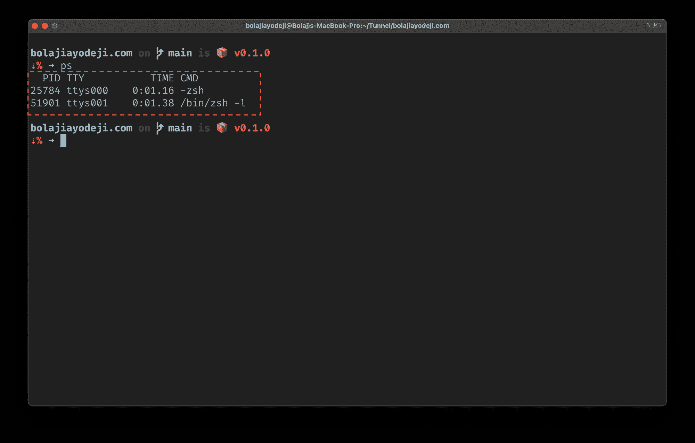
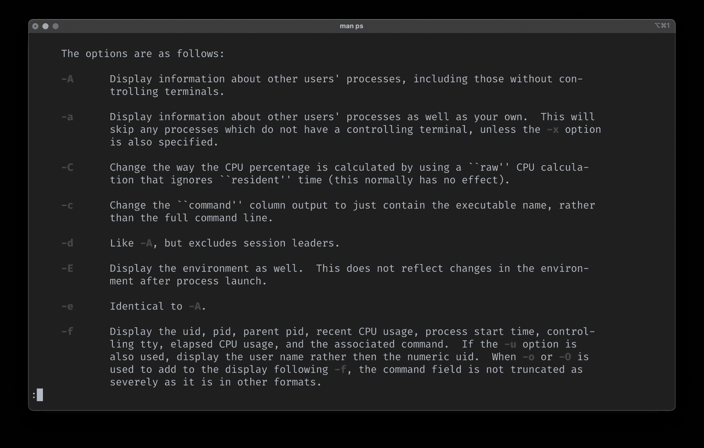
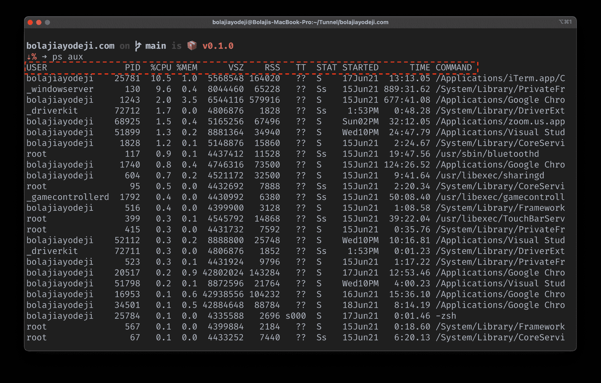
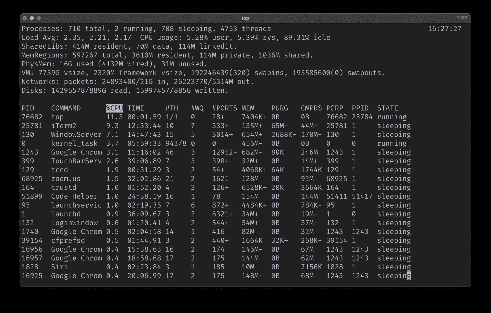
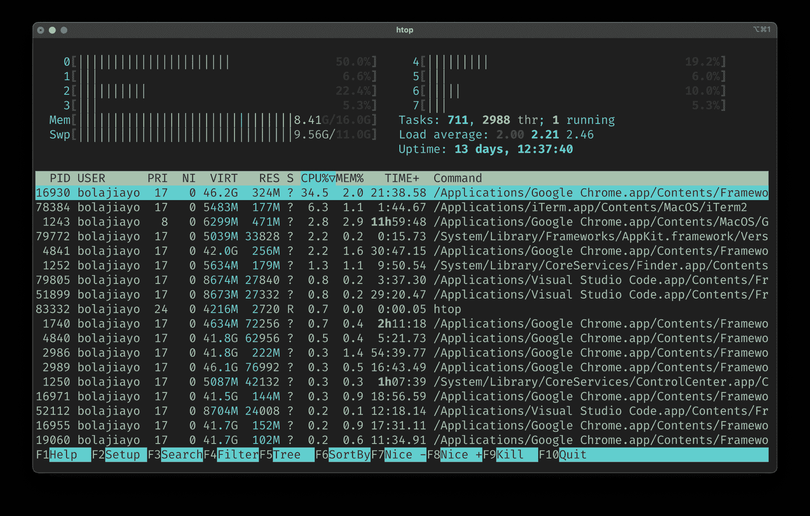

# Linux 列表进程——如何检查正在运行的进程

> 原文：<https://www.freecodecamp.org/news/linux-list-processes-how-to-check-running-processes/>

每天，开发人员在终端中使用各种应用程序和运行命令。这些应用程序可以包括浏览器、代码编辑器、终端、视频会议应用程序或音乐播放器。

对于您打开或运行的每一个软件应用程序，它都会创建一个*进程*或*任务*。

一般来说，Linux 操作系统和现代计算机的一个美丽特征是它们支持多任务处理。因此多个程序可以同时运行。

你有没有想过如何检查你机器上运行的所有程序？那么这篇文章就是为您准备的，因为我将向您展示如何列出、管理和终止您的 Linux 机器上所有正在运行的进程。

## 先决条件

*   安装了一个 Linux 发行版。
*   关于命令行导航的基本知识。
*   你脸上的笑容:)

## Linux 进程快速介绍

进程是正在运行的计算机程序的实例，您可以在软件应用程序或命令中找到它。

例如，如果打开 Visual Studio 代码编辑器，就会创建一个进程，该进程只有在您终止或关闭 Visual Studio 代码应用程序时才会停止(或终止)。

同样，当您在终端中运行一个命令时(如`curl ifconfig.me`)，它会创建一个进程，该进程只有在命令执行完毕或被终止时才会停止。

## 如何使用`ps`命令列出 Linux 中正在运行的进程

您可以使用`ps`命令列出正在运行的进程(ps 表示*进程状态*)。`ps`命令实时显示当前正在运行的进程。

要测试这一点，只需打开您的终端并运行`ps`命令，如下所示:



这将用四列显示当前 shell 的进程:

*   **PID** 返回唯一的进程 ID
*   **TTY** 返回你登录的终端类型
*   **TIME** 返回 CPU 的总使用量
*   **CMD** 返回启动进程的命令的名称。

您可以通过使用选项的任意组合(如`-A` `-a`、`-C`、`-c`、`-d`、`-E`、`-e`、`-u`、`-X`、`-x`等)来选择显示某一组流程。

如果您指定了这些选项中的一个以上的选项，那么将显示与至少一个给定选项匹配的所有进程。



The `ps` command manual page.

> 在您的终端中键入`man ps`来阅读`ps`命令的手册，其中有所有选项及其用法的完整参考。

要显示您机器上所有用户的所有正在运行的进程，包括他们的用户名，并显示未连接到您的终端的进程，您可以使用下面的命令:

```
ps aux
```

下面是该命令的详细说明:

*   `ps`:进程状态命令。
*   `a`:显示其他用户以及您自己的进程的信息。
*   `u`:显示属于指定用户名的进程。
*   `x`:包括没有控制终端的进程。



这将用 11 列显示当前 shell 的进程:

*   **用户**返回运行进程的用户的用户名
*   **PID** 返回唯一的进程 ID
*   **%CPU** 返回 CPU 使用率的百分比
*   **%MEM** 返回内存使用的百分比
*   **VSV** 返回以千字节为单位的虚拟大小
*   **RSS** 返回常驻集大小
*   **TT** 返回控制终端名称
*   **STAT** 返回符号进程状态
*   **开始**返回开始时间****
*   **CMD** 返回启动进程的命令。

## 如何使用`top`和`htop`命令列出 Linux 中正在运行的进程

您还可以使用 Linux 中的`top`任务管理器命令来查看使用最多内存或 CPU 的顶级进程的实时排序列表。

在您的终端中键入`top`,您将得到类似于您在下面截图中看到的结果:



> 您可以键入`q`退出会话。

`top`的替代方案是`htop`，它提供了一个交互式系统监视器来查看和管理进程。它还根据进程的 CPU 使用情况显示一个实时排序列表，您可以轻松地搜索、过滤和终止正在运行的进程。

默认情况下,`htop`没有安装在 Linux 上，所以您需要使用下面的命令安装它，或者[下载您喜欢的 Linux 发行版的二进制文件](https://htop.dev/downloads.html#binaries)。

```
sudo apt update && sudo apt install htop
```

只需在您的终端中键入`htop`,您将得到类似于您在下面的截图中看到的结果:



## 如何杀死 Linux 中正在运行的进程

终止一个进程意味着终止一个正在运行的应用程序或命令。您可以通过运行带有进程 ID 的`kill`命令或带有进程名称的`pkill`命令来终止一个进程，如下所示:

```
kill [PID]
```

或者

```
pkill [COMMAND]
```

要查找正在运行的进程的进程 ID，可以使用`pgrep`命令，后跟进程名，如下所示:

```
pgrep iTerm2
```

为了终止上面截图中的 iTerm2 进程，我们将使用下面的任何命令。这将自动终止并关闭 iTerm2 进程(应用程序)。

```
kill 25781
```

或者

```
kill iTerm2
```

## 结论

当您列出正在运行的进程时，它通常是一个很长的集群列表。您可以通过 less 管道在终端中一次一页地显示命令输出，如下所示:

```
ps aux | less
```

或者只显示与特定名称匹配的特定进程，如下所示:

```
ps aux | grep Chrome
```

我希望您现在理解了什么是 Linux 进程，以及如何使用`ps`、`top`和`htop`命令来管理它们。

确保通过分别运行`man ps`、`man top`或`man htop`查看每个命令的手册。该手册包括一个全面的参考，如果你需要更多的帮助，你可以随时查看。

感谢阅读——干杯！💙