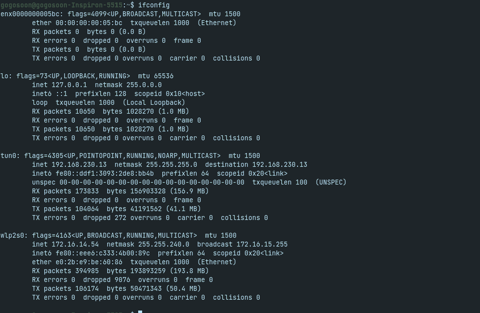
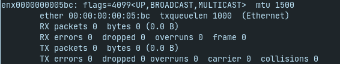
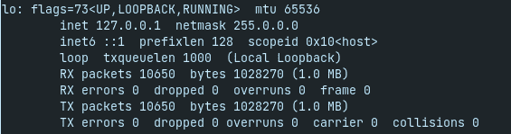
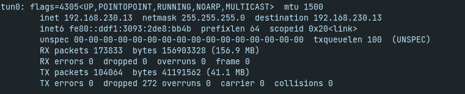
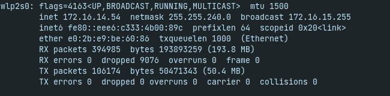
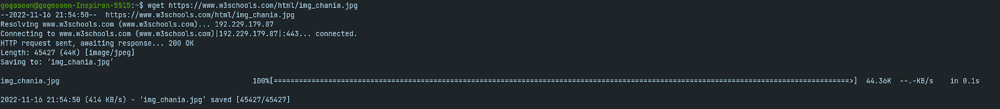
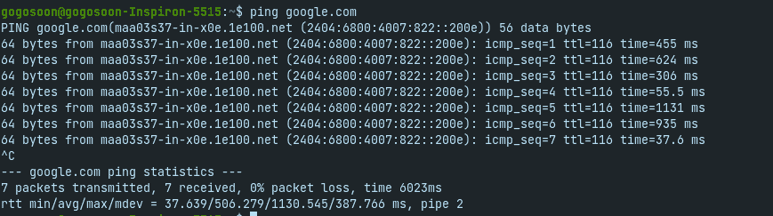

# 作为初学者应该知道的 Linux 网络命令

> 原文：<https://www.freecodecamp.org/news/linux-networking-commands-for-beginners/>

你能想象有一台笔记本电脑却不能上网是什么样子吗？

如果你是一名开发人员(或者有抱负的开发人员)，你可能会每天都使用互联网。所以你应该学习一些有用的网络命令。

要学习 Linux 中的网络，您还应该知道如何使用终端。因为使用终端命令比使用 UI 更强大。它也会更快更有效率。

## 先决条件

对 Linux 终端的基本了解足以学习 Linux 中的网络。

## 如何找到您机器的 IP 地址

这是网络中最基本的问题，也是学习网络的起点。

但是等等。

### 什么是 IP 地址？

IP 代表“互联网协议”，它是管理如何通过互联网或本地网络发送数据的协议(一组规则)。

IP 地址基本上是在互联网或本地网络上识别设备的唯一地址。

好了，现在我们知道了什么是 IP 地址，让我们继续。

作为一名专业的网络开发人员，我致力于开发网站及其后端服务。

一天，一个实习生问了我一些关于他正在做的一个有趣项目的问题。他希望自己的网站在桌面、移动和平板电脑上都能响应。

尽管这个网站看起来有反应，但当我在他的笔记本电脑上调整浏览器窗口并切换到移动视图时，部署后在手机上的结果并不令人印象深刻。

所以，他向我求助，

“我想在开发模式下用手机检查网站的响应能力。可能吗？”他问。

“是的，是这样。将您的笔记本电脑和手机连接到同一个网络。找到你的笔记本电脑 IP，在你的手机浏览器上导航到`ip:<server_port>`”我回答道。

于是他在浏览器里打开了一个新的标签页，开始输入“https://whatsmy ...”，我拦住他，问他在找什么。

他告诉我他在找他的 IP 地址。

“用`ifconfig`命令找到你机器的 IP 地址”，我回答。

他打开终端，试着发出命令，就像这样:

```
ifconfig
```

Command to find IP address of your machine



Sample Output of the ifconfig command

“哦，伙计！我现在很迷茫。这里哪个是我的 IP？”，是他的下一个问题。

所以我向他解释了上面输出中的每个块:

在走进每个街区之前，你会发现几乎没有什么东西是所有街区共有的。让我们来了解一下他们。

### 网络接口的特征

第一行显示 UP、LOOPBACK、RUNNING、NOARP、MULTICAST 等。这些是网络接口的特征。例如，能够进行广播，能够进行组播。默认情况下,`ifconfig`命令仅列出启动设备。接口也可以做下来。

### MTU 是什么？

MTU 代表最大传输单位。它决定了发送的数据包的最大有效载荷大小。默认标准值为 **1500 字节**。但是，您可以增加数据包的有效负载大小，这允许您发送更多数据并提高数据传输速率。

### ifconfig 中的 inet 行

inet 是分配给特定接口的互联网(IPv4)地址。它将由 DHCP 客户端设置。

**网络掩码**是一个 32 位“掩码”,用于将 IP 地址划分为子网，并指定网络的可用主机。

**广播**地址是指指定网络上的所有主机同时广播。

**目的地**地址是点对点链路另一端的远程主机的地址。

**inet6** 是分配给特定接口的 IPv6 地址。

**prefixlen** 称为前缀长度，指定 IP 地址中用作子网掩码的位数。

**scopeid** 是分配给区域的 id。作用域是一个拓扑区域，在此区域内 IPv6 地址可用作一个接口或一组接口的唯一标识符。

### RX 和 Tx

Rx / Tx 数据包–显示接收/发送数据包的数量
Rx / Tx 字节–以桶为单位显示数据包大小
Rx / Tx 错误–显示错误数据包的数量
Rx / Tx 丢弃–显示丢弃数据包的数量
Rx / Tx 溢出–显示溢出数据包的数量

上面提到的项目除了超限都是自明的。这里有一个超限的快速定义。
**溢出**是指在特定的轮询周期内没有被发送出去的数据包。这是由于日程安排的原因。它并不表示数据包失败，只是表示没有发送出去。溢出数据包将在下一个周期重新调度，但同一数据包可能会再次溢出。

让我们探索一下每块积木的用途。

以`enx...`(以前称为`eth0`)开头的第一个块用于以太网连接。因为我没有连接以太网电缆，所以它没有显示任何数据。



Ethernet block in ifconfig command

以`lo`开头的块称为环回接口。这是系统用来与自身通信的特殊接口。



LoopBack Interface block in ifconfig command

以`tun0`开头的块称为隧道接口。它包含有关您所连接的 VPN 的信息。



Tunnel Interface block in ifconfig command

以`wlp2s0`开头的块被称为 PCI 上的无线。这是连接到您本地网络的 WIFI 的主界面。



Wireless Interface block in ifconfig command

如果你连接到你的 Wifi，你必须使用最后一个。

## 如何使用 Linux 终端下载文件

有一天天气很好，我的老板给我发了一堆可下载的链接，让我下载并把它们打包成 Zip 文件寄给他。

我以为这将是很容易的工作，但后来我意识到，它有 100+可下载链接🥲.

激活禅模式，我开始寻找一种自动化的方法。这是我发现`wget`命令的时候。您可以使用这个终端命令从链接下载资源。

命令非常灵活，您可以在脚本和 cron 任务中使用它。由于`wget`是非交互式的，它可以在后台独立下载资源，不需要用户活动或登录。

例如，以下命令将从 w3schools 网站下载一个图像，放在您当前的文件夹中:

```
wget https://www.w3schools.com/html/img_chania.jpg
```

Command to download file from Linux-terminal



Command to download file using Linux Terminal

您可以传递另一个参数来指定下载文件的目标文件夹，如下所示:

```
wget https://www.w3schools.com/html/img_chania.jpg /home/user/downloads/pics/
```

Terminal command to download a file on the given folder

我写了一个脚本，用`wget`命令下载所有文件，只用了 15 分钟就把它们交给了我的老板。他非常惊讶。

## 如何使用终端命令确定您的系统是否连接到互联网

你一生中可能至少遇到过一次这样的问题。

我的笔记本电脑连接了无线网络。但是为什么我不能上网，而我周围的人可以？

默认情况下，大多数人通常会尝试断开连接，然后重新连接到相同或不同的 wifi 网络。99%的情况下这是行不通的，你最终会面对一个"**嗯。我们找不到那个地方。**火狐**中的**消息，或者**Chrome**中的【无互联网】恐龙游戏。

这时，你只需要耐心地找出问题所在。你需要发现这是你的系统还是你的浏览器的问题。你必须弄清楚你是否能在不使用浏览器的情况下访问互联网。

您可以通过使用`ping`终端命令来实现。看起来是这样的:

```
ping google.com
```

Terminal command to check Internet Connectivity



Sample output of ping command

您可以使用 ping 命令来检查网络连接。该命令将 URL 或 IP 地址作为参数，并将数据包发送到指定的地址。然后打印服务器的响应和转换时间。它将连续打印响应，直到您取消该过程(使用 CTRL + C)。最后，它将返回以下详细信息:

1.  收到响应所需的最短时间
2.  接收响应所需的平均时间
3.  接收响应所需的最长时间

我们可以使用`-c`标志指定要发送的数据包数量，如下所示:

```
ping google.com -c 10
```

Terminal command to verify connectivity by sending 10 packets

我们还可以使用`-s`标志来指定数据包的大小:

```
ping google.com -s 40
```

Terminal command to verify connectivity by sending 40 bytes of packets

我们还可以使用`-i`标志指定下一个请求时间:

```
ping google.com -i 2
```

Terminal command to verify connectivity with a gap between two requests of 2 seconds

还有很多。

执行上述命令后，希望您能够发现您的系统是否连接到互联网。最有可能的是，你的浏览器将是罪魁祸首。重新安装浏览器将解决此问题。

## 如何找到一个网站的 IP 地址

在我们继续之前，您应该能够回答以下问题:

### 什么是 DNS？

DNS 代表域名系统。我们使用的每个网站都有一个域名(例如 google.com 或 freecodecamp.org)。这些域名中的每一个都将指向一个服务器的特定 IP 地址。DNS 基本上是一个系统，它有一个映射每个域和 IP 地址的表。

现在是时候回到正轨，学习如何找到一个网站的 IP 地址。

**`nslookup`** (代表“名称服务器查找”)是查询 DNS 服务器的命令。它是一个网络管理工具，用于查询域名系统(DNS)以获取域名或 IP 地址映射或任何其他特定的 DNS 记录。系统管理员和开发人员使用它来解决 DNS 相关问题。

下面是它的使用方法:

```
nslookup google.com
```

Terminal Command to find IP address of any site


Sample output of nslookup command

## 如何知道哪个用户登录了

Linux 支持多个用户，并允许您管理这些用户。每次您都可以以不同的用户身份登录。您可以使用`who`命令来知道您是以哪个用户的身份登录的。

```
who
```

Terminal Command to find the logged-in user

看起来是这样的:


Terminal command to find Logged-In user in Linux Terminal

## 结论

在本文中，您已经学习了 Linux 中的一些基本网络命令。

你可以在我的[个人网站](https://5minslearn.gogosoon.com/)上订阅我的时事通讯，直接在你的收件箱里收到更多这样有见地的文章。你还会发现我所有博客的综合列表。