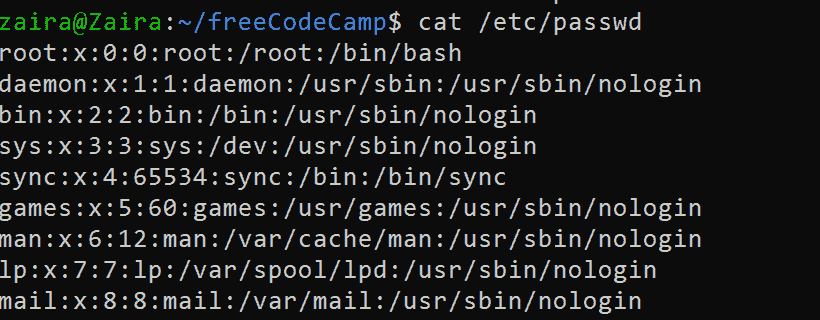
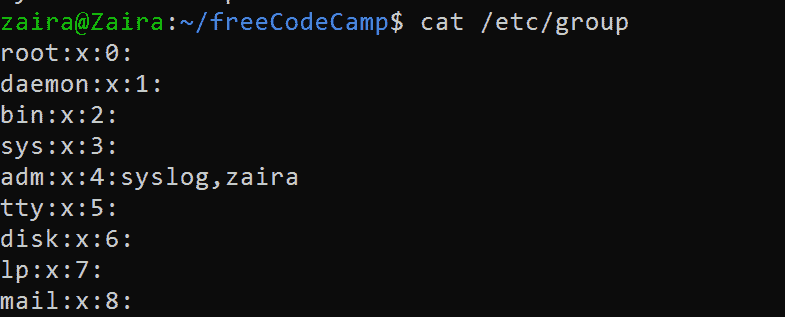
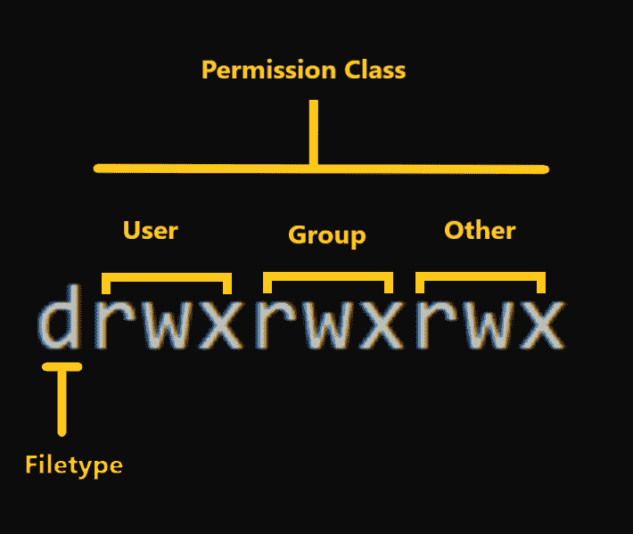

# Linux 权限–如何找到文件的权限

> 原文：<https://www.freecodecamp.org/news/linux-permissions-how-to-find-permissions-of-a-file/>

Linux 是一个多用户操作系统，这意味着它支持单个系统上的多个用户。

每个用户都有自己的权限，为了提高安全性，这些权限可能会受到限制。例如，用户有一组特定的权限来访问文件，一些用户可以写，而另一些用户只能读。

在本教程中，我们将学习:

*   什么是用户和组，以及 Linux 中不同类型的用户..
*   查看所有权和权限。
*   了解读、写和执行权限。
*   通过符号模式读取权限。

## Linux 中的用户和组

在理解权限之前，我们应该理解`users`和`groups`，因为所有权和权限适用于这些实体。

### Linux 中的用户和用户类型

用户有两种类型:`system users`和`regular users`。

*   **系统用户**负责在系统上运行非交互的后台进程。比如:`mail`、`daemon`、`syslog`等等。
*   **普通用户**是实际登录系统并交互执行指定任务的用户。

我们可以通过查看/etc/passwd 文件来检查系统中用户的详细信息。`:`前的第一列显示用户名。

```
cat /etc/passwd
```

Command to find users on a system



Contents of /etc/passwd file

### 超级用户或`root`用户。

除了这两种用户类型之外，还有超级用户或`root`用户，他们拥有更高的权限。该用户有权创建和修改用户，以及覆盖任何文件所有权和权限。

其他用户帐户也可以配置为拥有“超级用户”权限。最佳实践是使用“sudo”向普通用户授予提升的权限。能够“sudo”的用户也可以执行与 root 用户相同的任务。

### Linux 中的组

用户可以属于组。组是用户的集合。组定义了它所包含的用户的集体权利。一个用户也可以属于多个组。

我们可以通过查看`/etc/group`文件来查看系统上的组。

```
cat /etc/group 
```

Viewing groups



Contents of `/etc/group` file.

## 如何在 Linux 中查看所有权和权限

现在我们知道了用户和组。让我们看看如何查看文件或文件夹的权限。

我们可以使用长列表，它是带有标志`-l`的`ls`命令。

`ls -l`


Output of long listing

让我们仔细看看上面输出中的模式列。



Mode details in long listing.

**模式**定义了两件事:

*   **文件类型:**文件类型定义了文件的类型。对于包含简单数据的常规文件，它是空白的`-`。对于其他特殊文件类型，符号是不同的。对于一个特殊文件的目录，它是`d`。操作系统会对特殊文件进行不同的处理。
*   **权限类:**下一组字符分别定义用户、组和其他人的权限。
    –**用户**:这是一个文件的所有者，文件的所有者属于这个类。
    –**组**:文件所在组的成员属于该类
    –**其他**:不属于用户或组类的任何用户都属于该类。

### 如何读取符号权限

`rwx`表示被称为权限的符号表示。在权限集中，

*   **`r`** 代表**读作**。它在三和弦的第一个字符中表示。
*   **`w`** 代表**写**。它在三和弦的第二个字符中表示。
*   **`x`** 代表**执行**。它在三和弦的第三个字符中表示。

## 理解符号权限

### 阅读

对于常规文件，读取权限允许以只读方式打开文件。用户不能修改该文件。

类似地，对于目录，读取权限允许在不修改目录的情况下列出目录内容。

### 写

当文件具有写权限时，用户可以修改(编辑、删除)文件并保存它。

对于文件夹，写权限使用户能够修改其内容(创建、删除和重命名其中的文件)，并修改用户具有写权限的文件的内容。

### 执行

对于文件，执行权限允许用户运行可执行脚本。对于目录，用户可以访问它们，并访问目录中文件的详细信息。

## Linux 中的权限示例

现在我们知道如何读取权限。让我们看一些例子。

*   `-rwx------`:只有其所有者才能访问和执行的文件。
*   `-rw-rw-r--`:可以被其所有者和组修改但不能被其他人修改的文件。
*   `drwxrwx---`:可以被其所有者和组修改的目录。

## 包扎

在本教程中，我们已经了解了 Linux 中的用户和组。我们还学习了如何读取和查看权限。

理解这些权限很重要，因为它们是系统管理的关键部分。

你从这个教程中学到的最喜欢的东西是什么？在 [Twitter](https://twitter.com/hira_zaira) 上告诉我！

你可以在这里阅读我的其他帖子[。](https://www.freecodecamp.org/news/author/zaira/)