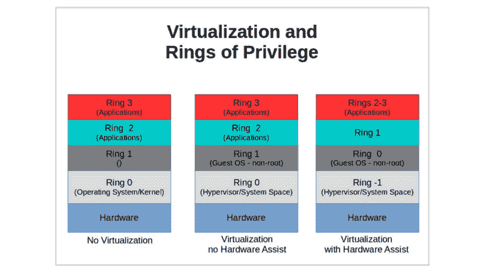
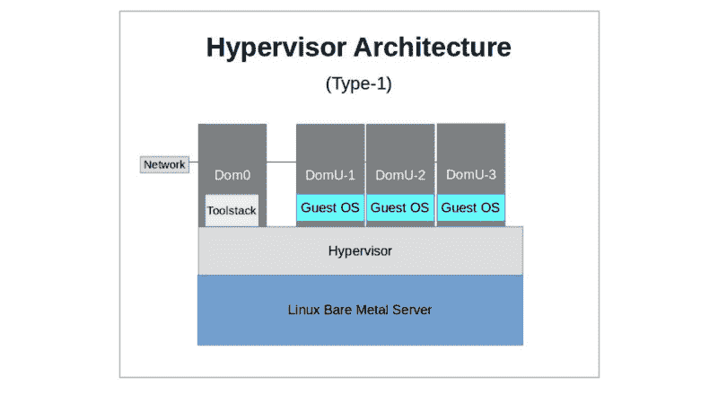
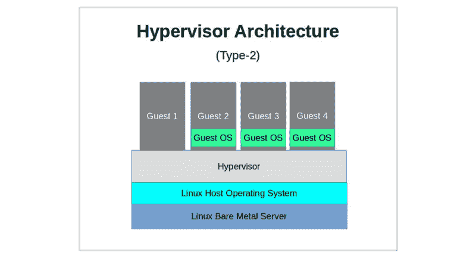
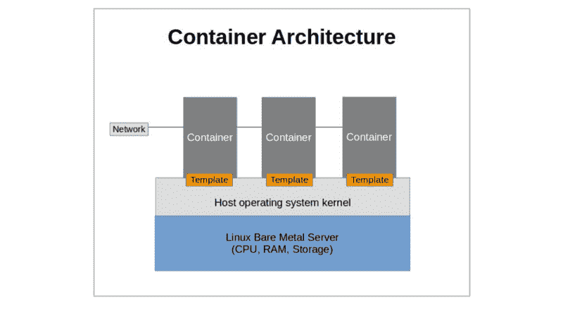

# Linux 服务器虚拟化:基础知识

> 原文：<https://www.freecodecamp.org/news/linux-server-virtualization-the-basics/>

摘自我的书: [*自学 Linux 虚拟化和高可用性:准备 LPIC-3 304 认证考试*](https://www.amazon.com/gp/product/B06XTZ4YWQ/ref=as_li_tl?ie=UTF8&camp=1789&creative=9325&creativeASIN=B06XTZ4YWQ&linkCode=as2&tag=projemun-20&linkId=fa7577d96ed91ffe111b08665bcb53f9) *—也可从我的* [*Bootstrap-IT 网站*](https://bootstrap-it.com/) *。*

尽管可以使用越来越高效和强大的硬件，但直接在传统物理(或裸机)服务器上运行的操作不可避免地面临巨大的实际限制。构建和启动单个物理服务器的成本和复杂性意味着有效地添加或移除资源以快速满足不断变化的需求是困难的，或者在某些情况下是不可能的。在发布新配置或完整应用程序之前对其进行安全测试也可能是复杂、昂贵且耗时的。

正如先驱研究人员 Gerald J. Popek 和 Robert P. Goldberg 在 1974 年的一篇论文(“可虚拟化的第三代架构的正式要求”-ACM 17(7):412–421 的通信)中所设想的那样，成功的虚拟化必须提供一个环境:

*   相当于物理机的访问，因此软件对硬件资源和驱动程序的访问应该与非虚拟化的体验没有区别。
*   允许客户端完全控制虚拟化系统硬件。
*   尽可能直接在底层硬件资源(包括 CPU)上高效地执行操作。

虚拟化允许在多个虚拟实体之间分配物理计算、内存、网络和存储(“核心四”)资源。每个虚拟设备在其软件和用户环境中被表示为实际的独立实体。如果配置得当，虚拟隔离的资源可以提供更安全的应用程序，而环境之间没有可见的连接。虚拟化还允许几乎即时调配和运行新的虚拟机，然后在不再需要时立即销毁它们。

对于支持不断变化的业务需求的大型应用程序来说，快速扩展和缩减的能力决定着生存和失败。虚拟化提供的这种适应性允许脚本在几秒钟内添加或删除虚拟机，而不是购买、调配和部署物理服务器所需的数周时间。

### 虚拟化的工作原理

在非虚拟条件下，x86 体系结构严格控制哪些进程可以在四个精心定义的特权层(描述为环 0 到环 3)中运行。

通常，只有主机操作系统内核才有机会访问保存在 Ring 0 中的指令。然而，由于您无法让运行在一台物理计算机上的多个虚拟机平等地访问 ring 0 而不带来大麻烦，因此必须有一个虚拟机管理器(或“管理程序”)，其工作是有效地将对内存和存储等资源的请求重定向到它们的虚拟化对等项。

当在没有 SVM 或 VT-x 虚拟化的硬件环境中工作时，这是通过称为*陷阱和仿真以及二进制翻译*的过程来完成的。在虚拟化硬件上，这样的请求通常可以被虚拟机管理程序捕获，适应虚拟环境，并传递回虚拟机。

简单地添加一个新的软件层来提供这种级别的协调将会给系统性能的几乎所有方面增加显著的延迟。一个非常成功的解决方案是在 CPU 中引入新的指令集，创建一个所谓的“Ring -1 ”,充当 Ring 0，并允许客户操作系统在不影响其他无关操作的情况下运行。

事实上，如果实施得好，虚拟化允许大多数软件代码完全按照正常方式运行，而不需要任何陷阱。

尽管仿真通常在虚拟化部署中扮演支持角色，但它的工作方式却截然不同。虽然虚拟化寻求在多个用户之间划分现有的硬件资源，但仿真的目标是让一个特定的硬件/软件环境*模拟*一个实际上并不存在的环境，以便用户可以启动原本不可能的进程。这需要模拟所需底层硬件环境的软件代码来欺骗您的软件，使其认为它实际上正在其他地方运行。

仿真实现起来可能相对简单，但它几乎总是会带来严重的性能损失。

传统上有两类管理程序:类型 1 和类型 2。

*   ****【Type-1】****裸机虚拟机管理程序作为机器的操作系统启动，有时通过主特权虚拟机(VM)保持对主机硬件的完全控制，将每个来宾操作系统作为系统进程运行。XenServer 和 VMWare ESXi 是第一种类型的突出现代示例。近年来，术语“虚拟机管理程序”的流行用法已经扩展到包括所有主机虚拟化技术，但曾几何时，它仅用于描述类型 1 系统。涵盖所有类型的更通用的术语原本应该是“虚拟机监视器”。就目前人们使用的术语虚拟机监视器而言，我怀疑他们指的是所有迭代中的“管理程序”。

*   ****【类型 2】****托管的管理程序本身就是运行在普通操作系统堆栈上的简单进程。第二类虚拟机管理程序(包括 VirtualBox，在某些方面还包括 KVM)为客户操作系统提取主机系统资源，提供了一个私有硬件环境的假象。

### 虚拟化:光伏与 HVM

虚拟机(VM)完全虚拟化。或者，换句话说，他们认为自己是常规的操作系统部署，在自己的私有硬件上过着幸福的生活。因为它们不需要像独立操作系统那样与环境交互，所以它们可以运行现成的未经修改的软件堆栈。然而，在过去，这种兼容性是有代价的，因为通过仿真层转换硬件信号需要额外的时间和周期。

另一方面，半虚拟(PV)客户至少部分了解他们的虚拟环境，包括他们与其他虚拟机共享硬件资源的事实。这种意识意味着 PV 主机不需要模拟存储和网络硬件，并提供高效的 I/O 驱动程序。从历史上看，这使得 PV 虚拟机管理程序能够为那些需要连接到硬件组件的操作实现更好的性能。

然而，为了提供对虚拟环 0(即环 1)的访客访问，现代硬件平台——特别是英特尔的 Ivy Bridge 架构——引入了一个新的 CPU 指令集库，允许硬件虚拟机(****【HVM】**)虚拟化跳过陷阱和仿真瓶颈，并充分利用硬件扩展和未修改的软件内核操作。**

最新的英特尔技术扩展页表(EPT)也可以显著提高虚拟化性能。

因此，对于大多数用例，您现在会发现 HVM 提供了更好的性能、可移植性和兼容性。

### 硬件兼容性

至少一些虚拟化特性需要硬件支持，尤其是来自主机 CPU 的支持。因此，你应该确保你的服务器拥有你要交给它的任务所需要的一切。您需要知道的大部分内容都保存在 ****/proc/cpuinfo**** 文件中，特别是每个处理器的“标志”部分。由于会有这么多的旗帜，但是，你需要知道要寻找什么。

奔跑

> 【T0 美元抢旗/proc/cpuinfo】t1

…看看你的引擎盖下有什么。

### 容器虚拟化

正如我们所见，虚拟机管理程序 VM 是一个完整的操作系统，它与核心四硬件资源的关系是完全虚拟化的:它认为它正在自己的计算机上运行。

虚拟机管理程序从相同的 ISO 映像安装虚拟机，您可以下载并使用该映像将操作系统直接安装到空的物理硬盘上。

另一方面，容器实际上是一个应用程序，从一个类似脚本的模板启动，认为它是一个操作系统。在容器技术(如 LXC 和 Docker)中，容器只不过是软件和资源(文件、进程、用户)的抽象，它们依赖于主机内核和“核心四”硬件资源(即 CPU、RAM、网络和存储)的表示来做它们所做的一切。

当然，由于容器实际上是主机内核的独立扩展，所以在 Ubuntu 16.04 主机上虚拟化 Windows(或者运行不兼容 libc 版本的更老或更新的 Linux 版本)是不可能的。但是这项技术确实为难以置信的轻量级和多功能计算提供了机会。

### 移民

虚拟化模型还允许非常广泛的迁移、备份和克隆操作，甚至可以从正在运行的系统(V2V)进行。由于定义和驱动虚拟机的软件资源非常容易识别，因此在多个位置出于多种目的复制整个服务器环境通常不会花费太多精力。

有时，这并不比在一台主机上创建虚拟文件系统的归档文件，在另一台主机上的相同路径中将其解包，检查基本网络设置，然后启动它更复杂。大多数平台提供单一命令行操作来在主机之间移动来宾。

将部署从物理服务器迁移到虚拟化环境(P2V)有时会更加棘手。甚至创建一个简单物理服务器的克隆映像并将其导入到一个空的虚拟机中也会涉及到一些复杂性。完成后，您可能仍需要对设计进行大量调整，以充分利用虚拟化提供的所有功能。根据您要迁移的操作系统，您可能还需要将半虚拟化驱动程序整合到流程中，以使操作系统能够在新环境中正常运行。

如同服务器管理中的其他事情一样:仔细地提前计划。

*摘自我的书:* [*自学 Linux 虚拟化和高可用性:准备 LPIC-3 304 认证考试*](https://www.amazon.com/gp/product/B06XTZ4YWQ/ref=as_li_tl?ie=UTF8&camp=1789&creative=9325&creativeASIN=B06XTZ4YWQ&linkCode=as2&tag=projemun-20&linkId=fa7577d96ed91ffe111b08665bcb53f9) *。*

有兴趣学习部署实用的 Linux 管理项目吗？查看我的曼宁本， [*Linux 在行动*](https://www.manning.com/books/linux-in-action?a_aid=bootstrap-it&a_bid=4ca15fc9) *。*

或者，你可以尝试一个名为[*Linux in Motion*](https://www.manning.com/livevideo/linux-in-motion?a_aid=bootstrap-it&a_bid=0c56986f&chan=motion1)*的混合课程，它由两个多小时的视频和大约 40%的 Linux in Motion 文本组成。*