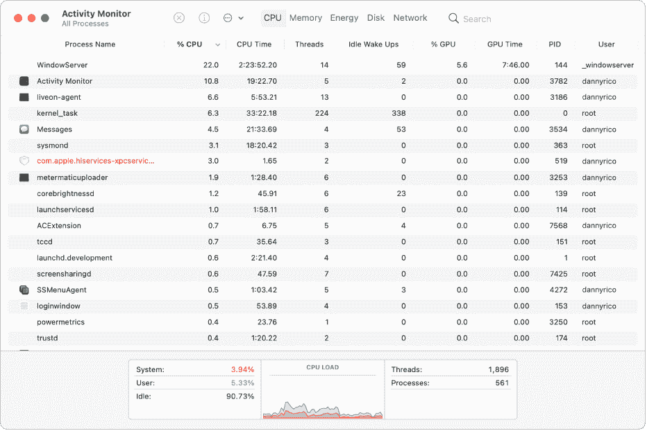
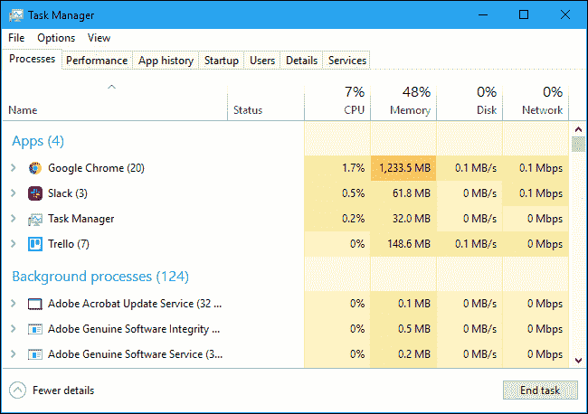
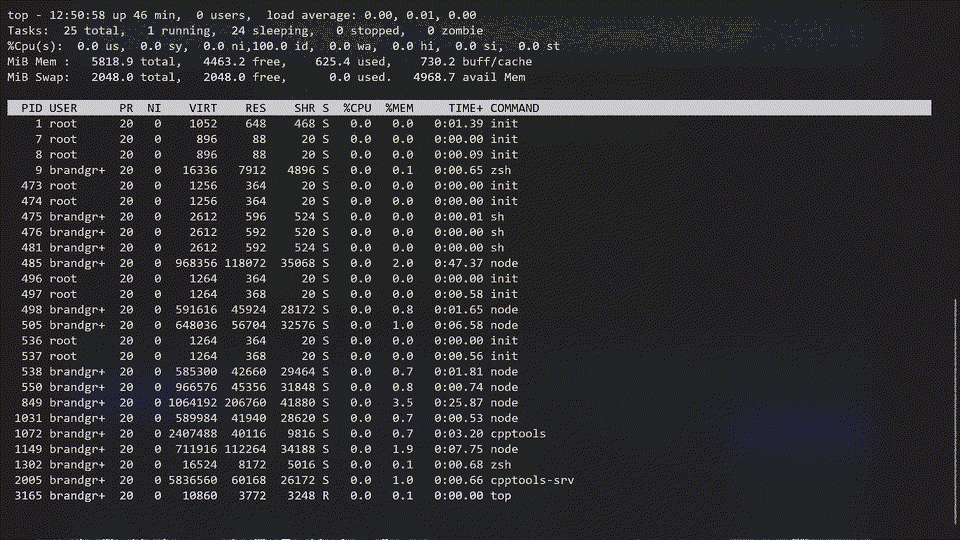
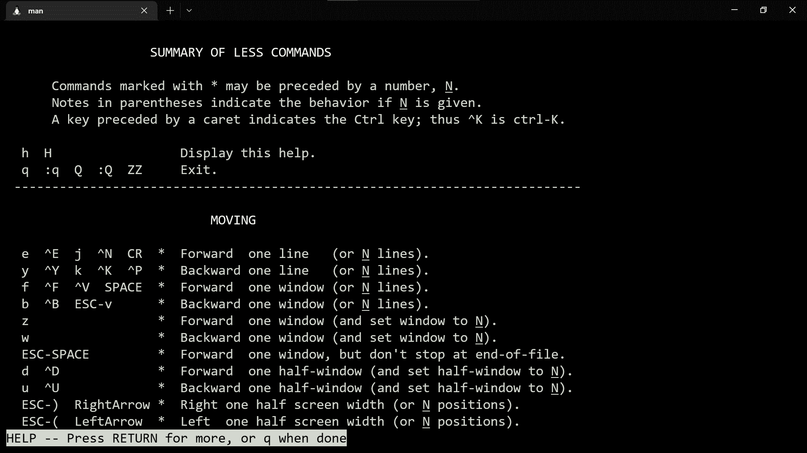
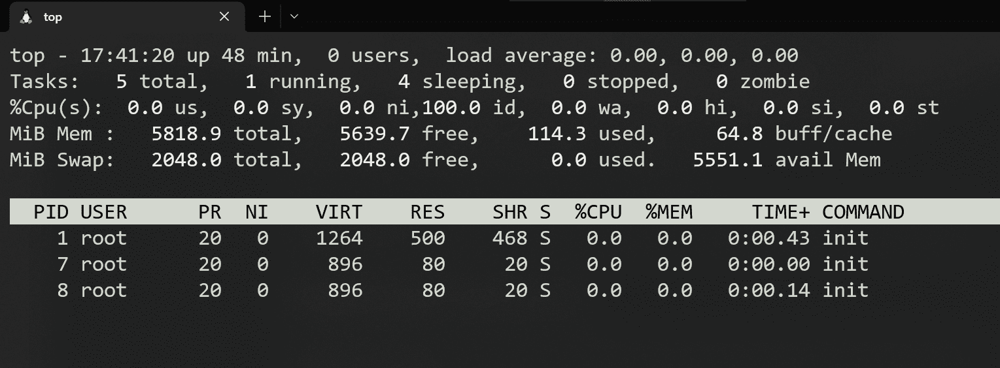
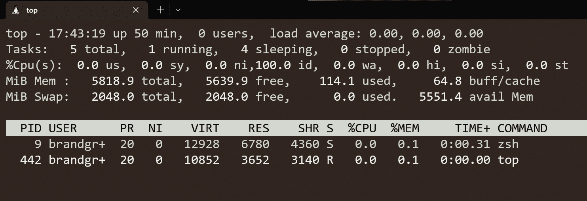
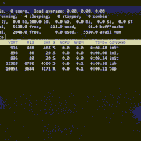
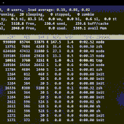
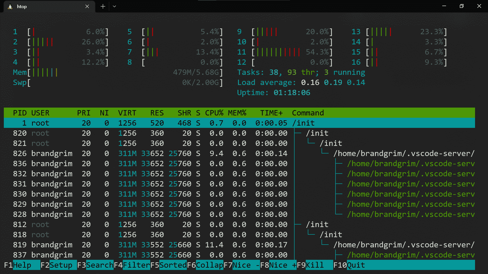

# 如何查看您的 Linux 进程

> 原文：<https://www.freecodecamp.org/news/linux-top/>

你可能习惯使用 MacOS 中的`Activity Monitor`或者 Windows 中的`Task Manager`来查看你的系统上正在运行的当前进程。

但是对于那些运行 Linux 的人来说，如果它包括双引导、虚拟箱，甚至是 WSL2，那么您可以使用一个有用的 Linux 命令来检查和查看您的操作系统中正在运行的所有进程。



MacOS Activity Monitor



Windows Task Manager

## Linux 的对等物是什么？

Linux 中的`top`(进程表)命令将显示所有的系统进程。如果您在终端中尝试此命令，您将看到以下内容:



这非常简洁——`top`程序显示了 Linux 系统中所有正在运行的进程的动态列表。

通常，这个命令显示当前由 Linux 内核运行/管理的系统信息的摘要。

要离开`top`,按下键盘上的`q`,退出交互式 shell。

### 这些列是什么意思？

*   **PID:** 显示任务的唯一进程 ID。
*   **用户:**显示哪个用户正在运行什么任务

比如你看到“root”和“brandgrim”。Root 是运行该进程的系统的根，而“brandgrim”(我！)是运行该进程的用户。

*   **PR:** 该数字表示进程优先级——数字越低，优先级越高。(直觉上有道理吧？)
*   **VIRT:** 任务使用的总虚拟内存
*   **RES:** 进程实际使用了多少 RAM，以 KB 为单位
*   这个数字代表一个特定任务所使用的共享内存大小
*   **%CPU:** 表示 CPU 使用率
*   **%MEM:** 代表内存使用量
*   **+TIME:** 描述了自任务开始以来该任务已经使用的总 CPU 时间
*   **命令:**实际启动进程的命令的名称

当你进入`top`的交互外壳时，你可以按下`h`调出`Summary of Less Commands`，这是`top`必须提供的所有命令的列表。



Showing the "Summary of Less Commands" in `top`

## 有用的标志和命令

有这么多独特的标志和命令，要知道使用哪一个似乎有些力不从心，尽管有一些标志马上就有用了。

### 如何按用户过滤

`-u`标志指定应该根据您指定的用户列出哪些进程。

例如，我们看到在**用户**栏下有“root”和“brandgrim ”,所以如果我们尝试这样做:

```
top -u root
```

我们将看到以下内容:



它列出了在“root”用户下运行的进程。另一方面，如果我们尝试这个命令:

```
top -u brandgrim 
```

我们将得到以下内容(显示在“brandgrim”用户下运行的进程):



### 如何更改刷新间隔

默认情况下，top 的屏幕刷新间隔设置为 3.0 秒。如果您想增加或减少时间间隔，您可以在`top`交互外壳中按`d`来设置所需的时间。



Showing how to change the refresh interval

### 如何按 CPU 利用率对进程进行排序

为了根据使用的 CPU 数量对所有 Linux 进程进行排序，您需要按下`SHIFT + P`键，以便在`top`中对它们进行排序。现在你知道是什么占据了你的 CPU——那个讨厌的无限运行的 while 循环！

例如，当我打开 VSCode 过滤我的进程时，我看到的是:



您可以看到，CPU 利用率最初非常高，尽管随着 VSCode 加载到我的所有扩展和 Intellisense 中，它开始下降。

### 如何在文件中保存顶级进程

要将所有正在运行的 top 命令结果保存到一个文件中，可以使用以下命令:

```
top -n 1 -b > top-processes.txt
```

## `top`替代品

有大量的`top`备选方案，比如`Htop`、`Vtop`、`Gtop`、`Gotop`等等——尽管我不会在本文中涵盖所有这些。

`Htop`是目前最受欢迎的`top`选择，这要归功于它的交互式菜单以及垂直和水平滚动的能力。更不用说`Htop`还可以让你以树状结构查看你的流程，更容易可视化。



Htop (looks cool!)

# 结论

`top`是一个交互式 shell，允许您在实时视图中查看所有 Linux 进程。它显示系统信息以及 Linux 内核当前使用的进程或线程列表。

`top`自带有用的命令，比如`-u`标志和`d`命令。还有一些更现代的`top`替代品，比如`Htop`，它提供了一个更丰富多彩、更具交互性的外壳。

[https://tenor.com/embed/20223386](https://tenor.com/embed/20223386)

Source: https://tenor.com/view/how-linux-users-install-a-web-browser-linux-linux-users-gif-20223386

希望这对你有帮助！感谢您的阅读:)