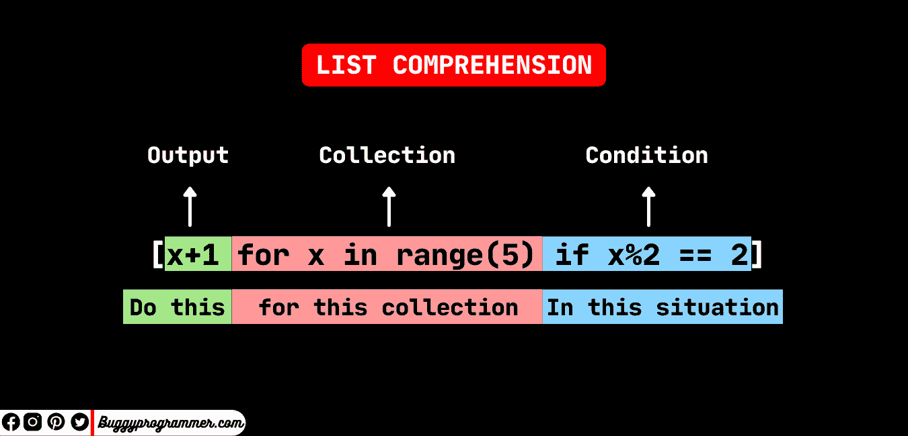

# 为初学者讲解 Python 中的列表理解

> 原文：<https://www.freecodecamp.org/news/list-comprehension-in-python/>

List comprehension 是一种从任何现有的 iterable 对象创建列表的易读、紧凑和优雅的方式。基本上，从现有列表中的值创建新列表是一种更简单的方法。

它通常是用方括号括起来的单行代码。您可以使用它来过滤、格式化、修改现有的可重复项，如字符串、元组、集合、数据帧、数组列表等，或者执行其他小任务。

在这节简短的课中，我们将看到一些不同的方法来创建列表理解，并看到它的一些变体，如:

*   简单列表理解
*   使用单一和嵌套 if 条件列出理解
*   用单个和多个 if 和 else 条件列出理解
*   嵌套 for 循环的列表理解

除此之外，我们还将了解以下概念:

*   对于循环和列表理解
*   列表理解有什么好处？
*   何时使用，何时避免列表理解。

## Python 中的列表理解是什么？

所以，我们先从列表理解的语法开始。列表理解是您在方括号内编写的单行代码。它有三个组成部分:

1.  For 循环
2.  条件和表达式
3.  输出



**Syntax of list comprehension** -Credit [buggyprogrammer](http://buggyprogrammer.com/)

### 简单列表理解示例

下面的代码片段是理解最简单列表的一个例子。这里我们只是循环遍历`lst`并将它的所有元素存储在列表`a`中:

```
lst = [1,2,3,4,5,6,7,8,9,10]
# simple list comprehension
a = [x for x in lst]
print(a)

# ouput
[1, 2, 3, 4, 5, 6, 7, 8, 9, 10]
```

上面的代码相当于:

```
for x in lst:
    a.append(x)
```

为了实现这一点，我们甚至不需要列表理解中的 append 方法。

现在在上面的代码(列表理解)中，你可以使用任何表达式来修改`lst`的元素，例如:

```
# add any number to every elements of lst and store it in a
a = [x+1 for x in lst]

# subtract any number to every elements of lst and store it in a
a = [x-1 for x in lst]

# multiply any number to every elements of lst and store it in a
a = [x*2 for x in lst]
```

## 使用单一和嵌套 If 条件列出理解

在列表理解中，我们还可以添加一个`if`条件，可以帮助我们筛选数据。例如，在下面的代码中，我们将列表`c`中`lst`的所有值存储为大于 4 的值:

```
lst = [1,2,3,4,5,6,7,8,9,10]
# with if condition
c = [x for x in lst if x > 4]
print(c)

# output
[5, 6, 7, 8, 9, 10]
```

上面的代码相当于:

```
for x in lst:
    if x > 4:
        a.append(x) 
```

我们还可以在我们的列表理解中添加一个`nested if`条件。例如，在下面的代码中，我们存储了列表`d`中`lst`的所有元素，这些元素的值大于 4 并且可以被 2 整除:

```
# with multiple if 
d = [x for x in lst if x > 4 if x%2 == 0]

# output
[6, 8, 10] 
```

上面的代码相当于:

```
for x in lst:
    if x > 4:
        if x % 2 == 0:
            a.append(x)
```

## 用单个和多个 If 和 Else 条件列出理解

好的，现在我们来看看如何在列表理解中将`else`和`if`相加。

在这里，我们创建了一个简单的 list comprehension，它将存储 list `e`中所有大于 4 的值——否则，如果值小于 4，它将存储字符串`“less than 4”`。

```
lst = [1,2,3,4,5,6,7,8,9,10]
# with if and else condition
e = [x if x > 4 else 'less than 4' for x in lst]
print(e)

# output
['less than 4', 'less than 4', 'less than 4', 'less than 4', 5, 6, 7, 8, 9, 10]
```

上面的代码相当于:

```
for x in lst:
    if x > 4:
        d.append(x)
    else: 
        d.append('less than 4')
```

现在我们来看看用多个`if and else`进行列表理解。

在下面的例子中，如果值能被 2 整除，我们将存储字符串`“Two”`。或者如果这个值能被 3 整除，我们就存储`“Three”`，否则我们就存储`“not 2 & 3”`。

```
# with more than one if and else condition
f = ['Two' if x%2 == 0 else "Three" if x%3 == 0 else 'not 2 & 3' for x in lst]
print(f)

# output
['not 2 & 3', 'Two', 'Three', 'Two', 'not 2 & 3', 'Two', 'not 2 & 3', 'Two', 'Three', 'Two']
```

那么这是如何工作的呢？为了理解这一点，我们可以把整个条件分成三部分，每一部分之后是:

```
'Two' if x%2 == 0 else "Three" if x%3 == 0 else 'not 2 & 3'
```

在这里，如果第一个`if`条件为真，那么它将取值`“Two”`，否则它将移动到第二个`if`条件，而不是存储任何其他值，就像`elif`命令一样。

现在在第二个`if`条件下，如果语句为真，它将保存`“Three”`。否则，它将检查下一个条件，我们没有。所以在`else`之后的任何值都将被存储，在我们的例子中是一个字符串`“not 2 & 3”`。

所以按照上面的传统方式，我们可以这样写完整的代码:

```
for x in lst:
    if x%2 == 0:
        f.append('Two')
    elif x%3 == 0:
        f.append('Three')
    else: 
        f.append('not 2 & 3')
```

你看到列表理解的力量了吗？它只用一行代码就完成了任务，而传统的 for 循环需要 7 行代码。

**你也可以阅读这篇文章➡** [用列表理解解决 Python fizzbuzz 挑战](https://buggyprogrammer.com/python-fizzbuzz/)来了解更多。

## 用嵌套的 For 循环列表理解

好吧！现在我们将看看列表理解如何与`nested for loop`一起工作。

为了理解这里发生了什么，让我们看看下面的例子。这里我们生成[1，2，3]和[3，2，1]所有可能的组合。

```
lst = [1,2,3]
lst_rev = [3,2,1]
g = [(x,y) for x in lst for y in lst_rev]
print(g)

#output
[(1, 3), (1, 2), (1, 1), (2, 3), (2, 2), (2, 1), (3, 3), (3, 2), (3, 1)] 
```

上面的代码也可以写成:

```
for x in lst:
    for y in lst_rev:
        f.append((x,y))
```

好了，现在正如我们承诺的，让我们看看 for 循环和列表理解之间的比较。

## 对于循环和列表理解

上面我们看到了 list comprehension 是如何在一行中完成一项任务的，而 for 循环是在多行中完成的。

列表理解不仅简洁，而且在性能方面比循环更容易阅读和更快。

在某些情况下，列表理解似乎比 for 循环快两倍。如果你想了解更多关于 list comprehension 的表现，你可以在这里了解它。

但是如果您想要执行多个简单的条件，list comprehension 将无法在不牺牲可读性的情况下处理它。这是理解列表的一个主要问题。

## 理解列表的好处

除了简单、紧凑和快速之外，列表理解在许多不同的情况下也是可靠的。你可以在各种情况下使用它。

除了基本的列表生成之外，您还可以使用列表理解来进行映射和过滤。你不需要对每种情况都采取新的策略。这是它被认为比 for 循环更 pythonic 化的原因之一。

## 何时使用列表理解(以及何时避免)

如果您正在对其他迭代对象执行简单的过滤、修改或格式化任务，您可以使用列表理解。如果你想让你的代码简洁易读，这也是一个不错的选择。

此外，当哪怕是一丁点儿的性能对您很重要时，您也可以使用它。

但是如果你有太多的过滤或修改条件要添加，你应该避免使用列表理解，因为它会使你的代码更复杂，更难阅读。

## 结论

在这篇文章中，我们学习了什么是列表理解，它的好处是什么，以及什么时候我们应该使用它。我们看到了列表理解是如何简单、易读、紧凑，并且比 for 循环更快。

我们还学习了如何编写带或不带条件的列表理解，嵌套 if 和 else，以及嵌套 for 循环。

如果你喜欢这篇文章，那么你肯定也会喜欢我的其他博客。你可以访问我的个人网站[这里](http://buggyprogrammer.com/)。