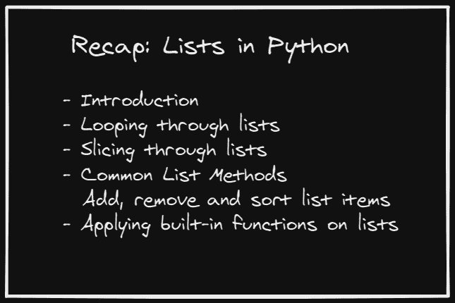
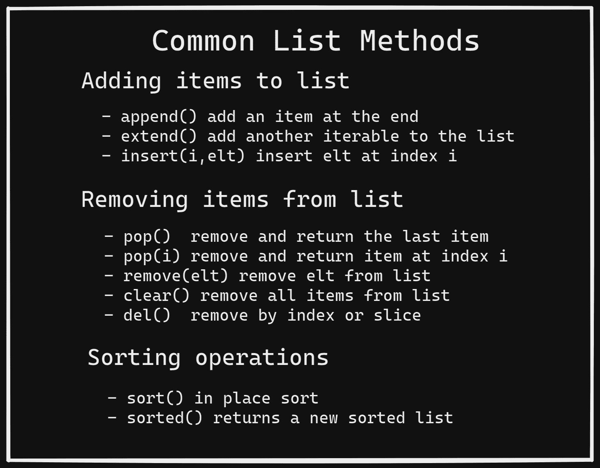

# Python 中的列表——综合指南

> 原文：<https://www.freecodecamp.org/news/lists-in-python-comprehensive-guide/>

让我们假设你打算去附近的商店购买必需品。你会做的第一件事是什么？

已经有答案了？是的，你可能会写下购物清单！Python 还有一个名为`List`的内置数据结构，非常类似于您的购物清单。

这篇文章是关于 Python 列表的初学者友好教程。在接下来的几分钟里，我们将了解列表，并涵盖一些最常见的操作，比如对列表进行切片，以及使用列表方法修改列表。

因此，让我们继续学习更多关于 Python 列表的知识，看看它们与我们的购物列表有什么相似之处。

> 让我们上车一起去购物吧！

## Python 中列表的工作方式

把购物清单上的项目一个接一个地写下来是很自然的。为了让 Python 识别我们的列表，我们必须用方括号`([ ])`将所有列表项括起来，用逗号将列表项*隔开。*

这里有一个例子，我们创建了一个包含 6 件我们想买的物品的列表。

```
shopping_list = ['apples','pens','oatmeal  cookies','notepad','brushes','paint'] 
```

## Python 中列表的可变性

就像我们总是可以通过重新排序项目来修改我们的购物清单一样——例如，用我们最喜欢的`candy`替换`oatmeal cookies`——我们可以对 Python 列表做同样的事情。

由于这个原因，列表是**可变的**。下面是我们如何用列表中的`candy`替换`oatmeal cookies`的方法。

```
shopping_list[2] = 'candy'
print(shopping_list)
# Output
>> ['apples', 'pens', 'candy', 'notepad', 'brushes', 'paint']
```

### Python 列表中的索引

您是否注意到`oatmeal cookies`是列表中的第三个项目，但是在索引`2`处？嗯，这是因为**零索引**。在 Python 中， **`index`** 本质上是从列表开始的一个*偏移量。*

> 这就是为什么第一个元素在索引`0`(无偏移)，第二个元素在索引`1`，等等。一般来说，如果列表有 n 个元素，最后一个元素在索引`(n-1)`处。

如果我们试图访问一个无效索引处的元素，我们将得到一个`IndexError`。

在我们的例子中，我们的购物清单有 6 个元素(索引范围从 0 到 5)。如下面的代码片段所示，如果我们试图访问位于`index = 6`的元素，我们会得到一个错误，因为在索引`6`处没有元素。

```
print(shopping_list[6])
# Output
>> --------------------------------------------------------------------------
IndexError                                Traceback (most recent call last)
<ipython-input-21-a9f3b9517136> in <module>()
----> 1 shopping_list[6]

IndexError: list index out of range
```

另一方面，我们也可以使用**负指数**。*最后一个元素*位于索引`-1`处，倒数第二个元素*位于索引`-2`处，依此类推。*

```
print(shopping_list[-1])
# Output
>> paint
```

正如我们的购物清单可以包含任何类型的项目，比如水果、蔬菜、糖果等等，Python 清单也可以包含任何类型的项目。

也就是说，一个列表包含另一个小列表作为它的元素之一是完全正常的。这个过程称为嵌套，这样的列表称为嵌套列表。

这里有一个例子，我们的购物清单有两个更小的清单。
`my_nested_list = [['apple','banana'],['paint','brushes']]`

## 如何在 Python 中遍历列表

通读我们的`shopping_list`来检查我们是否已经购买了所有我们需要的东西是很常见的。这被称为遍历列表。

在 Python 中，可以使用循环和`in`操作符来实现这一点。

```
for item in shopping_list:
  print(item)
# Output 
apples
pens
candy
notepad
brushes
paint
```

如果我们要在列表上做一些操作，建议使用`range`来获得一组索引，然后我们可以遍历这些索引。

## 如何在 Python 中分割列表

如果我们只对查看我们`shopping_list`的一个子集感兴趣会怎么样？这将要求我们对列表进行切片，并检索项目的子集。

这里有一个通用模板:`list_name[start_index:end_index +1]`。现在让我们试着分析一下。

*   如果我们需要直到`end_index`的列表片段，在指定开始和结束索引时指定`end_index + 1`。
*   默认的`start_index`是`0`，默认的`end_index`是列表中最后一个元素的索引。
*   如果我们不指定`start_index`，切片从列表中的第一个元素开始。
*   如果我们不指定`end_index`，切片将扩展到列表中的最后一个元素。
*   如果我们没有指定这两个索引，那么返回的切片就是整个列表。

下面的代码片段说明了这一点。

```
print(shopping_list[2:])
# Output
>> ['candy', 'notepad', 'brushes', 'paint']

print(shopping_list[:2])
# Output
>> ['apples', 'pens']

print(shopping_list[:])
# Output
>> ['apples', 'pens', 'candy', 'notepad', 'brushes', 'paint']
```

## 如何在 Python 中操作列表

您可以对列表应用常见的内置函数，如`len()`、`min()`和`max()`，以分别获得列表的长度、最小元素和最大元素。

由于我们的`shopping_list`只有字符串，`min()`返回列表按字典顺序排序时第一个出现的字符串。`max()`返回最后出现的字符串。

您可以在下面看到这一部分的代码片段。

```
print(len(shopping_list))
>> 6

print(max(shopping_list))
>> pens

print(min(shopping_list))
>> apples
```

我们可以通过连接现有列表来创建一个新列表，就像我们总是可以将两个小的购物列表拼凑在一起来创建一个新列表一样。

```
list_2 = shopping_list + ['noodles','almonds']
print(list_2)

>> ['apples', 'pens', 'candy', 'notepad', 'brushes', 'paint', 'noodles', 'almonds']
```

## Python 列表方法

除了可以对列表进行操作的内置函数之外，Python 还有几个 list 方法可以帮助我们对列表执行有用的操作。

让我们考虑一下我们的`shopping_list`。我们可能会在列表中执行哪些常见操作？让我们列出几个:

*   将一个/多个商品添加到我们的`shopping_list`
*   从我们的`shopping_list`中删除一个/多个项目
*   在我们的`shopping_list`中重新排序项目

### 如何在 Python 中向列表添加元素

我们可以使用`append()`方法将条目添加到列表的末尾，一次添加一个。让我们将`grapes`添加到我们的`shopping_list`中。

```
shopping_list.append('grapes')
print(shopping_list)

>> ['apples', 'pens', 'candy', 'notepad', 'brushes', 'paint', 'grapes']
```

如果我们有另一个列表(或任何其他可迭代的列表)要添加到现有列表中，该怎么办？我们可以使用`extend()`方法将整个列表添加到第一个列表中，而不是逐个添加新列表中的项目，如下所示。

```
shopping_list.extend(['protein bars','cheese'])
print(shopping_list)

>> ['apples', 'pens', 'candy', 'notepad', 'brushes', 'paint', 'grapes', 'protein bars', 'cheese']
```

**注意**:列表方法`append()`和`extend()`以及连接两个列表的'+'操作符之间有一个固有的区别。

当'+'操作符通过组合我们指定为操作数的列表来创建新列表时，方法`append()`和`extend()`修改它们被调用的列表，并且不返回新列表。

### 如何在 Python 中从列表中移除元素

我们可以使用下面的方法从列表中移除元素，单个元素或一组元素。

`pop()`方法返回列表中的最后一项并删除它，如下所示。`cheese`是列表中的最后一项，现在已被删除。

```
last_element = shopping_list.pop()
print(shopping_list)
print(last_element)
# Output
>> ['apples', 'pens', 'candy', 'notepad', 'brushes', 'paint', 'grapes', 'protein bars']
>> cheese
```

如果我们想从一个特定的索引中删除一个条目，我们可以将`index`指定为`pop()`的一个参数。

```
not_needed = shopping_list.pop(2)
print(not_needed)
# Output
>> candy
```

如果我们不需要访问被删除列表项的值，我们可以选择使用`del`函数来代替。

我们可以通过指定索引来删除特定索引处的项，也可以通过对列表进行切片来删除列表切片中的所有项，如前一节所述。

```
del shopping_list[1]
print(shopping_list)
# Output
>> ['apples', 'notepad', 'brushes', 'paint', 'grapes', 'protein bars']
```

假设我们知道不再需要购买的商品，但不知道该商品处于哪个指数。在这些情况下，我们可以使用`remove()`方法按名称删除一个项目。

在我们的例子中，在我们最近的副本中索引为`1`的项目是`pens`。如果我们不知道`pens`的索引，我们可以编写`shopping_list.remove('pens')`来完成与上面代码片段相同的任务。

要从列表中移除所有元素，我们可以使用`list_name.clear()`。

**注意**:如果我们试图删除列表中不存在的元素，我们会得到一个`ValueError`。

## 如何在 Python 中对列表进行排序

我们可以通过调用`sort()`方法来选择对我们的`shopping_list`进行排序。由于我们的列表只有字符串，`sort()`将按照字母顺序对列表进行排序。如果我们有一个数字列表，默认情况下，元素将按升序排序。

如果您想按降序排序，请设置可选参数`reverse = True`。

**注意**:调用`sort()`方法会修改已有的列表，不会创建新的列表。如果您想在保持现有列表不变的同时拥有一个新的排序列表，请使用`sorted()`方法。

```
shopping_list.sort()
print(shopping_list)
# Output
>> ['apples', 'brushes', 'grapes', 'notepad', 'paint', 'protein bars']
```

另一个有用的方法是`count`，你可以用它来检查一个特定的条目在我们的列表中出现了多少次。`list_name.count(elt)`返回`elt`在列表`list_name`中出现的次数。

## 概述

⌛，现在是时候快速回顾一下了。看下面的图片，看看你是否能回忆起我们到目前为止读过的内容。



📌这是我为列表方法准备的另一个有用的查找表，你可以保存它作为参考。



不久我们将在 Python 的另一篇文章中再见。🙂在那之前，快乐学习和编码！

### 参考

[1] [免费代码营上的人人用 Python](https://www.freecodecamp.org/learn/scientific-computing-with-python/)

[2][https://docs.python.org/3/tutorial/datastructures.html](https://docs.python.org/3/tutorial/datastructures.html)