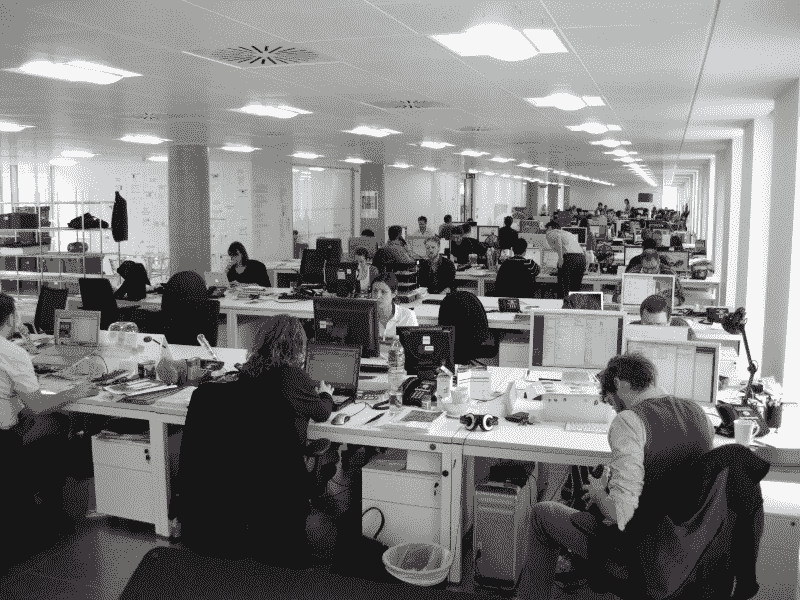
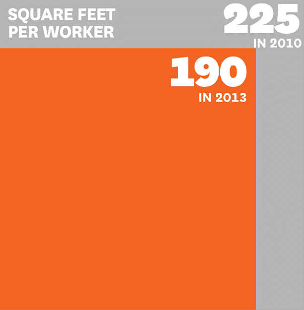
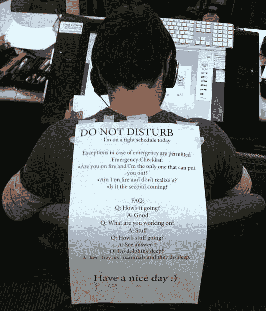
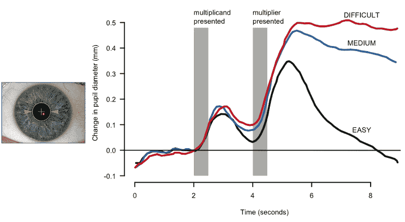
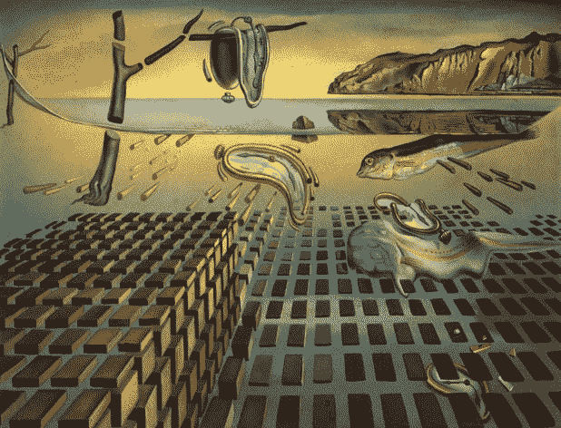

# 异步直播。

> 原文：<https://www.freecodecamp.org/news/live-asynchronously-c8e7172fe7ea/>

去年我关掉了所有的通知。我不再预约会议了。我开始异步生活。

现在，我不再整天被打扰——或者从一个会议赶到另一个会议——而是坐下来完成工作。

我工作很多。我每天与数百人交流。我广泛合作。但是我按照我自己的方式，按照我自己的节奏去做。

你也可以更加异步地生活。我来解释一下好处。我会告诉你怎么做。

“A Million Times” by [Humans Since 1982](http://www.humanssince1982.com/) (2016 — mixed media)

我们将从谈论干扰——甚至是有计划的干扰——如何摧毁你的生产力开始。

但是首先，一个网络漫画:

你看到发生了什么吗？老板来了，完全破坏了开发商的思路。为了什么？通知他们下次查看电子邮件时，会有一条信息在那里？

当你打断一个开发人员时，他们平均需要 10 分钟才能回到高效的编码状态。

那么，为什么现在 70%的办公室都是这个样子呢？

大多数研究得出了与这篇被广泛引用的论文相同的结论:人们讨厌开放式办公室。

雇主们选择牺牲工作满意度和生产率，这样他们就可以在旧金山每平方英尺 72 美元的办公室里多放几条沙丁鱼。

Alt text: From 225 square feet per worker in 2010 down to 190 in 2013\. Source: [Harvard Business Review](https://hbr.org/2014/10/balancing-we-and-me-the-best-collaborative-spaces-also-support-solitude)

他们打着降低沟通障碍的幌子这样做。但是如果你仔细想想，他们应该抚养他们。

因为当你需要在开放式办公室里完成一些真正的工作时，会发生这样的事情:

Get this guy a private office, before a competitor does.

### 达到那种流动状态

让我们来谈谈我们人类是如何完成工作的。

是四个小时粉碎它，午休，然后再粉碎它四个小时？

不，它更像是咖啡、电子邮件、咖啡、会议、咖啡、与同事共进午餐、咖啡——好了，终于到了完成工作的时候了！

你知道吗，一般的开发人员每天只能不间断地工作[两个小时](http://blog.ninlabs.com/2013/01/programmer-interrupted/)？另外 6 个小时，他们处于不同的分心状态。

但这是他们独处的两个小时里发生的事情。

他们热身。

他们检查日志、问题，思考需要做什么。

他们钻研代码。

他们的瞳孔放大。

他们进入心理学家米哈里·契克森米哈所说的“心流状态”

如果你曾经“在最佳状态”或“在最佳状态”，那就是这样。精力充沛的快乐状态。流动。

如果你的工作需要哪怕一盎司的创造力，你会在这些心流状态中的一种状态下做得最好。

是的，你可以在一个开放式的办公室里达到一种流畅的状态，降噪耳机可以调到 11 度。但是当你一个人呆在一个安静舒适的房间里的时候，就容易多了。

所以米哈里发现任务转换会彻底摧毁你的生产力。像收到一条关于晚餐的短信这样平凡的事情会彻底抹去你工作记忆中所有的杂耍。它会让你脱离心流状态。

大多数米哈里的研究员同事都同意这个观点。在不同的任务之间转换会有很大的代价。

米哈里花了接下来的 30 年研究心流状态。他发表了大量论文。他做一些咨询。他在伯克利教书。他写了一些书。这里有一个很好的例子。

但是大多数情况下，雇主不会听。

他们继续把他们的团队挤在嘈杂的开放式办公室里。

他们继续用会议来点缀他们团队的日子。

他们希望他们的团队能对邮件或空闲做出回应，这进一步粉碎了他们达到流畅状态并完成一些实际工作的希望。

你认为托尔斯泰会在一个开放的计划办公室里写《战争与和平》吗？

你认为莫扎特能在单口相声和单口相声之间创作出《费加罗的婚礼》吗？

你认为托沃兹会设计每 15 秒弹出一次松弛通知的 Linux 内核吗？

A still from [Let Forever Be](https://www.youtube.com/watch?v=s5FyfQDO5g0)

### 如何异步生活

你可以做以下三件事来恢复你的心流状态。

我会假设，像大多数人一样，你非常忙。你对每天在新闻提要中看到的大量提高生产力的建议持怀疑态度。你可能不会张开双臂迎接生活方式的重大改变。

因此，我将按照承诺要求的递增顺序来介绍这些内容。一个 Dalí Clock 意味着你可以在完成这篇文章后立即做这件事。四个 dalíclock 意味着你需要一个完整的行动计划来实现飞跃。

### 提示 1:尽可能多地关闭通知(难度:1 达利钟)

还记得微软 Outlook 增加的功能吗？每次你收到一封邮件，它都会给你一个通知。你把它关了，对吧？

很好。现在关掉你手机和电脑上几乎所有的通知。

你真的需要在今晚回家的路上得到一个新播客的通知吗？或者你阿姨喜欢你两天前午餐时拍的照片？

你真正需要的唯一通知是 100 年前的老待机:电话铃响。

因为如果真的很重要，人家会打电话的。

我在美食街找不到你。打电话。

你的孩子在学校吐了。打电话。

服务器正在融化。打电话。

我的一些朋友仍然会开着短信通知。我也这样做了几年。但几个月前我把这些关掉了。到目前为止，还没有飞机从天上掉下来。

另外，当人们希望在 24 小时内收到你的回复时——而不是 10 分钟——他们会花时间认真思考他们想对你说什么。别再发“你好”的短信了。还是那句老话:“我能问你个问题吗？”

顺便说一下，只是为了好玩，这里是没有通知的极端反面:

### 秘诀 2:通过逃避会议来保护你的时间(难度:2 达利钟)

下次你开会时，做一个快速实验。写下所有讨论过的重要事情，这些事情不能在邮件中提及。

可能有几个。但是这些事情真的值得你花 30 到 60 分钟离开工作吗？

电子邮件激发了我们所有人心中的海明威。当有人无法在电子邮件中表达自己的观点时，这仅仅意味着他们将更难当面解释清楚。

下次有人写信问你是否有时间见面，试着回复:“你想谈什么？”

他们会给你回信的。

然后回答:“好吧——你对此有什么想法？”

他们会给你回信的。

如果有必要的话，用你自己的想法来回应。或者直接说:“好的——听起来不错。”

唷。会议已回避。

有时你会在 LinkedIn 上收到一个开朗的陌生人发来的信息:“我们喝杯咖啡叙叙旧吧！”或者一个同事发来的信息:“我能不能去你的办公桌旁，向你请教一下？”

如果这些人重视你的时间，他们会直接告诉你他们想要什么。但很多时候，他们并不清楚自己到底想要什么。

除非他们很清楚自己想要什么，并且他们愿意提前告诉你，否则不要花宝贵的时间去见他们。

很多人可能会因为你不接受他们的会议请求而生气。要有礼貌和耐心，告诉他们你很高兴在这里回答他们的问题——通过电子邮件链或即时消息客户端——无论在哪里。

你的时间是你最宝贵的财富。保护好它。不要让别人轻率的浪费掉。

### 提示 3:要求一间私人办公室，或者在家工作(难度:4 达利钟)

远程工作有巨大的好处。当你有 4 分钟的时候，看看这篇文章:[钳工。更开心。更有效率。远程工作。分布式团队的经济分析。](https://medium.freecodecamp.com/the-economics-of-working-remotely-28d4173e16e2)

当你远程工作时，13%的生产率提高是因为你不在一个嘈杂的办公室里。

如果你不能远程工作——或者如果你是许多享受工作场所能量的人之一——要求一间私人办公室。

如果你重视你的生产力(和你的理智)，考虑在你的[工作邀请谈判](https://medium.freecodecamp.com/how-not-to-bomb-your-offer-negotiation-c46bb9bc7dea)中优先考虑这一点，或者下次你[和你的老板讨论加薪](https://medium.freecodecamp.com/youre-underpaid-here-s-how-you-can-get-the-pay-raise-you-deserve-fafcf52956d6?source=user_profile---------27-)的时候。

### 该思考了。创造的时间到了。时间终于够了。

最后，我强烈推荐皮克斯创始人之一的这本书。

你可以了解他们在提高团队生产力和创造力方面的实验。除了其他方面，它还探索了他们会议的演变，他们对开放式计划的使用，以及他们向主要是私人办公室的转变。

感谢您的阅读，祝您编码愉快。