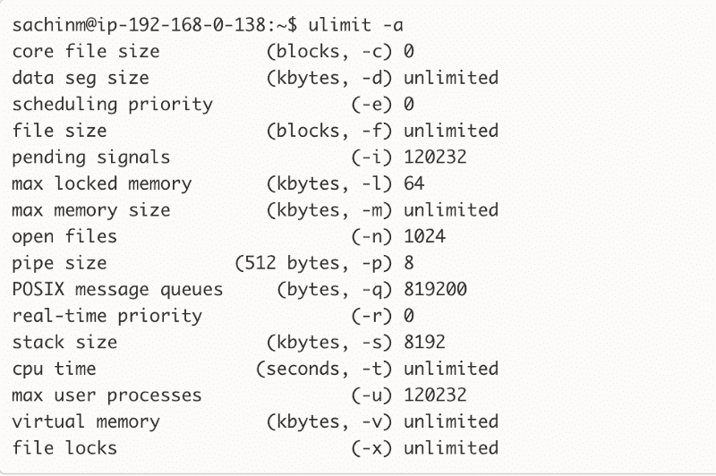
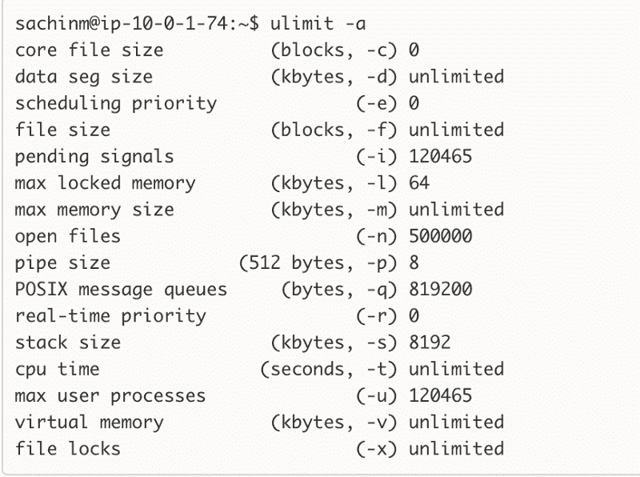
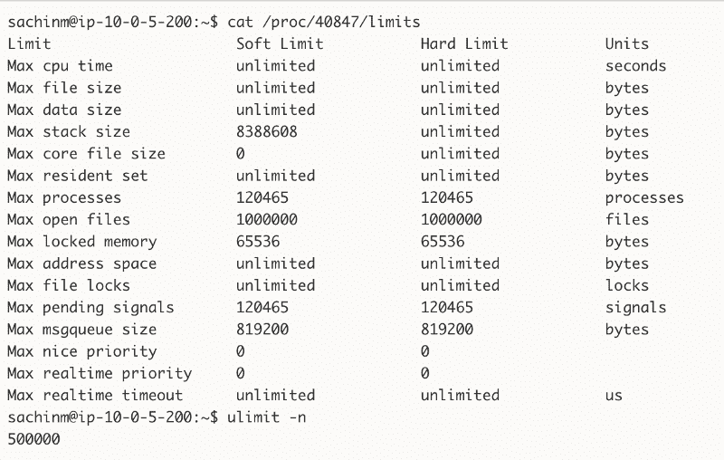

# 负载测试 HAProxy(第 1 部分)

> 原文：<https://www.freecodecamp.org/news/load-testing-haproxy-part-1-f7d64500b75d/>

作者:Sachin Malhotra

# 负载测试 HAProxy(第 1 部分)


这是关于负载测试 HAProxy 的 3 部分系列的第一篇文章，ha proxy 是一个可靠的、高性能的 TCP/HTTP 负载平衡器。

负载测试？HAProxy？如果所有这些对你来说都是希腊语，不要担心。我将提供内联链接来阅读我在这篇博文中谈论的所有内容。

作为参考，我们当前的堆栈是:

*   在亚马逊 EC2 上托管的实例(这个不重要)
*   用于操作系统的 Ubuntu 14.04(可信)
*   [流程管理主管](http://supervisord.org/)

在生产中，我们有大约 30 个左右的 HAProxy 负载平衡器，帮助我们将流量路由到后端服务器，这些服务器处于自动扩展模式，因此没有固定的数量。全天后端服务器的数量从 12 到 32 个不等。

[这篇文章](https://www.digitalocean.com/community/tutorials/an-introduction-to-haproxy-and-load-balancing-concepts)应该可以帮助你了解负载平衡的基础知识，以及它如何与 HAProxy 一起工作。它还将解释可用的路由算法。

回到我们手头的主题，即负载测试 HAProxy。

在此之前，我们从来没有付出任何努力来找出我们的 HAProxy 设置在处理 HTTP 和 HTTPs 请求方面的局限性。目前，在生产中，我们有 4 个核心，30g 的 HAProxy 机器实例。

[**推出亚马逊 EC2 R4 实例，下一代内存优化实例**](https://aws.amazon.com/about-aws/whats-new/2016/11/introducing-amazon-ec2-r4-instances-the-next-generation-of-memory-optimized-instances/)
[*你现在可以推出 R4 实例，下一代亚马逊 EC2 内存优化实例，功能更大……*aws.amazon.com](https://aws.amazon.com/about-aws/whats-new/2016/11/introducing-amazon-ec2-r4-instances-the-next-generation-of-memory-optimized-instances/)

在我写这篇文章的时候，我们正在将我们的全部流量(HTTP)转移到 HTTPs(即加密流量)。但在继续之前，我们需要对以下问题给出一些明确的答案:

1.  **当我们将流量从非 SSL 转移到 SSL 时，会有什么影响？** CPU 肯定会受到影响，因为 SSL 握手不是普通的 3 次握手，而是 5 次握手，握手完成后，使用握手期间生成的密钥对进一步的通信进行加密，这必然会占用 CPU。
2.  **由于在 HAProxy 级别终止 SSL，生产中可能会达到哪些其他硬件/软件限制**。我们也可以使用 HAProxy 提供的 SSL 直通选项，它在后端服务器上终止/解密 SSL 连接。然而，在 HAProxy 级别的 SSL 终止更有性能，所以这是我们打算测试的。
3.  **为支持我们今天看到的负载类型，生产所需的最佳硬件是什么**。现有的硬件是否可以扩展，或者我们是否需要更大的机器？这也是我们想通过这个测试得到答案的主要问题之一。

为此，我们专门对 HAProxy 版进行了负载测试，以找出上述问题的答案。在这篇博文中，我不会概述我们所采用的方法，也不会概述这项工作的结果。

相反，我将讨论任何负载测试实践的一个重要方面，这是我们大多数人容易忽略的。

### 尤利米特尔

如果您曾经做过任何类型的负载测试，或者托管过任何服务于大量并发请求的服务器，您肯定会遇到可怕的*“太多打开的文件”*问题。


任何压力测试练习的一个重要部分是您的负载测试客户端建立到您的后端服务器或代理(如中间的 HAProxy)的大量并发连接的能力。

很多时候，我们最终成为客户端的瓶颈，无法生成我们期望的负载量。出现这种情况的原因并不是因为客户端性能不佳，而是完全在硬件层面上的其他原因。

Ulimit 用于限制用户级资源的数量。出于所有与负载测试环境相关的实际目的，ulimit 给出了系统上单个进程可以打开的文件描述符的数量。在大多数机器上，如果您检查文件描述符的限制，结果是这个数字= **1024。**



Staging Ulimit Config

如您所见，在我们的分段设置中，打开文件的数量是 1024 个。打开一个新的 TCP 连接/套接字也算作一个打开的文件或文件描述符，因此有限制。

这通常意味着单个客户端进程只能打开 1024 个到后端服务器的连接，不能再多了。这意味着在继续下一步之前，您需要在您的负载测试环境中将这个限制增加到一个非常高的数字。检查我们生产机器上的 ulimit 设置。



Production Level Ulimit config

这些信息通常是你在谷歌搜索 10 秒钟后会找到的，但是记住 *ulimit 并不能保证给你你的进程实际拥有的限制！在您初始化 shell 之后(或之前),有一百万种方法可以修改进程的限制。因此，您应该做的是启动`top`、`[htop](http://hisham.hm/htop/)`、`ps`，或者任何您想用来获取有问题的进程的 ID 的东西，并执行`cat /proc/{process_id}/limits`:*



> 此特定进程的最大打开文件数不同于我们在此服务器上设置的系统范围限制。

让我们进入有趣的部分。提高:D 的极限

### 你来这里读的东西:提高限制

有两种方法可以更改计算机上的 ulimit 设置。

1.  ***ulimit-n<some _ value***>。这将仅更改当前 shell 会话的 ulimit 设置。当您打开另一个 shell 会话时，您又回到了起点，即 1024 个文件描述符。所以这很可能不是你想要的。
2.  ***fs . file-max = 500000***。将这一行添加到文件***/etc/sysctl . conf .***的末尾，并添加以下内容
    `* soft nofile` ***500000***
    `* hard nofile` ***500000***
    `root soft nofile` ***500000***
    `root hard nofile` ***500000***

*基本上表示我们正在为除 root 之外的所有用户设置这些值。“软或硬”基本上代表软或硬限制。下一个条目指定了我们要更改其限制值的项目，在本例中为 nofile，这意味着打开文件的数量。最后，我们有我们想要设置的值，在本例中是 500000。这里的*并不适用于根用户，因此最后两行专门用于根用户。

完成此操作后，您需要重启系统。遗憾的是，是的:(并且这些变化应该反映在 ulimit -n 命令中。


万岁！。拍拍自己的背。您已成功更改系统的 ulimit 设置。然而，改变这一点并不一定会影响系统上运行的所有用户进程。很有可能，即使更改了系统范围的 ulimit，您也可能会发现 */etc/ < pid > /* 限制给出的数字比您预期的要小。


在这种情况下，您几乎可以肯定有一个过程管理器，或者类似的东西，它正在打乱您的限制。您需要记住，进程继承了其父进程的限制。因此，如果您有一个类似于管理您的进程的监管者，他们将继承监管者守护进程的设置，这将覆盖您对系统级别限制所做的任何更改。

[Supervisor 有一个配置变量](http://supervisord.org/configuration.html#supervisord-section-values)，设置其主进程的文件描述符限制。显然，这个设置会被它启动的所有进程继承。要覆盖默认设置，您可以在`[supervisord]`部分向`/etc/supervisor/supervisord.conf`添加以下行:

```
minfds=500000
```

更新此限制将导致由主管控制的所有子流程继承此更新的限制。您只需要重新启动 supervisor 守护程序就可以使这个更改生效。

请记住，在任何想要打开大量并发连接的机器上都要这样做。无论是负载测试场景中的客户端还是试图服务于大量并发请求的服务器。

在第二部中，我们将学习如何对付 ***Sysctl 端口范围怪物*** 。

请让我知道这篇博文对你有什么帮助。另外，如果你认为这篇文章对某人有用，请推荐(❤)这篇文章。