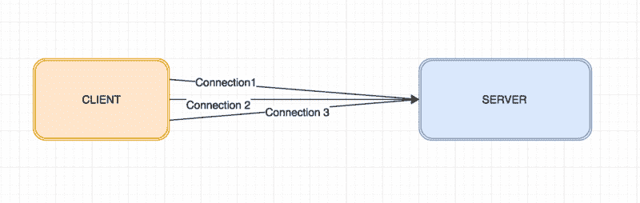
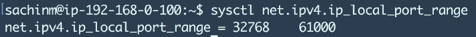
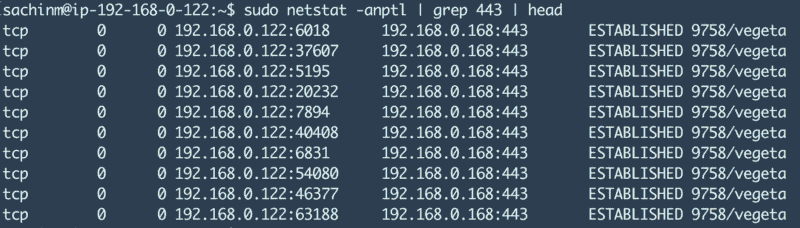
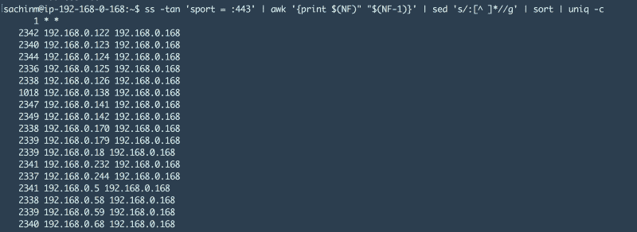
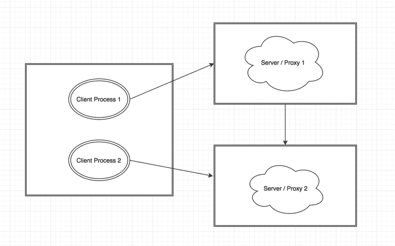

# 负载测试 HAProxy(第 2 部分)

> 原文：<https://www.freecodecamp.org/news/load-testing-haproxy-part-2-4c8677780df6/>

作者:Sachin Malhotra

# 负载测试 HAProxy(第 2 部分)


这是关于著名的 TCP 负载平衡器和反向代理 HAProxy 的性能测试的 3 部分系列的第 2 部分。如果你还没有浏览过之前的帖子，我强烈建议你去浏览一下，以了解一些背景知识。

[**负载测试 HAProxy(Part-1)**](https://medium.com/@sachinmalhotra/load-testing-haproxy-part-1-f7d64500b75d)
[*负载测试？HAProxy？如果所有这些对你来说都是希腊语，不要担心。我将提供内联链接来阅读什么…*medium.com](https://medium.com/@sachinmalhotra/load-testing-haproxy-part-1-f7d64500b75d)

这篇文章将关注 TCP 端口耗尽问题以及我们如何处理它。在上一篇文章中，我们讨论了如何调整内核级和进程级的 ulimit 设置。这篇文章的重点是修改 sysctl 设置，以克服端口耗尽的限制。

### SYSCTL 本地端口范围和孤立套接字

端口耗尽是一个会导致 TCP 与网络上其他机器的通信失败的问题。大多数情况下，只有一个进程会导致这个问题，重启它会暂时解决这个问题。然而，根据系统负载的不同，它会在几个小时或几天后恢复正常。

端口耗尽并不意味着端口实际上变得疲劳。当然，这是不可能的，因为计算机不是人类，端口不会疲劳。真相要阴险得多。端口耗尽仅仅意味着系统没有更多的*临时端口*来与其他机器/服务器通信。

在继续之前，*让我们理解 TCP 连接的组成，以及入站和出站连接的真正含义。*

在大多数情况下，每当我们谈到 TCP 连接和支持并发连接的高可伸缩性和能力时，我们通常指的是入站连接的数量。

比方说，HAProxy 在端口 443 上监听新的入站连接。如果我们说 HAProxy 可以支持 X 个并发连接，我们真正的意思是 X 个传入连接，并且所有这些连接都建立在 HAProxy 机器的端口 443 上。

如果这些连接是针对 HAProxy 的入站连接，那么这些连接必须是针对发起连接的客户端机器的*出站连接。*来自客户端的任何类型的通信都需要它们向服务器发起出站连接。

> 当通过 TCP 建立连接时，会在本地和远程主机上创建一个套接字。这些套接字然后被连接以创建一个套接字对，该套接字对由唯一的 4 元组描述，该元组由本地 IP 地址和端口以及远程 IP 地址和端口组成。



3 TCP connections from client to server/proxy

如果您理解了四元组的概念，您将会意识到，在到同一后端服务器的出站连接或多个出站连接中，2 内容始终保持不变，即目的 IP 和目的端口。假设我们只考虑一台客户机，客户机 IP 也将保持不变。

这意味着出站连接的数量取决于可用于建立连接的客户端端口的数量。建立出站连接时，源端口是从临时端口范围中随机选择的，一旦连接被破坏，该端口就会被释放。这就是为什么这些港口被称为临时港口。

默认情况下，可用的本地临时端口总数约为 28000 个。



现在您可能会想，28k 是一个相当大的数字，是什么可能导致 28k 连接在一个时间点被用完呢？为了理解这一点，我们必须理解 TCP 连接的生命周期。

在 TCP 握手期间，连接状态从

同步发送→同步接收→已建立。一旦连接处于建立状态，这意味着 TCP 连接现在是活动的。*然而，一旦连接终止，*之前使用的本地端口不会立即变为活动状态。

连接进入一个称为 *TIME_WAIT 状态的状态，持续 120 秒，然后最终终止。*这是一个内核级设置，允许网络忽略任何延迟或无序的数据包。

> 如果你计算一下，在达到系统上 28000 个临时端口的所谓大限制之前，每秒 230 个并发连接不会超过**。在 HAProxy 或 NGINX 这样的代理上，这个限制很容易达到，因为所有的流量都通过它们路由到后端服务器。**

**当连接进入 TIME_WAIT 状态时，它被称为 ***孤立套接字*** ，因为在这种情况下，TCP 套接字不受任何套接字描述符的帮助，但仍被系统保持指定的时间，即默认为 120 秒。**

### **这个怎么检测？**

**理论上的东西说够了。让我们来看看如何确定系统是否达到了这个限制。我非常喜欢使用两个命令来找出系统上建立的 TCP 连接数。**

#### **套接字统计**

**socket statistics 命令是著名的 netstat 命令的一种替代，在呈现信息方面比 netstat 命令快得多，因为它直接从内核空间获取连接信息。为了掌握 ss 命令支持的不同选项，请查看**

**[**Linux ss 命令监控网络连接的 10 个例子**](http://www.binarytides.com/linux-ss-command/)
[*在之前的教程中我们看到了如何使用 netstat 命令获取网络/套接字连接的统计数据。然而……*www.binarytides.com](http://www.binarytides.com/linux-ss-command/)**

**“ss -s”命令将显示机器上已建立的 TCP 连接的总数。如果您看到这个达到 28000 标记，很可能是该机器上的临时端口已经用完了。 ***注意:*** 如果多个服务在同一台机器的不同端口上运行，这个数字可能会高于 28k。**

#### **Netstat**

**netstat 命令是一个非常著名的命令，它提供关于在机器的网络堆栈上建立的各种连接的信息。**

```
`sudo netstat -anptl` 
```

**这将向您显示机器上所有连接的详细信息。详细信息包括**

*   **本地地址**
*   **远程地址**
*   **连接状态**
*   **过程 pid**

**我们还可以使用它来查看单个进程是否已经建立了到出站服务器的 28k 连接，这使我们能够深入了解端口耗尽问题。**

****

**例如:-上图显示 pid 为 9758 的进程已经与 IP 为 192.168.0.168、端口为 443 的外部机器建立了多个连接。我们可以清楚地看到，在事物的源端，有许多端口正在被使用。**

```
`sachinm@ip-192-168-0-122:~$ sudo netstat -anptl | grep '192.168.0.168:443' | cut -c69-79 | sort | uniq -c | sort -rn`
```

```
`5670 ESTABLISHED`
```

**这个修改后的命令将显示在端口 443 上与 192.168.0.168 建立的不同连接的状态。目前有 5670 个连接。如果这个限制达到 28k，那么您应该考虑增加机器上临时端口范围的选项。**

**让我们来看看另一个有趣的命令，您可以在服务器端或代理端发出这个命令，以找出已经建立了多少个入站连接，以及是由哪些 IP 建立的。例如，查看以下命令的结果**

```
`ss -tan 'sport = :443' | awk '{print $(NF)" "$(NF-1)}' | sed 's/:[^ ]*//g' | sort | uniq -c`
```

****

**这表明大约有 14 台不同的机器建立了大约 2300 个连接，每台机器都使用 192.168.0.168。如果您仔细查看该命令，我们只过滤掉了端口 443 的结果。**

**找到问题已经够了。让我们直接开始寻找这个问题的解决方案。**

### **出路是什么？**

****

**不要害怕，因为 sysctl 只是碰巧是一个友好的怪物。有许多方法可以解决这个问题。**

#### **方法 1**

**解决这个问题的最实际的方法之一，也是您最有可能或者应该最终完成的方法，是将本地临时端口范围增加到最大可能值。如前所述，默认范围很小。**

```
`echo 1024 65535 > /proc/sys/net/ipv4/ip_local_port_range`
```

**这将把本地端口范围增加到一个更大的值。我们不能增加超过这个范围，因为最多只能有 65535 个端口，前 1024 个保留用于选择服务和目的。**

**请注意，在这个问题上您可能仍然会遇到瓶颈。然而，本地使用的不是 28000 个端口，而是 64000 个端口。不是一个充分证明的解决方案，但这是你可以做的事情，给你一些喘息的空间。**

**这是否意味着我只能从一台客户机上获得大约 64k 的并发连接？答案是否定的。**

****

**在这种情况下，一台客户机将能够生成大约 120，000 个并发连接，因为这两个进程都连接到两个不同的后端服务器或代理，从而连接到不同的目标 IP。**

#### **方法 2**

**另一个简单的解决方案是启用一个名为 ***tcp_tw_reuse 的 Linux TCP 选项。*** 该选项使 Linux 内核能够从 TIME_WAIT 状态的连接中回收一个连接槽，并将其重新分配给一个新的连接。**

```
`--> vim /etc/sysctl.conf`
```

```
`--&gt; Add the following line in the end# Allow reuse of sockets in TIME_WAIT state for new connections# only when it is safe from the network stack’s perspective.net.ipv4.tcp_tw_reuse = 1`
```

```
`--&gt; Reload sysctl settingssysctl -p`
```

#### **方法 3**

**使用更多的服务器端口。到目前为止，我们已经讨论了端口耗尽问题，这是因为在之前讨论的四元组逻辑中，目的地 Ip、目的地端口和源 Ip 保持不变。唯一改变的是客户端端口。**

**但是，如果服务器监听两个不同的端口而不是一个，那么我们就有两倍数量的临时端口可用，而不是一个。这种与第一种方法相结合的方法在一台机器上提供了大约 12 万个并发连接。**

**但是，您必须注意，在两个端口上运行服务器——实质上意味着在同一台机器上运行两台服务器——不会对硬件产生巨大影响。**

#### **方法 4**

**在真实的生产场景中，可能会有数百万并发用户同时访问系统。但是在负载测试场景中，这些用户是由运行在机器上的客户端人工生成的。**

**这里，65k 端口的限制再次影响了客户端。从客户端的角度来看，解决这个问题的唯一方法是增加产生负载的客户端机器的数量。在阅读本系列的下一部分时，您会发现我们不得不使用大约 14 台不同的机器来生成我们想要测试 HAProxy 的负载。**

### **把所有的放在一起**

**没有一种单一的配置可以解决你所有的问题，而且非常有效。它总是多种事物的结合最终会成功。**

**对于我们来说，作为负载测试 HAProxy 的先决条件，我们遵循方法#1 和方法#2，并最终方法#3，在一台 HAProxy 机器上生成一个巨大的... 200 万并发连接的巨大负载。**

**[这是这个系列的最后一部分](https://medium.freecodecamp.com/how-we-fine-tuned-haproxy-to-achieve-2-000-000-concurrent-ssl-connections-d017e61a4d27)，在这里我将把产生这种负载的所有组件、我们所做的调整以及从中获得的知识放在一起。**

**请让我知道这篇博客文章对你有什么帮助，并关注这一系列文章的最后部分。另外，如果你认为这篇文章对某人有用，请推荐(❤)这篇文章。**